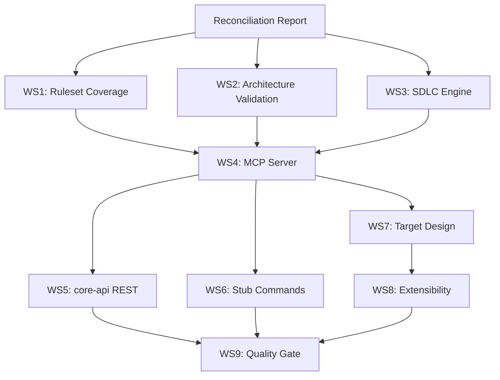

# Evolith Core — Intelligent Data Strength Assessment

> **Bilingual Navigation:** [Versión en Español](./evolith-core-intelligent-data-strength-assessment.es.md)

**Status:** Active Tracking
**Owner:** Evolith Architecture Board
**Last Updated:** 2026-06-26
**Scope:** smart-cli + MCP + core-api interfaces at 100% executable
**Related Vision:** [Evolith Strategic Validation and Composition Framework](./evolith-strategic-validation-and-composition-framework.md)
**Supersedes:** `reference/products/smart-cli/docs/planning/sdk-cli-mcp-current-state-assessment.md` (SUPERSEDED — context only)

This document defines the implementation workstreams to bring Evolith's interfaces (smart-cli, MCP, core-api) to 100% executable state, validating the core as intelligent data. It is the authoritative implementation plan, reconciled against live governance boards.

---

## 0. Mandatory Pre-Implementation Step

Before writing code, read and reconcile the real state against these living boards. Treat their status and priority as authoritative:

- [Gap Tracking Board](./gap-tracking.md)
- [Gap Reference Catalog](./gap-reference-catalog.md)
- [Executive Governance Summary](./executive-summary.md)
- [SDK/CLI/MCP Gap Analysis](../../../products/smart-cli/docs/planning/sdk-cli-mcp-gap-analysis.md)
- [SDK/CLI/MCP Implementation Roadmap](../../../products/smart-cli/docs/planning/sdk-cli-mcp-implementation-roadmap.md)

If an item below is already closed on the board, mark it DONE and do not redo it. If the board has items not listed here, INCLUDE them.

---

## 1. Product Principle (The Standard)

smart-cli, MCP, and core-api are INTELLIGENT INTERFACES, not passive pipes. Each must:

- **Orchestrate**, **query**, and **VALIDATE** each SDLC stage and architecture
- Run the logic itself (invoke OPA, resolve the gate, emit verdict)
- Deliver to the consumer (LLM/agent/Evolith Tracker) a **PRE-RESOLVED VERDICT**, not raw data for the consumer to reason about

Reference external consumer: Evolith Tracker (lives outside this repo).

---

## 2. Governance Note

The "do not implement until Architecture Board approval" brake applies to the NEW TARGET DESIGN (Evidence Graph, Gate Decision, Phase Transition, provider ports, tenant authority). Assume that brake was lifted for this task. Even so: for each piece of the new design, verify that the governing ADR exists; if missing, GENERATE the ADR before the code and reference it.

---

## 3. Reconciliation Report Template

| ID | Item | Board Status | Action |
|---|---|---|---|
| WS1-01 | f1-modular-monolith ruleset | `TODO` | Implement |
| WS1-02 | f2-distributed-modules ruleset | `TODO` | Implement |
| ... | ... | ... | ... |

> **Note:** This table must be populated by scanning the gap-tracking board before any implementation begins.

---

## 4. Workstreams — Implement to 100%

### WS1 — Ruleset Coverage (Core Validation)

**State baseline:** ~40%. **Target:** 100% of repo rulesets evaluable by CLI.

- Implement uncovered rulesets: `f1-modular-monolith`, `f2-distributed-modules`, `f3-microservices`, `compliance-baseline`, `definition-of-done`, `engineering-manifesto`, `repository-taxonomy`, `phase-gates`, `quality-thresholds`, `satellite-contracts`, `executive-scorecards` (reconcile against real repo).
- Each ruleset must execute via REAL OPA/Rego (engine invoked, input evaluated), not hardcoded checks in TypeScript.
- Add unit test per ruleset, including `RulesetValidatorService` (currently without tests).

### WS2 — Architecture Validation (Currently Absent)

`smart-cli validate` must verify:

- F1/F2/F3 rules by topology (the 8 repo topologies: progressive-axis, integration, execution, data, ai).
- Hexagonal limits, domain layer isolation, multi-tenancy.
- Phase 1 boundary: no business data (budget/ROI/costs); only authorized: Evolith Tracker ACL and Funnel 0. Report violations.

### WS3 — Executable SDLC Engine (Currently Mock)

Replace MOCK/POC with real logic:

- `sdlc handoff` (Phase Transition): validate exit gate passes before allowing transition; emit Gate Decision with evidence.
- `sdlc generate-domain`: real generation, not [MOCK].
- Model each quality gate as QUERYABLE DATA: what artifacts it requires and what rulesets must pass. Map gate → required artifacts → rules.

### WS4 — MCP Server at 100% (Critical Blocker for LLM Consumption)

**State baseline:** JSON-RPC stdio + HTTP/SSE transports exist; tool/resource/prompt/metrics handlers exist but lack evidence and green status.

- Expose as MCP TOOLS the evaluation operations: validate ruleset, validate architecture, evaluate gate, resolve phase — returning resolved verdict.
- Expose the corpus (topologies, ADRs, rulesets) as RESOURCES for retrieval.
- Connect `WatcherService` → MCP: architectural drift detection must notify MCP clients (currently only logs).
- Produce MCP SMOKE EVIDENCE (board requires for release).

### WS5 — core-api (REST)

- Expose via REST the same evaluation operations as MCP/CLI, routing to the SAME logic layer (no rule duplication). One engine, three facades.
- Define ingestion contract: shape with which an external client (e.g., Evolith Tracker) declares its architecture and SDLC state for evaluation.
- Updated OpenAPI describing EVALUATION OPERATIONS, not just resources.

### WS6 — Remaining Stub Commands

Implement real logic for:

- `agents` (agent installation/onboarding)
- `upgrade` (safe satellite upgrade)
- `docs` (scaffolding)
- `scaffold` (replace `setTimeout` mock with real execution)

### WS7 — New Target Design (Requires ADR per Piece)

Implement, with prior ADR: Evidence Graph, Gate Decision, Phase Transition, provider ports (plugin model: adaptable/interchangeable/replaceable tool), tenant authority. Core defines, providers execute, CLI/MCP evaluate, Tracker decides and audits.

### WS8 — Extensibility (Open-Source, Collaborators)

- Plugin system for commands (today adding a command requires touching core).
- Contribution scheme for external collaborators to add topologies, designs, or rulesets, with automatic validation of contributions and quality gate on PR.

### WS9 — Quality and Release-Gate

- COMPLETE test suite green (unit + real e2e, not stubs that only run the command without verifying behavior).
- Bilingual parity EN/ES (including SDK planning notes that currently lack ES counterpart). The parity hook must pass.
- Documentation coverage via harness (`COVERAGE_REPORT.md` green).

---

## 5. Acceptance Criteria (Measurable "100%")

1. An external consumer (LLM or Evolith Tracker) can, via MCP or REST or CLI:
   - Send project state → receive resolved gate verdict (pass/fail + which rule + why + evidence).
   - Demonstrate with an E2E "hello-world evaluation" case end-to-end.
2. 100% of repo rulesets evaluable via real OPA.
3. 8 topologies with active architecture validation.
4. Executable SDLC gates (zero mocks).
5. Three interfaces route to the SAME engine (no duplicated logic).
6. Green suite + EN/ES parity + MCP smoke present.

---

## 6. Deliverables

1. Reconciliation report: what on the board is already DONE vs. what remains.
2. Execution plan ordered by dependency (which WS unblocks which).
3. Implementation by WS with tests.
4. The E2E "hello-world evaluation" case working.
5. New ADRs generated for WS7 pieces.
6. List of violations detected (Phase 1 with business data / parity).

---

## 7. Constraints

- Stack: TypeScript/NestJS/React, monorepo, OPA/Rego, MCP. Do not deviate.
- Do not duplicate validation logic between CLI/MCP/REST: one layer, three facades.
- Do not invent commands or rulesets: reconcile against repo. ABSENT is valid.
- Rules in executable Rego, not decorative checks in TS.
- Start with the reconciliation report. Do not write code until delivering it.

---

## 8. Dependency Graph

---

## 9. References

- [Gap Tracking Board](./gap-tracking.md)
- [Gap Reference Catalog](./gap-reference-catalog.md)
- [Executive Governance Summary](./executive-summary.md)
- [Multi-Topology Reference Corpus Implementation Plan](./multi-topology-reference-corpus-implementation-plan.md)
- [SDK/CLI/MCP Gap Analysis](../../../products/smart-cli/docs/planning/sdk-cli-mcp-gap-analysis.md)
- [SDK/CLI/MCP Implementation Roadmap](../../../products/smart-cli/docs/planning/sdk-cli-mcp-implementation-roadmap.md)
- [ADR-0090 Rule Language Policy](../../adr/adr-0090-rule-language-policy.md)

---
[Back to Vision Hub](./README.md)