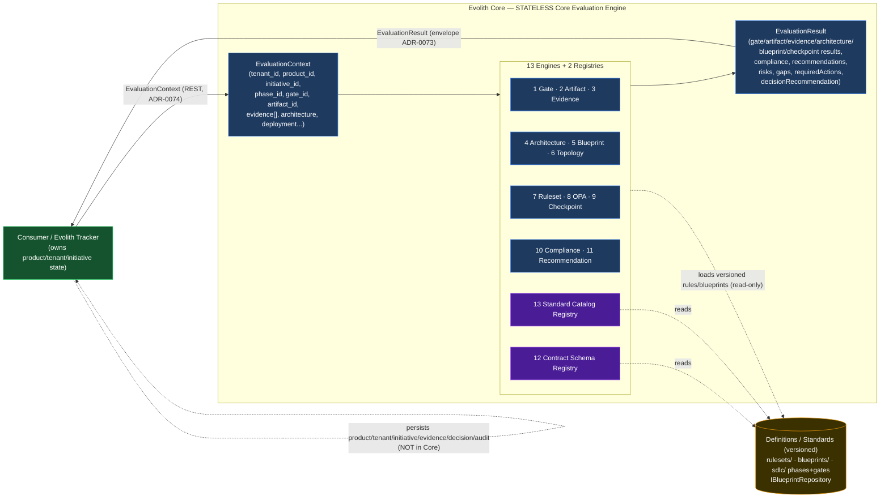
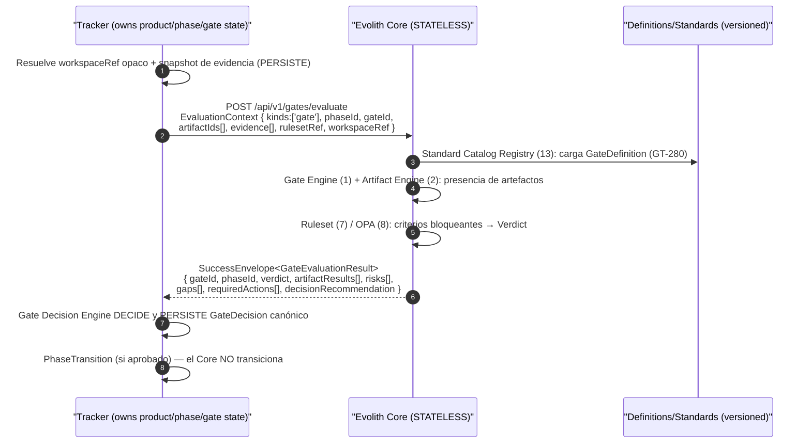
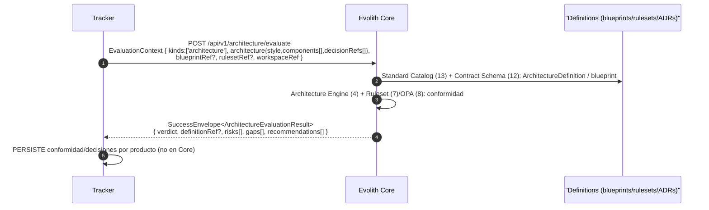
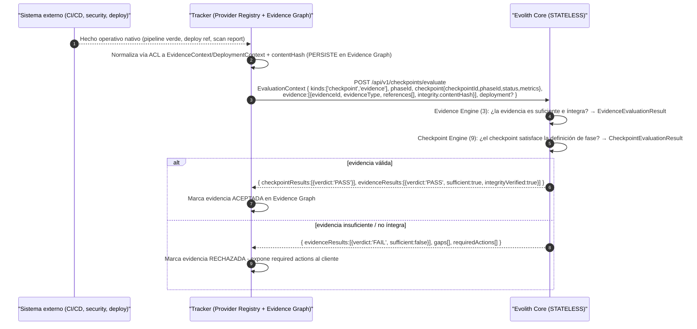

# Evolith Core — Diseño Corregido: Stateless Core Evaluation Engine

> **Navegación bilingüe:** [English version](./core-evaluation-engine-design.md)

**Clasificación:** Propuesta de Diseño Corregida — Modelo de Evaluación del Core
**Estado:** *Proposed Design — Pending Architecture Board Review* (corrige, en altitud, a `product-initiative-governance-redesign`)
**Alcance:** Solo documentación — no autoriza cambios de código hasta aprobación del Architecture Board.
**Owner:** Evolith Architecture Board
**Corrige:** ADR-0101 supersede la Decisión 1 de ADR-0100; este documento supersede en parte a `product-initiative-governance-redesign` (Entregables 2/4/10/11/12 y flujos de escritura del 13).
**Origen:** Análisis multi-agente anclado en código real (9 agentes; verificación de consistencia realizada manualmente tras corte de sesión del agente crítico — ver Apéndice).

---

## Tesis corregida

> **Evolith Core es un Core Evaluation Engine STATELESS.** No es una base de datos operativa ni administra/persiste productos, tenants, iniciativas, usuarios, épicas, historias, tareas o sprints. **Recibe un `EvaluationContext`** desde Evolith Tracker (u otro consumidor), **lo evalúa** contra definiciones/estándares versionados (fases, gates, artefactos, blueprints, topologías, rulesets, policies OPA), y **devuelve un `EvaluationResult`** estructurado. `tenant_id`/`product_id`/`initiative_id` son **identificadores de contexto opacos**, jamás entidades del Core. **Evolith Tracker** posee, persiste y audita producto/tenant/iniciativa/evidencia/decisión/despliegue; las herramientas externas siguen siendo la fuente de verdad del detalle operativo del delivery.

## Por qué este documento corrige al anterior

El diseño previo (`product-initiative-governance-redesign`, commit `4a156f3b`) diagnosticó bien la conflación gobierno↔ejecución, pero cometió un **error de altitud**: modeló `Producto`/`Iniciativa`/`Evidencia`/`Decisión` como **entidades de dominio del Core con repositorios, casos de uso mutadores y endpoints de escritura** (`IProductRepository`, `RegisterProduct`, `POST /api/v1/products`…). Eso viola el criterio corregido y contradice el código real, que **ya es un evaluador stateless sin persistencia operativa**. Esta corrección devuelve esas entidades a su altitud correcta: **contexto de entrada** (`ProductContext`/`InitiativeContext`/`EvidenceContext`) y **salidas del resultado** (`DecisionRecommendation`/`Recommendation`). No se construye persistencia nueva; se **elimina** la propuesta de persistencia. La reconciliación detallada está al final de este documento.

## Índice de entregables

| # | Entregable | Sección |
|---|---|---|
| 1 | Diagnóstico del error conceptual actual | §1 |
| 2 | Principio rector corregido | §2 |
| 3 | Responsabilidades Core vs Tracker vs externos | §3 |
| 4 | Modelo conceptual corregido | §4 |
| 5 | Diseño de `EvaluationContext` | §"Contratos canónicos" |
| 6 | Diseño de `EvaluationResult` | §"Contratos canónicos" |
| 7 | Catálogo de engines internos | §7 |
| 8 | Modelos que el Core SÍ define | §8 |
| 9 | Modelos que el Core solo recibe como contexto | §9 |
| 10 | Contratos / API conceptuales Tracker↔Core | §10 |
| 11–17 | Flujos (gate, artefacto, evidencia, arquitectura, topología, blueprint, checkpoint) | §11–§17 |
| — | Anatomía de evaluación de cada engine (análisis Q6–Q15) | §"Anatomía de evaluación" |
| 18 | Cambios en rulesets | §18 |
| 19 | Cambios en policies OPA | §19 |
| 20 | Cambios en blueprints | §20 |
| 21 | Cambios en documentación | §21 |
| 22 | Cambios en taxonomía | §22 |
| 23 | Riesgos y mitigaciones | §23 |
| 24 | Roadmap de refactorización | §24 |
| 25 | Backlog sugerido (épicas/historias/tareas) | §25 |
| — | Reconciliación con el diseño previo | §"Reconciliación" |
| — | Verificación de consistencia + matriz de cobertura | Apéndice |

---


## 1. Diagnóstico del error conceptual actual

El diseño previo (`reference/core/product-initiative-governance-redesign.md`, commit `4a156f3b`) acertó en el diagnóstico (conflación historias↔evidencia de gate, evaluación≠decisión, externalizar schemas ágiles, dual-engine, multi-tenancy como contexto) pero **cometió un error de altitud arquitectónica**: convirtió a Producto e Iniciativa en **entidades de dominio propias del Core con persistencia y CRUD**. Esto contradice tanto el criterio corregido como el propio código real, que ya es un evaluador stateless.

**Evidencia del error en el doc previo (citas literales):**

| Violación | Ancla en el doc previo | Por qué viola el criterio corregido |
|---|---|---|
| Crea repos de operación | `product-initiative-governance-redesign.md:1251,1258,1265,1272,1282` — `IProductRepository`, `IInitiativeRepository`, `IEvidenceRepository`, `IDecisionRecordRepository`, `IAdvisoryRepository` | El Core no posee ni persiste producto/tenant/iniciativa/evidencia/decisión. Esos son contexto de entrada o salidas del resultado. |
| Use-cases que mutan/persisten | `:1308-1314` — `RegisterProduct`, `OpenInitiative`, `AttachExternalReference`, `RecordEvidence`, `RecordDecision`, `RequestAdvisory` | "Register/Open/Record/Attach" son operaciones de un sistema operativo con estado; el Core solo evalúa y devuelve. |
| Endpoints de escritura operativa | `:1410-1521` — `POST /api/v1/products`, `/products/:id/initiatives`, `/initiatives/:id/evidence`, `/initiatives/:id/decisions`, `/products/:id/advisories` | El Core no expone escritura de entidades de negocio; solo recibe `EvaluationContext` y devuelve `EvaluationResult`. |
| "Iniciativa debe persistirse como entidad" | `:1226` — *"`Iniciativa` today is an opaque 'never persisted' string … It must be persisted as an entity."* | Contradice directamente `gate-evidence.ts:87-89` (`ExecutionContext … Never persisted or interpreted`). El opaco era lo correcto, no la deuda. |
| "Producto persiste arquitectura/decisiones" | `:149` — *"Persists architecture/decisions, not execution"* | Persistir arquitectura/decisiones por producto es estado operativo del Tracker, no del Core. |

**Contraste con el código real (el Core HOY ya es stateless-evaluador):**

| Hecho del código | Ancla | Implicación |
|---|---|---|
| El pipeline es un motor puro: `manifest → topología → gate (GT-280) → reglas Rego → verdict`, sin persistencia | `satellite-evaluation-pipeline.service.ts:39-98` | El Core ya **compone evaluadores**, no administra entidades. |
| `EvaluateGateInput` recibe `phase/projectPath/corePath`, no `productId`/`initiativeId` como entidad | `evaluate-gate.use-case.ts:45-55` | La unidad de entrada es contexto + rutas, no una entidad propia. |
| Contexto de ejecución explícitamente efímero | `gate-evidence.ts:87-89` — `ExecutionContext { initiative?; tenant?; phase? }` *"Never persisted or interpreted"* | `tenant`/`initiative` son **eco de contexto**, no entidades. |
| El Core declina datos de ejecución | `executive-scorecard-rule.handler.ts:55` — `result: 'skipped', 'Sprint throughput requires tracker data'` | Precedente firme: el Core **no resuelve** datos operativos; los delega al Tracker. |
| El consumidor pasa un identificador opaco; el Core nunca ve tenant/credenciales/paths de usuario | `workspace-reference-resolver.service.ts:9-11` | Patrón de aislamiento ideal: el Core recibe **referencias opacas de contexto**, no entidades de negocio. |
| **No existe ningún repo de producto/tenant/iniciativa/evidencia/decisión** (grep confirmado) | `grep` sobre `packages/`+`apps/` → 0 coincidencias | El doc previo proponía construir desde cero algo que el criterio prohíbe. |
| Único repo de gobierno = definición, no operación | `application/ports/blueprint-repository.port.ts` (`IBlueprintRepository`) | El Core solo "persiste" **definiciones versionadas** (blueprints/rulesets/standards), no instancias operativas. |

**Conclusión:** el doc previo "subió" Producto/Iniciativa de **contexto** a **entidad-con-repo**. La corrección los devuelve a su altitud correcta: `ProductContext`/`InitiativeContext` de entrada y `DecisionRecommendation`/`Recommendation` de salida. No se construye persistencia nueva; al contrario, se **elimina** la propuesta de persistencia y se preserva la naturaleza stateless ya presente en el código.

---

## 2. Principio rector corregido del Core

> **Evolith Core es un Core Evaluation Engine STATELESS: el núcleo normativo, arquitectónico y evaluador que recibe un `EvaluationContext`, lo evalúa contra DEFINICIONES/ESTÁNDARES versionados (fases, gates, artefactos, blueprints, topologías, rulesets, policies OPA) y devuelve un `EvaluationResult` estructurado — sin poseer ni persistir jamás productos, tenants, iniciativas ni datos de ejecución.**

- **Stateless respecto al negocio**: cero persistencia de producto/tenant/iniciativa/evidencia/decisión/estado operativo. La única "persistencia" del Core son **definiciones/estándares versionados** (`rulesets/`, `reference/core/architecture/blueprints/`, `reference/core/sdlc/`, `IBlueprintRepository`).
- **Modelo de interacción**: `EvaluationContext` (entrada) → 13 engines/registries → `EvaluationResult` (salida). El Core nunca llama de vuelta para mutar.
- **Producto/tenant/iniciativa = solo contexto**: `tenant_id`/`product_id`/`initiative_id`/`initiative_group_id`/`phase_id`/`gate_id`/`artifact_id` son **identificadores de contexto opacos**, nunca entidades propias (patrón `workspace-reference-resolver.service.ts:9-11`, `gate-evidence.ts:87-89`).
- **Evaluación ≠ decisión**: el Core emite verdicts técnicos, `RiskFinding`, `GapFinding`, `RequiredAction` y `DecisionRecommendation` (no vinculante). La **decisión canónica** la toma y persiste el Tracker (`sdlc-tracker-technical-interfaces.md:30` *"Tracker decides and audits"*).
- **Datos de ejecución se delegan, no se resuelven**: si una regla requiere datos operativos, el Core devuelve `SKIP`/indeterminado (precedente `executive-scorecard-rule.handler.ts:55`), nunca los persigue.
- **Dual-engine native + OPA** (ADR-0041) y **envelope unificado** (ADR-0073) se mantienen como mecanismos de evaluación y de forma de salida.

---

## 3. Tabla de responsabilidades: Core vs Tracker vs sistemas externos

| Responsabilidad | Evolith Core | Evolith Tracker | Sistemas externos (Jira/ADO/GitHub) |
|---|---|---|---|
| Definir estándares (fases SDLC, gates, artefactos, evidencias aceptables, blueprints, topologías, rulesets, policies OPA, taxonomías) | **Dueño** (fuente de verdad; versiona definiciones) | Consume snapshot versionado | — |
| Persistir definiciones/estándares versionados | **Sí** (`rulesets/`, `reference/core/architecture/blueprints/`, `reference/core/sdlc/`, `IBlueprintRepository`) | Referencia por `rulesetRef`/`schemaVersion` | — |
| Persistir producto / tenant / iniciativa / agrupación | **No** (solo contexto opaco) | **Dueño** (`TENANT→PRODUCT→SDLC_PROCESS`, `sdlc-tracker-technical-interfaces.md:415-428`) | Espejo operativo parcial |
| Persistir épicas / historias / tareas / sprints / backlogs / tableros | **No** | Referencia vía `ExternalReference` | **Dueño** (estado operativo nativo) |
| Persistir evidencia / fases ejecutadas / gates ejecutados | **No** (recibe `EvidenceContext`/`CheckpointContext`) | **Dueño** (Evidence Graph, Phase Execution) | Producen artefactos/commits/pipelines |
| Evaluar (gates, artefactos, evidencia, arquitectura, blueprint, ruleset, OPA, checkpoint, compliance) | **Dueño** (13 engines) | Invoca al Core; nunca reimplementa reglas | Aportan facts para la evaluación |
| Recomendar topología / arquitectura / siguiente acción | **Dueño** (`Recommendation`, `DecisionRecommendation`) | Consume y muestra | — |
| **Decidir** (verdict canónico de gate, aprobar/rechazar/waiver, avance de fase) | **No** (solo `DecisionRecommendation` no vinculante) | **Dueño** (`GateDecision`, `PhaseTransition`, aprobaciones, excepciones) | — |
| Auditoría operacional (quién aprobó, cuándo, con qué evidencia/excepción) | **No** | **Dueño** (`GET /decisions/:id/audit`) | Logs nativos propios |
| Integraciones operativas (sincronizar, leer estado, ACL por proveedor) | **No** (nunca ve credenciales/tokens — `workspace-reference-resolver.service.ts:9-11`) | **Dueño** (Provider Registry + ACL) | Endpoints/eventos nativos |
| Identidad / autorización / multi-tenancy operativa | **No** (tenant es contexto, no se interpreta) | **Dueño** (UMS, tenant graph) | IdP propio |

---

## 4. Modelo conceptual corregido del Core



---

## 7. Catálogo de engines internos del Core

| # | Engine / Registry | Responsabilidad | Input (del `EvaluationContext`) | Output (en el `EvaluationResult`) | Ancla en código existente (qué reutiliza) |
|---|---|---|---|---|---|
| 1 | **Gate Evaluation Engine** | Evaluar un gate de fase: presencia de artefactos + criterios bloqueantes → verdict | `phase_id`, `gate_id`, `artifacts[]`, `evidence[]`, `workspaceRef` | `GateEvaluationResult` | `evaluate-gate.use-case.ts`; `satellite-evaluation-pipeline.service.ts:126-224` (`evaluateGate`); `phase-gate-validator.service.ts` |
| 2 | **Artifact Evaluation Engine** | Validar que cada artefacto requerido existe y satisface su regla | `artifacts[]`, `artifact_id`, `workspaceRef` | `ArtifactEvaluationResult[]` | `satellite-evaluation-pipeline.service.ts:134-213` (loop por `requiredArtifacts`) |
| 3 | **Evidence Evaluation Engine** | Comprobar suficiencia/integridad de evidencias declaradas (sin almacenarlas) | `evidence[]` (`EvidenceContext`) | `EvidenceEvaluationResult` | `src/rulesets/evidence/evidence-manifest.rules.json`; `src/rulesets/opa/evidence.rego` |
| 4 | **Architecture Evaluation Engine** | Evaluar conformidad arquitectónica del contexto declarado | `architecture` (`ArchitectureContext`) | `ArchitectureEvaluationResult` | `validate-satellite.use-case.ts`; handlers en `validators/evaluators/handlers/` |
| 5 | **Blueprint Evaluation Engine** | Verificar adherencia a un `BlueprintDefinition` versionado | `blueprintRef`, contexto | `BlueprintEvaluationResult` | `validate-blueprint.use-case.ts`; `domain/entities/blueprint.ts`; `IBlueprintRepository` |
| 6 | **Topology Recommendation Engine** | Resolver/recomendar topología arquitectónica | `topology?`, `architecture`, manifest | `Recommendation[]` (topología sugerida) | `topology-catalog.service.ts`; `satellite-evaluation-pipeline.service.ts:226-248` (`resolveTopology`) |
| 7 | **Ruleset Execution Engine** | Ejecutar rulesets nativos (motor native de ADR-0041) | `rulesetRef`, `workspaceRef` | findings → `complianceResult`/`risks` | `ruleset-validator.service.ts`; `RuleEvaluation` (`satellite-manifest.ts`) |
| 8 | **OPA Policy Evaluation Engine** | Ejecutar policies Rego (motor OPA de ADR-0041) | `rulesetRef`/policies, contexto | findings OPA → results | `validators/evaluators/opa-evaluator.ts`; `satellite-evaluation-pipeline.service.ts:173-201` |
| 9 | **Checkpoint Evaluation Engine** | Evaluar checkpoints/hitos intra-fase | `checkpoint` (`CheckpointContext`), `phase_id` | `CheckpointEvaluationResult` | `propose-phase-advance.use-case.ts` (propone, no muta); `PhaseTransitionProposal` (`gate-evidence.ts:79-85`) |
| 10 | **Compliance Evaluation Engine** | Agregar todos los sub-resultados en un veredicto de cumplimiento ponderado | todos los sub-resultados | `ComplianceResult` | `summary` de `satellite-evaluation-pipeline.service.ts:69-76` |
| 11 | **Recommendation Engine** | Derivar recomendaciones y `DecisionRecommendation` no vinculante | findings, gaps, risks | `Recommendation[]`, `DecisionRecommendation` | `remediationFor()` (`pipeline:103-111`); `propose-phase-advance.use-case.ts` |
| 12 | **Contract Schema Registry** | Servir/validar schemas de contratos de evaluación (versionados) | `schemaRef`, `schemaVersion` | schema resolution / validación | `src/rulesets/schema/` (`gate-evidence.schema.json`, `output-envelope.schema.json`) |
| 13 | **Standard Catalog Registry** | Servir definiciones canónicas: fases, gates, blueprints, topologías | `phase_id`, `gate_id`, `blueprintRef`, `topology` | definiciones resueltas (read-only) | `sdlc-data-loader.service.ts` (GT-280); `reference/core/sdlc/`; `reference/core/architecture/blueprints/` |

---

## 8. Modelos conceptuales que el Core SÍ debe definir

| Modelo | Tipo | Propósito | ¿Persiste? |
|---|---|---|---|
| `PhaseDefinition` | Definition | Definición canónica de una fase SDLC (discovery..release; `phase-id.ts:14`) | Sí (definición versionada) |
| `GateDefinition` | Definition | Criterios, artefactos requeridos y criterios bloqueantes de un gate | Sí (definición versionada) |
| `ArtifactDefinition` | Definition | Artefacto requerido + regla de validación | Sí (definición versionada) |
| `EvidenceDefinition` | Definition | Forma de evidencia aceptable e integridad esperada | Sí (definición versionada) |
| `ArchitectureDefinition` | Definition | Criterios arquitectónicos evaluables | Sí (definición versionada) |
| `BlueprintDefinition` | Definition | Plantilla de gobierno/topología (`domain/entities/blueprint.ts`) | Sí (definición versionada, `IBlueprintRepository`) |
| `TopologyDefinition` | Definition | Topología arquitectónica catalogada | Sí (definición versionada) |
| `RuleSetDefinition` | Definition | Conjunto de reglas (native) | Sí (definición versionada, `rulesets/`) |
| `PolicyDefinition` | Definition | Policy OPA/Rego | Sí (definición versionada, `src/rulesets/opa/`) |
| `EvaluationContext` | Contract (input) | Contrato de entrada que el consumidor envía | No (efímero, request-scoped) |
| `EvaluationResult` | Result | Contrato de salida agregado | No (efímero; lo persiste el consumidor) |
| `GateEvaluationResult` | Result | Verdict de un gate | No |
| `ArtifactEvaluationResult` | Result | Verdict por artefacto | No |
| `EvidenceEvaluationResult` | Result | Suficiencia de evidencia | No |
| `ArchitectureEvaluationResult` | Result | Conformidad arquitectónica | No |
| `BlueprintEvaluationResult` | Result | Adherencia a blueprint | No |
| `CheckpointEvaluationResult` | Result | Estado de checkpoint | No |
| `ComplianceResult` | Result | Cumplimiento agregado | No |
| `Recommendation` | Finding/Output | Recomendación accionable | No |
| `RiskFinding` | Finding | Riesgo detectado | No |
| `GapFinding` | Finding | Brecha detectada | No |
| `RequiredAction` | Finding | Acción requerida para cerrar brecha | No |
| `DecisionRecommendation` | Output | Recomendación de decisión **no vinculante** (decide el Tracker) | No |

---

## 9. Modelos que el Core solo debe recibir como contexto

| Modelo de contexto | Campos clave | Por qué NO es del Core |
|---|---|---|
| `TenantContext` | `tenantId` (opaco) | Tenant es frontera operativa del Tracker/UMS; el Core nunca lo interpreta (`workspace-reference-resolver.service.ts:9-11`) |
| `ProductContext` | `productId`, `tenantId`, `name?`, `repositoryRef?` | Producto es unidad de negocio persistida por el Tracker (`sdlc-tracker:416`) |
| `InitiativeContext` | `initiativeId`, `productId`, `kind?`, `title?` | Iniciativa es estado operativo del Tracker; en el Core es eco opaco (`gate-evidence.ts:87-89`) |
| `InitiativeGroupContext` | `initiativeGroupId`, `initiativeIds[]` | Agrupación es organización operativa, sin semántica evaluadora propia |
| `ExternalReferenceContext` | `system` (jira/ado/github), `externalId`, `url?`, `contentHash?` | Referencia a sistemas externos; el Core no integra ni lee su estado |
| `DeploymentContext` | `environment`, `releaseRef`, `status?` | Hechos de despliegue producidos por proveedores; el Core solo los evalúa como facts |
| `ArchitectureContext` | `style`, `components[]`, `decisions[]` (refs) | Descripción declarada para evaluar; no se persiste como estado del Core |
| `EvidenceContext` | `evidenceId`, `evidenceType`, `producer`, `references[]`, `integrity.contentHash` | Evidencia la posee el Evidence Graph del Tracker; el Core recibe referencias, no copias |
| `CheckpointContext` | `checkpointId`, `phaseId`, `status`, `metrics?` | Estado de avance ejecutado, propiedad del Tracker |

---

## Contratos canónicos (TypeScript)

> Reutilizan `Verdict` (`verdict/verdict.ts:14`) y `PhaseId` (`sdlc/phase-id.ts:14`). `tenant_id`/`product_id`/`initiative_id` son `string` de contexto, **nunca** entidades del Core. Estas firmas son la referencia obligatoria para los demás agentes.

```typescript
import { Verdict, VerdictReason } from '../domain/verdict/verdict';
import { PhaseId } from '../domain/sdlc/phase-id';

// ============================================================================
// INPUT — EvaluationContext (el consumidor/Tracker lo ENVÍA; el Core lo evalúa)
// El Core NUNCA persiste nada de esto. Todos los *_id son identificadores opacos.
// ============================================================================

/** Tipos de evaluación que el consumidor puede solicitar en una sola llamada. */
export type EvaluationKind =
  | 'gate' | 'artifact' | 'evidence' | 'architecture'
  | 'blueprint' | 'topology' | 'ruleset' | 'opa'
  | 'checkpoint' | 'compliance';

/** Eco opaco del tenant. Nunca interpretado ni persistido por el Core. */
export interface TenantContext {
  readonly tenantId: string;
}

export interface ProductContext {
  readonly productId: string;
  readonly tenantId: string;
  readonly name?: string;
  readonly repositoryRef?: string;
}

export interface InitiativeContext {
  readonly initiativeId: string;
  readonly productId: string;
  readonly tenantId: string;
  readonly kind?: string;
  readonly title?: string;
}

export interface InitiativeGroupContext {
  readonly initiativeGroupId: string;
  readonly initiativeIds: readonly string[];
}

export interface ExternalReferenceContext {
  readonly system: string;            // 'jira' | 'azure-devops' | 'github' | ...
  readonly kind: string;              // 'epic' | 'story' | 'issue' | 'pr' | ...
  readonly externalId: string;
  readonly url?: string;
  readonly contentHash?: string;      // referencia + hash; nunca copia de datos
}

export interface DeploymentContext {
  readonly environment: string;
  readonly releaseRef: string;
  readonly status?: string;
}

export interface ArchitectureContext {
  readonly style?: string;
  readonly components?: readonly string[];
  readonly decisionRefs?: readonly string[];   // referencias a ADRs, no copias
}

export interface EvidenceContext {
  readonly evidenceId: string;
  readonly evidenceType: string;
  readonly schemaRef?: string;
  readonly producer?: { actorType: 'human' | 'agent' | 'ci' | 'system'; actorId: string };
  readonly references?: readonly ExternalReferenceContext[];
  readonly integrity?: { contentHash: string; capturedAt?: string };
}

export interface CheckpointContext {
  readonly checkpointId: string;
  readonly phaseId: PhaseId;
  readonly status?: string;
  readonly metrics?: Readonly<Record<string, number | string>>;
}

export interface EvaluationContext {
  /** Qué evaluaciones se solicitan. */
  readonly kinds: readonly EvaluationKind[];

  // --- Identificadores OPACOS de contexto (NUNCA entidades del Core) ---
  readonly tenant?: TenantContext;
  readonly product?: ProductContext;
  readonly initiative?: InitiativeContext;
  readonly initiativeGroup?: InitiativeGroupContext;

  // --- Anclaje de evaluación ---
  readonly phaseId?: PhaseId;          // canónico (phase-id.ts:14)
  readonly gateId?: string;
  readonly artifactIds?: readonly string[];

  // --- Referencias versionadas a DEFINICIONES del Core ---
  readonly rulesetRef?: string;
  readonly rulesetVersion?: string;
  readonly blueprintRef?: string;
  readonly topologyRef?: string;
  readonly schemaRef?: string;

  // --- Referencia opaca al workspace (el Core nunca ve paths/credenciales) ---
  readonly workspaceRef?: string;     // patrón workspace-reference-resolver.service.ts:9-11

  // --- Facts/contexto declarados a evaluar ---
  readonly architecture?: ArchitectureContext;
  readonly evidence?: readonly EvidenceContext[];
  readonly deployment?: DeploymentContext;
  readonly checkpoint?: CheckpointContext;
  readonly externalReferences?: readonly ExternalReferenceContext[];

  /** Eco arbitrario devuelto sin interpretar (trazabilidad del consumidor). */
  readonly correlationId?: string;
  readonly passthrough?: Readonly<Record<string, unknown>>;
}

// ============================================================================
// FINDINGS — hallazgos transversales reutilizables
// ============================================================================

export type FindingSeverity = 'error' | 'warning' | 'info';
export type RiskLevel = 'low' | 'medium' | 'high' | 'critical';

export interface RiskFinding {
  readonly id: string;
  readonly level: RiskLevel;
  readonly category: string;          // 'security' | 'architecture' | 'compliance' | ...
  readonly message: string;
  readonly location?: string;
  readonly ruleRef?: string;
}

export interface GapFinding {
  readonly id: string;
  readonly requirementRef: string;    // qué definición/criterio no se cumple
  readonly severity: FindingSeverity;
  readonly message: string;
  readonly location?: string;
}

export interface RequiredAction {
  readonly id: string;
  readonly gapId?: string;            // brecha que cierra
  readonly description: string;
  readonly blocking: boolean;
  readonly remediation: string;
}

export interface Recommendation {
  readonly id: string;
  readonly kind: 'architecture' | 'topology' | 'process' | 'remediation' | 'next-step';
  readonly message: string;
  readonly rationale?: string;
  readonly references?: readonly string[];
}

/**
 * Recomendación de decisión NO vinculante. El Core recomienda; el Tracker
 * decide y persiste el GateDecision canónico (sdlc-tracker:30,179-204).
 */
export interface DecisionRecommendation {
  readonly subjectType: 'gate' | 'phase' | 'initiative' | 'product';
  readonly subjectRef: string;        // gateId / phaseId / initiativeId (opaco)
  readonly recommendedVerdict: Verdict;          // reutiliza Verdict (verdict.ts:14)
  readonly reason?: VerdictReason;
  readonly binding: false;                       // SIEMPRE false: el Core no decide
  readonly recommendedBy: 'evolith-core';
}

// ============================================================================
// SUB-RESULTS — un resultado por engine
// ============================================================================

export interface ArtifactEvaluationResult {
  readonly artifactId: string;
  readonly verdict: Verdict;
  readonly present: boolean;
  readonly ruleRefs: readonly string[];
  readonly gaps: readonly GapFinding[];
}

export interface GateEvaluationResult {
  readonly gateId: string;
  readonly phaseId: PhaseId;
  readonly verdict: Verdict;          // PASS | FAIL | WAIVE | SKIP
  readonly artifactResults: readonly ArtifactEvaluationResult[];
  readonly risks: readonly RiskFinding[];
  readonly gaps: readonly GapFinding[];
  readonly requiredActions: readonly RequiredAction[];
}

export interface EvidenceEvaluationResult {
  readonly evidenceId: string;
  readonly verdict: Verdict;
  readonly sufficient: boolean;
  readonly integrityVerified: boolean;
  readonly gaps: readonly GapFinding[];
}

export interface ArchitectureEvaluationResult {
  readonly verdict: Verdict;
  readonly definitionRef?: string;
  readonly risks: readonly RiskFinding[];
  readonly gaps: readonly GapFinding[];
  readonly recommendations: readonly Recommendation[];
}

export interface BlueprintEvaluationResult {
  readonly blueprintRef: string;
  readonly verdict: Verdict;
  readonly gaps: readonly GapFinding[];
  readonly requiredActions: readonly RequiredAction[];
}

export interface CheckpointEvaluationResult {
  readonly checkpointId: string;
  readonly phaseId: PhaseId;
  readonly verdict: Verdict;
  readonly gaps: readonly GapFinding[];
}

export interface ComplianceResult {
  readonly verdict: Verdict;          // veredicto agregado
  readonly score?: number;            // 0..1, opcional/ponderado
  readonly totalChecks: number;
  readonly passedChecks: number;
  readonly failedChecks: number;
  readonly skippedChecks: number;
}

// ============================================================================
// OUTPUT — EvaluationResult (el Core DEVUELVE; el consumidor persiste/decide)
// ============================================================================

export interface EvaluationResult {
  /** Veredicto general derivado de los sub-resultados. */
  readonly overallVerdict: Verdict;

  // --- Sub-resultados por engine (presentes según kinds solicitados) ---
  readonly gateResults?: readonly GateEvaluationResult[];
  readonly artifactResults?: readonly ArtifactEvaluationResult[];
  readonly evidenceResults?: readonly EvidenceEvaluationResult[];
  readonly architectureResult?: ArchitectureEvaluationResult;
  readonly blueprintResult?: BlueprintEvaluationResult;
  readonly checkpointResults?: readonly CheckpointEvaluationResult[];
  readonly compliance?: ComplianceResult;

  // --- Salidas transversales ---
  readonly recommendations: readonly Recommendation[];
  readonly risks: readonly RiskFinding[];
  readonly gaps: readonly GapFinding[];
  readonly requiredActions: readonly RequiredAction[];
  readonly decisionRecommendation?: DecisionRecommendation;

  // --- Trazabilidad (eco del contexto; el Core no decide ni persiste) ---
  readonly evaluatedAt: string;       // ISO-8601
  readonly correlationId?: string;
  readonly rulesetVersion?: string;
  readonly schemaVersion: string;     // versión del contrato EvaluationResult
}
```

**Notas de reconciliación para los demás agentes y los docs a corregir:**
- El `EvaluationResult` se envuelve en el `SuccessEnvelope<EvaluationResult>` de ADR-0073 (`gate-evidence.ts:119-135`) al salir por REST (ADR-0074).
- `GateEvaluationResult` ya existe en `satellite-manifest.ts` con `verdict: 'passed'|'failed'` (legacy); el contrato canónico migra a `Verdict` (PASS/FAIL/WAIVE/SKIP) vía los helpers de `verdict.ts:63-100`.
- Correcciones requeridas: ADR `0100` decisión 1 → "Core stateless evaluator; producto/tenant/iniciativa solo contexto"; UP-002 deliverable 2 → eliminar entidades+repos; gap GT-375 → reencuadrar como "contratos de contexto/resultado", no entidades; `product-initiative-governance-redesign.md:1225-1521` (repos, use-cases Register/Open/Record, endpoints POST de escritura) → **eliminar**.

**Archivos ancla (rutas absolutas):**
- `/Users/beyondnet/Source/evolith/packages/core-domain/src/application/services/satellite-evaluation-pipeline.service.ts`
- `/Users/beyondnet/Source/evolith/packages/core-domain/src/application/use-cases/evaluate-gate.use-case.ts`
- `/Users/beyondnet/Source/evolith/packages/core-domain/src/domain/gate-evidence.ts` (`ExecutionContext` :87-89)
- `/Users/beyondnet/Source/evolith/packages/core-domain/src/domain/verdict/verdict.ts` (`Verdict` :14)
- `/Users/beyondnet/Source/evolith/packages/core-domain/src/domain/sdlc/phase-id.ts` (`PhaseId` :14)
- `/Users/beyondnet/Source/evolith/packages/core-domain/src/application/validators/evaluators/handlers/executive-scorecard-rule.handler.ts` (`:55` precedente "requires tracker data")
- `/Users/beyondnet/Source/evolith/packages/core-domain/src/application/ports/blueprint-repository.port.ts` (único repo = definición)
- `/Users/beyondnet/Source/evolith/apps/core-api/src/application/services/workspace-reference-resolver.service.ts` (`:9-11` aislamiento)
- `/Users/beyondnet/Source/evolith/product/products/evolith-tracker/sdlc-tracker-technical-interfaces.md` (`:30`, `:340-360`, `:415-428` modelo Tracker)
- `/Users/beyondnet/Source/evolith/reference/core/product-initiative-governance-redesign.md` (diseño previo a corregir; violaciones en `:1225-1521`)


---

## Anatomía de evaluación — cómo evalúa cada engine (análisis Q6–Q15)

> Patrón universal (sin excepción): cada engine recibe **únicamente** fragmentos del `EvaluationContext`, consulta **definiciones/estándares versionados read-only** (catálogo SDLC, blueprints, rulesets, policies OPA), aplica reglas y **devuelve un sub-resultado** que se agrega en el `EvaluationResult`. Ningún engine escribe estado de negocio. El precedente firme es `executive-scorecard-rule.handler.ts:29-55`: cuando un dato es operativo (lead time, sprint throughput, métricas de incidentes) el engine devuelve `'skipped'` con el motivo *"requires … tracker data"* en lugar de resolverlo.

Contrato base de evaluación ya existente — `evaluator.interface.ts:3-21`:

```typescript
export interface EvaluationContext { satellitePath: string; corePath: string; }   // hoy
export interface RuleEvaluationResult {
  rule: NormalizedRule;
  result: 'passed' | 'failed' | 'skipped';   // migra a Verdict PASS|FAIL|SKIP|WAIVE (verdict.ts:14)
  message?: string;
  evidencePath?: string;
}
export interface IRuleEvaluatorStrategy {
  evaluateAll(rules: NormalizedRule[], context: EvaluationContext): Promise<RuleEvaluationResult[]>;
}
```

En el contrato corregido `satellitePath/corePath` se reemplazan por el `workspaceRef` opaco más las definiciones referenciadas (`rulesetRef`, `blueprintRef`, `phaseId`, `gateId`); el resolver del consumidor materializa el workspace fuera del Core (`workspace-reference-resolver.service.ts:9-11`). La forma `{result, message}` con tres estados es exactamente la base de `RuleEvaluationResult`; el sub-resultado por engine la enriquece con `verdict`, `gaps`, `risks`, `requiredActions`.

---

### Q6 · Gate Evaluation Engine

| Aspecto | Detalle |
|---|---|
| Input del context | `phaseId`, `gateId`, `artifactIds[]`, `evidence[]`, `workspaceRef`, `rulesetRef?` |
| Definición/estándar consultado | `GateDefinition` resuelta vía `StructuredGate` desde el catálogo SDLC GT-280 (`sdlc-data-loader.service.ts:19-35`, `loadGatesForPhase` :100): `requiredArtifacts[]` (artifact, schemaRef, validation, rules) + `blockingCriteria[]` (criterion, action) |
| Reglas/policies aplicadas | Por cada `requiredArtifact`: (1) presencia del artefacto; (2) ejecución de la(s) `rules[]` Rego vía OPA; (3) derivación de severidad desde `blockingCriteria` |
| Forma del resultado | `GateEvaluationResult { gateId, phaseId, verdict, artifactResults[], risks[], gaps[], requiredActions[] }` |
| Ancla en código | `satellite-evaluation-pipeline.service.ts:126-224` (`evaluateGate`); `evaluate-gate.use-case.ts`; `phase-gate-validator.service.ts` |

**Flujo de evaluación (anclado en `evaluateGate` :126-224):**

1. Resuelve el `StructuredGate` del catálogo (`loadGatesForPhase`). El gate trae `requiredArtifacts[]` y `blockingCriteria[]` — la `GateDefinition` canónica.
2. Para cada artefacto, comprueba presencia (`fs.exists`, :136). **Ausente → `gap` bloqueante** con remediación (`remediationFor` :103-111) y `verdict` del artefacto = FAIL (:143-154).
3. Para cada `rule` del artefacto, deriva severidad desde `blockingCriteria` (`deriveSeverity` :117-124): si un criterio bloqueante menciona el artefacto → `error` (MUST), si no → `warning` (SHOULD). Esto convierte criterios declarativos en peso de regla.
4. Ejecuta la regla Rego (delegando al **OPA Policy Evaluation Engine**, :173-201). Política `failed` o `skipped` se tratan ambas como **bloqueantes** (defense-in-depth, :187-188).
5. Agrega: `verdict = PASS` si todas las evaluaciones de artefacto pasan, si no `FAIL` (:216-221). Cada artefacto no presente o regla violada se mapea a `GapFinding`; cada `blockingCriteria.action` no satisfecha → `RequiredAction { blocking:true, remediation }`.

El verdict legacy `'passed'|'failed'` (`satellite-manifest.ts`) migra a `Verdict` (`verdict.ts:14`) vía `fromLegacyGateEvidence` (:63-71). El engine **no decide**: emite verdict técnico; la decisión canónica del gate la persiste el Tracker.

---

### Q7 · Artifact Evaluation Engine

| Aspecto | Detalle |
|---|---|
| Input del context | `artifactIds[]`, `workspaceRef`, `gateId` (para resolver `requiredArtifacts`) |
| Definición/estándar consultado | `ArtifactDefinition` = entrada de `StructuredGate.requiredArtifacts[]` (`sdlc-data-loader.service.ts:25-30`): `artifact` (ruta esperada), `schemaRef?`, `validation` (texto del criterio), `rules[]` (Rego refs) |
| Reglas/policies aplicadas | (1) presencia del artefacto en `workspaceRef`; (2) si `schemaRef`, validación de schema (patrón AJV de `opa-evaluator.ts:25-47`); (3) `rules[]` delegadas a Ruleset/OPA engines |
| Forma del resultado | `ArtifactEvaluationResult { artifactId, verdict, present, ruleRefs[], gaps[] }` |
| Ancla en código | `satellite-evaluation-pipeline.service.ts:134-213` (loop por `requiredArtifacts`); validación de schema reutilizable de `opa-evaluator.ts:validateInput` |

**Flujo:** el sub-loop de `evaluateGate` (:134-213) es ya un Artifact Evaluation Engine por artefacto: `present = fs.exists(artifactPath)` (:136); si ausente, `gap` con `verdict=FAIL` y remediación; si presente, ejecuta sus `rules[]`. El campo `validation` del artefacto es el texto que va a la remediación (`Ensure ${artifactName} exists and satisfies: ${context}` :110). `schemaRef` (presente en `requiredArtifacts` :27, hoy infrautilizado) habilita validación estructural reutilizando el compilador AJV cacheado de `opa-evaluator.ts:30-37`. El engine reporta por artefacto, alimentando `GateEvaluationResult.artifactResults[]`.

---

### Q8 · Evidence Evaluation Engine

| Aspecto | Detalle |
|---|---|
| Input del context | `evidence[]: EvidenceContext[]` (`evidenceId`, `evidenceType`, `producer`, `references[]`, `integrity.contentHash`) |
| Definición/estándar consultado | `EvidenceDefinition` = reglas `EVD-*` (`src/rulesets/evidence/`); equivalente OPA `src/rulesets/opa/evidence.rego`. Campos requeridos por regla en `evidence-rule.handler.ts:36-68` |
| Reglas/policies aplicadas | EVD-01 (campos `id/source/generatedAt/producer` + vínculo a regla/gate, :37-46); EVD-02 (`sourceRef`, :48-53); EVD-03 (`status/evaluatedRules/blockingFailures`, :54-61); EVD-04 (`retentionPeriod/owner`, :62-67) |
| Forma del resultado | `EvidenceEvaluationResult { evidenceId, verdict, sufficient, integrityVerified, gaps[] }` |
| Ancla en código | `evidence-rule.handler.ts:7-72` |

**Diferencia crítica de altitud:** el handler actual lee evidencias del **filesystem** (`.harness/evidence` :15-20) porque hoy opera sobre un workspace. En el modelo corregido el Core **no almacena ni lee** la evidencia: recibe `EvidenceContext` (referencias + `integrity.contentHash`, nunca copias) y evalúa **suficiencia e integridad declarada**. La lógica de campos requeridos (`required.filter(k => !manifest[k])` :40,:57) se preserva intacta, pero se aplica a la estructura del `EvidenceContext` en lugar de a un archivo. `integrityVerified` compara el `contentHash` declarado, sin descargar el contenido. Campo faltante → `GapFinding`; evidencia insuficiente para el gate → contribuye a `RequiredAction`.

---

### Q9 · Architecture Evaluation Engine

| Aspecto | Detalle |
|---|---|
| Input del context | `architecture: ArchitectureContext` (`style`, `components[]`, `decisionRefs[]`); más, conceptualmente, estado actual + objetivo + `blueprintRef` + `topologyRef` + riesgos declarados |
| Definición/estándar consultado | `ArchitectureDefinition` = categorías de regla soportadas (`architecture-rule.handler.ts:11-16`): AGENT, STRUCTURAL, AST, CONFIG (módulos `architecture/agent-rules`, `structural-rules`, `ast-rules`, `config-rules`) |
| Reglas/policies aplicadas | Dispatch por categoría (`dispatch` :30-36): regla de agente, estructural, AST y configuración; categoría no soportada → `SKIPPED` (:35) |
| Forma del resultado | `ArchitectureEvaluationResult { verdict, definitionRef?, risks[], gaps[], recommendations[] }` |
| Ancla en código | `architecture-rule.handler.ts:18-37`; `validate-satellite.use-case.ts`; submódulos en `handlers/architecture/` |

**Flujo:** `ArchitectureRuleHandler.canHandle` (:21-23) admite la regla solo si su `category` está en `SUPPORTED_CATEGORIES` (unión de AGENT/STRUCTURAL/AST/CONFIG, :11-16). `dispatch` (:30-36) enruta a `evaluateAgentRule`/`evaluateStructuralRule`/`evaluateAstRule`/`evaluateConfigRule`; lo no soportado se declina como `SKIPPED` (precedente de no-resolución). En el contrato corregido el engine evalúa el **delta** entre `ArchitectureContext` declarado (actual) y la `ArchitectureDefinition`/`blueprintRef` objetivo: divergencias estructurales → `GapFinding`/`RiskFinding`; alternativas mejores → `Recommendation[]` (puente con el Topology Recommendation Engine). El estado actual/objetivo llega como contexto, **nunca se persiste** como estado del Core.

---

### Q10 · Topology Recommendation Engine

| Aspecto | Detalle |
|---|---|
| Input del context | `topologyRef?`, `architecture`, manifest del workspace (`workspaceRef`) |
| Definición/estándar consultado | `TopologyDefinition` desde `src/rulesets/topologies/<id>/topology.manifest.json` (`validate-blueprint.use-case.ts:132-138`); catálogo vía `topology-catalog.service.ts` |
| Reglas/policies aplicadas | Resolución: (1) `topology.manifest.json` declarado → `metadata.id` (`pipeline:229-234`); (2) heurística sobre `evolith.yaml` (`pipeline:237-243`); (3) sugerencia basada en `ArchitectureContext` si no hay declaración |
| Forma del resultado | `Recommendation[] { kind:'topology', message, rationale, references[] }` (sugerencia, no verdict) |
| Ancla en código | `satellite-evaluation-pipeline.service.ts:226-248` (`resolveTopology`); `topology-catalog.service.ts` |

**Naturaleza recomendadora (no bloqueante):** `resolveTopology` (:226-248) primero **resuelve** una topología declarada y, ante ausencia, infiere. En el modelo corregido este engine produce `Recommendation` de topología, no un veredicto de cumplimiento — coherente con que el Core *recomienda* y el Tracker *decide*. La existencia de la topología sí es bloqueante cuando un blueprint la referencia (ver Q11, `TOPOLOGY_NOT_FOUND`).

---

### Q11 · Blueprint Evaluation Engine

| Aspecto | Detalle |
|---|---|
| Input del context | `blueprintRef`, `phaseId`, contexto del workspace |
| Definición/estándar consultado | `BlueprintDefinition` (`domain/entities/blueprint.ts`) servida por `IBlueprintRepository` (único repo = definición versionada); referencias cruzadas a topología/rulesets/gates/policies |
| Reglas/policies aplicadas | Cinco checks de adherencia (`validate-blueprint.use-case.ts:69-84`): (a) topología existe (:127-146); (b) cada ruleset existe (:148-163); (c) cada gateId está en el registro SDLC (:165-202); (d) fase SDLC válida (:204-214); (e) cada policy OPA existe (:216-231) |
| Forma del resultado | `BlueprintEvaluationResult { blueprintRef, verdict, gaps[], requiredActions[] }` |
| Ancla en código | `validate-blueprint.use-case.ts:55-121`; `domain/entities/blueprint.ts`; `blueprint-repository.port.ts` |

**Flujo (anclado :62-120):** cada check faltante empuja un `BlueprintViolation { code, field, message }` (códigos `TOPOLOGY_NOT_FOUND`, `RULESET_NOT_FOUND`, `GATE_NOT_FOUND`, `INVALID_PHASE`, `OPA_POLICY_NOT_FOUND`). `verdict = PASS` si `violations.length === 0`, si no `FAIL` (:86-88), usando ya el `Verdict` canónico. En el contrato corregido cada `BlueprintViolation` se mapea 1:1 a `GapFinding` (con `requirementRef = field`) y, si bloquea adherencia, a `RequiredAction`. **Reconciliación importante:** las transiciones de estado DRAFT→VALIDATED y la emisión de eventos (`:90-118`, `:233-256`) pertenecen al ciclo de vida de la *definición* del blueprint (gobierno de definiciones, no de negocio); el `EvaluationResult` del engine **solo** devuelve verdict + gaps, sin mutar estado del consumidor.

---

### Q12 · Ruleset Execution Engine

| Aspecto | Detalle |
|---|---|
| Input del context | `rulesetRef`, `rulesetVersion?`, `workspaceRef`, `architecture` |
| Definición/estándar consultado | `RuleSetDefinition` = `NormalizedRule[]` (`normalized-rule.ts:1-10`: `id, severity MUST/SHOULD/COULD/MUST NOT, category, blocking, validationQuery`) desde `rulesets/` |
| Reglas/policies aplicadas | Motor **native** (ADR-0041): dispatch por `category`/prefijo de `id` a handlers especializados (`native-evaluator.ts:26-39`) |
| Forma del resultado | findings → `compliance` + `risks[]`/`gaps[]` (sub-resultados agregables) |
| Ancla en código | `native-evaluator.ts:18-75`; handlers en `handlers/*`; `ruleset-validator.service.ts`; `RuleEvaluation` (`satellite-manifest.ts`) |

**Mecanismo de dispatch (`native-evaluator.ts:53-74`):** se recorre la lista de 12 handlers registrados (`:26-39` — Evidence, CliRelease, Mcp, Dependency, Taxonomy, Governance, Architecture, Sdlc, CrossCutting, ExecutiveScorecard, SatelliteContract, Acl); el primero cuyo `canHandle(rule)` devuelve `true` evalúa. **Sin handler → `'skipped'` con "Requires external system or runtime verification" (:59-64)** — el precedente exacto de que el Core no resuelve datos operativos, sino que los declina. Excepción del handler → `'skipped'` con el error (:69-73), nunca rompe la evaluación. `severity` + `blocking` de la `NormalizedRule` determinan si un `'failed'` produce `RiskFinding`/`GapFinding` bloqueante o advertencia.

---

### Q13 · OPA Policy Evaluation Engine

| Aspecto | Detalle |
|---|---|
| Input del context | `rulesetRef`/policies, `workspaceRef`, contexto declarado (construido por `OpaInputBuilder`) |
| Definición/estándar consultado | `PolicyDefinition` = `.rego` compilado a `src/rulesets/opa/policy.wasm` (`opa-evaluator.ts:53`); schemas de input en `src/rulesets/opa/schemas/<category>.input.schema.json` (:26) |
| Reglas/policies aplicadas | Motor **OPA** (ADR-0041): (1) validación de input por categoría con AJV (`validateInput` :25-47); (2) evaluación WASM (`policyCache.evaluate(input)` :101); (3) correlación violación↔regla por `v.id === rule.id` (:105) |
| Forma del resultado | `RuleEvaluationResult[]` con `'passed'|'failed'` + `message` (violaciones concatenadas, :110) |
| Ancla en código | `opa-evaluator.ts:49-131`; integrado en el Gate Engine vía `pipeline:173-201` |

**Defensa por defecto (decisión de diseño clave):** si el WASM no existe (:54-61), si el schema de input falla (:88-92), o si el motor lanza (:122-130), el resultado es **`'failed'` — enforcement blocked**, nunca un falso `pass`. El Gate Engine refuerza esto tratando `'skipped'` de OPA también como bloqueante (`pipeline:187-188`). Esto materializa el principio "ante la duda, no aprobar": el Core jamás emite PASS sobre una policy que no pudo ejecutar. Las violaciones (`v.message`) se convierten en `RiskFinding`/`GapFinding` con `ruleRef = rule.id`.

---

### Q14 · Checkpoint Evaluation Engine

| Aspecto | Detalle |
|---|---|
| Input del context | `checkpoint: CheckpointContext` (`checkpointId`, `phaseId`, `status`, `metrics`), `phaseId` |
| Definición/estándar consultado | Criterios de salida de fase = `GateDefinition` de la fase origen (catálogo SDLC); checkpoints intra-fase como hitos asociados |
| Reglas/policies aplicadas | Reusa el Gate Engine sobre la fase origen; deriva recomendación de avance sin mutar estado |
| Forma del resultado | `CheckpointEvaluationResult { checkpointId, phaseId, verdict, gaps[] }` + opcional `DecisionRecommendation` |
| Ancla en código | `propose-phase-advance.use-case.ts:25-43`; `PhaseTransitionProposal` (`gate-evidence.ts:79-85`) |

**Evaluación sin mutación (`propose-phase-advance.use-case.ts:25-43`):** evalúa el gate de la fase actual (`evaluateGateUseCase.execute` :26) y deriva `isRecommended = (verdict === 'passed')` (:34), devolviendo un `PhaseTransitionProposal { fromPhase, toPhase, evidence, isRecommended, proposedAt }`. El comentario del use-case lo dice literal: *"without mutating the canonical state, returning a transition proposal"* (:16-19). En el contrato corregido esto se expresa como `CheckpointEvaluationResult` + `DecisionRecommendation { subjectType:'phase', recommendedVerdict, binding:false }`: el Core **propone** el avance; el Tracker persiste la `PhaseTransition`.

---

### Compliance Evaluation Engine (agregador)

| Aspecto | Detalle |
|---|---|
| Input | Todos los sub-resultados (gate/artifact/evidence/architecture/blueprint/checkpoint) |
| Definición consultada | Ninguna nueva; agrega y pondera por `severity`/`blocking` |
| Reglas aplicadas | Conteo y ponderación: total/passed/failed/skipped; un solo `FAIL` bloqueante → `overallVerdict = FAIL` |
| Forma del resultado | `ComplianceResult { verdict, score?, totalChecks, passedChecks, failedChecks, skippedChecks }` |
| Ancla en código | `summary` de `satellite-evaluation-pipeline.service.ts:64-76`; `passed: gateResults.every(g => g.verdict === 'passed')` (:91) |

**Flujo:** el `summary` actual (`pipeline:69-76`) ya cuenta `totalGates/passedGates/failedGates` y `totalRules/passedRules/failedRules`; el `passed` general es el `every(... 'passed')` (:91). El engine corregido lo formaliza en `ComplianceResult` con `score` opcional (0..1 ponderado por severidad). El veredicto agregado respeta la jerarquía `Verdict`: cualquier `FAIL` bloqueante domina; `SKIP` no aprueba ni reprueba (no cuenta como pass).

---

### Recommendation Engine

| Aspecto | Detalle |
|---|---|
| Input | `gaps[]`, `risks[]`, `requiredActions[]`, resultados de topología/arquitectura |
| Definición consultada | Mapa de remediación + criterios de avance |
| Reglas aplicadas | Deriva `Recommendation[]` accionables y un `DecisionRecommendation` no vinculante |
| Forma del resultado | `Recommendation[]` + `DecisionRecommendation { binding:false, recommendedBy:'evolith-core' }` |
| Ancla en código | `remediationFor()` (`pipeline:103-111`); `propose-phase-advance.use-case.ts` |

**Flujo:** `remediationFor` (:103-111) ya traduce artefacto faltante → texto de remediación accionable (el embrión de `RequiredAction.remediation`). El Recommendation Engine generaliza esto: cada `GapFinding` con remediación → `RequiredAction`; el conjunto de gaps/risks + el verdict agregado → uno o más `Recommendation` (`kind: 'next-step'|'remediation'|'topology'|'architecture'`); el avance de fase recomendado → `DecisionRecommendation`. **Invariante**: `binding: false` siempre (el Core no decide).

---

## 15. Cómo devolver brechas, riesgos y recomendaciones: confianza y trazabilidad técnica

Cada hallazgo del `EvaluationResult` se construye desde el `RuleEvaluationResult` interno (`evaluator.interface.ts:8-13`) y se enriquece con **trazabilidad** (qué regla/definición lo originó) y **confianza** (qué tan determinista fue la evaluación).

**Mapeo determinista resultado-interno → hallazgo del contrato:**

| Resultado interno (`result`) | Origen del dato | Hallazgo emitido | Trazabilidad (`ruleRef`/`requirementRef`) | Nivel de confianza |
|---|---|---|---|---|
| `'failed'` por regla native bloqueante | `NormalizedRule.blocking=true` (`native-evaluator.ts`) | `GapFinding` + `RequiredAction { blocking:true }` | `rule.id` + `rule.sourceFile` (`normalized-rule.ts:9`) | **high** (verificación determinista en código/AST) |
| `'failed'` por policy OPA | violación `v.id===rule.id` (`opa-evaluator.ts:105-110`) | `RiskFinding`/`GapFinding` | `rule.id` + `v.message` | **high** (policy ejecutada) |
| `'failed'` por artefacto ausente | `fs.exists=false` (`pipeline:143-154`) | `GapFinding { requirementRef: artifact }` + `RequiredAction` con `remediationFor` | `gate.id` + `artifact.artifact` + `artifact.validation` | **high** (presencia binaria) |
| `'failed'` por WASM/schema/engine no ejecutable | `opa-evaluator.ts:54-61,88-92,122-130` | `RiskFinding { level:'critical', category:'compliance' }` "enforcement blocked" | `wasmPath`/`schemaPath` | **high** en el riesgo de *no-enforcement*; el verdict de la policy es **indeterminado** (por eso se bloquea) |
| `'skipped'` — sin handler | `native-evaluator.ts:59-64` | sin gap; nota informativa | "Requires external system or runtime verification" | **indeterminado** (no evaluable por el Core) |
| `'skipped'` — dato operativo | `executive-scorecard-rule.handler.ts:29,53,55` | sin gap; `Recommendation { kind:'next-step' }` "aportar dato vía Tracker" | mensaje "requires tracker data" | **indeterminado** (delegado al Tracker) |
| `'passed'` | cualquier engine | contribuye a `passedChecks` del `ComplianceResult` | `rule.id`/`gate.id` | **high** |

**Reglas de construcción de cada modelo de salida:**

- **`GapFinding`** — `requirementRef` = la definición incumplida (`gate.id`, `artifact.artifact`, `blueprintViolation.field`, `rule.id`). `severity` deriva de `NormalizedRule.severity` (MUST→`error`, SHOULD→`warning`, COULD→`info`) o de `deriveSeverity` del gate (`pipeline:117-124`). `location` = ruta del artefacto/archivo afectado.
- **`RiskFinding`** — `level` (low..critical) deriva de severidad + categoría. Riesgos de no-enforcement (OPA no ejecutable) son `critical`. `ruleRef` traza la policy/regla. `category` = `rule.category` (`normalized-rule.ts:4`).
- **`RequiredAction`** — `blocking` = `NormalizedRule.blocking` o severidad `error`; `remediation` proviene de `remediationFor` (`pipeline:103-111`) o de `artifact.validation`; `gapId` enlaza la brecha que cierra.
- **`Recommendation`** — agregada por el Recommendation Engine; `references[]` apunta a `rule.sourceFile`, ADRs (`decisionRefs`) y definiciones del catálogo; `rationale` explica el porqué.
- **`DecisionRecommendation`** — `recommendedVerdict` reutiliza `Verdict` (`verdict.ts:14`) vía `fromLegacyGateEvidence` (:63-71) sobre el `isRecommended` de `propose-phase-advance.use-case.ts:34`. **`binding: false` siempre**; `recommendedBy: 'evolith-core'`. El `VerdictReason { code, message }` (`verdict.ts:35-40`) acompaña el porqué del verdict recomendado.

**Trazabilidad de extremo a extremo:** cada hallazgo conserva `correlationId` (eco del `EvaluationContext`, `pipeline:85`), `rulesetVersion`/`schemaVersion`, y `evaluatedAt` ISO-8601 (`pipeline:67`). El `EvaluationResult` se envuelve en el `SuccessEnvelope` (ADR-0073, `createSuccessEnvelope` `pipeline:79-88`) al salir por REST (ADR-0074). Así el Tracker reconstruye exactamente qué definición versionada, qué regla y qué motor (native/OPA) produjo cada brecha — sin que el Core haya persistido nada.

**Política de confianza ante incertidumbre (invariante de diseño):** el Core **nunca** emite PASS sobre algo que no pudo evaluar de forma determinista. Lo no evaluable se marca `SKIP`/indeterminado con motivo trazable (precedentes `native-evaluator.ts:59-64` y `executive-scorecard-rule.handler.ts:55`); lo que debería bloquear pero no pudo ejecutarse (OPA no compilado) se trata como FAIL bloqueante (`pipeline:187-188`, `opa-evaluator.ts:54-61`). Confianza alta = verificación determinista; confianza indeterminada = dato delegado al Tracker.

---

**Archivos ancla (rutas absolutas):**
- `/Users/beyondnet/Source/evolith/packages/core-domain/src/application/services/satellite-evaluation-pipeline.service.ts` (`evaluateGate` :126-224, `summary` :64-76, `remediationFor` :103-111, `resolveTopology` :226-248, OPA bloqueante :187-188)
- `/Users/beyondnet/Source/evolith/packages/core-domain/src/application/validators/evaluators/evaluator.interface.ts` (`RuleEvaluationResult` tri-estado :8-13)
- `/Users/beyondnet/Source/evolith/packages/core-domain/src/application/validators/evaluators/native-evaluator.ts` (dispatch + skip sin handler :53-74; 12 handlers :26-39)
- `/Users/beyondnet/Source/evolith/packages/core-domain/src/application/validators/evaluators/opa-evaluator.ts` (defensa por defecto :54-61, validación schema :25-47, correlación violación↔regla :101-110)
- `/Users/beyondnet/Source/evolith/packages/core-domain/src/application/validators/evaluators/handlers/evidence-rule.handler.ts` (EVD-01..04 :36-67)
- `/Users/beyondnet/Source/evolith/packages/core-domain/src/application/validators/evaluators/handlers/architecture-rule.handler.ts` (categorías + dispatch :11-36)
- `/Users/beyondnet/Source/evolith/packages/core-domain/src/application/validators/evaluators/handlers/executive-scorecard-rule.handler.ts` (precedente "requires tracker data" :29,:53,:55,:70)
- `/Users/beyondnet/Source/evolith/packages/core-domain/src/application/validators/evaluators/handlers/rule-handler.interface.ts` (`INativeRuleHandler` :4-7)
- `/Users/beyondnet/Source/evolith/packages/core-domain/src/application/use-cases/validate-blueprint.use-case.ts` (5 checks de adherencia :69-84, :127-231; verdict :86-88)
- `/Users/beyondnet/Source/evolith/packages/core-domain/src/application/use-cases/propose-phase-advance.use-case.ts` (proposal sin mutación :16-43)
- `/Users/beyondnet/Source/evolith/packages/core-domain/src/application/services/sdlc-data-loader.service.ts` (`StructuredGate` :19-35, `loadGatesForPhase` :100)
- `/Users/beyondnet/Source/evolith/packages/core-domain/src/domain/verdict/verdict.ts` (`Verdict` :14, `fromLegacyGateEvidence` :63-71, `VerdictReason` :35-40)
- `/Users/beyondnet/Source/evolith/packages/core-domain/src/domain/models/normalized-rule.ts` (`NormalizedRule` :1-10)


---

## 10. Contratos / API conceptuales entre Tracker y Core

### 10.1 Principio de superficie API

El Core expone **una sola familia de endpoints de evaluación** que reciben un `EvaluationContext` y devuelven un `EvaluationResult` (o un sub-result) envuelto en el `SuccessEnvelope` de ADR-0073, transportado por REST-only (ADR-0074). No existe ningún endpoint de escritura de entidades de negocio: el Core nunca expone `POST /products`, `/initiatives`, `/evidence`, `/decisions` ni `/advisories` (la propuesta del diseño previo, `product-initiative-governance-redesign.md:1410-1521`, se **elimina** conceptualmente). El Core solo recibe contexto y devuelve veredictos.

El precedente vivo es exactamente este patrón: `EvaluationController` (`src/apps/core-api/src/presentation/controllers/evaluation.controller.ts:13-31`) ya hace `POST /api/v1/evaluate` → `ValidateSatelliteUseCase` → `outputEnvelope` (ADR-0073), sin persistir nada. `GatesController` (`gates.controller.ts:15-30`) ya hace `POST /api/v1/gates/:gateId/evaluate` recibiendo solo `workspaceRef` opaco (resuelto por `WorkspaceReferenceResolverService`, `workspace-reference-resolver.service.ts:9-11`), nunca `productId`/`tenantId`/credenciales.

### 10.2 Endpoints REST del Core (evaluador stateless)

Todos: método `POST`, prefijo `/api/v1`, `HttpCode 200 OK`, body = `EvaluationContext` (o un subconjunto tipado), respuesta = `SuccessEnvelope<EvaluationResult | sub-result>`.

| Endpoint | Engine(s) (sección 7) | Body (subconjunto de `EvaluationContext`) | `data` del envelope | Ancla en código real |
|---|---|---|---|---|
| `POST /api/v1/evaluate` | Orquestador (todos según `kinds[]`) | `EvaluationContext` completo | `EvaluationResult` | `evaluation.controller.ts:13-31` (hoy `EvaluateSatelliteDto`; reconciliar hacia `EvaluationContext`) |
| `POST /api/v1/gates/evaluate` | 1 Gate (+2 Artifact, +7/8 reglas) | `{ phaseId, gateId, artifactIds?, evidence?, rulesetRef?, workspaceRef? }` | `GateEvaluationResult` | reconcilia `gates.controller.ts:15-30` (`/gates/:gateId/evaluate`); el `gateId` se mueve al body para alinear con `EvaluationContext` |
| `POST /api/v1/artifacts/evaluate` | 2 Artifact | `{ artifactIds, phaseId?, gateId?, workspaceRef? }` | `ArtifactEvaluationResult[]` | loop `satellite-evaluation-pipeline.service.ts:134-213` |
| `POST /api/v1/evidence/evaluate` | 3 Evidence | `{ evidence[], phaseId?, gateId? }` | `EvidenceEvaluationResult[]` | `src/rulesets/evidence/evidence-manifest.rules.json`, `src/rulesets/opa/evidence.rego` |
| `POST /api/v1/architecture/evaluate` | 4 Architecture | `{ architecture, blueprintRef?, rulesetRef?, workspaceRef? }` | `ArchitectureEvaluationResult` | reconcilia `architecture.controller.ts`; `validate-satellite.use-case.ts` |
| `POST /api/v1/topology/recommend` | 6 Topology | `{ architecture?, topologyRef?, workspaceRef? }` | `Recommendation[]` (topología sugerida) | `resolveTopology` `satellite-evaluation-pipeline.service.ts:226-248` |
| `POST /api/v1/blueprints/validate` | 5 Blueprint | `{ blueprintRef, architecture?, workspaceRef? }` | `BlueprintEvaluationResult` | `validate-blueprint.use-case.ts`; `IBlueprintRepository` |
| `POST /api/v1/checkpoints/evaluate` | 9 Checkpoint | `{ checkpoint, phaseId }` | `CheckpointEvaluationResult` | `propose-phase-advance.use-case.ts` (propone, no muta) |
| `POST /api/v1/compliance/evaluate` | 10 Compliance | `EvaluationContext` (agrega sub-results) | `ComplianceResult` | `summary` `satellite-evaluation-pipeline.service.ts:69-76` |
| `POST /api/v1/validate/composable` | 4/5/7/8 (modos combinados) | `{ workspaceRef, engine?, topology?, phase?, ruleset?, adr?, file? }` | resultados de modos | existente `composable-validate.controller.ts:50-85` (se mantiene; superficie compatible) |

**Notas de reconciliación de endpoints:**
- El `POST /api/v1/evaluate` actual recibe `EvaluateSatelliteDto { satellitePath, corePath, topology, phase }` (`evaluation.controller.ts:18-28`). La corrección sustituye `satellitePath`/`corePath` por `workspaceRef` opaco + `EvaluationContext`, alineando con el patrón ya usado en `gates`/`validate/composable`. No cambia la naturaleza stateless; solo el contrato de entrada.
- El `gateId` migra de path-param (`/gates/:gateId/evaluate`) a campo del body en `/gates/evaluate`, porque en el modelo corregido el `gateId` es un identificador de **contexto** dentro del `EvaluationContext`, no un recurso REST poseído por el Core. El endpoint legacy `:gateId/evaluate` puede coexistir como alias deprecado.
- `POST /api/v1/phases/transition` (`api-reference.md:212-222`) es un **endpoint legacy de mutación** que el propio diseño del Tracker marca como provisional (`sdlc-tracker-technical-interfaces.md:381`: "remains the only transition path until Tracker exists"). En el modelo corregido el Core **no transiciona fases**; solo emite `CheckpointEvaluationResult` + `DecisionRecommendation`. Este endpoint se reencuadra como deuda a retirar cuando el Tracker posea el estado de fase.

### 10.3 Herramientas CLI / MCP equivalentes

Misma semántica que REST (técnica, no canónica): reciben `EvaluationContext`, devuelven `EvaluationResult`. Nunca persisten decisión ni mutan estado canónico (`sdlc-tracker-technical-interfaces.md:360` "never return or persist a GateDecision").

| Capacidad | CLI | MCP tool | Endpoint REST espejo |
|---|---|---|---|
| Evaluación agregada | `evolith evaluate` | `core.evaluate` | `POST /api/v1/evaluate` |
| Evaluar gate | `evolith gate evaluate` | `core.evaluate.gate` | `POST /api/v1/gates/evaluate` |
| Validar artefacto | `evolith artifact validate` | `core.evaluate.artifact` | `POST /api/v1/artifacts/evaluate` |
| Validar evidencia | `evolith evidence validate` | `core.evaluate.evidence` | `POST /api/v1/evidence/evaluate` |
| Evaluar arquitectura | `evolith architecture evaluate` | `core.evaluate.architecture` | `POST /api/v1/architecture/evaluate` |
| Recomendar topología | `evolith topology recommend` | `core.recommend.topology` | `POST /api/v1/topology/recommend` |
| Validar blueprint | `evolith blueprint validate` | `core.validate.blueprint` | `POST /api/v1/blueprints/validate` |
| Evaluar checkpoint | `evolith checkpoint evaluate` | `core.evaluate.checkpoint` | `POST /api/v1/checkpoints/evaluate` |

Reconciliación con el embrión del Tracker: el `EvaluateCriterionRequest { processContext{tenantId,productId,processId,phase,gateId}, rulesetRef, evidenceIds }` (`sdlc-tracker-technical-interfaces.md:340-351`) es el embrión del `EvaluationContext`: `processContext.*` → identificadores opacos de contexto (`tenant`/`product`/`initiative`/`phaseId`/`gateId`); `rulesetRef` → `rulesetRef`; `evidenceIds[]` → referencias en `evidence[]`. El Tracker devuelve `TechnicalEvaluationResult` al cliente; ese tipo equivale al `EvaluationResult`/sub-result del Core.

---

## 11. Flujo — Evaluación de gate



1. El Tracker posee y refresca el snapshot de evidencia y resuelve un `workspaceRef` opaco (el Core nunca ve paths/credenciales/tenant real — `workspace-reference-resolver.service.ts:9-11`).
2. Envía `EvaluationContext` con `kinds:['gate']`, `phaseId`, `gateId`, `artifactIds[]`, `evidence[]`, `rulesetRef`, `workspaceRef`.
3. El Core resuelve la `GateDefinition` versionada vía Standard Catalog Registry (engine 13; `sdlc-data-loader.service.ts`, GT-280) — read-only.
4. Pipeline (`satellite-evaluation-pipeline.service.ts:126-224`): Gate Engine + Artifact Engine comprueban presencia/regla de cada artefacto requerido.
5. Ruleset/OPA Engines (ADR-0041) ejecutan criterios bloqueantes y producen el `Verdict` (`PASS|FAIL|WAIVE|SKIP`, `verdict.ts:14`).
6. El Core devuelve `GateEvaluationResult` + `decisionRecommendation { binding:false, recommendedBy:'evolith-core' }`, envuelto en ADR-0073. **No persiste nada.**
7. El Tracker toma el `GateDecision` canónico, lo persiste y audita (`sdlc-tracker-technical-interfaces.md:179-204,252`), y ejecuta la `PhaseTransition` si procede. La decisión es del Tracker, no del Core.

---

## 12. Flujo — Evaluación de artefacto

1. Caso de uso: el Tracker (o un agente que produce evidencia) quiere saber si los artefactos requeridos de una fase/gate existen y satisfacen su `ArtifactDefinition`, antes de pedir la evaluación completa del gate.
2. `POST /api/v1/artifacts/evaluate` con `EvaluationContext { kinds:['artifact'], artifactIds[], phaseId?, gateId?, workspaceRef }`.
3. El Core resuelve las `ArtifactDefinition` requeridas (Standard Catalog Registry, engine 13) y, por cada artefacto, comprueba presencia + regla de validación (Artifact Engine, engine 2; loop `satellite-evaluation-pipeline.service.ts:134-213`).
4. Devuelve `ArtifactEvaluationResult[]`: por artefacto `{ artifactId, verdict, present, ruleRefs[], gaps[] }`, envuelto en ADR-0073.
5. El Tracker persiste el resultado contra su Evidence Graph y decide si continuar; el Core no almacena el artefacto ni su veredicto.

```text
EvaluationContext { kinds:['artifact'], artifactIds:['PRD','ADR-index'], phaseId:'discovery', workspaceRef:'op_01j7…' }
  → Core (Artifact Engine)
  → EvaluationResult { artifactResults:[ {artifactId:'PRD', verdict:'PASS', present:true, gaps:[]},
                                         {artifactId:'ADR-index', verdict:'FAIL', present:false,
                                          gaps:[{requirementRef:'artifact:ADR-index', severity:'error',
                                                 message:'Required artifact missing'}]} ],
                       overallVerdict:'FAIL', requiredActions:[…] }
```

---

## 13. Flujo — Evaluación de evidencia

1. Caso de uso: el Tracker declara evidencias (referencias, no copias) y pide al Core comprobar suficiencia e integridad contra una `EvidenceDefinition`.
2. `POST /api/v1/evidence/evaluate` con `EvaluationContext { kinds:['evidence'], evidence:[ EvidenceContext… ], phaseId?, gateId? }`. Cada `EvidenceContext` lleva `evidenceId`, `evidenceType`, `producer`, `references[]` (`ExternalReferenceContext` con `contentHash`), `integrity.contentHash` — referencias, **nunca** el contenido (la evidencia la posee el Evidence Graph del Tracker).
3. El Core ejecuta el Evidence Engine (engine 3; `src/rulesets/evidence/evidence-manifest.rules.json`, `src/rulesets/opa/evidence.rego`): comprueba suficiencia (¿están todas las evidencias requeridas?) e integridad (¿el `contentHash` declarado es coherente con la `EvidenceDefinition`?).
4. Si una regla requiere datos operativos que el Core no resuelve, devuelve `SKIP`/indeterminado (precedente `executive-scorecard-rule.handler.ts:55` "requires tracker data") — no persigue el dato.
5. Devuelve `EvidenceEvaluationResult[]`: `{ evidenceId, verdict, sufficient, integrityVerified, gaps[] }`.
6. El Tracker persiste la evidencia y su veredicto; el Core no almacena nada.

---

## 14. Flujo — Evaluación arquitectónica



1. El Tracker envía el `ArchitectureContext` declarado (`style`, `components[]`, `decisionRefs[]` → referencias a ADRs, no copias).
2. El Core resuelve `ArchitectureDefinition`/`BlueprintDefinition` versionada y ejecuta el Architecture Engine (engine 4; `validate-satellite.use-case.ts`, handlers en `validators/evaluators/handlers/`) + reglas native/OPA (ADR-0041).
3. Devuelve `ArchitectureEvaluationResult { verdict, definitionRef?, risks[], gaps[], recommendations[] }`. Las `recommendations` son accionables pero no vinculantes.
4. El Tracker persiste la conformidad arquitectónica y las decisiones por producto (`product-initiative-governance-redesign.md:149` "persists architecture/decisions" → corregido: lo persiste el **Tracker**, no el Core).

---

## 15. Flujo — Recomendación de topología

1. Caso de uso: el Tracker quiere una topología recomendada para una iniciativa/producto a partir de la arquitectura declarada. Es **recomendación**, no veredicto bloqueante.
2. `POST /api/v1/topology/recommend` con `EvaluationContext { kinds:['topology'], architecture?, topologyRef?, workspaceRef? }`.
3. El Core ejecuta el Topology Recommendation Engine (engine 6; `topology-catalog.service.ts`, `resolveTopology` en `satellite-evaluation-pipeline.service.ts:226-248`): mapea las características arquitectónicas declaradas contra las `TopologyDefinition` catalogadas (`modular-monolith`, `microservices`, `serverless`, `event-driven`, `data-mesh`, `agentic-ai`, … — enumeradas en `composable-validate.controller.ts:19`).
4. Devuelve `Recommendation[]` con `kind:'topology'`, `message`, `rationale`, `references[]` (a la `TopologyDefinition` sugerida). No hay `Verdict` bloqueante: una recomendación de topología nunca falla un gate por sí misma.
5. El Tracker muestra/consume la recomendación; el Core no fija la topología del producto.

---

## 16. Flujo — Validación de blueprint

1. Caso de uso: el Tracker quiere comprobar adherencia a un `BlueprintDefinition` versionado (plantilla de gobierno/topología).
2. `POST /api/v1/blueprints/validate` con `EvaluationContext { kinds:['blueprint'], blueprintRef, architecture?, workspaceRef? }`.
3. El Core resuelve el `BlueprintDefinition` desde el único repositorio de gobierno del Core: `IBlueprintRepository` (`application/ports/blueprint-repository.port.ts`) — que persiste **definiciones versionadas**, no instancias operativas; entidad `domain/entities/blueprint.ts`.
4. Ejecuta el Blueprint Engine (engine 5; `validate-blueprint.use-case.ts`): comprueba adherencia y produce `gaps[]` + `requiredActions[]`.
5. Devuelve `BlueprintEvaluationResult { blueprintRef, verdict, gaps[], requiredActions[] }`.
6. El Tracker decide qué hacer con las brechas; el Core no persiste el resultado.

---

## 17. Flujo — Evaluación de checkpoint externo (checkpoint externo → evidencia válida/rechazada)

Un checkpoint externo (un hito producido por un sistema externo: pipeline CI verde, despliegue a staging, escaneo de seguridad) **no** entra como verdad operativa al Core; entra como **contexto declarado** (`CheckpointContext` + `EvidenceContext`/`DeploymentContext` con referencias y `contentHash`) y el Core decide si esa evidencia **satisface** la `EvidenceDefinition`/`CheckpointDefinition` — convirtiéndola en evidencia *aceptada* o *rechazada*.



1. Un sistema externo produce un hecho operativo nativo (los externos son autoritativos de sus propios facts — `sdlc-tracker-technical-interfaces.md:30`). El Core nunca lo lee directamente ni ve credenciales del proveedor.
2. El Tracker, vía Provider Registry + ACL, normaliza ese hecho a `EvidenceContext`/`DeploymentContext` con `references[]` + `integrity.contentHash`, y lo persiste en su Evidence Graph. La frontera externo→canónico exige identidad de tenant y fuente (`sdlc-tracker-technical-interfaces.md:378-379`).
3. El Tracker envía `POST /api/v1/checkpoints/evaluate` con `kinds:['checkpoint','evidence']`, el `CheckpointContext` (`checkpointId`, `phaseId`, `status`, `metrics`) y la(s) `EvidenceContext`.
4. El Core ejecuta el Evidence Engine (3): comprueba **suficiencia** (¿cubre lo que la `EvidenceDefinition` requiere?) e **integridad** (¿el `contentHash` es coherente?). Es aquí donde un checkpoint externo se vuelve evidencia *válida* o *rechazada*.
5. El Core ejecuta el Checkpoint Engine (9; basado en `propose-phase-advance.use-case.ts`, que **propone, no muta**): ¿el checkpoint satisface la definición de hito intra-fase? Si requiere un dato operativo que el Core no resuelve, devuelve `SKIP` (`executive-scorecard-rule.handler.ts:55`).
6. Devuelve `EvidenceEvaluationResult[]` + `CheckpointEvaluationResult[]` + `gaps[]`/`requiredActions[]`, envuelto en ADR-0073. **El Core no persiste el veredicto de aceptación.**
7. El Tracker marca la evidencia como ACEPTADA o RECHAZADA en su Evidence Graph y, si está rechazada, expone `gaps`/`requiredActions` al cliente. La aceptación/rechazo canónico es estado del Tracker, no del Core.

---

**Reconciliación para los docs a corregir (dimensión Contratos/API + Flujos):**
- Eliminar conceptualmente los endpoints de escritura operativa del diseño previo (`product-initiative-governance-redesign.md:1410-1521`: `POST /products`, `/products/:id/initiatives`, `/initiatives/:id/evidence`, `/initiatives/:id/decisions`, `/products/:id/advisories`). El Core no tiene endpoints de escritura de entidades de negocio.
- Reconciliar el `POST /api/v1/evaluate` actual (`evaluation.controller.ts`, body `EvaluateSatelliteDto { satellitePath, corePath, … }`) hacia `EvaluationContext` con `workspaceRef` opaco.
- Reencuadrar `POST /api/v1/phases/transition` (`api-reference.md:212`) como deuda legacy de mutación a retirar cuando el Tracker posea el estado de fase (`sdlc-tracker-technical-interfaces.md:381`): el Core corregido solo emite `CheckpointEvaluationResult` + `DecisionRecommendation`, nunca transiciona.
- Todos los endpoints del Core devuelven `SuccessEnvelope<EvaluationResult | sub-result>` (ADR-0073, `gate-evidence.ts:119-135`) por REST-only (ADR-0074).

**Archivos ancla (rutas absolutas):**
- `/Users/beyondnet/Source/evolith/apps/core-api/src/presentation/controllers/evaluation.controller.ts` (`:13-31` patrón `POST /evaluate` → envelope)
- `/Users/beyondnet/Source/evolith/apps/core-api/src/presentation/controllers/gates.controller.ts` (`:15-30` `/gates/:gateId/evaluate`, `workspaceRef` opaco)
- `/Users/beyondnet/Source/evolith/apps/core-api/src/presentation/controllers/composable-validate.controller.ts` (`:19` topologías; `:50-85` modos)
- `/Users/beyondnet/Source/evolith/apps/core-api/src/application/services/workspace-reference-resolver.service.ts` (`:9-11` aislamiento)
- `/Users/beyondnet/Source/evolith/packages/core-domain/src/application/services/satellite-evaluation-pipeline.service.ts` (`:126-224` gate, `:134-213` artefactos, `:226-248` topología)
- `/Users/beyondnet/Source/evolith/packages/core-domain/src/application/use-cases/validate-blueprint.use-case.ts`, `propose-phase-advance.use-case.ts`
- `/Users/beyondnet/Source/evolith/packages/core-domain/src/application/validators/evaluators/handlers/executive-scorecard-rule.handler.ts` (`:55` "requires tracker data")
- `/Users/beyondnet/Source/evolith/packages/core-domain/src/application/ports/blueprint-repository.port.ts` (único repo = definición)
- `/Users/beyondnet/Source/evolith/product/products/core-api/api-reference.md` (`:189-254` endpoints actuales; `:212` transition legacy)
- `/Users/beyondnet/Source/evolith/product/products/evolith-tracker/sdlc-tracker-technical-interfaces.md` (`:30-31` invariantes externos/decisión, `:179-204` GateDecision, `:224-262` secuencia de decisión, `:340-360` `EvaluateCriterionRequest`, `:381` transition provisional)


---

## 18. Cambios necesarios en rulesets

### 18.0 Diagnóstico anclado: hoy los rulesets se evalúan sobre el *filesystem persistido*, no sobre un `EvaluationContext`

El SPINE establece que el **Ruleset Execution Engine** (#7) y el **OPA Policy Evaluation Engine** (#8) deben aplicar rulesets sobre el `EvaluationContext` recibido (artifacts/evidence/architecture **declarados**), nunca sobre estado persistido. El código real revela el delta exacto a cerrar:

| Hecho del código | Ancla `path:linea` | Por qué hay que cambiarlo |
|---|---|---|
| El `EvaluationContext` interno **es** un par de rutas, no el contrato semántico del SPINE | `src/packages/core-domain/src/application/validators/evaluators/opa-input-builder.ts:3,8` — `build(ctx: EvaluationContext)` donde `ctx = { satellitePath, corePath }` | El contrato actual es "dame un path y escaneo tu repo"; el SPINE exige "recibo `artifacts[]`/`evidence[]`/`architecture` ya declarados". |
| El input OPA se construye **leyendo el filesystem del satélite** | `opa-input-builder.ts:8-60` — `readWorkflows`, `safeReadJson(package.json)`, `getTopLevelDirs`, `analyzeSourceFiles`, `fs.exists(...)` | El motor presume un repositorio físico montado (estado operativo). Debe consumir facts declarados en el contexto. |
| El pipeline une artefacto↔regla resolviendo paths físicos | `satellite-evaluation-pipeline.service.ts:135-139` — `path.join(satellitePath, artifact.artifact)` + `path.resolve(corePath, rulePath)` | La presencia de artefactos se decide por existencia en disco, no por lo declarado en `artifacts[]` del contexto. |
| OPA recibe `{ satellitePath, corePath }` como contexto de ejecución | `satellite-evaluation-pipeline.service.ts:173-183` | Mismo acoplamiento al FS dentro del gate. |
| El validador nativo arranca de un `satellitePath` y autodescubre `corePath` | `ruleset-validator.service.ts:53-58,79` — `validate(satellitePath, corePath?)`, `discoverAndEvaluate(...)` | El consumidor no envía contexto; el Core sale a buscar estado por sí mismo. |

> **Naturaleza stateless ya presente (lo que facilita la corrección):** el verdict es efímero (`pipeline:90-97`), las definiciones se cargan read-only (GT-280, `sdlc-data-loader.service.ts`), y existe el precedente de **declinar datos de ejecución** (`executive-scorecard-rule.handler.ts:55` → `'skipped'`/"requires tracker data"). El cambio no reescribe el motor: **invierte la fuente del input** (de FS-scan a `EvaluationContext`) y preserva todo lo demás.

**Decisión de diseño rectora de esta dimensión:** los rulesets dejan de ser *scanners de repositorio* y pasan a ser *evaluadores de un contexto declarado*. Concretamente, el `EvaluationContext` interno (`opa-input-builder.ts`, `evaluator.interface.ts`) se reemplaza por el `EvaluationContext` canónico del SPINE; `OpaInputBuilder.build(ctx)` deja de leer el FS y proyecta `ctx.artifacts/evidence/architecture/...` al input OPA; la presencia de artefactos se decide por `ctx.artifacts[].present`/contenido declarado, no por `fs.exists`. El consumidor (Tracker/CLI) es quien resuelve el workspace y declara los facts.

---

### 18.1 Tabla maestra: ruleset/schema → cambio → nueva semántica orientada a contexto-de-evaluación

> **Convención de columnas.** *Cambio* = acción concreta sobre el artefacto. *Nueva semántica* = cómo lo consume/produce el Core bajo el criterio corregido. Los `*_id` son siempre identificadores **opacos** del `EvaluationContext`, nunca entidades del Core.

#### A) Rulesets ejecutables (consumen `EvaluationContext`, producen findings)

| Ruleset (ruta) | Cambio | Nueva semántica orientada a contexto-de-evaluación |
|---|---|---|
| `rulesets/phase-gates/phase-gates.rules.json` · `rulesets/sdlc/phase-gates.rules.json` | **Sin cambio de contenido**; reencuadre de consumo. Mantener `mandatoryEvidence[]`, `blockingCriteria[]`, `schemaRef`. La duplicación canónica se trata en 18.4. | El Gate Evaluation Engine (#1) recibe `phaseId`/`gateId` + `artifacts[]`/`evidence[]` del `EvaluationContext` y comprueba cada `mandatoryEvidence` contra lo **declarado**, no contra `fs.exists`. Produce `GateEvaluationResult` (verdict `PASS/FAIL/WAIVE/SKIP`). Evidencia ausente → `GapFinding` + `RequiredAction`, no lectura de disco. |
| `src/rulesets/sdlc/quality-thresholds.rules.json` | **Sin cambio de contenido.** Los umbrales (QT-01..08) y `waiverPolicy` siguen siendo Definition. | El Ruleset Execution Engine (#7) evalúa cada umbral contra **métricas declaradas** en `ctx.evidence[]`/`ctx.checkpoint.metrics`. Si la métrica no viene en el contexto (p. ej. coverage real), el Core devuelve `SKIP`/`indeterminate` (precedente `executive-scorecard-rule.handler.ts:55`) — **no** abre el repo a medir. |
| `rulesets/satellite-contracts/satellite-contracts.rules.json` · `rulesets/governance/satellite-contracts.rules.json` | **Reencuadre + corrección de obsoletos.** (1) `contractFields` siguen describiendo la **forma** del `evolith.yaml` (Definition válida). (2) `metadata.phase` "Must be F1, F2, or F3" (`:35`) y `f1Rules/f2Rules/f3Rules` (`:179-181`) son **topología** mezclada con SDLC: anotar que son alias de topología, no fases SDLC. (3) Reglas con verbo operativo — `SVC-02` "registry before first push" (`:135-138`), `SVC-05` "Core registry / releases" (`:153-156`), `MIG-01..03` (`:158-174`) — **mover su ejecución al consumidor**; el Core solo define el criterio. | El Core **valida la estructura** del `evolith.yaml` cuando el consumidor lo envía como artefacto declarado en `ctx.artifacts[]` (kind `satellite-contract`) y produce `ArtifactEvaluationResult`. El Core **no** consulta un registro de satélites, **no** valida contra "releases existentes", **no** ejecuta `push`/`upgrade`/`archival`: esos son operación del Tracker/CLI. `confirma:` ✅ evaluable stateless (la validación es puramente estructural sobre el contenido declarado). |
| `src/rulesets/evidence/evidence-manifest.rules.json` | **Sin cambio de contenido**; reencuadre. EVD-01..04 (identity/traceability/integrity/retention) son Definition de "forma de evidencia aceptable". | El Evidence Evaluation Engine (#3) recibe `ctx.evidence[]` (`EvidenceContext`: `evidenceId`, `references[]`, `integrity.contentHash`) y comprueba **suficiencia/integridad de lo declarado** → `EvidenceEvaluationResult`. **No almacena** la evidencia (el Evidence Graph es del Tracker). `EVD-02` "sourceRef resolvable" pasa a "referencia presente y bien formada"; **resolver/abrir** la fuente es del consumidor. |
| `src/rulesets/adr/*.rules.json` · `src/rulesets/adr/generated/*` | Sin cambio estructural. Anotar que evalúan contra ADRs **declarados** en `ctx.architecture.decisionRefs[]`, no leídos del repo. | El Architecture Evaluation Engine (#4) y el Ruleset Execution Engine (#7) evalúan adherencia a decisiones declaradas como referencias en el contexto → `ArchitectureEvaluationResult`/findings. |
| `src/rulesets/topologies/**` · `src/rulesets/architecture/README.md` | Sin cambio de contenido. Mantener resolución por `topology.manifest.json`. | El Topology Recommendation Engine (#6) recibe `ctx.topologyRef`/`ctx.architecture` y devuelve `Recommendation[]` (topología sugerida) — **recomienda**, no muta. |
| `src/rulesets/acl/`, `mcp/`, `observability/`, `cli/`, `cross-cutting/`, `compliance-baseline/`, `definition-of-done/`, `engineering-manifesto/`, `repository-taxonomy/`, `executive-scorecards/` | Sin cambio de contenido; reencuadre de consumo idéntico al de phase-gates: evaluar contra facts declarados, devolver findings. Las reglas que requieran datos de ejecución (DORA/SPACE en `executive-scorecards`) → `SKIP` si el `EvaluationContext` no los aporta (precedente vigente). | Todas las categorías son Definition que el Ruleset/OPA Engine ejecuta sobre el contexto; ninguna persiste estado operativo. |

#### B) Schemas que el Core **SÍ posee** (Definition) — se conservan, se reencuadran como contratos

| Schema (ruta) | Cambio | Nueva semántica |
|---|---|---|
| `src/rulesets/schema/ruleset-sdlc.schema.json` · `ruleset-standard.schema.json` · `rule-definition.schema.json` | Sin cambio. Son meta-schemas de Definition. | Validan la **estructura de las definiciones** que el Core publica/versiona (Standard Catalog Registry #13). |
| `src/rulesets/schema/sdlc-phase.schema.json` · `sdlc-gate.schema.json` | Sin cambio funcional; mapear a `PhaseDefinition`/`GateDefinition` del SPINE. (Nota: usan `f1..f5` legacy; el `phase_id` canónico del contexto es `discovery..release` — el Core normaliza, ya hay precedente `pipeline:47-49` `toLegacyPhaseId`). | Definen las entidades **canónicas de definición** servidas read-only por el Standard Catalog Registry (#13). |
| `src/rulesets/schema/blueprint.schema.json` | Sin cambio. = `BlueprintDefinition`. | Servido por el Blueprint Evaluation Engine (#5) vía `IBlueprintRepository` (único repo legítimo: definición). |
| `src/rulesets/schema/topology-manifest.schema.json` · `topology-composition.schema.json` | Sin cambio. = `TopologyDefinition`. | Definition para el Topology Recommendation Engine (#6). |
| `src/rulesets/schema/{prd,functional-story,technical-story,adr,test-summary-report,security-scan-report,integration-evidence,observability-validation,release-notes,rollback-rehearsal,on-call-handoff,discovery-canvas,technical-feasibility,ballpark-estimation,build-vs-compose,cli-impact-analysis,evolith-user-story,agile-backlog}.schema.json` | Sin cambio estructural. Reencuadre: pasan de "schema de archivo en el repo" a "schema del contenido declarado en `ctx.artifacts[]`". Los schemas ágiles (functional-story, technical-story, user-story, agile-backlog) permanecen **externalizables** (acuerdo previo del SPINE): se referencian por `schemaRef`/`ExternalReferenceContext`, no se copian al Core. | = `ArtifactDefinition`/`EvidenceDefinition`. El Contract Schema Registry (#12) los sirve/valida; el Artifact (#2) y Evidence (#3) Engines validan el **contenido declarado** del contexto contra ellos. |
| `src/rulesets/schema/evolith-yaml.schema.json` | Sin cambio. | Definition de la **forma** del contrato de satélite; se valida cuando el consumidor lo envía como artefacto declarado. |
| `src/rulesets/schema/gate-evidence.schema.json` · `output-envelope.schema.json` | Sin cambio; alinear con SPINE. `gate-evidence` (ADR-0073) es el embrión de `GateEvaluationResult` (su `verdict` legacy `passed/failed/skipped` migra a `Verdict PASS/FAIL/WAIVE/SKIP` vía `verdict.ts`). `output-envelope` es el `SuccessEnvelope<EvaluationResult>`. | Contratos de **salida** del Core (Result), efímeros; el consumidor los persiste. Servidos/validados por el Contract Schema Registry (#12). |
| `src/rulesets/schema/waiver.schema.json` | **Reencuadre, no eliminación.** Mantener como Definition de "forma de un waiver válido". Pero su campo `tenantId` (`:7,10`) es **contexto opaco**, y la **emisión/aprobación/persistencia** del waiver es del Tracker. | El Core **valida la forma** de un waiver declarado en el contexto y puede emitir `DecisionRecommendation` (no vinculante). **Decidir/persistir** el waiver = Tracker (`waiverAuthority` es rol operativo del consumidor). |
| `src/rulesets/schema/{maturity-evidence,knowledge-intake,knowledge-projection,source-registry}.schema.json` | Sin cambio estructural; clasificar: `maturity-evidence` → `EvidenceDefinition`; las de knowledge → Definition de intake (evaluables stateless sobre contenido declarado). | Definition/contrato de entrada; evaluados sobre lo declarado, sin persistir instancias. |

#### C) Schemas que describen **entidades operativas persistidas** — VIOLAN el criterio: degradar a contexto o externalizar

| Schema (ruta) | Por qué viola | Cambio requerido |
|---|---|---|
| `src/rulesets/schema/tenant.schema.json` | Modela un **tenant persistido**: `tenantId` con `pattern`, `name`, `tier` (community/professional/enterprise), `createdAt`/`updatedAt`, `contacts[]`, `phaseRange` (`:7-55`). Eso es una entidad de negocio con ciclo de vida — propiedad del Tracker/UMS, no del Core. | **Degradar a `TenantContext`** (solo `tenantId` opaco, sin `tier`/`contacts`/`createdAt`). El schema de entidad completa se **externaliza al Tracker**. El Core nunca interpreta `tier`/fechas. |
| `src/rulesets/schema/satellite-record.schema.json` | Es literalmente un **registro de provisioning persistido**: `repoUrl`, `cloneUrl`, `sshUrl`, `status` (provisioning/active/linked/...), `mode` (create/adopt), `createdAt`/`updatedAt`, `linkedAt` (`:5-89`). Estado operativo puro. | **Sacar del Core.** No es Definition ni contexto evaluable: pertenece al sistema de provisioning/Tracker. Si el Core necesita algo, recibe un `workspaceRef` opaco (patrón `workspace-reference-resolver.service.ts:9-11`), no el record. |
| `src/rulesets/schema/tenant-override.schema.json` | Mezcla Definition válida (deltas de ruleset por tenant) con estado operativo (`approvedBy`, `waivers[]` activos, `tenantId` como dueño) (`:7-43`). | **Partir.** La parte "delta de ruleset" puede sobrevivir como Definition de override **versionada** (Standard Catalog). La parte operativa (aprobaciones, waivers activos por tenant) → contexto/Tracker. `tenantId` → opaco. |
| `src/rulesets/tenants/**` (incl. `tenants/example/waivers/`) | Instancias de tenant + waivers concretos almacenados en el Core. | **Externalizar al Tracker.** El Core conserva, a lo sumo, la *forma* (Definition), no las instancias. |

> **Flujo textual del nuevo modelo de ejecución de rulesets (stateless):**
> 1. El consumidor (Tracker/CLI) resuelve su workspace y **declara** facts → arma `EvaluationContext` (`kinds`, `phaseId`, `gateId`, `artifacts[]`, `evidence[]`, `architecture`, `rulesetRef`, `topologyRef`, `workspaceRef` opaco).
> 2. El Core carga la **Definition** versionada apuntada por `rulesetRef`/`schemaRef`/`gateId` (read-only, Standard Catalog #13 / Contract Schema #12).
> 3. El Ruleset Execution Engine (#7, native) y el OPA Policy Evaluation Engine (#8) evalúan las reglas **contra el contexto declarado** — no contra `fs.exists`/`package.json` del repo.
> 4. Producen `findings` → `GapFinding`/`RiskFinding`/`RequiredAction` y sub-resultados; si falta un fact de ejecución, devuelven `SKIP`/`indeterminate`.
> 5. El Compliance Engine (#10) agrega → `ComplianceResult`; el Recommendation Engine (#11) deriva `Recommendation`/`DecisionRecommendation` (no vinculante).
> 6. Todo sale en `EvaluationResult` dentro del `SuccessEnvelope` (ADR-0073). El Core **no** persiste nada; el Tracker decide y audita.

---

### 18.2 Confirmación: `satellite-contracts` y `phase-gates` se evalúan **stateless** desde el contexto

| Ruleset | ¿Evaluable stateless desde el `EvaluationContext`? | Justificación anclada |
|---|---|---|
| `satellite-contracts.rules.json` | **Sí**, tras separar reglas operativas | Las `contractFields` (`:8-125`) describen la **estructura** del `evolith.yaml`; validarla es puramente estructural sobre el contenido declarado en `ctx.artifacts[]`. Las únicas reglas no-stateless eran las que consultan un **registro externo** (`SVC-02` "registry before first push" `:135-138`, `SVC-05` "Core registry/releases" `:153-156`) y las **migraciones** (`MIG-01..03` `:158-174`): se mueven al consumidor. Lo que queda (SVC-01/03/04 estructural + `contractFields`) es 100% evaluable contra el contexto. |
| `phase-gates.rules.json` | **Sí** | Cada gate define `mandatoryEvidence[]` con `schemaRef` y `blockingCriteria[]` (`:14-67` etc.). La evaluación es: ¿los `artifacts[]`/`evidence[]` **declarados** en el contexto satisfacen cada `mandatoryEvidence` y su `schema`? Es composición pura de validaciones sobre datos de entrada. El único acoplamiento actual al estado es operacional, no semántico: hoy el pipeline hace `path.join(satellitePath, artifact.artifact)` + `fs.exists` (`pipeline:135-136`) — se sustituye por lectura de `ctx.artifacts[]`. **El contenido del ruleset no cambia**; cambia de dónde el motor toma los facts. |

**Externalización de schemas ágiles (acordada en el SPINE) — se mantiene:** `functional-story.schema.json`, `technical-story.schema.json`, `evolith-user-story.schema.json`, `agile-backlog.schema.json` permanecen como Definition referenciables, pero las **instancias** (historias/épicas/tareas reales) viajan como `ExternalReferenceContext` (`system: jira|ado|github`, `externalId`, `contentHash`) dentro del `EvaluationContext`; el Core nunca las copia ni persiste. Esto es exactamente la corrección del error de conflación "historias como evidencia de gate" señalado en el diagnóstico del SPINE.

---

### 18.3 Cambio de contrato en el motor (anclas de código a tocar)

> Estos son los puntos de código donde el "consumir el `EvaluationContext` en lugar del FS persistido" se materializa. Pertenecen a los engines #7 y #8; se listan para los agentes de implementación.

| Archivo `path` | Cambio |
|---|---|
| `src/packages/core-domain/src/application/validators/evaluators/evaluator.interface.ts` (`EvaluationContext = { satellitePath, corePath }`) | Reemplazar el `EvaluationContext` interno (par de rutas) por el `EvaluationContext` canónico del SPINE (artifacts/evidence/architecture/refs + `workspaceRef` opaco). Mantener `corePath` solo como ruta interna de carga de **definiciones**, no como contexto de negocio. |
| `src/packages/core-domain/src/application/validators/evaluators/opa-input-builder.ts:8-60` | `build(ctx)` deja de **escanear el FS** (`readWorkflows`, `safeReadJson(package.json)`, `getTopLevelDirs`, `analyzeSourceFiles`, `fs.exists(...)`) y pasa a **proyectar** `ctx.artifacts/evidence/architecture/...` al input OPA. El FS-scan se traslada al consumidor (que declara los facts). |
| `src/packages/core-domain/src/application/services/satellite-evaluation-pipeline.service.ts:134-183` | Sustituir `path.join(satellitePath, artifact.artifact)` + `fs.exists` por consulta a `ctx.artifacts[].present/content`; pasar a OPA el contexto declarado, no `{ satellitePath, corePath }`. |
| `src/packages/core-domain/src/application/validators/ruleset-validator.service.ts:53-79` | `validate(...)` recibe `EvaluationContext`, no `satellitePath`. Eliminar `discoverAndEvaluate`/auto-descubrimiento de `corePath` para datos de negocio (`:121-130`). |

> **No se toca:** la carga de definiciones GT-280 (`sdlc-data-loader.service.ts`), la resolución de topología por manifest, el dual-engine (ADR-0041) ni el envelope (ADR-0073). Se conserva el precedente de `SKIP` ante datos de ejecución ausentes.

---

### 18.4 Deudas colaterales detectadas en rulesets (no bloqueantes para esta corrección, pero a registrar)

| Deuda | Ancla | Nota |
|---|---|---|
| **Duplicación de `phase-gates.rules.json`** en `rulesets/phase-gates/` y `rulesets/sdlc/` con contenido **idéntico** (verificado: ambos archivos coinciden) | `rulesets/phase-gates/phase-gates.rules.json` vs `rulesets/sdlc/phase-gates.rules.json` | Designar una como canónica (Standard Catalog) y la otra como alias/derivada; evita drift de Definition. |
| **Duplicación de `satellite-contracts.rules.json`** | `rulesets/satellite-contracts/` vs `rulesets/governance/satellite-contracts.rules.json` | Igual: una canónica. |
| **Copias divergentes** cross-cutting vs canónicas (declarado en el propio README) | `src/rulesets/README.md:104-108,138-141` | Las `cross-cutting/*.rules.json` divergen de las canónicas; consolidar como Definition única. |
| **Mezcla SDLC↔topología** en satellite-contracts (`metadata.phase` "F1/F2/F3") | `satellite-contracts.rules.json:35,179-181` | F1/F2/F3 son alias de **topología**, no fases SDLC (`README.md:28,177`); el `phase_id` canónico del contexto es `discovery..release`. Anotar explícitamente para no reintroducir la conflación. |

---

**Resumen de la dimensión (para ensamblado):** ningún ruleset ejecutable necesita reescritura de **contenido**; el cambio es de **fuente de input** — de *escanear el repositorio persistido* a *consumir el `EvaluationContext` declarado* (engines #7/#8, materializado en `opa-input-builder.ts`, `satellite-evaluation-pipeline.service.ts`, `ruleset-validator.service.ts`). `phase-gates` y `satellite-contracts` son **evaluables stateless** (este último tras mover reglas de registro/migración al consumidor). Los schemas de Definition (gate, artifact, blueprint, topology, ruleset, evidence, waiver-form) **se conservan** como propiedad del Core; los schemas de **entidad operativa persistida** — `tenant.schema.json`, `satellite-record.schema.json`, la parte operativa de `tenant-override.schema.json`, y las instancias bajo `src/rulesets/tenants/**` — **violan el criterio** y se degradan a `TenantContext` opaco o se externalizan al Tracker. La externalización de schemas ágiles se mantiene.

**Anclas clave (rutas absolutas):**
- `/Users/beyondnet/Source/evolith/rulesets/phase-gates/phase-gates.rules.json` y `/Users/beyondnet/Source/evolith/rulesets/sdlc/phase-gates.rules.json` (idénticos; canonicalizar)
- `/Users/beyondnet/Source/evolith/rulesets/satellite-contracts/satellite-contracts.rules.json` (`:35,135-138,153-156,158-174,179-181`)
- `/Users/beyondnet/Source/evolith/rulesets/evidence/evidence-manifest.rules.json`
- `/Users/beyondnet/Source/evolith/rulesets/sdlc/quality-thresholds.rules.json`
- `/Users/beyondnet/Source/evolith/rulesets/schema/tenant.schema.json` (entidad persistida — degradar)
- `/Users/beyondnet/Source/evolith/rulesets/schema/satellite-record.schema.json` (entidad de provisioning — externalizar)
- `/Users/beyondnet/Source/evolith/rulesets/schema/tenant-override.schema.json` (partir Definition vs operación)
- `/Users/beyondnet/Source/evolith/rulesets/schema/waiver.schema.json` (forma = Definition; emisión = Tracker)
- `/Users/beyondnet/Source/evolith/packages/core-domain/src/application/validators/evaluators/opa-input-builder.ts:8-60` (FS-scan → proyección de `EvaluationContext`)
- `/Users/beyondnet/Source/evolith/packages/core-domain/src/application/services/satellite-evaluation-pipeline.service.ts:134-183` (sustituir `fs.exists` por `ctx.artifacts[]`)
- `/Users/beyondnet/Source/evolith/packages/core-domain/src/application/validators/ruleset-validator.service.ts:53-79`
- `/Users/beyondnet/Source/evolith/packages/core-domain/src/application/validators/evaluators/handlers/executive-scorecard-rule.handler.ts:55` (precedente `SKIP`/"requires tracker data")


---

## 19. Cambios necesarios en policies OPA (Dimensión OPA — Q13, D19)

### 19.0 Principio del engine OPA corregido

El **OPA Policy Evaluation Engine** (engine #8 del Core) ejecuta policies Rego con `input = EvaluationContext` proyectado, **nunca con entidades persistidas**. Re-expresa la misma semántica que el motor native (**Dual-Engine Parity**, ADR-0041 / `README.md:9-11`) y emite `violations` que el Core mapea a `RiskFinding`/`GapFinding` dentro del `EvaluationResult`. El OPA **evalúa**; **no decide** (eso es `DecisionRecommendation` no vinculante → Tracker) ni **persiste** (`tenant_id`/`product_id`/`initiative_id` son ids de contexto opacos, no claves de entidad).

El precedente correcto ya existe en el código: `phase-gates.rego:11,60` trata `input.tenantId` como **"optional — for audit trail"** y lo emite solo como eco (`"tenantId": object.get(input, "tenantId", "default")`), nunca lo interpreta ni resuelve nada con él. Ese es el patrón canónico a generalizar.

### 19.1 `input.context` canónico para todas las policies OPA

Hoy cada policy define su propio "techo" de input (`input.story`, `input.satellite.*`, `input.core.evidence`, `input.gate`, `input.user`), sin un sobre común. La corrección introduce un **`input.context` único** que es la proyección Rego del `EvaluationContext` del Spine. tenant/product/initiative aparecen **solo como ids de contexto** (eco, coherencia de scoping), nunca como entidades; los datos evaluables viven en `phase`/`gate`/`artifacts`/`evidence`/`architecture`/`externalReferences`/`rulesetSnapshot`.

```jsonc
// input.context — proyección canónica del EvaluationContext (Spine §"Contratos canónicos")
{
  "context": {
    // --- ids de contexto OPACOS: solo scoping/eco/auditoría, NUNCA entidad ---
    "tenantId":           "string",      // eco; patrón phase-gates.rego:11,60
    "productId":          "string",
    "initiativeId":       "string",
    "initiativeGroupId":  "string",
    "correlationId":      "string",

    // --- anclaje de evaluación ---
    "phaseId":  "discovery|inception|...|release",   // PhaseId canónico (phase-id.ts:14)
    "gateId":   "string",

    // --- facts evaluables (lo que SÍ se evalúa) ---
    "artifacts": [
      { "artifactId": "string", "present": true, "ruleRefs": ["..."], "attrs": {} }
    ],
    "evidence": [
      { "evidenceId": "string", "evidenceType": "string", "producer": {"actorType":"...","actorId":"..."},
        "integrity": {"contentHash":"string","capturedAt":"ISO-8601"},
        "references": [ {"system":"jira|github|...","kind":"...","externalId":"...","contentHash":"..."} ],
        "status": "string", "evaluatedRules": [], "blockingFailures": [],
        "relatedGateId": "string", "retentionPeriod": "string", "owner": "string" }
    ],
    "architecture": { "style": "string", "components": ["..."], "decisionRefs": ["ADR-..."] },
    "externalReferences": [ {"system":"...","kind":"...","externalId":"...","url":"...","contentHash":"..."} ],
    "deployment": { "environment": "string", "releaseRef": "string", "status": "string" },
    "checkpoint": { "checkpointId":"string", "phaseId":"...", "status":"string", "metrics": {} },

    // --- DEFINICIONES versionadas resueltas por el Standard/Contract Registry (read-only) ---
    "rulesetSnapshot": {
      "rulesetRef": "string", "rulesetVersion": "string",
      "gate": { "phase":"...", "mandatoryEvidence":[{"artifact":"..."}], "blockingCriteria":[{"criterion":"..."}] },
      "blueprintRef": "string", "topologyRef": "string", "schemaRef": "string"
    },

    // --- actor/acción para policies de scoping (ABAC/RBAC), NO autoridad operativa ---
    "actor": { "actorId":"string", "roles":["..."], "tenantId":"string" },
    "action": "approve|waive|execute-tool|...",
    "tool": { "name":"string", "resourceDomain":"string" },
    "environment": "string"
  }
}
```

Regla transversal de re-anclaje: toda policy migra de su techo idiosincrático a `input.context.*`. El campo `rulesetSnapshot` lo resuelve el **Standard Catalog Registry** (engine #13, `sdlc-data-loader.service.ts` GT-280) y se inyecta como **definición versionada read-only** — la policy nunca lee de disco ni resuelve estado.

### 19.2 Tabla policy | suposición actual | cambio

| Policy (ruta) | Suposición actual (ancla) | Cambio requerido |
|---|---|---|
| `src/rulesets/opa/dod.rego` | **`input.story.*`** — `reviewCount`, `coveragePercent`, `acceptanceCriteriaVerified`, `adrCreated`, `ciGreen`… (`dod.rego:4-42`; schema exige `story` required, `dod.input.schema.json:6`). **Conflación historia↔evidencia de gate** — el caso central del diagnóstico del Spine. | **Re-anclar a artefactos/evidencia del `context`**, no a "story". Cada chequeo DoD pasa a leer una evidencia/artefacto del contexto: `input.context.evidence[_]` o `input.context.artifacts[_]` (p.ej. `coveragePercent` → evidencia de tipo `coverage-report` con `attrs.percent`; `adrCreated` → presencia de `artifact` ADR o `decisionRefs`; `ciGreen` → evidencia `ci-run` con `status`). El "story" es **referencia externa del Tracker** (`externalReferences[].kind="story"`), no la fuente de los facts. Renombrar el sujeto en violations de "story" a "gate closure / evidence". Actualizar `dod.input.schema.json` para que `required` apunte a `context.evidence`/`context.artifacts`, no a `story`. |
| `src/rulesets/opa/phase-gates.rego` | Ya correcto en intención: `input.gate{mandatoryEvidence,blockingCriteria}`, `input.evidence[]`, `input.waiver[]`, `input.tenantId` **"optional — for audit trail"** (`:8-12`); emite `tenantId` como eco (`:60`). **Standalone, no cableado en `main.rego`** (`README.md:67`). | **Patrón de referencia** — generalizar a las demás. Re-anclar nombres a `input.context`: `input.context.rulesetSnapshot.gate`, `input.context.evidence`, `input.context.waiver`, `input.context.tenantId` (eco). Mantener `tenantId` como audit-trail opaco. El `allow`/`result` se mapea a `GateEvaluationResult.verdict` PASS/FAIL/WAIVE/SKIP; **no es decisión** (binding=false). Considerar cablearlo o dejarlo explícito como engine #1/#9 invocado por pipeline. |
| `src/rulesets/opa/evidence.rego` | `input.core.evidence[file]` con forma propia (`id/source/generatedAt/producer/evaluatedRules/relatedGateId/sourceRef/status/blockingFailures/retentionPeriod/owner`) (`evidence.rego:4-64`; `evidence.input.schema.json:8-31`). Estructura tipo "directorio `.harness/evidence`" (mensajes EVD-01..04). | **Re-anclar a `input.context.evidence[]`** (array del `EvidenceContext` canónico). Mapear campos: `producer` → `producer.actorId`, integridad → `integrity.contentHash` (no solo `sourceRef`), `relatedGateId` → ya presente en context. El Core **no almacena** la evidencia (Evidence Graph es del Tracker): evalúa **suficiencia/integridad de referencias declaradas**, no la existencia de un directorio físico. Salida → `EvidenceEvaluationResult{sufficient,integrityVerified,gaps}`. Actualizar schema a la forma `EvidenceContext`. |
| `src/rulesets/opa/multi-tenancy.rego` | `input.satellite.multiTenancy.*` — flags de **implementación** del satélite (`applicationFiltering`, `databaseEnforcement`, `crossTenantAccess`…) (`multi-tenancy.rego:3-33`). Trata MTN como conformidad del satélite, **no** como propiedad de tenant. | **Mantener como conformidad arquitectónica** (sigue siendo evaluación de un `ArchitectureContext`/satélite declarado, no posesión de tenant). Re-anclar a `input.context.architecture.multiTenancy.*` o `input.context.rulesetSnapshot`. **Añadir** la nueva responsabilidad pedida: **coherencia de ids de contexto** — una regla MTN nueva que verifique consistencia (p.ej. `evidence[_].tenantId == context.tenantId`, `initiative.productId == product.productId`) tratando tenant **solo como id de contexto**, nunca interpretando ni resolviendo el tenant. El Core **no es dueño** del tenant (`workspace-reference-resolver.service.ts:9-11`). |
| `src/rulesets/opa/abac-mcp-tool-access.rego` | `input.user{id,roles,tenant}`, `input.tool_name`, `input.resource_domain`, `input.environment` (`abac-mcp-tool-access.rego:8-122`). Mirror del ABAC TS (ADR-0087). Doble entrypoint `evolith/abac/violations` para gateway MCP. | **Re-anclar scoping a ids de context**: `input.context.actor{actorId,roles,tenantId}`, `input.context.tool.name`, `input.context.tool.resourceDomain`, `input.context.environment`. El `user.tenant` pasa a `actor.tenantId` **como id de contexto opaco** para scoping de acceso, **no** como entidad. La decisión ABAC es de **runtime/gateway** (no del flujo de evaluación SDLC); documentar que es scoping, no autoridad de gate. Mantener dual-publish y paridad con el evaluador TS. |
| `src/rulesets/opa/rbac/gate-role-enforcement.rego` (standalone) | `input.actor.roles`, `input.gate{accountableRole,waiverAuthority}`, `input.action` (`gate-role-enforcement.rego:10-93`). Mirror de `ROLE_HIERARCHY`/`GATE_ROLE_MAP`. | **Re-anclar a `input.context.actor.roles` + `input.context.rulesetSnapshot.gate.{accountableRole,waiverAuthority}` + `input.context.action`**. **Clarificar frontera**: la **autoridad de aprobación/waiver es del Tracker** (quién aprueba/decide/audita). El OPA aquí solo emite una **recomendación de elegibilidad de rol** → alimenta `DecisionRecommendation` (binding=false), nunca un `GateDecision` canónico. |
| `src/rulesets/opa/sdlc/coverage.rego`, `src/rulesets/opa/sdlc/pyramid-distribution.rego` (standalone) | Checks SDLC sin schema pinned (`README.md:69-70`). | Re-anclar input a `input.context` (artefactos/evidencia de testing). Sin cambio de altitud, solo normalización del sobre de input. Pin de schema bajo `schemas/`. |

### 19.3 Re-anclaje específico de `dod.rego` (caso central de conflación)

El error de altitud más grave del Spine vive aquí: `dod.rego` codifica el cierre de una **historia** (`input.story`), confundiendo un artefacto de ejecución ágil del Tracker con la evidencia de gate del Core. Re-anclaje propuesto (paridad con el native equivalente):

```rego
package evolith.dod
import rego.v1

# Antes: input.story.coveragePercent < 80
# Después: la cobertura es EVIDENCIA del contexto, no un campo de "story".
violations contains {"id": "DOD-02", "message": "Test coverage evidence below 80%"} if {
  some e in input.context.evidence
  e.evidenceType == "coverage-report"
  to_number(e.attrs.coveragePercent) < 80
}

# Antes: input.story.adrCreated (cuando architecturalDecisionMade)
# Después: ADR es artefacto/decisionRef del contexto.
violations contains {"id": "DOD-07", "message": "ADR artifact required when an architectural decision is declared"} if {
  input.context.architecture.decisionRefs == []        # o ausencia de artifact ADR
  some a in input.context.artifacts
  a.artifactId == "architectural-decision"
  a.present
}

# La "story" del Tracker queda como REFERENCIA externa, no como fuente de facts:
#   input.context.externalReferences[_] con kind == "story"
```

Regla de paridad: cada `DOD-NN` debe tener su gemelo en el ruleset native (`rulesets/<cat>/*.rules.json`) leyendo del **mismo** `context.evidence`/`context.artifacts`; si divergen, es **parity bug** (`README.md:11,99`), no licencia para que OPA conserve `input.story`.

### 19.4 Multi-tenancy: tenant como coherencia de ids, no como dueño

`multi-tenancy.rego` evalúa conformidad del satélite (correcto, se mantiene). La pieza nueva pedida en D19 es una regla de **coherencia de ids de contexto** que NO interpreta el tenant:

```rego
# El Core NO resuelve ni posee el tenant: solo verifica que los ids de contexto
# que el consumidor ENVIÓ sean internamente coherentes (scoping), como eco.
violations contains {"id": "MTN-CTX-01", "message": "Evidence tenantId diverges from context tenantId"} if {
  some e in input.context.evidence
  e.tenantId != ""
  e.tenantId != input.context.tenantId
}

violations contains {"id": "MTN-CTX-02", "message": "Initiative productId diverges from context productId"} if {
  input.context.initiativeId != ""
  input.context.initiative.productId != input.context.productId
}
```

Esto es **coherencia de identificadores opacos**, no posesión de tenant ni filtrado de datos (`workspace-reference-resolver.service.ts:9-11`).

### 19.5 ABAC: scoping por ids de contexto

`abac-mcp-tool-access.rego` define autorización de runtime para tool execution del agente MCP. Re-anclaje a `context` sin cambiar la lógica de roles:

| Antes | Después (canónico) |
|---|---|
| `input.user.id` | `input.context.actor.actorId` |
| `input.user.roles` | `input.context.actor.roles` |
| `input.user.tenant` | `input.context.actor.tenantId` (id de contexto opaco para scoping; nunca entidad) |
| `input.tool_name` | `input.context.tool.name` |
| `input.resource_domain` | `input.context.tool.resourceDomain` |
| `input.environment` | `input.context.environment` |

`actor.tenantId` se usa para **acotar** qué tools/recursos puede invocar el agente (scoping), **no** para que el Core gestione el tenant. Mantener dual-publish (`evolith/abac/violations`, `README.md:19,27,59`) y paridad con el evaluador TS (ADR-0087).

### 19.6 Paridad native+OPA (ADR-0041) y forma de salida

| Aspecto | Regla de corrección |
|---|---|
| **Paridad dual-engine** | Cada policy re-anclada a `input.context` debe tener su gemelo native (`rulesets/<cat>/*.rules.json`) leyendo del **mismo** `EvaluationContext`. Divergencia = parity bug (`README.md:9-11,99`), nunca "OPA conserva su techo viejo". |
| **OPA no decide** | `allow`/`deny`/`violations` → se mapean a `RiskFinding`/`GapFinding`/`RequiredAction` y, para gate/phase, a `DecisionRecommendation{binding:false, recommendedBy:'evolith-core'}`. El `GateDecision` canónico lo persiste el Tracker. |
| **OPA no persiste** | Las definiciones (`rulesetSnapshot`, `gate`, `blueprintRef`) entran como **snapshot versionado read-only** inyectado por el Standard/Contract Registry; la policy nunca lee disco ni resuelve estado operativo. |
| **Datos de ejecución ausentes** | Si el `context` no trae la evidencia/fact requerido, la policy debe producir SKIP/indeterminado (precedente `executive-scorecard-rule.handler.ts:55` "requires tracker data"), **no** perseguir el dato. |
| **Envelope/entrypoints** | `evolith/main/violations` (agregado, `main.rego:33-147`) y `evolith/abac/violations` (gateway) se mantienen; los `violations` agregados se envuelven en el `EvaluationResult`/`SuccessEnvelope` (ADR-0073). |

### 19.7 Schemas a actualizar (`src/rulesets/opa/schemas/*.input.schema.json`)

| Schema | Cambio |
|---|---|
| `dod.input.schema.json` | Quitar `story` como `required` (`:6`); apuntar a `context.evidence`/`context.artifacts`. **El cambio de mayor impacto** (rompe el contrato "story"). |
| `evidence.input.schema.json` | Reemplazar `core.evidence` (objeto-mapa, `:8-31`) por `context.evidence` (array `EvidenceContext` con `integrity.contentHash`, `producer.actorId`, `references[]`). |
| `multi-tenancy.input.schema.json` | Conservar bloque de conformidad (renombrar bajo `context.architecture.multiTenancy`); **añadir** ids de contexto opcionales (`context.tenantId`, `context.productId`, `context.initiativeId`) para las reglas `MTN-CTX-*`. |
| `abac-mcp-tool-access.input.schema.json` | Renombrar `user`→`context.actor`, `tool_name`→`context.tool.name`, etc. `tenant`→`actor.tenantId` documentado como id de contexto opaco. |
| **Nuevo: schema común `evaluation-context.input.schema.json`** | Definir una vez el `input.context` canónico (§19.1) y que cada schema lo `$ref`. Alinear con `EvaluationContext` del Spine y con `src/rulesets/schema/gate-evidence.schema.json` / `output-envelope.schema.json`. |
| `phase-gates`, `rbac/gate-role-enforcement`, `sdlc/coverage`, `sdlc/pyramid-distribution` | Hoy sin schema pinned (`README.md:67-70,72`); pin de schema bajo `schemas/` referenciando el `context` común. |

---

### Anclas (rutas absolutas)

- `/Users/beyondnet/Source/evolith/rulesets/opa/README.md` (paridad dual-engine `:9-11`; entrypoints `:17-19`; standalone `:67-70`; troubleshooting parity `:99`)
- `/Users/beyondnet/Source/evolith/rulesets/opa/dod.rego` (`input.story.*` `:4-42` — conflación)
- `/Users/beyondnet/Source/evolith/rulesets/opa/phase-gates.rego` (`input.tenantId` "for audit trail" `:8-12,60` — patrón correcto; standalone)
- `/Users/beyondnet/Source/evolith/rulesets/opa/evidence.rego` (`input.core.evidence` `:4-64`)
- `/Users/beyondnet/Source/evolith/rulesets/opa/multi-tenancy.rego` (`input.satellite.multiTenancy.*` `:3-33`)
- `/Users/beyondnet/Source/evolith/rulesets/opa/abac-mcp-tool-access.rego` (`input.user{...}/tool_name/environment` `:8-122`; dual-publish)
- `/Users/beyondnet/Source/evolith/rulesets/opa/rbac/gate-role-enforcement.rego` (`input.actor/gate/action` `:10-93`)
- `/Users/beyondnet/Source/evolith/rulesets/opa/main.rego` (agregador `:33-147`)
- `/Users/beyondnet/Source/evolith/rulesets/opa/schemas/dod.input.schema.json` (`story` required `:6`)
- `/Users/beyondnet/Source/evolith/rulesets/opa/schemas/evidence.input.schema.json` (`core.evidence` `:8-31`)
- `/Users/beyondnet/Source/evolith/rulesets/opa/schemas/multi-tenancy.input.schema.json`
- `/Users/beyondnet/Source/evolith/rulesets/opa/schemas/abac-mcp-tool-access.input.schema.json`
- `/Users/beyondnet/Source/evolith/packages/core-domain/src/application/validators/evaluators/handlers/executive-scorecard-rule.handler.ts` (`:55` precedente SKIP "requires tracker data")
- `/Users/beyondnet/Source/evolith/apps/core-api/src/application/services/workspace-reference-resolver.service.ts` (`:9-11` aislamiento — tenant nunca interpretado)


---

## 20. Cambios necesarios en blueprints (Dimensión D20)

### 20.0 Tesis de la dimensión

El Core posee las **DEFINICIONES** `BlueprintDefinition` y `TopologyDefinition` como estándares versionados; el **Blueprint Evaluation Engine** valida un blueprint *concreto* recibido en el `EvaluationContext` (vía `blueprintRef` + `ArchitectureContext`) contra esas definiciones del catálogo, y el **Topology Recommendation Engine** recomienda una `TopologyDefinition`. **El Core no posee ni persiste instancias de blueprint de producto.** El blueprint concreto de un producto no se registra: **llega como contexto y se evalúa**.

El código real ya está casi alineado: `validate-blueprint.use-case.ts` solo lee del disco las definiciones (`topology.manifest.json`, rulesets, gates, policies) y devuelve un `BlueprintValidationResult` con `Verdict`. Las desviaciones a corregir son tres: (1) la entidad `Blueprint` con `state` mutable + máquina de estados + repo implícito, (2) el `phase: integer 1–5` del schema y `enum` de topologías hardcodeado, y (3) la deriva de ruta del catálogo entre código y disco.

---

### 20.1 Corrección del enfoque previo (entidad → definición + contexto)

| Enfoque previo (incorrecto) | Ancla en código/disco | Enfoque corregido (D20) | Razón |
|---|---|---|---|
| `Blueprint` es **entidad con `state` mutable** (`DRAFT→VALIDATED`) y máquina de estados | `entities/blueprint.ts:37-47` (`state: ArtifactState`); `validate-blueprint.use-case.ts:90-91,233-256` | El Core define `BlueprintDefinition` (inmutable, versionada) y recibe `BlueprintContext` para evaluar. El **ciclo de vida del blueprint del producto lo posee el Tracker**, no el Core | El `state` (DRAFT/SUBMITTED/VALIDATING/VALIDATED) es estado operativo del artefacto → frontera del Tracker. El Core solo emite `BlueprintEvaluationResult` |
| `ValidateBlueprintUseCase` **muta** `blueprint.state` y empuja a `verdictHistory` | `validate-blueprint.use-case.ts:99,254` (`blueprint.state = to`; `verdictHistory.push`) | El engine es **puro**: `(BlueprintContext, catálogo) → BlueprintEvaluationResult`. No muta el input ni acumula historia | Evaluador stateless (principio §2). La historia de verdicts la persiste el Tracker |
| Emite `BlueprintGeneratedEvent`/`BlueprintValidatedEvent` con `projectId` | `validate-blueprint.use-case.ts:102-118` | El engine **no publica eventos de dominio del producto**; devuelve el resultado y el Tracker decide qué auditar/emitir | Eventos sobre `projectId` son operación de negocio → Tracker (tabla §3, fila "Auditoría") |
| `Blueprint.tenantId` como campo de la entidad | `entities/blueprint.ts:39`; `BlueprintContent` no lo lleva | `tenantId` solo en `BlueprintContext.tenant` (eco opaco) | `tenant` nunca se interpreta (`workspace-reference-resolver.service.ts:9-11`) |
| Doc previo: `ProductBlueprint`/`InitiativeBlueprint` como entidades del Core | criterio corregido | **No existen.** El blueprint concreto del producto = `BlueprintContext` de entrada; lo posee el Tracker | El Core no conoce producto/iniciativa como entidad |
| `BlueprintValidationContext` recibe paths absolutos del repo (`corePath`, `sdlcPath`) | `validate-blueprint.use-case.ts:30-37` | El Core resuelve definiciones por **referencias versionadas opacas** (`blueprintRef`, `rulesetRef`), nunca paths de usuario | Patrón de aislamiento `workspace-reference-resolver.service.ts:9-11` |

> **Único repo de gobierno legítimo:** `IBlueprintRepository` (`application/ports/blueprint-repository.port.ts`) — pero su semántica correcta es **catálogo de `BlueprintDefinition` versionadas** (read-only para evaluar), no CRUD de blueprints de producto. Renombrar conceptualmente a "Blueprint **Definition** Catalog".

---

### 20.2 Cambios al `src/rulesets/schema/blueprint.schema.json`

El schema actual (`blueprint.schema.json:1-50`) mezcla DEFINICIÓN (lo que el Core posee) con presunciones operativas. Se divide en **dos schemas**: `blueprint-definition.schema.json` (lo que el Core posee/versiona) y `blueprint-context.schema.json` (lo que el Core recibe para evaluar).

| Campo actual | Línea | Problema | Cambio D20 |
|---|---|---|---|
| `"phase": { "type": "integer", "min 1 max 5" }` | `:17` | Viola `PhaseId` canónico; F# es **topología**, no fase (`topology-catalog.service.ts:4-7` *"NOT an SDLC phase"*; `phase-id.ts`) | Reemplazar por `"phaseId": { "type": "string", enum = CANONICAL_PHASE_IDS }` (discovery…release). Aceptar `f1..f5` solo como alias deprecado vía `normalizePhaseId` (`validate-blueprint.use-case.ts:204-214`) |
| `"topology": { enum: [8 valores hardcodeados] }` | `:13-16` | Lista cerrada y desincronizada del catálogo real en disco (`src/rulesets/topologies/`: agentic-ai, data-mesh, edge-computing, event-driven, serverless → solo 5 manifests, no 8) | Reemplazar `enum` por `"topologyRef": { "type": "string" }` resuelto contra el **Standard Catalog Registry** (engine 13). El catálogo es la fuente de verdad, no un enum congelado |
| `"rulesets": [string]` (paths relativos) | `:20-24` | Acopla la definición a rutas de disco | Mantener como `rulesetRefs: [string]` (referencias versionadas, no paths absolutos) |
| `"status": [draft/proposed/accepted/deprecated]` | `:44-47` | Correcto para una **definición versionada** | Mantener — es el lifecycle de la *definición de estándar*, no del blueprint de producto |
| `"parameters"`, `"adrs"` | `:25-43` | Correctos para definición | Mantener en `blueprint-definition.schema.json` |
| (ausente) | — | No hay schema de **contexto** de entrada | Crear `blueprint-context.schema.json` alineado a `BlueprintContext` (§20.4) |
| `BlueprintContent` del código no coincide con el schema | `entities/blueprint.ts:20-31` (usa `topologyId`, `gateIds`, `requiredArtifacts`, `customPolicies`) vs schema (`topology`, sin `gateIds`/`requiredArtifacts`) | Drift estructural código↔schema | Reconciliar: `blueprint-definition.schema.json` debe incluir `gateIds`, `requiredArtifacts`, `customPolicies` (que el código ya usa para evaluar) |

---

### 20.3 Cambios a `reference/core/architecture/blueprints/` y a la resolución del catálogo

| Hallazgo | Ancla | Cambio D20 |
|---|---|---|
| **Deriva de ruta del catálogo de topologías**: el servicio lee de `reference/core/architecture/topologies` pero el use-case valida contra `src/rulesets/topologies/<id>/topology.manifest.json` | `topology-catalog.service.ts:34` vs `validate-blueprint.use-case.ts:132-138` | Unificar la fuente de `TopologyDefinition` en el **Standard Catalog Registry** (engine 13). Una sola ruta canónica de manifests; el Blueprint Engine y el Topology Engine deben consultar el mismo registro |
| `reference-blueprint.md` mezcla **constraints normativos** (pilares §2, ADR matrix §8, NFR §9) con un **perfil de implementación concreto** (NestJS/Kong/Postgres) | `reference-blueprint.md:4,529-535` (ya marca "reference implementation profile … must not be interpreted as universal product mandates") | Reforzar la separación: lo normativo → `BlueprintDefinition`/`ArchitectureDefinition` que el Core evalúa; el perfil concreto (stack) → `ArchitectureContext`/`BlueprintContext` que el producto **envía** y el Core evalúa, no impone |
| `reference/core/architecture/blueprints/` tiene topologías de negocio (agentic-ai, data-mesh, edge-computing, event-driven, serverless) como subdirs | `ls` confirmado | Estas son **`TopologyDefinition`/`BlueprintDefinition`** del catálogo del Core (correcto). No tocar su naturaleza; solo asegurar que se sirven vía Standard Catalog Registry y se referencian por `topologyRef`/`blueprintRef` |
| `metadata.dimension` + `spec.topologyType` + `maturityLevel: F1/F2/F3/cross` ya existen en los manifests | `agentic-ai/topology.manifest.json` (dimension=ai, topologyType=agentic-ai, maturityLevel=cross) | Mapear `TopologyManifest` → `TopologyDefinition` del contrato; el `maturityLevel` (eje progresivo) NO es `phaseId` SDLC — mantener la separación (`topology-catalog.service.ts:4-7`) |

---

### 20.4 Contratos canónicos de la dimensión (alineados al SPINE)

```typescript
import { Verdict } from '../domain/verdict/verdict';
import { PhaseId } from '../domain/sdlc/phase-id';
import {
  GapFinding, RequiredAction, Recommendation, RiskFinding,
  ArchitectureContext,
} from './evaluation-contracts'; // del SPINE

// ============================================================================
// DEFINICIONES que el Core POSEE/VERSIONA (no instancias de producto)
// ============================================================================

/** Definición versionada de un blueprint de gobierno. Estándar del Core. */
export interface BlueprintDefinition {
  readonly blueprintId: string;            // p.ej. "nestjs-hexagonal-discovery"
  readonly name: string;
  readonly version: string;                // definición versionada
  readonly status: 'draft' | 'proposed' | 'accepted' | 'deprecated';
  readonly topologyRef: string;            // → TopologyDefinition (catálogo)
  readonly phaseId: PhaseId;               // canónico (NO integer 1..5)
  readonly rulesetRefs: readonly string[];
  readonly gateIds: readonly string[];
  readonly requiredArtifacts: readonly string[];
  readonly customPolicyRefs?: readonly string[];
  readonly mandatedAdrs?: readonly string[];
  readonly parameters?: Readonly<Record<string, {
    type: string; description: string; default?: unknown; enum?: readonly unknown[];
  }>>;
}

/** Definición versionada de una topología. Mapea TopologyManifest. */
export interface TopologyDefinition {
  readonly topologyId: string;             // agentic-ai | data-mesh | ...
  readonly name: string;
  readonly dimension: string;              // ai | data | execution | integration
  readonly topologyType: string;
  readonly status: 'draft' | 'proposed' | 'accepted' | 'deprecated';
  readonly version: string;
  /** Eje progresivo F1/F2/F3/cross — NUNCA un PhaseId SDLC. */
  readonly maturityLevel: 'F1' | 'F2' | 'F3' | 'cross';
  readonly composableWith: readonly string[];
  readonly rulesetRefs: readonly string[];
  readonly opaPolicyRefs: readonly string[];
}

// ============================================================================
// CONTEXTO que el Core RECIBE para evaluar (lo posee el Tracker/consumidor)
// ============================================================================

/** Blueprint CONCRETO del producto: llega como contexto, NO se persiste. */
export interface BlueprintContext {
  readonly blueprintRef: string;           // → BlueprintDefinition a evaluar
  readonly version?: string;
  readonly topologyRef?: string;           // topología declarada por el producto
  readonly phaseId?: PhaseId;
  readonly architecture?: ArchitectureContext;     // perfil concreto declarado
  readonly parameterValues?: Readonly<Record<string, unknown>>;
}

// ============================================================================
// RESULTADO que el Core DEVUELVE (el Tracker persiste/decide)
// ============================================================================

export interface BlueprintEvaluationResult {
  readonly blueprintRef: string;
  readonly verdict: Verdict;               // PASS | FAIL | WAIVE | SKIP
  readonly gaps: readonly GapFinding[];
  readonly requiredActions: readonly RequiredAction[];
}

export interface TopologyRecommendationResult {
  readonly recommendations: readonly Recommendation[];   // kind: 'topology'
  readonly risks: readonly RiskFinding[];
}
```

> **Mapeo a violaciones del código actual:** los `BlueprintViolation` (`validate-blueprint.use-case.ts:39-43`, codes `TOPOLOGY_NOT_FOUND`/`RULESET_NOT_FOUND`/`GATE_NOT_FOUND`/`INVALID_PHASE`/`OPA_POLICY_NOT_FOUND`) migran a `GapFinding[]` (con `requirementRef` = la definición incumplida) dentro de `BlueprintEvaluationResult`. La firma `(blueprint: Blueprint, context) → BlueprintValidationResult` que muta `state` se refactoriza a `(BlueprintContext) → BlueprintEvaluationResult` pura, sin máquina de estados ni eventos.

---

### 20.5 Flujo corregido (textual)

1. El Tracker posee/persiste el blueprint concreto del producto y **envía** un `EvaluationContext { kinds:['blueprint'], blueprintRef, topologyRef?, architecture, tenant }`.
2. **Blueprint Evaluation Engine** (engine 5) resuelve `BlueprintDefinition` desde el **Standard Catalog Registry** (engine 13) por `blueprintRef`; verifica adherencia: topología existe en catálogo, rulesets/gates/policies referenciados existen, `phaseId` válido (canónico).
3. Si falta un dato operativo, devuelve `SKIP` (precedente `executive-scorecard-rule.handler.ts:55`), nunca lo persigue.
4. **Topology Recommendation Engine** (engine 6), si se pidió, recomienda una `TopologyDefinition` (`Recommendation.kind:'topology'`) a partir de `architecture` + `maturityLevel`.
5. El Core **devuelve** `BlueprintEvaluationResult` + `recommendations` dentro del `EvaluationResult` (envelope ADR-0073, REST ADR-0074). No muta nada, no emite eventos de producto.
6. El **Tracker decide** (acepta/rechaza/waiver), persiste el verdict y audita.

---

### 20.6 Archivos a corregir (rutas absolutas)

- `/Users/beyondnet/Source/evolith/rulesets/schema/blueprint.schema.json` — dividir en `blueprint-definition.schema.json` (+ `blueprint-context.schema.json`); `phase:integer 1–5` → `phaseId` canónico; `topology` enum → `topologyRef`; reconciliar con `BlueprintContent`.
- `/Users/beyondnet/Source/evolith/packages/core-domain/src/application/use-cases/validate-blueprint.use-case.ts` — refactor a engine puro `(BlueprintContext) → BlueprintEvaluationResult`; eliminar mutación de `state` (`:90-91,233-256`), `verdictHistory.push` (`:94-99`) y publicación de eventos (`:102-118`); resolver definiciones vía registry, no por `corePath`/`sdlcPath`.
- `/Users/beyondnet/Source/evolith/packages/core-domain/src/domain/entities/blueprint.ts` — separar `BlueprintDefinition` (inmutable, versionada) del `BlueprintContext` (entrada); remover `state`/`tenantId`/`verdictHistory` de la definición.
- `/Users/beyondnet/Source/evolith/packages/core-domain/src/application/services/topology-catalog.service.ts` — unificar ruta de manifests con `validate-blueprint.use-case.ts` (deriva `reference/core/architecture/topologies` vs `src/rulesets/topologies/`); exponer como Standard Catalog Registry.
- `/Users/beyondnet/Source/evolith/packages/core-domain/src/application/ports/blueprint-repository.port.ts` — reencuadrar `IBlueprintRepository` como catálogo de `BlueprintDefinition` (read-only), no CRUD de producto.
- `/Users/beyondnet/Source/evolith/reference/core/architecture/blueprints/reference-blueprint.md` — reforzar la separación normativo (definición que se evalúa) vs perfil concreto (contexto que el producto envía).


---

## 21. Cambios necesarios en documentación

Tabla maestra de drift documental. Cada fila ancla en ruta:linea real, identifica la **dependencia incorrecta** (Core como dueño/persistidor de producto·tenant·iniciativa, o como task-manager) y prescribe el cambio. Las correcciones se alinean con el SPINE corregido (Core = Core Evaluation Engine STATELESS).

### 21.1 Documentos foco (prioridad alta)

| # | Documento (ruta) | Dependencia incorrecta detectada | Cambio prescrito |
|---|---|---|---|
| D1 | `reference/core/README.md:41-52` ("What Evolith Core Is Not") | Lista "a task-management platform" pero **NO** declara explícitamente que el Core no posee/persiste producto, tenant ni iniciativa. Omisión que dejó pasar el drift del doc previo. | **Añadir** tres viñetas a la lista de §2: "an operational database for products, tenants, initiatives, or execution state"; "an owner or persistor of business entities (product/tenant/initiative are received as context, never owned)"; "a decision authority (Core recommends; Tracker decides)". |
| D2 | `reference/core/README.md:23-37` ("What Evolith Core Is") | Define el Core por sus dominios de contenido pero **no** por su naturaleza de motor de evaluación stateless con el patrón `EvaluationContext → EvaluationResult`. | **Añadir** un párrafo de cierre en §1: "Operationally, Core behaves as a **stateless Core Evaluation Engine**: a consumer (e.g., Tracker) sends an `EvaluationContext`; Core evaluates it against versioned definitions/standards and returns an `EvaluationResult`. Core's only persistence is **versioned definitions/standards** (rulesets, blueprints, SDLC phases/gates), never business or execution state." |
| D3 | `reference/core/README.md:120-121` (Invariantes 6-7) | Invariante 6 ("Runtime products preserve evidence and decision lineage") es correcto pero está aislado; falta el invariante simétrico que prohíba al Core persistir. | **Añadir** Invariante 9: "Core is stateless with respect to business and execution: it never persists products, tenants, initiatives, evidence, or decisions — those are context inputs or result outputs, owned and persisted by consuming products." |
| D4 | `reference/core/product-initiative-governance-redesign.md:144-159` (tabla "Definition of each entity") + `:148-150` ("Owner: Core (state)") + `:1225-1521` (repos, use-cases Register/Open/Record, endpoints POST) | **Núcleo del error.** Declara `Producto`/`Iniciativa`/`Tenant`/`Evidencia`/`DecisionRecord` con `Owner: Core (state)`, repos (`IProductRepository`...), use-cases mutadores y endpoints `POST` de escritura operativa. `:149` "Persists architecture/decisions, not execution"; `:150` "Iniciativa ... currentPhase / status" como atributos del Core. | **Marcar SUPERSEDED en lo de persistencia** (banner de cabecera, no borrar — Regla de migración §7 de la taxonomía): "Status: SUPERSEDED IN PART — la sección de entidades-con-repos y endpoints de escritura (`:144-159`, `:1225-1521`) queda revocada. El Core NO posee ni persiste Producto/Iniciativa/Tenant/Evidencia/Decisión. Sustituido por los contratos de contexto/resultado del Core Evaluation Engine (`ProductContext`, `InitiativeContext`, `EvidenceContext`, `EvaluationResult`, `DecisionRecommendation`). El diagnóstico válido (conflación historia↔evidencia, evaluación≠decisión, externalizar schemas ágiles, dual-engine, multi-tenancy como contexto) se conserva." Cambiar columna `Owner` de toda entidad operativa a **"Tracker (owns + persists) / Core (receives as context only)"**. |
| D5 | `reference/core/sdlc/sdlc-evolith-artifact-mapping.md:81` ("Initiative registration") + `:55,73` ("Directives ... PRD" como rol de plataforma) | El texto del Discovery Canvas dice "Initiative registration" sin aclarar **dónde** se registra; sugiere implícitamente que el registro de iniciativa es responsabilidad de la plataforma Core. | **Editar** `:81` a: "Initiative registration **in the Tracker** (Core never registers or persists initiatives); customer pain point and expected value." **Añadir** nota al pie en §1 (tras `:35`): "Evolith Core enters the lifecycle as a **stateless evaluator of definitions/standards**. It never registers, owns, or persists initiatives, products, tenants, or artifacts — those are owned by the Tracker and sent to Core as `EvaluationContext`." |
| D6 | `reference/core/sdlc/traceability-model.md:148` (tabla §7) | "Technical Evaluation Result ... Authority: **Stateless evaluator**" — correcto, pero **no nombra** a Core como ese evaluador ni enlaza al contrato `EvaluationResult`. | **Editar** la celda Authority a "Stateless evaluator (**Evolith Core** — emits `EvaluationResult`, never a Gate Decision)". Ya es el doc **más alineado** del corpus (`:152` "A technical evaluation never changes phase state ... Only an authorized Gate Decision may authorize a Phase Transition"); usarlo como **referencia canónica** del límite evaluación≠decisión y enlazarlo desde el README del Core. |

### 21.2 Documentos de propagación (prioridad media — ya señalados en el SPINE, listados aquí por completitud documental)

| # | Documento (ruta) | Dependencia incorrecta | Cambio prescrito |
|---|---|---|---|
| D7 | `reference/core/architecture/adrs/core/0100-governance-execution-boundary-product-initiative.md` (+ `.es.md`) | Decisión 1: "Producto/Iniciativa como unidades primarias [con repos del Core]". | Corregir Decisión 1 → "Core stateless evaluator; producto/tenant/iniciativa son SOLO contexto; Tracker los posee/persiste". Estado se mantiene PROPOSED hasta revisión del Board. |
| D8 | `reference/core/control-center/opportunities/UP-002-product-initiative-governance-model.md` (+ `.es.md`) | Deliverable 2: entidades de dominio Producto/Iniciativa + repos. | Reescribir Deliverable 2 → "Contratos `EvaluationContext`/`EvaluationResult` + contextos opacos; eliminar entidades/repos del Core". |
| D9 | `reference/core/sdlc/DECISIONS.md` (índice de UP-002) | Entrada de índice describe UP-002 con el modelo de entidades obsoleto. | Actualizar el resumen de la entrada UP-002 al alcance corregido (contratos de contexto/resultado). |
| D10 | gap **GT-375** (board + catálogo, EN/ES) | Descripción enmarca el trabajo como "entidades de dominio Producto/Iniciativa". | Reencuadrar a "contratos de contexto/resultado del Core Evaluation Engine; sin entidades/persistencia". |
| D11 | `reference/documentation-taxonomy.md:184` ("Tracker Technical Interfaces → Product-Specific Design") | Correcto, **pero** la taxonomía no contiene aún la regla que distinga Definition/Context/Result (ver §22). | Añadir la entrada taxonómica de §22 a este documento. |

> **Nota de paridad bilingüe:** todo cambio en un `.md` exige el cambio espejo en su `.es.md` (Invariante 8 del Core, `README.md:123`). Aplica a D1–D11.

---

## 22. Cambios necesarios en taxonomía

El error de altitud del doc previo fue posible porque **la taxonomía no tenía vocabulario para distinguir lo que el Core DEFINE de lo que RECIBE de lo que DEVUELVE**. Sin esa distinción, "Producto" pudo deslizarse de *contexto recibido* a *entidad definida-y-persistida*. La corrección introduce un eje taxonómico nuevo y ortogonal a los dominios existentes.

### 22.1 Nuevo eje taxonómico: Definition vs Context vs Result

Este eje clasifica **modelos/contratos** (no documentos). Vive en `reference/core/sdlc/glossary/glossary.md` (vocabulario canónico) y se referencia desde `reference/documentation-taxonomy.md` y `reference/core/README.md`.

| Clase taxonómica | Quién es dueño | Persiste | Naturaleza | Vocabulario que la nombra | Ejemplos canónicos |
|---|---|---|---|---|---|
| **Definition** (estándar) | **Core** | Sí — versionada (`rulesets/`, `blueprints/`, `sdlc/`, `IBlueprintRepository`) | Norma/estándar evaluable, provider-neutral | Core: *definición, estándar, criterio, regla, política, blueprint, topología, fase, gate* | `PhaseDefinition`, `GateDefinition`, `ArtifactDefinition`, `BlueprintDefinition`, `TopologyDefinition`, `RuleSetDefinition`, `PolicyDefinition` |
| **Context** (recibido) | **Tracker / consumidor / sistemas externos** | **No** en el Core (efímero, request-scoped); el Tracker sí | Identificador/fact opaco enviado para evaluar; nunca interpretado como entidad | Tracker: *instancia, operación, estado, registro, ejecución* | `TenantContext`, `ProductContext`, `InitiativeContext`, `EvidenceContext`, `ArchitectureContext`, `CheckpointContext`, `ExternalReferenceContext`, `DeploymentContext` |
| **Result** (devuelto) | **Core** lo emite; **Tracker** lo persiste/decide | **No** en el Core (efímero); el Tracker lo persiste | Veredicto/hallazgo/recomendación derivado de la evaluación | Core: *resultado, veredicto, hallazgo, recomendación (no vinculante)* | `EvaluationResult`, `GateEvaluationResult`, `ComplianceResult`, `RiskFinding`, `GapFinding`, `RequiredAction`, `Recommendation`, `DecisionRecommendation` |

**Regla de clasificación (texto a insertar en la taxonomía):**

> Un modelo es **Definition** si el Core lo define como estándar versionado y lo evalúa. Es **Context** si el Core lo recibe como entrada opaca para evaluar y nunca lo posee ni lo persiste. Es **Result** si el Core lo emite como salida de una evaluación. **Prueba decisiva:** si un modelo tiene `status`, `currentPhase` mutable, un repositorio del Core o un endpoint `POST` de escritura, está mal clasificado — esos atributos pertenecen al Tracker. El sufijo nombra la clase: `*Definition` (Core define), `*Context` (Core recibe), `*Result`/`*Finding`/`*Recommendation` (Core devuelve).

### 22.2 Separación de vocabulario Core vs Tracker

Entrada a añadir en `reference/core/sdlc/glossary/glossary.md` para impedir que el lenguaje operativo del Tracker contamine el Core:

| Concepto | Léxico del **Core** (normativo/evaluador) | Léxico del **Tracker** (operativo/estado) | Regla de uso |
|---|---|---|---|
| Unidad de negocio | `ProductContext` / `InitiativeContext` (recibido) | `Product` / `Initiative` (entidad persistida) | El Core nunca dice "el producto" como entidad propia; dice "el contexto de producto recibido". |
| Avance de fase | `PhaseId` (definición) · `CheckpointEvaluationResult` · `DecisionRecommendation` (no vinculante) | `PhaseTransition` · `GateDecision` (vinculante, auditada) | El Core **propone** (`propose-phase-advance.use-case.ts` no muta); el Tracker **decide y persiste**. |
| Evidencia | `EvidenceContext` / `EvidenceDefinition` (forma aceptable) | `EvidenceItem` / Evidence Graph (almacenada) | El Core evalúa suficiencia con `contentHash`; nunca copia ni almacena la evidencia. |
| Resultado | `EvaluationResult` (devuelto, efímero) | resultado **persistido** + decisión auditada | El Core devuelve; el consumidor persiste. Precedente: `executive-scorecard-rule.handler.ts:55` (`'skipped' — requires tracker data`). |
| Acción | *evaluar, validar, recomendar, definir* | *registrar (register), abrir (open), grabar (record), aprobar, decidir, persistir* | Verbos `Register/Open/Record/Approve/Decide/Persist` están **prohibidos** en el Core (eran el error del doc previo, `:1308-1314`). |

### 22.3 Dónde vive cada entrada taxonómica

| Entrada | Documento destino | Ubicación exacta |
|---|---|---|
| Eje **Definition / Context / Result** (tabla 22.1 + regla) | `reference/documentation-taxonomy.md` | Nueva **§2.1 "Model Classes: Definition vs Context vs Result"**, tras la tabla de dominios (`:17-28`); referenciada desde §9 Governance (`:190-192`). |
| Términos `Definition`, `Context`, `Result`, `Core Evaluation Engine`, `EvaluationContext`, `EvaluationResult`, `DecisionRecommendation` | `reference/core/sdlc/glossary/glossary.md` | Filas nuevas en la tabla (`:7-19`), con `Usage rule` que cite la prueba decisiva (status/repo/POST = mal clasificado). |
| Distinción de **vocabulario Core vs Tracker** (tabla 22.2) | `reference/core/sdlc/glossary/glossary.md` | Subsección "Core vs Tracker lexicon" al final del glosario. |
| Refuerzo del límite (Core no posee/persiste) | `reference/core/README.md` | §2 (D1) y nuevo Invariante 9 (D3); enlazar a la taxonomía §2.1. |
| Anti-patrón "Core persiste entidad de negocio" | `reference/core/sdlc/traceability-model.md:213-224` (tabla Anti-Patterns) | Fila nueva: "Core persists product/tenant/initiative/decision as own state → Core stops being a stateless evaluator; ownership ambiguity with Tracker." Complementa la fila existente `:219` ("Technical evaluator directly approves a gate"). |

### 22.4 Recommended classification values — adición

A la lista de `documentation-taxonomy.md:141-152` ("Recommended classification values") se añade el sufijo de **clase de modelo** para contratos, de modo que cualquier futuro modelo declare su clase y no pueda repetirse el drift:

```text
Core Definition Model      (e.g., PhaseDefinition, GateDefinition)
Core Context Model         (received only; e.g., ProductContext, InitiativeContext)
Core Result Model          (returned only; e.g., EvaluationResult, DecisionRecommendation)
```

---

### Archivos ancla de esta dimensión (rutas absolutas)

- `/Users/beyondnet/Source/evolith/reference/core/README.md` (`:41-52` "Is Not"; `:23-37` "Is"; `:114-124` Invariantes; `:47` única mención "task-management platform")
- `/Users/beyondnet/Source/evolith/reference/core/sdlc/README.md` (hub de gobernanza; sin drift propio — actúa como índice)
- `/Users/beyondnet/Source/evolith/reference/core/sdlc/sdlc-evolith-artifact-mapping.md` (`:35` overview; `:81` "Initiative registration")
- `/Users/beyondnet/Source/evolith/reference/core/sdlc/traceability-model.md` (`:144-152` §7 evaluación≠decisión — doc más alineado; `:213-224` Anti-Patterns)
- `/Users/beyondnet/Source/evolith/reference/documentation-taxonomy.md` (`:17-28` dominios; `:141-152` classification values; `:184` Tracker Interfaces)
- `/Users/beyondnet/Source/evolith/reference/core/sdlc/glossary/glossary.md` (`:7-19` tabla de términos)
- `/Users/beyondnet/Source/evolith/reference/core/product-initiative-governance-redesign.md` (`:144-159` entidades con `Owner: Core (state)`; `:149-150` "Persists ... currentPhase/status"; `:1225-1521` repos/use-cases/endpoints — a marcar SUPERSEDED-in-part)

**Síntesis del cambio:** el corpus no necesita borrados; necesita (1) hacer **explícito** en `core/README.md` lo que estaba implícito (Core no posee/persiste producto·tenant·iniciativa; es evaluador stateless), (2) marcar **SUPERSEDED-in-part** la sección de persistencia del doc previo conservando su diagnóstico válido, (3) corregir el verbo "register/persist" hacia el Tracker en el artifact-mapping, y (4) introducir el **eje taxonómico Definition/Context/Result** + la **separación de vocabulario Core/Tracker** que cierran la puerta a futuros drifts de altitud. El `traceability-model.md` (`:148-152`) ya es la referencia canónica del límite evaluación≠decisión y debe enlazarse desde el README del Core.


---

## 23. Riesgos y mitigaciones

El riesgo central (Q20) es que el Core, al introducir `Producto`/`Iniciativa`, deslice hacia **administrar entidades operativas** — exactamente lo que el diseño previo (UP-002 deliverable 7, `product-initiative-governance-redesign.md:1225-1521`) propuso y que el criterio corregido prohíbe. La tabla cubre ese riesgo central y los derivados: ruptura del diseño ya commiteado, migración de contratos, dependencia del Tracker y multi-consumidor.

| # | Riesgo | Prob | Impacto | Mitigación | Señal de alerta (early warning) |
|---|---|:---:|:---:|---|---|
| R-01 | **[Q20 — central] El Core empieza a poseer/persistir entidades operativas** (Producto/Iniciativa/Evidencia con repos+CRUD, como en UP-002 d7). Acoplamiento, doble fuente de verdad con Tracker/Jira, pérdida de reusabilidad multi-consumidor, estado no auditable en el Core. | Alta | Crítico | Regla arquitectónica dura: cero repos de Producto/Iniciativa/Evidencia/Decisión. Solo `ProductContext`/`InitiativeContext`/`EvidenceContext` de entrada y `DecisionRecommendation`/`Recommendation` de salida. Guard de ESLint boundaries (GT-328) que prohíba `*Repository` para esas entidades. ADR-0100 corregido como autoridad. Test de contrato: el pipeline no muta estado (precedente `satellite-evaluation-pipeline.service.ts:39-98`). | Aparición de `IProductRepository`/`IInitiativeRepository`/`IEvidenceRepository`/`IDecisionRecordRepository`/`IAdvisoryRepository` en `application/ports/`; endpoint `POST /api/v1/products|initiatives|evidence|decisions`; uso de `initiative`/`tenant` para algo más que eco (rompe `gate-evidence.ts:87-89`). |
| R-02 | **Doble fuente de verdad** entre Core y Tracker/Jira sobre estado de producto/iniciativa. | Media | Alto | Tabla de responsabilidades (§3) como contrato: Tracker es dueño del estado; el Core solo evalúa contexto efímero. `ExternalReferenceContext` es la única costura operativa; el Core nunca lee estado de proveedores (`workspace-reference-resolver.service.ts:9-11`). | Lógica del Core que "recuerda" el último estado entre llamadas; campos de contexto interpretados como verdad persistente; consultas del Core de vuelta al Tracker para resolver estado. |
| R-03 | **Pérdida de reusabilidad multi-consumidor**: el Core se acopla al modelo concreto del Tracker (`TENANT→PRODUCT→SDLC_PROCESS`) y deja de servir a otros consumidores. | Media | Alto | `EvaluationContext`/`EvaluationResult` como contratos neutrales; identificadores opacos (`tenantId`/`productId` = `string`, nunca entidad). Versionado de schema (`schemaVersion`) en el resultado. Contract Schema Registry (engine 12) como punto único. | Tipos del Core importando modelos del Tracker; campos obligatorios específicos de un proveedor en `EvaluationContext`; el Core "asume" jerarquía Tracker. |
| R-04 | **Estado no auditable**: si el Core empieza a guardar evidencia/decisiones, la auditoría (quién aprobó, cuándo) queda partida entre dos sistemas sin owner claro. | Media | Alto | Decisión canónica y auditoría = Tracker (`sdlc-tracker-technical-interfaces.md:30`). El Core emite `DecisionRecommendation { binding: false }`; nunca el `GateDecision`. Reusar precedente `executive-scorecard-rule.handler.ts:55` (delega datos de ejecución). | `DecisionRecommendation` consumido como vinculante; el Core escribe un ledger de decisiones operativas; aparición de `RecordDecision`/`RecordEvidence` use-cases. |
| R-05 | **Ruptura del diseño previo ya commiteado** (commit `4a156f3b`): ADR-0100, UP-002 d2/d7 y `product-initiative-governance-redesign.md` contienen entidades+repos que ahora se eliminan; riesgo de docs contradictorios conviviendo. | Alta | Medio | R0 (roadmap) reescribe ADR-0100 decisión 1, corrige UP-002 d2/d7, marca obsoletas las secciones `:1225-1521` y reencuadra GT-375. Un único PR de reconciliación documental con checklist. Conservar lo correcto (diagnóstico de conflación, externalizar schemas ágiles, evaluación≠decisión, dual-engine, multi-tenancy como contexto). | Catálogo GT-375 / UP-002 / ADR-0100 citando `IProductRepository` y `POST /products` después de R0; agentes implementando d7 literal. |
| R-06 | **Migración de contratos rompe consumidores**: `GateEvaluationResult` legacy (`verdict: 'passed'|'failed'`, `satellite-manifest.ts`) vs canónico (`Verdict` PASS/FAIL/WAIVE/SKIP). | Alta | Medio | Capa de compatibilidad: mantener el verdict legacy detrás del nuevo contrato con helpers de `verdict.ts:63-100`; envelope ADR-0073 estable; bump `schemaVersion` solo en cambios incompatibles (`OUTPUT_ENVELOPE_SCHEMA_VERSION`, `gate-evidence.ts:99`). Migración por adaptador, no big-bang. | Tests de SDK/Tracker rojos tras R1; consumidores leyendo `'passed'` que ya no existe; doble vocabulario de verdict sin adaptador. |
| R-07 | **Dependencia dura del Tracker**: el Core se bloquea o no opera si el Tracker está ausente. | Baja | Alto | El Core degrada a evaluación-only sin Tracker (UP-002 nota d8 reinterpretada): emite verdict + recomendaciones, nunca exige una decisión persistida. `SKIP`/indeterminado cuando faltan datos operativos (`executive-scorecard-rule.handler.ts:55`). | El Core lanza error si no hay `DecisionRecord`; gate que no puede cerrarse sin callback al Tracker. |
| R-08 | **Over-modeling**: explotar el catálogo de modelos del Core (§8) con campos especulativos que nadie evalúa. | Media | Medio | Solo modelar lo que un engine consume hoy o en el roadmap R2–R3; YAGNI. Cada `*Definition`/`*Result` debe mapear a un engine de §7. Revisión en gate de salida de cada fase R. | `EvaluationContext`/`Result` con campos sin engine consumidor; schemas en `src/rulesets/schema/` sin regla que los lea. |
| R-09 | **Deriva de paridad Native+OPA** (ADR-0041) al introducir `input.context` para producto/iniciativa. | Media | Medio | `EVOLITH_PARITY_FULL=true` con 0 drift como gate (criterio ya en UP-002 AC). El `input.context` OPA refleja exactamente el `EvaluationContext` native. CI 197/197 OPA (GT-347) como red. | Reglas Rego que leen `input.story.*` (legacy `dod.rego`) sin migrar a `input.context`; resultados native≠OPA para el mismo contexto. |
| R-10 | **Filtración de PII/credenciales/paths de usuario** al ampliar el contexto. | Baja | Alto | El Core nunca recibe paths/tokens/tenant real, solo referencias opacas (`workspaceRef`, patrón `workspace-reference-resolver.service.ts:9-11`). `EvidenceContext` lleva `contentHash`/referencias, nunca copia de datos. | Aparición de credenciales, URLs internas o paths absolutos en `EvaluationContext`; `EvidenceContext` con payload en vez de hash. |

---

## 24. Roadmap de refactorización del Core (R0–R5)

Roadmap incremental con **compatibilidad hacia atrás** en cada fase. El backlog vive en el **Tracker**, no en el Core; el Core solo evoluciona definiciones y contratos. Cada fase tiene un gate de salida verificable. Reutiliza lo que el código ya tiene (pipeline stateless, envelope ADR-0073, dual-engine, GT-280 SDLC-as-data).

| Fase | Objetivo | Entregables | Gate de salida | Dependencias |
|---|---|---|---|---|
| **R0** | **ADR de corrección: Core stateless evaluator.** Cerrar el riesgo Q20 a nivel de decisión antes de tocar código. | (1) Reescribir ADR-0100 decisión 1 → "Core stateless evaluator; producto/tenant/iniciativa solo contexto; Tracker los posee/persiste". (2) Corregir UP-002 d2 (sin entidades-con-repo) y **eliminar UP-002 d7** (`IProductRepository`/`IInitiativeRepository`/`IEvidenceRepository`/`IDecisionRecordRepository`/`IAdvisoryRepository`, use-cases `Register/Open/Record/Attach`, endpoints `POST` de escritura). (3) Marcar obsoletas las secciones `product-initiative-governance-redesign.md:1225-1521`. (4) Reencuadrar GT-375 de "entidades" a "contratos de contexto/resultado". (5) `GateDecision`→`CoreGateVerdict`; `'WAIVED'`→`Verdict.WAIVE`. | ADR-0100 en estado `ACCEPTED` con decisión 1 corregida; UP-002 sin repos operativos; catálogo GT-375 reencuadrado; cero referencias vivas a repos de Producto/Iniciativa en docs de gobierno. | — (es el punto de partida) |
| **R1** | **Contratos `EvaluationContext`/`EvaluationResult` + Contract Schema Registry (engine 12).** Formalizar el modelo de interacción sin tocar engines aún. | Tipos canónicos (los del SPINE) en `core-domain` reutilizando `Verdict` (`verdict.ts:14`) y `PhaseId` (`phase-id.ts:14`); `*Context` de entrada y `*Result`/`Finding` de salida; schemas en `src/rulesets/schema/` (`evaluation-context.schema.json`, `evaluation-result.schema.json`); registro/validación de schema versionado; salida envuelta en `SuccessEnvelope<EvaluationResult>` (ADR-0073, `gate-evidence.ts:119-135`). | Schemas validan ida y vuelta; `schemaVersion` presente; lint boundaries (GT-328) prohíbe `*Repository` para Producto/Iniciativa/Evidencia/Decisión; tests de contrato verde; cero persistencia introducida. | R0 |
| **R2** | **Envolver engines existentes tras el contrato** (Gate, Artifact, Evidence, Ruleset, OPA). Reúso máximo, riesgo mínimo. | Adaptador `EvaluationContext → SatelliteManifest → EvaluationResult` sobre `satellite-evaluation-pipeline.service.ts:39-98`; engines 1–3, 7–8 producen `GateEvaluationResult`/`ArtifactEvaluationResult`/`EvidenceEvaluationResult` canónicos; capa de compatibilidad verdict legacy (`'passed'|'failed'`) ↔ `Verdict` con helpers `verdict.ts:63-100`; `Compliance Evaluation Engine` (10) agrega el `summary` existente (`:69-76`). | `POST /api/v1/evaluate` acepta `EvaluationContext` y devuelve `EvaluationResult` con paridad Native+OPA (`EVOLITH_PARITY_FULL=true`, 0 drift); SDK/Tracker no rompen (adaptador); CI OPA 197/197 (GT-347). | R1 |
| **R3** | **Engines arquitectónicos: Architecture, Topology, Blueprint, Checkpoint, Recommendation.** | Engine 4 (`validate-satellite.use-case.ts` + handlers); engine 5 (`validate-blueprint.use-case.ts` + `IBlueprintRepository`, único repo = definición); engine 6 (`topology-catalog.service.ts`, `resolveTopology` `:226-248`); engine 9 (`propose-phase-advance.use-case.ts`, propone, no muta); engine 11 deriva `Recommendation`/`DecisionRecommendation { binding:false }` (`remediationFor` `:103-111`). | `ArchitectureEvaluationResult`/`BlueprintEvaluationResult`/`CheckpointEvaluationResult`/`Recommendation` emitidos por el contrato; `propose-phase-advance` no muta estado (test); `DecisionRecommendation` siempre `binding:false`. | R2 |
| **R4** | **OPA `input.context` + rulesets alineados al contrato.** | Canónico `input.context` (tenant/product/initiative/phase/gate/artifacts/evidence/externalReferences/rulesetSnapshot) que refleja `EvaluationContext`; re-anclar `dod.rego` (hoy `input.story.*`) a Initiative+Evidence; quitar artefactos de historia de `mandatoryEvidence` en `phase-gates.rules.json`; `multi-tenancy` MTN-09..11 + ABAC scoping. Native+OPA (ADR-0041). | Cero regla Rego lee `input.story.*`; ningún gate del Core depende de stories; paridad Native+OPA con 0 drift; suite OPA verde. | R3 |
| **R5** | **Docs/taxonomía + reconciliación final con artefactos previos + integración Tracker.** | Reclasificar artefactos ágiles en `sdlc-evolith-artifact-mapping.md` de Required a `ExternalReference` opcional; publicar doc canónico "Core Evaluation Engine"; cerrar reconciliación de `product-initiative-governance-redesign.md` (eliminar repos/use-cases/endpoints); Tracker envía `EvaluationContext`, consume `EvaluationResult` y emite el `GateDecision` canónico (el Core degrada a evaluación-only sin Tracker); bilingüe + inglés para artefactos machine-readable (ADR-0090). | Cero formatos divergentes; GT-375 cerrable; satélites grandfathered (contrato `warn`→`fail`); el Core opera sin Tracker (degrada, no bloquea); paridad de superficies (CLI/MCP/API) BR-008. | R4 |

**Compatibilidad hacia atrás (transversal a todas las fases):** verdict legacy detrás de adaptador; envelope ADR-0073 estable (bump `OUTPUT_ENVELOPE_SCHEMA_VERSION` solo en breaking, `gate-evidence.ts:99`); nuevos contratos satélite arrancan en `warn` con grandfathering (precedente GT-275); seguimiento solo en `gap-tracking.md` + `maturity-assessment.md`.

---

## 25. Backlog sugerido (épicas técnicas, historias, tareas)

> **Este backlog vive en Evolith Tracker, no en el Core.** El Core no posee épicas/historias/tareas; aquí se listan como **trabajo de refactorización** que el Tracker registraría y que el board del Core refleja únicamente como entradas `GT-*` (GT-375 ya existe como paraguas P0/XL). Cada épica mapea a una fase R del §24.

### Épica E1 — Decisión y reconciliación documental (R0)
**Objetivo:** dejar la autoridad corregida (Core stateless) y eliminar las violaciones del diseño previo.

| Historia | Tareas | Criterios de aceptación |
|---|---|---|
| **E1-H1** Corregir ADR-0100 a "Core stateless evaluator" | Reescribir decisión 1; actualizar `.es.md`; estado `ACCEPTED` | ADR-0100 decisión 1 dice "producto/tenant/iniciativa = solo contexto; Tracker posee/persiste"; sin mención de repos del Core. |
| **E1-H2** Corregir UP-002 (d2) y eliminar UP-002 (d7) | Reescribir d2; borrar `IProductRepository`/`IInitiativeRepository`/`IEvidenceRepository`/`IDecisionRecordRepository`/`IAdvisoryRepository`, use-cases `Register/Open/Record/Attach`, endpoints `POST /products|initiatives|evidence|decisions`; actualizar `.es.md` | UP-002 sin repos/use-cases/endpoints operativos; deliverable 7 reemplazado por "contratos `EvaluationContext`/`EvaluationResult` + surfaces de evaluación stateless". |
| **E1-H3** Reencuadrar GT-375 y marcar obsoleto el diseño previo | Editar catálogo GT-375 (EN/ES) "entidades"→"contratos de contexto/resultado"; marcar `product-initiative-governance-redesign.md:1225-1521` como obsoleto | GT-375 sin "primary units con repos"; secciones `:1225-1521` marcadas SUPERSEDED por R0. |

### Épica E2 — Contratos de evaluación + Contract Schema Registry (R1)
**Objetivo:** materializar `EvaluationContext`/`EvaluationResult` sin introducir persistencia.

| Historia | Tareas | Criterios de aceptación |
|---|---|---|
| **E2-H1** Tipos canónicos en `core-domain` | Crear `evaluation-context.ts`/`evaluation-result.ts` reutilizando `Verdict` y `PhaseId`; `*Context`/`*Result`/`Finding` del SPINE | Compila; `tenantId`/`productId`/`initiativeId` son `string`; `DecisionRecommendation.binding` literal `false`. |
| **E2-H2** Schemas versionados | `evaluation-context.schema.json`, `evaluation-result.schema.json` en `src/rulesets/schema/`; validador (engine 12) | Validan round-trip; `schemaVersion` obligatorio en el resultado. |
| **E2-H3** Guard anti-persistencia | Regla ESLint boundaries (GT-328) que prohíba `*Repository` de Producto/Iniciativa/Evidencia/Decisión; test de contrato "pipeline no muta" | CI falla si aparece un repo prohibido; test verde. |

### Épica E3 — Envolver engines existentes (R2)
**Objetivo:** exponer los engines actuales tras el contrato, con compatibilidad.

| Historia | Tareas | Criterios de aceptación |
|---|---|---|
| **E3-H1** Adaptador `EvaluationContext`→pipeline→`EvaluationResult` | Mapear sobre `satellite-evaluation-pipeline.service.ts:39-98`; emitir `Gate/Artifact/Evidence Result` | `POST /api/v1/evaluate` acepta `EvaluationContext` y devuelve `EvaluationResult` (envelope ADR-0073). |
| **E3-H2** Capa de compatibilidad de verdict | Adaptar legacy `'passed'|'failed'` (`satellite-manifest.ts`) ↔ `Verdict` con `verdict.ts:63-100` | SDK/Tracker no rompen; tests de compatibilidad verde. |
| **E3-H3** Compliance Engine (10) | Agregar `summary` (`:69-76`) en `ComplianceResult` | `ComplianceResult` con `score`/`passed`/`failed`/`skipped`; paridad Native+OPA 0 drift. |

### Épica E4 — Engines arquitectónicos (R3)
**Objetivo:** Architecture/Topology/Blueprint/Checkpoint/Recommendation tras el contrato.

| Historia | Tareas | Criterios de aceptación |
|---|---|---|
| **E4-H1** Architecture + Blueprint Result | `validate-satellite.use-case.ts`/handlers → `ArchitectureEvaluationResult`; `validate-blueprint.use-case.ts` + `IBlueprintRepository` → `BlueprintEvaluationResult` | Ambos resultados por el contrato; `IBlueprintRepository` sigue siendo el único repo (definición). |
| **E4-H2** Topology + Recommendation | `topology-catalog.service.ts`/`resolveTopology:226-248` → `Recommendation[]`; engine 11 deriva `DecisionRecommendation` | `DecisionRecommendation.binding === false`; topología sugerida, no impuesta. |
| **E4-H3** Checkpoint sin mutación | `propose-phase-advance.use-case.ts` → `CheckpointEvaluationResult`/`PhaseTransitionProposal` (`gate-evidence.ts:79-85`) | Test prueba que no muta estado; propone avance, no lo ejecuta. |

### Épica E5 — OPA input.context + reconciliación final (R4–R5)
**Objetivo:** alinear Rego y cerrar la deuda documental + integración Tracker.

| Historia | Tareas | Criterios de aceptación |
|---|---|---|
| **E5-H1** `input.context` canónico | Definir `input.context`; re-anclar `dod.rego` (de `input.story.*` a Initiative+Evidence); quitar historias de `mandatoryEvidence` en `phase-gates.rules.json` | Cero regla lee `input.story.*`; ningún gate depende de stories; suite OPA verde (GT-347). |
| **E5-H2** Docs/taxonomía | Reclasificar artefactos ágiles en `sdlc-evolith-artifact-mapping.md` a `ExternalReference`; publicar doc canónico del Core Evaluation Engine | Required→optional `ExternalReference`; doc canónico publicado bilingüe. |
| **E5-H3** Integración Tracker degradable | Tracker envía `EvaluationContext`, consume `EvaluationResult`, emite `GateDecision`; Core degrada a evaluación-only sin Tracker | El Core no bloquea sin Tracker (emite verdict+recomendaciones); paridad de superficies BR-008. |

---

**Anclas reales (rutas absolutas) usadas en esta dimensión:**
- `/Users/beyondnet/Source/evolith/packages/core-domain/src/application/services/satellite-evaluation-pipeline.service.ts` (pipeline stateless `:39-98`, `summary :69-76`, `resolveTopology :226-248`, `remediationFor :103-111`)
- `/Users/beyondnet/Source/evolith/packages/core-domain/src/domain/gate-evidence.ts` (`ExecutionContext` "Never persisted or interpreted" `:87-92`; envelope `:119-135`; `OUTPUT_ENVELOPE_SCHEMA_VERSION :99`; `PhaseTransitionProposal :79-85`)
- `/Users/beyondnet/Source/evolith/packages/core-domain/src/domain/verdict/verdict.ts` (`Verdict :14`, helpers `:63-100`)
- `/Users/beyondnet/Source/evolith/packages/core-domain/src/domain/sdlc/phase-id.ts` (`PhaseId :14`)
- `/Users/beyondnet/Source/evolith/packages/core-domain/src/application/validators/evaluators/handlers/executive-scorecard-rule.handler.ts` (`:55` "requires tracker data")
- `/Users/beyondnet/Source/evolith/apps/core-api/src/application/services/workspace-reference-resolver.service.ts` (`:9-11` aislamiento)
- `/Users/beyondnet/Source/evolith/reference/core/control-center/opportunities/UP-002-product-initiative-governance-model.md` (deliverable 7 `:57-58` con repos a eliminar; AC `:65-74`)
- `/Users/beyondnet/Source/evolith/reference/core/control-center/gaps/gap-reference-catalog.md` (`GT-375 :15-32`, roadmap R0–R5 `:25`)
- `/Users/beyondnet/Source/evolith/reference/core/control-center/gaps/gap-tracking.md` (board; `GT-375` PENDING P0/XL `:16`; máximo actual = GT-375)
- `/Users/beyondnet/Source/evolith/reference/core/product-initiative-governance-redesign.md` (diseño previo; violaciones `:1225-1521` a eliminar)


---

## Reconciliación con el diseño previo (commit `4a156f3b`)

Esta sección define EXACTAMENTE qué corregir/superseder en los artefactos ya commiteados, lista para editar. El error transversal de `4a156f3b` fue de **altitud arquitectónica**: subió `Producto`/`Iniciativa`/`Evidencia`/`Decisión`/`Advisory` de **contexto/salida** a **entidades de dominio del Core con repos, use-cases mutadores y endpoints POST de escritura**. La corrección los devuelve a su altitud correcta (`*Context` de entrada, `*Result`/`Recommendation` de salida) y **elimina** la persistencia propuesta. No se construye nada nuevo; se preserva la naturaleza stateless ya presente en el código.

### Tabla maestra de reconciliación

| Artefacto (ruta) | Qué dijo (incorrecto) | Corrección | Acción |
|---|---|---|---|
| `reference/core/product-initiative-governance-redesign.md` (+`.es.md`) · **Deliverable 2** `:144-160` | Define 9+ **entidades de dominio del Core**: `Producto`, `Iniciativa`, `Evidencia`, `DecisionRecord`, `AdvisoryRecord` con `Owner = Core`; tabla `:149` "Persists architecture/decisions"; `:150` "persistida"; `:154` `Evidencia` con `evidenceId` propio del Core. | `Producto`/`Iniciativa`/`Evidencia` son **solo contexto** (`ProductContext`/`InitiativeContext`/`EvidenceContext`); `DecisionRecord`→`DecisionRecommendation` (no vinculante); `AdvisoryRecord`→`Recommendation` en el `EvaluationResult`. Owner real = Tracker. | **SUPERSEDED** (banner + tabla de mapeo a `*Context`/`*Result`) |
| idem · **Deliverable 4** `:418-440` (entities keep/remove/rename/transform) | Trata `Producto`/`Iniciativa` como entidades a "keep/transform" dentro del Core. | Reescribir: `Producto`/`Iniciativa`/`Evidencia`/`Decisión` salen del dominio del Core; pasan a `EvaluationContext`/`EvaluationResult`. Lo que el Core "keep" es `PhaseDefinition`/`GateDefinition`/`ArtifactDefinition`/`BlueprintDefinition` y `IBlueprintRepository`. | **SUPERSEDED parcial** (corregir filas de Producto/Iniciativa/Evidencia/Decisión) |
| idem · **Deliverable 10** `:1212-1314` (ports + use-cases) | Crea `IProductRepository` `:1251`, `IInitiativeRepository` `:1258`, `IEvidenceRepository` `:1265`, `IDecisionRecordRepository` `:1272`, `IAdvisoryRepository` `:1282`; use-cases `RegisterProduct` `:1308`, `OpenInitiative` `:1309`, `AttachExternalReference` `:1310`, `RecordEvidence` `:1311`, `RecordDecision` `:1313`, `RequestAdvisory` `:1314`. `:1226` "It must be persisted as an entity". | **ELIMINAR** los 5 repos operativos y los 6 use-cases mutadores. El único repo legítimo es `IBlueprintRepository` (definición). El opaco never-persisted de `gate-evidence.ts:87-89` era **lo correcto**, no la deuda. | **SUPERSEDED** (banner "VIOLATES corrected criterion — DO NOT IMPLEMENT") |
| idem · **Deliverable 11** `:1322-1380` (integración Tracker) | `:1330` mapea `Producto`↔`PRODUCT` como **entidad espejo del Core**; insertar `INITIATIVE` en el modelo del Core. | Mantener el mapeo conceptual pero invertir la propiedad: el Tracker **posee/persiste** `PRODUCT`/`INITIATIVE`; el Core solo los **recibe como contexto opaco**. Reusar `workspace-reference-resolver.service.ts:9-11`. | **SUPERSEDED parcial** (corregir dirección de propiedad) |
| idem · **Deliverable 12** `:1398-1551` (contratos/API) | `RegisterProductRequest` `:1410`, `OpenInitiativeRequest` `:1419`, `RecordEvidenceRequest` `:1436`; endpoints `POST /api/v1/products` `:1512`, `/products/:id/initiatives` `:1514`, `/initiatives/:id/external-references` `:1516`, `/initiatives/:id/evidence` `:1517`, `/initiatives/:id/decisions` `:1519`, `/products/:id/advisories` `:1520-1521`; CLI/MCP `product register`/`initiative open`/`evidence record`/`decision record` `:1545-1551`. | **ELIMINAR** todos los endpoints/CLI/MCP de escritura de entidades de negocio. El Core expone únicamente evaluación: `POST /api/v1/evaluate` recibe `EvaluationContext` y devuelve `EvaluationResult` (envelope ADR-0073, REST-only ADR-0074). | **SUPERSEDED** (banner; conservar solo la fila de evaluación stateless `:1518,1523`) |
| idem · **Deliverable 13** `:1561-1672` (flujos) | Flow 1 "Product creation", Flow 2 "Initiative creation", Flow 5 "Evidence registration" como **operaciones del Core**. | Reescribir como flujos del **Tracker**: el Tracker crea/persiste y luego **envía `EvaluationContext` al Core**; el Core devuelve `EvaluationResult`. El Core nunca crea producto/iniciativa/evidencia. | **SUPERSEDED parcial** (corregir owner de los flujos de escritura) |
| `reference/core/architecture/adrs/core/0100-...md` (+`.es.md`) · **Decisión 1** `:27-30` | "Producto and Iniciativa are the primary **governance units**" del Core; "All evidence/validation/decision anchors to `(tenantId → productId → ...)`". | "El Core es un **stateless Evaluation Engine**; producto/tenant/iniciativa son **solo identificadores de contexto opacos**, nunca entidades del Core; el Tracker los **posee y persiste**." | **EDITAR in situ** (ambos PROPOSED) |
| idem · Consecuencia negativa `:61` | "Introduces **nine governance entities** — risk of over-modeling." | Eliminar: no se introducen entidades nuevas; al contrario, se **preserva** la naturaleza stateless y se introducen **contratos** (`EvaluationContext`/`EvaluationResult`), no entidades. | **EDITAR in situ** |
| `reference/core/control-center/opportunities/UP-002-...md` (+`.es.md`) · **Deliverable 2** `:39-41` | "Introduce `Producto` and `Iniciativa` **entities**; anchor `Evidencia`..."; tres outputs incluyendo `DecisionRecord` (binding). | "Definir **contratos de contexto/resultado** (`EvaluationContext`/`EvaluationResult`); `Producto`/`Iniciativa`/`Evidencia` son `*Context`; el output del Core es `Recommendation`/`DecisionRecommendation` **no vinculante**." | **EDITAR in situ** |
| idem · **Deliverable 7** `:57-58` | "New ports (`IProductRepository`, `IInitiativeRepository`, `IEvidenceRepository`, `IDecisionRecordRepository`, `IAdvisoryRepository`), use cases (`RegisterProduct`, `OpenInitiative`, `RecordEvidence`, `RecordDecision`, `RequestAdvisory`) ... REST/CLI/MCP surfaces". | **ELIMINAR** ports/use-cases/endpoints de escritura. Único surface: `EvaluationContext`→`/evaluate`→`EvaluationResult`. | **EDITAR in situ** (reescribir deliverable 7) |
| idem · Acceptance Criteria `:68,74` | "`Producto`/`Iniciativa` **entities** + eight new schemas"; "Tracker consumes `Producto/Iniciativa/Evidencia/ValidationResult` and **emits `DecisionRecord`**". | "Contratos `EvaluationContext`/`EvaluationResult` + schemas de contexto/resultado en `src/rulesets/schema/`"; "El Core devuelve `DecisionRecommendation` no vinculante; el Tracker decide y persiste." | **EDITAR in situ** |
| `reference/core/control-center/gaps/gap-tracking.md` · **GT-375** `:16,427` (+ `gap-reference-catalog.md`, EN/ES) | "`Producto`/`Iniciativa` as **primary units**; ... advisory capability (`AdvisoryRecord`)." | Nueva descripción (abajo): reencuadre como **contratos de contexto/resultado del Core stateless evaluator**, sin entidades. | **EDITAR descripción** (board + catálogo, EN/ES) |
| `reference/core/control-center/opportunities/DECISIONS.md` (índice de UP-002) | Indexa UP-002 con el título "Product/Initiative **Governance Model**". | Actualizar el resumen del índice al título corregido (abajo) si se renombra UP-002. | **EDITAR entrada de índice** (alinear con UP-002 corregido) |

---

### product-initiative-governance-redesign.md (+`.es.md`) — qué superseder y qué se mantiene

**Banner a insertar en cabecera (sustituye `Status:` `:6`):**

```markdown
**Status:** *SUPERSEDED IN PART — corrected by ADR-0101 (Core as Stateless Evaluation Engine). 2026-06-28.*
> **Correction notice:** This document correctly diagnosed the conflation but committed an
> altitude error: it modeled Producto/Iniciativa/Evidencia/Decisión as **Core domain entities
> with repositories, mutating use-cases and write endpoints**. That violates the corrected
> criterion (the Core is a STATELESS evaluator and never owns/persists product/tenant/
> initiative/evidence/decision). **Deliverables 2, 4, 10, 11, 12 and the write-flows of 13 are
> SUPERSEDED.** They are replaced by `EvaluationContext` (input) / `EvaluationResult` (output)
> contracts. See the canonical contracts in the corrected SPINE and ADR-0101.
```

**SE MANTIENE (correcto — no tocar, solo reafirmar):**

| Sección | Por qué se mantiene |
|---|---|
| **Deliverable 1** — diagnóstico de conflación `:62-105` (historias/backlog como evidencia bloqueante de gate; schemas operativos dentro del Core; precedente `executive-scorecard-rule.handler.ts:55`) | Diagnóstico correcto y verificado contra el código; es la base de toda la corrección. |
| **Deliverable 5** — `ExternalReference` como único punto operativo `:442-476` | Correcto: epics/stories/issues solo como referencia opaca + hash, nunca copia. Se mapea a `ExternalReferenceContext` (entrada), no a entidad. |
| **Deliverable 6/7** — externalizar schemas ágiles + dual-engine native+OPA (ADR-0041) | Correcto: sacar `evolith-user-story`/`agile-backlog`/`functional-story`/`ballpark-estimation` de evidencia de gate; paridad native+OPA. |
| **Principio "Evaluación ≠ Decisión"** `:36-38, 176-178` | Correcto en su núcleo. Única corrección: el `DecisionRecord` **no lo emite ni define el Core como entidad persistida**; el Core emite `DecisionRecommendation` (no vinculante) y el Tracker decide/persiste. |
| Multi-tenancy como **contexto** (tenant nunca interpretado) | Correcto y ya presente en `workspace-reference-resolver.service.ts:9-11` y `gate-evidence.ts:87-89`. |

**SE SUPERSEDE (incorrecto):** Deliverables 2 (`:144-160`), 4 (`:418-440`), 10 (`:1212-1314`), 11 mapeo de propiedad (`:1322-1380`), 12 (`:1398-1551`) y los flujos de escritura del 13 (`:1565-1660`). Tabla de mapeo a insertar tras el banner:

| Concepto del doc previo (entidad/repo/endpoint) | Reemplazo canónico (contrato) |
|---|---|
| `Producto` (entidad, `IProductRepository`, `POST /products`) | `ProductContext` (entrada, opaco) |
| `Iniciativa` (entidad, `IInitiativeRepository`, `POST /initiatives`) | `InitiativeContext` (entrada, opaco) |
| `Evidencia` (entidad, `IEvidenceRepository`, `POST /evidence`) | `EvidenceContext` (entrada) + `EvidenceEvaluationResult` (salida) |
| `DecisionRecord` (entidad binding, `IDecisionRecordRepository`, `POST /decisions`) | `DecisionRecommendation` (salida, `binding: false`) |
| `AdvisoryRecord` (entidad, `IAdvisoryRepository`, `POST /advisories`) | `Recommendation` (salida, en `EvaluationResult.recommendations`) |
| `ValidationResult` (resultado) | `EvaluationResult` + sub-resultados (`GateEvaluationResult`, etc.) |
| use-cases `Register/Open/Record/Request/Attach` | **ninguno** — el Core no muta; solo `EvaluateGate`/`ValidateSatellite`/`ValidateBlueprint`/`ProposePhaseAdvance` (ya existen, no mutan) |

---

### ADR-0100 (+`.es.md`) — texto de corrección de la Decisión

Reemplazar la **Decisión 1** (`:27-30`) por:

```markdown
### 1. The Core is a stateless Evaluation Engine; Producto/Iniciativa are context only
- Evolith Core is a **stateless Core Evaluation Engine**: it receives an `EvaluationContext`,
  evaluates it against versioned **definitions/standards** (phases, gates, artifacts, blueprints,
  topologies, rulesets, OPA policies) and returns a structured `EvaluationResult`.
- `tenantId`, `productId`, `initiativeId`, `initiativeGroupId`, `phaseId`, `gateId`, `artifactId`
  are **opaque context identifiers**, NEVER Core entities. The Core does not own, persist, or
  interpret product/tenant/initiative/evidence/decision (`gate-evidence.ts:87-89`;
  `workspace-reference-resolver.service.ts:9-11`).
- **Evolith Tracker owns and persists** Producto, Iniciativa, evidence, decisions, audit, and
  runtime phase state (`sdlc-tracker-technical-interfaces.md:415-428`). It SENDS the
  `EvaluationContext` and CONSUMES the `EvaluationResult`.
- The Core's only persistence is **versioned definitions/standards** (`rulesets/`,
  `reference/core/architecture/blueprints/`, `reference/core/sdlc/`, `IBlueprintRepository`).
```

Corregir además: Decisión 3 `:38` (`DecisionRecord` "binding ... emitted by Tracker") → reformular como "el Core emite `DecisionRecommendation` no vinculante; el `GateDecision` canónico lo decide y persiste el Tracker"; y la consecuencia negativa `:61` (eliminar "nine governance entities — over-modeling").

---

### ADR-0101 (nuevo) vs editar ADR-0100 in situ — recomendación

**Recomendación: crear ADR-0101 nuevo** ("Evolith Core as a Stateless Evaluation Engine") que **supersede la Decisión 1 de ADR-0100** y referencie el resto, en lugar de reescribir ADR-0100 in situ.

| Criterio | Editar ADR-0100 in situ | Crear ADR-0101 (recomendado) |
|---|---|---|
| Trazabilidad de la corrección | Se pierde: el error queda borrado de la historia decisional | Se preserva: ADR-0101 documenta *por qué* la altitud era incorrecta, valor de gobernanza |
| Estado actual | ADR-0100 está PROPOSED (técnicamente editable) | ADR-0101 PROPOSED; ADR-0100 → `Superseded by ADR-0101` (parcial) |
| Acoplamiento con UP-002 | UP-002 referencia ADR-0100; editar in situ no rompe el enlace | UP-002 actualiza "Related ADR: ADR-0100, ADR-0101" |
| Reusabilidad del diagnóstico | El diagnóstico correcto de ADR-0100 (conflación) se mantiene | Se mantiene; ADR-0101 solo corrige la **altitud** (entidad→contexto) |
| Coherencia con la práctica de gobernanza del repo | — | El repo ya distingue diseño previo vs corrección (este propio wave); un ADR de corrección es el mecanismo canónico |

**Justificación:** aunque ambos están PROPOSED, el diagnóstico de ADR-0100 (la conflación gobierno↔ejecución y la externalización de schemas ágiles) **es correcto y reutilizable**; solo su Decisión 1 (entidades primarias con anclaje persistente) está mal de altitud. Un ADR-0101 quirúrgico ("Core stateless evaluator; product/tenant/initiative son solo contexto") que supersede *la Decisión 1* preserva el valor de ADR-0100, deja rastro auditable del error de altitud y evita un rewrite destructivo. Acción concreta: ADR-0100 cabecera `Status: Proposed` → `Status: Proposed (Decision 1 superseded by ADR-0101)`; añadir línea "Superseded-in-part-by: ADR-0101".

---

### UP-002 (+`.es.md`) — corrección del deliverable de entidades

Reemplazar **Deliverable 2** (`:39-41`) por:

```markdown
### 2. Evaluation contracts (core-domain)
- Define the `EvaluationContext` (input) and `EvaluationResult` (output) contracts. Producto,
  Iniciativa, Evidencia are **context only** (`ProductContext`/`InitiativeContext`/`EvidenceContext`),
  never Core entities and never persisted by the Core.
- The Core produces three structured **outputs** inside the `EvaluationResult`: per-engine results
  (`GateEvaluationResult`, `ArtifactEvaluationResult`, `EvidenceEvaluationResult`, ...),
  `Recommendation[]`, and a **non-binding** `DecisionRecommendation`. The canonical binding
  `GateDecision` is decided and persisted by the Tracker, not the Core.
```

Y reemplazar **Deliverable 7** (`:57-58`) por: "No write ports/use-cases/endpoints for business entities. The Core's only surface is stateless evaluation: the consumer sends an `EvaluationContext` to `POST /api/v1/evaluate` and receives an `EvaluationResult` (ADR-0073 envelope, ADR-0074 REST-only). The only governance repository is `IBlueprintRepository` (definition, not operation)." Corregir Acceptance Criteria `:68,74` en consecuencia. Considerar renombrar el título a "**Stateless Evaluation Engine — Context/Result Contracts for SDLC Governance**".

---

### GT-375 (board + catálogo, EN/ES) — nueva descripción

**EN (board `gap-tracking.md:16` y `gap-reference-catalog.md#gt-375`):**

> Core stateless evaluation contracts — formalize `EvaluationContext` (input) and `EvaluationResult` (output) so consumers (Evolith Tracker) send context and the Core returns structured verdicts/recommendations. Product/tenant/initiative are **opaque context identifiers only**, never Core entities; epics/stories/issues as `ExternalReferenceContext`. The Core emits `Recommendation`/`DecisionRecommendation` (non-binding); the Tracker decides, persists, and audits. Per ADR-0101 (corrects ADR-0100) / UP-002.

**ES (`gap-tracking.es.md` / `gap-reference-catalog.es.md`):**

> Contratos de evaluación stateless del Core — formalizar `EvaluationContext` (entrada) y `EvaluationResult` (salida): el consumidor (Evolith Tracker) envía contexto y el Core devuelve veredictos/recomendaciones estructurados. Producto/tenant/iniciativa son **solo identificadores de contexto opacos**, nunca entidades del Core; epics/historias/issues como `ExternalReferenceContext`. El Core emite `Recommendation`/`DecisionRecommendation` (no vinculante); el Tracker decide, persiste y audita. Según ADR-0101 (corrige ADR-0100) / UP-002.

**Nota narrativa** (`gap-tracking.md:427`): añadir línea de wave: "Corrección 2026-06-28: GT-375 reencuadrado de 'entidades Producto/Iniciativa con repos' a 'contratos `EvaluationContext`/`EvaluationResult` del Core stateless evaluator'; entidades degradadas a contexto. ADR-0101 supersede la Decisión 1 de ADR-0100."

Mantener invariante: `Cross`/Cross/`P0`/`XL`/`PENDING` (no cambia prioridad/complejidad; solo el enunciado).

---

**Archivos a editar (rutas absolutas):**
- `/Users/beyondnet/Source/evolith/reference/core/product-initiative-governance-redesign.md` (banner + tabla de mapeo; Deliverables 2/4/10/11/12/13) y `.../product-initiative-governance-redesign.es.md`
- `/Users/beyondnet/Source/evolith/reference/core/architecture/adrs/core/0100-governance-execution-boundary-product-initiative.md` (Decisión 1, 3; consecuencia `:61`; status) y `.../0100-...es.md`
- **NUEVO** `/Users/beyondnet/Source/evolith/reference/core/architecture/adrs/core/0101-core-stateless-evaluation-engine.md` (+`.es.md`)
- `/Users/beyondnet/Source/evolith/reference/core/control-center/opportunities/UP-002-product-initiative-governance-model.md` (Deliverables 2, 7; AC `:68,74`) y `.../UP-002-...es.md`
- `/Users/beyondnet/Source/evolith/reference/core/control-center/opportunities/DECISIONS.md` (entrada de índice UP-002)
- `/Users/beyondnet/Source/evolith/reference/core/control-center/gaps/gap-tracking.md` (`:16`, `:427`) y `.es.md`; `.../gap-reference-catalog.md#gt-375` y `.es.md`


---

## Apéndice — Verificación de consistencia y cobertura

> **Nota de verificación.** El agente crítico del workflow no completó por un corte de sesión; la verificación de consistencia se realizó manualmente con un escaneo dirigido sobre todas las secciones. Resultado: **ninguna sección reintroduce persistencia/propiedad operativa en el Core**. Las únicas apariciones de `IProductRepository`/`RegisterProduct`/`POST /products` están (a) en la tabla de reconciliación, como mapeo del concepto *incorrecto previo* → *contrato de contexto correcto*, y (b) en el riesgo central R-01, como el patrón a **evitar**. Los nombres de modelo (`EvaluationContext`/`EvaluationResult`/`*Definition`/`*Context`/`*EvaluationResult`) son consistentes entre todas las secciones y reutilizan `Verdict` (`verdict.ts:14`) y `PhaseId` (`phase-id.ts:14`).

### Cumplimiento de los criterios obligatorios

| Criterio obligatorio | ¿Cumplido? | Dónde |
|---|---|---|
| El Core no persiste productos/tenants | ✅ | §2, §3, §8 (`*Context` no se persiste) |
| El Core no administra iniciativas/agrupaciones | ✅ | §9 (`InitiativeContext`/`InitiativeGroupContext`) |
| El Core no administra historias/tareas/sprints/backlogs | ✅ | §3, §18 (externalizadas a `ExternalReferenceContext`) |
| El Core recibe contexto, evalúa y responde | ✅ | §4, §5/§6 contratos, §10–§17 flujos |
| El Core es stateless respecto al negocio | ✅ | §1 (anclado en código), §2 |
| El Core es fuente de verdad de estándares/reglas/policies/blueprints/topologías/contratos | ✅ | §3, §7 (registries 12–13), §8 |
| El Core evalúa gates/artefactos/evidencias/arquitectura/blueprints/checkpoints/cumplimiento | ✅ | §7 engines, §"Anatomía" |
| `tenant_id`/`product_id`/`initiative_id` solo como contexto | ✅ | §9, contratos `EvaluationContext` |
| Tracker persiste/opera producto/tenant/iniciativa/evidencia/decisión/despliegue/auditoría | ✅ | §3, §"Reconciliación" |
| Herramientas externas = fuente de verdad del detalle operativo | ✅ | §3 |
| Diseño desacoplado, modular, auditable, extensible, multi-consumidor | ✅ | §4, §10 (REST stateless), §23 R-01 |

Generated with [Claude Code](https://claude.com/claude-code)
