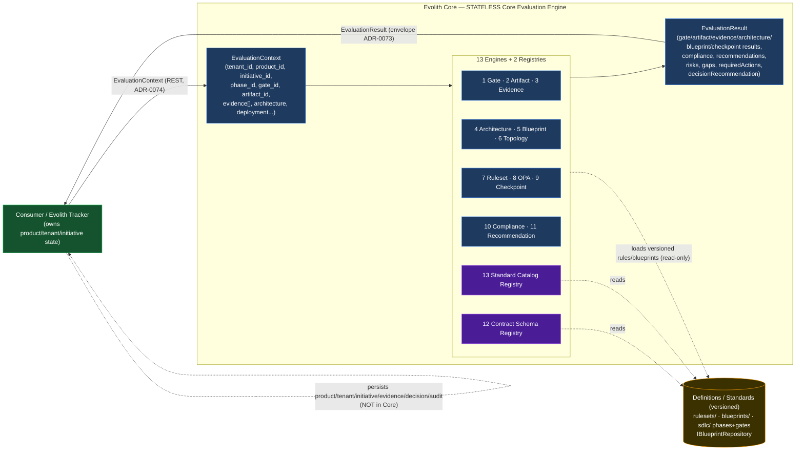
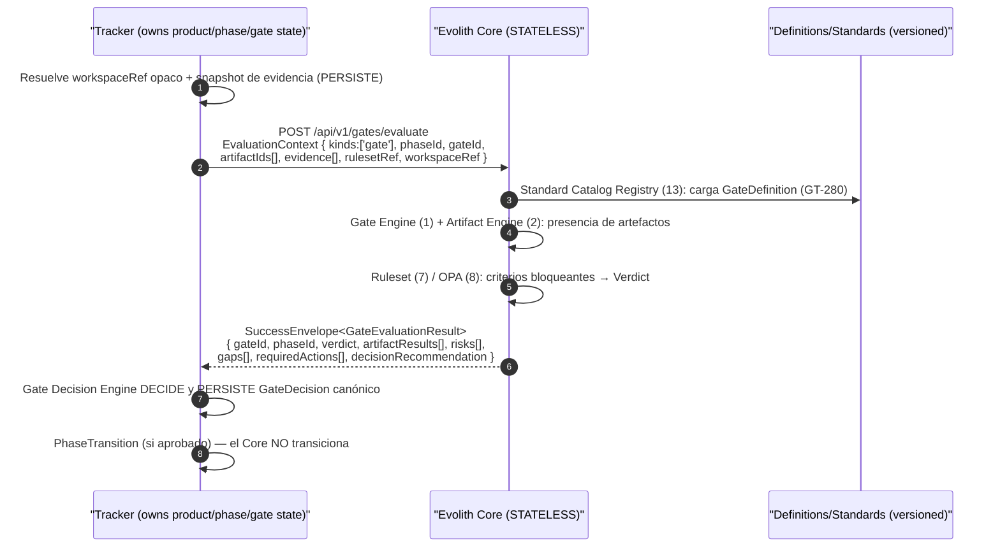
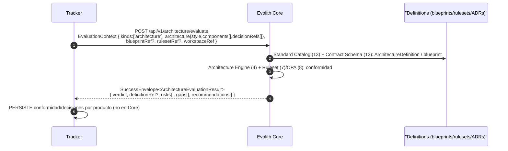
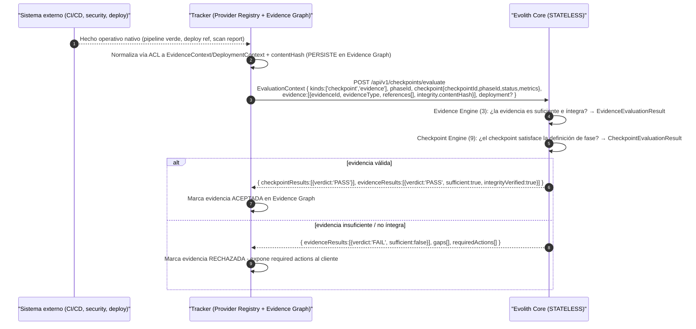

# Evolith Core — Corrected Design: Stateless Core Evaluation Engine

> **Bilingual navigation:** [Versión en Español](./core-evaluation-engine-design.es.md)

**Classification:** Corrected Design Proposal — Core Evaluation Model
**Status:** *Proposed Design — Pending Architecture Board Review* (corrects, at altitude, `product-initiative-governance-redesign`)
**Scope:** Documentation only — does not authorize code changes until Architecture Board approval.
**Owner:** Evolith Architecture Board
**Corrects:** ADR-0101 supersedes Decision 1 of ADR-0100; this document partially supersedes `product-initiative-governance-redesign` (Deliverables 2/4/10/11/12 and the write flows of 13).
**Origin:** Multi-agent analysis anchored in real code (9 agents; consistency verification performed manually after the critical agent's session cutoff — see Appendix).

---

## Corrected thesis

> **Evolith Core is a STATELESS Core Evaluation Engine.** It is neither an operational database nor does it manage/persist products, tenants, initiatives, users, epics, stories, tasks, or sprints. **It receives an `EvaluationContext`** from Evolith Tracker (or another consumer), **evaluates it** against versioned definitions/standards (phases, gates, artifacts, blueprints, topologies, rulesets, OPA policies), and **returns a structured `EvaluationResult`**. `tenant_id`/`product_id`/`initiative_id` are **opaque context identifiers**, never Core entities. **Evolith Tracker** owns, persists, and audits product/tenant/initiative/evidence/decision/deployment; external tools remain the source of truth for the operational detail of delivery.

## Why this document corrects the previous one

The prior design (`product-initiative-governance-redesign`, commit `4a156f3b`) correctly diagnosed the governance↔execution conflation, but committed an **altitude error**: it modeled `Product`/`Initiative`/`Evidence`/`Decision` as **Core domain entities with repositories, mutating use cases, and write endpoints** (`IProductRepository`, `RegisterProduct`, `POST /api/v1/products`…). That violates the corrected criterion and contradicts the real code, which **is already a stateless evaluator with no operational persistence**. This correction returns those entities to their correct altitude: **input context** (`ProductContext`/`InitiativeContext`/`EvidenceContext`) and **result outputs** (`DecisionRecommendation`/`Recommendation`). No new persistence is built; the persistence proposal is **removed**. The detailed reconciliation is at the end of this document.

## Deliverables index

| # | Deliverable | Section |
|---|---|---|
| 1 | Diagnosis of the current conceptual error | §1 |
| 2 | Corrected guiding principle | §2 |
| 3 | Core vs Tracker vs external responsibilities | §3 |
| 4 | Corrected conceptual model | §4 |
| 5 | `EvaluationContext` design | §"Canonical contracts" |
| 6 | `EvaluationResult` design | §"Canonical contracts" |
| 7 | Catalog of internal engines | §7 |
| 8 | Models the Core DOES define | §8 |
| 9 | Models the Core only receives as context | §9 |
| 10 | Conceptual Tracker↔Core contracts / API | §10 |
| 11–17 | Flows (gate, artifact, evidence, architecture, topology, blueprint, checkpoint) | §11–§17 |
| — | Evaluation anatomy of each engine (Q6–Q15 analysis) | §"Evaluation anatomy" |
| 18 | Changes to rulesets | §18 |
| 19 | Changes to OPA policies | §19 |
| 20 | Changes to blueprints | §20 |
| 21 | Changes to documentation | §21 |
| 22 | Changes to taxonomy | §22 |
| 23 | Risks and mitigations | §23 |
| 24 | Refactoring roadmap | §24 |
| 25 | Suggested backlog (epics/stories/tasks) | §25 |
| — | Reconciliation with the previous design | §"Reconciliation" |
| — | Consistency verification + coverage matrix | Appendix |

---


## 1. Diagnosis of the current conceptual error

The prior design (`reference/core/product-initiative-governance-redesign.md`, commit `4a156f3b`) was right in its diagnosis (conflation of stories↔gate evidence, evaluation≠decision, externalizing agile schemas, dual-engine, multi-tenancy as context) but **committed an architectural altitude error**: it turned Product and Initiative into **the Core's own domain entities with persistence and CRUD**. This contradicts both the corrected criterion and the real code itself, which is already a stateless evaluator.

**Evidence of the error in the prior doc (literal quotes):**

| Violation | Anchor in the prior doc | Why it violates the corrected criterion |
|---|---|---|
| Creates operational repos | `product-initiative-governance-redesign.md:1251,1258,1265,1272,1282` — `IProductRepository`, `IInitiativeRepository`, `IEvidenceRepository`, `IDecisionRecordRepository`, `IAdvisoryRepository` | The Core does not own or persist product/tenant/initiative/evidence/decision. Those are input context or result outputs. |
| Use cases that mutate/persist | `:1308-1314` — `RegisterProduct`, `OpenInitiative`, `AttachExternalReference`, `RecordEvidence`, `RecordDecision`, `RequestAdvisory` | "Register/Open/Record/Attach" are operations of a stateful operational system; the Core only evaluates and returns. |
| Operational write endpoints | `:1410-1521` — `POST /api/v1/products`, `/products/:id/initiatives`, `/initiatives/:id/evidence`, `/initiatives/:id/decisions`, `/products/:id/advisories` | The Core does not expose business-entity writes; it only receives `EvaluationContext` and returns `EvaluationResult`. |
| "Initiative must be persisted as an entity" | `:1226` — *"`Iniciativa` today is an opaque 'never persisted' string … It must be persisted as an entity."* | Directly contradicts `gate-evidence.ts:87-89` (`ExecutionContext … Never persisted or interpreted`). The opaque approach was correct, not technical debt. |
| "Product persists architecture/decisions" | `:149` — *"Persists architecture/decisions, not execution"* | Persisting architecture/decisions per product is the Tracker's operational state, not the Core's. |

**Contrast with the real code (the Core is ALREADY a stateless evaluator TODAY):**

| Code fact | Anchor | Implication |
|---|---|---|
| The pipeline is a pure engine: `manifest → topología → gate (GT-280) → reglas Rego → verdict`, with no persistence | `satellite-evaluation-pipeline.service.ts:39-98` | The Core already **composes evaluators**, it does not manage entities. |
| `EvaluateGateInput` receives `phase/projectPath/corePath`, not `productId`/`initiativeId` as an entity | `evaluate-gate.use-case.ts:45-55` | The input unit is context + paths, not an entity of its own. |
| Explicitly ephemeral execution context | `gate-evidence.ts:87-89` — `ExecutionContext { initiative?; tenant?; phase? }` *"Never persisted or interpreted"* | `tenant`/`initiative` are a **context echo**, not entities. |
| The Core declines execution data | `executive-scorecard-rule.handler.ts:55` — `result: 'skipped', 'Sprint throughput requires tracker data'` | Firm precedent: the Core **does not resolve** operational data; it delegates it to the Tracker. |
| The consumer passes an opaque identifier; the Core never sees tenant/credentials/user paths | `workspace-reference-resolver.service.ts:9-11` | Ideal isolation pattern: the Core receives **opaque context references**, not business entities. |
| **No product/tenant/initiative/evidence/decision repo exists** (grep confirmed) | `grep` over `packages/`+`apps/` → 0 matches | The prior doc proposed building from scratch something the criterion prohibits. |
| The only governance repo = definition, not operation | `application/ports/blueprint-repository.port.ts` (`IBlueprintRepository`) | The Core only "persists" **versioned definitions** (blueprints/rulesets/standards), not operational instances. |

**Conclusion:** the prior doc "raised" Product/Initiative from **context** to **entity-with-repo**. The correction returns them to their correct altitude: `ProductContext`/`InitiativeContext` as input and `DecisionRecommendation`/`Recommendation` as output. No new persistence is built; on the contrary, the persistence proposal is **removed** and the stateless nature already present in the code is preserved.

---

## 2. Corrected guiding principle of the Core

> **Evolith Core is a STATELESS Core Evaluation Engine: the normative, architectural, and evaluating nucleus that receives an `EvaluationContext`, evaluates it against versioned DEFINITIONS/STANDARDS (phases, gates, artifacts, blueprints, topologies, rulesets, OPA policies), and returns a structured `EvaluationResult` — without ever owning or persisting products, tenants, initiatives, or execution data.**

- **Stateless with respect to the business**: zero persistence of product/tenant/initiative/evidence/decision/operational state. The Core's only "persistence" is **versioned definitions/standards** (`rulesets/`, `reference/core/architecture/blueprints/`, `reference/core/sdlc/`, `IBlueprintRepository`).
- **Interaction model**: `EvaluationContext` (input) → 13 engines/registries → `EvaluationResult` (output). The Core never calls back to mutate.
- **Product/tenant/initiative = context only**: `tenant_id`/`product_id`/`initiative_id`/`initiative_group_id`/`phase_id`/`gate_id`/`artifact_id` are **opaque context identifiers**, never entities of its own (pattern `workspace-reference-resolver.service.ts:9-11`, `gate-evidence.ts:87-89`).
- **Evaluation ≠ decision**: the Core emits technical verdicts, `RiskFinding`, `GapFinding`, `RequiredAction`, and `DecisionRecommendation` (non-binding). The **canonical decision** is made and persisted by the Tracker (`sdlc-tracker-technical-interfaces.md:30` *"Tracker decides and audits"*).
- **Execution data is delegated, not resolved**: if a rule requires operational data, the Core returns `SKIP`/indeterminate (precedent `executive-scorecard-rule.handler.ts:55`), it never pursues it.
- **Dual-engine native + OPA** (ADR-0041) and the **unified envelope** (ADR-0073) are kept as evaluation mechanisms and output shape.

---

## 3. Responsibilities table: Core vs Tracker vs external systems

| Responsibility | Evolith Core | Evolith Tracker | External systems (Jira/ADO/GitHub) |
|---|---|---|---|
| Define standards (SDLC phases, gates, artifacts, acceptable evidence, blueprints, topologies, rulesets, OPA policies, taxonomies) | **Owner** (source of truth; versions definitions) | Consumes versioned snapshot | — |
| Persist versioned definitions/standards | **Yes** (`rulesets/`, `reference/core/architecture/blueprints/`, `reference/core/sdlc/`, `IBlueprintRepository`) | References by `rulesetRef`/`schemaVersion` | — |
| Persist product / tenant / initiative / grouping | **No** (opaque context only) | **Owner** (`TENANT→PRODUCT→SDLC_PROCESS`, `sdlc-tracker-technical-interfaces.md:415-428`) | Partial operational mirror |
| Persist epics / stories / tasks / sprints / backlogs / boards | **No** | References via `ExternalReference` | **Owner** (native operational state) |
| Persist evidence / executed phases / executed gates | **No** (receives `EvidenceContext`/`CheckpointContext`) | **Owner** (Evidence Graph, Phase Execution) | Produce artifacts/commits/pipelines |
| Evaluate (gates, artifacts, evidence, architecture, blueprint, ruleset, OPA, checkpoint, compliance) | **Owner** (13 engines) | Invokes the Core; never reimplements rules | Provide facts for the evaluation |
| Recommend topology / architecture / next action | **Owner** (`Recommendation`, `DecisionRecommendation`) | Consumes and displays | — |
| **Decide** (canonical gate verdict, approve/reject/waiver, phase advancement) | **No** (only non-binding `DecisionRecommendation`) | **Owner** (`GateDecision`, `PhaseTransition`, approvals, exceptions) | — |
| Operational audit (who approved, when, with what evidence/exception) | **No** | **Owner** (`GET /decisions/:id/audit`) | Own native logs |
| Operational integrations (sync, read state, per-provider ACL) | **No** (never sees credentials/tokens — `workspace-reference-resolver.service.ts:9-11`) | **Owner** (Provider Registry + ACL) | Native endpoints/events |
| Identity / authorization / operational multi-tenancy | **No** (tenant is context, not interpreted) | **Owner** (UMS, tenant graph) | Own IdP |

---

## 4. Corrected conceptual model of the Core



---

## 7. Catalog of the Core's internal engines

| # | Engine / Registry | Responsibility | Input (from the `EvaluationContext`) | Output (in the `EvaluationResult`) | Anchor in existing code (what it reuses) |
|---|---|---|---|---|---|
| 1 | **Gate Evaluation Engine** | Evaluate a phase gate: presence of artifacts + blocking criteria → verdict | `phase_id`, `gate_id`, `artifacts[]`, `evidence[]`, `workspaceRef` | `GateEvaluationResult` | `evaluate-gate.use-case.ts`; `satellite-evaluation-pipeline.service.ts:126-224` (`evaluateGate`); `phase-gate-validator.service.ts` |
| 2 | **Artifact Evaluation Engine** | Validate that each required artifact exists and satisfies its rule | `artifacts[]`, `artifact_id`, `workspaceRef` | `ArtifactEvaluationResult[]` | `satellite-evaluation-pipeline.service.ts:134-213` (loop over `requiredArtifacts`) |
| 3 | **Evidence Evaluation Engine** | Check sufficiency/integrity of declared evidence (without storing it) | `evidence[]` (`EvidenceContext`) | `EvidenceEvaluationResult` | `rulesets/evidence/evidence-manifest.rules.json`; `rulesets/opa/evidence.rego` |
| 4 | **Architecture Evaluation Engine** | Evaluate the architectural conformance of the declared context | `architecture` (`ArchitectureContext`) | `ArchitectureEvaluationResult` | `validate-satellite.use-case.ts`; handlers in `validators/evaluators/handlers/` |
| 5 | **Blueprint Evaluation Engine** | Verify adherence to a versioned `BlueprintDefinition` | `blueprintRef`, context | `BlueprintEvaluationResult` | `validate-blueprint.use-case.ts`; `domain/entities/blueprint.ts`; `IBlueprintRepository` |
| 6 | **Topology Recommendation Engine** | Resolve/recommend an architectural topology | `topology?`, `architecture`, manifest | `Recommendation[]` (suggested topology) | `topology-catalog.service.ts`; `satellite-evaluation-pipeline.service.ts:226-248` (`resolveTopology`) |
| 7 | **Ruleset Execution Engine** | Execute native rulesets (native engine of ADR-0041) | `rulesetRef`, `workspaceRef` | findings → `complianceResult`/`risks` | `ruleset-validator.service.ts`; `RuleEvaluation` (`satellite-manifest.ts`) |
| 8 | **OPA Policy Evaluation Engine** | Execute Rego policies (OPA engine of ADR-0041) | `rulesetRef`/policies, context | OPA findings → results | `validators/evaluators/opa-evaluator.ts`; `satellite-evaluation-pipeline.service.ts:173-201` |
| 9 | **Checkpoint Evaluation Engine** | Evaluate intra-phase checkpoints/milestones | `checkpoint` (`CheckpointContext`), `phase_id` | `CheckpointEvaluationResult` | `propose-phase-advance.use-case.ts` (proposes, does not mutate); `PhaseTransitionProposal` (`gate-evidence.ts:79-85`) |
| 10 | **Compliance Evaluation Engine** | Aggregate all sub-results into a weighted compliance verdict | all sub-results | `ComplianceResult` | `summary` of `satellite-evaluation-pipeline.service.ts:69-76` |
| 11 | **Recommendation Engine** | Derive recommendations and a non-binding `DecisionRecommendation` | findings, gaps, risks | `Recommendation[]`, `DecisionRecommendation` | `remediationFor()` (`pipeline:103-111`); `propose-phase-advance.use-case.ts` |
| 12 | **Contract Schema Registry** | Serve/validate evaluation contract schemas (versioned) | `schemaRef`, `schemaVersion` | schema resolution / validation | `rulesets/schema/` (`gate-evidence.schema.json`, `output-envelope.schema.json`) |
| 13 | **Standard Catalog Registry** | Serve canonical definitions: phases, gates, blueprints, topologies | `phase_id`, `gate_id`, `blueprintRef`, `topology` | resolved definitions (read-only) | `sdlc-data-loader.service.ts` (GT-280); `reference/core/sdlc/`; `reference/core/architecture/blueprints/` |

---

## 8. Conceptual models that the Core MUST define

| Model | Type | Purpose | Persisted? |
|---|---|---|---|
| `PhaseDefinition` | Definition | Canonical definition of an SDLC phase (discovery..release; `phase-id.ts:14`) | Yes (versioned definition) |
| `GateDefinition` | Definition | Criteria, required artifacts and blocking criteria of a gate | Yes (versioned definition) |
| `ArtifactDefinition` | Definition | Required artifact + validation rule | Yes (versioned definition) |
| `EvidenceDefinition` | Definition | Acceptable evidence shape and expected integrity | Yes (versioned definition) |
| `ArchitectureDefinition` | Definition | Evaluable architectural criteria | Yes (versioned definition) |
| `BlueprintDefinition` | Definition | Governance/topology template (`domain/entities/blueprint.ts`) | Yes (versioned definition, `IBlueprintRepository`) |
| `TopologyDefinition` | Definition | Cataloged architectural topology | Yes (versioned definition) |
| `RuleSetDefinition` | Definition | Set of rules (native) | Yes (versioned definition, `rulesets/`) |
| `PolicyDefinition` | Definition | OPA/Rego policy | Yes (versioned definition, `rulesets/opa/`) |
| `EvaluationContext` | Contract (input) | Input contract sent by the consumer | No (ephemeral, request-scoped) |
| `EvaluationResult` | Result | Aggregated output contract | No (ephemeral; persisted by the consumer) |
| `GateEvaluationResult` | Result | Verdict of a gate | No |
| `ArtifactEvaluationResult` | Result | Verdict per artifact | No |
| `EvidenceEvaluationResult` | Result | Evidence sufficiency | No |
| `ArchitectureEvaluationResult` | Result | Architectural conformance | No |
| `BlueprintEvaluationResult` | Result | Blueprint adherence | No |
| `CheckpointEvaluationResult` | Result | Checkpoint status | No |
| `ComplianceResult` | Result | Aggregated compliance | No |
| `Recommendation` | Finding/Output | Actionable recommendation | No |
| `RiskFinding` | Finding | Detected risk | No |
| `GapFinding` | Finding | Detected gap | No |
| `RequiredAction` | Finding | Action required to close a gap | No |
| `DecisionRecommendation` | Output | **Non-binding** decision recommendation (the Tracker decides) | No |

---

## 9. Models that the Core must only receive as context

| Context model | Key fields | Why it does NOT belong to the Core |
|---|---|---|
| `TenantContext` | `tenantId` (opaque) | Tenant is the operational boundary of the Tracker/UMS; the Core never interprets it (`workspace-reference-resolver.service.ts:9-11`) |
| `ProductContext` | `productId`, `tenantId`, `name?`, `repositoryRef?` | Product is a business unit persisted by the Tracker (`sdlc-tracker:416`) |
| `InitiativeContext` | `initiativeId`, `productId`, `kind?`, `title?` | Initiative is operational state of the Tracker; in the Core it is an opaque echo (`gate-evidence.ts:87-89`) |
| `InitiativeGroupContext` | `initiativeGroupId`, `initiativeIds[]` | Grouping is operational organization, with no evaluation semantics of its own |
| `ExternalReferenceContext` | `system` (jira/ado/github), `externalId`, `url?`, `contentHash?` | Reference to external systems; the Core neither integrates with nor reads their state |
| `DeploymentContext` | `environment`, `releaseRef`, `status?` | Deployment facts produced by providers; the Core only evaluates them as facts |
| `ArchitectureContext` | `style`, `components[]`, `decisions[]` (refs) | Description declared for evaluation; not persisted as Core state |
| `EvidenceContext` | `evidenceId`, `evidenceType`, `producer`, `references[]`, `integrity.contentHash` | Evidence is owned by the Tracker's Evidence Graph; the Core receives references, not copies |
| `CheckpointContext` | `checkpointId`, `phaseId`, `status`, `metrics?` | Executed progress state, owned by the Tracker |

---

## Canonical contracts (TypeScript)

> They reuse `Verdict` (`verdict/verdict.ts:14`) and `PhaseId` (`sdlc/phase-id.ts:14`). `tenant_id`/`product_id`/`initiative_id` are context `string`s, **never** Core entities. These signatures are the mandatory reference for the other agents.

```typescript
import { Verdict, VerdictReason } from '../domain/verdict/verdict';
import { PhaseId } from '../domain/sdlc/phase-id';

// ============================================================================
// INPUT — EvaluationContext (el consumidor/Tracker lo ENVÍA; el Core lo evalúa)
// El Core NUNCA persiste nada de esto. Todos los *_id son identificadores opacos.
// ============================================================================

/** Tipos de evaluación que el consumidor puede solicitar en una sola llamada. */
export type EvaluationKind =
  | 'gate' | 'artifact' | 'evidence' | 'architecture'
  | 'blueprint' | 'topology' | 'ruleset' | 'opa'
  | 'checkpoint' | 'compliance';

/** Eco opaco del tenant. Nunca interpretado ni persistido por el Core. */
export interface TenantContext {
  readonly tenantId: string;
}

export interface ProductContext {
  readonly productId: string;
  readonly tenantId: string;
  readonly name?: string;
  readonly repositoryRef?: string;
}

export interface InitiativeContext {
  readonly initiativeId: string;
  readonly productId: string;
  readonly tenantId: string;
  readonly kind?: string;
  readonly title?: string;
}

export interface InitiativeGroupContext {
  readonly initiativeGroupId: string;
  readonly initiativeIds: readonly string[];
}

export interface ExternalReferenceContext {
  readonly system: string;            // 'jira' | 'azure-devops' | 'github' | ...
  readonly kind: string;              // 'epic' | 'story' | 'issue' | 'pr' | ...
  readonly externalId: string;
  readonly url?: string;
  readonly contentHash?: string;      // referencia + hash; nunca copia de datos
}

export interface DeploymentContext {
  readonly environment: string;
  readonly releaseRef: string;
  readonly status?: string;
}

export interface ArchitectureContext {
  readonly style?: string;
  readonly components?: readonly string[];
  readonly decisionRefs?: readonly string[];   // referencias a ADRs, no copias
}

export interface EvidenceContext {
  readonly evidenceId: string;
  readonly evidenceType: string;
  readonly schemaRef?: string;
  readonly producer?: { actorType: 'human' | 'agent' | 'ci' | 'system'; actorId: string };
  readonly references?: readonly ExternalReferenceContext[];
  readonly integrity?: { contentHash: string; capturedAt?: string };
}

export interface CheckpointContext {
  readonly checkpointId: string;
  readonly phaseId: PhaseId;
  readonly status?: string;
  readonly metrics?: Readonly<Record<string, number | string>>;
}

export interface EvaluationContext {
  /** Qué evaluaciones se solicitan. */
  readonly kinds: readonly EvaluationKind[];

  // --- Identificadores OPACOS de contexto (NUNCA entidades del Core) ---
  readonly tenant?: TenantContext;
  readonly product?: ProductContext;
  readonly initiative?: InitiativeContext;
  readonly initiativeGroup?: InitiativeGroupContext;

  // --- Anclaje de evaluación ---
  readonly phaseId?: PhaseId;          // canónico (phase-id.ts:14)
  readonly gateId?: string;
  readonly artifactIds?: readonly string[];

  // --- Referencias versionadas a DEFINICIONES del Core ---
  readonly rulesetRef?: string;
  readonly rulesetVersion?: string;
  readonly blueprintRef?: string;
  readonly topologyRef?: string;
  readonly schemaRef?: string;

  // --- Referencia opaca al workspace (el Core nunca ve paths/credenciales) ---
  readonly workspaceRef?: string;     // patrón workspace-reference-resolver.service.ts:9-11

  // --- Facts/contexto declarados a evaluar ---
  readonly architecture?: ArchitectureContext;
  readonly evidence?: readonly EvidenceContext[];
  readonly deployment?: DeploymentContext;
  readonly checkpoint?: CheckpointContext;
  readonly externalReferences?: readonly ExternalReferenceContext[];

  /** Eco arbitrario devuelto sin interpretar (trazabilidad del consumidor). */
  readonly correlationId?: string;
  readonly passthrough?: Readonly<Record<string, unknown>>;
}

// ============================================================================
// FINDINGS — hallazgos transversales reutilizables
// ============================================================================

export type FindingSeverity = 'error' | 'warning' | 'info';
export type RiskLevel = 'low' | 'medium' | 'high' | 'critical';

export interface RiskFinding {
  readonly id: string;
  readonly level: RiskLevel;
  readonly category: string;          // 'security' | 'architecture' | 'compliance' | ...
  readonly message: string;
  readonly location?: string;
  readonly ruleRef?: string;
}

export interface GapFinding {
  readonly id: string;
  readonly requirementRef: string;    // qué definición/criterio no se cumple
  readonly severity: FindingSeverity;
  readonly message: string;
  readonly location?: string;
}

export interface RequiredAction {
  readonly id: string;
  readonly gapId?: string;            // brecha que cierra
  readonly description: string;
  readonly blocking: boolean;
  readonly remediation: string;
}

export interface Recommendation {
  readonly id: string;
  readonly kind: 'architecture' | 'topology' | 'process' | 'remediation' | 'next-step';
  readonly message: string;
  readonly rationale?: string;
  readonly references?: readonly string[];
}

/**
 * Recomendación de decisión NO vinculante. El Core recomienda; el Tracker
 * decide y persiste el GateDecision canónico (sdlc-tracker:30,179-204).
 */
export interface DecisionRecommendation {
  readonly subjectType: 'gate' | 'phase' | 'initiative' | 'product';
  readonly subjectRef: string;        // gateId / phaseId / initiativeId (opaco)
  readonly recommendedVerdict: Verdict;          // reutiliza Verdict (verdict.ts:14)
  readonly reason?: VerdictReason;
  readonly binding: false;                       // SIEMPRE false: el Core no decide
  readonly recommendedBy: 'evolith-core';
}

// ============================================================================
// SUB-RESULTS — un resultado por engine
// ============================================================================

export interface ArtifactEvaluationResult {
  readonly artifactId: string;
  readonly verdict: Verdict;
  readonly present: boolean;
  readonly ruleRefs: readonly string[];
  readonly gaps: readonly GapFinding[];
}

export interface GateEvaluationResult {
  readonly gateId: string;
  readonly phaseId: PhaseId;
  readonly verdict: Verdict;          // PASS | FAIL | WAIVE | SKIP
  readonly artifactResults: readonly ArtifactEvaluationResult[];
  readonly risks: readonly RiskFinding[];
  readonly gaps: readonly GapFinding[];
  readonly requiredActions: readonly RequiredAction[];
}

export interface EvidenceEvaluationResult {
  readonly evidenceId: string;
  readonly verdict: Verdict;
  readonly sufficient: boolean;
  readonly integrityVerified: boolean;
  readonly gaps: readonly GapFinding[];
}

export interface ArchitectureEvaluationResult {
  readonly verdict: Verdict;
  readonly definitionRef?: string;
  readonly risks: readonly RiskFinding[];
  readonly gaps: readonly GapFinding[];
  readonly recommendations: readonly Recommendation[];
}

export interface BlueprintEvaluationResult {
  readonly blueprintRef: string;
  readonly verdict: Verdict;
  readonly gaps: readonly GapFinding[];
  readonly requiredActions: readonly RequiredAction[];
}

export interface CheckpointEvaluationResult {
  readonly checkpointId: string;
  readonly phaseId: PhaseId;
  readonly verdict: Verdict;
  readonly gaps: readonly GapFinding[];
}

export interface ComplianceResult {
  readonly verdict: Verdict;          // veredicto agregado
  readonly score?: number;            // 0..1, opcional/ponderado
  readonly totalChecks: number;
  readonly passedChecks: number;
  readonly failedChecks: number;
  readonly skippedChecks: number;
}

// ============================================================================
// OUTPUT — EvaluationResult (el Core DEVUELVE; el consumidor persiste/decide)
// ============================================================================

export interface EvaluationResult {
  /** Veredicto general derivado de los sub-resultados. */
  readonly overallVerdict: Verdict;

  // --- Sub-resultados por engine (presentes según kinds solicitados) ---
  readonly gateResults?: readonly GateEvaluationResult[];
  readonly artifactResults?: readonly ArtifactEvaluationResult[];
  readonly evidenceResults?: readonly EvidenceEvaluationResult[];
  readonly architectureResult?: ArchitectureEvaluationResult;
  readonly blueprintResult?: BlueprintEvaluationResult;
  readonly checkpointResults?: readonly CheckpointEvaluationResult[];
  readonly compliance?: ComplianceResult;

  // --- Salidas transversales ---
  readonly recommendations: readonly Recommendation[];
  readonly risks: readonly RiskFinding[];
  readonly gaps: readonly GapFinding[];
  readonly requiredActions: readonly RequiredAction[];
  readonly decisionRecommendation?: DecisionRecommendation;

  // --- Trazabilidad (eco del contexto; el Core no decide ni persiste) ---
  readonly evaluatedAt: string;       // ISO-8601
  readonly correlationId?: string;
  readonly rulesetVersion?: string;
  readonly schemaVersion: string;     // versión del contrato EvaluationResult
}
```

**Reconciliation notes for the other agents and the docs to be corrected:**
- The `EvaluationResult` is wrapped in the `SuccessEnvelope<EvaluationResult>` from ADR-0073 (`gate-evidence.ts:119-135`) when it goes out over REST (ADR-0074).
- `GateEvaluationResult` already exists in `satellite-manifest.ts` with `verdict: 'passed'|'failed'` (legacy); the canonical contract migrates to `Verdict` (PASS/FAIL/WAIVE/SKIP) via the helpers in `verdict.ts:63-100`.
- Required corrections: ADR `0100` decision 1 → "Core stateless evaluator; product/tenant/initiative are context only"; UP-002 deliverable 2 → remove entities+repos; gap GT-375 → reframe as "context/result contracts", not entities; `product-initiative-governance-redesign.md:1225-1521` (repos, Register/Open/Record use-cases, write POST endpoints) → **remove**.

**Anchor files (absolute paths):**
- `/Users/beyondnet/Source/evolith/packages/core-domain/src/application/services/satellite-evaluation-pipeline.service.ts`
- `/Users/beyondnet/Source/evolith/packages/core-domain/src/application/use-cases/evaluate-gate.use-case.ts`
- `/Users/beyondnet/Source/evolith/packages/core-domain/src/domain/gate-evidence.ts` (`ExecutionContext` :87-89)
- `/Users/beyondnet/Source/evolith/packages/core-domain/src/domain/verdict/verdict.ts` (`Verdict` :14)
- `/Users/beyondnet/Source/evolith/packages/core-domain/src/domain/sdlc/phase-id.ts` (`PhaseId` :14)
- `/Users/beyondnet/Source/evolith/packages/core-domain/src/application/validators/evaluators/handlers/executive-scorecard-rule.handler.ts` (`:55` precedent "requires tracker data")
- `/Users/beyondnet/Source/evolith/packages/core-domain/src/application/ports/blueprint-repository.port.ts` (only repo = definition)
- `/Users/beyondnet/Source/evolith/apps/core-api/src/application/services/workspace-reference-resolver.service.ts` (`:9-11` isolation)
- `/Users/beyondnet/Source/evolith/product/products/evolith-tracker/sdlc-tracker-technical-interfaces.md` (`:30`, `:340-360`, `:415-428` Tracker model)
- `/Users/beyondnet/Source/evolith/reference/core/product-initiative-governance-redesign.md` (prior design to be corrected; violations at `:1225-1521`)


---

## Evaluation anatomy — how each engine evaluates (Q6–Q15 analysis)

> Universal pattern (no exceptions): each engine receives **only** fragments of the `EvaluationContext`, consults **versioned read-only definitions/standards** (SDLC catalog, blueprints, rulesets, OPA policies), applies rules, and **returns a sub-result** that is aggregated into the `EvaluationResult`. No engine writes business state. The firm precedent is `executive-scorecard-rule.handler.ts:29-55`: when a datum is operational (lead time, sprint throughput, incident metrics) the engine returns `'skipped'` with the reason *"requires … tracker data"* instead of resolving it.

Existing base evaluation contract — `evaluator.interface.ts:3-21`:

```typescript
export interface EvaluationContext { satellitePath: string; corePath: string; }   // hoy
export interface RuleEvaluationResult {
  rule: NormalizedRule;
  result: 'passed' | 'failed' | 'skipped';   // migra a Verdict PASS|FAIL|SKIP|WAIVE (verdict.ts:14)
  message?: string;
  evidencePath?: string;
}
export interface IRuleEvaluatorStrategy {
  evaluateAll(rules: NormalizedRule[], context: EvaluationContext): Promise<RuleEvaluationResult[]>;
}
```

In the corrected contract, `satellitePath/corePath` are replaced by the opaque `workspaceRef` plus the referenced definitions (`rulesetRef`, `blueprintRef`, `phaseId`, `gateId`); the consumer's resolver materializes the workspace outside the Core (`workspace-reference-resolver.service.ts:9-11`). The `{result, message}` shape with three states is exactly the base of `RuleEvaluationResult`; the per-engine sub-result enriches it with `verdict`, `gaps`, `risks`, `requiredActions`.

---

### Q6 · Gate Evaluation Engine

| Aspect | Detail |
|---|---|
| Context input | `phaseId`, `gateId`, `artifactIds[]`, `evidence[]`, `workspaceRef`, `rulesetRef?` |
| Definition/standard consulted | `GateDefinition` resolved via `StructuredGate` from the GT-280 SDLC catalog (`sdlc-data-loader.service.ts:19-35`, `loadGatesForPhase` :100): `requiredArtifacts[]` (artifact, schemaRef, validation, rules) + `blockingCriteria[]` (criterion, action) |
| Rules/policies applied | For each `requiredArtifact`: (1) artifact presence; (2) execution of the Rego `rules[]` via OPA; (3) severity derivation from `blockingCriteria` |
| Result shape | `GateEvaluationResult { gateId, phaseId, verdict, artifactResults[], risks[], gaps[], requiredActions[] }` |
| Code anchor | `satellite-evaluation-pipeline.service.ts:126-224` (`evaluateGate`); `evaluate-gate.use-case.ts`; `phase-gate-validator.service.ts` |

**Evaluation flow (anchored in `evaluateGate` :126-224):**

1. Resolves the `StructuredGate` from the catalog (`loadGatesForPhase`). The gate carries `requiredArtifacts[]` and `blockingCriteria[]` — the canonical `GateDefinition`.
2. For each artifact, checks presence (`fs.exists`, :136). **Absent → blocking `gap`** with remediation (`remediationFor` :103-111) and artifact `verdict` = FAIL (:143-154).
3. For each artifact `rule`, derives severity from `blockingCriteria` (`deriveSeverity` :117-124): if a blocking criterion mentions the artifact → `error` (MUST), otherwise → `warning` (SHOULD). This turns declarative criteria into rule weight.
4. Executes the Rego rule (delegating to the **OPA Policy Evaluation Engine**, :173-201). Both `failed` and `skipped` policy outcomes are treated as **blocking** (defense-in-depth, :187-188).
5. Aggregates: `verdict = PASS` if all artifact evaluations pass, otherwise `FAIL` (:216-221). Each missing artifact or violated rule maps to a `GapFinding`; each unsatisfied `blockingCriteria.action` → `RequiredAction { blocking:true, remediation }`.

The legacy verdict `'passed'|'failed'` (`satellite-manifest.ts`) migrates to `Verdict` (`verdict.ts:14`) via `fromLegacyGateEvidence` (:63-71). The engine **does not decide**: it emits a technical verdict; the canonical gate decision is persisted by the Tracker.

---

### Q7 · Artifact Evaluation Engine

| Aspect | Detail |
|---|---|
| Context input | `artifactIds[]`, `workspaceRef`, `gateId` (to resolve `requiredArtifacts`) |
| Definition/standard consulted | `ArtifactDefinition` = entry of `StructuredGate.requiredArtifacts[]` (`sdlc-data-loader.service.ts:25-30`): `artifact` (expected path), `schemaRef?`, `validation` (criterion text), `rules[]` (Rego refs) |
| Rules/policies applied | (1) artifact presence in `workspaceRef`; (2) if `schemaRef`, schema validation (AJV pattern from `opa-evaluator.ts:25-47`); (3) `rules[]` delegated to the Ruleset/OPA engines |
| Result shape | `ArtifactEvaluationResult { artifactId, verdict, present, ruleRefs[], gaps[] }` |
| Code anchor | `satellite-evaluation-pipeline.service.ts:134-213` (loop over `requiredArtifacts`); reusable schema validation from `opa-evaluator.ts:validateInput` |

**Flow:** the sub-loop of `evaluateGate` (:134-213) is already an Artifact Evaluation Engine per artifact: `present = fs.exists(artifactPath)` (:136); if absent, a `gap` with `verdict=FAIL` and remediation; if present, it executes its `rules[]`. The artifact's `validation` field is the text that feeds the remediation (`Ensure ${artifactName} exists and satisfies: ${context}` :110). `schemaRef` (present in `requiredArtifacts` :27, currently underused) enables structural validation by reusing the cached AJV compiler from `opa-evaluator.ts:30-37`. The engine reports per artifact, feeding `GateEvaluationResult.artifactResults[]`.

---

### Q8 · Evidence Evaluation Engine

| Aspect | Detail |
|---|---|
| Context input | `evidence[]: EvidenceContext[]` (`evidenceId`, `evidenceType`, `producer`, `references[]`, `integrity.contentHash`) |
| Definition/standard consulted | `EvidenceDefinition` = `EVD-*` rules (`rulesets/evidence/`); OPA equivalent `rulesets/opa/evidence.rego`. Per-rule required fields in `evidence-rule.handler.ts:36-68` |
| Rules/policies applied | EVD-01 (`id/source/generatedAt/producer` fields + link to rule/gate, :37-46); EVD-02 (`sourceRef`, :48-53); EVD-03 (`status/evaluatedRules/blockingFailures`, :54-61); EVD-04 (`retentionPeriod/owner`, :62-67) |
| Result shape | `EvidenceEvaluationResult { evidenceId, verdict, sufficient, integrityVerified, gaps[] }` |
| Code anchor | `evidence-rule.handler.ts:7-72` |

**Critical altitude difference:** the current handler reads evidence from the **filesystem** (`.harness/evidence` :15-20) because it operates over a workspace today. In the corrected model the Core **neither stores nor reads** the evidence: it receives `EvidenceContext` (references + `integrity.contentHash`, never copies) and evaluates **declared sufficiency and integrity**. The required-fields logic (`required.filter(k => !manifest[k])` :40,:57) is preserved intact, but applied to the structure of the `EvidenceContext` rather than to a file. `integrityVerified` compares the declared `contentHash`, without downloading the content. A missing field → `GapFinding`; evidence insufficient for the gate → contributes to a `RequiredAction`.

---

### Q9 · Architecture Evaluation Engine

| Aspect | Detail |
|---|---|
| Context input | `architecture: ArchitectureContext` (`style`, `components[]`, `decisionRefs[]`); plus, conceptually, current state + target + `blueprintRef` + `topologyRef` + declared risks |
| Definition/standard consulted | `ArchitectureDefinition` = supported rule categories (`architecture-rule.handler.ts:11-16`): AGENT, STRUCTURAL, AST, CONFIG (modules `architecture/agent-rules`, `structural-rules`, `ast-rules`, `config-rules`) |
| Rules/policies applied | Dispatch by category (`dispatch` :30-36): agent, structural, AST and configuration rule; unsupported category → `SKIPPED` (:35) |
| Result shape | `ArchitectureEvaluationResult { verdict, definitionRef?, risks[], gaps[], recommendations[] }` |
| Code anchor | `architecture-rule.handler.ts:18-37`; `validate-satellite.use-case.ts`; submodules in `handlers/architecture/` |

**Flow:** `ArchitectureRuleHandler.canHandle` (:21-23) admits the rule only if its `category` is in `SUPPORTED_CATEGORIES` (the union of AGENT/STRUCTURAL/AST/CONFIG, :11-16). `dispatch` (:30-36) routes to `evaluateAgentRule`/`evaluateStructuralRule`/`evaluateAstRule`/`evaluateConfigRule`; anything unsupported is declined as `SKIPPED` (the non-resolution precedent). In the corrected contract the engine evaluates the **delta** between the declared `ArchitectureContext` (current) and the target `ArchitectureDefinition`/`blueprintRef`: structural divergences → `GapFinding`/`RiskFinding`; better alternatives → `Recommendation[]` (bridge with the Topology Recommendation Engine). The current/target state arrives as context and is **never persisted** as Core state.

---

### Q10 · Topology Recommendation Engine

| Aspect | Detail |
|---|---|
| Context input | `topologyRef?`, `architecture`, workspace manifest (`workspaceRef`) |
| Definition/standard consulted | `TopologyDefinition` from `rulesets/topologies/<id>/topology.manifest.json` (`validate-blueprint.use-case.ts:132-138`); catalog via `topology-catalog.service.ts` |
| Rules/policies applied | Resolution: (1) declared `topology.manifest.json` → `metadata.id` (`pipeline:229-234`); (2) heuristic over `evolith.yaml` (`pipeline:237-243`); (3) suggestion based on `ArchitectureContext` if there is no declaration |
| Result shape | `Recommendation[] { kind:'topology', message, rationale, references[] }` (suggestion, not a verdict) |
| Code anchor | `satellite-evaluation-pipeline.service.ts:226-248` (`resolveTopology`); `topology-catalog.service.ts` |

**Recommender nature (non-binding):** `resolveTopology` (:226-248) first **resolves** a declared topology and, in its absence, infers one. In the corrected model this engine produces a topology `Recommendation`, not a compliance verdict — consistent with the Core *recommending* and the Tracker *deciding*. The existence of the topology is indeed blocking when a blueprint references it (see Q11, `TOPOLOGY_NOT_FOUND`).

---

### Q11 · Blueprint Evaluation Engine

| Aspect | Detail |
|---|---|
| Context input | `blueprintRef`, `phaseId`, workspace context |
| Definition/standard consulted | `BlueprintDefinition` (`domain/entities/blueprint.ts`) served by `IBlueprintRepository` (the single repo = versioned definition); cross-references to topology/rulesets/gates/policies |
| Rules/policies applied | Five adherence checks (`validate-blueprint.use-case.ts:69-84`): (a) topology exists (:127-146); (b) each ruleset exists (:148-163); (c) each gateId is in the SDLC registry (:165-202); (d) valid SDLC phase (:204-214); (e) each OPA policy exists (:216-231) |
| Result shape | `BlueprintEvaluationResult { blueprintRef, verdict, gaps[], requiredActions[] }` |
| Code anchor | `validate-blueprint.use-case.ts:55-121`; `domain/entities/blueprint.ts`; `blueprint-repository.port.ts` |

**Flow (anchored :62-120):** each missing check pushes a `BlueprintViolation { code, field, message }` (codes `TOPOLOGY_NOT_FOUND`, `RULESET_NOT_FOUND`, `GATE_NOT_FOUND`, `INVALID_PHASE`, `OPA_POLICY_NOT_FOUND`). `verdict = PASS` if `violations.length === 0`, otherwise `FAIL` (:86-88), already using the canonical `Verdict`. In the corrected contract each `BlueprintViolation` maps 1:1 to a `GapFinding` (with `requirementRef = field`) and, if it blocks adherence, to a `RequiredAction`. **Important reconciliation:** the DRAFT→VALIDATED state transitions and the event emission (`:90-118`, `:233-256`) belong to the lifecycle of the blueprint *definition* (governance of definitions, not of business); the engine's `EvaluationResult` returns **only** verdict + gaps, without mutating consumer state.

---

### Q12 · Ruleset Execution Engine

| Aspect | Detail |
|---|---|
| Context input | `rulesetRef`, `rulesetVersion?`, `workspaceRef`, `architecture` |
| Definition/standard consulted | `RuleSetDefinition` = `NormalizedRule[]` (`normalized-rule.ts:1-10`: `id, severity MUST/SHOULD/COULD/MUST NOT, category, blocking, validationQuery`) from `rulesets/` |
| Rules/policies applied | **Native** engine (ADR-0041): dispatch by `category`/`id` prefix to specialized handlers (`native-evaluator.ts:26-39`) |
| Result shape | findings → `compliance` + `risks[]`/`gaps[]` (aggregatable sub-results) |
| Code anchor | `native-evaluator.ts:18-75`; handlers in `handlers/*`; `ruleset-validator.service.ts`; `RuleEvaluation` (`satellite-manifest.ts`) |

**Dispatch mechanism (`native-evaluator.ts:53-74`):** it walks the list of 12 registered handlers (`:26-39` — Evidence, CliRelease, Mcp, Dependency, Taxonomy, Governance, Architecture, Sdlc, CrossCutting, ExecutiveScorecard, SatelliteContract, Acl); the first whose `canHandle(rule)` returns `true` evaluates it. **No handler → `'skipped'` with "Requires external system or runtime verification" (:59-64)** — the exact precedent that the Core does not resolve operational data, but declines it. A handler exception → `'skipped'` with the error (:69-73), never breaking the evaluation. The `severity` + `blocking` of the `NormalizedRule` determine whether a `'failed'` produces a blocking `RiskFinding`/`GapFinding` or a warning.

---

### Q13 · OPA Policy Evaluation Engine

| Aspect | Detail |
|---|---|
| Context input | `rulesetRef`/policies, `workspaceRef`, declared context (built by `OpaInputBuilder`) |
| Definition/standard consulted | `PolicyDefinition` = `.rego` compiled to `rulesets/opa/policy.wasm` (`opa-evaluator.ts:53`); input schemas in `rulesets/opa/schemas/<category>.input.schema.json` (:26) |
| Rules/policies applied | **OPA** engine (ADR-0041): (1) per-category input validation with AJV (`validateInput` :25-47); (2) WASM evaluation (`policyCache.evaluate(input)` :101); (3) violation↔rule correlation by `v.id === rule.id` (:105) |
| Result shape | `RuleEvaluationResult[]` with `'passed'|'failed'` + `message` (concatenated violations, :110) |
| Code anchor | `opa-evaluator.ts:49-131`; integrated into the Gate Engine via `pipeline:173-201` |

**Defense by default (key design decision):** if the WASM does not exist (:54-61), if the input schema fails (:88-92), or if the engine throws (:122-130), the result is **`'failed'` — enforcement blocked**, never a false `pass`. The Gate Engine reinforces this by treating OPA `'skipped'` as blocking as well (`pipeline:187-188`). This materializes the "when in doubt, do not approve" principle: the Core never emits PASS on a policy it could not execute. Violations (`v.message`) become `RiskFinding`/`GapFinding` with `ruleRef = rule.id`.

---

### Q14 · Checkpoint Evaluation Engine

| Aspect | Detail |
|---|---|
| Context input | `checkpoint: CheckpointContext` (`checkpointId`, `phaseId`, `status`, `metrics`), `phaseId` |
| Definition/standard consulted | Phase exit criteria = source phase `GateDefinition` (SDLC catalog); intra-phase checkpoints as associated milestones |
| Rules/policies applied | Reuses the Gate Engine over the source phase; derives an advance recommendation without mutating state |
| Result shape | `CheckpointEvaluationResult { checkpointId, phaseId, verdict, gaps[] }` + optional `DecisionRecommendation` |
| Code anchor | `propose-phase-advance.use-case.ts:25-43`; `PhaseTransitionProposal` (`gate-evidence.ts:79-85`) |

**Evaluation without mutation (`propose-phase-advance.use-case.ts:25-43`):** it evaluates the current phase's gate (`evaluateGateUseCase.execute` :26) and derives `isRecommended = (verdict === 'passed')` (:34), returning a `PhaseTransitionProposal { fromPhase, toPhase, evidence, isRecommended, proposedAt }`. The use-case comment states it literally: *"without mutating the canonical state, returning a transition proposal"* (:16-19). In the corrected contract this is expressed as `CheckpointEvaluationResult` + `DecisionRecommendation { subjectType:'phase', recommendedVerdict, binding:false }`: the Core **proposes** the advance; the Tracker persists the `PhaseTransition`.

---

### Compliance Evaluation Engine (aggregator)

| Aspect | Detail |
|---|---|
| Input | All sub-results (gate/artifact/evidence/architecture/blueprint/checkpoint) |
| Definition consulted | None new; aggregates and weights by `severity`/`blocking` |
| Rules applied | Counting and weighting: total/passed/failed/skipped; a single blocking `FAIL` → `overallVerdict = FAIL` |
| Result shape | `ComplianceResult { verdict, score?, totalChecks, passedChecks, failedChecks, skippedChecks }` |
| Code anchor | `summary` of `satellite-evaluation-pipeline.service.ts:64-76`; `passed: gateResults.every(g => g.verdict === 'passed')` (:91) |

**Flow:** the current `summary` (`pipeline:69-76`) already counts `totalGates/passedGates/failedGates` and `totalRules/passedRules/failedRules`; the overall `passed` is the `every(... 'passed')` (:91). The corrected engine formalizes it into `ComplianceResult` with an optional `score` (0..1 weighted by severity). The aggregated verdict respects the `Verdict` hierarchy: any blocking `FAIL` dominates; `SKIP` neither approves nor rejects (it does not count as a pass).

---

### Recommendation Engine

| Aspect | Detail |
|---|---|
| Input | `gaps[]`, `risks[]`, `requiredActions[]`, topology/architecture results |
| Definition consulted | Remediation map + advance criteria |
| Rules applied | Derives actionable `Recommendation[]` and a non-binding `DecisionRecommendation` |
| Result shape | `Recommendation[]` + `DecisionRecommendation { binding:false, recommendedBy:'evolith-core' }` |
| Code anchor | `remediationFor()` (`pipeline:103-111`); `propose-phase-advance.use-case.ts` |

**Flow:** `remediationFor` (:103-111) already translates a missing artifact → actionable remediation text (the embryo of `RequiredAction.remediation`). The Recommendation Engine generalizes this: each `GapFinding` with remediation → `RequiredAction`; the set of gaps/risks + the aggregated verdict → one or more `Recommendation` (`kind: 'next-step'|'remediation'|'topology'|'architecture'`); the recommended phase advance → `DecisionRecommendation`. **Invariant**: `binding: false` always (the Core does not decide).

---

## 15. How gaps, risks, and recommendations are returned: confidence and technical traceability

Each `EvaluationResult` finding is built from the internal `RuleEvaluationResult` (`evaluator.interface.ts:8-13`) and enriched with **traceability** (which rule/definition originated it) and **confidence** (how deterministic the evaluation was).

**Deterministic internal-result → contract-finding mapping:**

| Internal result (`result`) | Data origin | Emitted finding | Traceability (`ruleRef`/`requirementRef`) | Confidence level |
|---|---|---|---|---|
| `'failed'` from blocking native rule | `NormalizedRule.blocking=true` (`native-evaluator.ts`) | `GapFinding` + `RequiredAction { blocking:true }` | `rule.id` + `rule.sourceFile` (`normalized-rule.ts:9`) | **high** (deterministic verification in code/AST) |
| `'failed'` from OPA policy | violation `v.id===rule.id` (`opa-evaluator.ts:105-110`) | `RiskFinding`/`GapFinding` | `rule.id` + `v.message` | **high** (policy executed) |
| `'failed'` from missing artifact | `fs.exists=false` (`pipeline:143-154`) | `GapFinding { requirementRef: artifact }` + `RequiredAction` with `remediationFor` | `gate.id` + `artifact.artifact` + `artifact.validation` | **high** (binary presence) |
| `'failed'` from non-executable WASM/schema/engine | `opa-evaluator.ts:54-61,88-92,122-130` | `RiskFinding { level:'critical', category:'compliance' }` "enforcement blocked" | `wasmPath`/`schemaPath` | **high** on the *non-enforcement* risk; the policy verdict is **indeterminate** (which is why it is blocked) |
| `'skipped'` — no handler | `native-evaluator.ts:59-64` | no gap; informational note | "Requires external system or runtime verification" | **indeterminate** (not evaluable by the Core) |
| `'skipped'` — operational data | `executive-scorecard-rule.handler.ts:29,53,55` | no gap; `Recommendation { kind:'next-step' }` "provide data via Tracker" | message "requires tracker data" | **indeterminate** (delegated to the Tracker) |
| `'passed'` | any engine | contributes to `passedChecks` of the `ComplianceResult` | `rule.id`/`gate.id` | **high** |

**Construction rules for each output model:**

- **`GapFinding`** — `requirementRef` = the unmet definition (`gate.id`, `artifact.artifact`, `blueprintViolation.field`, `rule.id`). `severity` derives from `NormalizedRule.severity` (MUST→`error`, SHOULD→`warning`, COULD→`info`) or from the gate's `deriveSeverity` (`pipeline:117-124`). `location` = path of the affected artifact/file.
- **`RiskFinding`** — `level` (low..critical) derives from severity + category. Non-enforcement risks (OPA not executable) are `critical`. `ruleRef` traces the policy/rule. `category` = `rule.category` (`normalized-rule.ts:4`).
- **`RequiredAction`** — `blocking` = `NormalizedRule.blocking` or `error` severity; `remediation` comes from `remediationFor` (`pipeline:103-111`) or from `artifact.validation`; `gapId` links the gap it closes.
- **`Recommendation`** — added by the Recommendation Engine; `references[]` points to `rule.sourceFile`, ADRs (`decisionRefs`), and catalog definitions; `rationale` explains the why.
- **`DecisionRecommendation`** — `recommendedVerdict` reuses `Verdict` (`verdict.ts:14`) via `fromLegacyGateEvidence` (:63-71) over the `isRecommended` of `propose-phase-advance.use-case.ts:34`. **`binding: false` always**; `recommendedBy: 'evolith-core'`. The `VerdictReason { code, message }` (`verdict.ts:35-40`) accompanies the why of the recommended verdict.

**End-to-end traceability:** each finding preserves `correlationId` (echo of the `EvaluationContext`, `pipeline:85`), `rulesetVersion`/`schemaVersion`, and `evaluatedAt` ISO-8601 (`pipeline:67`). The `EvaluationResult` is wrapped in the `SuccessEnvelope` (ADR-0073, `createSuccessEnvelope` `pipeline:79-88`) when it exits via REST (ADR-0074). This lets the Tracker reconstruct exactly which versioned definition, which rule, and which engine (native/OPA) produced each gap — without the Core having persisted anything.

**Confidence policy under uncertainty (design invariant):** the Core **never** emits PASS over something it could not evaluate deterministically. What is not evaluable is marked `SKIP`/indeterminate with a traceable reason (precedents `native-evaluator.ts:59-64` and `executive-scorecard-rule.handler.ts:55`); what should block but could not be executed (OPA not compiled) is treated as a blocking FAIL (`pipeline:187-188`, `opa-evaluator.ts:54-61`). High confidence = deterministic verification; indeterminate confidence = data delegated to the Tracker.

---

**Anchor files (absolute paths):**
- `/Users/beyondnet/Source/evolith/packages/core-domain/src/application/services/satellite-evaluation-pipeline.service.ts` (`evaluateGate` :126-224, `summary` :64-76, `remediationFor` :103-111, `resolveTopology` :226-248, blocking OPA :187-188)
- `/Users/beyondnet/Source/evolith/packages/core-domain/src/application/validators/evaluators/evaluator.interface.ts` (`RuleEvaluationResult` tri-state :8-13)
- `/Users/beyondnet/Source/evolith/packages/core-domain/src/application/validators/evaluators/native-evaluator.ts` (dispatch + skip with no handler :53-74; 12 handlers :26-39)
- `/Users/beyondnet/Source/evolith/packages/core-domain/src/application/validators/evaluators/opa-evaluator.ts` (default defense :54-61, schema validation :25-47, violation↔rule correlation :101-110)
- `/Users/beyondnet/Source/evolith/packages/core-domain/src/application/validators/evaluators/handlers/evidence-rule.handler.ts` (EVD-01..04 :36-67)
- `/Users/beyondnet/Source/evolith/packages/core-domain/src/application/validators/evaluators/handlers/architecture-rule.handler.ts` (categories + dispatch :11-36)
- `/Users/beyondnet/Source/evolith/packages/core-domain/src/application/validators/evaluators/handlers/executive-scorecard-rule.handler.ts` ("requires tracker data" precedent :29,:53,:55,:70)
- `/Users/beyondnet/Source/evolith/packages/core-domain/src/application/validators/evaluators/handlers/rule-handler.interface.ts` (`INativeRuleHandler` :4-7)
- `/Users/beyondnet/Source/evolith/packages/core-domain/src/application/use-cases/validate-blueprint.use-case.ts` (5 adherence checks :69-84, :127-231; verdict :86-88)
- `/Users/beyondnet/Source/evolith/packages/core-domain/src/application/use-cases/propose-phase-advance.use-case.ts` (proposal without mutation :16-43)
- `/Users/beyondnet/Source/evolith/packages/core-domain/src/application/services/sdlc-data-loader.service.ts` (`StructuredGate` :19-35, `loadGatesForPhase` :100)
- `/Users/beyondnet/Source/evolith/packages/core-domain/src/domain/verdict/verdict.ts` (`Verdict` :14, `fromLegacyGateEvidence` :63-71, `VerdictReason` :35-40)
- `/Users/beyondnet/Source/evolith/packages/core-domain/src/domain/models/normalized-rule.ts` (`NormalizedRule` :1-10)


---

## 10. Conceptual Contracts / APIs between Tracker and Core

### 10.1 API surface principle

The Core exposes **a single family of evaluation endpoints** that receive an `EvaluationContext` and return an `EvaluationResult` (or a sub-result) wrapped in the ADR-0073 `SuccessEnvelope`, transported REST-only (ADR-0074). There is no write endpoint for business entities: the Core never exposes `POST /products`, `/initiatives`, `/evidence`, `/decisions`, or `/advisories` (the proposal from the previous design, `product-initiative-governance-redesign.md:1410-1521`, is conceptually **removed**). The Core only receives context and returns verdicts.

The living precedent is exactly this pattern: `EvaluationController` (`apps/core-api/src/presentation/controllers/evaluation.controller.ts:13-31`) already does `POST /api/v1/evaluate` → `ValidateSatelliteUseCase` → `outputEnvelope` (ADR-0073), without persisting anything. `GatesController` (`gates.controller.ts:15-30`) already does `POST /api/v1/gates/:gateId/evaluate` receiving only an opaque `workspaceRef` (resolved by `WorkspaceReferenceResolverService`, `workspace-reference-resolver.service.ts:9-11`), never `productId`/`tenantId`/credentials.

### 10.2 Core REST endpoints (stateless evaluator)

All of them: `POST` method, `/api/v1` prefix, `HttpCode 200 OK`, body = `EvaluationContext` (or a typed subset), response = `SuccessEnvelope<EvaluationResult | sub-result>`.

| Endpoint | Engine(s) (section 7) | Body (subset of `EvaluationContext`) | Envelope `data` | Anchor in real code |
|---|---|---|---|---|
| `POST /api/v1/evaluate` | Orchestrator (all, per `kinds[]`) | Full `EvaluationContext` | `EvaluationResult` | `evaluation.controller.ts:13-31` (today `EvaluateSatelliteDto`; reconcile toward `EvaluationContext`) |
| `POST /api/v1/gates/evaluate` | 1 Gate (+2 Artifact, +7/8 rules) | `{ phaseId, gateId, artifactIds?, evidence?, rulesetRef?, workspaceRef? }` | `GateEvaluationResult` | reconciles `gates.controller.ts:15-30` (`/gates/:gateId/evaluate`); the `gateId` moves into the body to align with `EvaluationContext` |
| `POST /api/v1/artifacts/evaluate` | 2 Artifact | `{ artifactIds, phaseId?, gateId?, workspaceRef? }` | `ArtifactEvaluationResult[]` | loop `satellite-evaluation-pipeline.service.ts:134-213` |
| `POST /api/v1/evidence/evaluate` | 3 Evidence | `{ evidence[], phaseId?, gateId? }` | `EvidenceEvaluationResult[]` | `rulesets/evidence/evidence-manifest.rules.json`, `rulesets/opa/evidence.rego` |
| `POST /api/v1/architecture/evaluate` | 4 Architecture | `{ architecture, blueprintRef?, rulesetRef?, workspaceRef? }` | `ArchitectureEvaluationResult` | reconciles `architecture.controller.ts`; `validate-satellite.use-case.ts` |
| `POST /api/v1/topology/recommend` | 6 Topology | `{ architecture?, topologyRef?, workspaceRef? }` | `Recommendation[]` (suggested topology) | `resolveTopology` `satellite-evaluation-pipeline.service.ts:226-248` |
| `POST /api/v1/blueprints/validate` | 5 Blueprint | `{ blueprintRef, architecture?, workspaceRef? }` | `BlueprintEvaluationResult` | `validate-blueprint.use-case.ts`; `IBlueprintRepository` |
| `POST /api/v1/checkpoints/evaluate` | 9 Checkpoint | `{ checkpoint, phaseId }` | `CheckpointEvaluationResult` | `propose-phase-advance.use-case.ts` (proposes, does not mutate) |
| `POST /api/v1/compliance/evaluate` | 10 Compliance | `EvaluationContext` (aggregates sub-results) | `ComplianceResult` | `summary` `satellite-evaluation-pipeline.service.ts:69-76` |
| `POST /api/v1/validate/composable` | 4/5/7/8 (combined modes) | `{ workspaceRef, engine?, topology?, phase?, ruleset?, adr?, file? }` | mode results | existing `composable-validate.controller.ts:50-85` (retained; compatible surface) |

**Endpoint reconciliation notes:**
- The current `POST /api/v1/evaluate` receives `EvaluateSatelliteDto { satellitePath, corePath, topology, phase }` (`evaluation.controller.ts:18-28`). The correction replaces `satellitePath`/`corePath` with an opaque `workspaceRef` + `EvaluationContext`, aligning with the pattern already used in `gates`/`validate/composable`. The stateless nature does not change; only the input contract does.
- The `gateId` migrates from a path param (`/gates/:gateId/evaluate`) to a body field in `/gates/evaluate`, because in the corrected model the `gateId` is a **context** identifier within the `EvaluationContext`, not a REST resource owned by the Core. The legacy `:gateId/evaluate` endpoint can coexist as a deprecated alias.
- `POST /api/v1/phases/transition` (`api-reference.md:212-222`) is a **legacy mutation endpoint** that the Tracker design itself marks as provisional (`sdlc-tracker-technical-interfaces.md:381`: "remains the only transition path until Tracker exists"). In the corrected model the Core **does not transition phases**; it only emits `CheckpointEvaluationResult` + `DecisionRecommendation`. This endpoint is reframed as debt to be retired once the Tracker owns the phase state.

### 10.3 Equivalent CLI / MCP tools

Same semantics as REST (technical, not canonical): they receive an `EvaluationContext` and return an `EvaluationResult`. They never persist a decision nor mutate canonical state (`sdlc-tracker-technical-interfaces.md:360` "never return or persist a GateDecision").

| Capability | CLI | MCP tool | Mirror REST endpoint |
|---|---|---|---|
| Aggregated evaluation | `evolith evaluate` | `core.evaluate` | `POST /api/v1/evaluate` |
| Evaluate gate | `evolith gate evaluate` | `core.evaluate.gate` | `POST /api/v1/gates/evaluate` |
| Validate artifact | `evolith artifact validate` | `core.evaluate.artifact` | `POST /api/v1/artifacts/evaluate` |
| Validate evidence | `evolith evidence validate` | `core.evaluate.evidence` | `POST /api/v1/evidence/evaluate` |
| Evaluate architecture | `evolith architecture evaluate` | `core.evaluate.architecture` | `POST /api/v1/architecture/evaluate` |
| Recommend topology | `evolith topology recommend` | `core.recommend.topology` | `POST /api/v1/topology/recommend` |
| Validate blueprint | `evolith blueprint validate` | `core.validate.blueprint` | `POST /api/v1/blueprints/validate` |
| Evaluate checkpoint | `evolith checkpoint evaluate` | `core.evaluate.checkpoint` | `POST /api/v1/checkpoints/evaluate` |

Reconciliation with the Tracker embryo: the `EvaluateCriterionRequest { processContext{tenantId,productId,processId,phase,gateId}, rulesetRef, evidenceIds }` (`sdlc-tracker-technical-interfaces.md:340-351`) is the embryo of the `EvaluationContext`: `processContext.*` → opaque context identifiers (`tenant`/`product`/`initiative`/`phaseId`/`gateId`); `rulesetRef` → `rulesetRef`; `evidenceIds[]` → references in `evidence[]`. The Tracker returns `TechnicalEvaluationResult` to the client; that type is equivalent to the Core's `EvaluationResult`/sub-result.

---

## 11. Flow — Gate evaluation



1. The Tracker owns and refreshes the evidence snapshot and resolves an opaque `workspaceRef` (the Core never sees paths/credentials/real tenant — `workspace-reference-resolver.service.ts:9-11`).
2. It sends an `EvaluationContext` with `kinds:['gate']`, `phaseId`, `gateId`, `artifactIds[]`, `evidence[]`, `rulesetRef`, `workspaceRef`.
3. The Core resolves the versioned `GateDefinition` via the Standard Catalog Registry (engine 13; `sdlc-data-loader.service.ts`, GT-280) — read-only.
4. Pipeline (`satellite-evaluation-pipeline.service.ts:126-224`): Gate Engine + Artifact Engine check the presence/rule of each required artifact.
5. Ruleset/OPA Engines (ADR-0041) run the blocking criteria and produce the `Verdict` (`PASS|FAIL|WAIVE|SKIP`, `verdict.ts:14`).
6. The Core returns a `GateEvaluationResult` + `decisionRecommendation { binding:false, recommendedBy:'evolith-core' }`, wrapped in ADR-0073. **It persists nothing.**
7. The Tracker takes the canonical `GateDecision`, persists and audits it (`sdlc-tracker-technical-interfaces.md:179-204,252`), and runs the `PhaseTransition` if applicable. The decision belongs to the Tracker, not the Core.

---

## 12. Flow — Artifact evaluation

1. Use case: the Tracker (or an agent that produces evidence) wants to know whether the required artifacts of a phase/gate exist and satisfy their `ArtifactDefinition`, before requesting the full gate evaluation.
2. `POST /api/v1/artifacts/evaluate` with `EvaluationContext { kinds:['artifact'], artifactIds[], phaseId?, gateId?, workspaceRef }`.
3. The Core resolves the required `ArtifactDefinition`s (Standard Catalog Registry, engine 13) and, for each artifact, checks presence + validation rule (Artifact Engine, engine 2; loop `satellite-evaluation-pipeline.service.ts:134-213`).
4. It returns `ArtifactEvaluationResult[]`: per artifact `{ artifactId, verdict, present, ruleRefs[], gaps[] }`, wrapped in ADR-0073.
5. The Tracker persists the result against its Evidence Graph and decides whether to continue; the Core stores neither the artifact nor its verdict.

```text
EvaluationContext { kinds:['artifact'], artifactIds:['PRD','ADR-index'], phaseId:'discovery', workspaceRef:'op_01j7…' }
  → Core (Artifact Engine)
  → EvaluationResult { artifactResults:[ {artifactId:'PRD', verdict:'PASS', present:true, gaps:[]},
                                         {artifactId:'ADR-index', verdict:'FAIL', present:false,
                                          gaps:[{requirementRef:'artifact:ADR-index', severity:'error',
                                                 message:'Required artifact missing'}]} ],
                       overallVerdict:'FAIL', requiredActions:[…] }
```

---

## 13. Flow — Evidence evaluation

1. Use case: the Tracker declares evidence (references, not copies) and asks the Core to check sufficiency and integrity against an `EvidenceDefinition`.
2. `POST /api/v1/evidence/evaluate` with `EvaluationContext { kinds:['evidence'], evidence:[ EvidenceContext… ], phaseId?, gateId? }`. Each `EvidenceContext` carries `evidenceId`, `evidenceType`, `producer`, `references[]` (`ExternalReferenceContext` with `contentHash`), `integrity.contentHash` — references, **never** the content (the evidence is owned by the Tracker's Evidence Graph).
3. The Core runs the Evidence Engine (engine 3; `rulesets/evidence/evidence-manifest.rules.json`, `rulesets/opa/evidence.rego`): it checks sufficiency (are all required evidences present?) and integrity (is the declared `contentHash` consistent with the `EvidenceDefinition`?).
4. If a rule requires operational data that the Core does not resolve, it returns `SKIP`/indeterminate (precedent `executive-scorecard-rule.handler.ts:55` "requires tracker data") — it does not chase the datum.
5. It returns `EvidenceEvaluationResult[]`: `{ evidenceId, verdict, sufficient, integrityVerified, gaps[] }`.
6. The Tracker persists the evidence and its verdict; the Core stores nothing.

---

## 14. Flow — Architecture evaluation



1. The Tracker sends the declared `ArchitectureContext` (`style`, `components[]`, `decisionRefs[]` → references to ADRs, not copies).
2. The Core resolves the versioned `ArchitectureDefinition`/`BlueprintDefinition` and runs the Architecture Engine (engine 4; `validate-satellite.use-case.ts`, handlers in `validators/evaluators/handlers/`) + native/OPA rules (ADR-0041).
3. It returns `ArchitectureEvaluationResult { verdict, definitionRef?, risks[], gaps[], recommendations[] }`. The `recommendations` are actionable but non-binding.
4. The Tracker persists architectural conformance and per-product decisions (`product-initiative-governance-redesign.md:149` "persists architecture/decisions" → corrected: it is persisted by the **Tracker**, not the Core).

---

## 15. Flow — Topology recommendation

1. Use case: the Tracker wants a recommended topology for an initiative/product based on the declared architecture. This is a **recommendation**, not a blocking verdict.
2. `POST /api/v1/topology/recommend` with `EvaluationContext { kinds:['topology'], architecture?, topologyRef?, workspaceRef? }`.
3. The Core runs the Topology Recommendation Engine (engine 6; `topology-catalog.service.ts`, `resolveTopology` in `satellite-evaluation-pipeline.service.ts:226-248`): it maps the declared architectural characteristics against the cataloged `TopologyDefinition` (`modular-monolith`, `microservices`, `serverless`, `event-driven`, `data-mesh`, `agentic-ai`, … — enumerated in `composable-validate.controller.ts:19`).
4. It returns `Recommendation[]` with `kind:'topology'`, `message`, `rationale`, `references[]` (to the suggested `TopologyDefinition`). There is no blocking `Verdict`: a topology recommendation never fails a gate on its own.
5. The Tracker displays/consumes the recommendation; the Core does not fix the product's topology.

---

## 16. Flow — Blueprint validation

1. Use case: the Tracker wants to check adherence to a versioned `BlueprintDefinition` (governance/topology template).
2. `POST /api/v1/blueprints/validate` with `EvaluationContext { kinds:['blueprint'], blueprintRef, architecture?, workspaceRef? }`.
3. The Core resolves the `BlueprintDefinition` from the Core's single governance repository: `IBlueprintRepository` (`application/ports/blueprint-repository.port.ts`) — which persists **versioned definitions**, not operational instances; entity `domain/entities/blueprint.ts`.
4. It runs the Blueprint Engine (engine 5; `validate-blueprint.use-case.ts`): it checks adherence and produces `gaps[]` + `requiredActions[]`.
5. It returns `BlueprintEvaluationResult { blueprintRef, verdict, gaps[], requiredActions[] }`.
6. The Tracker decides what to do with the gaps; the Core does not persist the result.

---

## 17. Flow — External checkpoint evaluation (external checkpoint → accepted/rejected evidence)

An external checkpoint (a milestone produced by an external system: green CI pipeline, staging deployment, security scan) does **not** enter the Core as operational truth; it enters as **declared context** (`CheckpointContext` + `EvidenceContext`/`DeploymentContext` with references and `contentHash`) and the Core decides whether that evidence **satisfies** the `EvidenceDefinition`/`CheckpointDefinition` — turning it into *accepted* or *rejected* evidence.



1. An external system produces a native operational fact (external systems are authoritative over their own facts — `sdlc-tracker-technical-interfaces.md:30`). The Core never reads it directly nor sees the provider's credentials.
2. The Tracker, via the Provider Registry + ACL, normalizes that fact into `EvidenceContext`/`DeploymentContext` with `references[]` + `integrity.contentHash`, and persists it in its Evidence Graph. The external→canonical boundary requires tenant and source identity (`sdlc-tracker-technical-interfaces.md:378-379`).
3. The Tracker sends `POST /api/v1/checkpoints/evaluate` with `kinds:['checkpoint','evidence']`, the `CheckpointContext` (`checkpointId`, `phaseId`, `status`, `metrics`) and the `EvidenceContext`(es).
4. The Core runs the Evidence Engine (3): it checks **sufficiency** (does it cover what the `EvidenceDefinition` requires?) and **integrity** (is the `contentHash` consistent?). This is where an external checkpoint becomes *valid* or *rejected* evidence.
5. The Core runs the Checkpoint Engine (9; based on `propose-phase-advance.use-case.ts`, which **proposes, does not mutate**): does the checkpoint satisfy the intra-phase milestone definition? If it requires operational data that the Core does not resolve, it returns `SKIP` (`executive-scorecard-rule.handler.ts:55`).
6. It returns `EvidenceEvaluationResult[]` + `CheckpointEvaluationResult[]` + `gaps[]`/`requiredActions[]`, wrapped per ADR-0073. **The Core does not persist the acceptance verdict.**
7. The Tracker marks the evidence as ACCEPTED or REJECTED in its Evidence Graph and, if rejected, exposes `gaps`/`requiredActions` to the client. Canonical acceptance/rejection is Tracker state, not Core state.

---

**Reconciliation for the docs to be corrected (Contracts/API dimension + Flows):**
- Conceptually eliminate the operational write endpoints from the previous design (`product-initiative-governance-redesign.md:1410-1521`: `POST /products`, `/products/:id/initiatives`, `/initiatives/:id/evidence`, `/initiatives/:id/decisions`, `/products/:id/advisories`). The Core has no write endpoints for business entities.
- Reconcile the current `POST /api/v1/evaluate` (`evaluation.controller.ts`, body `EvaluateSatelliteDto { satellitePath, corePath, … }`) toward `EvaluationContext` with an opaque `workspaceRef`.
- Reframe `POST /api/v1/phases/transition` (`api-reference.md:212`) as legacy mutation debt to be retired once the Tracker owns the phase state (`sdlc-tracker-technical-interfaces.md:381`): the corrected Core only emits `CheckpointEvaluationResult` + `DecisionRecommendation`, never transitions.
- All Core endpoints return `SuccessEnvelope<EvaluationResult | sub-result>` (ADR-0073, `gate-evidence.ts:119-135`) over REST-only (ADR-0074).

**Anchor files (absolute paths):**
- `/Users/beyondnet/Source/evolith/apps/core-api/src/presentation/controllers/evaluation.controller.ts` (`:13-31` `POST /evaluate` → envelope pattern)
- `/Users/beyondnet/Source/evolith/apps/core-api/src/presentation/controllers/gates.controller.ts` (`:15-30` `/gates/:gateId/evaluate`, opaque `workspaceRef`)
- `/Users/beyondnet/Source/evolith/apps/core-api/src/presentation/controllers/composable-validate.controller.ts` (`:19` topologies; `:50-85` modes)
- `/Users/beyondnet/Source/evolith/apps/core-api/src/application/services/workspace-reference-resolver.service.ts` (`:9-11` isolation)
- `/Users/beyondnet/Source/evolith/packages/core-domain/src/application/services/satellite-evaluation-pipeline.service.ts` (`:126-224` gate, `:134-213` artifacts, `:226-248` topology)
- `/Users/beyondnet/Source/evolith/packages/core-domain/src/application/use-cases/validate-blueprint.use-case.ts`, `propose-phase-advance.use-case.ts`
- `/Users/beyondnet/Source/evolith/packages/core-domain/src/application/validators/evaluators/handlers/executive-scorecard-rule.handler.ts` (`:55` "requires tracker data")
- `/Users/beyondnet/Source/evolith/packages/core-domain/src/application/ports/blueprint-repository.port.ts` (single repo = definition)
- `/Users/beyondnet/Source/evolith/product/products/core-api/api-reference.md` (`:189-254` current endpoints; `:212` legacy transition)
- `/Users/beyondnet/Source/evolith/product/products/evolith-tracker/sdlc-tracker-technical-interfaces.md` (`:30-31` external/decision invariants, `:179-204` GateDecision, `:224-262` decision sequence, `:340-360` `EvaluateCriterionRequest`, `:381` provisional transition)


---

## 18. Required changes in rulesets

### 18.0 Anchored diagnosis: today rulesets are evaluated against the *persisted filesystem*, not against an `EvaluationContext`

The SPINE establishes that the **Ruleset Execution Engine** (#7) and the **OPA Policy Evaluation Engine** (#8) must apply rulesets over the received `EvaluationContext` (**declared** artifacts/evidence/architecture), never over persisted state. The actual code reveals the exact delta to close:

| Code fact | `path:line` anchor | Why it must change |
|---|---|---|
| The internal `EvaluationContext` **is** a pair of paths, not the SPINE's semantic contract | `packages/core-domain/src/application/validators/evaluators/opa-input-builder.ts:3,8` — `build(ctx: EvaluationContext)` where `ctx = { satellitePath, corePath }` | The current contract is "give me a path and I scan your repo"; the SPINE requires "I receive already-declared `artifacts[]`/`evidence[]`/`architecture`". |
| The OPA input is built **by reading the satellite's filesystem** | `opa-input-builder.ts:8-60` — `readWorkflows`, `safeReadJson(package.json)`, `getTopLevelDirs`, `analyzeSourceFiles`, `fs.exists(...)` | The engine presumes a physical repository mounted (operational state). It must consume facts declared in the context. |
| The pipeline joins artifact↔rule by resolving physical paths | `satellite-evaluation-pipeline.service.ts:135-139` — `path.join(satellitePath, artifact.artifact)` + `path.resolve(corePath, rulePath)` | Artifact presence is decided by existence on disk, not by what is declared in the context's `artifacts[]`. |
| OPA receives `{ satellitePath, corePath }` as execution context | `satellite-evaluation-pipeline.service.ts:173-183` | Same coupling to the FS inside the gate. |
| The native validator starts from a `satellitePath` and auto-discovers `corePath` | `ruleset-validator.service.ts:53-58,79` — `validate(satellitePath, corePath?)`, `discoverAndEvaluate(...)` | The consumer sends no context; the Core goes out to find state on its own. |

> **Stateless nature already present (what makes the correction easier):** the verdict is ephemeral (`pipeline:90-97`), definitions are loaded read-only (GT-280, `sdlc-data-loader.service.ts`), and there is a precedent for **declining execution data** (`executive-scorecard-rule.handler.ts:55` → `'skipped'`/"requires tracker data"). The change does not rewrite the engine: it **inverts the source of the input** (from FS-scan to `EvaluationContext`) and preserves everything else.

**Governing design decision for this dimension:** rulesets stop being *repository scanners* and become *evaluators of a declared context*. Concretely, the internal `EvaluationContext` (`opa-input-builder.ts`, `evaluator.interface.ts`) is replaced by the SPINE's canonical `EvaluationContext`; `OpaInputBuilder.build(ctx)` stops reading the FS and projects `ctx.artifacts/evidence/architecture/...` onto the OPA input; artifact presence is decided by `ctx.artifacts[].present`/declared content, not by `fs.exists`. The consumer (Tracker/CLI) is the one that resolves the workspace and declares the facts.

---

### 18.1 Master table: ruleset/schema → change → new evaluation-context-oriented semantics

> **Column convention.** *Change* = concrete action on the artifact. *New semantics* = how the Core consumes/produces it under the corrected criterion. The `*_id` fields are always **opaque** identifiers of the `EvaluationContext`, never Core entities.

#### A) Executable rulesets (consume `EvaluationContext`, produce findings)

| Ruleset (path) | Change | New evaluation-context-oriented semantics |
|---|---|---|
| `rulesets/phase-gates/phase-gates.rules.json` · `rulesets/sdlc/phase-gates.rules.json` | **No content change**; consumption reframing. Keep `mandatoryEvidence[]`, `blockingCriteria[]`, `schemaRef`. The canonical duplication is addressed in 18.4. | The Gate Evaluation Engine (#1) receives `phaseId`/`gateId` + `artifacts[]`/`evidence[]` from the `EvaluationContext` and checks each `mandatoryEvidence` against what is **declared**, not against `fs.exists`. Produces `GateEvaluationResult` (verdict `PASS/FAIL/WAIVE/SKIP`). Missing evidence → `GapFinding` + `RequiredAction`, not a disk read. |
| `rulesets/sdlc/quality-thresholds.rules.json` | **No content change.** The thresholds (QT-01..08) and `waiverPolicy` remain Definition. | The Ruleset Execution Engine (#7) evaluates each threshold against **declared metrics** in `ctx.evidence[]`/`ctx.checkpoint.metrics`. If the metric is not present in the context (e.g. actual coverage), the Core returns `SKIP`/`indeterminate` (precedent `executive-scorecard-rule.handler.ts:55`) — it does **not** open the repo to measure. |
| `rulesets/satellite-contracts/satellite-contracts.rules.json` · `rulesets/governance/satellite-contracts.rules.json` | **Reframing + correction of obsolete items.** (1) `contractFields` still describe the **shape** of `evolith.yaml` (valid Definition). (2) `metadata.phase` "Must be F1, F2, or F3" (`:35`) and `f1Rules/f2Rules/f3Rules` (`:179-181`) are **topology** mixed with SDLC: annotate that they are topology aliases, not SDLC phases. (3) Rules with an operational verb — `SVC-02` "registry before first push" (`:135-138`), `SVC-05` "Core registry / releases" (`:153-156`), `MIG-01..03` (`:158-174`) — **move their execution to the consumer**; the Core only defines the criterion. | The Core **validates the structure** of `evolith.yaml` when the consumer sends it as a declared artifact in `ctx.artifacts[]` (kind `satellite-contract`) and produces `ArtifactEvaluationResult`. The Core does **not** query a satellite registry, does **not** validate against "existing releases", does **not** execute `push`/`upgrade`/`archival`: those are Tracker/CLI operations. `confirms:` ✅ stateless-evaluable (validation is purely structural over the declared content). |
| `rulesets/evidence/evidence-manifest.rules.json` | **No content change**; reframing. EVD-01..04 (identity/traceability/integrity/retention) are Definition of "acceptable evidence shape". | The Evidence Evaluation Engine (#3) receives `ctx.evidence[]` (`EvidenceContext`: `evidenceId`, `references[]`, `integrity.contentHash`) and checks **sufficiency/integrity of what is declared** → `EvidenceEvaluationResult`. It does **not store** the evidence (the Evidence Graph belongs to the Tracker). `EVD-02` "sourceRef resolvable" becomes "reference present and well-formed"; **resolving/opening** the source belongs to the consumer. |
| `rulesets/adr/*.rules.json` · `rulesets/adr/generated/*` | No structural change. Annotate that they evaluate against ADRs **declared** in `ctx.architecture.decisionRefs[]`, not read from the repo. | The Architecture Evaluation Engine (#4) and the Ruleset Execution Engine (#7) evaluate adherence to decisions declared as references in the context → `ArchitectureEvaluationResult`/findings. |
| `rulesets/topologies/**` · `rulesets/architecture/README.md` | No content change. Keep resolution via `topology.manifest.json`. | The Topology Recommendation Engine (#6) receives `ctx.topologyRef`/`ctx.architecture` and returns `Recommendation[]` (suggested topology) — it **recommends**, it does not mutate. |
| `rulesets/acl/`, `mcp/`, `observability/`, `cli/`, `cross-cutting/`, `compliance-baseline/`, `definition-of-done/`, `engineering-manifesto/`, `repository-taxonomy/`, `executive-scorecards/` | No content change; consumption reframing identical to phase-gates: evaluate against declared facts, return findings. Rules that require execution data (DORA/SPACE in `executive-scorecards`) → `SKIP` if the `EvaluationContext` does not provide them (standing precedent). | All categories are Definition that the Ruleset/OPA Engine executes over the context; none persists operational state. |

#### B) Schemas the Core **DOES own** (Definition) — kept, reframed as contracts

| Schema (path) | Change | New semantics |
|---|---|---|
| `rulesets/schema/ruleset-sdlc.schema.json` · `ruleset-standard.schema.json` · `rule-definition.schema.json` | No change. They are Definition meta-schemas. | They validate the **structure of the definitions** that the Core publishes/versions (Standard Catalog Registry #13). |
| `rulesets/schema/sdlc-phase.schema.json` · `sdlc-gate.schema.json` | No functional change; map to the SPINE's `PhaseDefinition`/`GateDefinition`. (Note: they use legacy `f1..f5`; the context's canonical `phase_id` is `discovery..release` — the Core normalizes, there is already a precedent `pipeline:47-49` `toLegacyPhaseId`). | They define the **canonical definition entities** served read-only by the Standard Catalog Registry (#13). |
| `rulesets/schema/blueprint.schema.json` | No change. = `BlueprintDefinition`. | Served by the Blueprint Evaluation Engine (#5) via `IBlueprintRepository` (the only legitimate repo: definition). |
| `rulesets/schema/topology-manifest.schema.json` · `topology-composition.schema.json` | No change. = `TopologyDefinition`. | Definition for the Topology Recommendation Engine (#6). |
| `rulesets/schema/{prd,functional-story,technical-story,adr,test-summary-report,security-scan-report,integration-evidence,observability-validation,release-notes,rollback-rehearsal,on-call-handoff,discovery-canvas,technical-feasibility,ballpark-estimation,build-vs-compose,cli-impact-analysis,evolith-user-story,agile-backlog}.schema.json` | No structural change. Reframing: they go from "schema of a file in the repo" to "schema of the content declared in `ctx.artifacts[]`". The agile schemas (functional-story, technical-story, user-story, agile-backlog) remain **externalizable** (prior SPINE agreement): they are referenced via `schemaRef`/`ExternalReferenceContext`, not copied into the Core. | = `ArtifactDefinition`/`EvidenceDefinition`. The Contract Schema Registry (#12) serves/validates them; the Artifact (#2) and Evidence (#3) Engines validate the **declared content** of the context against them. |
| `rulesets/schema/evolith-yaml.schema.json` | No change. | Definition of the **shape** of the satellite contract; validated when the consumer sends it as a declared artifact. |
| `rulesets/schema/gate-evidence.schema.json` · `output-envelope.schema.json` | No change; align with SPINE. `gate-evidence` (ADR-0073) is the embryo of `GateEvaluationResult` (its legacy `verdict` `passed/failed/skipped` migrates to `Verdict PASS/FAIL/WAIVE/SKIP` via `verdict.ts`). `output-envelope` is the `SuccessEnvelope<EvaluationResult>`. | **Output** contracts of the Core (Result), ephemeral; the consumer persists them. Served/validated by the Contract Schema Registry (#12). |
| `rulesets/schema/waiver.schema.json` | **Reframing, not removal.** Keep as Definition of "the shape of a valid waiver". But its `tenantId` field (`:7,10`) is **opaque context**, and the waiver's **issuance/approval/persistence** belongs to the Tracker. | The Core **validates the shape** of a waiver declared in the context and may emit `DecisionRecommendation` (non-binding). **Deciding/persisting** the waiver = Tracker (`waiverAuthority` is the consumer's operational role). |
| `rulesets/schema/{maturity-evidence,knowledge-intake,knowledge-projection,source-registry}.schema.json` | No structural change; classify: `maturity-evidence` → `EvidenceDefinition`; the knowledge ones → intake Definition (stateless-evaluable over declared content). | Input Definition/contract; evaluated over what is declared, without persisting instances. |

#### C) Schemas that describe **persisted operational entities** — they VIOLATE the criterion: degrade to context or externalize

| Schema (path) | Why it violates | Required change |
|---|---|---|
| `rulesets/schema/tenant.schema.json` | Models a **persisted tenant**: `tenantId` with `pattern`, `name`, `tier` (community/professional/enterprise), `createdAt`/`updatedAt`, `contacts[]`, `phaseRange` (`:7-55`). That is a business entity with a lifecycle — owned by the Tracker/UMS, not the Core. | **Degrade to `TenantContext`** (only opaque `tenantId`, without `tier`/`contacts`/`createdAt`). The full-entity schema is **externalized to the Tracker**. The Core never interprets `tier`/dates. |
| `rulesets/schema/satellite-record.schema.json` | It is literally a **persisted provisioning record**: `repoUrl`, `cloneUrl`, `sshUrl`, `status` (provisioning/active/linked/...), `mode` (create/adopt), `createdAt`/`updatedAt`, `linkedAt` (`:5-89`). Pure operational state. | **Remove from the Core.** It is neither Definition nor evaluable context: it belongs to the provisioning/Tracker system. If the Core needs something, it receives an opaque `workspaceRef` (pattern `workspace-reference-resolver.service.ts:9-11`), not the record. |
| `rulesets/schema/tenant-override.schema.json` | Mixes valid Definition (per-tenant ruleset deltas) with operational state (`approvedBy`, active `waivers[]`, `tenantId` as owner) (`:7-43`). | **Split.** The "ruleset delta" part can survive as a **versioned** override Definition (Standard Catalog). The operational part (approvals, active per-tenant waivers) → context/Tracker. `tenantId` → opaque. |
| `rulesets/tenants/**` (incl. `tenants/example/waivers/`) | Tenant instances + concrete waivers stored in the Core. | **Externalize to the Tracker.** The Core keeps, at most, the *shape* (Definition), not the instances. |

> **Textual flow of the new (stateless) ruleset execution model:**
> 1. The consumer (Tracker/CLI) resolves its workspace and **declares** facts → assembles the `EvaluationContext` (`kinds`, `phaseId`, `gateId`, `artifacts[]`, `evidence[]`, `architecture`, `rulesetRef`, `topologyRef`, opaque `workspaceRef`).
> 2. The Core loads the versioned **Definition** pointed to by `rulesetRef`/`schemaRef`/`gateId` (read-only, Standard Catalog #13 / Contract Schema #12).
> 3. The Ruleset Execution Engine (#7, native) and the OPA Policy Evaluation Engine (#8) evaluate the rules **against the declared context** — not against the repo's `fs.exists`/`package.json`.
> 4. They produce `findings` → `GapFinding`/`RiskFinding`/`RequiredAction` and sub-results; if an execution fact is missing, they return `SKIP`/`indeterminate`.
> 5. The Compliance Engine (#10) aggregates → `ComplianceResult`; the Recommendation Engine (#11) derives `Recommendation`/`DecisionRecommendation` (non-binding).
> 6. Everything comes out in an `EvaluationResult` inside the `SuccessEnvelope` (ADR-0073). The Core persists **nothing**; the Tracker decides and audits.

---

### 18.2 Confirmation: `satellite-contracts` and `phase-gates` are evaluated **stateless** from the context

| Ruleset | Stateless-evaluable from the `EvaluationContext`? | Anchored justification |
|---|---|---|
| `satellite-contracts.rules.json` | **Yes**, after separating operational rules | The `contractFields` (`:8-125`) describe the **structure** of `evolith.yaml`; validating it is purely structural over the content declared in `ctx.artifacts[]`. The only non-stateless rules were those that query an **external registry** (`SVC-02` "registry before first push" `:135-138`, `SVC-05` "Core registry/releases" `:153-156`) and the **migrations** (`MIG-01..03` `:158-174`): they move to the consumer. What remains (SVC-01/03/04 structural + `contractFields`) is 100% evaluable against the context. |
| `phase-gates.rules.json` | **Yes** | Each gate defines `mandatoryEvidence[]` with `schemaRef` and `blockingCriteria[]` (`:14-67` etc.). The evaluation is: do the `artifacts[]`/`evidence[]` **declared** in the context satisfy each `mandatoryEvidence` and its `schema`? It is pure composition of validations over input data. The only current coupling to state is operational, not semantic: today the pipeline does `path.join(satellitePath, artifact.artifact)` + `fs.exists` (`pipeline:135-136`) — this is replaced by reading `ctx.artifacts[]`. **The ruleset content does not change**; what changes is where the engine takes the facts from. |

**Externalization of agile schemas (agreed in the SPINE) — maintained:** `functional-story.schema.json`, `technical-story.schema.json`, `evolith-user-story.schema.json`, `agile-backlog.schema.json` remain as referenceable Definition, but the **instances** (real stories/epics/tasks) travel as `ExternalReferenceContext` (`system: jira|ado|github`, `externalId`, `contentHash`) within the `EvaluationContext`; the Core never copies or persists them. This is exactly the correction of the "stories as gate evidence" conflation error flagged in the SPINE diagnosis.

---

### 18.3 Contract change in the engine (code anchors to touch)

> These are the code points where "consuming the `EvaluationContext` instead of the persisted FS" materializes. They belong to engines #7 and #8; they are listed for the implementation agents.

| File `path` | Change |
|---|---|
| `packages/core-domain/src/application/validators/evaluators/evaluator.interface.ts` (`EvaluationContext = { satellitePath, corePath }`) | Replace the internal `EvaluationContext` (pair of paths) with the SPINE's canonical `EvaluationContext` (artifacts/evidence/architecture/refs + opaque `workspaceRef`). Keep `corePath` only as the internal path for loading **definitions**, not as business context. |
| `packages/core-domain/src/application/validators/evaluators/opa-input-builder.ts:8-60` | `build(ctx)` stops **scanning the FS** (`readWorkflows`, `safeReadJson(package.json)`, `getTopLevelDirs`, `analyzeSourceFiles`, `fs.exists(...)`) and instead **projects** `ctx.artifacts/evidence/architecture/...` onto the OPA input. The FS-scan moves to the consumer (which declares the facts). |
| `packages/core-domain/src/application/services/satellite-evaluation-pipeline.service.ts:134-183` | Replace `path.join(satellitePath, artifact.artifact)` + `fs.exists` with a query to `ctx.artifacts[].present/content`; pass OPA the declared context, not `{ satellitePath, corePath }`. |
| `packages/core-domain/src/application/validators/ruleset-validator.service.ts:53-79` | `validate(...)` receives an `EvaluationContext`, not a `satellitePath`. Remove `discoverAndEvaluate`/auto-discovery of `corePath` for business data (`:121-130`). |

> **Not touched:** the GT-280 definition loading (`sdlc-data-loader.service.ts`), topology resolution by manifest, the dual-engine (ADR-0041), or the envelope (ADR-0073). The `SKIP` precedent for absent execution data is preserved.

---

### 18.4 Collateral debts detected in rulesets (not blocking for this correction, but to be recorded)

| Debt | Anchor | Note |
|---|---|---|
| **Duplication of `phase-gates.rules.json`** in `rulesets/phase-gates/` and `rulesets/sdlc/` with **identical** content (verified: both files match) | `rulesets/phase-gates/phase-gates.rules.json` vs `rulesets/sdlc/phase-gates.rules.json` | Designate one as canonical (Standard Catalog) and the other as alias/derived; avoids Definition drift. |
| **Duplication of `satellite-contracts.rules.json`** | `rulesets/satellite-contracts/` vs `rulesets/governance/satellite-contracts.rules.json` | Same: one canonical. |
| **Divergent copies** cross-cutting vs canonical (stated in the README itself) | `rulesets/README.md:104-108,138-141` | The `cross-cutting/*.rules.json` diverge from the canonical ones; consolidate as a single Definition. |
| **SDLC↔topology mix** in satellite-contracts (`metadata.phase` "F1/F2/F3") | `satellite-contracts.rules.json:35,179-181` | F1/F2/F3 are **topology** aliases, not SDLC phases (`README.md:28,177`); the context's canonical `phase_id` is `discovery..release`. Annotate explicitly so as not to reintroduce the conflation. |

---

**Dimension summary (for assembly):** no executable ruleset needs a **content** rewrite; the change is one of **input source** — from *scanning the persisted repository* to *consuming the declared `EvaluationContext`* (engines #7/#8, materialized in `opa-input-builder.ts`, `satellite-evaluation-pipeline.service.ts`, `ruleset-validator.service.ts`). `phase-gates` and `satellite-contracts` are **stateless-evaluable** (the latter after moving registry/migration rules to the consumer). The Definition schemas (gate, artifact, blueprint, topology, ruleset, evidence, waiver-form) **are kept** as Core property; the **persisted operational entity** schemas — `tenant.schema.json`, `satellite-record.schema.json`, the operational part of `tenant-override.schema.json`, and the instances under `rulesets/tenants/**` — **violate the criterion** and are degraded to an opaque `TenantContext` or externalized to the Tracker. The externalization of agile schemas is maintained.

**Key anchors (absolute paths):**
- `/Users/beyondnet/Source/evolith/rulesets/phase-gates/phase-gates.rules.json` and `/Users/beyondnet/Source/evolith/rulesets/sdlc/phase-gates.rules.json` (identical; canonicalize)
- `/Users/beyondnet/Source/evolith/rulesets/satellite-contracts/satellite-contracts.rules.json` (`:35,135-138,153-156,158-174,179-181`)
- `/Users/beyondnet/Source/evolith/rulesets/evidence/evidence-manifest.rules.json`
- `/Users/beyondnet/Source/evolith/rulesets/sdlc/quality-thresholds.rules.json`
- `/Users/beyondnet/Source/evolith/rulesets/schema/tenant.schema.json` (persisted entity — degrade)
- `/Users/beyondnet/Source/evolith/rulesets/schema/satellite-record.schema.json` (provisioning entity — externalize)
- `/Users/beyondnet/Source/evolith/rulesets/schema/tenant-override.schema.json` (split Definition vs operation)
- `/Users/beyondnet/Source/evolith/rulesets/schema/waiver.schema.json` (shape = Definition; issuance = Tracker)
- `/Users/beyondnet/Source/evolith/packages/core-domain/src/application/validators/evaluators/opa-input-builder.ts:8-60` (FS-scan → `EvaluationContext` projection)
- `/Users/beyondnet/Source/evolith/packages/core-domain/src/application/services/satellite-evaluation-pipeline.service.ts:134-183` (replace `fs.exists` with `ctx.artifacts[]`)
- `/Users/beyondnet/Source/evolith/packages/core-domain/src/application/validators/ruleset-validator.service.ts:53-79`
- `/Users/beyondnet/Source/evolith/packages/core-domain/src/application/validators/evaluators/handlers/executive-scorecard-rule.handler.ts:55` (`SKIP`/"requires tracker data" precedent)

---

## 19. Required changes to OPA policies (OPA Dimension — Q13, D19)

### 19.0 Corrected OPA engine principle

The **OPA Policy Evaluation Engine** (Core engine #8) executes Rego policies with `input = EvaluationContext` projected, **never with persisted entities**. It re-expresses the same semantics as the native engine (**Dual-Engine Parity**, ADR-0041 / `README.md:9-11`) and emits `violations` that the Core maps to `RiskFinding`/`GapFinding` within the `EvaluationResult`. OPA **evaluates**; it does **not decide** (that is a non-binding `DecisionRecommendation` → Tracker) nor does it **persist** (`tenant_id`/`product_id`/`initiative_id` are opaque context ids, not entity keys).

The correct precedent already exists in the code: `phase-gates.rego:11,60` treats `input.tenantId` as **"optional — for audit trail"** and emits it only as an echo (`"tenantId": object.get(input, "tenantId", "default")`), never interpreting it nor resolving anything with it. That is the canonical pattern to generalize.

### 19.1 Canonical `input.context` for all OPA policies

Today each policy defines its own input "ceiling" (`input.story`, `input.satellite.*`, `input.core.evidence`, `input.gate`, `input.user`), without a common envelope. The correction introduces a **single `input.context`** that is the Rego projection of the Spine's `EvaluationContext`. tenant/product/initiative appear **only as context ids** (echo, scoping coherence), never as entities; the evaluable data lives in `phase`/`gate`/`artifacts`/`evidence`/`architecture`/`externalReferences`/`rulesetSnapshot`.

```jsonc
// input.context — proyección canónica del EvaluationContext (Spine §"Contratos canónicos")
{
  "context": {
    // --- ids de contexto OPACOS: solo scoping/eco/auditoría, NUNCA entidad ---
    "tenantId":           "string",      // eco; patrón phase-gates.rego:11,60
    "productId":          "string",
    "initiativeId":       "string",
    "initiativeGroupId":  "string",
    "correlationId":      "string",

    // --- anclaje de evaluación ---
    "phaseId":  "discovery|inception|...|release",   // PhaseId canónico (phase-id.ts:14)
    "gateId":   "string",

    // --- facts evaluables (lo que SÍ se evalúa) ---
    "artifacts": [
      { "artifactId": "string", "present": true, "ruleRefs": ["..."], "attrs": {} }
    ],
    "evidence": [
      { "evidenceId": "string", "evidenceType": "string", "producer": {"actorType":"...","actorId":"..."},
        "integrity": {"contentHash":"string","capturedAt":"ISO-8601"},
        "references": [ {"system":"jira|github|...","kind":"...","externalId":"...","contentHash":"..."} ],
        "status": "string", "evaluatedRules": [], "blockingFailures": [],
        "relatedGateId": "string", "retentionPeriod": "string", "owner": "string" }
    ],
    "architecture": { "style": "string", "components": ["..."], "decisionRefs": ["ADR-..."] },
    "externalReferences": [ {"system":"...","kind":"...","externalId":"...","url":"...","contentHash":"..."} ],
    "deployment": { "environment": "string", "releaseRef": "string", "status": "string" },
    "checkpoint": { "checkpointId":"string", "phaseId":"...", "status":"string", "metrics": {} },

    // --- DEFINICIONES versionadas resueltas por el Standard/Contract Registry (read-only) ---
    "rulesetSnapshot": {
      "rulesetRef": "string", "rulesetVersion": "string",
      "gate": { "phase":"...", "mandatoryEvidence":[{"artifact":"..."}], "blockingCriteria":[{"criterion":"..."}] },
      "blueprintRef": "string", "topologyRef": "string", "schemaRef": "string"
    },

    // --- actor/acción para policies de scoping (ABAC/RBAC), NO autoridad operativa ---
    "actor": { "actorId":"string", "roles":["..."], "tenantId":"string" },
    "action": "approve|waive|execute-tool|...",
    "tool": { "name":"string", "resourceDomain":"string" },
    "environment": "string"
  }
}
```

Cross-cutting re-anchoring rule: every policy migrates from its idiosyncratic ceiling to `input.context.*`. The `rulesetSnapshot` field is resolved by the **Standard Catalog Registry** (engine #13, `sdlc-data-loader.service.ts` GT-280) and injected as a **read-only versioned definition** — the policy never reads from disk nor resolves state.

### 19.2 Table: policy | current assumption | change

| Policy (path) | Current assumption (anchor) | Required change |
|---|---|---|
| `rulesets/opa/dod.rego` | **`input.story.*`** — `reviewCount`, `coveragePercent`, `acceptanceCriteriaVerified`, `adrCreated`, `ciGreen`… (`dod.rego:4-42`; schema requires `story` required, `dod.input.schema.json:6`). **Story↔gate-evidence conflation** — the central case of the Spine diagnosis. | **Re-anchor to `context` artifacts/evidence**, not to "story". Each DoD check moves to reading evidence/artifacts from the context: `input.context.evidence[_]` or `input.context.artifacts[_]` (e.g., `coveragePercent` → evidence of type `coverage-report` with `attrs.percent`; `adrCreated` → presence of an ADR `artifact` or `decisionRefs`; `ciGreen` → `ci-run` evidence with `status`). The "story" is a **Tracker external reference** (`externalReferences[].kind="story"`), not the source of the facts. Rename the subject in violations from "story" to "gate closure / evidence". Update `dod.input.schema.json` so that `required` points to `context.evidence`/`context.artifacts`, not to `story`. |
| `rulesets/opa/phase-gates.rego` | Already correct in intent: `input.gate{mandatoryEvidence,blockingCriteria}`, `input.evidence[]`, `input.waiver[]`, `input.tenantId` **"optional — for audit trail"** (`:8-12`); emits `tenantId` as echo (`:60`). **Standalone, not wired into `main.rego`** (`README.md:67`). | **Reference pattern** — generalize to the others. Re-anchor names to `input.context`: `input.context.rulesetSnapshot.gate`, `input.context.evidence`, `input.context.waiver`, `input.context.tenantId` (echo). Keep `tenantId` as an opaque audit-trail. The `allow`/`result` maps to `GateEvaluationResult.verdict` PASS/FAIL/WAIVE/SKIP; **it is not a decision** (binding=false). Consider wiring it in or leaving it explicit as engine #1/#9 invoked by the pipeline. |
| `rulesets/opa/evidence.rego` | `input.core.evidence[file]` with its own shape (`id/source/generatedAt/producer/evaluatedRules/relatedGateId/sourceRef/status/blockingFailures/retentionPeriod/owner`) (`evidence.rego:4-64`; `evidence.input.schema.json:8-31`). `.harness/evidence`-directory-like structure (EVD-01..04 messages). | **Re-anchor to `input.context.evidence[]`** (array of the canonical `EvidenceContext`). Map fields: `producer` → `producer.actorId`, integrity → `integrity.contentHash` (not just `sourceRef`), `relatedGateId` → already present in context. The Core **does not store** the evidence (the Evidence Graph belongs to the Tracker): it evaluates the **sufficiency/integrity of declared references**, not the existence of a physical directory. Output → `EvidenceEvaluationResult{sufficient,integrityVerified,gaps}`. Update the schema to the `EvidenceContext` shape. |
| `rulesets/opa/multi-tenancy.rego` | `input.satellite.multiTenancy.*` — satellite **implementation** flags (`applicationFiltering`, `databaseEnforcement`, `crossTenantAccess`…) (`multi-tenancy.rego:3-33`). Treats MTN as satellite conformance, **not** as a tenant property. | **Keep it as architectural conformance** (it remains an evaluation of a declared `ArchitectureContext`/satellite, not tenant ownership). Re-anchor to `input.context.architecture.multiTenancy.*` or `input.context.rulesetSnapshot`. **Add** the new requested responsibility: **context-id coherence** — a new MTN rule that verifies consistency (e.g., `evidence[_].tenantId == context.tenantId`, `initiative.productId == product.productId`) treating tenant **only as a context id**, never interpreting or resolving the tenant. The Core **does not own** the tenant (`workspace-reference-resolver.service.ts:9-11`). |
| `rulesets/opa/abac-mcp-tool-access.rego` | `input.user{id,roles,tenant}`, `input.tool_name`, `input.resource_domain`, `input.environment` (`abac-mcp-tool-access.rego:8-122`). Mirror of the TS ABAC (ADR-0087). Dual entrypoint `evolith/abac/violations` for the MCP gateway. | **Re-anchor scoping to context ids**: `input.context.actor{actorId,roles,tenantId}`, `input.context.tool.name`, `input.context.tool.resourceDomain`, `input.context.environment`. The `user.tenant` becomes `actor.tenantId` **as an opaque context id** for access scoping, **not** as an entity. The ABAC decision belongs to **runtime/gateway** (not the SDLC evaluation flow); document that it is scoping, not gate authority. Keep dual-publish and parity with the TS evaluator. |
| `rulesets/opa/rbac/gate-role-enforcement.rego` (standalone) | `input.actor.roles`, `input.gate{accountableRole,waiverAuthority}`, `input.action` (`gate-role-enforcement.rego:10-93`). Mirror of `ROLE_HIERARCHY`/`GATE_ROLE_MAP`. | **Re-anchor to `input.context.actor.roles` + `input.context.rulesetSnapshot.gate.{accountableRole,waiverAuthority}` + `input.context.action`**. **Clarify the boundary**: the **approval/waiver authority belongs to the Tracker** (who approves/decides/audits). OPA here only emits a **role-eligibility recommendation** → feeds `DecisionRecommendation` (binding=false), never a canonical `GateDecision`. |
| `rulesets/opa/sdlc/coverage.rego`, `rulesets/opa/sdlc/pyramid-distribution.rego` (standalone) | SDLC checks without a pinned schema (`README.md:69-70`). | Re-anchor input to `input.context` (testing artifacts/evidence). No altitude change, only normalization of the input envelope. Pin the schema under `schemas/`. |

### 19.3 Specific re-anchoring of `dod.rego` (central conflation case)

The Spine's most severe altitude error lives here: `dod.rego` encodes the closure of a **story** (`input.story`), conflating an agile execution artifact of the Tracker with the Core's gate evidence. Proposed re-anchoring (parity with the native equivalent):

```rego
package evolith.dod
import rego.v1

# Antes: input.story.coveragePercent < 80
# Después: la cobertura es EVIDENCIA del contexto, no un campo de "story".
violations contains {"id": "DOD-02", "message": "Test coverage evidence below 80%"} if {
  some e in input.context.evidence
  e.evidenceType == "coverage-report"
  to_number(e.attrs.coveragePercent) < 80
}

# Antes: input.story.adrCreated (cuando architecturalDecisionMade)
# Después: ADR es artefacto/decisionRef del contexto.
violations contains {"id": "DOD-07", "message": "ADR artifact required when an architectural decision is declared"} if {
  input.context.architecture.decisionRefs == []        # o ausencia de artifact ADR
  some a in input.context.artifacts
  a.artifactId == "architectural-decision"
  a.present
}

# La "story" del Tracker queda como REFERENCIA externa, no como fuente de facts:
#   input.context.externalReferences[_] con kind == "story"
```

Parity rule: every `DOD-NN` must have its twin in the native ruleset (`rulesets/<cat>/*.rules.json`) reading from the **same** `context.evidence`/`context.artifacts`; if they diverge, it is a **parity bug** (`README.md:11,99`), not a license for OPA to keep `input.story`.

### 19.4 Multi-tenancy: tenant as id coherence, not as owner

`multi-tenancy.rego` evaluates satellite conformance (correct, kept). The new piece requested in D19 is a **context-id coherence** rule that does NOT interpret the tenant:

```rego
# El Core NO resuelve ni posee el tenant: solo verifica que los ids de contexto
# que el consumidor ENVIÓ sean internamente coherentes (scoping), como eco.
violations contains {"id": "MTN-CTX-01", "message": "Evidence tenantId diverges from context tenantId"} if {
  some e in input.context.evidence
  e.tenantId != ""
  e.tenantId != input.context.tenantId
}

violations contains {"id": "MTN-CTX-02", "message": "Initiative productId diverges from context productId"} if {
  input.context.initiativeId != ""
  input.context.initiative.productId != input.context.productId
}
```

This is **opaque-identifier coherence**, not tenant ownership nor data filtering (`workspace-reference-resolver.service.ts:9-11`).

### 19.5 ABAC: scoping by context ids

`abac-mcp-tool-access.rego` defines runtime authorization for the MCP agent's tool execution. Re-anchoring to `context` without changing the role logic:

| Before | After (canonical) |
|---|---|
| `input.user.id` | `input.context.actor.actorId` |
| `input.user.roles` | `input.context.actor.roles` |
| `input.user.tenant` | `input.context.actor.tenantId` (opaque context id for scoping; never an entity) |
| `input.tool_name` | `input.context.tool.name` |
| `input.resource_domain` | `input.context.tool.resourceDomain` |
| `input.environment` | `input.context.environment` |

`actor.tenantId` is used to **scope** which tools/resources the agent may invoke (scoping), **not** for the Core to manage the tenant. Keep dual-publish (`evolith/abac/violations`, `README.md:19,27,59`) and parity with the TS evaluator (ADR-0087).

### 19.6 native+OPA parity (ADR-0041) and output shape

| Aspect | Correction rule |
|---|---|
| **Dual-engine parity** | Every policy re-anchored to `input.context` must have its native twin (`rulesets/<cat>/*.rules.json`) reading from the **same** `EvaluationContext`. Divergence = parity bug (`README.md:9-11,99`), never "OPA keeps its old ceiling". |
| **OPA does not decide** | `allow`/`deny`/`violations` → mapped to `RiskFinding`/`GapFinding`/`RequiredAction` and, for gate/phase, to `DecisionRecommendation{binding:false, recommendedBy:'evolith-core'}`. The canonical `GateDecision` is persisted by the Tracker. |
| **OPA does not persist** | The definitions (`rulesetSnapshot`, `gate`, `blueprintRef`) enter as a **read-only versioned snapshot** injected by the Standard/Contract Registry; the policy never reads disk nor resolves operational state. |
| **Missing execution data** | If the `context` does not carry the required evidence/fact, the policy must produce SKIP/indeterminate (precedent `executive-scorecard-rule.handler.ts:55` "requires tracker data"), it must **not** chase the datum. |
| **Envelope/entrypoints** | `evolith/main/violations` (aggregate, `main.rego:33-147`) and `evolith/abac/violations` (gateway) are kept; the aggregated `violations` are wrapped in the `EvaluationResult`/`SuccessEnvelope` (ADR-0073). |

### 19.7 Schemas to update (`rulesets/opa/schemas/*.input.schema.json`)

| Schema | Change |
|---|---|
| `dod.input.schema.json` | Remove `story` as `required` (`:6`); point to `context.evidence`/`context.artifacts`. **The highest-impact change** (breaks the "story" contract). |
| `evidence.input.schema.json` | Replace `core.evidence` (map-object, `:8-31`) with `context.evidence` (array of `EvidenceContext` with `integrity.contentHash`, `producer.actorId`, `references[]`). |
| `multi-tenancy.input.schema.json` | Keep the conformance block (rename under `context.architecture.multiTenancy`); **add** optional context ids (`context.tenantId`, `context.productId`, `context.initiativeId`) for the `MTN-CTX-*` rules. |
| `abac-mcp-tool-access.input.schema.json` | Rename `user`→`context.actor`, `tool_name`→`context.tool.name`, etc. `tenant`→`actor.tenantId` documented as an opaque context id. |
| **New: common schema `evaluation-context.input.schema.json`** | Define the canonical `input.context` once (§19.1) and have each schema `$ref` it. Align with the Spine's `EvaluationContext` and with `rulesets/schema/gate-evidence.schema.json` / `output-envelope.schema.json`. |
| `phase-gates`, `rbac/gate-role-enforcement`, `sdlc/coverage`, `sdlc/pyramid-distribution` | Currently without a pinned schema (`README.md:67-70,72`); pin the schema under `schemas/` referencing the common `context`. |

---

### Anchors (absolute paths)

- `/Users/beyondnet/Source/evolith/rulesets/opa/README.md` (dual-engine parity `:9-11`; entrypoints `:17-19`; standalone `:67-70`; parity troubleshooting `:99`)
- `/Users/beyondnet/Source/evolith/rulesets/opa/dod.rego` (`input.story.*` `:4-42` — conflation)
- `/Users/beyondnet/Source/evolith/rulesets/opa/phase-gates.rego` (`input.tenantId` "for audit trail" `:8-12,60` — correct pattern; standalone)
- `/Users/beyondnet/Source/evolith/rulesets/opa/evidence.rego` (`input.core.evidence` `:4-64`)
- `/Users/beyondnet/Source/evolith/rulesets/opa/multi-tenancy.rego` (`input.satellite.multiTenancy.*` `:3-33`)
- `/Users/beyondnet/Source/evolith/rulesets/opa/abac-mcp-tool-access.rego` (`input.user{...}/tool_name/environment` `:8-122`; dual-publish)
- `/Users/beyondnet/Source/evolith/rulesets/opa/rbac/gate-role-enforcement.rego` (`input.actor/gate/action` `:10-93`)
- `/Users/beyondnet/Source/evolith/rulesets/opa/main.rego` (aggregator `:33-147`)
- `/Users/beyondnet/Source/evolith/rulesets/opa/schemas/dod.input.schema.json` (`story` required `:6`)
- `/Users/beyondnet/Source/evolith/rulesets/opa/schemas/evidence.input.schema.json` (`core.evidence` `:8-31`)
- `/Users/beyondnet/Source/evolith/rulesets/opa/schemas/multi-tenancy.input.schema.json`
- `/Users/beyondnet/Source/evolith/rulesets/opa/schemas/abac-mcp-tool-access.input.schema.json`
- `/Users/beyondnet/Source/evolith/packages/core-domain/src/application/validators/evaluators/handlers/executive-scorecard-rule.handler.ts` (`:55` SKIP precedent "requires tracker data")
- `/Users/beyondnet/Source/evolith/apps/core-api/src/application/services/workspace-reference-resolver.service.ts` (`:9-11` isolation — tenant never interpreted)

## 20. Required changes to blueprints (Dimension D20)

### 20.0 Dimension thesis

The Core owns the **DEFINITIONS** `BlueprintDefinition` and `TopologyDefinition` as versioned standards; the **Blueprint Evaluation Engine** validates a *concrete* blueprint received in the `EvaluationContext` (via `blueprintRef` + `ArchitectureContext`) against those catalog definitions, and the **Topology Recommendation Engine** recommends a `TopologyDefinition`. **The Core neither owns nor persists product blueprint instances.** A product's concrete blueprint is not registered: **it arrives as context and is evaluated**.

The actual code is already nearly aligned: `validate-blueprint.use-case.ts` only reads the definitions from disk (`topology.manifest.json`, rulesets, gates, policies) and returns a `BlueprintValidationResult` with a `Verdict`. There are three deviations to correct: (1) the `Blueprint` entity with a mutable `state` + state machine + implicit repo, (2) the schema's `phase: integer 1–5` and hardcoded topology `enum`, and (3) the catalog path drift between code and disk.

---

### 20.1 Correction of the previous approach (entity → definition + context)

| Previous approach (incorrect) | Code/disk anchor | Corrected approach (D20) | Rationale |
|---|---|---|---|
| `Blueprint` is an **entity with a mutable `state`** (`DRAFT→VALIDATED`) and a state machine | `entities/blueprint.ts:37-47` (`state: ArtifactState`); `validate-blueprint.use-case.ts:90-91,233-256` | The Core defines `BlueprintDefinition` (immutable, versioned) and receives `BlueprintContext` to evaluate. The **product blueprint lifecycle is owned by the Tracker**, not the Core | The `state` (DRAFT/SUBMITTED/VALIDATING/VALIDATED) is operational artifact state → Tracker boundary. The Core only emits `BlueprintEvaluationResult` |
| `ValidateBlueprintUseCase` **mutates** `blueprint.state` and pushes to `verdictHistory` | `validate-blueprint.use-case.ts:99,254` (`blueprint.state = to`; `verdictHistory.push`) | The engine is **pure**: `(BlueprintContext, catalog) → BlueprintEvaluationResult`. It does not mutate the input or accumulate history | Stateless evaluator (principle §2). The verdict history is persisted by the Tracker |
| Emits `BlueprintGeneratedEvent`/`BlueprintValidatedEvent` with `projectId` | `validate-blueprint.use-case.ts:102-118` | The engine **does not publish product domain events**; it returns the result and the Tracker decides what to audit/emit | Events over `projectId` are a business operation → Tracker (table §3, row "Auditing") |
| `Blueprint.tenantId` as an entity field | `entities/blueprint.ts:39`; `BlueprintContent` does not carry it | `tenantId` only in `BlueprintContext.tenant` (opaque echo) | `tenant` is never interpreted (`workspace-reference-resolver.service.ts:9-11`) |
| Previous doc: `ProductBlueprint`/`InitiativeBlueprint` as Core entities | corrected criterion | **They do not exist.** The product's concrete blueprint = the incoming `BlueprintContext`; it is owned by the Tracker | The Core does not know product/initiative as an entity |
| `BlueprintValidationContext` receives absolute repo paths (`corePath`, `sdlcPath`) | `validate-blueprint.use-case.ts:30-37` | The Core resolves definitions by **opaque versioned references** (`blueprintRef`, `rulesetRef`), never user paths | Isolation pattern `workspace-reference-resolver.service.ts:9-11` |

> **Only legitimate governance repo:** `IBlueprintRepository` (`application/ports/blueprint-repository.port.ts`) — but its correct semantics is a **catalog of versioned `BlueprintDefinition`** (read-only for evaluation), not CRUD of product blueprints. Conceptually rename to "Blueprint **Definition** Catalog".

---

### 20.2 Changes to `rulesets/schema/blueprint.schema.json`

The current schema (`blueprint.schema.json:1-50`) mixes DEFINITION (what the Core owns) with operational assumptions. It is split into **two schemas**: `blueprint-definition.schema.json` (what the Core owns/versions) and `blueprint-context.schema.json` (what the Core receives to evaluate).

| Current field | Line | Problem | D20 change |
|---|---|---|---|
| `"phase": { "type": "integer", "min 1 max 5" }` | `:17` | Violates the canonical `PhaseId`; F# is a **topology**, not a phase (`topology-catalog.service.ts:4-7` *"NOT an SDLC phase"*; `phase-id.ts`) | Replace with `"phaseId": { "type": "string", enum = CANONICAL_PHASE_IDS }` (discovery…release). Accept `f1..f5` only as a deprecated alias via `normalizePhaseId` (`validate-blueprint.use-case.ts:204-214`) |
| `"topology": { enum: [8 hardcoded values] }` | `:13-16` | Closed list, desynced from the actual on-disk catalog (`rulesets/topologies/`: agentic-ai, data-mesh, edge-computing, event-driven, serverless → only 5 manifests, not 8) | Replace `enum` with `"topologyRef": { "type": "string" }` resolved against the **Standard Catalog Registry** (engine 13). The catalog is the source of truth, not a frozen enum |
| `"rulesets": [string]` (relative paths) | `:20-24` | Couples the definition to disk paths | Keep as `rulesetRefs: [string]` (versioned references, not absolute paths) |
| `"status": [draft/proposed/accepted/deprecated]` | `:44-47` | Correct for a **versioned definition** | Keep — it is the lifecycle of the *standard definition*, not of the product blueprint |
| `"parameters"`, `"adrs"` | `:25-43` | Correct for a definition | Keep in `blueprint-definition.schema.json` |
| (absent) | — | There is no input **context** schema | Create `blueprint-context.schema.json` aligned to `BlueprintContext` (§20.4) |
| The code's `BlueprintContent` does not match the schema | `entities/blueprint.ts:20-31` (uses `topologyId`, `gateIds`, `requiredArtifacts`, `customPolicies`) vs schema (`topology`, no `gateIds`/`requiredArtifacts`) | Structural code↔schema drift | Reconcile: `blueprint-definition.schema.json` must include `gateIds`, `requiredArtifacts`, `customPolicies` (which the code already uses to evaluate) |

---

### 20.3 Changes to `reference/core/architecture/blueprints/` and to catalog resolution

| Finding | Anchor | D20 change |
|---|---|---|
| **Topology catalog path drift**: the service reads from `reference/core/architecture/topologies` but the use-case validates against `rulesets/topologies/<id>/topology.manifest.json` | `topology-catalog.service.ts:34` vs `validate-blueprint.use-case.ts:132-138` | Unify the source of `TopologyDefinition` in the **Standard Catalog Registry** (engine 13). A single canonical manifest path; the Blueprint Engine and the Topology Engine must query the same registry |
| `reference-blueprint.md` mixes **normative constraints** (pillars §2, ADR matrix §8, NFR §9) with a **concrete implementation profile** (NestJS/Kong/Postgres) | `reference-blueprint.md:4,529-535` (already marks "reference implementation profile … must not be interpreted as universal product mandates") | Reinforce the separation: the normative part → `BlueprintDefinition`/`ArchitectureDefinition` that the Core evaluates; the concrete profile (stack) → `ArchitectureContext`/`BlueprintContext` that the product **sends** and the Core evaluates, not imposes |
| `reference/core/architecture/blueprints/` has business topologies (agentic-ai, data-mesh, edge-computing, event-driven, serverless) as subdirs | `ls` confirmed | These are the Core catalog's **`TopologyDefinition`/`BlueprintDefinition`** (correct). Do not change their nature; only ensure they are served via the Standard Catalog Registry and referenced by `topologyRef`/`blueprintRef` |
| `metadata.dimension` + `spec.topologyType` + `maturityLevel: F1/F2/F3/cross` already exist in the manifests | `agentic-ai/topology.manifest.json` (dimension=ai, topologyType=agentic-ai, maturityLevel=cross) | Map `TopologyManifest` → the contract's `TopologyDefinition`; the `maturityLevel` (progressive axis) is NOT an SDLC `phaseId` — keep the separation (`topology-catalog.service.ts:4-7`) |

---

### 20.4 Canonical dimension contracts (aligned to the SPINE)

```typescript
import { Verdict } from '../domain/verdict/verdict';
import { PhaseId } from '../domain/sdlc/phase-id';
import {
  GapFinding, RequiredAction, Recommendation, RiskFinding,
  ArchitectureContext,
} from './evaluation-contracts'; // del SPINE

// ============================================================================
// DEFINICIONES que el Core POSEE/VERSIONA (no instancias de producto)
// ============================================================================

/** Definición versionada de un blueprint de gobierno. Estándar del Core. */
export interface BlueprintDefinition {
  readonly blueprintId: string;            // p.ej. "nestjs-hexagonal-discovery"
  readonly name: string;
  readonly version: string;                // definición versionada
  readonly status: 'draft' | 'proposed' | 'accepted' | 'deprecated';
  readonly topologyRef: string;            // → TopologyDefinition (catálogo)
  readonly phaseId: PhaseId;               // canónico (NO integer 1..5)
  readonly rulesetRefs: readonly string[];
  readonly gateIds: readonly string[];
  readonly requiredArtifacts: readonly string[];
  readonly customPolicyRefs?: readonly string[];
  readonly mandatedAdrs?: readonly string[];
  readonly parameters?: Readonly<Record<string, {
    type: string; description: string; default?: unknown; enum?: readonly unknown[];
  }>>;
}

/** Definición versionada de una topología. Mapea TopologyManifest. */
export interface TopologyDefinition {
  readonly topologyId: string;             // agentic-ai | data-mesh | ...
  readonly name: string;
  readonly dimension: string;              // ai | data | execution | integration
  readonly topologyType: string;
  readonly status: 'draft' | 'proposed' | 'accepted' | 'deprecated';
  readonly version: string;
  /** Eje progresivo F1/F2/F3/cross — NUNCA un PhaseId SDLC. */
  readonly maturityLevel: 'F1' | 'F2' | 'F3' | 'cross';
  readonly composableWith: readonly string[];
  readonly rulesetRefs: readonly string[];
  readonly opaPolicyRefs: readonly string[];
}

// ============================================================================
// CONTEXTO que el Core RECIBE para evaluar (lo posee el Tracker/consumidor)
// ============================================================================

/** Blueprint CONCRETO del producto: llega como contexto, NO se persiste. */
export interface BlueprintContext {
  readonly blueprintRef: string;           // → BlueprintDefinition a evaluar
  readonly version?: string;
  readonly topologyRef?: string;           // topología declarada por el producto
  readonly phaseId?: PhaseId;
  readonly architecture?: ArchitectureContext;     // perfil concreto declarado
  readonly parameterValues?: Readonly<Record<string, unknown>>;
}

// ============================================================================
// RESULTADO que el Core DEVUELVE (el Tracker persiste/decide)
// ============================================================================

export interface BlueprintEvaluationResult {
  readonly blueprintRef: string;
  readonly verdict: Verdict;               // PASS | FAIL | WAIVE | SKIP
  readonly gaps: readonly GapFinding[];
  readonly requiredActions: readonly RequiredAction[];
}

export interface TopologyRecommendationResult {
  readonly recommendations: readonly Recommendation[];   // kind: 'topology'
  readonly risks: readonly RiskFinding[];
}
```

> **Mapping to current code violations:** the `BlueprintViolation` entries (`validate-blueprint.use-case.ts:39-43`, codes `TOPOLOGY_NOT_FOUND`/`RULESET_NOT_FOUND`/`GATE_NOT_FOUND`/`INVALID_PHASE`/`OPA_POLICY_NOT_FOUND`) migrate to `GapFinding[]` (with `requirementRef` = the unmet definition) inside `BlueprintEvaluationResult`. The signature `(blueprint: Blueprint, context) → BlueprintValidationResult` that mutates `state` is refactored into a pure `(BlueprintContext) → BlueprintEvaluationResult`, with no state machine or events.

---

### 20.5 Corrected flow (textual)

1. The Tracker owns/persists the product's concrete blueprint and **sends** an `EvaluationContext { kinds:['blueprint'], blueprintRef, topologyRef?, architecture, tenant }`.
2. The **Blueprint Evaluation Engine** (engine 5) resolves the `BlueprintDefinition` from the **Standard Catalog Registry** (engine 13) by `blueprintRef`; it verifies adherence: the topology exists in the catalog, the referenced rulesets/gates/policies exist, the `phaseId` is valid (canonical).
3. If an operational datum is missing, it returns `SKIP` (precedent `executive-scorecard-rule.handler.ts:55`), never chasing it.
4. The **Topology Recommendation Engine** (engine 6), if requested, recommends a `TopologyDefinition` (`Recommendation.kind:'topology'`) based on `architecture` + `maturityLevel`.
5. The Core **returns** `BlueprintEvaluationResult` + `recommendations` inside the `EvaluationResult` (envelope ADR-0073, REST ADR-0074). It mutates nothing and emits no product events.
6. The **Tracker decides** (accept/reject/waiver), persists the verdict, and audits.

---

### 20.6 Files to correct (absolute paths)

- `/Users/beyondnet/Source/evolith/rulesets/schema/blueprint.schema.json` — split into `blueprint-definition.schema.json` (+ `blueprint-context.schema.json`); `phase:integer 1–5` → canonical `phaseId`; `topology` enum → `topologyRef`; reconcile with `BlueprintContent`.
- `/Users/beyondnet/Source/evolith/packages/core-domain/src/application/use-cases/validate-blueprint.use-case.ts` — refactor into a pure engine `(BlueprintContext) → BlueprintEvaluationResult`; remove mutation of `state` (`:90-91,233-256`), `verdictHistory.push` (`:94-99`), and event publication (`:102-118`); resolve definitions via the registry, not by `corePath`/`sdlcPath`.
- `/Users/beyondnet/Source/evolith/packages/core-domain/src/domain/entities/blueprint.ts` — separate `BlueprintDefinition` (immutable, versioned) from `BlueprintContext` (input); remove `state`/`tenantId`/`verdictHistory` from the definition.
- `/Users/beyondnet/Source/evolith/packages/core-domain/src/application/services/topology-catalog.service.ts` — unify the manifest path with `validate-blueprint.use-case.ts` (drift `reference/core/architecture/topologies` vs `rulesets/topologies/`); expose it as the Standard Catalog Registry.
- `/Users/beyondnet/Source/evolith/packages/core-domain/src/application/ports/blueprint-repository.port.ts` — reframe `IBlueprintRepository` as a catalog of `BlueprintDefinition` (read-only), not product CRUD.
- `/Users/beyondnet/Source/evolith/reference/core/architecture/blueprints/reference-blueprint.md` — reinforce the separation between normative (the definition that is evaluated) and concrete profile (the context the product sends).

## 21. Required documentation changes

Master table of documentation drift. Each row anchors to a real path:line, identifies the **incorrect dependency** (Core as owner/persistor of product·tenant·initiative, or as task-manager) and prescribes the change. The corrections align with the corrected SPINE (Core = STATELESS Core Evaluation Engine).

### 21.1 Focus documents (high priority)

| # | Document (path) | Incorrect dependency detected | Prescribed change |
|---|---|---|---|
| D1 | `reference/core/README.md:41-52` ("What Evolith Core Is Not") | Lists "a task-management platform" but does **NOT** explicitly state that Core does not own/persist product, tenant, or initiative. An omission that let the drift of the previous doc slip through. | **Add** three bullets to the §2 list: "an operational database for products, tenants, initiatives, or execution state"; "an owner or persistor of business entities (product/tenant/initiative are received as context, never owned)"; "a decision authority (Core recommends; Tracker decides)". |
| D2 | `reference/core/README.md:23-37` ("What Evolith Core Is") | Defines Core by its content domains but **not** by its nature as a stateless evaluation engine following the `EvaluationContext → EvaluationResult` pattern. | **Add** a closing paragraph in §1: "Operationally, Core behaves as a **stateless Core Evaluation Engine**: a consumer (e.g., Tracker) sends an `EvaluationContext`; Core evaluates it against versioned definitions/standards and returns an `EvaluationResult`. Core's only persistence is **versioned definitions/standards** (rulesets, blueprints, SDLC phases/gates), never business or execution state." |
| D3 | `reference/core/README.md:120-121` (Invariants 6-7) | Invariant 6 ("Runtime products preserve evidence and decision lineage") is correct but isolated; the symmetric invariant prohibiting Core from persisting is missing. | **Add** Invariant 9: "Core is stateless with respect to business and execution: it never persists products, tenants, initiatives, evidence, or decisions — those are context inputs or result outputs, owned and persisted by consuming products." |
| D4 | `reference/core/product-initiative-governance-redesign.md:144-159` ("Definition of each entity" table) + `:148-150` ("Owner: Core (state)") + `:1225-1521` (repos, Register/Open/Record use-cases, POST endpoints) | **Core of the error.** Declares `Product`/`Initiative`/`Tenant`/`Evidence`/`DecisionRecord` with `Owner: Core (state)`, repos (`IProductRepository`...), mutating use-cases, and operational write `POST` endpoints. `:149` "Persists architecture/decisions, not execution"; `:150` "Initiative ... currentPhase / status" as Core attributes. | **Mark SUPERSEDED on the persistence parts** (header banner, do not delete — Migration Rule §7 of the taxonomy): "Status: SUPERSEDED IN PART — the entities-with-repos and write-endpoints section (`:144-159`, `:1225-1521`) is revoked. Core does NOT own or persist Product/Initiative/Tenant/Evidence/Decision. Superseded by the context/result contracts of the Core Evaluation Engine (`ProductContext`, `InitiativeContext`, `EvidenceContext`, `EvaluationResult`, `DecisionRecommendation`). The valid diagnosis (history↔evidence conflation, evaluation≠decision, externalizing agile schemas, dual-engine, multi-tenancy as context) is preserved." Change the `Owner` column of every operational entity to **"Tracker (owns + persists) / Core (receives as context only)"**. |
| D5 | `reference/core/sdlc/sdlc-evolith-artifact-mapping.md:81` ("Initiative registration") + `:55,73` ("Directives ... PRD" as platform role) | The Discovery Canvas text says "Initiative registration" without clarifying **where** it is registered; it implicitly suggests that initiative registration is the responsibility of the Core platform. | **Edit** `:81` to: "Initiative registration **in the Tracker** (Core never registers or persists initiatives); customer pain point and expected value." **Add** a footnote in §1 (after `:35`): "Evolith Core enters the lifecycle as a **stateless evaluator of definitions/standards**. It never registers, owns, or persists initiatives, products, tenants, or artifacts — those are owned by the Tracker and sent to Core as `EvaluationContext`." |
| D6 | `reference/core/sdlc/traceability-model.md:148` (§7 table) | "Technical Evaluation Result ... Authority: **Stateless evaluator**" — correct, but it does **not name** Core as that evaluator nor link to the `EvaluationResult` contract. | **Edit** the Authority cell to "Stateless evaluator (**Evolith Core** — emits `EvaluationResult`, never a Gate Decision)". It is already the **most aligned** doc in the corpus (`:152` "A technical evaluation never changes phase state ... Only an authorized Gate Decision may authorize a Phase Transition"); use it as the **canonical reference** for the evaluation≠decision boundary and link to it from the Core README. |

### 21.2 Propagation documents (medium priority — already flagged in the SPINE, listed here for documentary completeness)

| # | Document (path) | Incorrect dependency | Prescribed change |
|---|---|---|---|
| D7 | `reference/core/architecture/adrs/core/0100-governance-execution-boundary-product-initiative.md` (+ `.es.md`) | Decision 1: "Product/Initiative as primary units [with Core repos]". | Correct Decision 1 → "Core stateless evaluator; product/tenant/initiative are ONLY context; Tracker owns/persists them". Status remains PROPOSED until Board review. |
| D8 | `reference/core/control-center/opportunities/UP-002-product-initiative-governance-model.md` (+ `.es.md`) | Deliverable 2: Product/Initiative domain entities + repos. | Rewrite Deliverable 2 → "`EvaluationContext`/`EvaluationResult` contracts + opaque contexts; remove Core entities/repos". |
| D9 | `reference/core/sdlc/DECISIONS.md` (UP-002 index) | Index entry describes UP-002 with the obsolete entity model. | Update the UP-002 entry summary to the corrected scope (context/result contracts). |
| D10 | gap **GT-375** (board + catalog, EN/ES) | Description frames the work as "Product/Initiative domain entities". | Reframe to "Core Evaluation Engine context/result contracts; no entities/persistence". |
| D11 | `reference/documentation-taxonomy.md:184` ("Tracker Technical Interfaces → Product-Specific Design") | Correct, **but** the taxonomy does not yet contain the rule distinguishing Definition/Context/Result (see §22). | Add the §22 taxonomy entry to this document. |

> **Bilingual parity note:** every change in a `.md` requires the mirror change in its `.es.md` (Core Invariant 8, `README.md:123`). Applies to D1–D11.

---

## 22. Required taxonomy changes

The altitude error in the prior doc was possible because **the taxonomy had no vocabulary to distinguish what the Core DEFINES from what it RECEIVES from what it RETURNS**. Without that distinction, "Product" was able to slide from *received context* to *defined-and-persisted entity*. The correction introduces a new taxonomic axis, orthogonal to the existing domains.

### 22.1 New taxonomic axis: Definition vs Context vs Result

This axis classifies **models/contracts** (not documents). It lives in `reference/core/sdlc/glossary/glossary.md` (canonical vocabulary) and is referenced from `reference/documentation-taxonomy.md` and `reference/core/README.md`.

| Taxonomic class | Owner | Persists | Nature | Vocabulary that names it | Canonical examples |
|---|---|---|---|---|---|
| **Definition** (standard) | **Core** | Yes — versioned (`rulesets/`, `blueprints/`, `sdlc/`, `IBlueprintRepository`) | Evaluable norm/standard, provider-neutral | Core: *definition, standard, criterion, rule, policy, blueprint, topology, phase, gate* | `PhaseDefinition`, `GateDefinition`, `ArtifactDefinition`, `BlueprintDefinition`, `TopologyDefinition`, `RuleSetDefinition`, `PolicyDefinition` |
| **Context** (received) | **Tracker / consumer / external systems** | **No** in the Core (ephemeral, request-scoped); the Tracker does | Opaque identifier/fact sent for evaluation; never interpreted as an entity | Tracker: *instance, operation, state, record, execution* | `TenantContext`, `ProductContext`, `InitiativeContext`, `EvidenceContext`, `ArchitectureContext`, `CheckpointContext`, `ExternalReferenceContext`, `DeploymentContext` |
| **Result** (returned) | **Core** emits it; **Tracker** persists/decides on it | **No** in the Core (ephemeral); the Tracker persists it | Verdict/finding/recommendation derived from the evaluation | Core: *result, verdict, finding, recommendation (non-binding)* | `EvaluationResult`, `GateEvaluationResult`, `ComplianceResult`, `RiskFinding`, `GapFinding`, `RequiredAction`, `Recommendation`, `DecisionRecommendation` |

**Classification rule (text to insert into the taxonomy):**

> A model is a **Definition** if the Core defines it as a versioned standard and evaluates it. It is a **Context** if the Core receives it as opaque input to evaluate and never owns or persists it. It is a **Result** if the Core emits it as the output of an evaluation. **Decisive test:** if a model has `status`, a mutable `currentPhase`, a Core repository, or a write `POST` endpoint, it is misclassified — those attributes belong to the Tracker. The suffix names the class: `*Definition` (Core defines), `*Context` (Core receives), `*Result`/`*Finding`/`*Recommendation` (Core returns).

### 22.2 Separation of Core vs Tracker vocabulary

Entry to add in `reference/core/sdlc/glossary/glossary.md` to prevent the Tracker's operational language from contaminating the Core:

| Concept | **Core** lexicon (normative/evaluator) | **Tracker** lexicon (operational/state) | Usage rule |
|---|---|---|---|
| Business unit | `ProductContext` / `InitiativeContext` (received) | `Product` / `Initiative` (persisted entity) | The Core never says "the product" as its own entity; it says "the received product context". |
| Phase advancement | `PhaseId` (definition) · `CheckpointEvaluationResult` · `DecisionRecommendation` (non-binding) | `PhaseTransition` · `GateDecision` (binding, audited) | The Core **proposes** (`propose-phase-advance.use-case.ts` does not mutate); the Tracker **decides and persists**. |
| Evidence | `EvidenceContext` / `EvidenceDefinition` (acceptable shape) | `EvidenceItem` / Evidence Graph (stored) | The Core evaluates sufficiency with `contentHash`; it never copies or stores the evidence. |
| Result | `EvaluationResult` (returned, ephemeral) | **persisted** result + audited decision | The Core returns; the consumer persists. Precedent: `executive-scorecard-rule.handler.ts:55` (`'skipped' — requires tracker data`). |
| Action | *evaluate, validate, recommend, define* | *register, open, record, approve, decide, persist* | The verbs `Register/Open/Record/Approve/Decide/Persist` are **forbidden** in the Core (they were the error of the prior doc, `:1308-1314`). |

### 22.3 Where each taxonomy entry lives

| Entry | Target document | Exact location |
|---|---|---|
| **Definition / Context / Result** axis (table 22.1 + rule) | `reference/documentation-taxonomy.md` | New **§2.1 "Model Classes: Definition vs Context vs Result"**, after the domains table (`:17-28`); referenced from §9 Governance (`:190-192`). |
| Terms `Definition`, `Context`, `Result`, `Core Evaluation Engine`, `EvaluationContext`, `EvaluationResult`, `DecisionRecommendation` | `reference/core/sdlc/glossary/glossary.md` | New rows in the table (`:7-19`), with a `Usage rule` that cites the decisive test (status/repo/POST = misclassified). |
| **Core vs Tracker vocabulary** distinction (table 22.2) | `reference/core/sdlc/glossary/glossary.md` | "Core vs Tracker lexicon" subsection at the end of the glossary. |
| Boundary reinforcement (Core does not own/persist) | `reference/core/README.md` | §2 (D1) and new Invariant 9 (D3); link to taxonomy §2.1. |
| Anti-pattern "Core persists business entity" | `reference/core/sdlc/traceability-model.md:213-224` (Anti-Patterns table) | New row: "Core persists product/tenant/initiative/decision as own state → Core stops being a stateless evaluator; ownership ambiguity with Tracker." Complements the existing row `:219` ("Technical evaluator directly approves a gate"). |

### 22.4 Recommended classification values — addition

To the `documentation-taxonomy.md:141-152` list ("Recommended classification values"), the **model class** suffix for contracts is added, so that any future model declares its class and the drift cannot recur:

```text
Core Definition Model      (e.g., PhaseDefinition, GateDefinition)
Core Context Model         (received only; e.g., ProductContext, InitiativeContext)
Core Result Model          (returned only; e.g., EvaluationResult, DecisionRecommendation)
```

---

### Anchor files for this dimension (absolute paths)

- `/Users/beyondnet/Source/evolith/reference/core/README.md` (`:41-52` "Is Not"; `:23-37` "Is"; `:114-124` Invariants; `:47` sole mention of "task-management platform")
- `/Users/beyondnet/Source/evolith/reference/core/sdlc/README.md` (governance hub; no drift of its own — acts as an index)
- `/Users/beyondnet/Source/evolith/reference/core/sdlc/sdlc-evolith-artifact-mapping.md` (`:35` overview; `:81` "Initiative registration")
- `/Users/beyondnet/Source/evolith/reference/core/sdlc/traceability-model.md` (`:144-152` §7 evaluation≠decision — most aligned doc; `:213-224` Anti-Patterns)
- `/Users/beyondnet/Source/evolith/reference/documentation-taxonomy.md` (`:17-28` domains; `:141-152` classification values; `:184` Tracker Interfaces)
- `/Users/beyondnet/Source/evolith/reference/core/sdlc/glossary/glossary.md` (`:7-19` terms table)
- `/Users/beyondnet/Source/evolith/reference/core/product-initiative-governance-redesign.md` (`:144-159` entities with `Owner: Core (state)`; `:149-150` "Persists ... currentPhase/status"; `:1225-1521` repos/use-cases/endpoints — to be marked SUPERSEDED-in-part)

**Change synthesis:** the corpus needs no deletions; it needs to (1) make **explicit** in `core/README.md` what was implicit (the Core does not own/persist product·tenant·initiative; it is a stateless evaluator), (2) mark the persistence section of the prior doc as **SUPERSEDED-in-part** while preserving its valid diagnosis, (3) correct the "register/persist" verb toward the Tracker in the artifact-mapping, and (4) introduce the **Definition/Context/Result taxonomic axis** + the **Core/Tracker vocabulary separation** that close the door to future altitude drifts. The `traceability-model.md` (`:148-152`) is already the canonical reference for the evaluation≠decision boundary and should be linked from the Core's README.

---

## 23. Risks and mitigations

The central risk (Q20) is that the Core, upon introducing `Product`/`Initiative`, drifts toward **managing operational entities** — exactly what the prior design (UP-002 deliverable 7, `product-initiative-governance-redesign.md:1225-1521`) proposed and what the corrected criterion prohibits. The table covers that central risk and the derived ones: breaking the already-committed design, contract migration, Tracker dependency, and multi-consumer.

| # | Risk | Prob | Impact | Mitigation | Early warning signal |
|---|---|:---:|:---:|---|---|
| R-01 | **[Q20 — central] The Core starts owning/persisting operational entities** (Product/Initiative/Evidence with repos+CRUD, as in UP-002 d7). Coupling, dual source of truth with Tracker/Jira, loss of multi-consumer reusability, non-auditable state in the Core. | High | Critical | Hard architectural rule: zero Product/Initiative/Evidence/Decision repos. Only inbound `ProductContext`/`InitiativeContext`/`EvidenceContext` and outbound `DecisionRecommendation`/`Recommendation`. ESLint boundaries guard (GT-328) that prohibits `*Repository` for those entities. Corrected ADR-0100 as authority. Contract test: the pipeline does not mutate state (precedent `satellite-evaluation-pipeline.service.ts:39-98`). | Appearance of `IProductRepository`/`IInitiativeRepository`/`IEvidenceRepository`/`IDecisionRecordRepository`/`IAdvisoryRepository` in `application/ports/`; `POST /api/v1/products|initiatives|evidence|decisions` endpoint; use of `initiative`/`tenant` for anything beyond echo (breaks `gate-evidence.ts:87-89`). |
| R-02 | **Dual source of truth** between Core and Tracker/Jira regarding product/initiative state. | Medium | High | Responsibility table (§3) as contract: the Tracker owns state; the Core only evaluates ephemeral context. `ExternalReferenceContext` is the only operational seam; the Core never reads provider state (`workspace-reference-resolver.service.ts:9-11`). | Core logic that "remembers" the last state between calls; context fields interpreted as persistent truth; Core queries back to the Tracker to resolve state. |
| R-03 | **Loss of multi-consumer reusability**: the Core couples to the Tracker's concrete model (`TENANT→PRODUCT→SDLC_PROCESS`) and stops serving other consumers. | Medium | High | `EvaluationContext`/`EvaluationResult` as neutral contracts; opaque identifiers (`tenantId`/`productId` = `string`, never an entity). Schema versioning (`schemaVersion`) in the result. Contract Schema Registry (engine 12) as the single point. | Core types importing Tracker models; provider-specific mandatory fields in `EvaluationContext`; the Core "assuming" a Tracker hierarchy. |
| R-04 | **Non-auditable state**: if the Core starts storing evidence/decisions, the audit trail (who approved, when) becomes split across two systems with no clear owner. | Medium | High | Canonical decision and audit = Tracker (`sdlc-tracker-technical-interfaces.md:30`). The Core emits `DecisionRecommendation { binding: false }`; never the `GateDecision`. Reuse precedent `executive-scorecard-rule.handler.ts:55` (delegates execution data). | `DecisionRecommendation` consumed as binding; the Core writing an operational decision ledger; appearance of `RecordDecision`/`RecordEvidence` use-cases. |
| R-05 | **Breaking the already-committed prior design** (commit `4a156f3b`): ADR-0100, UP-002 d2/d7, and `product-initiative-governance-redesign.md` contain entities+repos that are now removed; risk of contradictory docs coexisting. | High | Medium | R0 (roadmap) rewrites ADR-0100 decision 1, corrects UP-002 d2/d7, marks sections `:1225-1521` obsolete, and reframes GT-375. A single documentation reconciliation PR with checklist. Preserve what is correct (conflation diagnosis, externalizing agile schemas, evaluation≠decision, dual-engine, multi-tenancy as context). | GT-375 / UP-002 / ADR-0100 catalog citing `IProductRepository` and `POST /products` after R0; agents implementing d7 literally. |
| R-06 | **Contract migration breaks consumers**: legacy `GateEvaluationResult` (`verdict: 'passed'|'failed'`, `satellite-manifest.ts`) vs canonical (`Verdict` PASS/FAIL/WAIVE/SKIP). | High | Medium | Compatibility layer: keep the legacy verdict behind the new contract with `verdict.ts:63-100` helpers; stable ADR-0073 envelope; bump `schemaVersion` only on incompatible changes (`OUTPUT_ENVELOPE_SCHEMA_VERSION`, `gate-evidence.ts:99`). Migration by adapter, not big-bang. | Red SDK/Tracker tests after R1; consumers reading `'passed'` that no longer exists; dual verdict vocabulary without an adapter. |
| R-07 | **Hard Tracker dependency**: the Core blocks or fails to operate if the Tracker is absent. | Low | High | The Core degrades to evaluation-only without a Tracker (UP-002 note d8 reinterpreted): it emits verdict + recommendations, never requires a persisted decision. `SKIP`/indeterminate when operational data is missing (`executive-scorecard-rule.handler.ts:55`). | The Core throws an error if there is no `DecisionRecord`; a gate that cannot be closed without a callback to the Tracker. |
| R-08 | **Over-modeling**: bloating the Core's model catalog (§8) with speculative fields that nobody evaluates. | Medium | Medium | Only model what an engine consumes today or on the roadmap R2–R3; YAGNI. Each `*Definition`/`*Result` must map to an engine from §7. Review at the exit gate of each R phase. | `EvaluationContext`/`Result` with fields lacking a consumer engine; schemas in `rulesets/schema/` with no rule reading them. |
| R-09 | **Native+OPA parity drift** (ADR-0041) upon introducing `input.context` for product/initiative. | Medium | Medium | `EVOLITH_PARITY_FULL=true` with 0 drift as a gate (criterion already in UP-002 AC). The OPA `input.context` reflects the native `EvaluationContext` exactly. CI 197/197 OPA (GT-347) as the safety net. | Rego rules reading `input.story.*` (legacy `dod.rego`) without migrating to `input.context`; native≠OPA results for the same context. |
| R-10 | **Leakage of PII/credentials/user paths** when expanding the context. | Low | High | The Core never receives paths/tokens/real tenant, only opaque references (`workspaceRef`, pattern `workspace-reference-resolver.service.ts:9-11`). `EvidenceContext` carries `contentHash`/references, never a copy of the data. | Appearance of credentials, internal URLs, or absolute paths in `EvaluationContext`; `EvidenceContext` with a payload instead of a hash. |

---

## 24. Core refactoring roadmap (R0–R5)

Incremental roadmap with **backward compatibility** at every phase. The backlog lives in the **Tracker**, not in the Core; the Core only evolves definitions and contracts. Each phase has a verifiable exit gate. It reuses what the code already has (stateless pipeline, ADR-0073 envelope, dual-engine, GT-280 SDLC-as-data).

| Phase | Objective | Deliverables | Exit gate | Dependencies |
|---|---|---|---|---|
| **R0** | **Correction ADR: Core stateless evaluator.** Close the Q20 risk at the decision level before touching code. | (1) Rewrite ADR-0100 decision 1 → "Core stateless evaluator; product/tenant/initiative as context only; the Tracker owns/persists them". (2) Correct UP-002 d2 (no entities-with-repo) and **remove UP-002 d7** (`IProductRepository`/`IInitiativeRepository`/`IEvidenceRepository`/`IDecisionRecordRepository`/`IAdvisoryRepository`, `Register/Open/Record/Attach` use-cases, write `POST` endpoints). (3) Mark sections `product-initiative-governance-redesign.md:1225-1521` obsolete. (4) Reframe GT-375 from "entities" to "context/result contracts". (5) `GateDecision`→`CoreGateVerdict`; `'WAIVED'`→`Verdict.WAIVE`. | ADR-0100 in `ACCEPTED` status with decision 1 corrected; UP-002 without operational repos; GT-375 catalog reframed; zero live references to Product/Initiative repos in governance docs. | — (it is the starting point) |
| **R1** | **`EvaluationContext`/`EvaluationResult` contracts + Contract Schema Registry (engine 12).** Formalize the interaction model without touching engines yet. | Canonical types (those from the SPINE) in `core-domain` reusing `Verdict` (`verdict.ts:14`) and `PhaseId` (`phase-id.ts:14`); inbound `*Context` and outbound `*Result`/`Finding`; schemas in `rulesets/schema/` (`evaluation-context.schema.json`, `evaluation-result.schema.json`); versioned schema registration/validation; output wrapped in `SuccessEnvelope<EvaluationResult>` (ADR-0073, `gate-evidence.ts:119-135`). | Schemas validate round-trip; `schemaVersion` present; lint boundaries (GT-328) prohibit `*Repository` for Product/Initiative/Evidence/Decision; green contract tests; zero persistence introduced. | R0 |
| **R2** | **Wrap existing engines behind the contract** (Gate, Artifact, Evidence, Ruleset, OPA). Maximum reuse, minimum risk. | `EvaluationContext → SatelliteManifest → EvaluationResult` adapter over `satellite-evaluation-pipeline.service.ts:39-98`; engines 1–3, 7–8 produce canonical `GateEvaluationResult`/`ArtifactEvaluationResult`/`EvidenceEvaluationResult`; legacy verdict compatibility layer (`'passed'|'failed'`) ↔ `Verdict` with `verdict.ts:63-100` helpers; `Compliance Evaluation Engine` (10) aggregates the existing `summary` (`:69-76`). | `POST /api/v1/evaluate` accepts `EvaluationContext` and returns `EvaluationResult` with Native+OPA parity (`EVOLITH_PARITY_FULL=true`, 0 drift); SDK/Tracker do not break (adapter); CI OPA 197/197 (GT-347). | R1 |
| **R3** | **Architectural engines: Architecture, Topology, Blueprint, Checkpoint, Recommendation.** | Engine 4 (`validate-satellite.use-case.ts` + handlers); engine 5 (`validate-blueprint.use-case.ts` + `IBlueprintRepository`, the only repo = definition); engine 6 (`topology-catalog.service.ts`, `resolveTopology` `:226-248`); engine 9 (`propose-phase-advance.use-case.ts`, proposes, does not mutate); engine 11 derives `Recommendation`/`DecisionRecommendation { binding:false }` (`remediationFor` `:103-111`). | `ArchitectureEvaluationResult`/`BlueprintEvaluationResult`/`CheckpointEvaluationResult`/`Recommendation` emitted by the contract; `propose-phase-advance` does not mutate state (test); `DecisionRecommendation` always `binding:false`. | R2 |
| **R4** | **OPA `input.context` + rulesets aligned to the contract.** | Canonical `input.context` (tenant/product/initiative/phase/gate/artifacts/evidence/externalReferences/rulesetSnapshot) reflecting `EvaluationContext`; re-anchor `dod.rego` (today `input.story.*`) to Initiative+Evidence; remove story artifacts from `mandatoryEvidence` in `phase-gates.rules.json`; `multi-tenancy` MTN-09..11 + ABAC scoping. Native+OPA (ADR-0041). | Zero Rego rules read `input.story.*`; no Core gate depends on stories; Native+OPA parity with 0 drift; green OPA suite. | R3 |
| **R5** | **Docs/taxonomy + final reconciliation with prior artifacts + Tracker integration.** | Reclassify agile artifacts in `sdlc-evolith-artifact-mapping.md` from Required to optional `ExternalReference`; publish the canonical "Core Evaluation Engine" doc; close the reconciliation of `product-initiative-governance-redesign.md` (remove repos/use-cases/endpoints); the Tracker sends `EvaluationContext`, consumes `EvaluationResult`, and emits the canonical `GateDecision` (the Core degrades to evaluation-only without a Tracker); bilingual + English for machine-readable artifacts (ADR-0090). | Zero divergent formats; GT-375 closeable; grandfathered satellites (contract `warn`→`fail`); the Core operates without a Tracker (degrades, does not block); surface parity (CLI/MCP/API) BR-008. | R4 |

**Backward compatibility (cross-cutting across all phases):** legacy verdict behind an adapter; stable ADR-0073 envelope (bump `OUTPUT_ENVELOPE_SCHEMA_VERSION` only on breaking changes, `gate-evidence.ts:99`); new satellite contracts start at `warn` with grandfathering (precedent GT-275); tracking only in `gap-tracking.md` + `maturity-assessment.md`.

---

## 25. Suggested backlog (technical epics, stories, tasks)

> **This backlog lives in Evolith Tracker, not in the Core.** The Core owns no epics/stories/tasks; they are listed here as **refactoring work** that the Tracker would record and that the Core board reflects only as `GT-*` entries (GT-375 already exists as the P0/XL umbrella). Each epic maps to an R phase in §24.

### Epic E1 — Decision and documentation reconciliation (R0)
**Objective:** lock in the corrected authority (stateless Core) and remove the violations of the previous design.

| Story | Tasks | Acceptance criteria |
|---|---|---|
| **E1-H1** Correct ADR-0100 to "Core stateless evaluator" | Rewrite decision 1; update `.es.md`; status `ACCEPTED` | ADR-0100 decision 1 states "product/tenant/initiative = context only; Tracker owns/persists"; no mention of Core repositories. |
| **E1-H2** Correct UP-002 (d2) and remove UP-002 (d7) | Rewrite d2; delete `IProductRepository`/`IInitiativeRepository`/`IEvidenceRepository`/`IDecisionRecordRepository`/`IAdvisoryRepository`, the `Register/Open/Record/Attach` use-cases, the `POST /products|initiatives|evidence|decisions` endpoints; update `.es.md` | UP-002 has no operational repositories/use-cases/endpoints; deliverable 7 replaced by "`EvaluationContext`/`EvaluationResult` contracts + stateless evaluation surfaces". |
| **E1-H3** Reframe GT-375 and mark the previous design obsolete | Edit the GT-375 catalog (EN/ES) "entities"→"context/result contracts"; mark `product-initiative-governance-redesign.md:1225-1521` as obsolete | GT-375 has no "primary units with repositories"; the `:1225-1521` sections marked SUPERSEDED by R0. |

### Epic E2 — Evaluation contracts + Contract Schema Registry (R1)
**Objective:** materialize `EvaluationContext`/`EvaluationResult` without introducing persistence.

| Story | Tasks | Acceptance criteria |
|---|---|---|
| **E2-H1** Canonical types in `core-domain` | Create `evaluation-context.ts`/`evaluation-result.ts` reusing `Verdict` and `PhaseId`; the SPINE `*Context`/`*Result`/`Finding` | Compiles; `tenantId`/`productId`/`initiativeId` are `string`; `DecisionRecommendation.binding` literal `false`. |
| **E2-H2** Versioned schemas | `evaluation-context.schema.json`, `evaluation-result.schema.json` in `rulesets/schema/`; validator (engine 12) | Validate round-trip; `schemaVersion` mandatory in the result. |
| **E2-H3** Anti-persistence guard | ESLint boundaries rule (GT-328) forbidding Product/Initiative/Evidence/Decision `*Repository`; "pipeline does not mutate" contract test | CI fails if a forbidden repository appears; test green. |

### Epic E3 — Wrap existing engines (R2)
**Objective:** expose the current engines behind the contract, with compatibility.

| Story | Tasks | Acceptance criteria |
|---|---|---|
| **E3-H1** `EvaluationContext`→pipeline→`EvaluationResult` adapter | Map over `satellite-evaluation-pipeline.service.ts:39-98`; emit `Gate/Artifact/Evidence Result` | `POST /api/v1/evaluate` accepts `EvaluationContext` and returns `EvaluationResult` (ADR-0073 envelope). |
| **E3-H2** Verdict compatibility layer | Adapt legacy `'passed'|'failed'` (`satellite-manifest.ts`) ↔ `Verdict` with `verdict.ts:63-100` | SDK/Tracker do not break; compatibility tests green. |
| **E3-H3** Compliance Engine (10) | Add `summary` (`:69-76`) to `ComplianceResult` | `ComplianceResult` with `score`/`passed`/`failed`/`skipped`; Native+OPA parity with 0 drift. |

### Epic E4 — Architectural engines (R3)
**Objective:** Architecture/Topology/Blueprint/Checkpoint/Recommendation behind the contract.

| Story | Tasks | Acceptance criteria |
|---|---|---|
| **E4-H1** Architecture + Blueprint Result | `validate-satellite.use-case.ts`/handlers → `ArchitectureEvaluationResult`; `validate-blueprint.use-case.ts` + `IBlueprintRepository` → `BlueprintEvaluationResult` | Both results go through the contract; `IBlueprintRepository` remains the only repository (a definition). |
| **E4-H2** Topology + Recommendation | `topology-catalog.service.ts`/`resolveTopology:226-248` → `Recommendation[]`; engine 11 derives `DecisionRecommendation` | `DecisionRecommendation.binding === false`; topology suggested, not imposed. |
| **E4-H3** Checkpoint without mutation | `propose-phase-advance.use-case.ts` → `CheckpointEvaluationResult`/`PhaseTransitionProposal` (`gate-evidence.ts:79-85`) | Test proves it does not mutate state; proposes advancement, does not execute it. |

### Epic E5 — OPA input.context + final reconciliation (R4–R5)
**Objective:** align Rego and close the documentation debt + Tracker integration.

| Story | Tasks | Acceptance criteria |
|---|---|---|
| **E5-H1** Canonical `input.context` | Define `input.context`; re-anchor `dod.rego` (from `input.story.*` to Initiative+Evidence); remove stories from `mandatoryEvidence` in `phase-gates.rules.json` | Zero rules read `input.story.*`; no gate depends on stories; OPA suite green (GT-347). |
| **E5-H2** Docs/taxonomy | Reclassify agile artifacts in `sdlc-evolith-artifact-mapping.md` as `ExternalReference`; publish the canonical Core Evaluation Engine doc | Required→optional `ExternalReference`; canonical doc published bilingually. |
| **E5-H3** Degradable Tracker integration | Tracker sends `EvaluationContext`, consumes `EvaluationResult`, emits `GateDecision`; Core degrades to evaluation-only without Tracker | Core does not block without Tracker (emits verdict+recommendations); BR-008 surface parity. |

---

**Real anchors (absolute paths) used in this dimension:**
- `/Users/beyondnet/Source/evolith/packages/core-domain/src/application/services/satellite-evaluation-pipeline.service.ts` (stateless pipeline `:39-98`, `summary :69-76`, `resolveTopology :226-248`, `remediationFor :103-111`)
- `/Users/beyondnet/Source/evolith/packages/core-domain/src/domain/gate-evidence.ts` (`ExecutionContext` "Never persisted or interpreted" `:87-92`; envelope `:119-135`; `OUTPUT_ENVELOPE_SCHEMA_VERSION :99`; `PhaseTransitionProposal :79-85`)
- `/Users/beyondnet/Source/evolith/packages/core-domain/src/domain/verdict/verdict.ts` (`Verdict :14`, helpers `:63-100`)
- `/Users/beyondnet/Source/evolith/packages/core-domain/src/domain/sdlc/phase-id.ts` (`PhaseId :14`)
- `/Users/beyondnet/Source/evolith/packages/core-domain/src/application/validators/evaluators/handlers/executive-scorecard-rule.handler.ts` (`:55` "requires tracker data")
- `/Users/beyondnet/Source/evolith/apps/core-api/src/application/services/workspace-reference-resolver.service.ts` (`:9-11` isolation)
- `/Users/beyondnet/Source/evolith/reference/core/control-center/opportunities/UP-002-product-initiative-governance-model.md` (deliverable 7 `:57-58` with repositories to remove; AC `:65-74`)
- `/Users/beyondnet/Source/evolith/reference/core/control-center/gaps/gap-reference-catalog.md` (`GT-375 :15-32`, roadmap R0–R5 `:25`)
- `/Users/beyondnet/Source/evolith/reference/core/control-center/gaps/gap-tracking.md` (board; `GT-375` PENDING P0/XL `:16`; current maximum = GT-375)
- `/Users/beyondnet/Source/evolith/reference/core/product-initiative-governance-redesign.md` (previous design; violations `:1225-1521` to remove)


---

## Reconciliation with the prior design (commit `4a156f3b`)

This section defines EXACTLY what to correct/supersede in the already-committed artifacts, ready to edit. The cross-cutting error of `4a156f3b` was one of **architectural altitude**: it elevated `Producto`/`Iniciativa`/`Evidencia`/`Decisión`/`Advisory` from **context/output** to **Core domain entities with repositories, mutating use-cases and write POST endpoints**. The correction returns them to their correct altitude (input `*Context`, output `*Result`/`Recommendation`) and **removes** the proposed persistence. Nothing new is built; the stateless nature already present in the code is preserved.

### Master reconciliation table

| Artifact (path) | What it said (incorrect) | Correction | Action |
|---|---|---|---|
| `reference/core/product-initiative-governance-redesign.md` (+`.es.md`) · **Deliverable 2** `:144-160` | Defines 9+ **Core domain entities**: `Producto`, `Iniciativa`, `Evidencia`, `DecisionRecord`, `AdvisoryRecord` with `Owner = Core`; table `:149` "Persists architecture/decisions"; `:150` "persisted"; `:154` `Evidencia` with a Core-owned `evidenceId`. | `Producto`/`Iniciativa`/`Evidencia` are **context only** (`ProductContext`/`InitiativeContext`/`EvidenceContext`); `DecisionRecord`→`DecisionRecommendation` (non-binding); `AdvisoryRecord`→`Recommendation` in the `EvaluationResult`. Real owner = Tracker. | **SUPERSEDED** (banner + mapping table to `*Context`/`*Result`) |
| ditto · **Deliverable 4** `:418-440` (entities keep/remove/rename/transform) | Treats `Producto`/`Iniciativa` as entities to "keep/transform" within the Core. | Rewrite: `Producto`/`Iniciativa`/`Evidencia`/`Decisión` leave the Core domain; they move to `EvaluationContext`/`EvaluationResult`. What the Core "keeps" is `PhaseDefinition`/`GateDefinition`/`ArtifactDefinition`/`BlueprintDefinition` and `IBlueprintRepository`. | **SUPERSEDED in part** (correct the Producto/Iniciativa/Evidencia/Decisión rows) |
| ditto · **Deliverable 10** `:1212-1314` (ports + use-cases) | Creates `IProductRepository` `:1251`, `IInitiativeRepository` `:1258`, `IEvidenceRepository` `:1265`, `IDecisionRecordRepository` `:1272`, `IAdvisoryRepository` `:1282`; use-cases `RegisterProduct` `:1308`, `OpenInitiative` `:1309`, `AttachExternalReference` `:1310`, `RecordEvidence` `:1311`, `RecordDecision` `:1313`, `RequestAdvisory` `:1314`. `:1226` "It must be persisted as an entity". | **REMOVE** the 5 operational repos and the 6 mutating use-cases. The only legitimate repo is `IBlueprintRepository` (definition). The never-persisted opaque context of `gate-evidence.ts:87-89` was **the correct approach**, not the debt. | **SUPERSEDED** (banner "VIOLATES corrected criterion — DO NOT IMPLEMENT") |
| ditto · **Deliverable 11** `:1322-1380` (Tracker integration) | `:1330` maps `Producto`↔`PRODUCT` as a **Core mirror entity**; inserts `INITIATIVE` into the Core model. | Keep the conceptual mapping but invert ownership: the Tracker **owns/persists** `PRODUCT`/`INITIATIVE`; the Core only **receives them as opaque context**. Reuse `workspace-reference-resolver.service.ts:9-11`. | **SUPERSEDED in part** (correct ownership direction) |
| ditto · **Deliverable 12** `:1398-1551` (contracts/API) | `RegisterProductRequest` `:1410`, `OpenInitiativeRequest` `:1419`, `RecordEvidenceRequest` `:1436`; endpoints `POST /api/v1/products` `:1512`, `/products/:id/initiatives` `:1514`, `/initiatives/:id/external-references` `:1516`, `/initiatives/:id/evidence` `:1517`, `/initiatives/:id/decisions` `:1519`, `/products/:id/advisories` `:1520-1521`; CLI/MCP `product register`/`initiative open`/`evidence record`/`decision record` `:1545-1551`. | **REMOVE** all business-entity write endpoints/CLI/MCP. The Core exposes evaluation only: `POST /api/v1/evaluate` receives an `EvaluationContext` and returns an `EvaluationResult` (ADR-0073 envelope, ADR-0074 REST-only). | **SUPERSEDED** (banner; keep only the stateless evaluation row `:1518,1523`) |
| ditto · **Deliverable 13** `:1561-1672` (flows) | Flow 1 "Product creation", Flow 2 "Initiative creation", Flow 5 "Evidence registration" as **Core operations**. | Rewrite as **Tracker** flows: the Tracker creates/persists and then **sends an `EvaluationContext` to the Core**; the Core returns an `EvaluationResult`. The Core never creates product/initiative/evidence. | **SUPERSEDED in part** (correct the owner of the write flows) |
| `reference/core/architecture/adrs/core/0100-...md` (+`.es.md`) · **Decision 1** `:27-30` | "Producto and Iniciativa are the primary **governance units**" of the Core; "All evidence/validation/decision anchors to `(tenantId → productId → ...)`". | "The Core is a **stateless Evaluation Engine**; product/tenant/initiative are **opaque context identifiers only**, never Core entities; the Tracker **owns and persists** them." | **EDIT in place** (both PROPOSED) |
| ditto · Negative consequence `:61` | "Introduces **nine governance entities** — risk of over-modeling." | Remove: no new entities are introduced; on the contrary, the stateless nature is **preserved** and **contracts** (`EvaluationContext`/`EvaluationResult`) are introduced, not entities. | **EDIT in place** |
| `reference/core/control-center/opportunities/UP-002-...md` (+`.es.md`) · **Deliverable 2** `:39-41` | "Introduce `Producto` and `Iniciativa` **entities**; anchor `Evidencia`..."; three outputs including `DecisionRecord` (binding). | "Define **context/result contracts** (`EvaluationContext`/`EvaluationResult`); `Producto`/`Iniciativa`/`Evidencia` are `*Context`; the Core's output is a **non-binding** `Recommendation`/`DecisionRecommendation`." | **EDIT in place** |
| ditto · **Deliverable 7** `:57-58` | "New ports (`IProductRepository`, `IInitiativeRepository`, `IEvidenceRepository`, `IDecisionRecordRepository`, `IAdvisoryRepository`), use cases (`RegisterProduct`, `OpenInitiative`, `RecordEvidence`, `RecordDecision`, `RequestAdvisory`) ... REST/CLI/MCP surfaces". | **REMOVE** write ports/use-cases/endpoints. Only surface: `EvaluationContext`→`/evaluate`→`EvaluationResult`. | **EDIT in place** (rewrite deliverable 7) |
| ditto · Acceptance Criteria `:68,74` | "`Producto`/`Iniciativa` **entities** + eight new schemas"; "Tracker consumes `Producto/Iniciativa/Evidencia/ValidationResult` and **emits `DecisionRecord`**". | "`EvaluationContext`/`EvaluationResult` contracts + context/result schemas in `rulesets/schema/`"; "The Core returns a non-binding `DecisionRecommendation`; the Tracker decides and persists." | **EDIT in place** |
| `reference/core/control-center/gaps/gap-tracking.md` · **GT-375** `:16,427` (+ `gap-reference-catalog.md`, EN/ES) | "`Producto`/`Iniciativa` as **primary units**; ... advisory capability (`AdvisoryRecord`)." | New description (below): reframed as **context/result contracts of the Core stateless evaluator**, with no entities. | **EDIT description** (board + catalog, EN/ES) |
| `reference/core/control-center/opportunities/DECISIONS.md` (UP-002 index) | Indexes UP-002 with the title "Product/Initiative **Governance Model**". | Update the index summary to the corrected title (below) if UP-002 is renamed. | **EDIT index entry** (align with corrected UP-002) |

---

### product-initiative-governance-redesign.md (+`.es.md`) — what to supersede and what stays

**Banner to insert in the header (replaces `Status:` `:6`):**

```markdown
**Status:** *SUPERSEDED IN PART — corrected by ADR-0101 (Core as Stateless Evaluation Engine). 2026-06-28.*
> **Correction notice:** This document correctly diagnosed the conflation but committed an
> altitude error: it modeled Producto/Iniciativa/Evidencia/Decisión as **Core domain entities
> with repositories, mutating use-cases and write endpoints**. That violates the corrected
> criterion (the Core is a STATELESS evaluator and never owns/persists product/tenant/
> initiative/evidence/decision). **Deliverables 2, 4, 10, 11, 12 and the write-flows of 13 are
> SUPERSEDED.** They are replaced by `EvaluationContext` (input) / `EvaluationResult` (output)
> contracts. See the canonical contracts in the corrected SPINE and ADR-0101.
```

**STAYS (correct — do not touch, only reaffirm):**

| Section | Why it stays |
|---|---|
| **Deliverable 1** — conflation diagnosis `:62-105` (stories/backlog as blocking gate evidence; operational schemas inside the Core; precedent `executive-scorecard-rule.handler.ts:55`) | Correct diagnosis, verified against the code; it is the foundation of the entire correction. |
| **Deliverable 5** — `ExternalReference` as the single operational touchpoint `:442-476` | Correct: epics/stories/issues as an opaque reference + hash only, never a copy. Maps to `ExternalReferenceContext` (input), not an entity. |
| **Deliverable 6/7** — externalize agile schemas + dual-engine native+OPA (ADR-0041) | Correct: pull `evolith-user-story`/`agile-backlog`/`functional-story`/`ballpark-estimation` out of gate evidence; native+OPA parity. |
| **Principle "Evaluation ≠ Decision"** `:36-38, 176-178` | Correct at its core. The only correction: the `DecisionRecord` is **neither emitted nor defined by the Core as a persisted entity**; the Core emits a `DecisionRecommendation` (non-binding) and the Tracker decides/persists. |
| Multi-tenancy as **context** (tenant never interpreted) | Correct and already present in `workspace-reference-resolver.service.ts:9-11` and `gate-evidence.ts:87-89`. |

**SUPERSEDED (incorrect):** Deliverables 2 (`:144-160`), 4 (`:418-440`), 10 (`:1212-1314`), 11 ownership mapping (`:1322-1380`), 12 (`:1398-1551`) and the write flows of 13 (`:1565-1660`). Mapping table to insert after the banner:

| Concept from the prior doc (entity/repo/endpoint) | Canonical replacement (contract) |
|---|---|
| `Producto` (entity, `IProductRepository`, `POST /products`) | `ProductContext` (input, opaque) |
| `Iniciativa` (entity, `IInitiativeRepository`, `POST /initiatives`) | `InitiativeContext` (input, opaque) |
| `Evidencia` (entity, `IEvidenceRepository`, `POST /evidence`) | `EvidenceContext` (input) + `EvidenceEvaluationResult` (output) |
| `DecisionRecord` (binding entity, `IDecisionRecordRepository`, `POST /decisions`) | `DecisionRecommendation` (output, `binding: false`) |
| `AdvisoryRecord` (entity, `IAdvisoryRepository`, `POST /advisories`) | `Recommendation` (output, in `EvaluationResult.recommendations`) |
| `ValidationResult` (result) | `EvaluationResult` + sub-results (`GateEvaluationResult`, etc.) |
| use-cases `Register/Open/Record/Request/Attach` | **none** — the Core does not mutate; only `EvaluateGate`/`ValidateSatellite`/`ValidateBlueprint`/`ProposePhaseAdvance` (already exist, do not mutate) |

---

### ADR-0100 (+`.es.md`) — Decision correction text

Replace **Decision 1** (`:27-30`) with:

```markdown
### 1. The Core is a stateless Evaluation Engine; Producto/Iniciativa are context only
- Evolith Core is a **stateless Core Evaluation Engine**: it receives an `EvaluationContext`,
  evaluates it against versioned **definitions/standards** (phases, gates, artifacts, blueprints,
  topologies, rulesets, OPA policies) and returns a structured `EvaluationResult`.
- `tenantId`, `productId`, `initiativeId`, `initiativeGroupId`, `phaseId`, `gateId`, `artifactId`
  are **opaque context identifiers**, NEVER Core entities. The Core does not own, persist, or
  interpret product/tenant/initiative/evidence/decision (`gate-evidence.ts:87-89`;
  `workspace-reference-resolver.service.ts:9-11`).
- **Evolith Tracker owns and persists** Producto, Iniciativa, evidence, decisions, audit, and
  runtime phase state (`sdlc-tracker-technical-interfaces.md:415-428`). It SENDS the
  `EvaluationContext` and CONSUMES the `EvaluationResult`.
- The Core's only persistence is **versioned definitions/standards** (`rulesets/`,
  `reference/core/architecture/blueprints/`, `reference/core/sdlc/`, `IBlueprintRepository`).
```

Also correct: Decision 3 `:38` (`DecisionRecord` "binding ... emitted by Tracker") → reframe as "the Core emits a non-binding `DecisionRecommendation`; the canonical `GateDecision` is decided and persisted by the Tracker"; and the negative consequence `:61` (remove "nine governance entities — over-modeling").

---

### ADR-0101 (new) vs editing ADR-0100 in place — recommendation

**Recommendation: create a new ADR-0101** ("Evolith Core as a Stateless Evaluation Engine") that **supersedes Decision 1 of ADR-0100** and references the rest, instead of rewriting ADR-0100 in place.

| Criterion | Edit ADR-0100 in place | Create ADR-0101 (recommended) |
|---|---|---|
| Traceability of the correction | Lost: the error is erased from the decision history | Preserved: ADR-0101 documents *why* the altitude was incorrect — governance value |
| Current status | ADR-0100 is PROPOSED (technically editable) | ADR-0101 PROPOSED; ADR-0100 → `Superseded by ADR-0101` (partial) |
| Coupling with UP-002 | UP-002 references ADR-0100; editing in place does not break the link | UP-002 updates "Related ADR: ADR-0100, ADR-0101" |
| Reusability of the diagnosis | The correct diagnosis of ADR-0100 (conflation) is kept | Kept; ADR-0101 only corrects the **altitude** (entity→context) |
| Coherence with the repo's governance practice | — | The repo already distinguishes prior design vs correction (this very wave); a correction ADR is the canonical mechanism |

**Rationale:** although both are PROPOSED, the diagnosis of ADR-0100 (the governance↔execution conflation and the externalization of agile schemas) **is correct and reusable**; only its Decision 1 (primary entities with persistent anchoring) has the wrong altitude. A surgical ADR-0101 ("Core stateless evaluator; product/tenant/initiative are context only") that supersedes *Decision 1* preserves the value of ADR-0100, leaves an auditable trace of the altitude error, and avoids a destructive rewrite. Concrete action: ADR-0100 header `Status: Proposed` → `Status: Proposed (Decision 1 superseded by ADR-0101)`; add a line "Superseded-in-part-by: ADR-0101".

---

### UP-002 (+`.es.md`) — entities deliverable correction

Replace **Deliverable 2** (`:39-41`) with:

```markdown
### 2. Evaluation contracts (core-domain)
- Define the `EvaluationContext` (input) and `EvaluationResult` (output) contracts. Producto,
  Iniciativa, Evidencia are **context only** (`ProductContext`/`InitiativeContext`/`EvidenceContext`),
  never Core entities and never persisted by the Core.
- The Core produces three structured **outputs** inside the `EvaluationResult`: per-engine results
  (`GateEvaluationResult`, `ArtifactEvaluationResult`, `EvidenceEvaluationResult`, ...),
  `Recommendation[]`, and a **non-binding** `DecisionRecommendation`. The canonical binding
  `GateDecision` is decided and persisted by the Tracker, not the Core.
```

And replace **Deliverable 7** (`:57-58`) with: "No write ports/use-cases/endpoints for business entities. The Core's only surface is stateless evaluation: the consumer sends an `EvaluationContext` to `POST /api/v1/evaluate` and receives an `EvaluationResult` (ADR-0073 envelope, ADR-0074 REST-only). The only governance repository is `IBlueprintRepository` (definition, not operation)." Correct Acceptance Criteria `:68,74` accordingly. Consider renaming the title to "**Stateless Evaluation Engine — Context/Result Contracts for SDLC Governance**".

---

### GT-375 (board + catalog, EN/ES) — new description

**EN (board `gap-tracking.md:16` and `gap-reference-catalog.md#gt-375`):**

> Core stateless evaluation contracts — formalize `EvaluationContext` (input) and `EvaluationResult` (output) so consumers (Evolith Tracker) send context and the Core returns structured verdicts/recommendations. Product/tenant/initiative are **opaque context identifiers only**, never Core entities; epics/stories/issues as `ExternalReferenceContext`. The Core emits `Recommendation`/`DecisionRecommendation` (non-binding); the Tracker decides, persists, and audits. Per ADR-0101 (corrects ADR-0100) / UP-002.

**ES (`gap-tracking.es.md` / `gap-reference-catalog.es.md`):**

> Contratos de evaluación stateless del Core — formalizar `EvaluationContext` (entrada) y `EvaluationResult` (salida): el consumidor (Evolith Tracker) envía contexto y el Core devuelve veredictos/recomendaciones estructurados. Producto/tenant/iniciativa son **solo identificadores de contexto opacos**, nunca entidades del Core; epics/historias/issues como `ExternalReferenceContext`. El Core emite `Recommendation`/`DecisionRecommendation` (no vinculante); el Tracker decide, persiste y audita. Según ADR-0101 (corrige ADR-0100) / UP-002.

**Narrative note** (`gap-tracking.md:427`): add a wave line: "Correction 2026-06-28: GT-375 reframed from 'Producto/Iniciativa entities with repos' to 'Core stateless evaluator `EvaluationContext`/`EvaluationResult` contracts'; entities downgraded to context. ADR-0101 supersedes Decision 1 of ADR-0100."

Keep the invariant: `Cross`/Cross/`P0`/`XL`/`PENDING` (priority/complexity do not change; only the statement).

---

**Files to edit (absolute paths):**
- `/Users/beyondnet/Source/evolith/reference/core/product-initiative-governance-redesign.md` (banner + mapping table; Deliverables 2/4/10/11/12/13) and `.../product-initiative-governance-redesign.es.md`
- `/Users/beyondnet/Source/evolith/reference/core/architecture/adrs/core/0100-governance-execution-boundary-product-initiative.md` (Decision 1, 3; consequence `:61`; status) and `.../0100-...es.md`
- **NEW** `/Users/beyondnet/Source/evolith/reference/core/architecture/adrs/core/0101-core-stateless-evaluation-engine.md` (+`.es.md`)
- `/Users/beyondnet/Source/evolith/reference/core/control-center/opportunities/UP-002-product-initiative-governance-model.md` (Deliverables 2, 7; AC `:68,74`) and `.../UP-002-...es.md`
- `/Users/beyondnet/Source/evolith/reference/core/control-center/opportunities/DECISIONS.md` (UP-002 index entry)
- `/Users/beyondnet/Source/evolith/reference/core/control-center/gaps/gap-tracking.md` (`:16`, `:427`) and `.es.md`; `.../gap-reference-catalog.md#gt-375` and `.es.md`

---

## Appendix — Consistency and coverage verification

> **Verification note.** The workflow's critic agent did not complete due to a session interruption; consistency verification was performed manually with a targeted scan across all sections. Result: **no section reintroduces operational persistence/ownership into the Core**. The only occurrences of `IProductRepository`/`RegisterProduct`/`POST /products` are (a) in the reconciliation table, as a mapping of the *previous incorrect concept* → *correct context contract*, and (b) in the central risk R-01, as the pattern to **avoid**. The model names (`EvaluationContext`/`EvaluationResult`/`*Definition`/`*Context`/`*EvaluationResult`) are consistent across all sections and reuse `Verdict` (`verdict.ts:14`) and `PhaseId` (`phase-id.ts:14`).

### Compliance with the mandatory criteria

| Mandatory criterion | Met? | Where |
|---|---|---|
| The Core does not persist products/tenants | ✅ | §2, §3, §8 (`*Context` is not persisted) |
| The Core does not manage initiatives/groupings | ✅ | §9 (`InitiativeContext`/`InitiativeGroupContext`) |
| The Core does not manage stories/tasks/sprints/backlogs | ✅ | §3, §18 (externalized to `ExternalReferenceContext`) |
| The Core receives context, evaluates, and responds | ✅ | §4, §5/§6 contracts, §10–§17 flows |
| The Core is stateless with respect to the business | ✅ | §1 (anchored in code), §2 |
| The Core is the source of truth for standards/rules/policies/blueprints/topologies/contracts | ✅ | §3, §7 (registries 12–13), §8 |
| The Core evaluates gates/artifacts/evidence/architecture/blueprints/checkpoints/compliance | ✅ | §7 engines, §"Anatomy" |
| `tenant_id`/`product_id`/`initiative_id` only as context | ✅ | §9, `EvaluationContext` contracts |
| The Tracker persists/operates product/tenant/initiative/evidence/decision/deployment/audit | ✅ | §3, §"Reconciliation" |
| External tools = source of truth for operational detail | ✅ | §3 |
| Decoupled, modular, auditable, extensible, multi-consumer design | ✅ | §4, §10 (stateless REST), §23 R-01 |

Generated with [Claude Code](https://claude.com/claude-code)
