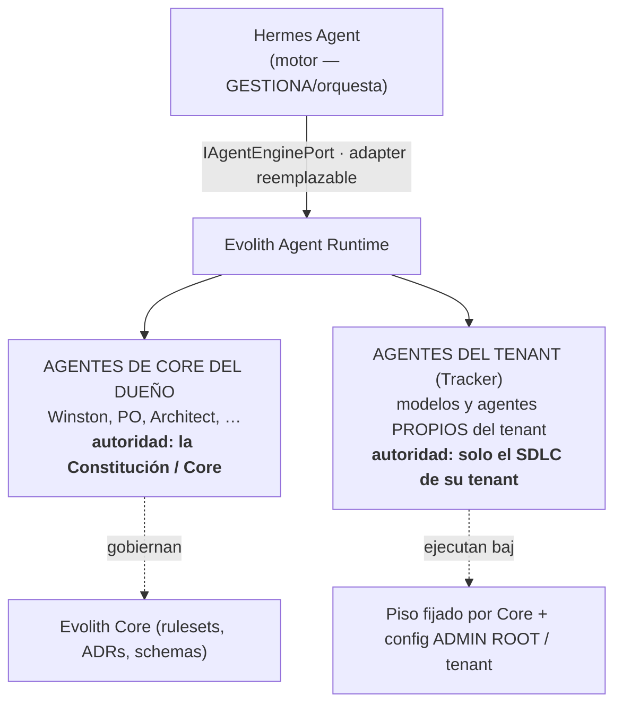
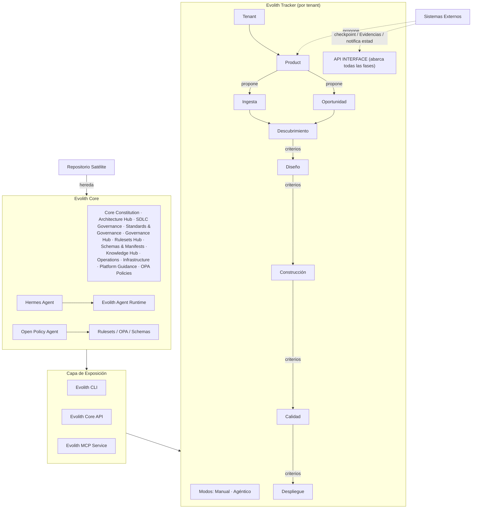

# Evolith — Arquitectura Conceptual del Producto y Modelo de Autoridad de Agentes (Registro de Aprendizaje de Agentes)

> **Navegación Bilingüe:** [English Version](./agent-authority-model.md)

**Estado:** Activo — Evolutivo (sesión de diseño guiada por el dueño)
**Dueños:** `@winston` (lente de arquitectura) · `@po` (lente de negocio)
**Última Actualización:** 2026-07-04
**Alcance:** Arquitectura conceptual de toda la suite y la frontera de autoridad entre los agentes de gobierno de Core y los agentes del tenant en Tracker. Cross-repo.
**Autoridad:** Registro de aprendizaje/conocimiento, no una regla vinculante. Los cambios vinculantes requieren un ADR. Fuente: dos diagramas conceptuales del dueño (2026-07-04). Alinea con [Product Vision Master](../../../../product/suite/vision/evolith-product-vision-master.es.md) §2.4, §3.4.

---

## 1. Propósito

Persistir el modelo conceptual de producto del dueño (dos diagramas) y, sobre todo, la **frontera de autoridad de agentes**: Hermes gestiona; los agentes del dueño gobiernan Core; cada tenant del Tracker puede traer sus propios modelos y agentes. Los diagramas se transcriben a Mermaid versionable (máquina-legible, diffeable) — preferido sobre los PNG fuente.

## 2. Modelo de Autoridad de Agentes (la regla decisiva)

Tres niveles de agencia, todos detrás de puertos provider-neutral:

**Reglas de frontera (Winston las custodia):**
1. **Hermes es el motor, no la autoridad.** Gestiona/orquesta detrás de `IAgentEnginePort` y es un adapter reemplazable — nunca la fuente de verdad (reglas de diseño: `chat-interfaces-cannot-execute-critical-actions`; `external-tech-must-use-adapter`).
2. **Los agentes de Core del dueño gobiernan la Constitución.** El roster BMAD (Winston, PO, …) tiene autoridad sobre el corpus de Core. Propiedad/configuración del dueño de la plataforma. Gestionados por Hermes como motor.
3. **Los agentes del tenant son propios del tenant.** A nivel Tracker cada tenant selecciona sus propios modelos/agentes (modos de ejecución `Manual | Agéntico`, Visión §2.4), provider-neutral detrás de los mismos puertos. Ejecutan **solo** el SDLC del tenant, acotados por el piso fijado por Core (L-010) y la config tenant/ADMIN ROOT (L-006).
4. **Nunca mezclados.** Los agentes de gobierno de Core y los de ejecución del tenant nunca comparten alcance de autoridad. Mismos puertos, autoridad distinta. Enlaza con L-003 (aprobación de agente por tenant).

## 3. Arquitectura Runtime Conceptual (Diagrama 2)

**Lecturas del diagrama:**
- Cada transición de fase lleva **criterios** (los criterios del Gate inteligente, L-006) y produce **checkpoints (COMPUERTA)** + **Evidencias (ARTEFACTOS)** expuestos vía la **API INTERFACE**.
- Los **Sistemas Externos** tanto *proponen* trabajo (hacia Product) como *notifican* el estado de criterios/artefactos en cada checkpoint (la ruta de ACL/evidencia de observabilidad).
- Los **repos satélite heredan** de Core; el Tracker es un consumidor de la Capa de Exposición (CLI/API/MCP), consistente con ADR-0074.

## 4. Taxonomía de Core (Diagrama 1) — confirma la casa de Agents Skills

| Grupo | Contenidos |
|---|---|
| **FOUNDATIONS** | Principles · Common Rules · Satellite Definitions · **Agents Skills** |
| **SDLC** | Phases · Artefacts · Standards · Gates · Maturity · Governance · Rules · Glossary |
| **ARCHITECTURE** | Topologies · ADRs · Blueprints · Patterns · Foundations · Progressive Evolution Phases · Demos |
| **CONTROL CENTER** | GAPs Tracking · Maturity Reports · Audits · Opportunities Reports · Evidences · Taxonomy |

→ **Agents Skills es ciudadano de FOUNDATIONS.** Esto valida `reference/core/foundations/agent-skills/` como la casa canónica de las personas/skills de agentes y confirma el destino de la reorganización (matar el drift de rutas de `.bmad-core/agents` + `manifest.json`; apuntar el descubrimiento a la ubicación real).

## 5. Lentes

- **`@po`:** El autoservicio del tenant con *sus propios* modelos/agentes es un eje de producto y monetización (valor enterprise); los agentes de Core del dueño son la columna de gobierno que mantiene honesto a cada tenant. "Opportunities Reports" (Control Center) es la superficie de reporte del punto de ingreso Oportunidad (L-001).
- **`@winston`:** Aplicar la frontera vía puertos — agentes de Core y del tenant ambos detrás de `IAgentEnginePort`, alcances de autoridad distintos, Hermes un adapter. La provider-neutrality es innegociable. La reorg debe hacer que el descubrimiento de agentes apunte a `foundations/agent-skills/` y mantener a Hermes como adapter del runtime, no como fuente de definición.

## 6. Resultado de la Reorg e Ítems Abiertos

- **Reorg ejecutada (2026-07-04):** definiciones de agentes confirmadas como canónicas en `foundations/agent-skills/`; arregladas las rutas rotas de `manifest.json`; **activado el gate de freshness GT-409** (antes falso verde — apuntaba a directorios vacíos de `.bmad-core/` y a una ruta `packages/` sin `src/`) contra la ubicación real; corregido `.bmad-core/README` para describir solo orquestación. `.harness/agents/` (contratos operativos: router, discovery, specs) **se mantiene separado por decisión** — definición de corpus vs contrato de runtime del harness son responsabilidades distintas.
- **Separación de cinco responsabilidades (canónica):** Definición → `foundations/agent-skills/`; Contratos operativos → `.harness/agents/`; Descubrimiento → `.harness/manifest.yaml`; Orquestación → `.bmad-core/`; Ejecución → `src/packages/agent-runtime/` (Hermes + adapters tras puertos).
- **Abierto:** modelar el registro/selección de agentes del tenant como una capability gobernada (adapters de Skill Registry por tenant) distinta de los agentes de Core.
- **Drift abierto (diferido a una tarea):** `DEFAULT_SKILLS` (hardcodeado en `default-skills.ts`) no está sincronizado con `manifest.json` / `.harness/manifest.yaml` — tres registros de skills, sin fuente única de verdad. Candidato a gap.
- PNG fuente: el dueño puede dejar los originales en una carpeta `assets/`; esta transcripción Mermaid es el registro máquina-legible.

---

_Ver [Persona Winston](./winston.es.md) · [Persona PO](./po.es.md) · [Flujo de Ingesta del Tracker](./tracker-intake-flow.es.md) · [Product Vision Master](../../../../product/suite/vision/evolith-product-vision-master.es.md)._
