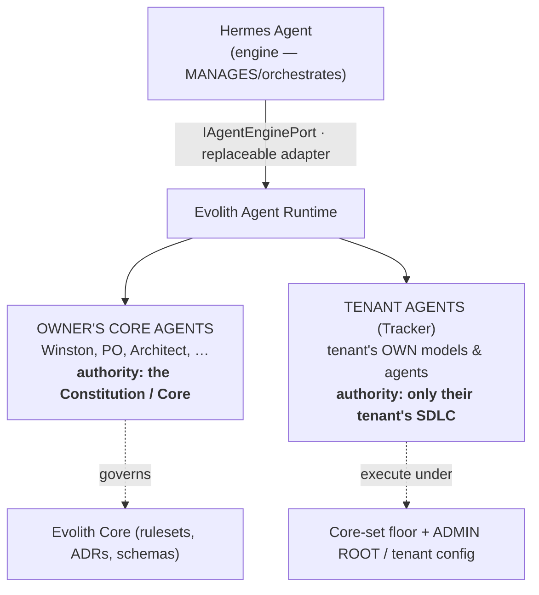
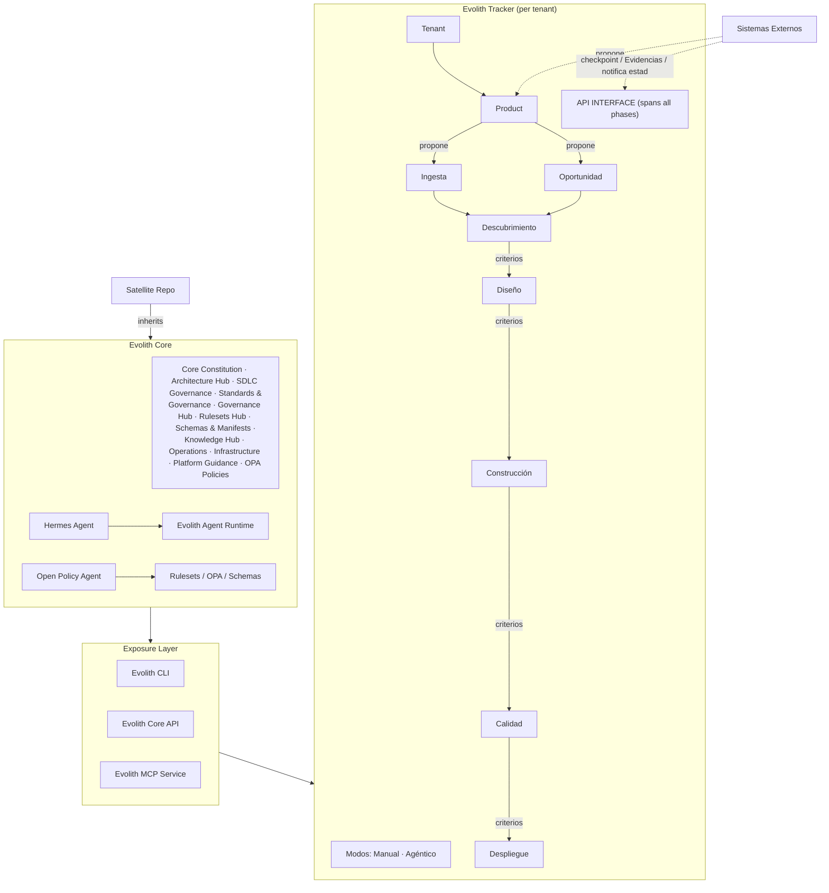

# Evolith — Product Conceptual Architecture & Agent Authority Model (Agent Learning Record)

> **Bilingual Navigation:** [Versión en Español](./agent-authority-model.es.md)

**Status:** Active — Evolving (owner-guided design session)
**Owners:** `@winston` (architecture lens) · `@po` (business lens)
**Last Updated:** 2026-07-04
**Scope:** Whole-suite conceptual architecture and the authority boundary between Core-governance agents and Tracker-tenant agents. Cross-repo.
**Authority:** Learning/knowledge record, not a binding rule. Binding changes require an ADR. Source: two owner conceptual diagrams (2026-07-04). Aligns with [Product Vision Master](../../../../product/suite/vision/evolith-product-vision-master.md) §2.4, §3.4.

---

## 1. Purpose

Persist the owner's conceptual product model (two diagrams) and, above all, the **agent authority boundary**: Hermes manages; the owner's agents govern Core; each Tracker tenant may bring its own models and agents. Diagrams are transcribed to versionable Mermaid (machine-readable, diffable) — preferred over source PNGs.

## 2. Agent Authority Model (the decisive rule)

Three tiers of agency, all behind provider-neutral ports:

**Boundary rules (Winston custodies these):**
1. **Hermes is the engine, not the authority.** It manages/orchestrates behind `IAgentEnginePort` and is a replaceable adapter — never the source of truth (design rule: `chat-interfaces-cannot-execute-critical-actions`; `external-tech-must-use-adapter`).
2. **Owner's Core agents govern the Constitution.** The BMAD roster (Winston, PO, …) has authority over Core corpus. Owned/configured by the platform owner. Managed by Hermes as the engine.
3. **Tenant agents are the tenant's own.** At Tracker level each tenant selects its own models/agents (execution modes `Manual | Agéntico`, Vision §2.4), provider-neutral behind the same ports. They execute the tenant's SDLC **only**, bound by the Core-set floor (L-010) and tenant/ADMIN ROOT config (L-006).
4. **Never mixed.** Core-governance agents and tenant-execution agents never share authority scope. Same ports, distinct authority. Ties to L-003 (per-tenant agent approval).

## 3. Conceptual Runtime Architecture (Diagram 2)

**Reads from the diagram:**
- Each phase transition carries **criterios** (the intelligent Gate criteria, L-006) and produces **checkpoints (COMPUERTA)** + **Evidencias (ARTEFACTOS)** exposed via the **API INTERFACE**.
- **Sistemas Externos** both *propose* work (into Product) and *notify* criteria/artifact state at each checkpoint (the ACL/observability-evidence path).
- **Satellite repos inherit** from Core; the Tracker is one consumer of the Exposure Layer (CLI/API/MCP), consistent with ADR-0074.

## 4. Core Taxonomy (Diagram 1) — confirms Agents Skills home

| Group | Contents |
|---|---|
| **FOUNDATIONS** | Principles · Common Rules · Satellite Definitions · **Agents Skills** |
| **SDLC** | Phases · Artefacts · Standards · Gates · Maturity · Governance · Rules · Glossary |
| **ARCHITECTURE** | Topologies · ADRs · Blueprints · Patterns · Foundations · Progressive Evolution Phases · Demos |
| **CONTROL CENTER** | GAPs Tracking · Maturity Reports · Audits · Opportunities Reports · Evidences · Taxonomy |

→ **Agents Skills is a FOUNDATIONS citizen.** This validates `reference/core/foundations/agent-skills/` as the canonical home for agent personas/skills and confirms the reorganization target (kill the `.bmad-core/agents` + `manifest.json` path drift; point discovery at the real location).

## 5. Lenses

- **`@po`:** Tenant self-service with *its own* models/agents is a product and monetization axis (enterprise value); the owner's Core agents are the governance backbone that keeps every tenant honest. "Opportunities Reports" (Control Center) is the reporting surface for the Opportunity entry point (L-001).
- **`@winston`:** Enforce the boundary via ports — Core agents and tenant agents both behind `IAgentEnginePort`, distinct authority scopes, Hermes one adapter. Provider-neutrality is non-negotiable. The reorg must make agent discovery point at `foundations/agent-skills/` and keep Hermes as a runtime adapter, not a definition source.

## 6. Reorg Outcome & Open Items

- **Reorg executed (2026-07-04):** agent definitions confirmed canonical in `foundations/agent-skills/`; fixed `manifest.json` broken paths; **activated the GT-409 freshness gate** (previously false-green — it pointed at empty `.bmad-core/` dirs and a `packages/` path missing `src/`) against the real location; corrected `.bmad-core/README` to describe orchestration-only. `.harness/agents/` (operational contracts: router, discovery, specs) **kept separate by decision** — corpus definition vs harness runtime contract are distinct concerns.
- **Five-concern separation (canonical):** Definition → `foundations/agent-skills/`; Operational contracts → `.harness/agents/`; Discovery → `.harness/manifest.yaml`; Orchestration → `.bmad-core/`; Execution → `src/packages/agent-runtime/` (Hermes + adapters behind ports).
- **Open:** model tenant-agent registration/selection as a governed capability (per-tenant Skill Registry adapters) distinct from Core agents.
- **Open drift (deferred to a task):** `DEFAULT_SKILLS` (hardcoded in `default-skills.ts`) is not synced with `manifest.json` / `.harness/manifest.yaml` — three skill registries, no single source of truth. Candidate gap.
- Source PNGs: owner may drop originals under an `assets/` folder; this Mermaid transcription is the machine-readable record.

---

_See [Winston persona](./winston.md) · [PO persona](./po.md) · [Tracker Intake Flow](./tracker-intake-flow.md) · [Product Vision Master](../../../../product/suite/vision/evolith-product-vision-master.md)._
