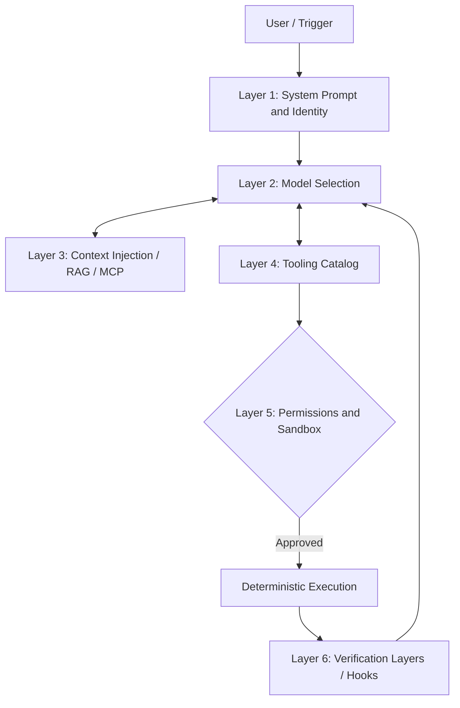

# Harness Reference: The Agent's Armor


---

## Formal Definition of Harness
En esta arquitectura corporativa, definimos **Arnés** como la infraestructura técnica determinista que envuelve un modelo probabilístico. Su objetivo es restringir, potenciar y validar las capacidades de razonamiento del LLM, convirtiéndolo en un agente capaz de operar de forma segura en entornos de producción.

No es el "cerebro" (ése es el modelo); es el "sistema nervioso y el exoesqueleto".
## Layers of a Corporate Harness



## The Four Pillars of a Robust Harness

### 1. Documentation as Code (AGENTS.md)
Un agente es un "nuevo usuario" permanente. No supone nada. El primer paso es inyectar la verdad fundamental del proyecto: crear comandos, tecnologías, reglas de estilo y dependencias, centralizados en el archivo estandarizado `AGENTS.md`.
### 2. Architectural Constraints
Establezca límites legibles por máquina. En lugar de rogarle al agente que no use una biblioteca obsoleta, el arnés debe configurar herramientas que impidan importaciones no autorizadas o usar linters estrictos que fallan si el agente intenta romper los límites hexagonales ("eslint-plugin-boundaries").
### 3. Layered Verification
Confiar ciegamente en los resultados del LLM es inaceptable. El arnés debe implementar un ciclo automatizado "Rojo, Verde, Refactor":
* **Gancho posterior a la herramienta:** Inmediatamente después de una edición, ejecute el linter.
* **Precompromiso:** Ejecutar pruebas unitarias para el área modificada.
* **CI:** Conjunto completo de pruebas de regresión.
### 4. Garbage Collection
Los agentes pueden generar silenciosamente deuda técnica, redundancia o archivos fantasma. Un arnés avanzado organiza "agentes limpiadores" periódicos (agentes Linter) cuya única misión es patrullar el código en busca de inconsistencias estilísticas e incongruencias contextuales introducidas por pases anteriores de IA.

---
## Base Agentic Cycle (Pseudocode)
El motor de ejecución del arnés sigue este patrón de control:```python
messages = [system_prompt, user_input]

while True:
 # 1. Model inference
 response = call_model(messages)
 
 # 2. Tool call detection
 tool_requests = extract_tool_calls(response)
 
 # If the model does not wish to use more tools, the cycle terminates.
 if not tool_requests: 
 return response
 
 # 3. Sequential or parallel execution of authorized tools
 for request in tool_requests:
 if check_permissions(request.name):
 result = execute_tool(request.name, request.args)
 
 # Immediate (deterministic) validation hook
 validated_result = run_post_tool_hooks(request.name, result)
 
 messages.append({
 "role": "tool", 
 "tool_call_id": request.id, 
 "content": validated_result
 })
 else:
 messages.append({
 "role": "tool", 
 "tool_call_id": request.id, 
 "content": "ERROR: Permission denied to execute this tool."
 })
```> [!ADVERTENCIA]
> **Advertencia sobre la manipulación del arnés:** El modelo no tiene visibilidad del código fuente de una herramienta a menos que se proporcione específicamente. Solo entiende la **Descripción (Metadatos)** de la herramienta. Las descripciones ambiguas generan alucinaciones de uso catastróficas.

---
[Volver al índice](./README.md)