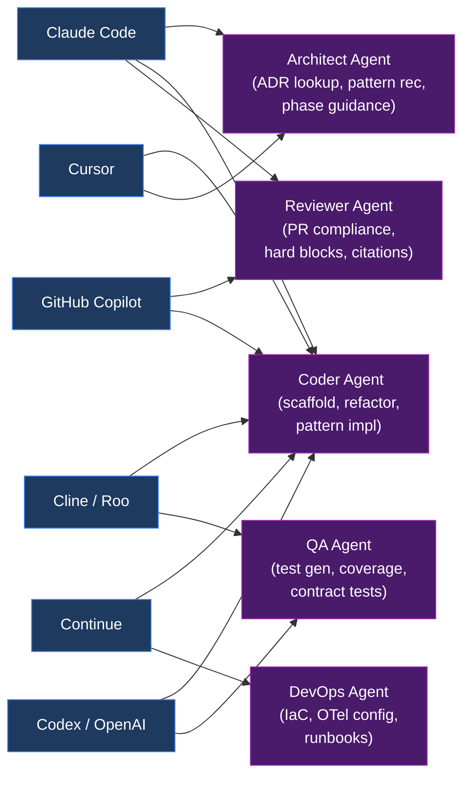
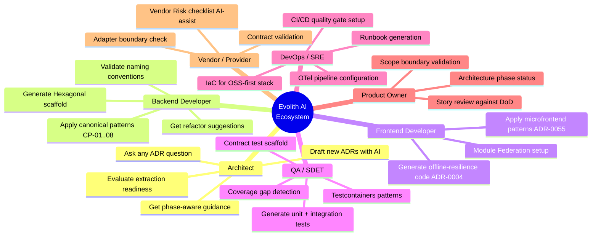
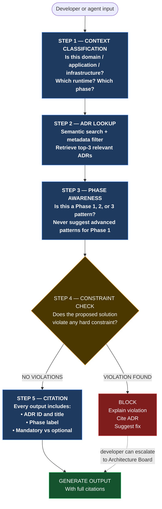

# V-09 — Evolith AI Agent Ecosystem

> **Audience:** Architecture Board, Tech Leads, AI Platform Engineers

---

## Visual 9-A — Full AI Ecosystem Map

```mermaid
flowchart TB
    classDef developer fill:#1e3a5f,stroke:#3b82f6,color:#fff
    classDef knowledge fill:#14532d,stroke:#22c55e,color:#fff
    classDef agent fill:#4a1a6b,stroke:#9c27b0,color:#fff
    classDef harness fill:#4a3800,stroke:#f59e0b,color:#fff,font-weight:bold
    classDef gate fill:#7f1d1d,stroke:#ef4444,color:#fff
    classDef human fill:#374151,stroke:#9ca3af,color:#fff

    subgraph DEVS[" Developer Layer"]
        direction LR
        T1["Claude Code"]:::developer
        T2["Cursor / Cline / Roo"]:::developer
        T3["GitHub Copilot"]:::developer
        T4["Continue / Codex"]:::developer
    end

    subgraph KNOWLEDGE[" Evolith Knowledge Base (RAG)"]
        direction LR
        K1["ADR Vector Store\n133 ADRs indexed\nby runtime+phase+domain"]:::knowledge
        K2["Patterns Store\nCP-01..08\nwith code templates"]:::knowledge
        K3["Standards Store\nEngineering rules\nNaming + Security"]:::knowledge
        K4["System Prompt Core\nALWAYS injected\nHard constraints"]:::knowledge
    end

    subgraph AGENTS[" Specialist Agent Layer"]
        direction LR
        A1[" Architect\nAgent\nADR lookup\nPattern rec"]:::agent
        A2[" Reviewer\nAgent\nPR compliance\nHard blocks"]:::agent
        A3["️ Coder\nAgent\nScaffold gen\nRefactor"]:::agent
        A4[" QA\nAgent\nTest gen\nCoverage"]:::agent
        A5[" DevOps\nAgent\nIaC + OTel\nRunbooks"]:::agent
    end

    subgraph HARNESS["️ Harness AI — Orchestration Layer"]
        direction LR
        H1["Orchestrator\nRoutes to\nspecialist agents"]:::harness
        H2["Approval Gates\nHuman-in-the-loop\nBoard workflows"]:::harness
        H3["Pipeline Steps\nCI/CD compliance\ngates"]:::harness
        H4["Audit Trail\nImmutable log of\nall AI actions"]:::harness
    end

    subgraph GATES[" CI/CD Quality Gates"]
        direction LR
        G1["eslint-boundaries\nDomain isolation"]:::gate
        G2["ADR citation\nvalidator"]:::gate
        G3["Coverage gate\n≥70%"]:::gate
        G4["Security scan\nCodeQL"]:::gate
    end

    subgraph HUMANS[" Human Oversight"]
        direction LR
        HU1["Developer\nreviews suggestions"]:::human
        HU2["Tech Lead\nfinal PR merge"]:::human
        HU3["Architecture Board\nADR approval"]:::human
    end

    DEVS -->|"injects context\nvia AGENTS.md / .cursorrules"| KNOWLEDGE
    KNOWLEDGE -->|"retrieved chunks\n+ metadata"| AGENTS
    AGENTS --> H1
    H1 --> H2 & H3 & H4
    H3 --> GATES
    H2 --> HUMANS
    GATES --> HUMANS
```

---

## Visual 9-B — Tool-to-Agent Assignment Matrix

---

## Visual 9-C — Role-to-AI Assistance Map

---

## Visual 9-D — AI Reasoning Chain (5 Steps)

