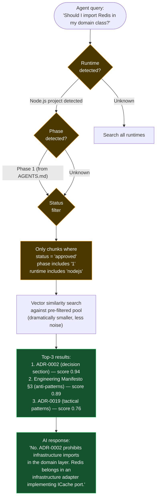
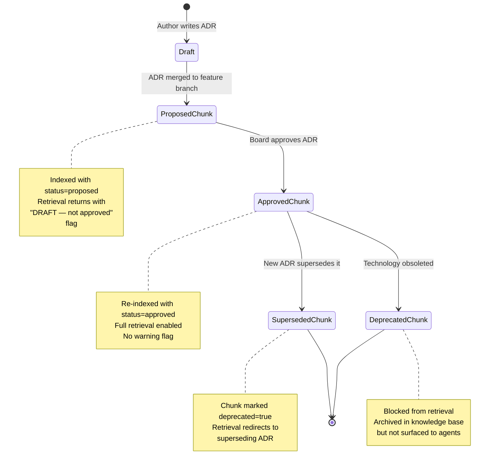
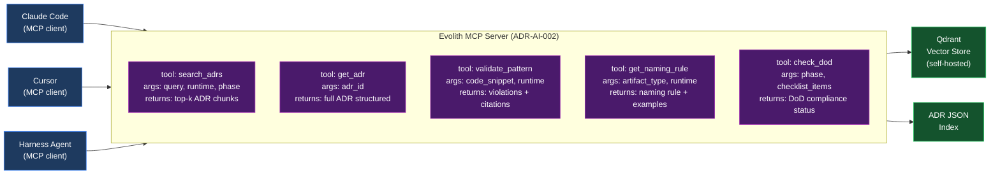

# V-10 — Knowledge Ingestion & RAG Pipeline

---

## Visual 10-A — Full Ingestion Pipeline

```mermaid
flowchart LR
    classDef source fill:#1e3a5f,stroke:#3b82f6,color:#fff
    classDef process fill:#4a3800,stroke:#f59e0b,color:#fff
    classDef store fill:#14532d,stroke:#22c55e,color:#fff
    classDef query fill:#4a1a6b,stroke:#9c27b0,color:#fff

    subgraph SOURCE[" Evolith Repository (Source of Truth)"]
        direction TB
        S1["reference/core/architecture/adrs/**/*.md\n57+ ADRs"]:::source
        S2["reference/core/architecture/\ncanonical-patterns/**/*.md"]:::source
        S3["reference/core/sdlc/standards/\nengineering-manifesto.md"]:::source
        S4["reference/core/sdlc/glossary/glossary.md\nNaming conventions"]:::source
        S5["AGENTS.md · .harness/rules/\nglobal-rules.md"]:::source
    end

    subgraph PIPELINE["️ Ingestion Pipeline (CI-triggered)"]
        direction TB
        P1["1. Parse Markdown\nExtract sections by H2/H3\nheadings"]:::process
        P2["2. Enrich Metadata\nADD: adr_id · runtime · phase\ndomain · severity · status"]:::process
        P3["3. Chunk Strategy\nADR: per section\nPattern: full doc\nStandard: per rule"]:::process
        P4["4. Generate Embeddings\nOpenAI text-embedding-3-large\nor self-hosted model"]:::process
        P5["5. Index + Store\nVector DB + metadata\nfilters"]:::process
    end

    subgraph STORES["️ Knowledge Stores"]
        direction TB
        VS1["ADR Vector Store\nChroma / Qdrant\n(self-hosted)"]:::store
        VS2["Patterns Store"]:::store
        VS3["Standards Store\n(rules + examples)"]:::store
        VS4["System Prompt Store\n(always-injected)"]:::store
    end

    subgraph RETRIEVAL[" Retrieval Layer (At query time)"]
        direction TB
        R1["Pre-filter\nruntime + phase + status\nfrom metadata"]:::query
        R2["Semantic Search\nvector similarity\ntop-k chunks"]:::query
        R3["Re-rank\nby ADR status\n(approved > proposed)"]:::query
        R4["Context Assembly\nchunks + metadata +\ncitation template"]:::query
    end

    SOURCE -->|"Git webhook\non main merge"| PIPELINE
    PIPELINE --> STORES
    STORES --> RETRIEVAL
    RETRIEVAL -->|"Injected into\nAI agent context"| AI(["AI Agent\nResponse"]):::query
```

---

## Visual 10-B — Metadata Filter Before Vector Search

---

## Visual 10-C — Knowledge Freshness Lifecycle

---

## Visual 10-D — MCP Server: ADRs as AI Tools

