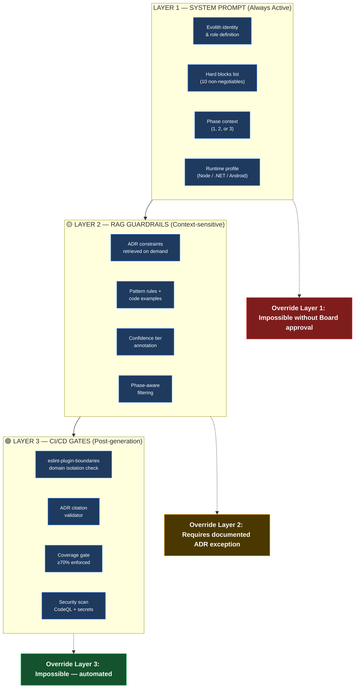
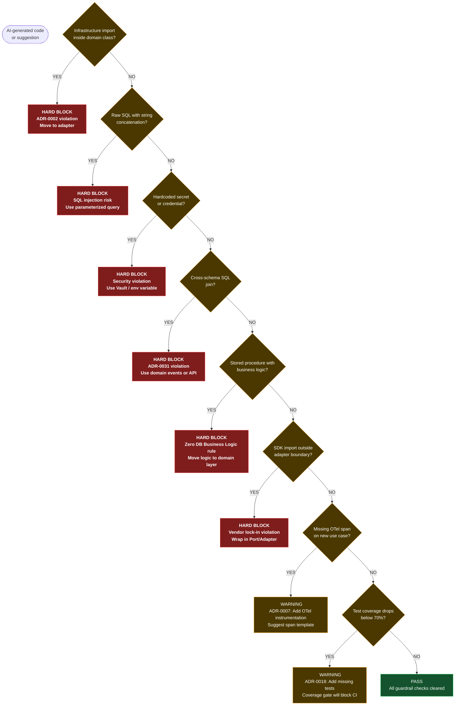
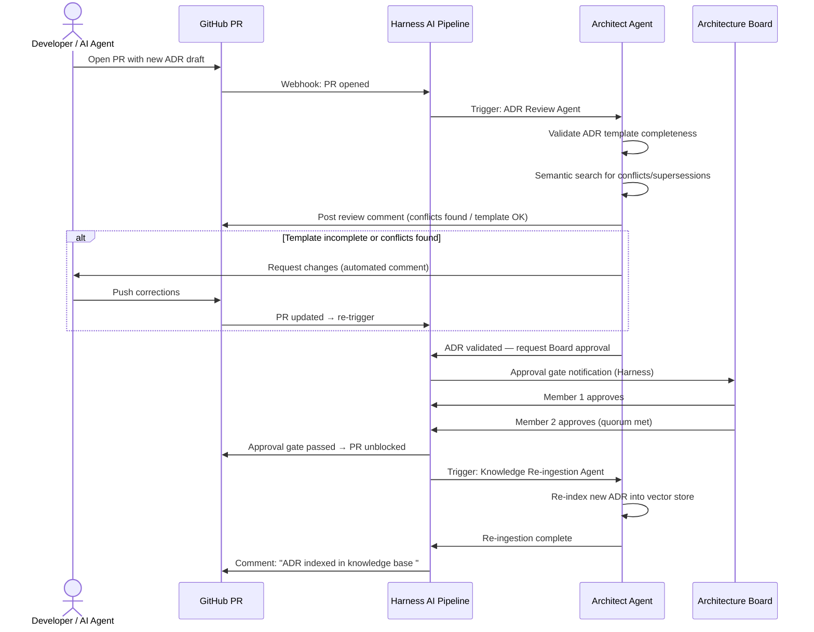
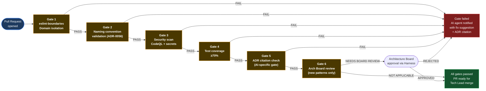
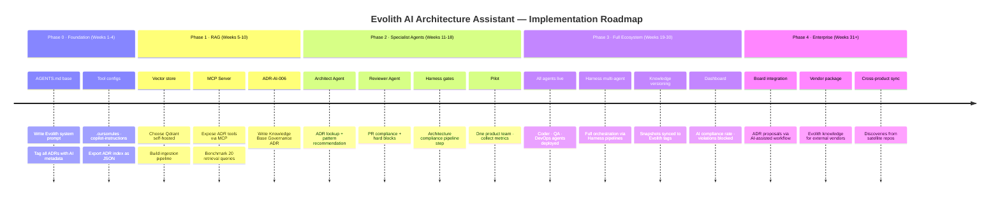

# V-11 — Governance, Guardrails & Harness Orchestration

---

## Visual 11-A — The Three Guardrail Layers

---

## Visual 11-B — Hard Blocks Decision Tree

---

## Visual 11-C — Harness AI Approval Workflow (ADR Review)

---

## Visual 11-D — Compliance Gate in CI/CD Pipeline

---

## Visual 11-E — Implementation Roadmap Timeline

