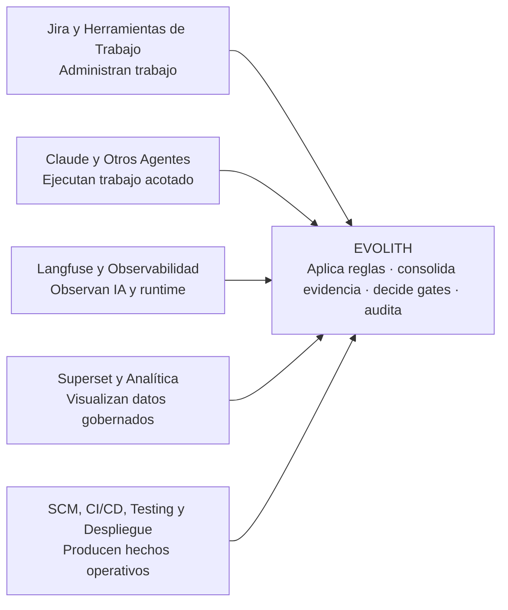
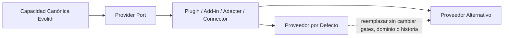
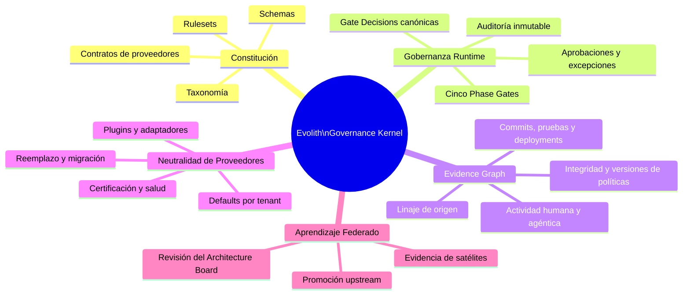
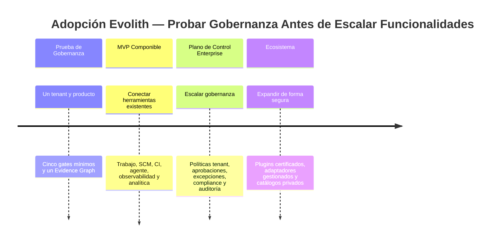

# V-01 — Resumen Ejecutivo: Plano de Control de Gobernanza Evolith

> **Audiencia:** Ejecutivo / Sponsor  
> **Propósito:** Vista de una sola página de la nueva visión del producto  
> **Bilingüe:** [English](./v01-executive-one-pager.md)  
> **Regla de vigencia:** Revisar cuando Evolith cambie su núcleo de gobernanza, modelo de proveedores, Phase Gates, Evidence Graph o posicionamiento.

---

## La Pregunta que Este Visual Responde

> **¿Qué posee Evolith de forma única si ya existen Jira, Claude, Langfuse, Superset, CI/CD y otras herramientas?**

---

## Visual 1-A — El Nuevo Ecosistema Evolith

```mermaid
flowchart TB
    classDef core fill:#1e3a5f,stroke:#3b82f6,color:#fff,font-weight:bold
    classDef tracker fill:#14532d,stroke:#22c55e,color:#fff,font-weight:bold
    classDef provider fill:#4a1d96,stroke:#a855f7,color:#fff
    classDef product fill:#374151,stroke:#9ca3af,color:#fff
    classDef board fill:#4a3800,stroke:#f59e0b,color:#fff,font-weight:bold

    BOARD["Architecture Board\nAprueba la Constitución y diseños objetivo"]:::board
    CORE["Evolith Core\nReglas · Schemas · Taxonomía · Contratos"]:::core
    TRACKER["Evolith Tracker\nPlano de Control de Gobernanza\nGates · Evidencia · Decisiones · Auditoría"]:::tracker

    WORK["Gestión de Trabajo\nJira · Azure DevOps · GitHub Issues · Alternativas"]:::provider
    AGENT["Ejecución de Agentes\nClaude · OpenAI · Gemini · Modelos Locales"]:::provider
    OBS["Observabilidad\nLangfuse · OpenTelemetry · Alternativas"]:::provider
    BI["Analítica\nSuperset · Grafana · Alternativas"]:::provider
    DELIVERY["SCM · CI/CD · Testing · Seguridad · Despliegue"]:::provider

    PRODUCTS["Productos Satélite\nUMS · Evolith Tracker · Productos Futuros"]:::product

    BOARD --> CORE
    CORE -->|define contratos de gobernanza| TRACKER
    TRACKER <-->|plugins, adaptadores y evidencia| WORK
    TRACKER <-->|plugins, adaptadores y evidencia| AGENT
    TRACKER <-->|plugins, adaptadores y evidencia| OBS
    TRACKER -->|modelo semántico confiable| BI
    TRACKER <-->|plugins, adaptadores y evidencia| DELIVERY
    CORE -->|reglas heredadas| PRODUCTS
    PRODUCTS -->|actividad y evidencia| TRACKER
    PRODUCTS -.->|lecciones validadas upstream| BOARD
```

---

## Visual 1-B — Quién Hace Qué

> **Las herramientas ejecutan e informan. Evolith interpreta, gobierna, decide y preserva la cadena de auditoría.**

---

## Visual 1-C — Reemplazable por Diseño

### Premisa No Negociable del Producto

- Toda herramienta externa es adaptable e intercambiable.
- Los defaults aceleran el onboarding, pero nunca son dependencias arquitectónicas.
- Los schemas específicos permanecen detrás de ACLs.
- Cada tenant puede elegir proveedores permitidos, preferidos, fallback o self-hosted.
- El reemplazo preserva estado canónico y evidencia histórica.

---

## Visual 1-D — Núcleo Irreducible de Evolith

---

## Visual 1-E — Adopción Progresiva

---

## Mensaje Ejecutivo Final

> **Evolith no es otro Jira, herramienta BI, agente o producto de observabilidad.**  
> **Es el plano de control neutral respecto de proveedores que convierte esas capacidades en un solo sistema de ingeniería gobernado y auditable.**

UMS continúa siendo una referencia satélite viva que demuestra patrones Evolith en software real, pero es un producto dentro de un ecosistema gobernado más amplio.

---

*Parte de la [Estrategia de Comunicación Arquitectónica](../architecture-communication-strategy.es.md). Diseño detallado: [Diseño Objetivo de Composición Gobernada](../../evolith-governed-composition-target-design.es.md).*