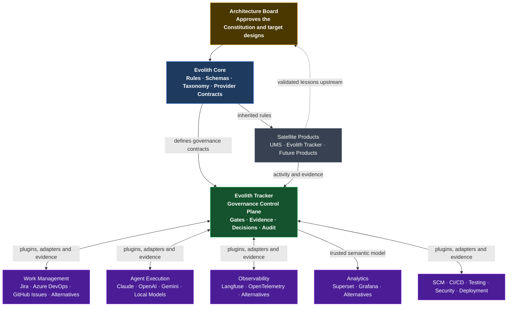
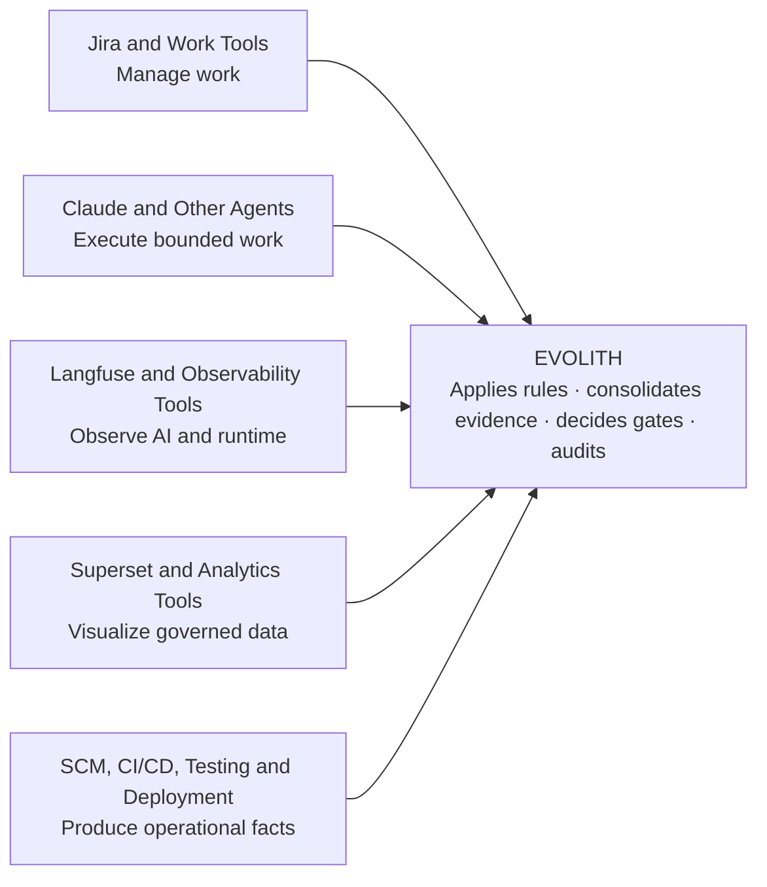
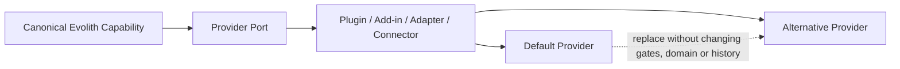
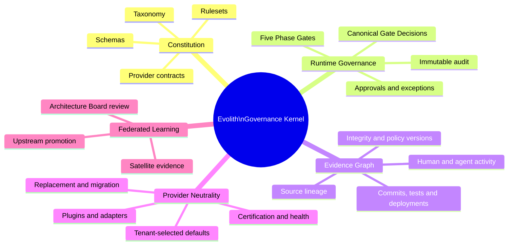
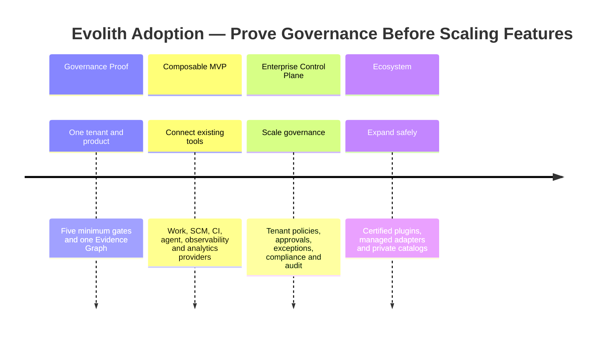

# V-01 — Executive One-Pager: Evolith Governance Control Plane

> **Audience:** Executive / Sponsor  
> **Purpose:** Single-page view of the new product vision  
> **Bilingual:** [Español](./v01-executive-one-pager.es.md)  
> **Freshness rule:** Review whenever Evolith changes its governance kernel, provider model, Phase Gates, evidence model, or product positioning.

---

## The Question This Visual Answers

> **What does Evolith uniquely own if Jira, Claude, Langfuse, Superset, CI/CD, and other tools already exist?**

---

## Visual 1-A — The New Evolith Ecosystem

---

## Visual 1-B — Who Does What

> **Tools execute and report. Evolith interprets, governs, decides, and preserves the audit chain.**

---

## Visual 1-C — Replaceable by Design

### Non-Negotiable Product Premise

- Every external tool is adaptable and interchangeable.
- Defaults accelerate onboarding but are never architectural dependencies.
- Provider-specific schemas remain behind ACLs.
- Tenants may select allowed, preferred, fallback, or self-hosted providers.
- Replacement preserves canonical state and historical evidence.

---

## Visual 1-D — The Irreducible Evolith Kernel

---

## Visual 1-E — Progressive Adoption

---

## Executive Takeaway

> **Evolith is not another Jira, BI tool, agent, or observability product.**  
> **It is the provider-neutral governance control plane that makes those capabilities operate as one auditable engineering system.**

UMS remains a living satellite reference that proves Evolith patterns in real software, but it is one product inside the broader governed ecosystem.

---

*Part of the [Architecture Communication Strategy](../architecture-communication-strategy.md). Detailed design: [Governed Composition Target Design](../../evolith-governed-composition-target-design.md).*