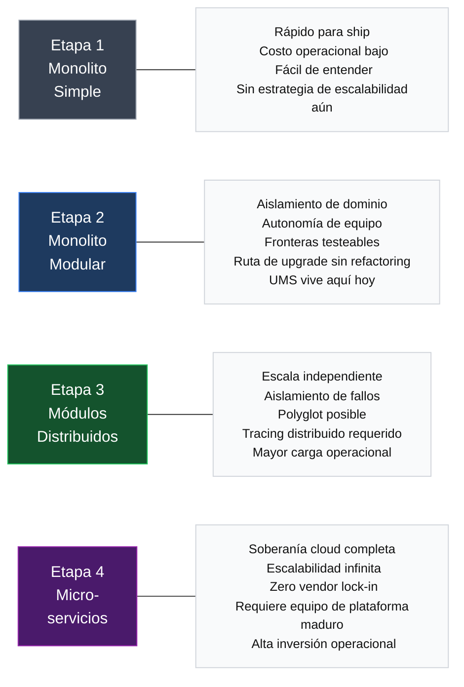
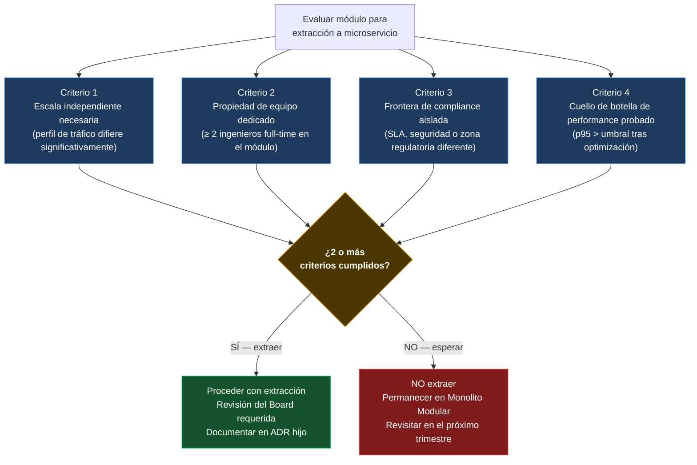
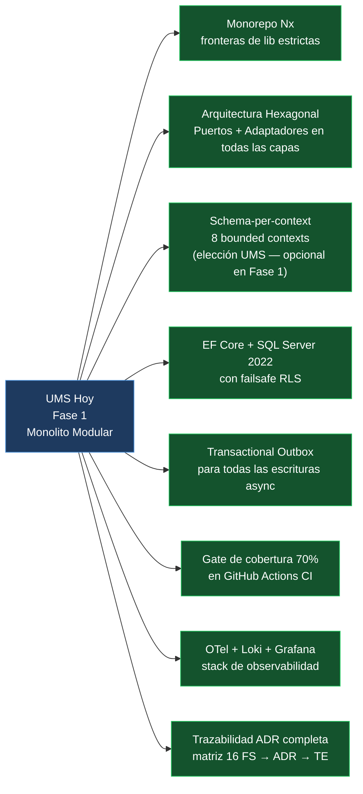

# V-02 — Diagrama del Viaje de Arquitectura Progresiva

> **Audiencia:** Todos los equipos  
> **Propósito:** Explicar las 4 etapas evolutivas y exactamente qué dispara cada transición  
> **Bilingüe:** [English](./v02-progressive-journey.md)

---

## Visual 2-A — Las 4 Etapas con sus Disparadores

```mermaid
flowchart TD
    classDef stage fill:#1e3a5f,stroke:#4a90d9,color:#fff,font-weight:bold,padding:10px
    classDef trigger fill:#4a3800,stroke:#f59e0b,color:#fff,font-style:italic
    classDef adr fill:#14532d,stroke:#22c55e,color:#fff,font-size:12px
    classDef forbidden fill:#7f1d1d,stroke:#ef4444,color:#fff

    START([" Nueva Idea\nde Producto"]) --> S1

    subgraph S1["ETAPA 1 — Monolito Simple"]
        M1["Unidad deployable única\nSin fronteras de módulo aún\nEstructura mínima viable"]:::stage
    end

    T1{"¿Equipo ≥ 3 devs?\n¿Múltiples dominios\nemergiendo?"}:::trigger
    S1 --> T1
    T1 -->|NO — quedarse aquí| S1
    T1 -->|SÍ| S2

    subgraph S2["ETAPA 2 — Monolito Modular  DEFAULT"]
        M2["Monorepo Nx con fronteras estrictas\nArquitectura Hexagonal aplicada\nDominio compartido via Shared Kernel\nDB: schema único (SOA) válido en Fase 1\nSchema-per-context opcional → Fase 2+"]:::stage
        A2["ADR-0001 · ADR-0002\nADR-0031 (opcional Fase 1) · ADR-0047"]:::adr
    end

    T2{"¿2 de 4 criterios\nde extracción cumplidos?\nADR-0045"}:::trigger
    S2 --> T2
    T2 -->|NO — quedarse aquí| S2
    T2 -->|SÍ — módulo específico| S3

    subgraph S3["ETAPA 3 — Módulos Distribuidos"]
        M3["Módulos seleccionados extraídos\nSidecars Dapr para service mesh\nTransactional Outbox para async\nSagas Distribuidas para flujos multi-paso"]:::stage
        A3["ADR-0006 · ADR-0033\nADR-0035 · ADR-0046"]:::adr
    end

    T3{"¿La complejidad operacional\ncompleta justifica la\ndistribución global?"}:::trigger
    S3 --> T3
    T3 -->|AÚN NO| S3
    T3 -->|SÍ| S4

    subgraph S4["ETAPA 4 — Microservicios / North Star"]
        M4["Orquestación multi-cloud completa\nArquitectura orientada a eventos a escala\nRed zero-trust\nCompliance-as-Code en CI"]:::stage
        A4["ADR-0013 · ADR-0046\nADR-0055 · Roadmap Fase 3"]:::adr
    end

    WARN[" NUNCA SALTAR ETAPAS\nMicroservicios sin la disciplina de la Etapa 2\n= Monolito Distribuido (lo peor de ambos mundos)"]:::forbidden
    S4 -.-> WARN
```

---

## Visual 2-B — Qué Obtienes en Cada Etapa

---

## Visual 2-C — Criterios de Preparación para Extracción ADR-0045 (Regla 2 de 4)

---

## Visual 2-D — Checklist de Fundación Fase 1 (UMS como ejemplo)

---

*Parte de la [Estrategia de Comunicación Arquitectónica](../architecture-communication-strategy.es.md)*
