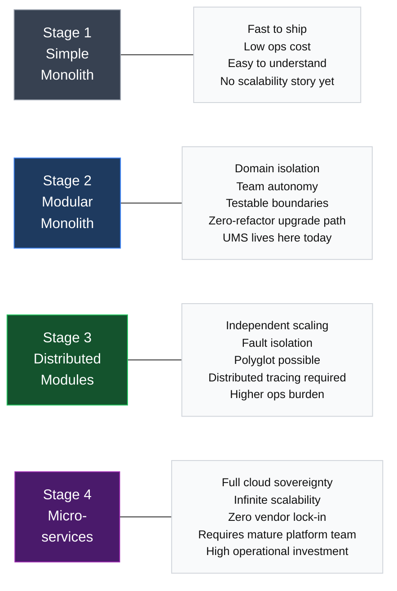
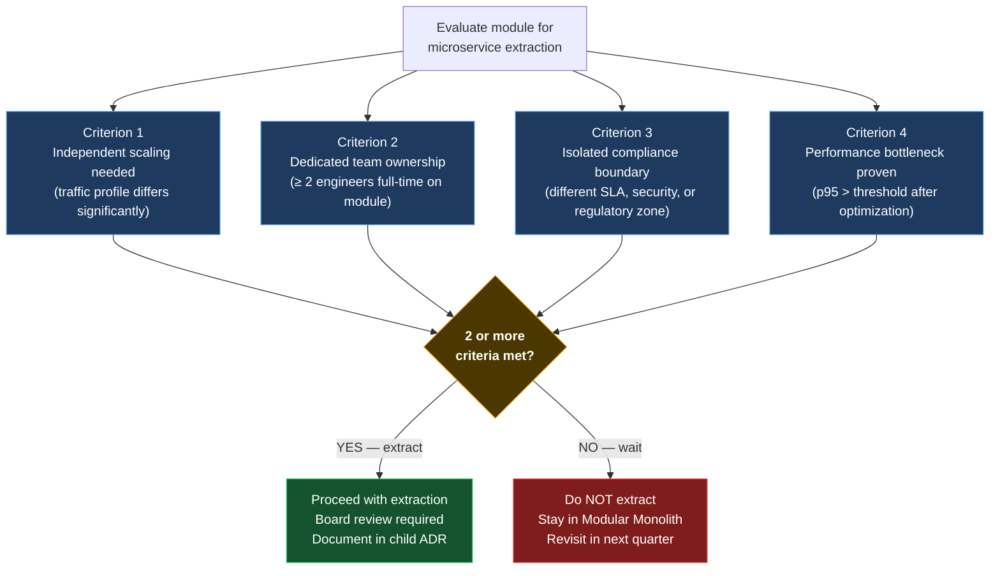
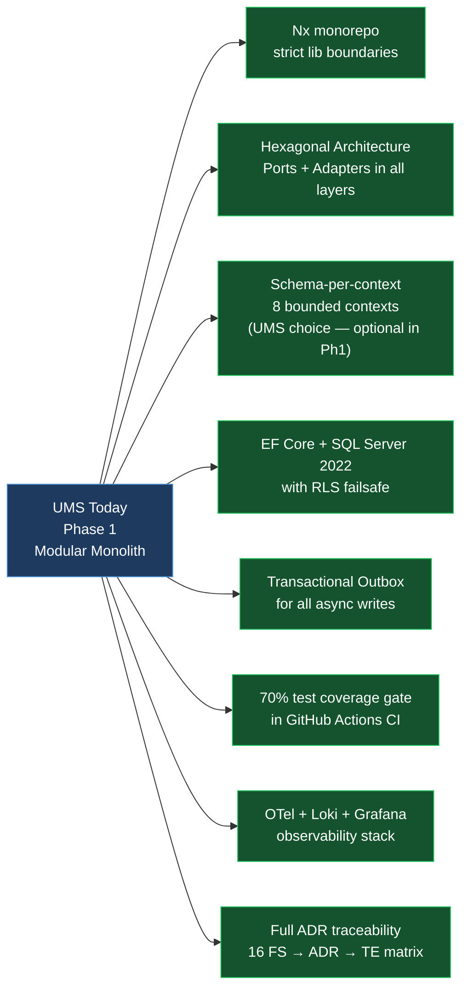

# V-02 — Progressive Architecture Journey Diagram

> **Audience:** All teams  
> **Purpose:** Explain the 4 evolutionary stages and exactly what triggers each transition  
> **Bilingual:** [Español](./v02-progressive-journey.es.md)

---

## Visual 2-A — The 4 Stages with Triggers

```mermaid
flowchart TD
    classDef stage fill:#1e3a5f,stroke:#4a90d9,color:#fff,font-weight:bold,padding:10px
    classDef trigger fill:#4a3800,stroke:#f59e0b,color:#fff,font-style:italic
    classDef adr fill:#14532d,stroke:#22c55e,color:#fff,font-size:12px
    classDef forbidden fill:#7f1d1d,stroke:#ef4444,color:#fff

    START([" New Product\nIdea"]) --> S1

    subgraph S1["STAGE 1 — Simple Monolith"]
        M1["Single deployable unit\nNo module boundaries yet\nSmallest viable structure"]:::stage
    end

    T1{"Team ≥ 3 devs?\nMultiple domains\nemerging?"}:::trigger
    S1 --> T1
    T1 -->|NO — stay here| S1
    T1 -->|YES| S2

    subgraph S2["STAGE 2 — Modular Monolith  DEFAULT"]
        M2["Nx monorepo with strict boundaries\nHexagonal Architecture enforced\nShared domain via Shared Kernel\nDB: single schema (SOA) valid in Phase 1\nSchema-per-context optional → Phase 2+"]:::stage
        A2["ADR-0001 · ADR-0002\nADR-0031 (optional Ph1) · ADR-0047"]:::adr
    end

    T2{"2-of-4 extraction\ncriteria met?\nADR-0045"}:::trigger
    S2 --> T2
    T2 -->|NO — stay here| S2
    T2 -->|YES — specific module| S3

    subgraph S3["STAGE 3 — Distributed Modules"]
        M3["Selected modules extracted\nDapr sidecars for service mesh\nTransactional Outbox for async\nDistributed Sagas for multi-step flows"]:::stage
        A3["ADR-0006 · ADR-0033\nADR-0035 · ADR-0046"]:::adr
    end

    T3{"Full operational\ncomplexity justifies\nglobal distribution?"}:::trigger
    S3 --> T3
    T3 -->|NOT YET| S3
    T3 -->|YES| S4

    subgraph S4["STAGE 4 — Microservices / North Star"]
        M4["Full multi-cloud orchestration\nEvent-Driven Architecture at scale\nZero-trust networking\nCompliance-as-Code in CI"]:::stage
        A4["ADR-0013 · ADR-0046\nADR-0055 · Roadmap Phase 3"]:::adr
    end

    WARN[" NEVER SKIP STAGES\nMicroservices without Stage 2 discipline\n= Distributed Monolith (worst of both worlds)"]:::forbidden
    S4 -.-> WARN
```

---

## Visual 2-B — What You Get at Each Stage

---

## Visual 2-C — ADR-0045 Extraction Readiness Criteria (2-of-4 Rule)

---

## Visual 2-D — The Phase 1 Foundation Checklist (UMS as example)

---

*Part of the [Architecture Communication Strategy](../architecture-communication-strategy.md)*
