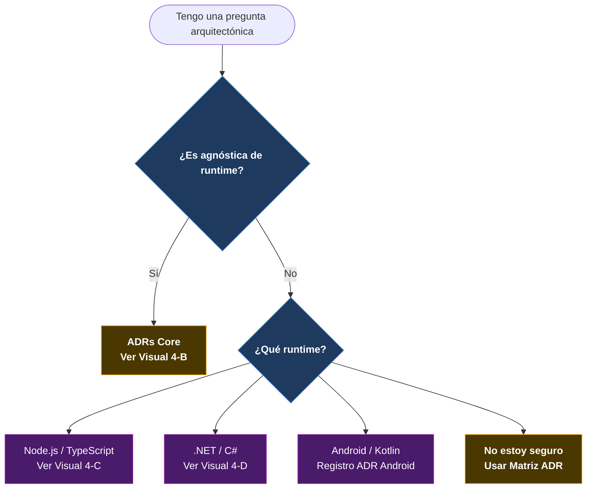
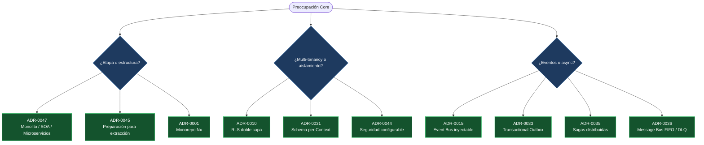
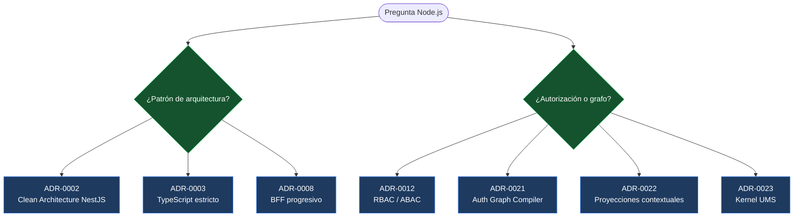
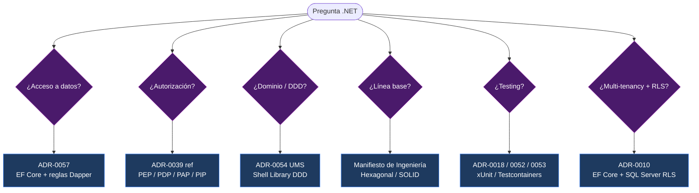

# V-04 — Árbol de Decisión ADR

> **Audiencia:** Arquitectos, Tech Leads, Desarrolladores Senior  
> **Propósito:** Navegar al ADR correcto en menos de 60 segundos  
> **Bilingüe:** [English](./v04-adr-decision-tree.md)

---

## Nota de legibilidad

El diagrama completo del árbol ADR se encuentra en la versión en inglés. Esta versión en español proporciona vistas simplificadas para evitar renderizados ilegibles en GitHub.

---

## Visual 4-A — Embudo de Decisión de Nivel Superior

---

## Visual 4-B — ADR Core: Arquitectura, Tenancy y Eventos

---

## Visual 4-C — ADR Node.js: Arquitectura y Autorización

---

## Visual 4-D — ADR .NET / C#

---

*Parte de la [Estrategia de Comunicación Arquitectónica](../architecture-communication-strategy.es.md)*
