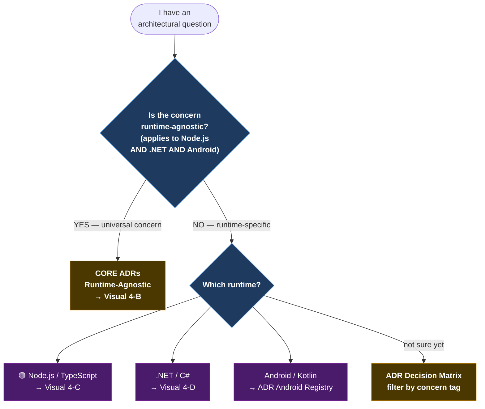
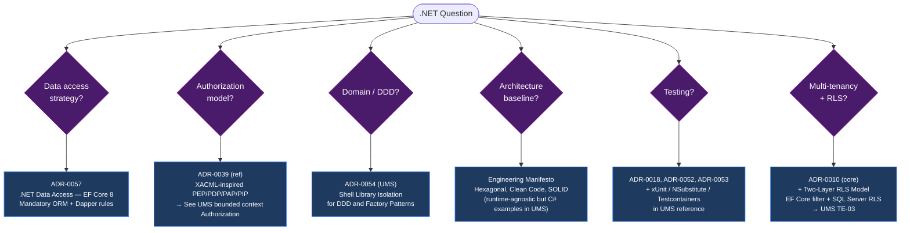

# V-04 — ADR Decision Tree

> **Audience:** Architects, Tech Leads, Senior Developers  
> **Purpose:** Navigate to the right ADR in under 60 seconds  
> **Bilingual:** [Español](./v04-adr-decision-tree.es.md)

---

## Legibility Note

The ADR tree was divided into smaller diagrams to prevent Mermaid from rendering overly large, hard-to-read images that cannot be zoomed or scrolled on GitHub.

---

## Visual 4-A — Top-Level Decision Funnel

---

## Visual 4-B — Core ADR Decision Tree (Runtime-Agnostic)

```mermaid
flowchart TD
    classDef q fill:#1e3a5f,stroke:#4a90d9,color:#fff
    classDef adr fill:#14532d,stroke:#22c55e,color:#fff,font-size:13px
    classDef group fill:#0f172a,stroke:#334155,color:#aaa,font-style:italic

    CORE([" Core Concern"])

    CORE --> QA{"Architecture\nstage / structure?"}:::q
    QA --> A1["ADR-0047\nMonolith vs SOA vs Microservices\nSelection Framework"]:::adr
    QA --> A2["ADR-0045\nMicroservice Extraction\nReadiness Criteria (2-of-4)"]:::adr
    QA --> A3["ADR-0001\nNx Monorepo Orchestration"]:::adr

    CORE --> QB{"Multi-tenancy\nor data isolation?"}:::q
    QB --> B1["ADR-0010\nDual-Layer RLS Strategy\nApp Filter + DB Failsafe"]:::adr
    QB --> B2["ADR-0031\nSchema-per-Context\nDomain Event Catalog"]:::adr
    QB --> B3["ADR-0044\nConfigurable Security\nPersistence Strategy"]:::adr

    CORE --> QC{"Events, async\nor saga flows?"}:::q
    QC --> C1["ADR-0015\nInjectable Event Bus\nIn-Memory → RabbitMQ → Kafka"]:::adr
    QC --> C2["ADR-0033\nTransactional Outbox Pattern"]:::adr
    QC --> C3["ADR-0035\nDistributed Saga Strategy"]:::adr
    QC --> C4["ADR-0036\nMessage Bus FIFO / DLQ"]:::adr

    CORE --> QD{"CQRS or\nread projections?"}:::q
    QD --> D1["ADR-0034\nCQRS Applicability Matrix"]:::adr

    CORE --> QE{"Identity,\nAuth, or MFA?"}:::q
    QE --> E1["ADR-0020\nIdentity Provider Abstraction"]:::adr
    QE --> E2["ADR-0016\nImmutable Audit Trail"]:::adr

    CORE --> QF{"Testing\nor quality?"}:::q
    QF --> F1["ADR-0018\nTesting Pyramid & Quality Gates"]:::adr
    QF --> F2["ADR-0052\nUnit Testing Isolation"]:::adr
    QF --> F3["ADR-0053\nIntegration & E2E Strategy"]:::adr
    QF --> F4["ADR-0005\nCI/CD Quality Gates (CodeQL)"]:::adr

    CORE --> QG{"Infrastructure\nor deployment?"}:::q
    QG --> G1["ADR-0028\nSelf-Hosted OSS Infrastructure"]:::adr
    QG --> G2["ADR-0013\nCloud Topology & DR"]:::adr
    QG --> G3["ADR-0006\nFuture Microservices via Dapr"]:::adr
    QG --> G4["ADR-0046\nDapr Unified Observability"]:::adr

    CORE --> QH{"Caching\nor performance?"}:::q
    QH --> H1["ADR-0014\nDistributed Caching — Redis\n4-Tier Strategy"]:::adr

    CORE --> QI{"API contracts\nor protocols?"}:::q
    QI --> I1["ADR-0032\nProtocol Selection Matrix\nREST vs gRPC vs GraphQL"]:::adr
    QI --> I2["ADR-0040\nMulti-Runtime Contracts\n(Root Governance)"]:::adr
    QI --> I3["ADR-0030\nAPI Gateway — Kong vs NestJS"]:::adr

    CORE --> QJ{"Database design\nor naming?"}:::q
    QJ --> J1["ADR-0051\nEnterprise Database Engine"]:::adr
    QJ --> J2["ADR-0054\nDatabase Design & Normalization"]:::adr
    QJ --> J3["ADR-0056\nEnterprise Naming Conventions"]:::adr
    QJ --> J4["ADR-0049\nNaming Semantics & Clean Code"]:::adr

    CORE --> QK{"Resilience\nor fault tolerance?"}:::q
    QK --> K1["ADR-0011\nFault Tolerance & Resiliency Patterns\nCircuit Breaker, Retry, Bulkhead"]:::adr

    CORE --> QL{"Feature flags\nor configuration?"}:::q
    QL --> L1["ADR-0017\nFeature Flagging Strategy"]:::adr
    QL --> L2["ADR-0024\nConfig & Feature Platform"]:::adr
    QL --> L3["ADR-0025\nFeature Flag Provider Abstraction"]:::adr
```

---

## Visual 4-C — Node.js / TypeScript ADR Tree

```mermaid
flowchart TD
    classDef q fill:#14532d,stroke:#22c55e,color:#fff
    classDef adr fill:#1e3a5f,stroke:#3b82f6,color:#fff,font-size:13px

    NODE(["🟢 Node.js Question"])

    NODE --> NA{"Architecture\npattern?"}:::q
    NA --> NA1["ADR-0002\nClean Architecture with NestJS"]:::adr
    NA --> NA2["ADR-0003\nStrict TypeScript Standards"]:::adr
    NA --> NA3["ADR-0008\nProgressive BFF Multi-Module\nEvolution + Gateway"]:::adr

    NODE --> NB{"Authorization\nor graph?"}:::q
    NB --> NB1["ADR-0012\nAdvanced Auth RBAC/ABAC Guards"]:::adr
    NB --> NB2["ADR-0021\nHigh-Performance Auth Graph\nCompilation"]:::adr
    NB --> NB3["ADR-0022\nContextual Projections"]:::adr
    NB --> NB4["ADR-0023\nCentralized UMS Kernel Boundary"]:::adr

    NODE --> NC{"Identity\nor MFA?"}:::q
    NC --> NC1["ADR-0026\nMFA / Passwordless Adaptive Auth"]:::adr

    NODE --> ND{"API protocol\nor gateway?"}:::q
    ND --> ND1["ADR-0027\nDual-Protocol REST + gRPC"]:::adr

    NODE --> NE{"Data access?"}:::q
    NE --> NE1["ADR-0043\nData Access Strategy & ORM\n(TypeORM / Dapper)"]:::adr

    NODE --> NF{"DDD primitives?"}:::q
    NF --> NF1["ADR-0029\nTactical DDD Primitives Library"]:::adr

    NODE --> NG{"Error handling?"}:::q
    NG --> NG1["ADR-0038\nResult Pattern TS Implementation"]:::adr

    NODE --> NH{"Observability?"}:::q
    NH --> NH1["ADR-0007\nOTel + Loki + Structured Logging"]:::adr

    NODE --> NI{"Frontend\nor mobile?"}:::q
    NI --> NI1["ADR-0004\nFrontend Offline Resilience"]:::adr
    NI --> NI2["ADR-0055\nMicrofrontends Architecture Strategy\n(Module Federation)"]:::adr
```

---

## Visual 4-D — .NET / C# ADR Tree

---

*Part of the [Architecture Communication Strategy](../architecture-communication-strategy.md)*
