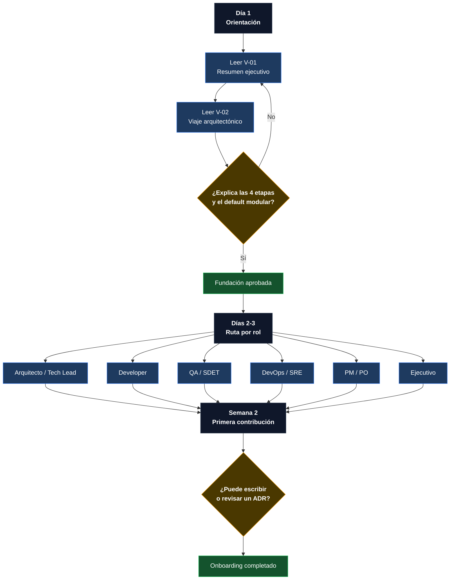
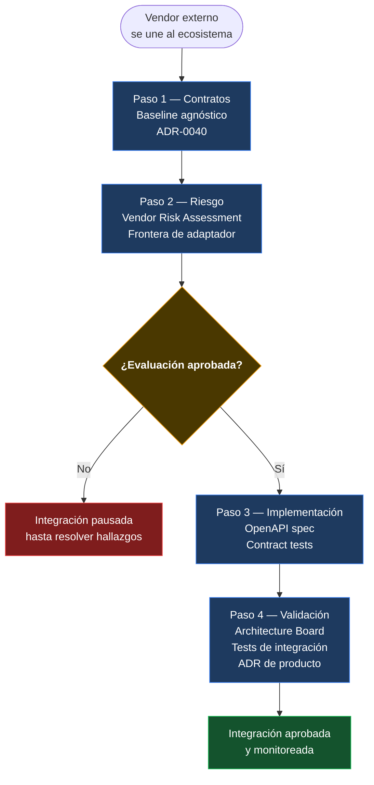

# V-05 — Mapa del Viaje de Onboarding por Rol

> **Audiencia:** RRHH, Tech Leads, Engineering Managers  
> **Propósito:** Ruta de incorporación estructurada — qué lee cada rol, cuándo y por qué  
> **Bilingüe:** [English](./v05-onboarding-journey-map.md)

---

## Nota de compatibilidad visual

Esta versión reemplaza los diagramas `journey` por `flowchart`, porque GitHub Mermaid puede renderizar los journey maps de forma inconsistente cuando tienen textos largos, tildes, múltiples actores o muchas actividades.

Los viajes se descomponen por rol para mejorar legibilidad, zoom y mantenimiento.

---

## Visual 5-A — Flujo Universal de Onboarding

---

## Visual 5-B — Arquitecto / Tech Lead

```mermaid
flowchart LR
    classDef phase fill:#0f172a,stroke:#334155,color:#fff,font-weight:bold
    classDef task fill:#1e3a5f,stroke:#3b82f6,color:#fff
    classDef output fill:#14532d,stroke:#22c55e,color:#fff

    P1["Día 1\nFundación"]:::phase
    P2["Días 2-3\nEstándares"]:::phase
    P3["Días 4-5\nDecisiones"]:::phase
    P4["Semana 2\nReferencia aplicada"]:::phase
    P5["Cierre\nPrimer ADR"]:::phase

    T1["V-01 + V-02\nRelación del ecosistema"]:::task
    T2["Directivas\nRoadmap\nManifiesto"]:::task
    T3["Registro ADR\nMatriz ADR\nBlueprint arc42/C4"]:::task
    T4["Portal UMS\nTrazabilidad UMS\nHerencia de repo hijo"]:::task
    T5["Borrador ADR\nArchitecture Board"]:::output

    P1 --> T1 --> P2 --> T2 --> P3 --> T3 --> P4 --> T4 --> P5 --> T5
```

---

## Visual 5-C — Developer Backend / Frontend

```mermaid
flowchart LR
    classDef phase fill:#0f172a,stroke:#334155,color:#fff,font-weight:bold
    classDef task fill:#14532d,stroke:#22c55e,color:#fff
    classDef output fill:#1e3a5f,stroke:#3b82f6,color:#fff

    P1["Día 1\nReglas"]:::phase
    P2["Día 2\nRuntime"]:::phase
    P3["Días 3-5\nCódigo de referencia"]:::phase
    P4["Semana 2\nPrimera entrega"]:::phase

    T1["Manifiesto\nAnti-patrones\nSOLID + Hexagonal"]:::task
    T2["Perfil Node.js o .NET\nADRs de runtime\nPatrones canónicos"]:::task
    T3["Explorar UMS\nTrazar FS -> ADR -> TE\nCorrer UMS local"]:::task
    T4["Caso de uso\nUnit tests\nPR con checklist"]:::output

    P1 --> T1 --> P2 --> T2 --> P3 --> T3 --> P4 --> T4
```

---

## Visual 5-D — QA / SDET

```mermaid
flowchart LR
    classDef phase fill:#0f172a,stroke:#334155,color:#fff,font-weight:bold
    classDef task fill:#4a3800,stroke:#f59e0b,color:#fff
    classDef output fill:#14532d,stroke:#22c55e,color:#fff

    P1["Día 1\nModelo de calidad"]:::phase
    P2["Días 2-3\nTesting standards"]:::phase
    P3["Días 4-5\nEvidencia aplicada"]:::phase
    P4["Semana 2\nPrimeros tests"]:::phase

    T1["ADR-0018\nPirámide 70/20/10\nContract testing"]:::task
    T2["ADR-0052\nADR-0053\nGate CI"]:::task
    T3["Tests UMS\nSuite local\nFS -> criterios"]:::task
    T4["Contract test\nIntegration test\nGate CI validado"]:::output

    P1 --> T1 --> P2 --> T2 --> P3 --> T3 --> P4 --> T4
```

---

## Visual 5-E — DevOps / SRE

```mermaid
flowchart LR
    classDef phase fill:#0f172a,stroke:#334155,color:#fff,font-weight:bold
    classDef task fill:#4a1a6b,stroke:#9c27b0,color:#fff
    classDef output fill:#14532d,stroke:#22c55e,color:#fff

    P1["Día 1\nInfraestructura"]:::phase
    P2["Días 2-3\nObservabilidad"]:::phase
    P3["Días 4-5\nOperaciones"]:::phase
    P4["Semana 2\nContribución"]:::phase

    T1["ADR-0028\nOSS-first\nGitflow ADR-0050"]:::task
    T2["OTel\nLoki / Tempo\nGrafana"]:::task
    T3["Runbooks\nCI/CD gates\nMulti-cloud scenarios"]:::task
    T4["OTel local\nPipeline validado\nRunbook revisado"]:::output

    P1 --> T1 --> P2 --> T2 --> P3 --> T3 --> P4 --> T4
```

---

## Visual 5-F — Product Manager / PO

```mermaid
flowchart LR
    classDef phase fill:#0f172a,stroke:#334155,color:#fff,font-weight:bold
    classDef task fill:#1e3a5f,stroke:#3b82f6,color:#fff
    classDef output fill:#14532d,stroke:#22c55e,color:#fff

    P1["Día 1\nVisión"]:::phase
    P2["Día 2\nLímites de alcance"]:::phase
    P3["Días 3-5\nModelo de entrega"]:::phase
    P4["Salida\nPO alineado"]:::phase

    T1["Resumen ejecutivo\nEvolith vs UMS\nRoadmap evolutivo"]:::task
    T2["Modelo UMS\nDemo vs referencia\nÍndice UMS"]:::task
    T3["Historias funcionales\nDefinition of Done\nFramework SDLC"]:::task
    T4["Puede priorizar\ny aceptar entregables"]:::output

    P1 --> T1 --> P2 --> T2 --> P3 --> T3 --> P4 --> T4
```

---

## Visual 5-G — Proveedor / Vendor Externo

---

## Resumen de rutas por rol

| Rol | Primer foco | Evidencia esperada |
|---|---|---|
| Arquitecto / Tech Lead | ADRs, blueprint, UMS, herencia | Primer ADR revisable |
| Developer | Manifiesto, runtime, patrones, UMS | Primer PR con checklist |
| QA / SDET | Pirámide, contract testing, E2E | Primer set de pruebas |
| DevOps / SRE | Infraestructura, OTel, runbooks | Pipeline/runbook validado |
| PM / PO | Visión, alcance, SDLC | Criterios de aceptación alineados |
| Vendor | Contratos, riesgo, validación | Integración aprobada |

---

*Parte de la [Estrategia de Comunicación Arquitectónica](../architecture-communication-strategy.es.md)*
