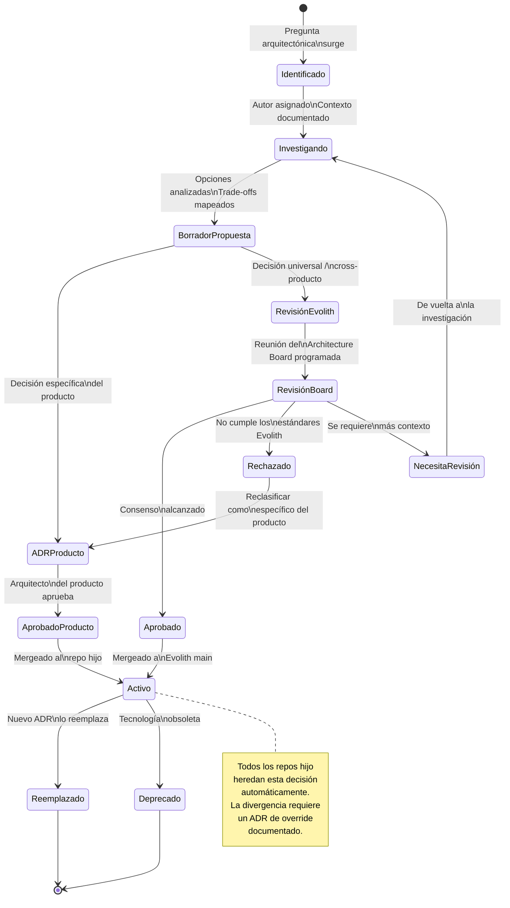
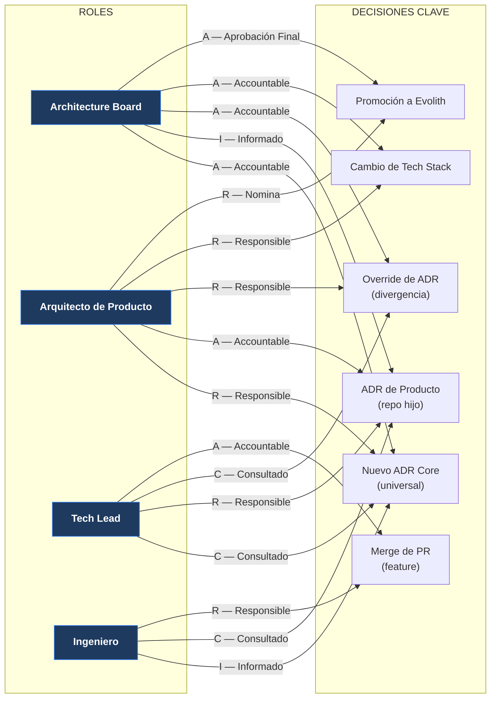
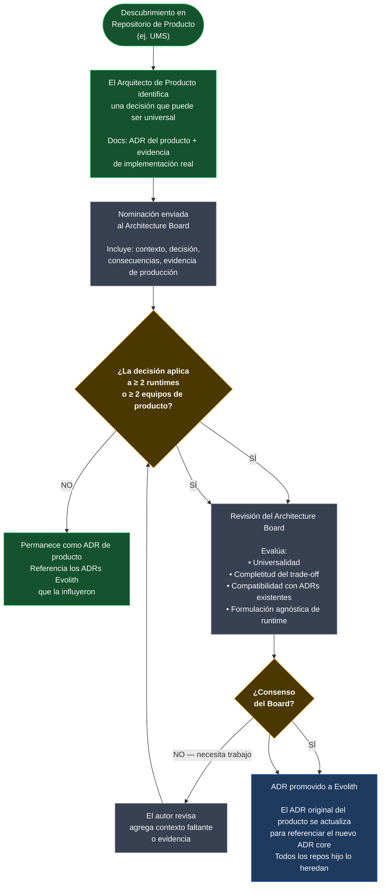
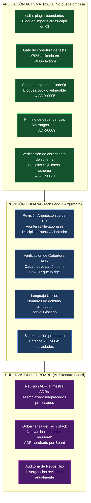

# V-06 — Diagrama de Flujo de Gobernanza

> **Audiencia:** Arquitectos, Tech Leads, Architecture Board  
> **Propósito:** Visualizar el ciclo de vida completo de un ADR y los caminos de decisión de gobernanza  
> **Bilingüe:** [English](./v06-governance-flow.md)

---

## Visual 6-A — Ciclo de Vida de un ADR (Máquina de Estados Completa)

---

## Visual 6-B — Quién Decide Qué (Matriz RACI)

---

## Visual 6-C — Ruta de Promoción: Producto → Evolith

---

## Visual 6-D — Capas de Aplicación de Gobernanza

---

*Parte de la [Estrategia de Comunicación Arquitectónica](../architecture-communication-strategy.es.md)*
