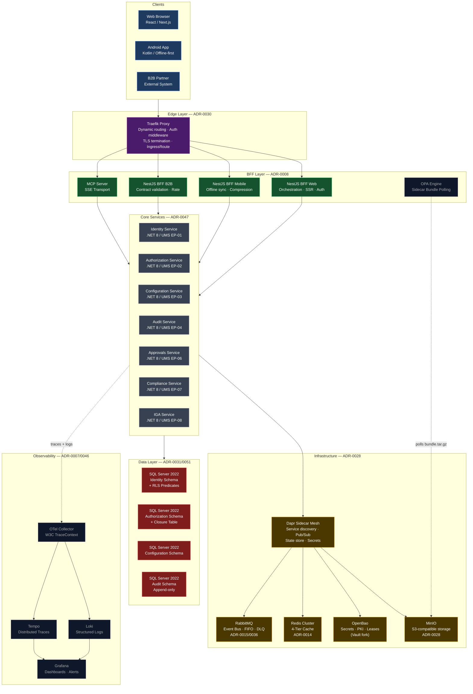
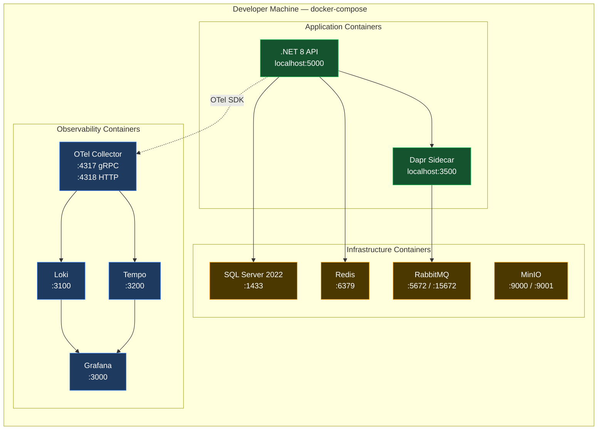
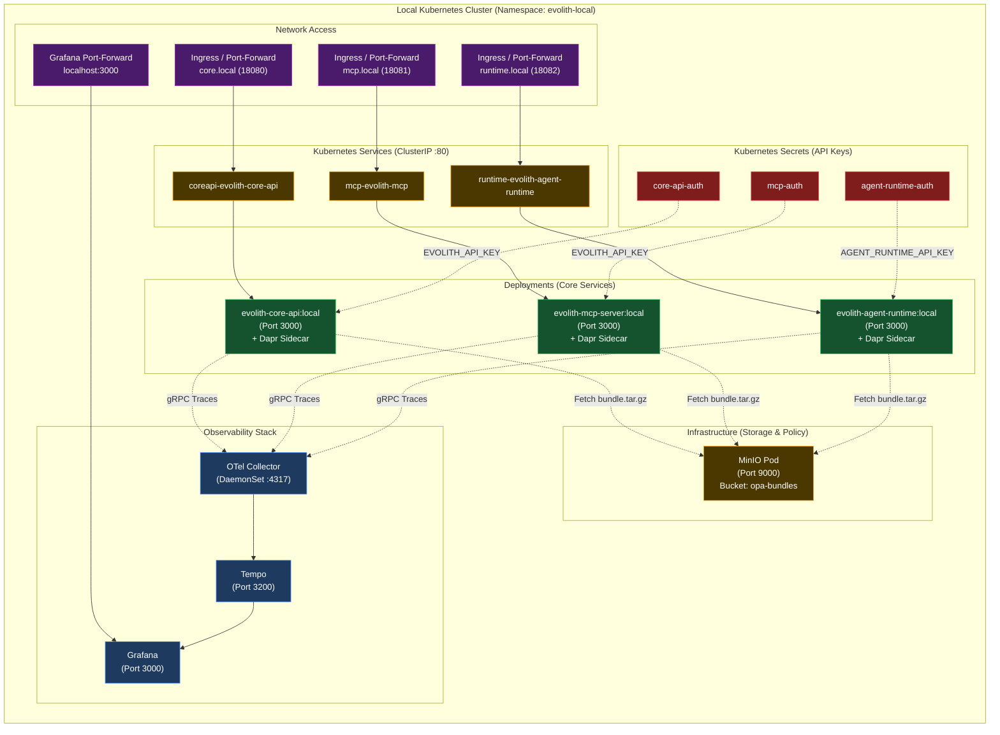
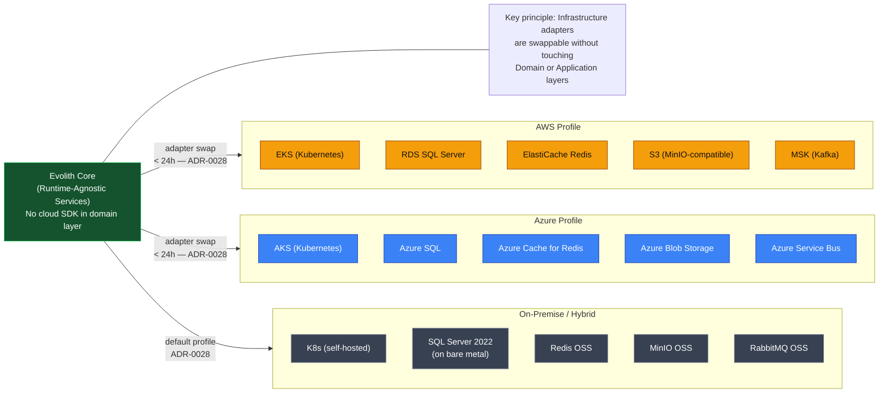
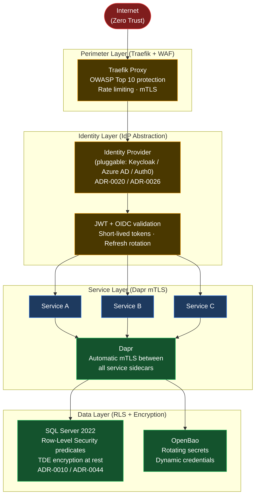
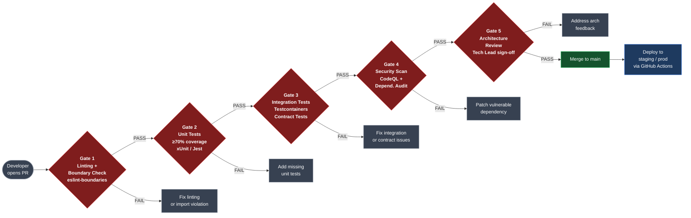

# V-08 — Infrastructure Topology Map

> **Audience:** DevOps, SRE, Platform Engineers
> **Purpose:** Full deployment topology — local dev through production
> **Bilingual:** [Español](./v08-infrastructure-topology.es.md)

---

## Visual 8-A — Full Production Topology (Phase 2)

---

## Visual 8-B — Local Development Stack (docker-compose)

---

## Visual 8-C — Local Development Stack (Kubernetes on Docker Desktop / Kind)

---

## Visual 8-D — Multi-Cloud Deployment Options (Phase 3)

---

## Visual 8-E — Security Perimeter Model (Zero-Trust)

---

## Visual 8-F — CI/CD Pipeline Quality Gates (ADR-0005)

---

*Part of the [Architecture Communication Strategy](../architecture-communication-strategy.md)*
