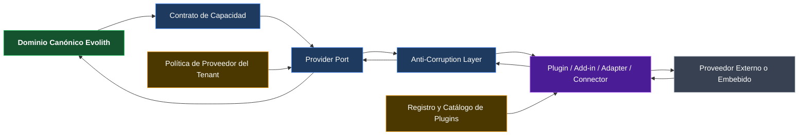
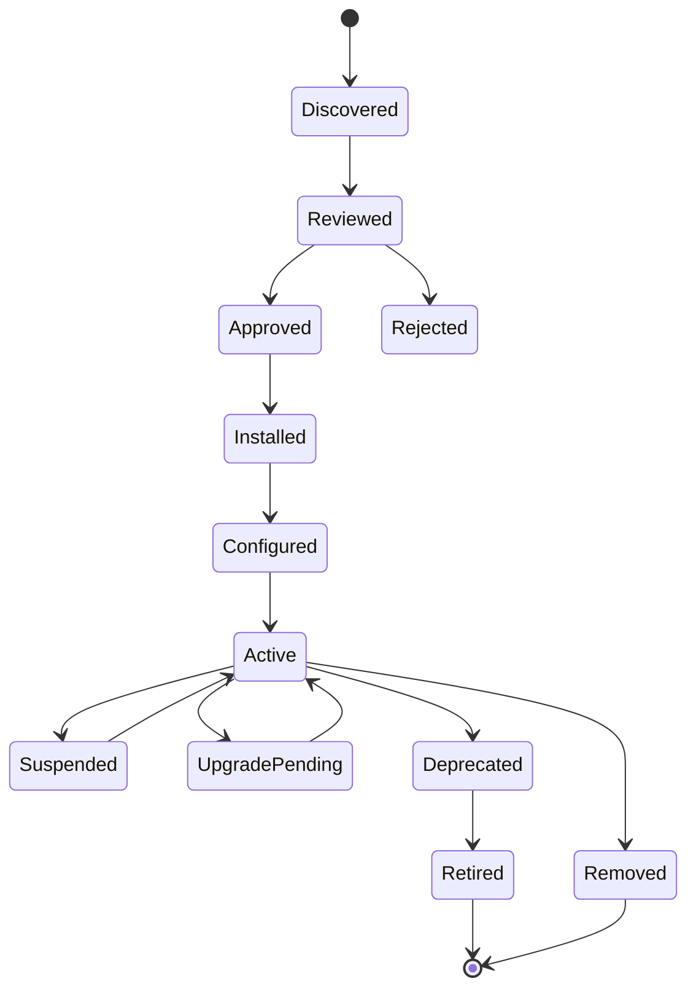
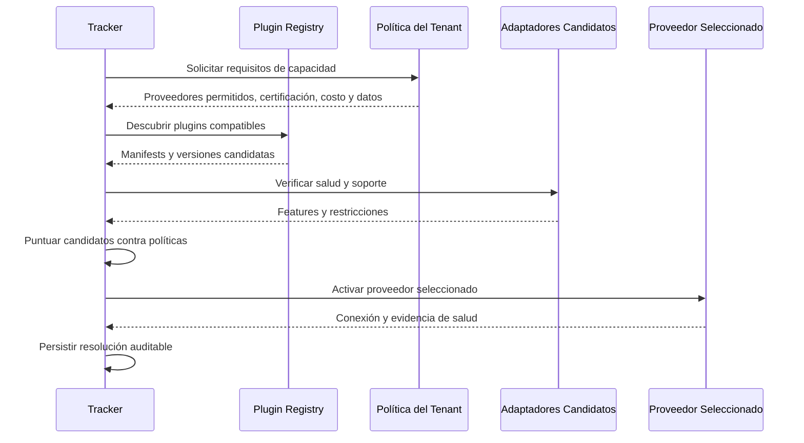
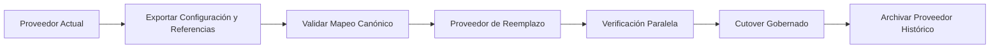

# Evolith — Modelo de Abstracción de Proveedores y Plugins

> **Navegación Bilingüe:** [English Version](./evolith-provider-abstraction-plugin-model.md)

**Estado:** Principio Fundacional de Diseño Propuesto  
**Propietario:** Evolith Architecture Board  
**Visión Padre:** [Visión Maestra del Producto Evolith](../../../../product/suite/vision/evolith-product-vision-master.es.md)  
**Diseño Complementario:** [Diseño Objetivo de Composición Gobernada](../../../../product/suite/architecture/evolith-governed-composition-target-design.es.md)  
**Creado:** 2026-06-10  
**Estado de Implementación:** Solo diseño — no autoriza cambios de código

---

## 1. Premisa Fundacional

Toda herramienta, plataforma, modelo, servicio, integración, dashboard, agente, repositorio, pipeline, scanner o capacidad externa usada por Evolith debe ser:

- **adaptable** a los contratos canónicos de Evolith;
- **intercambiable** sin cambiar el modelo de dominio;
- **instalable** como plugin, add-in, adaptador, conector o paquete de proveedor;
- **reemplazable** por tenant, producto, entorno o caso de uso;
- **opcional**, salvo el núcleo irreducible de gobernanza;
- **gobernada** por permisos, reglas, evidencias y auditoría de Evolith;
- **observable** mediante salud, uso, costo, fallos y linaje de evidencia.

> **Un proveedor por defecto es una comodidad de onboarding, nunca una dependencia arquitectónica.**

Evolith puede entregar defaults recomendados, adaptadores de referencia u opciones gestionadas, pero ninguna API, schema, identificador, workflow o supuesto comercial específico de un proveedor puede convertirse en parte del dominio canónico.

---

## 2. Principio de Producto

```text
Capacidad Evolith
        │
        v
Contrato Canónico de Capacidad
        │
        v
Provider Port
        │
        v
Plugin / Add-in / Adapter / Connector
        │
        v
Proveedor Seleccionado
```

El producto habla en capacidades, no en proveedores.

| Capacidad Canónica | Default Posible | Alternativas Reemplazables |
|---|---|---|
| Gestión de trabajo | Adaptador Jira | Azure DevOps, GitHub Issues, Linear, herramientas abiertas |
| Ejecución de agentes | Adaptador Claude | OpenAI, Gemini, modelos locales, proveedores futuros |
| Observabilidad LLM | Adaptador Langfuse | OpenTelemetry u otras plataformas |
| Analítica | Adaptador Apache Superset | Grafana, Power BI, analítica propia, proveedores futuros |
| Control de fuentes | Adaptador GitHub | GitLab, Azure Repos, Bitbucket |
| CI/CD | Adaptador GitHub Actions | Azure Pipelines, GitLab CI, Jenkins, Tekton |
| Seguridad | Adaptador CodeQL | Snyk, Trivy, Semgrep, scanners empresariales |
| Despliegue | Adaptador Kubernetes | Cloud, serverless, VM u on-premise |

Los defaults pueden variar según edición, política del tenant, geografía, compliance o preferencia del cliente.

---

## 3. Modelo Arquitectónico



### 3.1 Responsabilidades de Capa

| Capa | Responsabilidad |
|---|---|
| **Dominio Canónico** | Conceptos de negocio y gobernanza sin vocabulario de proveedores |
| **Contrato de Capacidad** | Inputs, outputs, errores, evidencia y requisitos no funcionales |
| **Provider Port** | Frontera estable usada por servicios Evolith |
| **ACL** | Mapear, validar, normalizar, rechazar y preservar linaje |
| **Plugin / Adapter** | Implementar una integración específica |
| **Proveedor** | Ejecutar la capacidad externa o embebida |
| **Provider Policy** | Elegir defaults, fallbacks, permitidos, costos y restricciones |
| **Registry** | Descubrir, instalar, versionar, activar, certificar, deprecar y remover |

---

## 4. Tipos de Plugin

| Tipo | Ubicación de Ejecución | Uso Típico |
|---|---|---|
| **In-Process Plugin** | Dentro de un runtime Evolith | Extensiones ligeras y deterministas de alta confianza |
| **Sidecar Adapter** | Proceso separado cercano al Tracker | Aislamiento, upgrades independientes y flexibilidad de lenguaje |
| **Remote Connector** | Servicio externo vía API | SaaS y plataformas empresariales |
| **MCP Provider Plugin** | Servidor MCP o tool set | Capacidades accesibles por agentes y LLMs |
| **Webhook/Event Add-in** | Integración orientada a eventos | CI/CD, sistemas de trabajo y evidencia asíncrona |
| **Embedded UI Add-in** | UI sandboxed o federada | Dashboards, vistas de proveedor y acciones contextuales |
| **Data Provider Plugin** | Batch, stream o query | Analítica, métricas e importación de evidencias |

El tipo es un detalle de implementación. Todos cumplen los mismos contratos de capacidad y evidencia.

---

## 5. Selección de Proveedores y Defaults

### 5.1 Alcance de Resolución

```text
Default de Plataforma
    -> Organización / Tenant
        -> Producto
            -> Entorno
                -> Proceso o Instancia de Capacidad
```

Gana la configuración válida más específica, siempre respetando políticas superiores.

### 5.2 Reglas para Defaults

Un proveedor por defecto:

- acelera la configuración;
- puede cambiarse antes o después de activarse;
- no filtra campos propios a entidades canónicas;
- declara fallback y migración;
- es visible para administradores del tenant;
- no se selecciona silenciosamente cuando se exige consentimiento;
- no vuelve ilegible la evidencia histórica después del reemplazo.

### 5.3 Resolución por Capacidad

```typescript
interface ProviderRequirement {
  capability: string;
  requiredFeatures: string[];
  dataResidency?: string[];
  maximumCostPolicyRef?: string;
  minimumCertification?: 'community' | 'certified' | 'managed';
  requiredDeploymentModes?: Array<'saas' | 'self_hosted' | 'on_premise'>;
}

interface ProviderResolution {
  providerConnectionId: string;
  pluginId: string;
  pluginVersion: string;
  capabilityVersion: string;
  selectionReason: string;
  fallbackProviderConnectionIds: string[];
}
```

La resolución es gobernada por políticas y queda auditada.

---

## 6. Manifest del Plugin

```yaml
id: evolith.langfuse.observability
name: Langfuse Observability Adapter
version: 1.0.0
pluginType: remote-connector
providerType: llm-observability
capabilityContracts:
  - id: evolith.capability.llm-trace
    version: 1.0.0
  - id: evolith.capability.llm-evaluation
    version: 1.0.0
deploymentModes:
  - saas
  - self-hosted
permissions:
  - evidence.write
  - trace.read
dataClassifications:
  - internal
  - confidential
configurationSchemaRef: schemas/plugins/langfuse.config.schema.json
evidenceSchemas:
  - rulesets/schema/evidence-item.schema.json
healthCheck:
  type: http
  path: /health
certification:
  level: certified
  validUntil: 2027-06-10
license:
  type: OSS-and-commercial-service
migration:
  exportSupported: true
  importSupported: true
  historicalReadSupported: true
```

---

## 7. Ciclo de Vida



Toda transición está limitada al tenant, autorizada y auditada.

### 7.1 Upgrades

- Se valida compatibilidad del contrato antes de activar.
- Breaking changes requieren nueva versión mayor.
- Migraciones de configuración y evidencia son explícitas.
- Plugins gestionados requieren rollback.
- Un upgrade no puede invalidar evidencia histórica.

### 7.2 Remoción

Un plugin solo puede removerse cuando:

- ningún workflow activo depende de él;
- la evidencia histórica sigue siendo legible;
- exportación y archivado están completos;
- los mapeos de reemplazo fueron validados;
- credenciales y tokens fueron revocados;
- el historial de auditoría se preserva.

---

## 8. Negociación de Capacidades



Ningún proveedor se selecciona solo por ser default; debe satisfacer la capacidad y la política actual.

---

## 9. Fallos, Fallback y Reemplazo

### 9.1 Modos de Fallo

| Condición | Comportamiento Requerido |
|---|---|
| Proveedor no disponible | Marcar fuente no disponible; no fabricar evidencia ni aprobar silenciosamente |
| Schema inválido | Rechazar en ACL y registrar fallo |
| Certificación perdida | Bloquear nuevos usos según política; preservar acceso histórico |
| Límite de costo excedido | Pausar o enrutar según fallback aprobado |
| Violación de residencia | Bloquear ejecución y alertar responsables |
| Versión incompatible | Impedir activación y conservar versión compatible |

### 9.2 Flujo de Reemplazo



El reemplazo no requiere cambios en entidades canónicas, Phase Gates, identidad del proceso ni decisiones históricas.

---

## 10. Experiencia de Usuario

```text
Capacidad: Observabilidad LLM
Proveedor actual: Langfuse
Certificación: Certified
Despliegue: Self-hosted
Salud: Healthy
Fallback: OpenTelemetry Adapter
Acciones: Configurar · Probar · Reemplazar · Suspender · Ver evidencia
```

La interfaz siempre expone proveedor seleccionado, razón, alcance, certificación, versión, despliegue, ubicación de datos, salud, costo, fallback, reemplazo y procesos afectados.

---

## 11. Seguridad y Aislamiento

Todo plugin debe:

- usar mínimo privilegio;
- respetar límites de datos del tenant;
- utilizar credenciales y secretos aislados;
- declarar redes salientes y clases de datos;
- producir operaciones auditables;
- soportar rotación y revocación;
- impedir cache o estado cross-tenant;
- validar payloads entrantes y salientes;
- fallar de forma cerrada en operaciones de gobernanza.

Los plugins in-process requieren un nivel de confianza y certificación superior.

---

## 12. Frontera Open-Core y Enterprise

### Open Core

- especificaciones de contratos de capacidad;
- interfaces de provider ports;
- schema de manifest;
- SDK de adaptadores;
- test harness de certificación;
- adaptadores de referencia y comunidad;
- reglas de compatibilidad y ejemplos.

### Enterprise Tracker

- registry y administración por tenant;
- adaptadores certificados y gestionados;
- catálogos privados;
- selección por políticas;
- monitoreo de salud, costo y compliance;
- orquestación de upgrades y SLA;
- despliegue on-premise y gestionado.

El modelo Enterprise monetiza gobernanza y operación, no lock-in artificial.

---

## 13. Anti-Patrones

Queda prohibido:

- nombres de proveedores en agregados o campos canónicos;
- persistir payloads específicos como entidades canónicas;
- selección hard-coded en lógica de negocio;
- plugins que evadan ACL o Evidence Graph;
- convertir un default en obligatorio sin razón aprobada;
- exponer credenciales directas a agentes o usuarios;
- exigir reescribir gates al reemplazar proveedor;
- perder acceso a evidencia histórica;
- incluir supuestos comerciales en reglas Core.

---

## 14. Criterios de Aceptación

1. Toda capacidad externa tiene contrato canónico.
2. Toda implementación se registra como plugin o adapter versionado.
3. Los defaults se reemplazan mediante configuración y política.
4. Los schemas específicos permanecen detrás de ACLs.
5. Salud, costo, permisos y linaje son visibles.
6. Reemplazar proveedor preserva estado y evidencia histórica.
7. El tenant controla proveedores permitidos y preferidos.
8. Ningún proveedor cambia directamente el estado canónico.

---

## 15. Relación y Navegación

- [Visión Maestra del Producto Evolith](../../../../product/suite/vision/evolith-product-vision-master.es.md)
- [Diseño Objetivo de Composición Gobernada](../../../../product/suite/architecture/evolith-governed-composition-target-design.es.md)
- [Diseño de Interfaces Técnicas del Tracker](../../../../product/products/evolith-tracker/sdlc-tracker-technical-interfaces.es.md)
- [Framework Estratégico de Validación y Composición](../../../../product/suite/methods/evolith-strategic-validation-and-composition-framework.es.md)

---

*La abstracción de proveedores es una premisa del producto, no una opción de implementación. Evolith gobierna capacidades intercambiables sin depender de una herramienta, modelo, plataforma o proveedor específico.*