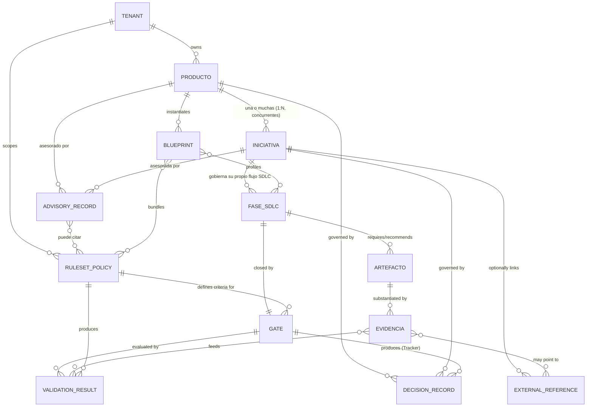
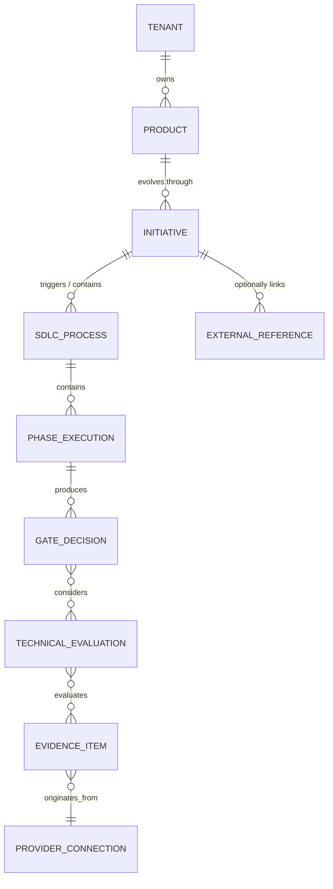
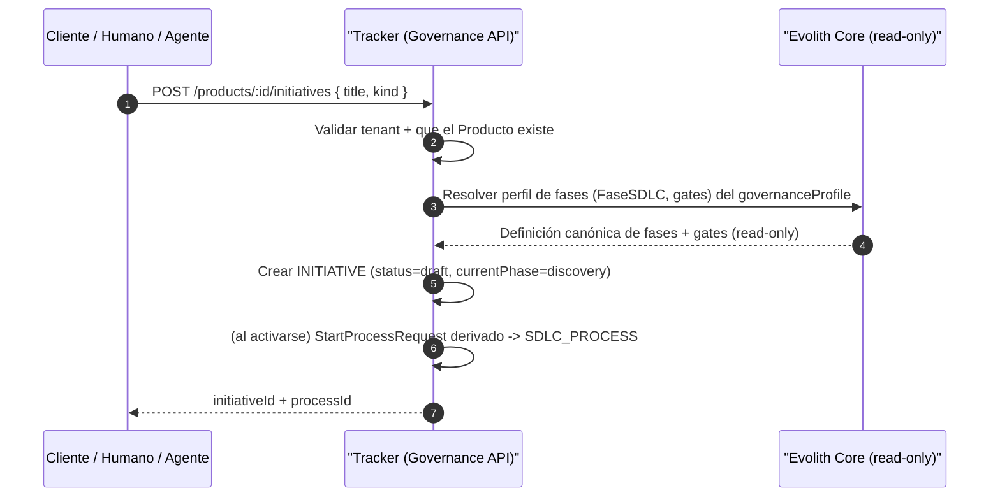
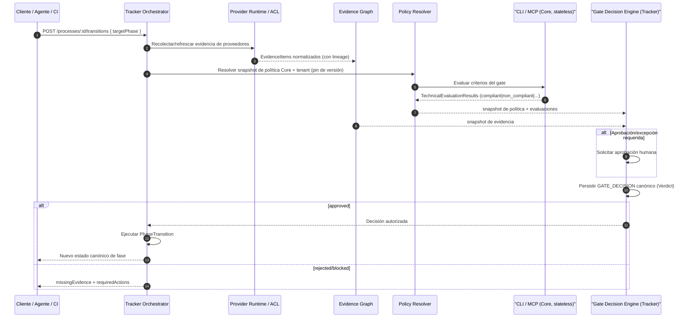

# Evolith Core — Rediseño hacia un Modelo Producto/Iniciativa

> **Navegación bilingüe:** [English version](./product-initiative-governance-redesign.md)

**Clasificación:** Propuesta de Diseño — Modelo de Gobierno del Core
**Estado:** *SUPERSEDED EN PARTE (2026-06-28) — corregido por [ADR-0101](./architecture/adrs/core/0101-core-stateless-evaluation-engine.es.md) y [Core Evaluation Engine Design](./core-evaluation-engine-design.es.md).*

> **⚠ Aviso de corrección (error de altitud).** Este documento diagnosticó bien la conflación gobierno↔ejecución, pero modeló `Producto`/`Iniciativa`/`Evidencia`/`Decisión` como **entidades de dominio del Core con repositorios, casos de uso mutadores y endpoints de escritura** (`IProductRepository`, `RegisterProduct`, `POST /api/v1/products`, …). Eso **viola el criterio corregido**: el Core es un **evaluador STATELESS** y nunca posee/persiste producto/tenant/iniciativa/evidencia/decisión. **Los Entregables 2, 4, 10, 11, 12 y los flujos de escritura del 13 quedan SUPERSEDED** — reemplazados por los contratos `EvaluationContext` (entrada) / `EvaluationResult` (salida). Ver el diseño canónico en [Core Evaluation Engine Design](./core-evaluation-engine-design.es.md) y [ADR-0101](./architecture/adrs/core/0101-core-stateless-evaluation-engine.es.md).
>
> **Sigue siendo válido:** Entregable 1 (diagnóstico de conflación), Entregable 5 (`ExternalReference` como única costura operativa → ahora `ExternalReferenceContext`), externalizar schemas ágiles, dual-engine native+OPA, y evaluación ≠ decisión (el Core emite un `DecisionRecommendation` **no vinculante**; el Tracker decide/persiste).
>
> | Concepto previo (entidad/repo/endpoint) | Contrato corregido |
> |---|---|
> | `Producto` (`IProductRepository`, `POST /products`) | `ProductContext` (entrada, opaco) |
> | `Iniciativa` (`IInitiativeRepository`, `POST /initiatives`) | `InitiativeContext` (entrada, opaco) |
> | `Evidencia` (`IEvidenceRepository`, `POST /evidence`) | `EvidenceContext` (entrada) + `EvidenceEvaluationResult` (salida) |
> | `DecisionRecord` (`IDecisionRecordRepository`, `POST /decisions`) | `DecisionRecommendation` (salida, `binding: false`) |
> | `AdvisoryRecord` (`IAdvisoryRepository`, `POST /advisories`) | `Recommendation` (salida) |
> | use-cases `Register/Open/Record/Attach` | ninguno — el Core no muta; solo evalúa |
**Alcance:** Solo documentación — no autoriza cambios de código hasta aprobación del Architecture Board (mismo régimen que `product/products/evolith-tracker/sdlc-tracker-technical-interfaces.md`).
**Owner:** Evolith Architecture Board
**Origen:** Análisis multi-agente anclado en código real (9 agentes, verificación adversarial). Ver Apéndice B.

---

## Tesis central

> **Evolith Core es la fuente de verdad del gobierno técnico** (arquitectura, SDLC, reglas, políticas, blueprints, trazabilidad, validaciones y decisiones). **No es la fuente de verdad de la ejecución operativa del delivery** (épicas, historias, tareas, sprints, estimaciones, velocity, tableros).
>
> **Producto** e **Iniciativa** pasan a ser las **unidades primarias de gobierno** del Core. Épicas, historias, issues y tareas existen **únicamente** como `ExternalReference` **opcional** colgando de una `Iniciativa` —referencia + hash/snapshot, jamás copia del dato canónico— y el Core permanece **agnóstico** del sistema externo de cada tenant (Jira, Azure DevOps, GitHub Projects, Trello, Asana, …).

## Resumen ejecutivo

| # | Hallazgo | Evidencia (anclaje real) |
|---|---|---|
| 1 | El Core **declara** no ser "task-management platform" pero **exige** artefactos ágiles como evidencia bloqueante de gate. | `reference/core/README.md:47` (afirmación) vs `sdlc-evolith-artifact-mapping.md:130,132,133,223` (Stories/Backlog **Required**) y `:209` ("story readiness" cierra el gate F2). |
| 2 | **No existe** entidad `Producto` ni `Iniciativa` en el dominio del Core; la Iniciativa es un string opaco "nunca persistido". | `src/packages/core-domain/src/domain/entities/` solo tiene `blueprint.ts`; `gate-evidence.ts:87-89` (`initiative?: string`, "Never persisted or interpreted"). |
| 3 | El propio **Tracker ya modela** `PRODUCT`/`SDLC_PROCESS` como primera clase: el Core va por detrás de su propio Tracker. | `sdlc-tracker-technical-interfaces.md:415-428`, `EvidenceItem` con `tenantId/productId/...` (`:100-149`). |
| 4 | Schemas operativos (`evolith-user-story`, `agile-backlog`, `functional-story`, `ballpark-estimation`) viven como contratos canónicos del Core. | `src/rulesets/schema/*`; `agile-backlog.schema.json:5,28,78,82` (sprint/velocity/totalPoints). |
| 5 | El precedente correcto **ya existe**: el Core devuelve `skipped` para datos de ejecución (sprint/velocity). | `executive-scorecard-rule.handler.ts:55` ("Sprint throughput requires tracker data"). |

**Propuesta en una frase:** formalizar 9 entidades de gobierno (`Producto`, `Iniciativa`, `FaseSDLC`, `Gate`, `Artefacto`, `Evidencia`, `ExternalReference`, `ValidationResult`, `DecisionRecord`), externalizar los schemas ágiles a `ExternalReference` opcional mediante deprecación versionada con *grandfathering*, separar **evaluación** (`ValidationResult`, Core/CLI/MCP) de **decisión** (`DecisionRecord`, emitida por Tracker en runtime), y ejecutar un roadmap incremental **R0→R5** sin ruptura de satélites.

## Nota de verificación (correcciones del revisor incorporadas)

Este documento incorpora las correcciones de un crítico adversarial que reverificó las afirmaciones contra el código (detalle en Apéndice B):

- **H1 (corregido):** la afirmación "a task-management platform" está en `reference/core/README.md:47` y el encabezado de sección en `:41` (no `:44`, como se citó originalmente). Corregido en todo el documento.
- **H12 (corregido):** líneas internas reales de los schemas de historia — `evolith-user-story.schema.json` (`status:83`, `priority:88`, `storyPoints:94`) y `agile-backlog.schema.json` (`description:5`, `sprint:28`, `velocity:78`, `totalPoints:82`).
- **H5, H4/H7, H2/H3, H11 (anotados):** callouts del revisor insertados en las secciones correspondientes (vocabulario de veredicto `WAIVED`→`WAIVE`, firmas `GateDecision`/`GateEvidence`, dualidad de carpetas de puertos, alcance de la auditoría OPA).

## Índice de entregables

| Entregable | Contenido |
|---|---|
| 1 | Diagnóstico del problema |
| 2 | Nuevo modelo conceptual del Core (+ interfaces canónicas TypeScript) |
| 3 | Tabla comparativa: modelo actual vs recomendado |
| 4 | Entidades: mantener / eliminar / renombrar / transformar |
| 5 | Reglas para tratar épicas e historias como `ExternalReference` |
| 6 | Cambios necesarios en rulesets |
| 7 | Cambios necesarios en OPA policies |
| 8 | Cambios necesarios en blueprints |
| 9 | Cambios necesarios en documentación |
| 10 | Cambios necesarios en interfaces Core |
| 11 | Integración con Evolith Tracker |
| 12 | Contratos / API sugeridos |
| 13 | Flujos recomendados |
| 14 | Roadmap de implementación (R0–R5) |
| 15 | Backlog sugerido para Evolith Tracker |
| — | Riesgos y mitigaciones (ítem de análisis 13) · Apéndice A (cobertura) · Apéndice B (verificación) |

---

# Entregable 1 — Diagnóstico del problema

El Core hoy declara explícitamente que **no es una plataforma de gestión de tareas** (`reference/core/README.md:47` → "a task-management platform" en la lista de "What Evolith Core Is Not"), pero el mapeo de gobierno **contradice esa declaración** al exigir artefactos ágiles operativos como evidencia bloqueante de gate. Esta es la **conflación gobierno SDLC ↔ ejecución operativa**.

### 1.1 Evidencia de la conflación: artefactos ágiles como evidencia obligatoria de gate

| Artefacto operativo | Marca | Ubicación de la evidencia (ruta:línea) |
|---|---|---|
| Evolith User Story | **Required** Fase 2 | `reference/core/sdlc/sdlc-evolith-artifact-mapping.md:132` y matriz `:361` |
| Agile Backlog | **Required** Fase 2 | `sdlc-evolith-artifact-mapping.md:133` y matriz `:362` |
| Functional Stories | **Required** Fase 2 (O en Fase 1) | `sdlc-evolith-artifact-mapping.md:130` y matriz `:369` |
| Technical Stories (con `functionalStoryRef`) | **Required** Fase 3 | `sdlc-evolith-artifact-mapping.md:223` y matriz `:380` |
| Ballpark Estimation (T-Shirt sizing, team size) | **Required** Fase 1 | `sdlc-evolith-artifact-mapping.md:83` y matriz `:358` |

El propio README del mapeo describe el primer gate como dependiente de "story readiness" (`sdlc-evolith-artifact-mapping.md:209`: *"Gate F2 Review: ADR completeness, story readiness, blueprint alignment..."*). Es decir: **el gate de gobierno técnico no puede dispararse sin que existan historias y backlog refinado** — una mecánica propia de Scrum/Jira, no de una "constitución de ingeniería provider-neutral".

### 1.2 Evidencia de la conflación: schemas operativos viviendo dentro del Core

Estos schemas operativos son contratos canónicos del Core (`src/rulesets/schema/`), pero modelan unidades de ejecución, no de gobierno:

- `evolith-user-story.schema.json:7,13` — `storyId` con patrón `^(US|TS|EN|DEBT)-\d{3}$`, `status: Draft|Ready|In Progress|Done|Blocked` (`:83`), `storyPoints: S|M|L|XL` (`:94`), `priority 1..5` (`:88`). Esto es un **tablero de tareas**.
- `agile-backlog.schema.json:5` — *"Grouped, prioritized, and versioned user stories for an Epic or Initiative"*.
- `functional-story.schema.json` y `ballpark-estimation.schema.json:5` — *"team sizing"*.
- Plantillas operativas en `reference/core/sdlc/04-artifact-templates/`: `evolith-user-story-template.md`, `agile-backlog-template.md`, `functional-story-template.md`, `technical-story-template.md`, `story-seed-bank-template.md`, `epic-candidate-matrix-template.md`.

### 1.3 Evidencia del precedente correcto: el Core ya rechaza datos operativos en runtime

El handler `executive-scorecard-rule.handler.ts:55` ya devuelve `{ result: 'skipped', message: 'Sprint throughput requires tracker data' }`, y de forma análoga `:53` (team health), `:51` (observabilidad runtime). **El Core ya admite que velocity/sprint/throughput NO se resuelven en Core** — pero esa frontera no está aplicada de forma consistente: las historias y el backlog sí siguen siendo evidencia obligatoria.

### 1.4 Evidencia de la ausencia de Producto e Iniciativa como entidad de primera clase

- El dominio del Core **no tiene entidad Producto ni Iniciativa**. `src/packages/core-domain/src/domain/entities/` contiene solo `blueprint.ts` e `index.ts`.
- `blueprint.ts:37-47` modela una **plantilla de proyecto/topología** (`topology`, `phase`, `rulesets`), no un Producto. El schema lo confirma: `blueprint.schema.json:9` (`blueprintId` ej. `nestjs-hexagonal-f2`), `:13-16` (`topology` enum), `:17` (`phase: integer 1..5`). Un Blueprint describe *qué reglas aplican a un proyecto en una fase*, no la unidad de evolución/gobierno.
- `SatelliteRecord` (`src/packages/core-domain/src/domain/satellite-record.ts`) es lo más cercano a "unidad", pero es un **registro de repositorio satélite** con un único `phase: string` global — no soporta múltiples Iniciativas concurrentes ni trazabilidad de cambio gobernado.
- `gate-evidence.ts:67-77` (`GateEvidence`) **no tiene `tenantId`, `productId` ni `initiativeId`**. El schema `gate-evidence.schema.json` tampoco (grep sin coincidencias). La evidencia de gate flota sin anclaje a Producto/Iniciativa/Tenant.
- `ExecutionContext` (`gate-evidence.ts:87-92`) ya tiene `initiative?: string` y `tenant?: string`, pero el comentario `:87` dice *"Verbatim echo of caller-supplied context. Never persisted or interpreted"* — es decir, **Iniciativa existe informalmente como string opaco, nunca como entidad**.

El Tracker, en cambio, **ya modela Producto y proceso como ciudadanos de primera clase** (`product/products/evolith-tracker/sdlc-tracker-technical-interfaces.md:415-428`: `TENANT ||--o{ PRODUCT`, `PRODUCT ||--o{ SDLC_PROCESS`) y su `EvidenceItem` ya lleva `tenantId/productId/processId/phaseExecutionId` (`:100-149`). El Core va por detrás de su propio Tracker en el modelo de dominio.

**Conclusión del diagnóstico:** el Core mezcla dos planos. El plano de **gobierno** (Producto, Iniciativa, FaseSDLC, Gate, Artefacto, Evidencia, ValidationResult, DecisionRecord) es legítimo y debe formalizarse. El plano de **ejecución operativa** (historias, backlog, story points, estados de tarea, sprint, estimación) está incrustado como obligatorio y debe degradarse a `ExternalReference` opcional colgando de `Iniciativa`.

---

---

# Entregable 2 — Nuevo modelo conceptual del Core

### 2.1 Diagrama ER



> **Cardinalidad clave:** un **Producto** tiene **una o muchas Iniciativas** (1:N), posiblemente **concurrentes**; **cada Iniciativa gobierna su propio flujo SDLC** (sus fases, gates, artefactos y evidencias) de forma independiente. Evolith no es solo guardián de gates: también **asesora** — produce `ADVISORY_RECORD` (consultoría y asistencia arquitectónica, no vinculante) a nivel de Producto o de Iniciativa. Ver §2.4.

### 2.2 Definición de cada entidad

| Entidad | Propósito | Atributos clave | Invariantes | Dueño |
|---|---|---|---|---|
| **Tenant** | Frontera de aislamiento multi-tenant. | `tenantId` | Toda entidad de gobierno cuelga de un Tenant; nunca cross-tenant. Ya existe `src/rulesets/schema/tenant.schema.json` y `multi-tenancy.rego`. | Core (definición) / Tracker (runtime) |
| **Producto** | Unidad principal de evolución, arquitectura, gobierno y trazabilidad. Coherente con `PRODUCT` del Tracker (`sdlc-tracker-technical-interfaces.md:416`). | `productId`, `tenantId`, `name`, `repositoryRef?`, `governanceProfileRef` | Único por `(tenantId, name)`. No contiene historias ni tareas. Persiste arquitectura/decisiones, no ejecución. | Core (forma canónica) / Tracker (estado) |
| **Iniciativa** | Unidad principal de cambio/mejora/requerimiento/transformación/delivery gobernado. Formaliza el `initiative` hoy opaco de `gate-evidence.ts:89`. | `initiativeId`, `productId`, `tenantId`, `title`, `kind`, `status`, `currentPhase` | Cuelga siempre de un Producto, que puede tener **una o muchas Iniciativas concurrentes** (1:N). **Cada Iniciativa gobierna su propio flujo SDLC** (fases/gates/artefactos/evidencias). Epicas/historias/tareas **solo** como `ExternalReference` opcional; nunca atributos propios. | Core (forma canónica) / Tracker (estado) |
| **FaseSDLC** | Etapa configurable del proceso (5 fases canónicas). Coherente con `PhaseId` (`sdlc/phase-id.ts:14`) y `PHASE_EXECUTION` del Tracker. | `phaseId` (`discovery\|design\|construction\|qa\|release`), `order` | Usa ids canónicos de `CANONICAL_PHASE_IDS`; nunca el namespace `F#` (reservado a topología, `phase-id.ts:10-12`). | Core (definición) / Tracker (ejecución) |
| **Gate** | Punto de control/decisión que cierra una FaseSDLC. | `gateId`, `phaseId`, `criteria[]`, `rulesetRefs[]` | Un Gate por FaseSDLC. Las *criteria* referencian Ruleset/Policy, nunca historias. Ya existe `sdlc-gate.schema.json`. | Core (definición) |
| **Artefacto** | Entregable requerido u opcional, evidencia legítima de gobierno (PRD, ADR, Test Summary, Release Notes). | `artifactId`, `phaseId`, `requirement` (`required\|optional\|conditional`), `schemaRef?` | Modela gobernanza técnica/arquitectura/calidad, **no** ejecución ágil. Story/backlog dejan de ser Artefacto del Core. | Core (catálogo) |
| **Evidencia** | Prueba/enlace/archivo/validación/referencia que sustenta el avance de un Artefacto/Gate. Refina `GateEvidence` (`gate-evidence.ts:67`) y se alinea con `EvidenceItem` del Tracker (`sdlc-tracker-technical-interfaces.md:100`). | `evidenceId`, `tenantId`, `productId`, `initiativeId`, `phaseId`, `gateId?`, `artifactId?`, `contentHash`, `capturedAt` | Inmutable. Lleva `contentHash` (no copia datos externos). Puede apuntar a `ExternalReference`. | Core (contrato) / Tracker (grafo) / externo (origen) |
| **ExternalReference** | Vínculo opcional hacia epicas/historias/issues/tareas/documentos externos. **El único lugar donde lo operativo aparece.** | `refId`, `system` (`jira\|azure-devops\|github\|...`), `externalId`, `url?`, `contentHash?`, `snapshotAt?` | Nunca obligatorio. Solo referencia + hash/snapshot; jamás copia el dato canónico del sistema externo. | externo (verdad) / Core (puntero) |
| **ValidationResult** | Resultado de rulesets/OPA/validaciones del Core. Coherente con `RuleEvaluation` (`satellite-manifest.ts:48`) y `TechnicalEvaluationResult` del Tracker (`sdlc-tracker-technical-interfaces.md:157`). | `validationId`, `rulesetRef`, `rulesetVersion`, `status` (`compliant\|non_compliant\|indeterminate\|error`), `findings[]` | Es **evaluación, no decisión** (precedente Core/Tracker). No muta estado de fase. | Core (motor) / CLI / MCP |
| **DecisionRecord** | Decisión técnica o de gobierno asociada a Producto o Iniciativa (incluye veredicto de gate y ADR de gobierno). Alineado con `GateDecision` value object (`gates/decision/gate-decision.ts:19`) y el `GateDecision` rico del Tracker (`sdlc-tracker-technical-interfaces.md:186`). | `decisionId`, `subjectType` (`product\|initiative`), `subjectId`, `verdict` (`Verdict`), `rationale`, `decidedAt`, `decidedBy` | Referencia política, evidencia y validaciones usadas (lineage). El **veredicto canónico de gate** lo emite Tracker en runtime; Core define la forma. **Es vinculante** (gobierna el avance). | Core (forma) / Tracker (emisión runtime) |
| **AdvisoryRecord** | **Consultoría y asistencia arquitectónica NO vinculante** asociada a un Producto o una Iniciativa: recomendaciones, opciones de diseño, evaluación de riesgo/coste y guía. Producida por motores del Core (rulesets en modo *advisory*) o por **agentes IA** (Winston, Principal Architect; ver `product/suite/methods/evolith-ai-assisted-validation-workflow.md`). | `advisoryId`, `subjectType` (`product\|initiative`), `subjectId`, `phaseId?`, `topic`, `recommendations[]`, `confidence`, `producedBy`, `binding: false` | **Nunca bloquea un gate** (a diferencia de `ValidationResult`/`DecisionRecord`): es asesoría. Cita ADRs/blueprints/patrones del Core como respaldo. Trazable, versionada. | Core (motor + agentes) |
| **Ruleset/Policy** | Política y contratos de validación máquina-consumibles (`rulesets/`, OPA). | `rulesetId`, `version`, `engine` (`native\|opa`) | Versionado y revisable (Core Invariant `README.md:117`). Provider-neutral. | Core |
| **Blueprint** | Plantilla parametrizable que combina topología + perfil de fase + rulesets por defecto. Mantiene `blueprint.ts:37`. | `blueprintId`, `topology`, `phase`, `rulesets[]`, `gateIds[]` | Es plantilla de proyecto, **no** Producto ni Iniciativa. Se *instancia* en un Producto. | Core |

### 2.3 Regla de oro

> **Producto e Iniciativa son las unidades primarias de gobierno del Core.** Un **Producto** tiene **una o muchas Iniciativas** (1:N, concurrentes), y **cada Iniciativa gobierna su propio flujo SDLC**. Toda evidencia, validación, decisión y asesoría se ancla a `(tenantId → productId → initiativeId → phaseId → gateId)`.
>
> **Epicas, historias, issues, tareas, sprints, story points, backlog y estimaciones NUNCA son entidades del Core.** Solo pueden existir como `ExternalReference` **opcional** colgando de `Iniciativa` (o de una `Evidencia`), representados con `system + externalId + url + hash/snapshot` — jamás copiando el dato canónico del sistema externo del tenant. El Core es agnóstico de Jira/Azure DevOps/GitHub Projects/Trello/Asana.
>
> **Evolith no es solo un guardián de gates: también es asesor.** Además de gobernar (validar y decidir), presta **consultoría y asistencia arquitectónica** mediante `AdvisoryRecord` — salida **no vinculante** que recomienda y guía, sin bloquear el avance.

### 2.4 Doble rol de Evolith: autoridad de gobierno **y** asesor arquitectónico

El Core opera en dos modos complementarios sobre las mismas unidades (`Producto`/`Iniciativa`), y produce **tres tipos de salida** claramente diferenciados para no mezclar "lo que recomiendo" con "lo que exijo":

| Modo | Salida | ¿Vinculante? | ¿Quién la produce? | Anclaje |
|---|---|---|---|---|
| **Gobierno — evaluar** | `ValidationResult` | No por sí sola, pero **alimenta la decisión** | Motor Core / CLI / MCP (stateless) | Conformidad de criterios de gate (rulesets/OPA). |
| **Gobierno — decidir** | `DecisionRecord` | **Sí** (gobierna el avance de fase) | **Tracker** en runtime (Core define la forma) | Veredicto canónico de gate (`Verdict`). |
| **Asesoría — asistir** | `AdvisoryRecord` | **No** (orienta, no bloquea) | Motor Core en modo *advisory* + **agentes IA** (Winston, Principal Architect) | Recomendaciones/opciones de arquitectura, riesgo, coste, deuda; cita ADRs/blueprints/patrones. |

Esto encaja con capacidades ya existentes en la suite: el sistema de agentes (Winston como *Principal Architect* y los agentes con contratos/handoffs/skills) y el flujo `evolith-ai-assisted-validation-workflow.md`. La asistencia arquitectónica deja de ser implícita y pasa a ser un **artefacto de primera clase, trazable y versionado** (`AdvisoryRecord`), que un Producto o una Iniciativa puede solicitar en cualquier fase — incluso fuera de un gate. Multi-tenant por construcción, igual que el resto de entidades de gobierno.

---

## Interfaces canónicas (TypeScript)

Estas firmas son la referencia OBLIGATORIA para el resto de agentes. Son coherentes con `EvidenceItem`, `TechnicalEvaluationResult` y `GateDecision` del Tracker (`product/products/evolith-tracker/sdlc-tracker-technical-interfaces.md`), con `Verdict` (`src/packages/core-domain/src/domain/verdict/verdict.ts:14`) y con `PhaseId` (`src/packages/core-domain/src/domain/sdlc/phase-id.ts:14`).

```typescript
import type { Verdict, VerdictReason } from '@beyondnet/evolith-core-domain/domain/verdict/verdict';
import type { PhaseId } from '@beyondnet/evolith-core-domain/domain/sdlc/phase-id';
// PhaseId = 'discovery' | 'design' | 'construction' | 'qa' | 'release'

// ---------------------------------------------------------------------------
// Multi-tenancy: toda entidad de gobierno cuelga de un Tenant.
// ---------------------------------------------------------------------------

/** Unidad principal de evolución, arquitectura, gobierno y trazabilidad. */
export interface Producto {
  readonly productId: string;
  readonly tenantId: string;
  readonly name: string;
  /** Referencia opcional al repositorio gobernado (no copia su contenido). */
  readonly repositoryRef?: string;
  /** Perfil de gobierno/blueprint que el Producto instancia. */
  readonly governanceProfileRef: string;
  readonly createdAt: string;
  readonly updatedAt: string;
  readonly metadata?: Readonly<Record<string, unknown>>;
}

/** Unidad principal de cambio/mejora/requerimiento/transformación/delivery gobernado. */
export interface Iniciativa {
  readonly initiativeId: string;
  readonly productId: string;
  readonly tenantId: string;
  readonly title: string;
  readonly kind: 'feature' | 'improvement' | 'requirement' | 'transformation' | 'delivery' | 'fix';
  readonly status: 'draft' | 'active' | 'governed' | 'blocked' | 'closed' | 'cancelled';
  /** Fase SDLC actual de la Iniciativa (id canónico). */
  readonly currentPhase: PhaseId;
  /**
   * ÚNICO punto donde aparece lo operativo: epicas/historias/issues/tareas
   * SOLO como referencias externas opcionales. Nunca entidades del Core.
   */
  readonly externalReferences: readonly ExternalReference[];
  readonly createdAt: string;
  readonly updatedAt: string;
}

/** Etapa configurable del proceso SDLC. */
export interface FaseSDLC {
  readonly phaseId: PhaseId;
  /** Orden en el ciclo de vida (discovery=1 … release=5). */
  readonly order: number;
  readonly name: string;
  /** Artefactos asociados a esta fase. */
  readonly artifacts: readonly Artefacto[];
  /** Gate que cierra esta fase. */
  readonly gateId: string;
}

/** Punto de control o decisión que cierra una FaseSDLC. */
export interface Gate {
  readonly gateId: string;
  readonly phaseId: PhaseId;
  /** Criterios evaluados; referencian Ruleset/Policy, nunca historias. */
  readonly criteria: readonly {
    readonly criterionId: string;
    readonly rulesetRef: string;
    readonly rulesetVersion: string;
    readonly severity: 'error' | 'warning' | 'info';
  }[];
}

/** Entregable requerido u opcional. Gobernanza técnica/arquitectura/calidad. */
export interface Artefacto {
  readonly artifactId: string;
  readonly phaseId: PhaseId;
  readonly requirement: 'required' | 'optional' | 'conditional';
  /** Schema canónico del artefacto, si lo valida el Core. */
  readonly schemaRef?: string;
  /** Condición de activación cuando requirement = 'conditional'. */
  readonly condition?: string;
}

/** Vínculo OPCIONAL hacia epicas/historias/issues/tareas/documentos externos. */
export interface ExternalReference {
  readonly refId: string;
  readonly tenantId: string;
  /** Sistema externo del tenant. El Core es agnóstico de cuál sea. */
  readonly system: 'jira' | 'azure-devops' | 'github' | 'gitlab' | 'trello' | 'asana' | 'other';
  readonly kind: 'epic' | 'story' | 'issue' | 'task' | 'document' | 'pull_request' | 'other';
  /** Identificador en el sistema externo (no se copia el dato canónico). */
  readonly externalId: string;
  readonly url?: string;
  /** Hash/snapshot opcional para trazabilidad sin duplicar datos externos. */
  readonly contentHash?: string;
  readonly snapshotAt?: string;
}

/** Prueba/enlace/archivo/validación/referencia que sustenta el avance. */
export interface Evidencia {
  readonly evidenceId: string;
  readonly tenantId: string;
  readonly productId: string;
  readonly initiativeId: string;
  readonly phaseId: PhaseId;
  readonly gateId?: string;
  readonly artifactId?: string;
  readonly evidenceType: string;
  readonly schemaRef?: string;
  readonly schemaVersion?: string;
  readonly producer: {
    readonly actorType: 'human' | 'agent' | 'ci' | 'system';
    readonly actorId: string;
  };
  /** Punteros opcionales a artefactos operativos externos. */
  readonly references?: readonly ExternalReference[];
  readonly integrity: {
    /** Hash de contenido: trazabilidad sin copiar el dato externo. */
    readonly contentHash: string;
    readonly capturedAt: string;
  };
}

/** Resultado de rulesets/OPA/validaciones del Core. EVALUACIÓN, no decisión. */
export interface ValidationResult {
  readonly validationId: string;
  readonly tenantId: string;
  readonly gateId: string;
  readonly criterionId: string;
  readonly status: 'compliant' | 'non_compliant' | 'indeterminate' | 'error';
  readonly rulesetRef: string;
  readonly rulesetVersion: string;
  readonly engine: 'native' | 'opa';
  readonly evidenceIds: readonly string[];
  readonly findings: readonly {
    readonly ruleId: string;
    readonly severity: 'error' | 'warning' | 'info';
    readonly location?: string;
    readonly message: string;
  }[];
  readonly evaluatedAt: string;
  readonly evaluatedBy: { readonly type: 'cli' | 'mcp' | 'ci' | 'agent'; readonly version: string };
}

/** Decisión técnica o de gobierno asociada a Producto o Iniciativa. */
export interface DecisionRecord {
  readonly decisionId: string;
  readonly tenantId: string;
  /** A qué unidad de gobierno se ancla la decisión. */
  readonly subjectType: 'product' | 'initiative';
  readonly subjectId: string;
  /** Presente cuando la decisión cierra un gate. */
  readonly gateId?: string;
  readonly phaseId?: PhaseId;
  /** Veredicto canónico (PASS | FAIL | WAIVE | SKIP). */
  readonly verdict: Verdict;
  readonly reason?: VerdictReason;
  /** Lineage: política, evidencia y validaciones usadas. */
  readonly rulesetSnapshotRef: string;
  readonly evidenceIds: readonly string[];
  readonly validationIds: readonly string[];
  readonly rationale: string;
  readonly decidedAt: string;
  /** Veredicto canónico de gate lo emite Tracker en runtime; Core define la forma. */
  readonly decidedBy: { readonly system: 'evolith-core' | 'evolith-tracker'; readonly accountableActorId?: string };
}

/**
 * Consultoría / asistencia arquitectónica NO vinculante asociada a un Producto
 * o una Iniciativa. Recomienda y orienta; NUNCA bloquea un gate.
 * Producida por motores del Core en modo advisory o por agentes IA (Winston).
 */
export interface AdvisoryRecord {
  readonly advisoryId: string;
  readonly tenantId: string;
  readonly subjectType: 'product' | 'initiative';
  readonly subjectId: string;
  /** Fase SDLC en la que se solicita la asesoría (opcional: puede ser fuera de gate). */
  readonly phaseId?: PhaseId;
  readonly topic: 'architecture' | 'technology' | 'risk' | 'cost' | 'tech-debt' | 'security' | 'topology' | 'other';
  readonly recommendations: readonly {
    readonly title: string;
    readonly detail: string;
    /** Opciones de diseño cuando aplica (p. ej. trade-offs). */
    readonly options?: readonly string[];
    /** Respaldo: ADRs, blueprints o patrones canónicos del Core que citar. */
    readonly references?: readonly string[];
  }[];
  /** Confianza del asesor (motor o agente) en la recomendación. */
  readonly confidence?: 'low' | 'medium' | 'high';
  readonly producedBy: {
    readonly kind: 'engine' | 'agent';
    /** p. ej. 'winston' (Principal Architect) o el id del ruleset advisory. */
    readonly actorId: string;
    readonly modelRef?: string;
    readonly skillVersion?: string;
  };
  /** Invariante: la asesoría NO es vinculante. */
  readonly binding: false;
  readonly producedAt: string;
}
```

---

### Notas de anclaje para los demás agentes

- `Verdict` y `VerdictRecord` ya existen y son fuente única (GT-316): `src/packages/core-domain/src/domain/verdict/verdict.ts:14,46`. **No inventar nuevos vocabularios de veredicto.**
- `PhaseId` canónico: `src/packages/core-domain/src/domain/sdlc/phase-id.ts:14`. **No usar `F#` para fase SDLC** (reservado a topología, `:10-12`).
- Colisión `GateDecision`: el value object del Core (`src/packages/core-domain/src/gates/decision/gate-decision.ts:19`, `phase: number`) debe renombrarse a `CoreGateVerdict` y alimentar `DecisionRecord`; el `GateDecision` rico es del Tracker (`product/products/evolith-tracker/sdlc-tracker-technical-interfaces.md:186`). Disambiguar antes de codificar.
- `Evidencia` es la evolución multi-tenant de `GateEvidence` (`gate-evidence.ts:67`) y debe ser compatible de lectura con `EvidenceItem` del Tracker (`sdlc-tracker-technical-interfaces.md:100`).
- Frontera operativa ya aplicada parcialmente en `src/packages/core-domain/src/application/validators/evaluators/handlers/executive-scorecard-rule.handler.ts:55` (sprint throughput → skipped): usarlo como precedente al externalizar historias/backlog.

> **Nota del revisor (precisión de firmas — H4/H7).** Dos firmas a desambiguar al codificar: (a) el value object actual `GateDecision.violations` es `string[]` (`src/packages/core-domain/src/gates/decision/gate-decision.ts:19-28`), **distinto** de `GateEvidence.violations: GateViolation[]` (`gate-evidence.ts`), y `makeGateDecision()` solo emite `PASS`/`FAIL` (nunca `WAIVE`/`SKIP`); (b) los **valores** canónicos de fase viven en `gate-evidence.ts:28` (`GATE_PHASES`), mientras `phase-id.ts:14` es solo el alias de tipo `PhaseId`. No confundir ambos al migrar.

---

# Entregable 3 — Tabla comparativa: modelo actual vs recomendado

| Aspecto | Modelo actual (evidencia/ruta) | Modelo recomendado | Impacto |
|---|---|---|---|
| Unidad de gobierno | No existe entidad Producto/Iniciativa; `entities/` solo tiene `blueprint.ts`. Lo más cercano es `SatelliteRecord` con un único `phase` global (`satellite-record.ts`). | `Producto` e `Iniciativa` como entidades canónicas de primera clase, coherentes con `PRODUCT`/`SDLC_PROCESS` del Tracker (`sdlc-tracker-technical-interfaces.md:416-418`). | Alto. Habilita trazabilidad real y múltiples iniciativas concurrentes por Producto. |
| Iniciativa | String opaco no persistido (`gate-evidence.ts:89` `initiative?: string`; comentario `:87` "Never persisted or interpreted"). | Entidad `Iniciativa` con `initiativeId`, `productId`, `tenantId`, `kind`, `status`. | Alto. Convierte la unidad de cambio gobernado en ciudadana de primera clase. |
| Historias como evidencia de gate | Evolith User Story / Agile Backlog **Required** Fase 2 (`sdlc-evolith-artifact-mapping.md:132,133,361,362`); story readiness bloquea el gate (`:209`). | Degradar a `ExternalReference` **opcional** colgando de `Iniciativa`. El gate se evalúa contra `Artefacto`+`Ruleset`, nunca contra historias. | Alto. Elimina la conflación Scrum↔gobierno; respeta `README.md:47`. |
| Schemas operativos en Core | `evolith-user-story.schema.json`, `agile-backlog.schema.json`, `functional-story.schema.json`, `ballpark-estimation.schema.json` son contratos canónicos del Core. | Externalizar a referencia/plantilla; el Core retiene solo `ExternalReference` schema + hash. | Medio-alto. Reduce superficie del Core y evita duplicar herramientas de tablero. |
| Evidencia y multi-tenancy | `GateEvidence` (`gate-evidence.ts:67-77`) sin `tenantId/productId/initiativeId`; schema tampoco. | `Evidencia` con `tenantId`, `productId`, `initiativeId`, `phaseId`, `contentHash`, alineada a `EvidenceItem` (`sdlc-tracker-technical-interfaces.md:100-149`). | Alto. Cierra el vacío de aislamiento y anclaje. |
| Evaluación vs Decisión | Coexisten `GateEvidence.verdict` (`passed\|failed\|skipped`, `gate-evidence.ts:32`), `GateDecision` value object (`gate-decision.ts:19`, `phase: number`, `Verdict PASS/FAIL`) y `RuleEvaluation` (`satellite-manifest.ts:48`). Colisión de nombre `GateDecision` ya señalada (`sdlc-tracker-technical-interfaces.md:183`). | Separar formalmente `ValidationResult` (evaluación, Core/CLI/MCP) de `DecisionRecord` (decisión, emitida por Tracker). Veredicto canónico = `Verdict` enum (`verdict/verdict.ts:14`). | Alto. Resuelve la ambigüedad evaluación≠decisión ya documentada. |
| Estado operativo (velocity/sprint) | Handler ya devuelve `skipped` para sprint throughput (`executive-scorecard-rule.handler.ts:55`) y team health (`:53`) — frontera aplicada solo parcialmente. | Frontera consistente: todo dato de ejecución se resuelve fuera del Core (Tracker + providers). | Bajo-medio. Consolida un precedente ya existente. |
| Blueprint | Plantilla de proyecto/topología (`blueprint.ts:37`, `blueprint.schema.json:9-17`). Riesgo de confundirlo con "producto". | Mantener como plantilla; documentar que se *instancia* en un `Producto`, no que es uno. | Bajo. Clarificación conceptual, sin cambio estructural. |
| FaseSDLC vs topología | Ids canónicos correctos (`phase-id.ts:14`, `CANONICAL_PHASE_IDS`); `F#` reservado a topología (`:10-12`). `blueprint.schema.json:17` usa `phase: integer 1..5` (alias legacy). | `FaseSDLC` usa siempre ids canónicos; `F#` solo en eje de topología. | Bajo. Refuerza separación ya establecida en memoria del proyecto. |

---

---

# Entregable 4 — Entidades: mantener / eliminar / renombrar / transformar

| Entidad o artefacto actual (ruta) | Acción | Destino o nuevo nombre | Justificación |
|---|---|---|---|
| `gate-evidence.ts` — `GateEvidence` (`:67-77`) | **Transformar** | `Evidencia` (añadir `tenantId`, `productId`, `initiativeId`, `phaseId`, `contentHash`); alinear con `EvidenceItem` del Tracker. | Hoy no ancla a Producto/Iniciativa/Tenant; es evidencia flotante. |
| `entities/blueprint.ts` — `Blueprint` (`:37`) + `blueprint.schema.json` | **Mantener** (con clarificación) | `Blueprint` (plantilla); documentar que se instancia en `Producto`, no que lo sustituye. | Es plantilla de topología/fase válida (`blueprint.schema.json:5`), no unidad de gobierno. |
| `sdlc/phase-id.ts` — `PhaseId`, `CANONICAL_PHASE_IDS` (`:14,17`) | **Mantener** | `FaseSDLC.phaseId` reutiliza este tipo. | Fuente canónica única de fases; ya separa `F#` de topología (`:10-12`). |
| `domain/verdict/verdict.ts` — `Verdict`, `VerdictRecord` (`:14,46`) | **Mantener** | Vocabulario canónico de veredicto para `ValidationResult` y `DecisionRecord`. | GT-316 ya lo estableció como fuente única; coherente con Tracker. |
| `gates/decision/gate-decision.ts` — `GateDecision` (`:19`, `phase: number`) | **Renombrar/Transformar** | `CoreGateVerdict` (value object de evaluación) → alimenta `DecisionRecord`. La **decisión canónica** la emite Tracker. | Colisión de nombre ya documentada (`sdlc-tracker-technical-interfaces.md:183`); separa evaluación de decisión. |
| `satellite-manifest.ts` — `SatelliteManifest`, `RuleEvaluation` (`:17,48`) | **Mantener / Transformar** | `RuleEvaluation` → insumo de `ValidationResult`. `SatelliteManifest.phase` migrar a id canónico (hoy comenta `f1..f5`, `:35`). | Es el input del pipeline de evaluación; legítimo, pero debe usar ids canónicos. |
| `satellite-record.ts` — `SatelliteRecord` (`:4`) | **Transformar** | Vincular a `Producto` (un `SatelliteRecord` ≈ repositorio de un `Producto`); el `phase` global pasa a vivir en `Iniciativa`/`FaseSDLC`. | Hoy mezcla repositorio + fase única; no soporta iniciativas concurrentes. |
| `rulesets/schema/evolith-user-story.schema.json` (`:7,13,85,96`) | **Externalizar** | Plantilla/referencia externa + `ExternalReference` schema. | Modela tablero de tareas (`status`, `storyPoints`); viola `README.md:47`. |
| `rulesets/schema/agile-backlog.schema.json` (`:5`) | **Externalizar** | Referencia externa colgando de `Iniciativa` vía `ExternalReference`. | "Grouped, prioritized user stories" es ejecución operativa, no gobierno. |
| `src/rulesets/schema/functional-story.schema.json` (`:5`) | **Externalizar** | Referencia externa; opcional. | Especificación de comportamiento operativa; no debe bloquear gate. |
| `src/rulesets/schema/ballpark-estimation.schema.json` (`:5`) | **Externalizar** | Referencia externa; opcional. | "Team sizing"/estimación = ejecución; el Core no estima velocity (`executive-scorecard-rule.handler.ts:55`). |
| `technical-story.schema.json` + `04-artifact-templates/technical-story-template.md` | **Externalizar** | Referencia externa con `functionalStoryRef` como `ExternalReference`. | Required Fase 3 (`sdlc-evolith-artifact-mapping.md:223`); es unidad de implementación operativa. |
| Plantillas `evolith-user-story-template.md`, `agile-backlog-template.md`, `functional-story-template.md`, `story-seed-bank-template.md`, `epic-candidate-matrix-template.md` (`04-artifact-templates/`) | **Externalizar** | Mover a guía/referencia externa fuera del corpus normativo de gates. | Son plantillas Scrum; dejan de ser evidencia obligatoria de gobierno. |
| Marcas **Required** de Evolith User Story / Agile Backlog / Functional Stories / Technical Story en la matriz (`sdlc-evolith-artifact-mapping.md:361,362,369,380`) | **Transformar** | Reclasificar a `Optional`/`ExternalReference`; reemplazar "story readiness" por criterios de `Artefacto`+`Ruleset`. | Es la raíz de la conflación: gates de gobierno dependiendo de artefactos de ejecución. |
| Artefactos de gobierno legítimos (PRD `prd.schema.json`, ADR `adr.schema.json`, Test Summary `test-summary-report.schema.json`, Release Notes `release-notes.schema.json`, Security Scan, etc.) | **Mantener** | `Artefacto` canónico del Core. | Son gobernanza técnica/arquitectura/calidad, no ejecución ágil. |

---

---

# Entregable 5 — Reglas para tratar épicas e historias como referencias externas

### Principio rector

> Un Gate del Core nunca evalúa la existencia, estado o tamaño de una historia. Evalúa la presencia y conformidad de **Artefactos** de gobierno y sus **Evidencias**, ancladas a `(tenantId → productId → initiativeId → phaseId → gateId)`. Las épicas/historias/issues/tareas se modelan exclusivamente como `ExternalReference` **opcional** colgando de la `Iniciativa` o de una `Evidencia`.

Hoy esa frontera está rota en tres puntos verificables:

- `src/rulesets/sdlc/phase-gates.rules.json` exige `Functional Stories` con `validation: "All Functional Stories in Ready state with BDD acceptance criteria"` (Fase 2) y `Technical Stories` con `validation: "All technical stories Done; traceable to Functional Stories"` (Fase 3). Esos `mandatoryEvidence` evalúan estado de tablero.
- `rulesets/definition-of-done/definition-of-done.rules.json` `DOD-03` valida *"All acceptance criteria marked as verified in story tracker"* y `exitCriteria.validationTools` incluye `"story tracker"` — el Core asume un sistema de historias como herramienta de validación.
- `reference/core/sdlc/sdlc-evolith-artifact-mapping.md:209` define el Gate F2 como dependiente de "story readiness", y la matriz consolidada marca `Evolith User Story` (`:361`), `Agile Backlog` (`:362`), `Functional Stories` (`:369`) y `Technical Story Template` (`:380`) como **R** (Required).

### Contrato `ExternalReference` (reglas de validación)

| Regla | ID | Severidad | Enunciado | Anclaje en código |
|---|---|---|---|---|
| Opcionalidad absoluta | `EXT-01` | MUST | Ninguna `ExternalReference` puede ser `mandatoryEvidence` de un gate ni `blocking: true`. Su ausencia jamás bloquea una transición de fase. | Contrarresta `phase-gates.rules.json` Fase 2/3 (Functional/Technical Stories como `mandatoryEvidence`) |
| Identidad del sistema externo | `EXT-02` | MUST | `system` + `externalId` presentes; `system` ∈ enum agnóstico (`jira\|azure-devops\|github\|gitlab\|trello\|asana\|other`). El Core no asume ninguno. | Alineado con `Iniciativa.externalReferences` del SPINE |
| No copia de datos canónicos | `EXT-03` | MUST | Solo se permiten `externalId`, `url?`, `contentHash?`, `snapshotAt?`. Prohibido persistir `status`, `storyPoints`, `sprint`, `velocity`, `priority` del sistema externo. | Elimina los campos de tablero hoy en `evolith-user-story.schema.json` (`status`, `storyPoints`, `priority`) y `agile-backlog.schema.json` (`sprint`, `velocity`, `totalPoints`) |
| Integridad opcional | `EXT-04` | SHOULD | Si se aporta `contentHash`, debe acompañarse de `snapshotAt`; el hash es el único mecanismo de trazabilidad sin duplicar el dato. | Coherente con `Evidencia.integrity.contentHash` del SPINE; precedente `evidence-manifest.rules.json:EVD-02` (link a origen, no copia) |
| Anclaje a Iniciativa | `EXT-05` | MUST | Toda `ExternalReference` pertenece a una `Iniciativa` (vía `initiativeId`) o a una `Evidencia`; nunca flota a nivel de Producto sin Iniciativa. | Formaliza el `initiative?: string` opaco de `gate-evidence.ts:89` |

### Redefinición de gates que hoy exigen historias

| Gate (fase) | Condición actual (ruta:campo) | Condición redefinida (Artefacto / Evidencia / Iniciativa) |
|---|---|---|
| Fase 1 — Business Sign-Off | `Ballpark Estimation` → `"T-Shirt sizing completed with team composition"` (`phase-gates.rules.json` Fase 1) | El gate evalúa `Technical Feasibility Canvas` (`technical-feasibility.schema.json`) + `Build-versus-Compose Analysis` (`build-vs-compose.schema.json`). El sizing/team pasa a `ExternalReference` opcional. `Ballpark Estimation` se degrada a recomendado (no `mandatoryEvidence`). |
| Fase 2 — Design Baseline | `Functional Stories` → `"All Functional Stories in Ready state with BDD acceptance criteria"`; blocking `"Functional stories lack acceptance criteria"` | El gate evalúa `Bounded Context Map` + `ADR Registry` + `Reference Blueprint Alignment` (ya son `mandatoryEvidence`). El criterio de comportamiento/aceptación se cubre con un `Artefacto` de gobierno `Acceptance Specification` (BDD provider-neutral) en lugar de "story readiness". Las historias quedan como `ExternalReference` de la `Iniciativa`. |
| `:209` "Gate F2 Review … story readiness" | "story readiness" como criterio de revisión | Reemplazar por "artifact readiness": ADR completeness + bounded context map + acceptance specification conformes a schema. |
| Fase 3 — Successful Build | `Technical Stories` → `"All technical stories Done; traceable to Functional Stories"` (`functionalStoryRef`) | El gate evalúa `CI Pipeline` + `Coverage Report` + `Definition of Done Checklist` + `Documentation Delta` (ya presentes). La trazabilidad `TS→FS` se conserva como `ExternalReference.kind: 'story'` opcional en la `Evidencia`, no como `mandatoryEvidence`. |
| DoD `DOD-03` | `"All acceptance criteria marked as verified in story tracker"` + `validationTools: ["story tracker"]` | Reescribir a `"All acceptance criteria in the Acceptance Specification verified by integration/E2E evidence"`; eliminar `"story tracker"` de `validationTools` (sustituir por `"acceptance-specification + test evidence"`). |

---

---

# Entregable 6 — Cambios necesarios en rulesets

### Tabla de cambios por ruleset/schema

| Ruleset / schema actual (ruta) | Cambio | Nueva semántica |
|---|---|---|
| `rulesets/schema/evolith-user-story.schema.json` | **Deprecar → external-reference profile** | Reetiquetar `title: "User Story (External Reference Profile)"`; añadir `deprecated: true` y `x-evolith-status: external-reference`. Deja de ser artefacto canónico de gate; pasa a perfil opcional de `external-reference.schema.json`. |
| `rulesets/schema/agile-backlog.schema.json` | **Deprecar → external-reference profile** | Idem. Los campos `sprint`, `velocity`, `totalPoints`, `status` se marcan `deprecated`/`readOnly`: nunca insumo de validación de gate (precedente `executive-scorecard-rule.handler.ts:55` "Sprint throughput requires tracker data"). |
| `src/rulesets/schema/functional-story.schema.json` | **Deprecar → external-reference profile** + extraer `Acceptance Specification` | El núcleo BDD (`actors`, `businessRules`, `acceptanceCriteria`) se promueve a un `Artefacto` de gobierno provider-neutral; el resto (estado, épica, story IDs) se degrada a `external-reference`. |
| `src/rulesets/schema/technical-story.schema.json` | **Deprecar → external-reference profile** | `functionalStoryId`/`functionalStoryRef` se convierte en `ExternalReference`. La parte de gobierno legítima (`testing`, `definitionOfDone`, `observabilityRequirements`) se referencia desde `Evidencia`, no desde una "historia". |
| `src/rulesets/schema/ballpark-estimation.schema.json` | **Reescribir parcial** | Conservar `technicalConstraints` (CPU/RAM/storage = constraint de gobierno, válido). Marcar `team`, `durationSprints`, `estimates[].size`, `approvalStatus` como `external-reference`/opcional. No es `mandatoryEvidence`. |
| `src/rulesets/sdlc/phase-gates.rules.json` | **Reescribir** | Quitar `Functional Stories` (Fase 2) y `Technical Stories` (Fase 3) de `mandatoryEvidence`; quitar el `blockingCriteria` "Functional stories lack acceptance criteria"; sustituir por `Acceptance Specification` + criterios de Artefacto/CI. Añadir nivel de anclaje `tenantId/productId/initiativeId/phaseId`. |
| `rulesets/definition-of-done/definition-of-done.rules.json` | **Reescribir** | `DOD-03`: cambiar `validationQuery` a verificación contra `Acceptance Specification` + evidencia de test; quitar `"story tracker"` de `exitCriteria.validationTools`. El DoD aplica a una `Iniciativa`/`Evidencia`, no "a cada Technical Story". |
| `src/rulesets/evidence/evidence-manifest.rules.json` | **Reescribir (extender)** | `EVD-01/02` ya exigen `id/source/producer/relatedGateId`; añadir reglas para `tenantId`, `productId`, `initiativeId`, `phaseId`, `contentHash`, y permitir `externalReferences[]` opcional. Es el punto de unión natural con `ExternalReference`. |
| `src/rulesets/schema/gate-evidence.schema.json` | **Reescribir** | Añadir `tenantId`, `productId`, `initiativeId` (hoy ausentes), `artifactId?`, y `references?: ExternalReference[]`. Convertir `verdict` enum a alineación con `Verdict` (`PASS/FAIL/WAIVE/SKIP`) preservando compat de lectura. |
| `src/rulesets/schema/sdlc-gate.schema.json` y `sdlc-phase.schema.json` | **Reescribir** | `id`/`phase` usan hoy patrón `^gate-f[1-5]$` / `^f[1-5]$`, confundiendo fase SDLC con topología `F#`. Migrar a ids canónicos `discovery\|design\|construction\|qa\|release` (precedente `gate-evidence.schema.json` `phase` enum). |
| `src/rulesets/schema/satellite-record.schema.json` | **Reescribir** | `phase: string` con ejemplos `f1..f5` mezcla repositorio + fase única. Vincular a `productId`; mover el `phase` a la `Iniciativa`. Soporta iniciativas concurrentes por Producto. |
| `src/rulesets/schema/blueprint.schema.json` | **Mantener (clarificar)** | Sin cambio estructural; documentar que el Blueprint se *instancia* en un `Producto`, no que lo sustituye. `phase: integer 1..5` queda como perfil de plantilla, distinto del `phaseId` canónico de `FaseSDLC`. |
| `rulesets/satellite-contracts/satellite-contracts.rules.json` | **Reescribir (compat)** | Hoy exige `metadata.phase ∈ {F1,F2,F3}` y `spec.sdlc.currentPhase ∈ {1..5}`. Mantener por compatibilidad pero documentar que `F#` es eje de topología; añadir campo opcional `spec.initiatives[]` con `ExternalReference` por iniciativa. |
| `src/rulesets/opa/phase-gates.rego` | **Sin cambio de lógica** | `missing_evidence` resuelve por nombre de `artifact` string (verificado: `some req in input.gate.mandatoryEvidence; artifact := req.artifact`). Basta con que el ruleset deje de listar las historias como `mandatoryEvidence`; el Rego no necesita reescritura. |
| `src/rulesets/opa/evidence.rego` + `opa/schemas/evidence.input.schema.json` | **Reescribir (extender)** | Añadir validación de `tenantId/productId/initiativeId` en el manifiesto de evidencia y aceptar `externalReferences[]` opcional, espejando el cambio nativo de `evidence-manifest.rules.json` (Dual-Engine Parity). |

### Nuevos schemas propuestos

Ruta destino: `src/rulesets/schema/`. Campos clave (esbozo; firmas completas en el SPINE, sección "Interfaces canónicas"):

| Schema nuevo | Campos clave (required en negrita) | Notas |
|---|---|---|
| `product.schema.json` | **`productId`**, **`tenantId`**, **`name`**, `repositoryRef?`, **`governanceProfileRef`**, `createdAt`, `updatedAt`, `metadata?` | Único por `(tenantId,name)`. Sin historias ni tareas. Coherente con `PRODUCT` del Tracker. |
| `initiative.schema.json` | **`initiativeId`**, **`productId`**, **`tenantId`**, **`title`**, **`kind`** (`feature\|improvement\|requirement\|transformation\|delivery\|fix`), **`status`** (`draft\|active\|governed\|blocked\|closed\|cancelled`), **`currentPhase`** (PhaseId), `externalReferences[]` | Formaliza el `initiative` opaco de `gate-evidence.ts:89`. `externalReferences` es el ÚNICO lugar de lo operativo. |
| `external-reference.schema.json` | **`refId`**, **`tenantId`**, **`system`** (enum agnóstico), **`kind`** (`epic\|story\|issue\|task\|document\|pull_request\|other`), **`externalId`**, `url?`, `contentHash?`, `snapshotAt?` | `additionalProperties: false`. Prohíbe campos de tablero (status/points/sprint/velocity). Reglas `EXT-01..05`. |
| `artifact.schema.json` | **`artifactId`**, **`phaseId`**, **`requirement`** (`required\|optional\|conditional`), `schemaRef?`, `condition?` | Catálogo de Artefactos de gobierno. Reemplaza el inline `mandatoryEvidence[].artifact` de `phase-gates.rules.json` por entidad de primera clase. |
| `evidence.schema.json` | **`evidenceId`**, **`tenantId`**, **`productId`**, **`initiativeId`**, **`phaseId`**, `gateId?`, `artifactId?`, **`evidenceType`**, `producer{actorType,actorId}`, `references[]?`, **`integrity{contentHash,capturedAt}`** | Evolución multi-tenant de `gate-evidence.schema.json`. Compatible de lectura con `EvidenceItem` del Tracker. |
| `validation-result.schema.json` | **`validationId`**, **`tenantId`**, **`gateId`**, **`criterionId`**, **`status`** (`compliant\|non_compliant\|indeterminate\|error`), **`rulesetRef`**, **`rulesetVersion`**, **`engine`** (`native\|opa`), `evidenceIds[]`, `findings[]`, `evaluatedAt`, `evaluatedBy` | EVALUACIÓN, no decisión. No muta estado de fase. |
| `decision-record.schema.json` | **`decisionId`**, **`tenantId`**, **`subjectType`** (`product\|initiative`), **`subjectId`**, `gateId?`, `phaseId?`, **`verdict`** (Verdict enum), `reason?`, `rulesetSnapshotRef`, `evidenceIds[]`, `validationIds[]`, **`rationale`**, **`decidedAt`**, `decidedBy{system,accountableActorId?}` | Forma definida por Core; veredicto canónico de gate lo emite Tracker en runtime. |

### Degradación a "external-reference profiles" sin romper satélites (compat versionada)

Estrategia de deprecación no destructiva en cuatro pasos, para no invalidar `evolith.yaml` ni evidencias ya emitidas por satélites:

1. **Marcado, no borrado (v1.x del ruleset).** En `evolith-user-story.schema.json`, `agile-backlog.schema.json`, `functional-story.schema.json`, `technical-story.schema.json` añadir metadatos `"deprecated": true` y `"x-evolith-status": "external-reference"`, manteniendo `$id` intacto. Los satélites que aún validan contra esos `$id` siguen pasando (no se rompe estructura).

2. **Quitar de `mandatoryEvidence` (mismo bump menor).** En `phase-gates.rules.json` reclasificar `Functional Stories`/`Technical Stories` de `mandatoryEvidence` a una nueva lista `recommendedReferences` (no bloqueante). Como `phase-gates.rego` resuelve por nombre en `input.gate.mandatoryEvidence`, al desaparecer de esa lista el gate deja de exigirlas **sin cambiar el Rego** (verificado en `phase-gates.rego`: `missing_evidence` itera `input.gate.mandatoryEvidence`).

3. **Bump mayor del ruleset SDLC (`1.0.0 → 2.0.0`).** Publicar `external-reference.schema.json` + `initiative.schema.json` + `product.schema.json`. Los satélites que quieran trazar historias migran a `Iniciativa.externalReferences[]`. Los schemas de historia antiguos quedan como "profiles" referenciables desde `external-reference` pero ya no normativos. Versionado coherente con el principio `README.md`: *"Versioned rules — satellites pin to a specific version"*.

4. **Ventana de coexistencia + waiver.** Mientras un satélite siga pineado a `rulesetVersion: 1.x`, el Core acepta ambos modelos (historia como evidencia legacy O `ExternalReference`). El `evolith upgrade --target-version` (`satellite-contracts.rules.json:MIG-01`) ejecuta el diff de reglas y migra `spec.sdlc` → `spec.initiatives[].externalReferences`. Pasada la ventana, validar contra schema de historia como `mandatoryEvidence` emite `severity: warning` (no `error`) hasta el siguiente major, preservando Dual-Engine Parity entre Native y OPA en cada paso.

> **Compatibilidad garantizada:** ningún `$id` se elimina ni se reescribe su estructura en el mismo major; los satélites en `1.x` no rompen. La obligatoriedad se retira por la vía de los *rulesets* (quitar de `mandatoryEvidence`), no por la vía de los *schemas* — exactamente como `executive-scorecard-rule.handler.ts:55` ya retiró sprint throughput devolviendo `skipped` en vez de fallar.

### Anclajes verificados (rutas reales)

- Historias como evidencia obligatoria: `src/rulesets/sdlc/phase-gates.rules.json` (Fase 2 `Functional Stories`, Fase 3 `Technical Stories`); `reference/core/sdlc/sdlc-evolith-artifact-mapping.md:209,361,362,369,380`.
- DoD acoplado a story tracker: `rulesets/definition-of-done/definition-of-done.rules.json` `DOD-03` (`"...in story tracker"`) y `exitCriteria.validationTools: ["...","story tracker"]`.
- Campos de tablero en schemas del Core: `evolith-user-story.schema.json` (`status`, `storyPoints`, `priority`), `agile-backlog.schema.json` (`sprint`, `velocity`, `totalPoints`).
- Evidencia sin anclaje multi-tenant: `src/rulesets/schema/gate-evidence.schema.json` (sin `tenantId/productId/initiativeId`).
- Confusión `F#` vs fase SDLC en schemas de gate: `sdlc-gate.schema.json` (`^gate-f[1-5]$`/`^f[1-5]$`) y `sdlc-phase.schema.json` (`^f[1-5]$`), frente al enum canónico de `gate-evidence.schema.json` (`discovery\|design\|construction\|qa\|release`).
- OPA resuelve evidencia por nombre, no por contenido de historia: `src/rulesets/opa/phase-gates.rego` (`missing_evidence` itera `input.gate.mandatoryEvidence`), por lo que la degradación no requiere reescritura del Rego.

---

# Entregable 7 — Cambios necesarios en OPA policies

> **Nota del revisor (cobertura OPA — H11).** Solo `dod.rego` fue auditada a fondo y confirmada 100% `input.story.*` (10/10 reglas). Antes de declarar "frontera cerrada" en la capa OPA debe completarse la auditoría de `cicd-quality-gates.rego`, `engineering-manifesto.rego`, `testing-pyramid.rego` y `compliance-baseline.rego` para descartar otras conflaciones `input.story.*`. El alcance tratado aquí cubre ~9 de las >30 políticas del directorio `src/rulesets/opa/`.

> **Principio rector (ADR-0041, dual-engine native+OPA; `src/rulesets/opa/README.md:9-11`):** OPA es un *motor de paridad* que reexpresa la misma semántica que los `*.rules.json` Native. Por tanto, **todo cambio de input propuesto aquí debe aplicarse en paralelo al evaluador Native** para no introducir drift de paridad (`README.md:99` "Dual-Engine Parity drift"). OPA **evalúa**; **no decide**: produce `violations`/`allow` (un `ValidationResult` en términos del SPINE), y el veredicto canónico (`DecisionRecord`) lo emite el Tracker en runtime. El Core permanece read-only en runtime.

### 1. Nuevo INPUT canónico de OPA

Hoy cada policy define su propio fragmento de input desacoplado (`input.core`, `input.satellite`, `input.story`, `input.gate`, `input.spec`), sin un envoltorio común de gobierno. Se propone un **envoltorio de contexto único** `input.context` que toda policy de gate consume, alineado con el SPINE (`Producto`, `Iniciativa`, `FaseSDLC`, `Gate`, `Artefacto`, `Evidencia`, `ExternalReference`, `ValidationResult`) y con `PhaseId` canónico (`src/packages/core-domain/src/domain/sdlc/phase-id.ts:14`).

```json
{
  "context": {
    "tenant":   { "tenantId": "t-acme" },                         // OBLIGATORIO
    "product":  { "productId": "p-checkout", "tenantId": "t-acme" }, // OBLIGATORIO
    "initiative": {                                                // OBLIGATORIO
      "initiativeId": "i-3ds-rollout",
      "productId": "p-checkout",
      "tenantId": "t-acme",
      "kind": "feature",
      "status": "active",
      "currentPhase": "construction"
    },
    "phase":  { "phaseId": "construction", "order": 3 },           // OBLIGATORIO (id canónico, nunca F#)
    "gate":   {                                                    // OBLIGATORIO en policies de gate
      "gateId": "g-construction",
      "phaseId": "construction",
      "criteria": [
        { "criterionId": "QT-01", "rulesetRef": "sdlc/coverage", "rulesetVersion": "1.4.0", "severity": "error" }
      ]
    },
    "artifacts": [                                                 // OBLIGATORIO (puede ir vacío)
      { "artifactId": "test-summary", "phaseId": "construction", "requirement": "required", "schemaRef": "test-summary-report.schema.json" },
      { "artifactId": "adr",          "phaseId": "construction", "requirement": "conditional", "condition": "architecturalDecisionMade" }
    ],
    "evidence": [                                                  // OBLIGATORIO (puede ir vacío)
      {
        "evidenceId": "e-001",
        "tenantId": "t-acme",
        "productId": "p-checkout",
        "initiativeId": "i-3ds-rollout",
        "phaseId": "construction",
        "gateId": "g-construction",
        "artifactId": "test-summary",
        "evidenceType": "test-summary-report",
        "status": "compliant",
        "integrity": { "contentHash": "sha256:…", "capturedAt": "2026-06-28T10:00:00Z" }
      }
    ],
    "externalReferences": [                                        // OPCIONAL — único lugar de lo operativo
      {
        "refId": "x-1",
        "tenantId": "t-acme",
        "system": "jira",
        "kind": "story",
        "externalId": "CHK-482",
        "url": "https://acme.atlassian.net/browse/CHK-482",
        "contentHash": "sha256:…",
        "snapshotAt": "2026-06-28T09:00:00Z"
      }
    ],
    "rulesetSnapshot": {                                           // OBLIGATORIO (lineage + paridad)
      "rulesetSnapshotRef": "core-rulesets@2026.06.0",
      "engine": "opa",
      "rulesetVersion": "2026.06.0"
    },
    "waiver": [                                                    // OPCIONAL
      { "criterionId": "QT-04", "status": "active", "authorityRole": "architect", "expirationDate": "2026-07-30" }
    ],
    "evaluationDate": "2026-06-28"                                 // OBLIGATORIO para waivers con expiración
  }
}
```

**Obligatoriedad de campos:**

| Campo | Obligatorio | Nota |
|---|---|---|
| `context.tenant.tenantId` | **Sí** | Frontera de aislamiento; ninguna evaluación de gate sin tenant. |
| `context.product.productId` (+ `tenantId`) | **Sí** | Unidad de gobierno. Debe coincidir con `tenant`. |
| `context.initiative` (`initiativeId`, `productId`, `tenantId`, `currentPhase`) | **Sí** | Formaliza el `initiative` hoy opaco (`gate-evidence.ts:89`). |
| `context.phase.phaseId` | **Sí** | Id canónico `discovery\|design\|construction\|qa\|release`; **nunca** `F#`. |
| `context.gate` | **Sí** en policies de gate | `criteria[]` referencian Ruleset/Policy, no historias. |
| `context.artifacts[]` | **Sí** (lista, puede ir vacía) | Sustituye `mandatoryEvidence` ad-hoc por `Artefacto` tipado. |
| `context.evidence[]` | **Sí** (lista, puede ir vacía) | `Evidencia` multi-tenant; lleva `contentHash`, no copia datos externos. |
| `context.externalReferences[]` | **No** | Único punto donde aparece lo operativo (historias/épicas/tareas). Jamás bloqueante. |
| `context.rulesetSnapshot` | **Sí** | Lineage + versión para paridad dual-engine. |
| `context.waiver[]`, `context.evaluationDate` | Condicional | `evaluationDate` obligatorio si hay waivers con `expirationDate`. |

### 2. Policy actual → cambio propuesto

| Policy actual (ruta) | Suposición actual sobre el input | Cambio propuesto | Nuevo input/relación |
|---|---|---|---|
| `src/rulesets/opa/phase-gates.rego:7-12` | `input.gate.{phase:int,mandatoryEvidence}`, `input.evidence[{artifact,status}]`, `input.tenantId` **opcional** (`:11,:60` default `"default"`). Evidencia sin anclar a producto/iniciativa. | Anclar a `context`; `phaseId` canónico (no `int`); evidencia resuelta por `artifactId` y filtrada por `(tenantId,productId,initiativeId,phaseId)`; `tenantId` **obligatorio**. | `context.gate`, `context.artifacts[]`, `context.evidence[]`, `context.tenant/product/initiative/phase`. |
| `src/rulesets/opa/dod.rego:1-42` + `schemas/dod.input.schema.json:6-8` | **Todo el input es `input.story.*`** (`reviewCount`, `coveragePercent`, `acceptanceCriteriaVerified`…). DoD modelada como gate **por historia**. | Re-anclar DoD a **Iniciativa + Evidencia**, no a una historia. Las señales (cobertura, revisión, ADR, CI) pasan a ser `Evidencia` tipada de la `Iniciativa` en fase `construction/qa`. `input.story` se elimina. | `context.initiative`, `context.evidence[]` (tipos `code-review`, `coverage-report`, `ci-run`, `security-scan`); historia ligada como `externalReferences[]` **opcional**. |
| `src/rulesets/opa/sdlc/coverage.rego:1-49` | Campos sueltos a nivel raíz (`input.coverage_percentage`, `input.criticalCveCount`…) sin tenant/producto/iniciativa. | Mantener umbrales (QT-01..08), pero leer las métricas desde `Evidencia` anclada y reportar `ValidationResult` con `criterionId`. | `context.evidence[]` (evidenceType `coverage-report`, `sca-report`), `context.gate.criteria[]`, `context.initiative`. |
| `src/rulesets/opa/evidence.rego:4-64` + `schemas/evidence.input.schema.json` | `input.core.evidence` es un **mapa fichero→manifest**; campos `producer:string`, `relatedGateId`. Sin `tenantId/productId/initiativeId`. | Validar estructura de `Evidencia` del SPINE: exigir `tenantId`, `productId`, `initiativeId`, `phaseId`, `integrity.contentHash`. Aceptar lista (`context.evidence[]`) además del mapa legacy durante migración. | `context.evidence[]` con anclaje completo + `integrity.contentHash`. |
| `src/rulesets/opa/multi-tenancy.rego:3-33` + schema | Solo evalúa **capacidades del satélite** (`input.satellite.multiTenancy.*` booleanos): ¿implementa filtrado, RLS, propagación? No mira el contexto de la evaluación. | Mantener MTN-01..08 (validan diseño del satélite) y **añadir MTN-09..11 de coherencia de contexto**: que `product/initiative/evidence` no crucen tenant. | + `context.tenant/product/initiative/evidence[]`. |
| `src/rulesets/opa/abac-mcp-tool-access.rego:5-11` + schema (`:14`) | `input.user.tenant` existe en el schema pero **ninguna regla lo usa**; decisión solo por `roles + tool_name + environment`. | Añadir scoping ABAC por `tenant` y por `(product,initiative)`: una herramienta solo opera sobre recursos del mismo tenant del usuario, y opcionalmente del producto/iniciativa autorizados. | + `input.context.tenant/product/initiative` y `input.user.tenant`. |
| `src/rulesets/opa/governance.rego:3-39` | `input.satellite.{directories,files,contracts}` + `satellitePath/corePath`. Gobierno de herencia satélite; sin producto/iniciativa. | Mantener (es gobierno de repositorio satélite, no de ejecución). Solo etiquetar resultados con `context.product` cuando el satélite represente un `Producto` (`SatelliteRecord → Producto`, ver SPINE §4). | + `context.product` (etiquetado opcional). |
| `src/rulesets/opa/compliance-baseline.rego:14-99` | `input.spec.compliance.*` + `input.satellite.*`. Pilares declarados en `evolith.yaml`. Sin producto/iniciativa. | Mantener pilares; CB-04 ("Definition of Done … before **story** closure", `:82`) se re-redacta como cierre de **Iniciativa/Gate**, no de historia. | `input.spec.compliance`, `context.initiative`, `context.gate`. |
| `src/rulesets/opa/executive-scorecards.rego:3-41` | `input.satellite.scorecards.*` (DORA/SPACE). Datos runtime de ejecución. | Mantener como **skipped/indeterminate** en Core (precedente `executive-scorecard-rule.handler.ts:55` "Sprint throughput requires tracker data"). Resolver en Tracker. | Sin cambio de anclaje; marcado `indeterminate` cuando falte data de Tracker. |
| `src/rulesets/opa/rbac/gate-role-enforcement.rego:8-15` | `input.actor.roles`, `input.gate.{accountableRole,waiverAuthority}`, `input.action`. Ya gate-céntrico. | Añadir `tenant` para evitar aprobaciones cross-tenant; vincular `gate` a `context.gate.gateId`. | + `context.tenant`, `context.gate`. |

### 3. Reescritura pseudo-Rego: phase-gate sin historias

El gate **hoy** depende implícitamente de "story readiness" (`reference/core/sdlc/sdlc-evolith-artifact-mapping.md:209`) y `dod.rego` exige `input.story.*`. La versión **propuesta** depende de `Artefacto` + `Evidencia` + `Iniciativa`, con aislamiento por tenant/producto. Las historias, si existen, son solo `externalReferences` opcionales que **no** afectan el veredicto.

**ANTES — DoD por historia (`dod.rego:3-13`, conflación operativa):**

```rego
package evolith.dod
# input.story.* : gate evaluado contra UNA historia (Scrum)
violations[{"id": "DOD-01", "message": "Code review count must be >= 1"}] {
    input.story.reviewCount < 1
}
violations[{"id": "DOD-02", "message": "Test coverage must be >= 80%"}] {
    input.story.coveragePercent < 80
}
violations[{"id": "DOD-03", "message": "Acceptance criteria must be verified"}] {
    not input.story.acceptanceCriteriaVerified
}
```

**DESPUÉS — gate de gobierno anclado a Iniciativa + Artefacto + Evidencia:**

```rego
package evolith.phase_gates

import rego.v1

# Contexto canónico del SPINE: tenant → product → initiative → phase → gate.
ctx     := input.context
gate    := ctx.gate
phase   := ctx.phase.phaseId          # id canónico: discovery|design|construction|qa|release

# --- Aislamiento multi-tenant: solo evidencia de ESTE tenant/producto/iniciativa/fase
scoped_evidence[e] if {
  some e in ctx.evidence
  e.tenantId     == ctx.tenant.tenantId
  e.productId    == ctx.product.productId
  e.initiativeId == ctx.initiative.initiativeId
  e.phaseId      == phase
}

# --- Artefactos requeridos de esta fase (incluye 'conditional' activos) ----
required_artifacts[a] if {
  some a in ctx.artifacts
  a.phaseId == phase
  a.requirement == "required"
}
required_artifacts[a] if {
  some a in ctx.artifacts
  a.phaseId == phase
  a.requirement == "conditional"
  ctx.initiative[a.condition] == true     # activación declarada en la Iniciativa
}

# --- Cada Artefacto requerido necesita Evidencia compliant del mismo scope --
satisfied_artifacts contains a.artifactId if {
  some a in required_artifacts
  some e in scoped_evidence
  e.artifactId == a.artifactId
  e.status == "compliant"
}

missing_evidence contains a.artifactId if {
  some a in required_artifacts
  not satisfied_artifacts[a.artifactId]
}

# --- Criterios bloqueantes del gate vienen de Ruleset/Policy, NUNCA de historias
active_blocks contains c.criterionId if {
  some c in gate.criteria
  c.severity == "error"
  some f in findings_for(c.criterionId)   # findings de otros ValidationResult
  not waived(c.criterionId)
}

# --- Veredicto de EVALUACIÓN (ValidationResult), no decisión -----------------
default allow := false
allow if {
  count(missing_evidence) == 0
  count(active_blocks) == 0
}

result := {
  "kind": "ValidationResult",            # OPA evalúa; Tracker decide
  "tenantId":      ctx.tenant.tenantId,
  "productId":     ctx.product.productId,
  "initiativeId":  ctx.initiative.initiativeId,
  "phaseId":       phase,
  "gateId":        gate.gateId,
  "allow":         allow,
  "missingEvidence": missing_evidence,
  "activeBlocks":  active_blocks,
  "rulesetSnapshotRef": ctx.rulesetSnapshot.rulesetSnapshotRef,
  "evaluatedAt":   ctx.evaluationDate,
  # Historias/épicas: SOLO trazabilidad, jamás criterio de paso
  "linkedExternalRefs": [ x.externalId | some x in ctx.externalReferences ],
}
```

Nota de paridad (ADR-0041): la cobertura de "DOD-02 ≥80%" no desaparece, **migra** a una `Evidencia` tipada (`evidenceType: "coverage-report"`, `status: "compliant"`) producida fuera del Core; la regla de umbral vive en `sdlc/coverage.rego` (QT-01) y se reexpresa idénticamente en el Native ruleset. El gate ya no pregunta "¿esta historia cumple DoD?" sino "¿la Iniciativa tiene la Evidencia de Artefacto requerida y compliant para esta fase?".

### 4. Multi-tenancy / ABAC con contexto producto + iniciativa + tenant

#### 4.1 `multi-tenancy.rego` — añadir coherencia de contexto (mantener MTN-01..08)

Las reglas actuales (`multi-tenancy.rego:3-33`) validan **capacidades de diseño del satélite** y se conservan. Se añaden reglas de **coherencia del contexto de evaluación** para que ninguna entidad de gobierno cruce tenant (alineado con la "Regla de oro" del SPINE):

```rego
package evolith.multi_tenancy

import rego.v1

ctx := input.context

# MTN-09: el Producto debe pertenecer al Tenant del contexto
violations contains {"id": "MTN-09", "message": "Product tenant mismatch — cross-tenant product reference"} if {
  ctx.product.tenantId != ctx.tenant.tenantId
}

# MTN-10: la Iniciativa debe pertenecer al mismo Producto y Tenant
violations contains {"id": "MTN-10", "message": "Initiative tenant/product mismatch — cross-tenant initiative"} if {
  some bad in {true |
    ctx.initiative.tenantId  != ctx.tenant.tenantId
    ctx.initiative.productId != ctx.product.productId
  }
  bad
}

# MTN-11: ninguna Evidencia ni ExternalReference puede pertenecer a otro tenant
violations contains {"id": "MTN-11", "message": msg} if {
  some e in ctx.evidence
  e.tenantId != ctx.tenant.tenantId
  msg := sprintf("Evidence '%v' belongs to a different tenant — cross-tenant access prohibited", [e.evidenceId])
}
violations contains {"id": "MTN-11", "message": msg} if {
  some x in ctx.externalReferences
  x.tenantId != ctx.tenant.tenantId
  msg := sprintf("ExternalReference '%v' belongs to a different tenant", [x.refId])
}
```

#### 4.2 `abac-mcp-tool-access.rego` — scoping por tenant + producto/iniciativa

Hoy `input.user.tenant` está en el schema (`abac-mcp-tool-access.input.schema.json:14`) pero **ninguna regla lo lee**: la decisión es solo por `roles + tool_name + environment` (`abac-mcp-tool-access.rego:62-92`). Se añade scoping sin romper la lógica de roles existente, manteniendo el Core **read-only** (OPA solo evalúa el permiso; el Tracker registra la decisión):

```rego
package evolith.abac

import rego.v1

# (… read_tools / write_tools / deploy_tools / user_has_role sin cambios …)

ctx := object.get(input, "context", {})

# La herramienta solo puede operar sobre recursos del MISMO tenant del usuario.
tenant_scoped if {
  not ctx.tenant                       # llamada sin contexto de recurso → no aplica scoping
}
tenant_scoped if {
  ctx.tenant.tenantId == input.user.tenant
}

# ABAC-04: denegar acceso cross-tenant aunque el rol sea suficiente
deny if {
  ctx.tenant.tenantId
  ctx.tenant.tenantId != input.user.tenant
}
violations contains {"id": "ABAC-04", "message": msg} if {
  ctx.tenant.tenantId
  ctx.tenant.tenantId != input.user.tenant
  msg := sprintf(
    "Tool '%v' targets tenant '%v' but user '%v' belongs to tenant '%v' — cross-tenant denied",
    [input.tool_name, ctx.tenant.tenantId, input.user.id, input.user.tenant]
  )
}

# ABAC-05 (opcional): scoping por Producto/Iniciativa autorizados al usuario
deny if {
  ctx.initiative.initiativeId
  authorized := object.get(input.user, "authorizedInitiatives", [])
  count(authorized) > 0
  not ctx.initiative.initiativeId in authorized
}

# allow final: roles permiten Y no hay deny Y el scope de tenant es coherente
allow if {
  read_tools[input.tool_name]
  count(input.user.roles) > 0
  tenant_scoped
}
# (… resto de reglas allow para write/deploy, todas conjuntando `tenant_scoped` …)
```

**Garantía de frontera (Core read-only en runtime):** ambas familias de reglas producen `violations`/`allow`/`deny` — es decir, un `ValidationResult` (OPA **evalúa**). No mutan estado de fase ni emiten `DecisionRecord`. El veredicto canónico de gate y la transición de fase los **emite el Tracker** en runtime (`product/products/evolith-tracker/sdlc-tracker-technical-interfaces.md`: `GATE_DECISION`), consumiendo este `ValidationResult` como insumo. La paridad dual-engine (ADR-0041) exige que estas mismas semánticas de scoping se repliquen en el evaluador Native ABAC/multi-tenancy.

### 5. Resumen de impacto sobre la conflación

| Conflación detectada | Ruta | Resolución OPA |
|---|---|---|
| DoD como gate **por historia** | `dod.rego:3-42`; `schemas/dod.input.schema.json:6-8` (`input.story`) | Re-anclar a `Iniciativa + Evidencia`; eliminar `input.story`; historia → `externalReferences[]` opcional. |
| Gate sin anclaje tenant/producto/iniciativa | `phase-gates.rego:9-12` (`tenantId` opcional, `phase:int`) | `context` obligatorio; `phaseId` canónico; evidencia filtrada por scope. |
| `input.user.tenant` declarado pero **no usado** | `abac-mcp-tool-access.rego` vs schema `:14` | ABAC-04/05: denegar cross-tenant y scoping por producto/iniciativa. |
| Multi-tenancy solo valida diseño, no contexto | `multi-tenancy.rego:3-33` | + MTN-09..11 de coherencia tenant/product/initiative/evidence. |
| Métricas de ejecución (DORA/SPACE/velocity) en Core | `executive-scorecards.rego:3-41` | Mantener `skipped/indeterminate`; resolver en Tracker (precedente `executive-scorecard-rule.handler.ts:55`). |

---

### Notas de anclaje

- ADR-0041 dual-engine y la naturaleza de OPA como **motor de paridad** (no decisor): `src/rulesets/opa/README.md:5-11`, `:99`. Todo cambio de input debe replicarse en el Native `*.rules.json`.
- Conflación más fuerte en OPA: `src/rulesets/opa/dod.rego` opera 100% sobre `input.story.*` (`schemas/dod.input.schema.json:6`); `compliance-baseline.rego:82` (CB-04) habla de "before story closure".
- `phase-gates.rego` está **standalone** (no en `main.rego`, ver `README.md:67`): es el punto natural para introducir el `context` canónico sin romper el entrypoint agregado `evolith/main/violations`.
- `abac-mcp-tool-access.rego` es **dual-published** (`evolith/main/violations` + `evolith/abac/violations`, `README.md:19,59`): el scoping por tenant debe ser compatible con ambos entrypoints.
- Precedente de frontera operativa ya aplicado: `src/packages/core-domain/src/application/validators/evaluators/handlers/executive-scorecard-rule.handler.ts:55` ("Sprint throughput requires tracker data").
- `PhaseId` canónico (no `F#`): `src/packages/core-domain/src/domain/sdlc/phase-id.ts:14`. El `input.gate.phase:int` actual (`phase-gates.rego:59`) es alias legacy a migrar.

---

# Entregable 8 — Cambios necesarios en blueprints

### Diagnóstico: el Blueprint actual solo modela topología/proyecto, no Producto ni Iniciativa

El Blueprint vigente es, por diseño explícito, una **plantilla técnica de proyecto** y nada más:

- El schema se autodefine como *"a reusable project blueprint — a parametrizable template that combines a topology, SDLC phase profile, and default ruleset configuration"* (`src/rulesets/schema/blueprint.schema.json:5`). Sus `required` son `["blueprintId", "name", "topology", "phase", "version"]` (`:7`), con `topology` como enum de arquitecturas (`:13-16`) y `phase` como `integer 1..5` (`:17`) — un alias legacy del eje progresivo, no el id canónico de FaseSDLC.
- La entidad de dominio lo confirma: el comentario de `blueprint.ts:4-6` dice *"the authoritative description of what rulesets, topologies, gates, and policies apply to a **satellite project** at a given SDLC phase"*. `Blueprint` lleva `topology`, `phase: string`, y un `BlueprintContent` con `rulesets`, `topologyId`, `gateIds`, `requiredArtifacts` (`blueprint.ts:20-47`). **No tiene `productId` ni `initiativeId`** — solo `tenantId` (`blueprint.ts:39`).
- El caso de uso de validación valida exclusivamente la coherencia técnica de la plantilla (topología existe, rulesets en disco, gates en el registro, fase válida, políticas OPA en disco) — `validate-blueprint.use-case.ts:62-121`. No valida ningún anclaje a Producto o Iniciativa porque esos conceptos no existen en el modelo.
- Las plantillas instalables (`.harness/templates/blueprints.md:5-14`) refuerzan la conflación: el primer "blueprint" listado es **"Functional User Story"** (`STORY-[ID]`, As a/I want/So that), es decir, un artefacto de ejecución operativa empaquetado como plantilla de gobierno.

Conclusión: el Blueprint de hoy responde a *"qué reglas técnicas aplican a un repositorio en una fase de topología"*. **No responde** a *"qué arquitectura y gobierno tiene este Producto"* ni a *"qué fases, gates, artefactos y evidencias se esperan de esta Iniciativa"*. Hay que introducir dos niveles superiores y mantener el actual como nivel base.

---

### 1. Tres niveles de blueprint: responsabilidades

Se propone un modelo de **tres niveles** que separa gobierno de Producto, alcance de Iniciativa y plantilla técnica. El nivel actual no se elimina: se renombra conceptualmente a `TopologyBlueprint` y se subordina.

| Nivel | Entidad | Responde a | Se ancla a | Dueño | Equivalente / origen actual |
|---|---|---|---|---|---|
| **L1 — ProductBlueprint** | `Producto` | Arquitectura y gobierno **estable** de un Producto: perfil de gobierno, topología objetivo, rulesets/ADRs por defecto, política multi-tenant. Cambia poco. | `tenantId → productId` | Core (forma canónica) / Tracker (estado) | No existe hoy. `Producto` es entidad nueva del SPINE; coherente con `PRODUCT` del Tracker (`product/products/evolith-tracker/sdlc-tracker-technical-interfaces.md:416`). |
| **L2 — InitiativeBlueprint** | `Iniciativa` | Alcance **de cambio**: qué FaseSDLC recorre, qué Gates debe cerrar, qué Artefactos se esperan (required/optional), qué Evidencias los sustentan y qué referencias externas opcionales tiene. Es la unidad de **trazabilidad**. | `tenantId → productId → initiativeId` | Core (forma canónica) / Tracker (ejecución) | Formaliza el `initiative` opaco de `gate-evidence.ts:89` (string *"Never persisted or interpreted"*). |
| **L3 — TopologyBlueprint** | (plantilla, no entidad de gobierno) | Plantilla técnica reutilizable: topología + perfil de fase de topología + rulesets/ADRs por defecto + parámetros. **No** representa Producto ni Iniciativa. | `tenantId` + `blueprintId` (catálogo) | Core | Es el Blueprint actual (`blueprint.schema.json`, `blueprint.ts`) tal cual, renombrado conceptualmente. |

Regla de subordinación (coherente con el SPINE, §2.3): un `ProductBlueprint` **instancia** uno o más `TopologyBlueprint` (`governanceProfileRef`); un `InitiativeBlueprint` **cuelga** siempre de un `ProductBlueprint` (`productId`). Epicas/historias/tareas **nunca** son campos de ningún nivel: solo aparecen como `externalReferences[]` opcionales en el `InitiativeBlueprint`.

> Nota de id de fase: `TopologyBlueprint.phase` conserva el `integer 1..5` legacy del eje topología (`blueprint.schema.json:17`). `ProductBlueprint` e `InitiativeBlueprint` usan **ids canónicos** de FaseSDLC (`discovery|design|construction|qa|release`, `phase-id.ts:14-17`), nunca `F#` — que está reservado a la topología por contrato (`phase-id.ts:10-12`).

---

### 2. Extensión del JSON Schema

No se modifica de forma destructiva `blueprint.schema.json` (queda como `TopologyBlueprint`, nivel L3). Se añaden **dos schemas nuevos** que referencian campos canónicos del SPINE. Campos nuevos clave: `productId`/`initiativeId`, `governanceProfileRef`, `requiredArtifacts[]`, `requiredEvidence[]`, `gates[]`, `externalReferences[]`, `traceability`.

#### 2.1 `product-blueprint.schema.json` (L1)

```json
{
  "$schema": "http://json-schema.org/draft-07/schema#",
  "$id": "https://evolith.dev/rulesets/schema/product-blueprint.schema.json",
  "title": "Evolith Product Blueprint Schema",
  "description": "Architecture and governance blueprint for a Producto — the primary unit of evolution, architecture and governance. NOT a task-management container.",
  "type": "object",
  "required": ["productId", "tenantId", "name", "governanceProfileRef", "version"],
  "properties": {
    "productId": { "type": "string", "description": "Canonical Producto id (tenant-scoped)." },
    "tenantId": { "type": "string", "description": "Multi-tenant isolation boundary." },
    "name": { "type": "string" },
    "version": { "type": "string" },
    "repositoryRef": {
      "type": "string",
      "description": "Optional reference to the governed repository. Never copies its content."
    },
    "governanceProfileRef": {
      "type": "string",
      "description": "TopologyBlueprint $id this Producto instantiates (e.g. nestjs-hexagonal-f2)."
    },
    "targetTopology": {
      "type": "string",
      "enum": ["modular-monolith", "distributed-modules", "microservices", "serverless", "edge-computing", "event-driven", "data-mesh", "agentic-ai"],
      "description": "Reuses the topology enum from blueprint.schema.json:13-16."
    },
    "rulesets": {
      "type": "array",
      "items": { "type": "string" },
      "description": "Default ruleset $ids governing this Producto across all initiatives."
    },
    "adrs": {
      "type": "array",
      "items": { "type": "string" },
      "description": "ADR ids this Producto mandates (architecture-level governance)."
    },
    "status": { "type": "string", "enum": ["draft", "active", "deprecated"] },
    "createdAt": { "type": "string", "format": "date-time" },
    "updatedAt": { "type": "string", "format": "date-time" }
  },
  "additionalProperties": false
}
```

#### 2.2 `initiative-blueprint.schema.json` (L2) — unidad de trazabilidad

```json
{
  "$schema": "http://json-schema.org/draft-07/schema#",
  "$id": "https://evolith.dev/rulesets/schema/initiative-blueprint.schema.json",
  "title": "Evolith Initiative Blueprint Schema",
  "description": "Scope blueprint for an Iniciativa — the primary unit of governed change. Declares expected SDLC phases, gates, required artifacts and evidence. Stories/tasks live ONLY as optional externalReferences; never as first-class fields.",
  "type": "object",
  "required": ["initiativeId", "productId", "tenantId", "title", "kind", "version", "phases"],
  "properties": {
    "initiativeId": { "type": "string" },
    "productId": { "type": "string", "description": "Parent Producto. An InitiativeBlueprint NEVER exists without one." },
    "tenantId": { "type": "string" },
    "title": { "type": "string" },
    "kind": {
      "type": "string",
      "enum": ["feature", "improvement", "requirement", "transformation", "delivery", "fix"]
    },
    "version": { "type": "string" },
    "governanceProfileRef": {
      "type": "string",
      "description": "Inherited from the ProductBlueprint; may override with a more specific TopologyBlueprint $id."
    },
    "phases": {
      "type": "array",
      "description": "SDLC phases this Iniciativa is expected to traverse, in lifecycle order.",
      "items": {
        "type": "object",
        "required": ["phaseId", "gate"],
        "properties": {
          "phaseId": {
            "type": "string",
            "enum": ["discovery", "design", "construction", "qa", "release"],
            "description": "Canonical SDLC phase id (phase-id.ts:14-17). NEVER the F# topology namespace."
          },
          "gate": {
            "type": "object",
            "required": ["gateId", "criteria"],
            "description": "Control point that closes the phase. Criteria reference rulesets, never stories.",
            "properties": {
              "gateId": { "type": "string" },
              "criteria": {
                "type": "array",
                "items": {
                  "type": "object",
                  "required": ["criterionId", "rulesetRef", "severity"],
                  "properties": {
                    "criterionId": { "type": "string" },
                    "rulesetRef": { "type": "string" },
                    "rulesetVersion": { "type": "string" },
                    "severity": { "type": "string", "enum": ["error", "warning", "info"] }
                  },
                  "additionalProperties": false
                }
              }
            },
            "additionalProperties": false
          },
          "requiredArtifacts": {
            "type": "array",
            "description": "Governance/architecture/quality deliverables expected at this phase (PRD, ADR, Test Summary, Release Notes...). NOT agile stories/backlog.",
            "items": {
              "type": "object",
              "required": ["artifactId", "requirement"],
              "properties": {
                "artifactId": { "type": "string" },
                "requirement": { "type": "string", "enum": ["required", "optional", "conditional"] },
                "schemaRef": { "type": "string", "description": "Canonical artifact schema $id, if Core validates it." },
                "condition": { "type": "string", "description": "Activation condition when requirement = conditional." }
              },
              "additionalProperties": false
            }
          },
          "requiredEvidence": {
            "type": "array",
            "description": "Evidence expected to substantiate the artifacts/gate at this phase. Aligns with Evidencia (SPINE) and EvidenceItem of the Tracker.",
            "items": {
              "type": "object",
              "required": ["evidenceType", "requirement"],
              "properties": {
                "evidenceType": { "type": "string" },
                "requirement": { "type": "string", "enum": ["required", "optional", "conditional"] },
                "artifactId": { "type": "string", "description": "Artifact this evidence substantiates." },
                "schemaRef": { "type": "string" }
              },
              "additionalProperties": false
            }
          }
        },
        "additionalProperties": false
      }
    },
    "externalReferences": {
      "type": "array",
      "description": "THE ONLY place operational items appear. Optional links to epics/stories/issues/tasks/documents in the tenant's external system. Reference + hash/snapshot only; never copies the canonical external data.",
      "items": {
        "type": "object",
        "required": ["refId", "system", "kind", "externalId"],
        "properties": {
          "refId": { "type": "string" },
          "system": { "type": "string", "enum": ["jira", "azure-devops", "github", "gitlab", "trello", "asana", "other"] },
          "kind": { "type": "string", "enum": ["epic", "story", "issue", "task", "document", "pull_request", "other"] },
          "externalId": { "type": "string" },
          "url": { "type": "string", "format": "uri" },
          "contentHash": { "type": "string", "description": "Optional integrity hash; no data duplication." },
          "snapshotAt": { "type": "string", "format": "date-time" }
        },
        "additionalProperties": false
      }
    },
    "traceability": {
      "type": "object",
      "description": "Read-only trace spine: Producto/Iniciativa -> phase -> gate -> artifact -> evidence -> decision. Holds REFERENCES (ids/hashes), never operational payloads.",
      "properties": {
        "evidenceRefs": { "type": "array", "items": { "type": "string" }, "description": "Evidencia ids (Evidencia.evidenceId)." },
        "validationRefs": { "type": "array", "items": { "type": "string" }, "description": "ValidationResult ids." },
        "decisionRefs": { "type": "array", "items": { "type": "string" }, "description": "DecisionRecord ids (gate verdicts emitted by Tracker)." },
        "rulesetSnapshotRef": { "type": "string", "description": "Versioned ruleset bundle used to evaluate this Iniciativa." }
      },
      "additionalProperties": false
    },
    "status": { "type": "string", "enum": ["draft", "active", "governed", "blocked", "closed", "cancelled"] },
    "createdAt": { "type": "string", "format": "date-time" },
    "updatedAt": { "type": "string", "format": "date-time" }
  },
  "additionalProperties": false
}
```

Notas de anclaje del schema:
- `phaseId` enum reutiliza `CANONICAL_PHASE_IDS` (`phase-id.ts:14-17`); no introduce vocabulario nuevo.
- `gate.criteria[].rulesetRef` y `requiredArtifacts[].schemaRef` apuntan a contratos del Core; **ningún criterio referencia historias** (corrige la conflación detectada en el SPINE §1.1, donde "story readiness" bloqueaba el gate).
- `externalReferences[]` y `traceability` son los únicos puntos donde lo operativo/externo puede aparecer, siempre por referencia + hash, coherente con `ExternalReference` y `Evidencia.integrity.contentHash` del SPINE.

---

### 3. El blueprint como unidad de trazabilidad (sin contener historias)

Hoy la trazabilidad es inexistente a nivel de blueprint: `Blueprint` solo enlaza `requiredArtifacts: string[]` y `gateIds: string[]` como nombres sueltos (`blueprint.ts:25-28`), sin ningún vínculo a Producto, Iniciativa, Evidencia o Decisión. El `InitiativeBlueprint` convierte el blueprint en la **columna vertebral de trazabilidad de gobierno**, encadenando exclusivamente entidades del SPINE:

```
ProductBlueprint (productId)
  └─ InitiativeBlueprint (initiativeId → productId)
       └─ phases[].phaseId            (FaseSDLC, id canónico)
            └─ phases[].gate          (Gate: gateId + criteria→rulesetRef)
                 ├─ requiredArtifacts[]   (Artefacto: artifactId + requirement + schemaRef)
                 │     └─ requiredEvidence[]  (Evidencia esperada: evidenceType + schemaRef)
                 │            └─ traceability.evidenceRefs[]   → Evidencia.evidenceId
                 ├─ traceability.validationRefs[]              → ValidationResult.validationId
                 └─ traceability.decisionRefs[]                → DecisionRecord.decisionId (veredicto emitido por Tracker)
```

Propiedades de este diseño de trazabilidad:

| Propiedad | Cómo se garantiza | Anclaje |
|---|---|---|
| **No contiene historias** | El blueprint no tiene campo `stories`, `backlog`, `storyPoints` ni `tasks`. Lo operativo solo cabe en `externalReferences[]` (opcional) y siempre como `system + externalId + url + hash`. | Corrige `evolith-user-story.schema.json` y la marca *Required* en la matriz (SPINE §1.1, §4); respeta `reference/core/README.md:47` ("not a task-management platform"). |
| **Traza por referencia, no por copia** | `traceability` y `externalReferences[]` guardan ids/hashes (`contentHash`, `rulesetSnapshotRef`), nunca el payload externo. | Coherente con `Evidencia.integrity.contentHash` y `ExternalReference.contentHash` del SPINE; principio "trazabilidad completa SIN copiar datos externos". |
| **Multi-tenant y multi-iniciativa** | Cada `InitiativeBlueprint` lleva `tenantId` + `productId` + `initiativeId`; un Producto soporta N iniciativas concurrentes. Esto supera al actual `SatelliteRecord` con un único `phase` global (SPINE §3). | `multi-tenancy.rego` y `tenant.schema.json` ya existen; el nuevo anclaje cierra el vacío de `gate-evidence.ts` (sin `productId/initiativeId`). |
| **Evaluación ≠ decisión** | `traceability.validationRefs[]` (ValidationResult, evaluación del Core/CLI/MCP) está separado de `traceability.decisionRefs[]` (DecisionRecord, veredicto canónico emitido por el Tracker en runtime). | SPINE §2.2 y precedente `executive-scorecard-rule.handler.ts:55` ("Sprint throughput requires tracker data"). El Core define la forma; no emite el veredicto operativo. |
| **Read-only en el Core** | El `InitiativeBlueprint` declara *lo esperado* (fases/gates/artefactos/evidencias requeridas); el *estado* real (qué se cumplió, qué veredicto se emitió) lo posee el Tracker. El Core entrega la plantilla versionada de trazabilidad. | Responsabilidad documentada: *"Core defines. Providers execute. CLI and MCP evaluate. Tracker decides and audits."* |

Impacto sobre `ValidateBlueprintUseCase`: el caso de uso actual (`validate-blueprint.use-case.ts:62-121`) seguiría validando el `TopologyBlueprint` (L3) sin cambios. Para L1/L2 se requieren validadores nuevos que verifiquen: (a) que `InitiativeBlueprint.productId` exista como `ProductBlueprint`; (b) que `phases[].phaseId` sean ids canónicos vía `normalizePhaseId` (ya disponible, usado en `:207`); (c) que `gate.criteria[].rulesetRef` resuelvan a rulesets en disco (reutiliza `checkRulesets`, `:148-163`); (d) que `requiredArtifacts[].schemaRef` apunten a schemas de Artefacto de gobierno, **no** a `evolith-user-story.schema.json`/`agile-backlog.schema.json` (que se externalizan según SPINE §4).

---

### Resumen de cambios

| Cambio | Acción | Justificación / anclaje |
|---|---|---|
| `blueprint.schema.json` / `blueprint.ts` | **Mantener** como `TopologyBlueprint` (L3), clarificar que es plantilla técnica que se *instancia* en un Producto. | Ya es plantilla de topología (`blueprint.schema.json:5`); no es unidad de gobierno. |
| `product-blueprint.schema.json` | **Crear** (L1). Campos: `productId`, `tenantId`, `governanceProfileRef`, `targetTopology`, `rulesets[]`, `adrs[]`. | No existe entidad Producto en el dominio (`entities/` solo tiene `blueprint.ts`). |
| `initiative-blueprint.schema.json` | **Crear** (L2). Campos: `initiativeId`, `productId`, `phases[]`, `gates`, `requiredArtifacts[]`, `requiredEvidence[]`, `externalReferences[]`, `traceability`. | Formaliza el `initiative` opaco (`gate-evidence.ts:89`) y vuelve el blueprint unidad de trazabilidad. |
| `.harness/templates/blueprints.md:5-14` ("Functional User Story") | **Externalizar** la plantilla de historia. | Es artefacto de ejecución empaquetado como blueprint; viola la frontera gobierno/operativa. |
| Anclaje de fase | L1/L2 usan ids canónicos (`phase-id.ts:14`); L3 conserva `phase 1..5` legacy de topología. | `F#` reservado a topología por contrato (`phase-id.ts:10-12`). |

---

# Entregable 9 — Cambios necesarios en documentación

### Tabla maestra de cambios

| Documento (ruta) | Dependencia Scrum/operativa actual (cita) | Cambio propuesto | Texto reemplazo sugerido (breve) |
|---|---|---|---|
| `reference/core/sdlc/sdlc-evolith-artifact-mapping.md:132` | **Evolith User Story** marcada *Required* en Fase 2: "Atomic story definition with BDD criteria. Produced after Functional Stories are defined." | Reclasificar a **ExternalReference opcional**; dejar de ser evidencia que bloquea el gate. | "**Evolith User Story** (ExternalReference opcional) — Las historias son ejecucion operativa del tablero externo del tenant (Jira/Azure DevOps/GitHub). El Core solo registra un `ExternalReference` (system + externalId + url + hash). No bloquea el gate de Fase 2." |
| `reference/core/sdlc/sdlc-evolith-artifact-mapping.md:133` | **Agile Backlog** marcado *Required* Fase 2: "Refined backlog produced from Functional Stories." | Reclasificar a **ExternalReference opcional** colgando de la Iniciativa. | "**Agile Backlog** (ExternalReference opcional) — El backlog refinado vive en el sistema de gestion del tenant; el Core lo referencia via `ExternalReference`, nunca lo copia ni lo exige como evidencia de gate." |
| `reference/core/sdlc/sdlc-evolith-artifact-mapping.md:130` | **Functional Stories** *Required* Fase 2 (y *Optional* Fase 1, matriz `:369`): "BDD-ready stories in Ready state... If Story Seeds exist..." | Reclasificar el artefacto operativo a **ExternalReference opcional**; el gate evalua contra Artefactos de gobierno (PRD, ADR, Bounded Context Map) y sus `Evidencia`/`ValidationResult`. | "**Functional Stories** (ExternalReference opcional / evidencia producida fuera del Core) — La especificacion de comportamiento se gestiona en el sistema del tenant. El gate de Fase 2 se evalua sobre Artefactos gobernados por el Core (ADRs, Bounded Context Map, blueprint alignment), no sobre historias." |
| `reference/core/sdlc/sdlc-evolith-artifact-mapping.md:223` | **Technical Stories** *Required* Fase 3: "Breaks Functional Stories into implementation units... Each must carry a `functionalStoryRef`..." | Reclasificar a **ExternalReference opcional**; `functionalStoryRef` pasa a ser un `ExternalReference` entre dos items externos, no un atributo de Core. | "**Technical Stories** (ExternalReference opcional) — Las unidades de implementacion (y su `functionalStoryRef`) son trabajo del tablero externo. El gate de Fase 3 se evalua sobre Engineering Manifesto, DoD, Quality Gates y ADRs, no sobre historias tecnicas." |
| `reference/core/sdlc/sdlc-evolith-artifact-mapping.md:83` y matriz `:358` | **Ballpark Estimation** *Required* Fase 1: "T-Shirt Sizing estimation of effort and **team size**." | Reclasificar a **Optional / ExternalReference**; la estimacion de esfuerzo/equipo es ejecucion (precedente `executive-scorecard-rule.handler.ts:55` skip de sprint throughput). | "**Ballpark Estimation** (Optional) — Dimensionamiento de esfuerzo/equipo es ejecucion operativa; el Core no estima velocity ni capacidad. Recomendado como insumo, no exigido como evidencia de gate." |
| `reference/core/sdlc/sdlc-evolith-artifact-mapping.md:361,362,369,380` (matriz consolidada, Seccion 8) | Marcas **R** para Evolith User Story (`:361`), Agile Backlog (`:362`), Functional Stories (`:369`), Technical Story Template (`:380`). | Cambiar `R` → `ER` (ExternalReference opcional) e introducir una nueva leyenda. La columna de fase deja de tratarlas como bloqueantes. | Añadir a la leyenda `:351`: "**ER** = ExternalReference: artefacto operativo gestionado fuera del Core; referenciado opcionalmente desde la Iniciativa, nunca evidencia bloqueante de gate." Cambiar las cuatro celdas a `ER`. |
| `reference/core/sdlc/sdlc-evolith-artifact-mapping.md:209` | Gate F2 Review depende de "story readiness": "Gate F2 Review: ADR completeness, **story readiness**, blueprint alignment, simplicity, topology rules". | Sustituir "story readiness" por criterio de gobierno verificable por el Core. | "Gate F2 Review: ADR completeness, **artifact + ruleset compliance (Artefactos/Evidencia gobernados)**, blueprint alignment, simplicity, topology rules". |
| `reference/core/sdlc/sdlc-evolith-artifact-mapping.md:205` | Paso 5 produce historias/backlog como output del flujo de gate: "Refine Story Seeds → Functional Stories... decompose → User Stories; organize Agile Backlog \| **Functional Stories, Backlog**". | Reescribir el paso para producir Artefactos de gobierno; historias/backlog quedan como `ExternalReference` opcional registrado en la Iniciativa. | "5 — Producir Bounded Context Map y decisiones de diseño (ADRs). Si el tenant usa historias/backlog, registrarlas como `ExternalReference` opcional en la Iniciativa \| Bounded Context Map, ADRs". |
| `reference/core/sdlc/sdlc-evolith-artifact-mapping.md:57` (diagrama, nodo E2/E3) | El diagrama de entrada pinta "Functional Stories" (E2) y "Technical Stories" (E3) como artefactos Evolith bloqueantes por fase. | Reemplazar nodos de historias por Artefactos de gobierno reales de cada fase. | E2: "Reference Blueprint · ADR Registry · Bounded Context Map · Design Standards". E3: "DoD Checklist · CI/CD ADRs · Canonical Patterns · Quality Gates". (Historias/backlog salen del diagrama de gate.) |
| `reference/core/sdlc/README.md:93` | Cadena minima obligatoria incluye historias: "PRD -> **Functional Story -> Technical Story** -> Test Summary Report -> Release Notes". | Reescribir la cadena minima en terminos de Artefactos/Evidencia gobernados; historias como `ExternalReference` opcional. | "PRD -> ADR/Design Baseline -> Construction Evidence (DoD + CI) -> Test Summary Report -> Release Notes. *Las historias/tareas, si existen en el tablero del tenant, se enlazan como `ExternalReference` opcional a la Iniciativa.*" |
| `reference/core/sdlc/README.md:191,208` | Functional Story y Technical Story listadas como **Mandatory = Yes** (templates de Fase 2 y 3). | Cambiar `Mandatory` a `No` y reetiquetar Type como "External reference template". | Columna Mandatory: `No`. Nota: "Plantilla de referencia para sistemas externos; no es evidencia de gate del Core." |
| `reference/core/sdlc/README.md:15,93` | Objetivo declara trazar "stories" como obligacion del Core: "Keep requirements, **stories**, tests, and releases traceable end to end." | Reencuadrar trazabilidad sobre entidades de gobierno + referencias externas. | "Keep requirements, **decisions, evidence**, tests, and releases traceable end to end, with external work items linked as optional references." |
| `reference/core/sdlc/README.md:165` (Traceability Model KDD) | Cadena de trazabilidad termina en items operativos: "...epicCandidateId → storySeedId → **backlogItemId**". | Anotar que `storySeedId`/`backlogItemId` son `ExternalReference` opcionales, no nodos de Core. | Añadir nota bajo el bloque: "`storySeedId` y `backlogItemId` son referencias opcionales hacia el sistema de gestion del tenant (`ExternalReference`); no son entidades del Core." |
| `reference/core/README.md:47` | Contradiccion: declara "a task-management platform" en "What Evolith Core Is Not", pero el mapeo exige artefactos de tablero. | Mantener la linea y **reforzarla** con una invariante explicita que cierre la conflacion. | Añadir invariante en Seccion 6: "Epicas, historias, tareas, sprints, story points, backlog y estimaciones nunca son entidades del Core; solo pueden existir como `ExternalReference` opcional colgando de una Iniciativa." |
| `reference/core/README.md:31-32` | Lista de definiciones del Core no nombra Producto/Iniciativa como unidades de gobierno; usa "artifact, evidence, traceability" en abstracto. | Añadir Producto e Iniciativa como unidades primarias de gobierno. | "- las unidades de gobierno **Producto** e **Iniciativa**, y los estandares de artefacto, evidencia, trazabilidad y responsabilidad que cuelgan de ellas;" |
| `reference/core/sdlc/sdlc-evolith-artifact-mapping.md:344` | DoD baseline referencia "every iteration, **sprint**, and phase transition" — vocabulario Scrum en artefacto cross-cutting. | Quitar "sprint" del corpus normativo del Core. | "Applies to every iteration and phase transition." (sin "sprint"). |

> **Documentos ya alineados (no requieren cambio):** `reference/core/sdlc/traceability-model.md` ya usa el modelo correcto: "External or Native Work Item" (`:49`), "Work Reference → Connected work-management provider" (`:98`), regla de abstraccion de proveedor (`:129-140`) y anti-patron "Vendor IDs used as canonical identities" (`:217`). `reference/core/sdlc/README.md` es un hub de navegacion sin dependencias Scrum. `product/suite/vision/evolith-product-vision-master.md:186` ya declara "generic backlog and task-board mechanics" como capacidad a **componer**, no construir — usar como ancla de autoridad para los cambios anteriores.

---

### Nuevo documento canonico propuesto: "Modelo de Gobierno Producto-Iniciativa"

**Ubicacion recomendada:** `reference/core/product-initiative-governance-model.md` (+ par bilingue `.es.md`).

**Justificacion de la ubicacion (en `reference/core/`, no en `reference/core/sdlc/`):**

| Criterio | Razon | Ancla |
|---|---|---|
| Define el **modelo de dominio canonico** del Core (entidades, no procedimiento) | El Core es "la Constitucion de ingenieria provider-neutral" y aloja contratos canonicos; las entidades de gobierno (Producto, Iniciativa, FaseSDLC, Gate, Artefacto, Evidencia, ExternalReference, ValidationResult, DecisionRecord) son contratos canonicos, no playbooks de proceso. | `reference/core/README.md:25,30-32` |
| `reference/core/sdlc/` es **procedimental** (fases, gates, playbooks, mapeo de artefactos) | El modelo Producto-Iniciativa es la *base estructural* que el SDLC procedimental consume; debe vivir por encima del SDLC, en Core. | `reference/core/sdlc/README.md:5` |
| El Tracker ya modela `PRODUCT`/`SDLC_PROCESS` como ciudadanos de primera clase y el Core va por detras | El nuevo documento alinea el dominio del Core con su propio Tracker, definiendo la *forma* canonica que el Tracker ejecuta en runtime. | `reference/core/README.md:131` ("Tracker executes governance state") |

**Registro en la navegacion del Core:** añadir fila en `reference/core/README.md:60-67` (Seccion 3, Core Domains):

```
| [Product-Initiative Governance Model](./product-initiative-governance-model.md) | Canonical governance entities: Producto, Iniciativa, FaseSDLC, Gate, Artefacto, Evidencia, ExternalReference, ValidationResult, DecisionRecord | Define the governance domain model | Domain model | Yes |
```

**Indice canonico propuesto del documento (estructura, listo para ensamblar):**

```markdown
# Modelo de Gobierno Producto-Iniciativa

> Bilingual navigation: [English](./product-initiative-governance-model.md) / [Español](./product-initiative-governance-model.es.md)
> Classification: Core Governance Domain Model
> Status: Proposed Design — Pending Architecture Board Review
> Owner: Evolith Architecture Board

## 1. Proposito y alcance
   - El Core gobierna; no ejecuta operacion. Frontera gobierno vs ejecucion.
## 2. Regla de oro (gobierno != ejecucion)
   - Producto e Iniciativa = unidades primarias de gobierno.
   - Epicas/historias/issues/tareas/sprints/story points/backlog/estimaciones NUNCA son entidades del Core; solo ExternalReference opcional colgando de Iniciativa.
## 3. Diagrama ER del modelo canonico (Tenant -> Producto -> Iniciativa -> FaseSDLC -> Gate)
## 4. Entidades canonicas (tabla: entidad | proposito | atributos clave | invariantes | dueño)
   - Producto, Iniciativa, FaseSDLC, Gate, Artefacto, Evidencia, ExternalReference, ValidationResult, DecisionRecord
## 5. ExternalReference: el unico punto donde lo operativo aparece
   - system + externalId + url + hash/snapshot; agnostico de Jira/Azure DevOps/GitHub/Trello/Asana; nunca copia datos canonicos externos.
## 6. Evaluacion != Decision
   - ValidationResult (Core/CLI/MCP, stateless) vs DecisionRecord (veredicto, emitido por Tracker en runtime).
## 7. Relacion con el Tracker (forma canonica vs estado runtime)
## 8. Relacion con FaseSDLC y topologias (ids canonicos vs eje F#)
## 9. Documentos relacionados
   - SDLC–Evolith Artifact Mapping, Traceability Model, Tracker Technical Interfaces, README del Core.
```

**Preservacion bilingue y vision Evolith:**

- Crear el par `.md` + `.es.md` y registrarlo en `reference/core/sdlc/BILINGUAL_INDEX.md` (referenciado desde `reference/core/sdlc/README.md:28`), cumpliendo la Invariante 8 del Core ("Core documentation is bilingual when required", `reference/core/README.md:123`).
- Toda modificacion sobre `sdlc-evolith-artifact-mapping.md`, `governance/sdlc/README.md` y `core/README.md` debe replicarse en su espejo `.es.md` ya existente (`sdlc-evolith-artifact-mapping.es.md`, `README.es.md`).
- Tambien deben reetiquetarse a "plantilla de referencia externa" las seis plantillas operativas bilingues confirmadas en `reference/core/sdlc/04-artifact-templates/`: `evolith-user-story-template.md`/`.es.md`, `agile-backlog-template.md`/`.es.md`, `functional-story-template.md`/`.es.md`, `technical-story-template.md`/`.es.md`, `story-seed-bank-template.md`/`.es.md`, `epic-candidate-matrix-template.md`/`.es.md`.
- La vision se preserva intacta: el cambio refuerza —no contradice— `evolith-product-vision-master.md:186` ("generic backlog and task-board mechanics" se componen, no se construyen) y `:175` ("Build the irreducible governance kernel. Compose mature commodity capabilities behind replaceable ports").

---

### Archivos relevantes (rutas absolutas)

- A modificar (prioridad alta): `/Users/beyondnet/Source/evolith/reference/core/sdlc/sdlc-evolith-artifact-mapping.md` (+ `.es.md`)
- A modificar: `/Users/beyondnet/Source/evolith/reference/core/sdlc/README.md` (+ `.es.md`)
- A modificar: `/Users/beyondnet/Source/evolith/reference/core/README.md` (+ `.es.md`)
- A crear: `/Users/beyondnet/Source/evolith/reference/core/product-initiative-governance-model.md` (+ `.es.md`)
- A reetiquetar (plantillas operativas): `/Users/beyondnet/Source/evolith/reference/core/sdlc/04-artifact-templates/{evolith-user-story,agile-backlog,functional-story,technical-story,story-seed-bank,epic-candidate-matrix}-template.md` (+ `.es.md`)
- Sin cambios (ya alineados): `/Users/beyondnet/Source/evolith/reference/core/sdlc/traceability-model.md`, `/Users/beyondnet/Source/evolith/reference/core/sdlc/README.md`

---

# Entregable 10 — Cambios necesarios en interfaces Core

> **Nota del revisor (dualidad de puertos — H2/H3).** El Core tiene **dos** carpetas de puertos: `src/packages/core-domain/src/application/ports/` (p. ej. `IBlueprintRepository`, `IDomainEventBus`, `IWebhookNotifier`) y `src/packages/core-domain/src/domain/ports/` (`ruleset-repository.port.ts` → `IRulesetRepository`, `workflow-definition.port.ts` → `IWorkflowDefinitionProvider`). La afirmación "único repositorio de **entidad de gobierno** es `IBlueprintRepository`" es correcta (ruleset/workflow no son entidades de gobierno), pero conviene explicitar la dualidad de ubicaciones al planificar los nuevos puertos.

### Diagnóstico de la superficie actual de puertos/use-cases/controllers

La superficie de interfaces hoy es **project-scoped**, no **governance-scoped**: el único repositorio de entidad de gobierno es `IBlueprintRepository` (`src/packages/core-domain/src/application/ports/blueprint-repository.port.ts:10`), y los use-cases reciben `projectPath`/`satellitePath`/`workspaceRef` como ancla en lugar de `(tenantId, productId, initiativeId)`. Esto confirma el diagnóstico del SPINE: no existe puerto ni caso de uso que opere sobre `Producto`, `Iniciativa`, `Evidencia` (anclada), `ValidationResult` (entidad) o `DecisionRecord`.

### Tabla: Puerto / UseCase / Controller actual → cambio → motivo

| Artefacto actual (ruta) | Cambio | Motivo |
|---|---|---|
| `IBlueprintRepository` (`application/ports/blueprint-repository.port.ts:10-19`) | **Mantener**. Es el patrón hexagonal de referencia (`save/findById/findByTenant`); ya es multi-tenant (`findByTenant`). | Blueprint sigue siendo plantilla válida; sirve de molde para los nuevos puertos de gobierno. |
| — (no existe) | **Nuevo: `IProductRepository`** | No hay entidad ni puerto `Producto`. Sin él, evidencia y decisiones flotan (SPINE §1.4). |
| — (no existe) | **Nuevo: `IInitiativeRepository`** | `Iniciativa` hoy es un string opaco "never persisted" (`gate-evidence.ts:87-89`). Hay que persistirla como entidad. |
| — (no existe) | **Nuevo: `IExternalReferenceResolver`** | Único punto donde lo operativo (epics/historias/issues) entra al Core; debe ser un puerto outbound agnóstico de Jira/ADO/GitHub. |
| — (no existe) | **Nuevo: `IDecisionRecordRepository`** | El veredicto/decisión hoy se devuelve inline en `GateEvidence`/`GateDecision` y no se persiste anclado a Producto/Iniciativa. |
| — (no existe) | **Nuevo: `IEvidenceRepository`** | `Evidencia` anclada (con `tenantId/productId/initiativeId`) necesita persistencia; `GateEvidence` actual no se almacena, se devuelve verbatim. |
| `EvaluateGateUseCase` (`application/use-cases/evaluate-gate.use-case.ts:58`) — `EvaluateGateInput { phase, projectPath, corePath, ... }` (`:45-55`) | **Transformar**. Mantener como motor de evaluación de bajo nivel, pero envolverlo en `EvaluateInitiativeGateUseCase` que recibe `(tenantId, productId, initiativeId, phaseId)` y resuelve `projectPath` desde el `Producto`. Devuelve `ValidationResult` (no `GateEvidence` suelto). | El gate debe anclarse a una Iniciativa de un Producto, no a una ruta de filesystem. Separa evaluación (Core) de decisión (Tracker). |
| `ProposePhaseAdvanceUseCase` (`application/use-cases/propose-phase-advance.use-case.ts:22`) | **Mantener / Transformar**. Sigue siendo no-mutante (`:18` "without mutating the canonical state"); reusarlo como evaluación previa de `EvaluateInitiativeGateUseCase`. La recomendación se basa en `ValidationResult`, no en `GateEvidence.verdict` legacy. | Ya respeta la frontera "Core evalúa, no decide"; solo cambia el ancla (Iniciativa en vez de `projectPath`). |
| `PhaseTransitionUseCase` (`application/use-cases/phase-transition.use-case.ts:27` `execute(from, to, tools, cwd)`) | **Transformar / Degradar a evaluación**. Hoy devuelve `success` y muta implícitamente el flujo desde un `cwd`. Debe reclasificarse como **evaluación de transición** (¿la Iniciativa puede pasar de fase X a Y?), devolviendo un `ValidationResult` + recomendación. El **avance de estado canónico lo emite el Tracker**. Ver reconciliación de `POST /phases/transition` abajo. | El Core no posee estado de proceso en runtime (criterio de diseño); `cwd`/`from/to` por strings es project-scoped y no multi-tenant. |
| `InitializeProjectUseCase` (`application/use-cases/initialize-project.use-case.ts:6`) | **Mantener**. Es scaffolding de un repositorio físico; ortogonal a gobierno. Opcionalmente puede emitir un `RegisterProductUseCase` como paso posterior. | Inicializar un repo ≠ registrar un Producto gobernado. Se mantienen separados. |
| `ValidateSatelliteUseCase` (`application/use-cases/validate-satellite.use-case.ts:31`) → `ValidationResult` interno (`validators/ruleset-validator.service`) | **Transformar**. Su salida debe normalizarse al `ValidationResult` canónico del SPINE (`status: compliant|non_compliant|indeterminate|error`, `findings[]`) en lugar del `ValidationResult` ad-hoc actual (`status: passed|warning|failed`, `issues[]`, `:65`). Colisión de nombre a desambiguar. | Unifica el vocabulario de evaluación; hoy hay dos tipos `ValidationResult` distintos (este y el del SPINE). |
| `SyncSatelliteUseCase` (`application/use-cases/sync-satellite.use-case.ts:120`) | **Mantener**. Propaga estándares Core→satélite; no toca gobierno de Iniciativa. | Distribución de reglas, no ejecución operativa. |
| `PhasesController.transition` (`presentation/controllers/phases.controller.ts:20`) | **Transformar**. Renombrar conceptualmente a "evaluate transition" y devolver `ValidationResult` + `recommendation`. Añadir `POST /api/v1/initiatives/:initiativeId/gates/:phaseId/evaluate`. | El verbo "transition" sugiere mutación de estado que el Core no posee. |
| `GatesController` (`presentation/controllers/gates.controller.ts:21`) — `POST /gates/:gateId/evaluate` con `mapGateIdToPhase` (`:32`) | **Transformar**. Mantener para evaluación stateless por `workspaceRef`, pero añadir variante anclada a Iniciativa. El mapeo regex `gateId→phase` (`:33-42`) es frágil; usar `PhaseId` canónico. | Mantiene compatibilidad pero corrige el anclaje y el vocabulario de fase. |
| `ProjectsController.proposeAdvance` (`presentation/controllers/projects.controller.ts:44`) con `as any` casts (`:51-56`) | **Transformar**. Los `as any` documentan la deuda `GT-EVO-PHASE` (`:49`); al adoptar `PhaseId` canónico y `OpenInitiative`, desaparecen los casts. | Elimina deuda técnica de vocabulario de fase y ancla la propuesta a Iniciativa. |
| `SatellitesController` + `SatelliteRegistryService` (`presentation/controllers/satellites.controller.ts:26`) | **Transformar**. Vincular `SatelliteRecord` a un `productId` (un satélite ≈ repositorio gobernado de un `Producto`); el `phase: string` global (`satellite-record.ts:13`) migra a `Iniciativa.currentPhase`/`FaseSDLC`. | `SatelliteRecord` con `phase` único no soporta iniciativas concurrentes (SPINE §3). |
| `IWebhookNotifier.notify(url, evidence: unknown)` (`application/ports/webhook-notifier.port.ts:1`) | **Mantener**. El payload `unknown` ya admite `Evidencia`/`DecisionRecord`. | Puerto genérico; no requiere cambio estructural. |
| `IDomainEventBus` (`application/ports/event-bus.port.ts:10`) | **Mantener / Extender catálogo**. Añadir eventos `ProductRegistered`, `InitiativeOpened`, `EvidenceRecorded`, `DecisionRecorded` al `DomainEvents`. | El bus ya existe; solo se amplía el catálogo de eventos de gobierno. |

### Nuevos puertos (firmas)

```typescript
import type { Producto, Iniciativa, Evidencia, ValidationResult, DecisionRecord, ExternalReference }
  from '@beyondnet/evolith-core-domain/domain'; // tipos canónicos del SPINE
import type { PhaseId } from '@beyondnet/evolith-core-domain/domain/sdlc/phase-id';

/** Persistencia de Producto. Multi-tenant por construcción (coherente con IBlueprintRepository). */
export interface IProductRepository {
  save(product: Producto): Promise<void>;
  findById(tenantId: string, productId: string): Promise<Producto | null>;
  findByTenant(tenantId: string): Promise<Producto[]>;
}

/** Persistencia de Iniciativa. Toda Iniciativa cuelga de un Producto de un Tenant. */
export interface IInitiativeRepository {
  save(initiative: Iniciativa): Promise<void>;
  findById(tenantId: string, initiativeId: string): Promise<Iniciativa | null>;
  findByProduct(tenantId: string, productId: string): Promise<Iniciativa[]>;
}

/** Persistencia de Evidencia anclada (evoluciona GateEvidence -> Evidencia). */
export interface IEvidenceRepository {
  save(evidence: Evidencia): Promise<void>;
  findByInitiative(tenantId: string, initiativeId: string): Promise<Evidencia[]>;
  findByGate(tenantId: string, initiativeId: string, gateId: string): Promise<Evidencia[]>;
}

/** Persistencia de DecisionRecord (forma definida por Core; veredicto canónico emitido por Tracker). */
export interface IDecisionRecordRepository {
  save(decision: DecisionRecord): Promise<void>;
  findBySubject(
    tenantId: string,
    subjectType: 'product' | 'initiative',
    subjectId: string,
  ): Promise<DecisionRecord[]>;
}

/** Persistencia de AdvisoryRecord (consultoría/asistencia arquitectónica NO vinculante). */
export interface IAdvisoryRepository {
  save(advisory: AdvisoryRecord): Promise<void>;
  findBySubject(
    tenantId: string,
    subjectType: 'product' | 'initiative',
    subjectId: string,
  ): Promise<AdvisoryRecord[]>;
}

/**
 * Puerto OUTBOUND agnóstico hacia el sistema externo del tenant (Jira/ADO/GitHub/...).
 * El Core NUNCA copia el dato canónico: solo resuelve metadatos + hash/snapshot.
 * Adaptadores concretos viven en infraestructura, jamás en el dominio del Core.
 */
export interface IExternalReferenceResolver {
  /** Resuelve metadatos ligeros de la referencia (título, estado externo, hash). NO importa el contenido. */
  resolve(ref: Pick<ExternalReference, 'system' | 'externalId' | 'url'>): Promise<ExternalReference>;
  /** True si este resolver atiende el sistema dado (jira | azure-devops | github | ...). */
  supports(system: ExternalReference['system']): boolean;
}
```

### Nuevos casos de uso (entradas/salidas)

| UseCase | Entrada | Salida | Puertos usados | Frontera |
|---|---|---|---|---|
| **RegisterProduct** | `{ tenantId, name, repositoryRef?, governanceProfileRef, metadata? }` | `Producto` | `IProductRepository`, `IDomainEventBus` (`ProductRegistered`) | Crea unidad de gobierno. No toca ejecución. |
| **OpenInitiative** | `{ tenantId, productId, title, kind, externalReferences?: ExternalReference[] }` | `Iniciativa` (con `currentPhase = 'discovery'`) | `IInitiativeRepository`, `IProductRepository` (valida que el Producto existe), `IExternalReferenceResolver` (opcional, para hidratar refs), `IDomainEventBus` (`InitiativeOpened`) | Las refs operativas son **opcionales**; nunca bloquean la apertura. |
| **AttachExternalReference** | `{ tenantId, initiativeId, system, kind, externalId, url? }` | `ExternalReference` (con `contentHash`/`snapshotAt` resueltos) | `IExternalReferenceResolver`, `IInitiativeRepository` | Único punto de entrada de epics/historias/issues. Solo referencia + hash; jamás copia el dato. |
| **RecordEvidence** | `{ tenantId, productId, initiativeId, phaseId, gateId?, artifactId?, evidenceType, schemaRef?, producer, references?: ExternalReference[], contentHash }` | `Evidencia` | `IEvidenceRepository`, `IDomainEventBus` (`EvidenceRecorded`) | Inmutable; `contentHash` para trazabilidad sin duplicar datos. |
| **EvaluateInitiativeGate** | `{ tenantId, productId, initiativeId, phaseId, actorRoles?, requestWaiver? }` | `ValidationResult` (+ `recommendation: boolean`) | `IInitiativeRepository`, `IProductRepository`, `IEvidenceRepository`, `EvaluateGateUseCase` (motor existente), `gateRoleEnforcer` (RBAC, ya en `domain/rbac/gate-role-enforcer`) | **Evalúa, no decide ni muta estado.** Resuelve `projectPath` desde el `Producto`. |
| **RecordDecision** | `{ tenantId, subjectType, subjectId, gateId?, phaseId?, verdict: Verdict, reason?, rationale, evidenceIds, validationIds, rulesetSnapshotRef, decidedBy }` | `DecisionRecord` | `IDecisionRecordRepository`, `IDomainEventBus` (`DecisionRecorded`) | El Core define la **forma**; el veredicto canónico de gate lo **emite el Tracker** en runtime. Cuando lo invoca el Core (CLI/MCP local), `decidedBy.system = 'evolith-core'`. |
| **RequestAdvisory** | `{ tenantId, subjectType, subjectId, phaseId?, topic, context? }` | `AdvisoryRecord` | `IAdvisoryRepository`, `IProductRepository`/`IInitiativeRepository`, motor advisory + agentes IA (Winston), `IDomainEventBus` (`AdvisoryProduced`) | **Consultoría/asistencia arquitectónica NO vinculante.** No evalúa gate ni muta estado; recomienda y orienta. Puede invocarse en cualquier fase, incluso fuera de gate. |

> **Nota de frontera operativa.** Ningún UseCase nuevo acepta `storyPoints`, `sprint`, `velocity`, `backlog` ni `status` de tarea como entrada. El precedente está en `executive-scorecard-rule.handler.ts:55` ("Sprint throughput requires tracker data" → `skipped`). Lo operativo solo entra como `ExternalReference` via `AttachExternalReference`.

---

---

# Entregable 11 — Integración con Evolith Tracker

> **Estado de base.** Tracker es diseño propuesto sin código (`product/products/evolith-tracker/README.md:7`, `:62`; `sdlc-tracker-technical-interfaces.md:9` "Documentation only — no source-code change authorized"). Los únicos seams reales hoy son del lado Core: `workspaceRef` opaco (`src/apps/core-api/src/application/services/workspace-reference-resolver.service.ts:17`, DTOs `src/apps/core-api/src/presentation/dtos/phases.dto.ts:20-23`), `validateWorkflow` (`src/packages/core-domain/src/application/use-cases/validate-workflow.use-case.ts:88`) y el value object `GateDecision` (`src/packages/core-domain/src/gates/decision/gate-decision.ts:19`). Toda firma Tracker citada abajo es **target**.

### 1. Mapeo entidades Core (SPINE) ↔ agregados Tracker

| Entidad Core (SPINE) | Agregado Tracker (ruta:línea) | Relación | Observación de diseño |
|---|---|---|---|
| **Producto** | `PRODUCT` (`sdlc-tracker-technical-interfaces.md:416` `PRODUCT ||--o{ SDLC_PROCESS`; `RegisterProductRequest` `:274-279`) | 1:1 directo | Coincidencia total de firma: `tenantId`, `name`, `repositoryRef?`, `governanceProfileRef`. El Core define la forma canónica; Tracker persiste el estado. |
| **Iniciativa** | **NO existe agregado equivalente** — el más cercano es `SDLC_PROCESS` (`:416-417` `PRODUCT ||--o{ SDLC_PROCESS ||--o{ PHASE_EXECUTION`) | Gap de modelado | Ver §1.1: `Iniciativa` debe encajar como **contenedor/disparador** del `SDLC_PROCESS`, no fusionarse con él. |
| **FaseSDLC** | `PHASE_EXECUTION` (`:417`); `PhaseTransition` (`:208-220`) | Core define etapa (`phaseId` canónico); Tracker ejecuta `PHASE_EXECUTION` con historial | `FaseSDLC.phaseId` (id canónico de `phase-id.ts:14`) es la definición; `PHASE_EXECUTION` es la instancia runtime con entry/activity/completion (`:435`). |
| **Gate** + **DecisionRecord** | `GATE_DECISION` (`:419`; firma rica `:186-204`) | Core define el `Gate` (criterios+rulesetRefs); Tracker **emite** `GATE_DECISION` | El veredicto canónico es de Tracker (`decidedBy.system: 'evolith-tracker'`, `:198-201`). `DecisionRecord` del SPINE es la forma que Core define y Tracker rellena. |
| **ValidationResult** | `TECHNICAL_EVALUATION` / `TechnicalEvaluationResult` (`:157-176`, `:420`) | Equivalencia 1:1 | Mismo `status` enum (`compliant\|non_compliant\|indeterminate\|error`, `:161`), mismos `findings[]` (`:165-170`). Es **evaluación, no decisión** (`:154`, `:360`). |
| **Evidencia** | `EVIDENCE_ITEM` / `EvidenceItem` (`:100-149`, `:423`) | Superconjunto compatible de lectura | `EvidenceItem` ya lleva `tenantId/productId/processId/phaseExecutionId` (`:104-107`); `Evidencia` del SPINE debe ser **proyectable** a `EvidenceItem` (ver §3). |
| **ExternalReference** | `EvidenceItem.source` + `EvidenceItem.references[]` (`:113-118`, `:128-132`); `PROVIDER_CONNECTION` (`:424`); Work Management Port (`:398`) | El puntero externo del SPINE se materializa en el `source`/`references` de cada `EvidenceItem` y tras el Work Management Adapter | `references[].type` admite `pull_request\|document\|...` (`:129`); falta `epic\|story\|issue\|task` que el SPINE sí enumera (`ExternalReference.kind`). Ver §3. |
| **Ruleset/Policy** | Policy Resolution Service + `policySnapshotRef` (`:191`, `:241`) | Core es fuente; Tracker pin-ea versión | Tracker resuelve "Core and tenant policy snapshot" (`:241`) y referencia el snapshot exacto en cada decisión (Invariante `:34`). |
| **Blueprint** | `governanceProfileRef` / `processTemplateRef` (`:278`, `:283`) | Blueprint se referencia, no se copia | El Blueprint (plantilla de topología, no Producto) alimenta el `governanceProfileRef` del `RegisterProductRequest`. |
| **Tenant** | `TENANT` (`:415`) | 1:1 directo | Frontera de aislamiento ya presente en ambos modelos. |

#### 1.1 Dónde encaja **Iniciativa** (el gap central de integración)

Tracker hoy salta de `PRODUCT` a `SDLC_PROCESS` (`sdlc-tracker-technical-interfaces.md:416`) y arranca un proceso con `StartProcessRequest { productId, processTemplateRef }` (`:281-285`) — **sin un contenedor de cambio gobernado**. El `SDLC_PROCESS` es la *mecánica de fases*, no la *unidad de cambio*. La `Iniciativa` del SPINE (unidad de cambio/mejora/requerimiento/delivery, con `kind` y `externalReferences`) es exactamente esa pieza ausente.

**Decisión de diseño recomendada:** insertar `INITIATIVE` entre `PRODUCT` y `SDLC_PROCESS` como **disparador y contenedor** del proceso, no como sustituto:



- `StartProcessRequest` (`:281`) debe ganar un `initiativeId` (o derivar el `processId` de una `Iniciativa` previamente registrada). Esto convierte el `initiative` hoy opaco (`gate-evidence.ts:89`, "Never persisted or interpreted") en clave de agregado de primera clase.
- Las `externalReferences` (epicas/historias Jira) cuelgan de la **Iniciativa**, no del `SDLC_PROCESS` ni del `PRODUCT` — preservando que lo operativo nunca toca el núcleo de fases/gates.

### 2. Qué permanece en Core, qué en Tracker, qué en sistemas externos

| Elemento | Core (define, read-only runtime) | Tracker (runtime, estado) | Externo (Jira/Azure/GitHub/…) |
|---|---|---|---|
| Definición de Producto (forma canónica) | ✅ schema/contrato | persiste estado (`PRODUCT` `:416`) | — |
| Definición de Iniciativa (forma canónica) | ✅ schema/contrato | persiste estado (`INITIATIVE`, target) | — |
| Epica / Historia / Issue / Tarea | ❌ nunca | solo `ExternalReference` (`:128-132`) | ✅ verdad canónica |
| Backlog, sprint, story points, velocity, estimación | ❌ nunca (precedente skip `executive-scorecard-rule.handler.ts:50-53`) | no las posee; a lo sumo referencia | ✅ verdad canónica |
| FaseSDLC (etapas, ids canónicos) | ✅ define (`phase-id.ts:14`) | ejecuta (`PHASE_EXECUTION` `:417`) | — |
| Gate (criterios, rulesetRefs) | ✅ define (`sdlc-gate.schema.json`) | evalúa y cierra (`GATE_DECISION` `:419`) | — |
| Reglas / Rulesets / OPA | ✅ fuente única (`rulesets/`, `validate-workflow.use-case.ts:10` "Core stores ZERO tenant configuration") | resuelve snapshot + pin de versión (`:241`) | — |
| ValidationResult (evaluación técnica) | ✅ produce vía CLI/MCP (`:154`) | consume como insumo (`technicalEvaluationIds` `:194`) | CI/proveedores pueden producir |
| DecisionRecord / veredicto de gate | define la **forma** | **emite** veredicto canónico (`decidedBy.system: 'evolith-tracker'` `:199`) | — |
| Evidencia (anclaje+hash) | define contrato + valida schema | posee grafo + lineage (`EVIDENCE_ITEM` `:100`, `Evidence Graph Service` `:436`) | provee el dato origen (commit, PR, trace) |
| Aprobaciones / excepciones / auditoría | ❌ | ✅ (`APPROVAL`/`EXCEPTION` `:421-422`, `:438`) | — |
| Conexiones a proveedores / ACL | ❌ (no existe en código; ausente en Core) | ✅ (`PROVIDER_CONNECTION` `:424`, ports `:385-407`) | endpoint real |

### 3. Compatibilidad de ACL/conectores/APIs sin copiar datos externos

El principio operativo es la Invariante 4 del target (`:30` "External systems remain authoritative for their operational facts") y la Invariante 8 (`:34` "Every provider is isolated behind a provider-neutral port and ACL"). En código real, ACL/`ProviderConnection`/`ProviderPort` **no existen aún** (grep sin coincidencias en `src/packages/core-domain/src` y `src/apps/core-api/src`): son diseño puro. Las reglas de compatibilidad para cuando se implementen:

1. **Solo referencia + hash/snapshot, nunca copia.** El `ExternalReference` del SPINE (`system + externalId + url + contentHash? + snapshotAt?`) se materializa en `EvidenceItem.source` (`:113-118`) y `EvidenceItem.references[]` (`:128-132`), respaldado por `integrity.contentHash` (`:134-138`). La trazabilidad se sostiene con el hash, no duplicando la épica/historia de Jira. Esto honra el criterio de diseño "Trazabilidad completa SIN copiar datos externos".

2. **Extender el enum `references[].type` para cubrir work-items.** Hoy `:129` lista `artifact|commit|pull_request|pipeline|test|deployment|trace|document` pero **no** `epic|story|issue|task`. El SPINE sí los enumera (`ExternalReference.kind`). Recomendación: ampliar el enum del `EvidenceItem` de Tracker para que un `ExternalReference` tipo `story` de la `Iniciativa` sea representable como evidencia opcional, sin convertirlo jamás en evidencia obligatoria de gate.

3. **ACL mapea, valida y registra lineage — no filtra schema externo al dominio.** Invariante `:33` y `README.md:88` ("Provider-specific schemas remain behind ACLs"). El Work Management Adapter (`:398` "Canonical work-item references and status facts") devuelve **referencias y hechos de estado normalizados**, no el payload Jira crudo. La Invariante `:379` prohíbe "provider payload accepted directly into the canonical domain without ACL mapping".

4. **Aislamiento del Core respecto a workspace y credenciales.** El patrón ya shipping `workspaceRef` lo formaliza: Core "never receives a user path, UMS token, repository credential, or tenant identifier" (`workspace-reference-resolver.service.ts:9-11`). Tracker (BFF) crea el workspace efímero y pasa un identificador opaco (`phases.dto.ts:20`). Para el modelo Producto/Iniciativa, Tracker debe pasar `productId`/`initiativeId` como contexto opaco análogo, manteniendo al Core agnóstico del sistema externo del tenant.

5. **Resiliencia tras reemplazo de proveedor.** Invariante `README.md:89` ("Historical evidence and decisions remain readable after provider replacement"): como Core/Tracker guardan referencia+hash y no el dato externo, cambiar de Jira a Azure DevOps no invalida la `Evidencia` ni el `DecisionRecord` históricos.

---

---

# Entregable 12 — Contratos / API sugeridos

### DTOs / contratos (TypeScript)

Coherentes con el SPINE (mismas firmas de entidad) y con los tipos canónicos existentes `Verdict` (`src/packages/core-domain/src/domain/verdict/verdict.ts:14`) y `PhaseId` (`src/packages/core-domain/src/domain/sdlc/phase-id.ts:14`). Se exponen como DTOs de request/response en Core-API; las entidades de dominio (`Producto`, `Iniciativa`, etc.) viven en `@beyondnet/evolith-core-domain` y son la fuente de verdad.

```typescript
import type { Verdict, VerdictReason } from '@beyondnet/evolith-core-domain/domain/verdict/verdict';
import type { PhaseId } from '@beyondnet/evolith-core-domain/domain/sdlc/phase-id';

// ── Request DTOs (Core-API inbound) ─────────────────────────────────────────

/** POST /api/v1/products */
export interface RegisterProductRequest {
  readonly tenantId: string;
  readonly name: string;
  readonly repositoryRef?: string;
  readonly governanceProfileRef: string;     // blueprintId u perfil de gobierno
  readonly metadata?: Record<string, unknown>;
}

/** POST /api/v1/products/:productId/initiatives */
export interface OpenInitiativeRequest {
  readonly tenantId: string;
  readonly title: string;
  readonly kind: 'feature' | 'improvement' | 'requirement' | 'transformation' | 'delivery' | 'fix';
  /** Opcional: epics/historias/issues externos. NUNCA obligatorio. */
  readonly externalReferences?: readonly ExternalReferenceRequest[];
}

/** POST /api/v1/initiatives/:initiativeId/external-references */
export interface ExternalReferenceRequest {
  readonly system: 'jira' | 'azure-devops' | 'github' | 'gitlab' | 'trello' | 'asana' | 'other';
  readonly kind: 'epic' | 'story' | 'issue' | 'task' | 'document' | 'pull_request' | 'other';
  readonly externalId: string;
  readonly url?: string;
}

/** POST /api/v1/initiatives/:initiativeId/evidence */
export interface RecordEvidenceRequest {
  readonly tenantId: string;
  readonly productId: string;
  readonly phaseId: PhaseId;
  readonly gateId?: string;
  readonly artifactId?: string;
  readonly evidenceType: string;
  readonly schemaRef?: string;
  readonly schemaVersion?: string;
  readonly producer: { readonly actorType: 'human' | 'agent' | 'ci' | 'system'; readonly actorId: string };
  readonly references?: readonly ExternalReferenceRequest[];
  readonly contentHash: string;     // el Core no recibe el contenido, solo el hash
}

/** POST /api/v1/initiatives/:initiativeId/gates/:phaseId/evaluate */
export interface EvaluateInitiativeGateRequest {
  readonly tenantId: string;
  readonly productId: string;
  /** Roles del actor para enforcement RBAC (gate-role-enforcer). */
  readonly actorRoles?: readonly string[];
  readonly requestWaiver?: boolean;
}

// ── Response DTOs (Core-API outbound; van dentro de `data` del envelope ADR-0073) ─

/** ValidationResult — EVALUACIÓN, no decisión. Producido por Core/CLI/MCP. */
export interface ValidationResultDto {
  readonly validationId: string;
  readonly tenantId: string;
  readonly gateId: string;
  readonly phaseId: PhaseId;
  readonly status: 'compliant' | 'non_compliant' | 'indeterminate' | 'error';
  readonly rulesetRef: string;
  readonly rulesetVersion: string;
  readonly engine: 'native' | 'opa';
  readonly evidenceIds: readonly string[];
  readonly findings: readonly {
    readonly ruleId: string;
    readonly severity: 'error' | 'warning' | 'info';
    readonly location?: string;
    readonly message: string;
  }[];
  /** Recomendación derivada de la evaluación. NO es una decisión de avance. */
  readonly recommendation: boolean;
  readonly evaluatedAt: string;
  readonly evaluatedBy: { readonly type: 'cli' | 'mcp' | 'ci' | 'agent'; readonly version: string };
}

/** DecisionRecord — decisión. Forma definida por Core; veredicto canónico emitido por Tracker. */
export interface DecisionRecordDto {
  readonly decisionId: string;
  readonly tenantId: string;
  readonly subjectType: 'product' | 'initiative';
  readonly subjectId: string;
  readonly gateId?: string;
  readonly phaseId?: PhaseId;
  readonly verdict: Verdict;                  // PASS | FAIL | WAIVE | SKIP
  readonly reason?: VerdictReason;
  readonly rulesetSnapshotRef: string;
  readonly evidenceIds: readonly string[];
  readonly validationIds: readonly string[];
  readonly rationale: string;
  readonly decidedAt: string;
  readonly decidedBy: { readonly system: 'evolith-core' | 'evolith-tracker'; readonly accountableActorId?: string };
}
```

> **`AdvisoryRecordDto`** refleja 1:1 la entidad `AdvisoryRecord` definida en el Entregable 2 (`advisoryId`, `subjectType`, `subjectId`, `phaseId?`, `topic`, `recommendations[]`, `confidence?`, `producedBy`, `binding: false`, `producedAt`). Es la única salida **no vinculante** del Core: nunca aparece como criterio de gate ni dispara un `DecisionRecord`. Materializa la consultoría/asistencia arquitectónica de Evolith (motor *advisory* + agentes IA como Winston).

### Endpoints REST sugeridos (Core-API)

Todos cuelgan de `/api/v1`, devuelven el envelope ADR-0073 (`gate-evidence.ts:119-131`; doc `api-reference.md:11-13`) y respetan que **el Core evalúa y entrega contratos pero NO posee estado de proceso en runtime** (eso es Tracker).

| Método + ruta | UseCase | `data` de respuesta | Naturaleza |
|---|---|---|---|
| `POST /api/v1/products` | RegisterProduct | `Producto` | Registro de unidad de gobierno (`201`). |
| `GET /api/v1/products/:productId` | (query) | `Producto` | Lectura. |
| `POST /api/v1/products/:productId/initiatives` | OpenInitiative | `Iniciativa` | Abre unidad de cambio gobernado (`201`). |
| `GET /api/v1/initiatives/:initiativeId` | (query) | `Iniciativa` | Lectura (incluye `externalReferences`). |
| `POST /api/v1/initiatives/:initiativeId/external-references` | AttachExternalReference | `ExternalReference` | Vincula epic/historia/issue externo (opcional). |
| `POST /api/v1/initiatives/:initiativeId/evidence` | RecordEvidence | `Evidencia` | Registra evidencia anclada (`201`). |
| `POST /api/v1/initiatives/:initiativeId/gates/:phaseId/evaluate` | EvaluateInitiativeGate | `ValidationResultDto` | **Evaluación stateless.** No muta estado. |
| `POST /api/v1/initiatives/:initiativeId/decisions` | RecordDecision | `DecisionRecordDto` | Forma de decisión; emitida normalmente por Tracker. |
| `POST /api/v1/products/:productId/advisories` | RequestAdvisory | `AdvisoryRecordDto` | Consultoría/asistencia arquitectónica **no vinculante** a nivel de Producto. |
| `POST /api/v1/initiatives/:initiativeId/advisories` | RequestAdvisory | `AdvisoryRecordDto` | Asistencia arquitectónica **no vinculante** a nivel de Iniciativa; invocable en cualquier fase. |

Endpoints existentes conservados como evaluación stateless por `workspaceRef` (compatibilidad): `POST /api/v1/gates/:gateId/evaluate` (`gates.controller.ts:15`), `POST /api/v1/evaluate` (`evaluation.controller.ts:13`), `GET /api/v1/gates/:gateId` y `GET /api/v1/phases/:phase/requirements` (`api-reference.md:97,120`). Su salida debe migrarse a `ValidationResultDto` canónico (hoy `evaluate-gate` devuelve `GateEvidence` verbatim, `api-reference.md:198`).

### Reconciliación con `POST /api/v1/phases/transition` (existente)

El endpoint `POST /api/v1/phases/transition` (`phases.controller.ts:15`, `api-reference.md:212`) hoy invoca `PhaseTransitionUseCase.execute(from, to, tools, cwd)` y devuelve `{ success, from, to, gateResults, ... }` (`phase-transition.use-case.ts:52-60`). Esto **simula** un cambio de estado desde un `cwd`, lo cual choca con el criterio de diseño "el Core no posee estado de proceso en runtime".

Reconciliación recomendada:

| Aspecto | Hoy | Recomendado |
|---|---|---|
| Semántica | "Ejecuta una transición" (sugiere mutación) | **Evalúa si la transición es admisible**. El Core valida gates y devuelve `ValidationResultDto` + `recommendation`; **no muta estado**. |
| Ancla | `cwd` / `workspaceRef` + strings `from`/`to` (`phases.dto.ts`) | `(tenantId, productId, initiativeId, phaseId)`. El nuevo `POST /api/v1/initiatives/:initiativeId/gates/:phaseId/evaluate` es el camino anclado. |
| Vocabulario de fase | strings libres (`'discovery'`, `'phase-1'`, deuda `GT-EVO-PHASE`, `projects.controller.ts:49`) | `PhaseId` canónico (`phase-id.ts:14`); legacy `f1`–`f5`/`phase-N` solo como alias deprecados (precedente `api-reference.md:275`). |
| Avance canónico de estado | implícito en el `success` del Core | **Lo emite el Tracker** (`PHASE_EXECUTION`/`GATE_DECISION`, `sdlc-tracker-technical-interfaces.md:415-428`). El Core entrega `ValidationResultDto`; el Tracker consume y decide el avance. |
| Compatibilidad | — | Mantener la ruta `POST /api/v1/phases/transition` como **alias de evaluación stateless** (no romper clientes), documentando que ya no implica mutación. La transición real de la Iniciativa es responsabilidad del Tracker. |

### Herramientas CLI / MCP correspondientes

Cada UseCase se proyecta a una herramienta, con la misma frontera (el Core evalúa/define; el estado de proceso vive en el Tracker):

| UseCase | Comando CLI | Herramienta MCP | Salida |
|---|---|---|---|
| RegisterProduct | `evolith product register` | `core.product.register` | `Producto` |
| OpenInitiative | `evolith initiative open` | `core.initiative.open` | `Iniciativa` |
| AttachExternalReference | `evolith initiative link-ref` | `core.initiative.attach_external_reference` | `ExternalReference` |
| RecordEvidence | `evolith evidence record` | `core.evidence.record` | `Evidencia` |
| EvaluateInitiativeGate | `evolith gate evaluate --initiative <id>` | `core.gate.evaluate` | `ValidationResultDto` |
| RecordDecision | `evolith decision record` | `core.decision.record` | `DecisionRecordDto` |
| RequestAdvisory | `evolith advise --subject <product\|initiative> <id> --topic <t>` | `core.advisory.request` | `AdvisoryRecordDto` |

> **Frontera reiterada en todas las superficies (REST/CLI/MCP):** el Core **evalúa** (`ValidationResult`) y **entrega contratos/forma** (`DecisionRecord`, schemas, rulesets, blueprints), pero **no posee el estado del proceso en runtime**. El avance canónico de fase, el grafo de evidencia vivo y el `GateDecision` autoritativo son del **Evolith Tracker** (`product/products/evolith-tracker/sdlc-tracker-technical-interfaces.md:415-428`). Lo operativo (epics/historias/issues/tareas/sprints) entra **solo** como `ExternalReference` opcional vía `AttachExternalReference`, jamás como entidad o entrada obligatoria del Core.

---

Archivos clave anclados en esta dimensión: `/Users/beyondnet/Source/evolith/packages/core-domain/src/application/ports/blueprint-repository.port.ts`, `/Users/beyondnet/Source/evolith/packages/core-domain/src/application/ports/event-bus.port.ts`, `/Users/beyondnet/Source/evolith/packages/core-domain/src/application/use-cases/index.ts` (+ `evaluate-gate`, `propose-phase-advance`, `phase-transition`, `validate-satellite`, `initialize-project`, `sync-satellite`), `/Users/beyondnet/Source/evolith/apps/core-api/src/presentation/controllers/` (`phases`, `gates`, `projects`, `satellites`, `evaluation`), `/Users/beyondnet/Source/evolith/packages/core-domain/src/domain/gate-evidence.ts`, `/Users/beyondnet/Source/evolith/packages/core-domain/src/domain/verdict/verdict.ts`, `/Users/beyondnet/Source/evolith/packages/core-domain/src/gates/decision/gate-decision.ts`, `/Users/beyondnet/Source/evolith/packages/core-domain/src/domain/satellite-record.ts`, `/Users/beyondnet/Source/evolith/product/products/core-api/api-reference.md`.

---

# Entregable 13 — Flujos recomendados

Todos los flujos respetan: **Core defines. Providers execute. CLI and MCP evaluate. Tracker decides and audits.** (`sdlc-tracker-technical-interfaces.md:19`). El Core es read-only en runtime (`:28`); el veredicto canónico solo lo emite Tracker (`:181`).

### Flujo 1 — Creación de Producto

1. Cliente/humano llama Tracker `POST /products` con `RegisterProductRequest { tenantId, name, repositoryRef?, governanceProfileRef }` (`:274-279`).
2. Tracker valida frontera de tenant (UMS, `:269`) y unicidad `(tenantId, name)` (invariante SPINE de `Producto`).
3. Tracker resuelve `governanceProfileRef` contra Core (Policy Resolution Service `:127`); Core retorna la definición read-only (Blueprint/perfil).
4. Tracker persiste el agregado `PRODUCT` (`:416`). El Core **no** persiste estado de Producto: solo definió la forma canónica.

### Flujo 2 — Creación de Iniciativa



- `Iniciativa.kind` ∈ `feature|improvement|requirement|transformation|delivery|fix` (SPINE).
- La `Iniciativa` dispara/contiene el `SDLC_PROCESS` (§1.1); `StartProcessRequest` (`:281`) gana `initiativeId`.

### Flujo 3 — Asociación con referencias externas (épica/historia Jira)

1. Usuario vincula una épica/historia a la **Iniciativa** (no al gate): Tracker registra un `ExternalReference { system:'jira', kind:'epic'|'story', externalId, url, contentHash?, snapshotAt? }` (SPINE).
2. Tracker pasa por el **Work Management Port/ACL** (`:398`, target): el adapter devuelve referencias y hechos de estado **normalizados**, nunca el payload Jira crudo (Invariante `:379`).
3. Se guarda **solo referencia + hash/snapshot** (`:113-118`, `:134`); el Core permanece agnóstico del sistema externo. La historia **nunca** se vuelve evidencia obligatoria de gate (corrige la conflación del SPINE §1.1).
4. El dato canónico de la historia sigue viviendo en Jira (Invariante `:30`).

### Flujo 4 — Validación de fase/gate



(Secuencia derivada de `:226-262` y `:175-210`.) El criterio del gate referencia Ruleset/Policy, **nunca historias** (corrige `sdlc-evolith-artifact-mapping.md` "story readiness").

> **Reconciliación con lo real.** Hoy la única transición que existe es `POST /api/v1/phases/transition` en Core-API (`phases.controller.ts:15-20`, `TransitionPhaseDto` con `from/to/tools/workspaceRef`), que ejecuta `from → to` directamente — predata el diseño y aún muta estado (`sdlc-tracker-technical-interfaces.md:381`). La invariante "CLI/MCP no mutan estado canónico" (`:29`) es **target** que solo se cumple cuando Tracker posea el estado de fase.

### Flujo 5 — Registro de evidencias

1. Productor (humano/agente/CI/proveedor) somete `EvidenceItem` vía Tracker `POST /evidence` (`:290`).
2. Tracker valida identidad del proveedor, frontera de tenant, schema, lineage e integridad **antes** de que el ítem sea evidencia elegible (`:296`); prohíbe evidencia "without tenant and source identity" (`:378`).
3. La `Evidencia` del SPINE se proyecta a `EvidenceItem`: `tenantId/productId/initiativeId/phaseId` → `tenantId/productId/processId/phaseExecutionId`; `integrity.contentHash` se preserva (`:134`); `references[]` puede apuntar a `ExternalReference` (con el enum ampliado, §3.2).
4. Inmutabilidad: la evidencia entra al Evidence Graph (`:436`) y queda referenciable por snapshot desde el `DecisionRecord` (`:482`), sin embeber el payload.

### Flujo 6 — Ejecución de reglas (native + OPA)

1. Tracker (Policy Resolver) pide a Core el snapshot de reglas pin-eado (`:241`); Core es read-only (`:28`).
2. Tracker invoca al evaluador stateless **CLI/MCP** con `EvaluateCriterionRequest { processContext{tenantId,productId,processId,phase,gateId}, rulesetRef, evidenceIds }` (`:340-351`).
3. El evaluador del Core corre el motor dual: **native** + **OPA** (rulesets `rego` bajo `src/rulesets/opa/`, decisión ADR-0041 según el SPINE). Devuelve `TechnicalEvaluationResult` (`ValidationResult`), nunca un `GateDecision` (`:360`).
4. Resultados de ejecución pura (sprint/velocity/team health) se devuelven `skipped` — frontera ya aplicada en `executive-scorecard-rule.handler.ts:50-53` ("requires runtime verification" / "requires quarterly survey data"); se resuelven fuera del Core.
5. Tracker combina evaluaciones + aprobaciones + política y **decide** (`:170`).

> **Colisión `GateDecision` a resolver antes de codificar.** El value object del Core (`gate-decision.ts:19`, `{ gateId, phase: number, verdict: Verdict, score, violations[] }`, creado por `makeGateDecision()` `:31`) tiene forma distinta al `GateDecision` rico del Tracker (`:186-204`). Debe disambiguarse por namespace o renombrarse (el SPINE propone `CoreGateVerdict`) — coherente con `:183` y `README.md:68`.

### Flujo 7 — Consulta desde Tracker

1. **Definiciones (read-only):** Tracker consulta Core como **cliente externo** del Core API Exposure Layer (REST-only `/api/v1` + MCP gateway, ADR-0074, `README.md:30`) para resolver rulesets/schemas/gates/blueprints. No hay GraphQL ni SSE (`README.md:30`).
2. **Estado canónico:** se consulta a Tracker, no a Core: `GET /processes/:id/evidence-graph` (`:293`), `GET /decisions/:id` (`:321`), `GET /decisions/:id/audit` (`:328`), `GET /transitions/:id` (`:319`).
3. **Composición web/móvil:** la lógica de adaptación vive en el BFF/Application Gateway de Tracker (NestJS, ADR-0075, `README.md:30`), no en el Core.
4. **Contrato de salida:** Tracker reutiliza el envelope plano de ADR-0073 (`meta.command`, `meta.correlationId`, `meta.context`, `meta.schemaVersion`) y RFC 9457 para errores (`README.md:77`), igual que Core-API hoy. ADR-0073 requiere decisión compañera para separar evaluación-vs-decisión antes de implementar (`:485`).

---

### Notas de anclaje para ensamblaje

- **Gap accionable principal:** Tracker no tiene agregado `Iniciativa`; salta `PRODUCT → SDLC_PROCESS` (`sdlc-tracker-technical-interfaces.md:416`). Recomendación firme: `INITIATIVE` como contenedor/disparador de `SDLC_PROCESS`, con `StartProcessRequest` (`:281`) ganando `initiativeId`.
- **Enum a extender:** `EvidenceItem.references[].type` (`:129`) carece de `epic|story|issue|task`; debe ampliarse para representar `ExternalReference` operativos como evidencia **opcional**.
- **ACL/Ports son 100% diseño:** no existe código (`ProviderConnection`/`ProviderPort`/`AntiCorruption` sin coincidencias en `src/packages/core-domain/src` ni `src/apps/core-api/src`). Toda afirmación de runtime de proveedor es target.
- **Precedente de frontera operativa:** `executive-scorecard-rule.handler.ts:50-53` (DORA/observabilidad/team-health → `skipped`) confirma que ejecución/velocity no se resuelve en Core.
- **Aislamiento Core:** patrón `workspaceRef` (`workspace-reference-resolver.service.ts:9-11`) es el modelo a replicar para `productId`/`initiativeId` como contexto opaco.

---

# Entregable 14 — Roadmap de implementación (R0–R5)

> **Nota del revisor (trampa de migración de veredicto — H5).** El enum canónico es `Verdict.WAIVE` **sin D** (`src/packages/core-domain/src/domain/verdict/verdict.ts:20`), mientras el legacy `gate-decision.ts:17` usa `LegacyGateVerdict = 'PASS' | 'FAIL' | 'WAIVED'` **con D**. R0/EPICA 1 debe incluir una tarea explícita: migrar `'WAIVED'` → `Verdict.WAIVE` vía un `fromLegacyGateDecision`, para evitar un desajuste de literal silencioso.

Fases incrementales con compatibilidad hacia atrás obligatoria. Cada fase exige feature-flag o deprecación versionada (nunca borrado en seco), y registra su progreso únicamente en `gap-tracking.md` (footer **Waves/Progress**) y `maturity-assessment.md`. El gate de salida de cada fase es un criterio evaluable, coherente con el precedente UP-001 (ADR → schema → contrato/OPA → CLI/MCP/API → migración).

| Fase | Objetivo | Entregables | Gate de salida | Dependencias |
|---|---|---|---|---|
| **R0 — Decisión / ADR** | Establecer la frontera gobierno↔ejecución como decisión arquitectónica formal y desambiguar nombres. | ADR `core/00NN — Boundary: governance vs operational execution` (declara Producto/Iniciativa como unidades primarias; historias/tareas solo como `ExternalReference`); ADR de desambiguación `GateDecision`→`CoreGateVerdict`; registro en `DECISIONS.md` y, si aplica, UP de reciprocidad con el Tracker. | ADR aprobado por Architecture Board; `gap-tracking.md` registra el EPIC raíz y la Wave de apertura; cero código tocado aún. | Ninguna (arranque). |
| **R1 — Entidades Producto / Iniciativa** | Introducir `Producto` e `Iniciativa` como entidades de primera clase en `core-domain` y anclar `Evidencia` a `(tenantId→productId→initiativeId→phaseId)`. | Tipos en `src/packages/core-domain/src/domain/entities/` (`producto.ts`, `iniciativa.ts`); `Evidencia` evoluciona `GateEvidence` (`gate-evidence.ts:67`) con `tenantId/productId/initiativeId`; schemas `producto.schema.json`, `iniciativa.schema.json` en `src/rulesets/schema/`; adaptador legacy que mapea `ExecutionContext.initiative` (`gate-evidence.ts:89`) y `SatelliteRecord.phase` (`satellite-record.ts:13`). | Tests de contrato del barrel `@beyondnet/evolith-core` verdes (patrón GT-355); compatibilidad de lectura con `EvidenceItem` del Tracker (`sdlc-tracker-technical-interfaces.md:100`); `SatelliteEvaluationPipeline` sigue verde con entradas legacy. | R0. |
| **R2 — Externalizar schemas de historia** | Degradar artefactos ágiles a `ExternalReference` opcional; eliminar la conflación Scrum↔gobierno. | Schema `external-reference.schema.json`; marcar `deprecated` los schemas `evolith-user-story`, `agile-backlog`, `functional-story`, `ballpark-estimation`, `technical-story` con `x-replacedBy`; reclasificar marcas **R→O** en `sdlc-evolith-artifact-mapping.md` (líneas 130,132,133,223 y matriz §8); guía de migración con grandfathering. | Ningún gate del Core depende de "story readiness" (`sdlc-evolith-artifact-mapping.md:209` reemplazado por criterios `Artefacto`+`Ruleset`); CI de paridad doc↔schema verde; `maturity-assessment.md` refleja la reducción de superficie. | R1. |
| **R3 — Rulesets / OPA** | Alinear el motor de evaluación con el nuevo modelo: `ValidationResult` (evaluación) separado de `DecisionRecord` (decisión). | Actualizar input schemas en `src/rulesets/opa/schemas/*.input.schema.json` y `phase-gates.rego`/`evidence.rego`/`multi-tenancy.rego` para consumir `productId/initiativeId`; nuevo contrato `producto-iniciativa` en `satellite-contracts.rules.json` (modo `warn`→`fail`); paridad nativa+OPA (ADR-0041). | `EVOLITH_PARITY_FULL=true` con 0 drift (precedente Wave 2026-06-25); reglas de gate no referencian historias; satélite no conforme pasa a `non_compliant` solo tras el flip `warn→fail`. | R1, R2. |
| **R4 — Blueprints / Docs** | Clarificar `Blueprint` como plantilla (no Producto) y regenerar superficies documentales sin drift. | Documentar en `blueprint.schema.json`/`blueprint.ts:37` que un Blueprint se *instancia* en un `Producto`; migrar `phase: integer 1..5` a id canónico (`phase-id.ts:14`); regenerar matriz y plantillas `04-artifact-templates/` por harness; mover plantillas Scrum a referencia externa. | Inventario de doc/schemas sin huérfanos (cierra el riesgo de `project-doc-surface-drift.md`); `F#` ausente de fases SDLC (solo topología, `phase-id.ts:10-12`); bilingüe EN/ES consistente. | R2, R3. |
| **R5 — Integración Tracker** | Habilitar la emisión runtime de `DecisionRecord` y el estado de ejecución en el Tracker, manteniendo el Core como definición read-only. | Endpoints/contratos para que el Tracker consuma `Producto/Iniciativa/Evidencia/ValidationResult` del Core y emita `DecisionRecord`; `SatelliteRecord` vinculado a `Producto`; degradación a "evaluación-only" cuando el Tracker no esté presente. | Flujo extremo a extremo `Iniciativa → Evidencia → ValidationResult → DecisionRecord` operativo con el Tracker; el Core no se bloquea sin Tracker (precedente `skipped`, `executive-scorecard-rule.handler.ts:55`). | R1–R4; estado de UP-001 / disponibilidad del Tracker (DECISIONS.md:13). |

**Principios transversales del roadmap:**
- **Compatibilidad hacia atrás:** cada bump de schema mantiene la entrada legacy aceptada ≥1 versión menor; contratos nuevos arrancan en `warn`.
- **Feature-flags / deprecación versionada:** los schemas ágiles se marcan `deprecated` antes de externalizarse; el contrato `producto-iniciativa` se activa por flag antes de `fail`.
- **Superficie de seguimiento única:** todo avance se registra solo en `gap-tracking.md` (Waves/Progress) y `maturity-assessment.md`; ninguna superficie ad-hoc.

---

---

# Entregable 15 — Backlog sugerido para Evolith Tracker

> **Nota de coherencia con la tesis del rediseño:** este backlog es el **OUTPUT operativo** y vive **FUERA del Core**, en Evolith Tracker. El Core nunca contiene épicas/historias/tareas; solo las referencia vía `ExternalReference`. Los IDs `GT-*` aquí propuestos siguen la convención del board (`gap-tracking.md`, máximo actual **GT-374**, vocabulario `P0–P3` / `XS–XL`) para que, al registrar la iniciativa en el board, cada épica/historia pueda colgar de una `Iniciativa` del Tracker con su puntero `ExternalReference` al item correspondiente.

### EPICA 1 — Frontera gobierno↔ejecución formalizada (ADR + desambiguación)
**Descripción:** Establecer por decisión arquitectónica que Producto e Iniciativa son las unidades primarias del Core y que historias/tareas son `ExternalReference` opcionales; desambiguar la colisión `GateDecision`.
**Criterios de aceptación:** ADR `core/00NN` aprobado por Architecture Board; `DECISIONS.md` actualizado; `GateDecision` del Core renombrado a `CoreGateVerdict`; entrada EPIC registrada en `gap-tracking.md`.
**Dependencias:** ninguna (raíz del roadmap, fase R0).

| Tipo | Título | Descripción | Criterios de aceptación | Dependencias |
|---|---|---|---|---|
| Historia técnica | Redactar ADR de frontera gobierno↔ejecución | Documentar que Producto/Iniciativa son entidades primarias y que épicas/historias/tareas solo existen como `ExternalReference` opcional. | ADR en `reference/core/sdlc/governance/` con anclajes a `README.md:47` y `sdlc-evolith-artifact-mapping.md`; estado `accepted`. | — |
| Tarea | Inventariar usos de `GateDecision` | Listar todos los imports de `gates/decision/gate-decision.ts:19` y separar del `GateDecision` del Tracker. | Reporte con ruta:línea de cada uso; plan de renombrado. | — |
| Historia técnica | Renombrar `GateDecision`→`CoreGateVerdict` | Renombrar el value object del Core y enlazarlo a `DecisionRecord`; reusar `Verdict` (`verdict/verdict.ts:14`). | Compila sin colisión; test de barrel `@beyondnet/evolith-core` verde (patrón GT-355). | Inventario de usos |
| Tarea | Registrar EPIC raíz en `gap-tracking.md` | Crear entrada `GT-375` con Wave de apertura, criticidad P0, complejidad XL. | Entrada en el board enlazada al catálogo; footer Waves actualizado. | ADR de frontera |

### EPICA 2 — Producto e Iniciativa como entidades de primera clase
**Descripción:** Introducir `Producto` e `Iniciativa` en `core-domain`, anclar `Evidencia` a `(tenantId→productId→initiativeId→phaseId)` y formalizar el `initiative` hoy opaco (`gate-evidence.ts:89`).
**Criterios de aceptación:** tipos y schemas creados; `Evidencia` compatible de lectura con `EvidenceItem` del Tracker (`sdlc-tracker-technical-interfaces.md:100`); entradas legacy aceptadas; `SatelliteEvaluationPipeline` verde.
**Dependencias:** EPICA 1.

| Tipo | Título | Descripción | Criterios de aceptación | Dependencias |
|---|---|---|---|---|
| Historia técnica | Crear entidad `Producto` | Tipo + `producto.schema.json` con `productId/tenantId/name/repositoryRef?/governanceProfileRef`. | Único por `(tenantId,name)`; sin atributos de historias/tareas; coherente con `PRODUCT` del Tracker (`sdlc-tracker-technical-interfaces.md:416`). | ADR de frontera |
| Historia técnica | Crear entidad `Iniciativa` | Tipo + `iniciativa.schema.json` con `kind/status/currentPhase/externalReferences[]`. | Cuelga de un `Producto`; `externalReferences` es el único punto operativo. | Producto |
| Historia técnica | Evolucionar `GateEvidence`→`Evidencia` | Añadir `tenantId/productId/initiativeId/phaseId/contentHash` a `gate-evidence.ts:67`. | Sin copia de datos externos (solo hash); lectura compatible con `EvidenceItem`. | Iniciativa |
| Tarea | Adaptador legacy de contexto | Mapear `ExecutionContext.initiative` (`gate-evidence.ts:89`) y `SatelliteRecord.phase` (`satellite-record.ts:13`) al nuevo modelo. | Satélites legacy validan sin ruptura; contrato nuevo en modo `warn`. | Evidencia |

### EPICA 3 — Externalización de artefactos ágiles a `ExternalReference`
**Descripción:** Degradar los schemas/plantillas operativos a referencia externa opcional y reclasificar sus marcas **Required→Optional** en la matriz, eliminando la conflación Scrum↔gobierno.
**Criterios de aceptación:** ningún gate del Core depende de historias/backlog; schemas marcados `deprecated` con `x-replacedBy`; guía de migración con grandfathering; CI de paridad doc↔schema verde.
**Dependencias:** EPICA 2.

| Tipo | Título | Descripción | Criterios de aceptación | Dependencias |
|---|---|---|---|---|
| Historia técnica | Definir `external-reference.schema.json` | Schema con `system/kind/externalId/url?/contentHash?/snapshotAt?`; prohíbe campos operativos (`storyPoints/status/assignee`). | Validación rechaza payloads con datos canónicos externos; agnóstico de Jira/Azure/GitHub. | Iniciativa |
| Historia técnica | Deprecar schemas ágiles del Core | Marcar `evolith-user-story`, `agile-backlog`, `functional-story`, `ballpark-estimation`, `technical-story` como `deprecated`/`x-replacedBy: ExternalReference`. | Schemas siguen resolviendo (no MODULE_NOT_FOUND) pero emiten aviso de deprecación. | external-reference schema |
| Historia técnica | Reclasificar matriz de artefactos | Cambiar R→O en `sdlc-evolith-artifact-mapping.md:130,132,133,223` y matriz §8; reemplazar "story readiness" (`:209`) por criterios `Artefacto`+`Ruleset`. | Gates evalúan PRD/ADR/Test Summary/Release Notes, no historias; bilingüe EN/ES. | Deprecación de schemas |
| Tarea | Guía de migración con grandfathering | Documentar cómo los satélites migran historias a `ExternalReference` sin perder trazabilidad (patrón UP-001:120). | Guía publicada; entradas legacy grandfathered; sin doble fuente de verdad. | Reclasificación de matriz |

### EPICA 4 — Motor de evaluación y contratos alineados (Rulesets/OPA)
**Descripción:** Separar `ValidationResult` (evaluación, Core/CLI/MCP) de `DecisionRecord` (decisión, Tracker) en el motor; actualizar OPA, input schemas y satellite-contracts para consumir `productId/initiativeId` con paridad nativa+OPA.
**Criterios de aceptación:** `EVOLITH_PARITY_FULL=true` con 0 drift; reglas de gate sin referencias a historias; contrato `producto-iniciativa` operativo (`warn`→`fail`).
**Dependencias:** EPICA 2, EPICA 3.

| Tipo | Título | Descripción | Criterios de aceptación | Dependencias |
|---|---|---|---|---|
| Historia técnica | Actualizar input schemas OPA | Extender `src/rulesets/opa/schemas/*.input.schema.json` y `phase-gates.rego`/`evidence.rego`/`multi-tenancy.rego` con `productId/initiativeId`. | Reglas evalúan anclaje multi-tenant; paridad nativa+OPA (ADR-0041). | Evidencia |
| Historia técnica | Contrato `producto-iniciativa` en satellite-contracts | Añadir contrato a `satellite-contracts.rules.json` (patrón UP-001:58) en modo `warn`, con flip posterior a `fail`. | Satélite no conforme pasa a `non_compliant` solo tras el flip; grandfathering aplicado. | external-reference schema |
| Historia técnica | Materializar `ValidationResult` vs `DecisionRecord` | Producir `ValidationResult` desde `RuleEvaluation` (`satellite-manifest.ts:48`); `DecisionRecord` con `subjectType product\|initiative` y `Verdict`. | Evaluación nunca muta estado de fase; decisión emitida por Tracker (degradable a evaluación-only). | Contrato producto-iniciativa |
| Tarea | Gate de paridad y no-regresión | Ejecutar el gate de paridad OPA y el `SatelliteEvaluationPipeline` end-to-end. | 0 drift; pipeline verde con entradas nuevas y legacy. | ValidationResult/DecisionRecord |

### EPICA 5 — Integración Tracker, blueprints y anti-drift documental
**Descripción:** Habilitar la emisión runtime de `DecisionRecord` en el Tracker, vincular `SatelliteRecord` a `Producto`, clarificar `Blueprint` como plantilla y regenerar superficies documentales sin drift.
**Criterios de aceptación:** flujo `Iniciativa→Evidencia→ValidationResult→DecisionRecord` operativo con Tracker; el Core no se bloquea sin Tracker; inventario doc/schemas sin huérfanos; `F#` solo en topología.
**Dependencias:** EPICA 4 (y disponibilidad del Tracker, DECISIONS.md:13).

| Tipo | Título | Descripción | Criterios de aceptación | Dependencias |
|---|---|---|---|---|
| Historia técnica | Vincular `SatelliteRecord` a `Producto` | Un `SatelliteRecord` (`satellite-record.ts:5`) referencia un `Producto`; `phase` global migra a `Iniciativa.currentPhase`. | Soporta iniciativas concurrentes; sin pérdida de registros existentes. | EPICA 2 |
| Historia técnica | Emisión de `DecisionRecord` en Tracker | El Tracker consume `Producto/Iniciativa/Evidencia/ValidationResult` del Core y emite la decisión de gate. | End-to-end operativo; Core degrada a `skipped`/evaluación-only sin Tracker (precedente `executive-scorecard-rule.handler.ts:55`). | EPICA 4 |
| Historia técnica | Clarificar `Blueprint` como plantilla | Documentar en `blueprint.schema.json`/`blueprint.ts:37` la instanciación en `Producto`; migrar `phase 1..5` a id canónico (`phase-id.ts:14`). | `Blueprint` no se confunde con `Producto`; `F#` ausente de fase SDLC. | EPICA 2 |
| Tarea | Anti-drift de matriz y plantillas | Regenerar matriz y plantillas `04-artifact-templates/` por harness; mover plantillas Scrum a referencia externa. | Inventario sin huérfanos (cierra `project-doc-surface-drift.md`); avance registrado solo en `gap-tracking.md`/`maturity-assessment.md`. | EPICA 3, Clarificación Blueprint |

---

**Archivos clave leídos/verificados (rutas absolutas):**
- `/Users/beyondnet/Source/evolith/reference/core/control-center/opportunities/UP-001-canonical-gap-tracking-standard.md` (patrón de cambio gobernado: ADR+schemas+contratos+OPA+CLI/MCP/API, grandfathering, migración)
- `/Users/beyondnet/Source/evolith/product/suite/strategy/evolutionary-strategy-roadmap.md` (RTD `:121`, fases evolutivas, triggers diferidos)
- `/Users/beyondnet/Source/evolith/reference/core/sdlc/DECISIONS.md` (UP-001 `PROPOSED`, `:13`)
- `/Users/beyondnet/Source/evolith/reference/core/control-center/gaps/gap-tracking.md` (formato del board, `GT-374` máximo, P0–P3/XS–XL, footer Waves/Progress) y `maturity-assessment.md` (superficies de seguimiento únicas)
- `/Users/beyondnet/Source/evolith/packages/core-domain/src/domain/satellite-record.ts:13` (`phase: string` único), `gate-evidence.ts:87-90` (`initiative?` opaco), `application/validators/evaluators/handlers/executive-scorecard-rule.handler.ts:55` (precedente `skipped` para datos de runtime)

---

## Riesgos y mitigaciones (ítem de análisis 13)

Los riesgos se anclan en evidencia real del repositorio. El precedente operativo es **UP-001** (`reference/core/control-center/opportunities/UP-001-canonical-gap-tracking-standard.md`), que ya demuestra el patrón de cambio gobernado del Core (ADR + schemas + satellite-contracts + OPA + CLI/MCP/API con paridad BR-008, grandfathering y migración). Toda mitigación reutiliza ese patrón. Las únicas superficies de seguimiento son `gap-tracking.md` y `maturity-assessment.md` (`reference/core/control-center/`); ninguna señal de alerta debe inventar una superficie nueva.

| Riesgo | Probabilidad | Impacto | Mitigación | Señal de alerta |
|---|---|---|---|---|
| **Ruptura de satélites existentes** — al introducir `Producto`/`Iniciativa` y reanclar `Evidencia` a `(tenantId→productId→initiativeId)`, los satélites que hoy usan `SatelliteRecord` con un único `phase: string` (`satellite-record.ts:13`) y `GateEvidence` sin anclaje (`gate-evidence.ts:67`) dejan de validar. | Alta | Alto | Versionado de schemas + **grandfathering** explícito (precedente UP-001:64,120). Mantener `SatelliteRecord.phase` y `ExecutionContext.initiative` como entradas legacy aceptadas durante ≥1 versión menor; mapear `phase` global a `Iniciativa.currentPhase` por adaptador, no por ruptura. Contrato nuevo `producto-iniciativa` en `satellite-contracts.rules.json` arranca en modo `warn`, no `fail`. | Un satélite registrado vía `/api/v1/satellites` pasa de `active` a `error`; aumento de evaluaciones en `non_compliant` en `SatelliteEvaluationPipeline` tras el bump de schema. |
| **Doble fuente de verdad con Jira/Azure DevOps/GitHub Projects** — si `ExternalReference` copia campos de la historia (no solo puntero + hash), el Core se vuelve un espejo desincronizado del tablero del tenant. | Media | Alto | Invariante de diseño: `ExternalReference` = `system + externalId + url? + contentHash? + snapshotAt?`, **nunca** el dato canónico (regla de oro del SPINE §2.3). Validación de schema que prohíbe campos operativos (`storyPoints`, `status`, `assignee`) dentro de `ExternalReference`. | Aparición de PRs que añaden campos tipo `storyPoints`/`status`/`sprint` al schema de `ExternalReference`; crecimiento de payloads de referencia más allá de hash+puntero. |
| **Sobre-modelado** — formalizar 9 entidades nuevas puede inflar el dominio y convertir el Core en una plataforma Scrum, contradiciendo `reference/core/README.md:47` ("not a task-management platform"). | Media | Alto | Adopción incremental por fases (R0–R5, abajo). Cada entidad debe justificar su existencia contra un anclaje en el Tracker (`sdlc-tracker-technical-interfaces.md`). Mantener `Blueprint` como plantilla (no Producto). Las historias/épicas/tareas se quedan FUERA: viven en el backlog del Tracker, no en el dominio del Core. | Aparición de entidades `Epic`/`Story`/`Sprint`/`Task` en `src/packages/core-domain/src/domain/entities/`; el RTD (`evolutionary-strategy-roadmap.md:121`) cae por features de gestión de tareas en lugar de gobierno. |
| **Migración de schemas versionados** — externalizar `evolith-user-story.schema.json`, `agile-backlog.schema.json`, `functional-story.schema.json`, `ballpark-estimation.schema.json`, `technical-story.schema.json` rompe a cualquier consumidor que los importe como contrato canónico del Core. | Alta | Medio-Alto | Deprecación versionada (no borrado en seco): marcar los schemas `deprecated` con `x-deprecated`/`x-replacedBy: ExternalReference` en una versión, mover a `reference/external/` o referencia externa en la siguiente. Guía de migración tipo UP-001:120 ("migration guide … with grandfathering"). | Fallos `MODULE_NOT_FOUND`/`schema not found` en `SatelliteEvaluationPipeline` o en validadores tras el primer bump; CI de inventario de schemas detecta huérfanos. |
| **Resistencia de equipos Scrum** — equipos que hoy usan "story readiness" como criterio de gate (`sdlc-evolith-artifact-mapping.md:209`) percibirán la degradación de historias a `ExternalReference` opcional como pérdida de rigor. | Media | Medio | Comunicar que el rigor se traslada, no se elimina: el gate ahora evalúa `Artefacto`+`Ruleset` (PRD, ADR, Test Summary, Release Notes) en lugar de historias. El backlog ágil sigue existiendo, pero en su herramienta (Tracker/Jira), vinculado vía `ExternalReference`. Precedente ya aceptado: `executive-scorecard-rule.handler.ts:55` declara que sprint throughput "requires tracker data". | Issues/comentarios pidiendo reintroducir `Evolith User Story` como `Required` en la matriz; intentos de revertir las marcas R→O en `sdlc-evolith-artifact-mapping.md`. |
| **Deriva de documentación (doc drift)** — la matriz consolidada (`sdlc-evolith-artifact-mapping.md` §8) y las plantillas en `04-artifact-templates/` quedan inconsistentes con el nuevo modelo si se editan a mano; existe precedente de drift (memoria `project-doc-surface-drift.md`). | Alta | Medio | Centralizar el modelo en un único contrato fuente; regenerar matriz/plantillas con harness (patrón `08-validate-tracking.mjs` de UP-001:156). Validación de paridad doc↔schema en CI. Registrar el cambio en las superficies canónicas `gap-tracking.md`/`maturity-assessment.md` exclusivamente. | El validador de inventario reporta verde mientras la doc real diverge (síntoma exacto de `project-doc-surface-drift.md`); conteos de artefactos en matriz ≠ schemas reales. |
| **Dependencia de un Tracker aún no implementado** — `DecisionRecord` canónico y el estado de ejecución dependen de que el Tracker emita decisiones en runtime; UP-001 está en estado `PROPOSED` (DECISIONS.md:13), no implementado, y la integración Tracker (GT-373) es reciente. | Media | Alto | Desacoplar **definición** de **emisión**: el Core define la forma de `DecisionRecord`/`Evidencia`/`ExternalReference` y emite `ValidationResult` (evaluación) sin depender del Tracker. El veredicto canónico de gate (decisión) queda como capacidad del Tracker, degradable a "evaluación-only" cuando el Tracker no está presente — igual que el handler ya devuelve `skipped` cuando faltan datos de runtime (`executive-scorecard-rule.handler.ts:55`). | El pipeline de evaluación queda bloqueado esperando una `DecisionRecord` del Tracker; gates que no pueden cerrarse porque la emisión runtime no existe. |
| **Colisión de nombre `GateDecision`** — coexisten el value object del Core (`gates/decision/gate-decision.ts:19`, `phase: number`) y el `GateDecision` rico del Tracker (`sdlc-tracker-technical-interfaces.md:186`); codificar sin desambiguar propaga la ambigüedad. | Alta | Medio | Renombrar el value object del Core a `CoreGateVerdict` (SPINE, notas de anclaje) ANTES de tocar `DecisionRecord`. ADR de desambiguación en R0. Reusar `Verdict`/`VerdictRecord` (`verdict/verdict.ts:14,46`) como vocabulario único (GT-316). | PRs que importan `GateDecision` y compilan contra el tipo equivocado; tests de contrato del barrel `@beyondnet/evolith-core` (precedente GT-355) en rojo. |

---

---

## Apéndice A — Matriz de cobertura de los 15 entregables

| # | Entregable solicitado | Sección que lo cubre | Estado |
|---|---|---|---|
| 1 | Diagnóstico del problema | Entregable 1 | ✅ Cubierto |
| 2 | Propuesta de nuevo modelo conceptual | Entregable 2 (+ interfaces TS) | ✅ Cubierto |
| 3 | Tabla comparativa actual vs recomendado | Entregable 3 | ✅ Cubierto |
| 4 | Entidades mantener/eliminar/renombrar/transformar | Entregable 4 | ✅ Cubierto |
| 5 | Reglas para tratar épicas/historias como referencias externas | Entregable 5 | ✅ Cubierto |
| 6 | Cambios necesarios en rulesets | Entregable 6 | ✅ Cubierto |
| 7 | Cambios necesarios en OPA policies | Entregable 7 | ✅ Cubierto (auditoría OPA parcial — ver nota H11) |
| 8 | Cambios necesarios en blueprints | Entregable 8 | ✅ Cubierto |
| 9 | Cambios necesarios en documentación | Entregable 9 | ✅ Cubierto |
| 10 | Cambios necesarios en interfaces Core | Entregable 10 | ✅ Cubierto |
| 11 | Cambios en integración con Evolith Tracker | Entregable 11 | ✅ Cubierto |
| 12 | Contratos/API sugeridos | Entregable 12 | ✅ Cubierto |
| 13 | Flujos recomendados (7 flujos) | Entregable 13 | ✅ Cubierto |
| 14 | Roadmap de implementación | Entregable 14 | ✅ Cubierto |
| 15 | Backlog sugerido (5 épicas) | Entregable 15 | ✅ Cubierto |
| 13b | Riesgos y mitigaciones (ítem de análisis 13) | Riesgos y mitigaciones | ✅ Cubierto |

**Mapa pregunta-central → respuesta:** los 12 sub-objetivos del encargo (redefinir modelo, Producto/Iniciativa primarios, épicas/historias como referencias, no duplicar Jira, ACLs/conectores, rulesets, OPA, docs, blueprints, consumo desde Tracker, qué queda dentro/fuera, contratos/API) quedan resueltos en los Entregables 2–13; los riesgos (ítem 13 de análisis) en su sección dedicada; el roadmap (14) y las actividades accionables para el Tracker (15) cierran el encargo.

---

## Apéndice B — Verificación adversarial (resumen)

Un agente crítico reverificó el dossier contra el código con `Grep`/`Read`. Veredicto: **la tesis central (conflación gobierno↔ejecución) es sólida** y el criterio de diseño se respeta en las 7 dimensiones — no se convierte el Core en Scrum, no se duplica Jira, `ExternalReference` es el único punto operativo, se preserva multi-tenancy/agnosticismo y se traza por referencia+hash sin copiar datos externos. No se detectaron entidades inventadas ni rutas inexistentes (salvo la línea mal citada `README.md:44`, ya corregida a `:47/:41`).

### Correcciones aplicadas

| ID | Tipo | Corrección | Estado |
|---|---|---|---|
| H1 | Anclaje incorrecto | `README.md:44` → `:47` (afirmación) / `:41` (encabezado). | ✅ Aplicada (global) |
| H12 | Líneas internas no verificadas | Líneas reales: user-story `status:83/priority:88/storyPoints:94`; backlog `description:5/sprint:28/velocity:78/totalPoints:82`. | ✅ Aplicada |
| H5 | Trampa de migración | Callout `WAIVED`→`WAIVE` añadido a roadmap R0 / EPICA 1. | ✅ Anotada |
| H4/H7 | Ambigüedad de firma | Callout `GateDecision.violations: string[]` ≠ `GateEvidence.violations: GateViolation[]`; valores de fase en `gate-evidence.ts:28`. | ✅ Anotada |
| H2/H3 | Omisión de dualidad de puertos | Callout sobre `application/ports/` vs `domain/ports/`. | ✅ Anotada |
| H11 | Cobertura OPA parcial | Callout: solo `dod.rego` auditada a fondo; pendientes 4 policies más. | ✅ Anotada |
| H15 | Trazabilidad de entregables | Apéndice A (matriz 15/15). | ✅ Añadida |

### Confirmaciones clave verificadas contra el código

- `entities/` solo tiene `blueprint.ts`/`index.ts` → no existe Producto/Iniciativa. **Confirmado.**
- `GateEvidence` (`gate-evidence.ts:67-77`) y su schema sin `tenantId/productId/initiativeId`. **Confirmado.**
- `ExecutionContext.initiative?: string` con "Never persisted or interpreted" (`gate-evidence.ts:87-89`). **Confirmado.**
- `dod.rego` 100% `input.story.*` (DOD-01..10). **Confirmado.**
- `phase-gates.rego` resuelve evidencia por nombre de `artifact`; `tenantId` opcional (default "default"). **Confirmado.**
- `multi-tenancy.rego` solo valida capacidades del satélite (MTN-01..08), no el contexto de evaluación. **Confirmado.**
- `abac-mcp-tool-access.rego`: `input.user.tenant` en el schema pero ninguna regla lo lee. **Confirmado.**
- `executive-scorecard-rule.handler.ts:55` devuelve `skipped` ("Sprint throughput requires tracker data"). **Confirmado (exacto).**
- Matriz de artefactos: User Story/Agile Backlog **R** Fase 2, Technical Story **R** Fase 3; "story readiness" en gate F2. **Confirmado.**
- `traceability-model.md` ya alineado ("External or Native Work Item" `:49`; anti-patrón "Vendor IDs as canonical identities" `:217`). **Confirmado.**
- Use-cases existentes y `PhasesController` → `POST /api/v1/phases/transition`. **Confirmado.**
- UP-001 en estado `PROPOSED` (`DECISIONS.md:13`); board en `GT-374` máximo. **Confirmado.**

---

*Documento generado a partir de un análisis multi-agente con verificación adversarial. Es una propuesta de diseño; no autoriza cambios de código hasta su aprobación por el Architecture Board.*

Generated with [Claude Code](https://claude.com/claude-code)
