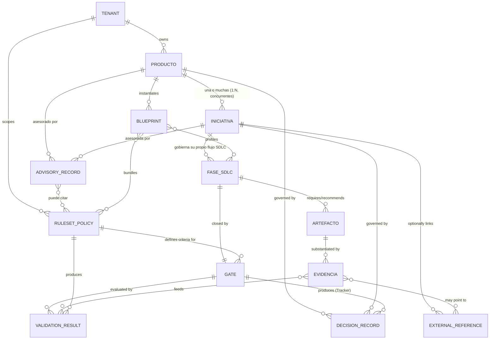
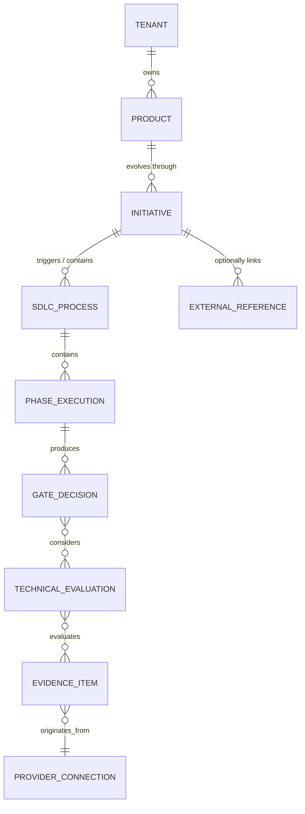
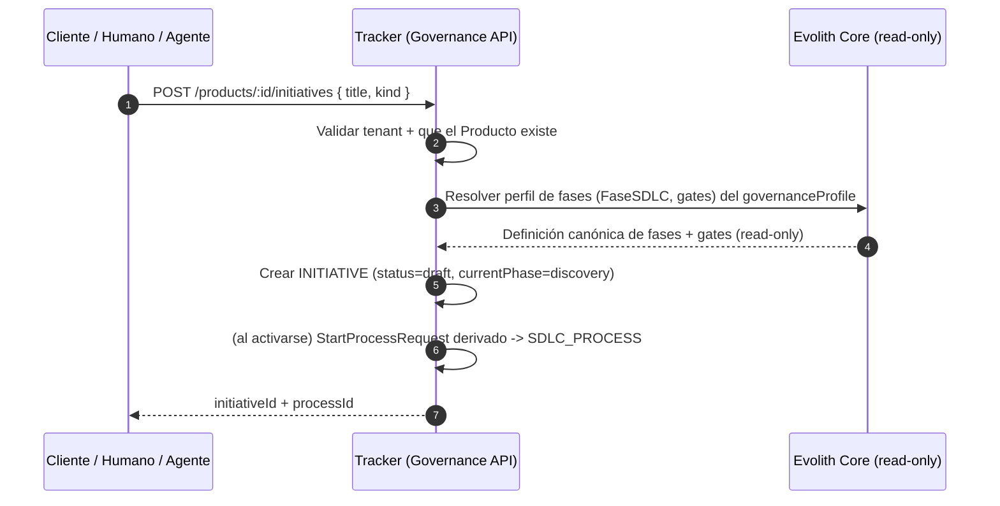
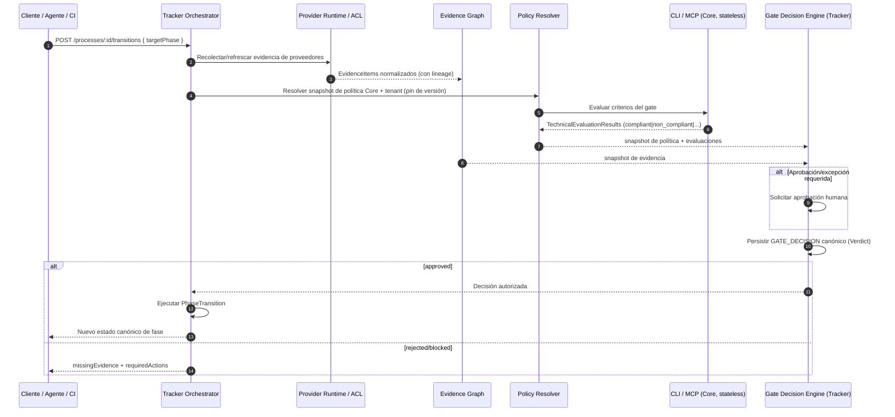

# Evolith Core — Redesign Toward a Product/Initiative Model

> **Bilingual navigation:** [Versión en Español](./product-initiative-governance-redesign.es.md)

**Classification:** Design Proposal — Core Governance Model
**Status:** *SUPERSEDED IN PART (2026-06-28) — corrected by [ADR-0101](../architecture/adrs/core/0101-core-stateless-evaluation-engine.md) and [Core Evaluation Engine Design](./core-evaluation-engine-design.es.md).*

> **⚠ Correction notice (altitude error).** This document correctly diagnosed the governance↔execution conflation, but modeled `Producto`/`Iniciativa`/`Evidencia`/`Decisión` as **Core domain entities with repositories, mutating use-cases and write endpoints** (`IProductRepository`, `RegisterProduct`, `POST /api/v1/products`, …). That **violates the corrected criterion**: the Core is a **STATELESS evaluator** and never owns/persists product/tenant/initiative/evidence/decision. **Deliverables 2, 4, 10, 11, 12 and the write-flows of 13 are SUPERSEDED** — replaced by `EvaluationContext` (input) / `EvaluationResult` (output) contracts. See the canonical design in [Core Evaluation Engine Design](./core-evaluation-engine-design.es.md) and [ADR-0101](../architecture/adrs/core/0101-core-stateless-evaluation-engine.md).
>
> **Still valid:** Deliverable 1 (conflation diagnosis), Deliverable 5 (`ExternalReference` as the only operational seam → now `ExternalReferenceContext`), externalizing agile schemas, dual-engine native+OPA, and evaluation ≠ decision (the Core emits a **non-binding** `DecisionRecommendation`; the Tracker decides/persists).
>
> | Prior concept (entity/repo/endpoint) | Corrected contract |
> |---|---|
> | `Producto` (`IProductRepository`, `POST /products`) | `ProductContext` (input, opaque) |
> | `Iniciativa` (`IInitiativeRepository`, `POST /initiatives`) | `InitiativeContext` (input, opaque) |
> | `Evidencia` (`IEvidenceRepository`, `POST /evidence`) | `EvidenceContext` (input) + `EvidenceEvaluationResult` (output) |
> | `DecisionRecord` (`IDecisionRecordRepository`, `POST /decisions`) | `DecisionRecommendation` (output, `binding: false`) |
> | `AdvisoryRecord` (`IAdvisoryRepository`, `POST /advisories`) | `Recommendation` (output) |
> | `Register/Open/Record/Attach` use-cases | none — the Core does not mutate; it only evaluates |
**Scope:** Documentation only — does not authorize code changes until Architecture Board approval (same regime as `reference/products/evolith-tracker/sdlc-tracker-technical-interfaces.md`).
**Owner:** Evolith Architecture Board
**Origin:** Multi-agent analysis anchored in real code (9 agents, adversarial verification). See Appendix B.

---

## Central thesis

> **Evolith Core is the source of truth for technical governance** (architecture, SDLC, rules, policies, blueprints, traceability, validations, and decisions). **It is not the source of truth for the operational execution of delivery** (epics, stories, tasks, sprints, estimations, velocity, boards).
>
> **Producto** and **Iniciativa** become the **primary governance units** of the Core. Epics, stories, issues, and tasks exist **only** as **optional** `ExternalReference` hanging off an `Iniciativa` —reference + hash/snapshot, never a copy of the canonical datum— and the Core remains **agnostic** about each tenant's external system (Jira, Azure DevOps, GitHub Projects, Trello, Asana, …).

## Executive summary

| # | Finding | Evidence (real anchor) |
|---|---|---|
| 1 | The Core **declares** it is not a "task-management platform" but **requires** agile artifacts as blocking gate evidence. | `reference/core/README.md:47` (assertion) vs `sdlc-evolith-artifact-mapping.md:130,132,133,223` (Stories/Backlog **Required**) and `:209` ("story readiness" closes the F2 gate). |
| 2 | **No** `Producto` or `Iniciativa` entity exists in the Core domain; the Initiative is an opaque string "never persisted." | `packages/core-domain/src/domain/entities/` only contains `blueprint.ts`; `gate-evidence.ts:87-89` (`initiative?: string`, "Never persisted or interpreted"). |
| 3 | The **Tracker itself already models** `PRODUCT`/`SDLC_PROCESS` as first class: the Core lags behind its own Tracker. | `sdlc-tracker-technical-interfaces.md:415-428`, `EvidenceItem` with `tenantId/productId/...` (`:100-149`). |
| 4 | Operational schemas (`evolith-user-story`, `agile-backlog`, `functional-story`, `ballpark-estimation`) live as canonical Core contracts. | `rulesets/schema/*`; `agile-backlog.schema.json:5,28,78,82` (sprint/velocity/totalPoints). |
| 5 | The correct precedent **already exists**: the Core returns `skipped` for execution data (sprint/velocity). | `executive-scorecard-rule.handler.ts:55` ("Sprint throughput requires tracker data"). |

**Proposal in one sentence:** formalize 9 governance entities (`Producto`, `Iniciativa`, `FaseSDLC`, `Gate`, `Artefacto`, `Evidencia`, `ExternalReference`, `ValidationResult`, `DecisionRecord`), externalize the agile schemas to optional `ExternalReference` via versioned deprecation with *grandfathering*, separate **evaluation** (`ValidationResult`, Core/CLI/MCP) from **decision** (`DecisionRecord`, emitted by the Tracker at runtime), and execute an incremental roadmap **R0→R5** without breaking satellites.

## Verification note (reviewer corrections incorporated)

This document incorporates the corrections of an adversarial critic who re-verified the assertions against the code (details in Appendix B):

- **H1 (corrected):** the "a task-management platform" assertion is at `reference/core/README.md:47` and the section header at `:41` (not `:44`, as originally cited). Corrected throughout the document.
- **H12 (corrected):** real internal lines of the story schemas — `evolith-user-story.schema.json` (`status:83`, `priority:88`, `storyPoints:94`) and `agile-backlog.schema.json` (`description:5`, `sprint:28`, `velocity:78`, `totalPoints:82`).
- **H5, H4/H7, H2/H3, H11 (annotated):** reviewer callouts inserted in the corresponding sections (verdict vocabulary `WAIVED`→`WAIVE`, `GateDecision`/`GateEvidence` signatures, port-folder duality, scope of the OPA audit).

## Deliverables index

| Deliverable | Content |
|---|---|
| 1 | Problem diagnosis |
| 2 | New conceptual model of the Core (+ canonical TypeScript interfaces) |
| 3 | Comparison table: current vs recommended model |
| 4 | Entities: keep / remove / rename / transform |
| 5 | Rules for treating epics and stories as `ExternalReference` |
| 6 | Required changes in rulesets |
| 7 | Required changes in OPA policies |
| 8 | Required changes in blueprints |
| 9 | Required changes in documentation |
| 10 | Required changes in Core interfaces |
| 11 | Integration with Evolith Tracker |
| 12 | Suggested contracts / API |
| 13 | Recommended flows |
| 14 | Implementation roadmap (R0–R5) |
| 15 | Suggested backlog for Evolith Tracker |
| — | Risks and mitigations (analysis item 13) · Appendix A (coverage) · Appendix B (verification) |

---

# Deliverable 1 — Problem diagnosis

The Core today explicitly declares that it **is not a task-management platform** (`reference/core/README.md:47` → "a task-management platform" in the "What Evolith Core Is Not" list), yet the governance mapping **contradicts that declaration** by requiring operational agile artifacts as blocking gate evidence. This is the **SDLC governance ↔ operational execution conflation**.

### 1.1 Evidence of the conflation: agile artifacts as mandatory gate evidence

| Operational artifact | Marking | Evidence location (path:line) |
|---|---|---|
| Evolith User Story | **Required** Phase 2 | `reference/governance/sdlc/sdlc-evolith-artifact-mapping.md:132` and matrix `:361` |
| Agile Backlog | **Required** Phase 2 | `sdlc-evolith-artifact-mapping.md:133` and matrix `:362` |
| Functional Stories | **Required** Phase 2 (O in Phase 1) | `sdlc-evolith-artifact-mapping.md:130` and matrix `:369` |
| Technical Stories (with `functionalStoryRef`) | **Required** Phase 3 | `sdlc-evolith-artifact-mapping.md:223` and matrix `:380` |
| Ballpark Estimation (T-Shirt sizing, team size) | **Required** Phase 1 | `sdlc-evolith-artifact-mapping.md:83` and matrix `:358` |

The mapping README itself describes the first gate as dependent on "story readiness" (`sdlc-evolith-artifact-mapping.md:209`: *"Gate F2 Review: ADR completeness, story readiness, blueprint alignment..."*). In other words: **the technical governance gate cannot be triggered without refined stories and a backlog existing** — a mechanic native to Scrum/Jira, not to a "provider-neutral engineering constitution".

### 1.2 Evidence of the conflation: operational schemas living inside the Core

These operational schemas are canonical Core contracts (`rulesets/schema/`), but they model execution units, not governance units:

- `evolith-user-story.schema.json:7,13` — `storyId` with pattern `^(US|TS|EN|DEBT)-\d{3}$`, `status: Draft|Ready|In Progress|Done|Blocked` (`:83`), `storyPoints: S|M|L|XL` (`:94`), `priority 1..5` (`:88`). This is a **task board**.
- `agile-backlog.schema.json:5` — *"Grouped, prioritized, and versioned user stories for an Epic or Initiative"*.
- `functional-story.schema.json` and `ballpark-estimation.schema.json:5` — *"team sizing"*.
- Operational templates in `reference/governance/sdlc/04-artifact-templates/`: `evolith-user-story-template.md`, `agile-backlog-template.md`, `functional-story-template.md`, `technical-story-template.md`, `story-seed-bank-template.md`, `epic-candidate-matrix-template.md`.

### 1.3 Evidence of the correct precedent: the Core already rejects operational data at runtime

The `executive-scorecard-rule.handler.ts:55` handler already returns `{ result: 'skipped', message: 'Sprint throughput requires tracker data' }`, and analogously `:53` (team health), `:51` (runtime observability). **The Core already admits that velocity/sprint/throughput are NOT resolved in Core** — but that boundary is not enforced consistently: stories and the backlog do remain mandatory evidence.

### 1.4 Evidence of the absence of Producto and Iniciativa as first-class entities

- The Core domain **has no Producto or Iniciativa entity**. `packages/core-domain/src/domain/entities/` contains only `blueprint.ts` and `index.ts`.
- `blueprint.ts:37-47` models a **project/topology template** (`topology`, `phase`, `rulesets`), not a Producto. The schema confirms it: `blueprint.schema.json:9` (`blueprintId` e.g. `nestjs-hexagonal-f2`), `:13-16` (`topology` enum), `:17` (`phase: integer 1..5`). A Blueprint describes *which rules apply to a project in a phase*, not the unit of evolution/governance.
- `SatelliteRecord` (`packages/core-domain/src/domain/satellite-record.ts`) is the closest thing to a "unit", but it is a **satellite repository record** with a single global `phase: string` — it supports neither multiple concurrent Iniciativas nor governed-change traceability.
- `gate-evidence.ts:67-77` (`GateEvidence`) **has no `tenantId`, `productId`, or `initiativeId`**. Neither does the `gate-evidence.schema.json` schema (grep with no matches). Gate evidence floats without an anchor to Producto/Iniciativa/Tenant.
- `ExecutionContext` (`gate-evidence.ts:87-92`) already has `initiative?: string` and `tenant?: string`, but the comment at `:87` says *"Verbatim echo of caller-supplied context. Never persisted or interpreted"* — that is, **Iniciativa exists informally as an opaque string, never as an entity**.

The Tracker, by contrast, **already models Producto and process as first-class citizens** (`reference/products/evolith-tracker/sdlc-tracker-technical-interfaces.md:415-428`: `TENANT ||--o{ PRODUCT`, `PRODUCT ||--o{ SDLC_PROCESS`) and its `EvidenceItem` already carries `tenantId/productId/processId/phaseExecutionId` (`:100-149`). The Core lags behind its own Tracker in the domain model.

**Diagnosis conclusion:** the Core mixes two planes. The **governance** plane (Producto, Iniciativa, FaseSDLC, Gate, Artefacto, Evidencia, ValidationResult, DecisionRecord) is legitimate and must be formalized. The **operational execution** plane (stories, backlog, story points, task states, sprint, estimation) is embedded as mandatory and must be downgraded to an optional `ExternalReference` hanging off `Iniciativa`.

---

---

# Deliverable 2 — New conceptual model of the Core

### 2.1 ER Diagram



> **Key cardinality:** a **Producto** has **one or many Iniciativas** (1:N), possibly **concurrent**; **each Iniciativa governs its own SDLC flow** (its phases, gates, artifacts, and evidence) independently. Evolith is not only a gate guardian: it also **advises** — it produces `ADVISORY_RECORD` (architectural consulting and assistance, non-binding) at the Producto or Iniciativa level. See §2.4.

### 2.2 Definition of each entity

| Entity | Purpose | Key attributes | Invariants | Owner |
|---|---|---|---|---|
| **Tenant** | Multi-tenant isolation boundary. | `tenantId` | Every governance entity hangs off a Tenant; never cross-tenant. `rulesets/schema/tenant.schema.json` and `multi-tenancy.rego` already exist. | Core (definition) / Tracker (runtime) |
| **Producto** | Primary unit of evolution, architecture, governance, and traceability. Consistent with the Tracker's `PRODUCT` (`sdlc-tracker-technical-interfaces.md:416`). | `productId`, `tenantId`, `name`, `repositoryRef?`, `governanceProfileRef` | Unique per `(tenantId, name)`. Contains no stories or tasks. Persists architecture/decisions, not execution. | Core (canonical form) / Tracker (state) |
| **Iniciativa** | Primary unit of governed change/improvement/requirement/transformation/delivery. Formalizes the `initiative` that is currently opaque in `gate-evidence.ts:89`. | `initiativeId`, `productId`, `tenantId`, `title`, `kind`, `status`, `currentPhase` | Always hangs off a Producto, which may have **one or many concurrent Iniciativas** (1:N). **Each Iniciativa governs its own SDLC flow** (phases/gates/artifacts/evidence). Epics/stories/tasks **only** as optional `ExternalReference`; never its own attributes. | Core (canonical form) / Tracker (state) |
| **FaseSDLC** | Configurable process stage (5 canonical phases). Consistent with `PhaseId` (`sdlc/phase-id.ts:14`) and the Tracker's `PHASE_EXECUTION`. | `phaseId` (`discovery\|design\|construction\|qa\|release`), `order` | Uses canonical ids from `CANONICAL_PHASE_IDS`; never the `F#` namespace (reserved for topology, `phase-id.ts:10-12`). | Core (definition) / Tracker (execution) |
| **Gate** | Control/decision point that closes a FaseSDLC. | `gateId`, `phaseId`, `criteria[]`, `rulesetRefs[]` | One Gate per FaseSDLC. The *criteria* reference Ruleset/Policy, never stories. `sdlc-gate.schema.json` already exists. | Core (definition) |
| **Artefacto** | Required or optional deliverable, legitimate governance evidence (PRD, ADR, Test Summary, Release Notes). | `artifactId`, `phaseId`, `requirement` (`required\|optional\|conditional`), `schemaRef?` | Models technical/architecture/quality governance, **not** agile execution. Story/backlog cease to be a Core Artefacto. | Core (catalog) |
| **Evidencia** | Proof/link/file/validation/reference that substantiates the progress of an Artefacto/Gate. Refines `GateEvidence` (`gate-evidence.ts:67`) and aligns with the Tracker's `EvidenceItem` (`sdlc-tracker-technical-interfaces.md:100`). | `evidenceId`, `tenantId`, `productId`, `initiativeId`, `phaseId`, `gateId?`, `artifactId?`, `contentHash`, `capturedAt` | Immutable. Carries `contentHash` (does not copy external data). May point to an `ExternalReference`. | Core (contract) / Tracker (graph) / external (origin) |
| **ExternalReference** | Optional link to external epics/stories/issues/tasks/documents. **The only place where operational items appear.** | `refId`, `system` (`jira\|azure-devops\|github\|...`), `externalId`, `url?`, `contentHash?`, `snapshotAt?` | Never mandatory. Only a reference + hash/snapshot; never copies the canonical data from the external system. | external (truth) / Core (pointer) |
| **ValidationResult** | Result of Core rulesets/OPA/validations. Consistent with `RuleEvaluation` (`satellite-manifest.ts:48`) and the Tracker's `TechnicalEvaluationResult` (`sdlc-tracker-technical-interfaces.md:157`). | `validationId`, `rulesetRef`, `rulesetVersion`, `status` (`compliant\|non_compliant\|indeterminate\|error`), `findings[]` | It is **evaluation, not decision** (Core/Tracker precedent). Does not mutate phase state. | Core (engine) / CLI / MCP |
| **DecisionRecord** | Technical or governance decision associated with a Producto or Iniciativa (includes gate verdict and governance ADR). Aligned with the `GateDecision` value object (`gates/decision/gate-decision.ts:19`) and the Tracker's rich `GateDecision` (`sdlc-tracker-technical-interfaces.md:186`). | `decisionId`, `subjectType` (`product\|initiative`), `subjectId`, `verdict` (`Verdict`), `rationale`, `decidedAt`, `decidedBy` | References the policy, evidence, and validations used (lineage). The **canonical gate verdict** is emitted by the Tracker at runtime; the Core defines the form. **It is binding** (governs progress). | Core (form) / Tracker (runtime emission) |
| **AdvisoryRecord** | **NON-binding architectural consulting and assistance** associated with a Producto or an Iniciativa: recommendations, design options, risk/cost evaluation, and guidance. Produced by Core engines (rulesets in *advisory* mode) or by **AI agents** (Winston, Principal Architect; see `reference/product-suite/methods/evolith-ai-assisted-validation-workflow.md`). | `advisoryId`, `subjectType` (`product\|initiative`), `subjectId`, `phaseId?`, `topic`, `recommendations[]`, `confidence`, `producedBy`, `binding: false` | **Never blocks a gate** (unlike `ValidationResult`/`DecisionRecord`): it is advisory. Cites Core ADRs/blueprints/patterns as backing. Traceable, versioned. | Core (engine + agents) |
| **Ruleset/Policy** | Machine-consumable validation policy and contracts (`rulesets/`, OPA). | `rulesetId`, `version`, `engine` (`native\|opa`) | Versioned and reviewable (Core Invariant `README.md:117`). Provider-neutral. | Core |
| **Blueprint** | Parameterizable template that combines topology + phase profile + default rulesets. Maintains `blueprint.ts:37`. | `blueprintId`, `topology`, `phase`, `rulesets[]`, `gateIds[]` | It is a project template, **not** a Producto or an Iniciativa. It is *instantiated* in a Producto. | Core |

### 2.3 Golden rule

> **Producto and Iniciativa are the primary governance units of the Core.** A **Producto** has **one or many Iniciativas** (1:N, concurrent), and **each Iniciativa governs its own SDLC flow**. All evidence, validation, decision, and advisory anchors to `(tenantId → productId → initiativeId → phaseId → gateId)`.
>
> **Epics, stories, issues, tasks, sprints, story points, backlog, and estimates are NEVER Core entities.** They can only exist as an **optional** `ExternalReference` hanging off an `Iniciativa` (or off an `Evidencia`), represented with `system + externalId + url + hash/snapshot` — never copying the canonical data from the tenant's external system. The Core is agnostic to Jira/Azure DevOps/GitHub Projects/Trello/Asana.
>
> **Evolith is not only a gate guardian: it is also an advisor.** Beyond governing (validating and deciding), it provides **architectural consulting and assistance** via `AdvisoryRecord` — a **non-binding** output that recommends and guides, without blocking progress.

### 2.4 Evolith's dual role: governance authority **and** architectural advisor

The Core operates in two complementary modes over the same units (`Producto`/`Iniciativa`), and produces **three clearly differentiated types of output** so as not to mix "what I recommend" with "what I require":

| Mode | Output | Binding? | Who produces it? | Anchoring |
|---|---|---|---|---|
| **Governance — evaluate** | `ValidationResult` | Not on its own, but **feeds the decision** | Core engine / CLI / MCP (stateless) | Conformance of gate criteria (rulesets/OPA). |
| **Governance — decide** | `DecisionRecord` | **Yes** (governs phase progress) | **Tracker** at runtime (the Core defines the form) | Canonical gate verdict (`Verdict`). |
| **Advisory — assist** | `AdvisoryRecord` | **No** (guides, does not block) | Core engine in *advisory* mode + **AI agents** (Winston, Principal Architect) | Architecture recommendations/options, risk, cost, debt; cites ADRs/blueprints/patterns. |

This fits with capabilities already present in the suite: the agent system (Winston as *Principal Architect* and the agents with contracts/handoffs/skills) and the `evolith-ai-assisted-validation-workflow.md` flow. Architectural assistance stops being implicit and becomes a **first-class, traceable, and versioned artifact** (`AdvisoryRecord`), which a Producto or an Iniciativa can request in any phase — even outside a gate. Multi-tenant by construction, just like the rest of the governance entities.

---

## Canonical interfaces (TypeScript)

These signatures are the MANDATORY reference for the rest of the agents. They are consistent with the Tracker's `EvidenceItem`, `TechnicalEvaluationResult`, and `GateDecision` (`reference/products/evolith-tracker/sdlc-tracker-technical-interfaces.md`), with `Verdict` (`packages/core-domain/src/domain/verdict/verdict.ts:14`), and with `PhaseId` (`packages/core-domain/src/domain/sdlc/phase-id.ts:14`).

```typescript
import type { Verdict, VerdictReason } from '@evolith/core-domain/domain/verdict/verdict';
import type { PhaseId } from '@evolith/core-domain/domain/sdlc/phase-id';
// PhaseId = 'discovery' | 'design' | 'construction' | 'qa' | 'release'

// ---------------------------------------------------------------------------
// Multi-tenancy: toda entidad de gobierno cuelga de un Tenant.
// ---------------------------------------------------------------------------

/** Unidad principal de evolución, arquitectura, gobierno y trazabilidad. */
export interface Producto {
  readonly productId: string;
  readonly tenantId: string;
  readonly name: string;
  /** Referencia opcional al repositorio gobernado (no copia su contenido). */
  readonly repositoryRef?: string;
  /** Perfil de gobierno/blueprint que el Producto instancia. */
  readonly governanceProfileRef: string;
  readonly createdAt: string;
  readonly updatedAt: string;
  readonly metadata?: Readonly<Record<string, unknown>>;
}

/** Unidad principal de cambio/mejora/requerimiento/transformación/delivery gobernado. */
export interface Iniciativa {
  readonly initiativeId: string;
  readonly productId: string;
  readonly tenantId: string;
  readonly title: string;
  readonly kind: 'feature' | 'improvement' | 'requirement' | 'transformation' | 'delivery' | 'fix';
  readonly status: 'draft' | 'active' | 'governed' | 'blocked' | 'closed' | 'cancelled';
  /** Fase SDLC actual de la Iniciativa (id canónico). */
  readonly currentPhase: PhaseId;
  /**
   * ÚNICO punto donde aparece lo operativo: epicas/historias/issues/tareas
   * SOLO como referencias externas opcionales. Nunca entidades del Core.
   */
  readonly externalReferences: readonly ExternalReference[];
  readonly createdAt: string;
  readonly updatedAt: string;
}

/** Etapa configurable del proceso SDLC. */
export interface FaseSDLC {
  readonly phaseId: PhaseId;
  /** Orden en el ciclo de vida (discovery=1 … release=5). */
  readonly order: number;
  readonly name: string;
  /** Artefactos asociados a esta fase. */
  readonly artifacts: readonly Artefacto[];
  /** Gate que cierra esta fase. */
  readonly gateId: string;
}

/** Punto de control o decisión que cierra una FaseSDLC. */
export interface Gate {
  readonly gateId: string;
  readonly phaseId: PhaseId;
  /** Criterios evaluados; referencian Ruleset/Policy, nunca historias. */
  readonly criteria: readonly {
    readonly criterionId: string;
    readonly rulesetRef: string;
    readonly rulesetVersion: string;
    readonly severity: 'error' | 'warning' | 'info';
  }[];
}

/** Entregable requerido u opcional. Gobernanza técnica/arquitectura/calidad. */
export interface Artefacto {
  readonly artifactId: string;
  readonly phaseId: PhaseId;
  readonly requirement: 'required' | 'optional' | 'conditional';
  /** Schema canónico del artefacto, si lo valida el Core. */
  readonly schemaRef?: string;
  /** Condición de activación cuando requirement = 'conditional'. */
  readonly condition?: string;
}

/** Vínculo OPCIONAL hacia epicas/historias/issues/tareas/documentos externos. */
export interface ExternalReference {
  readonly refId: string;
  readonly tenantId: string;
  /** Sistema externo del tenant. El Core es agnóstico de cuál sea. */
  readonly system: 'jira' | 'azure-devops' | 'github' | 'gitlab' | 'trello' | 'asana' | 'other';
  readonly kind: 'epic' | 'story' | 'issue' | 'task' | 'document' | 'pull_request' | 'other';
  /** Identificador en el sistema externo (no se copia el dato canónico). */
  readonly externalId: string;
  readonly url?: string;
  /** Hash/snapshot opcional para trazabilidad sin duplicar datos externos. */
  readonly contentHash?: string;
  readonly snapshotAt?: string;
}

/** Prueba/enlace/archivo/validación/referencia que sustenta el avance. */
export interface Evidencia {
  readonly evidenceId: string;
  readonly tenantId: string;
  readonly productId: string;
  readonly initiativeId: string;
  readonly phaseId: PhaseId;
  readonly gateId?: string;
  readonly artifactId?: string;
  readonly evidenceType: string;
  readonly schemaRef?: string;
  readonly schemaVersion?: string;
  readonly producer: {
    readonly actorType: 'human' | 'agent' | 'ci' | 'system';
    readonly actorId: string;
  };
  /** Punteros opcionales a artefactos operativos externos. */
  readonly references?: readonly ExternalReference[];
  readonly integrity: {
    /** Hash de contenido: trazabilidad sin copiar el dato externo. */
    readonly contentHash: string;
    readonly capturedAt: string;
  };
}

/** Resultado de rulesets/OPA/validaciones del Core. EVALUACIÓN, no decisión. */
export interface ValidationResult {
  readonly validationId: string;
  readonly tenantId: string;
  readonly gateId: string;
  readonly criterionId: string;
  readonly status: 'compliant' | 'non_compliant' | 'indeterminate' | 'error';
  readonly rulesetRef: string;
  readonly rulesetVersion: string;
  readonly engine: 'native' | 'opa';
  readonly evidenceIds: readonly string[];
  readonly findings: readonly {
    readonly ruleId: string;
    readonly severity: 'error' | 'warning' | 'info';
    readonly location?: string;
    readonly message: string;
  }[];
  readonly evaluatedAt: string;
  readonly evaluatedBy: { readonly type: 'cli' | 'mcp' | 'ci' | 'agent'; readonly version: string };
}

/** Decisión técnica o de gobierno asociada a Producto o Iniciativa. */
export interface DecisionRecord {
  readonly decisionId: string;
  readonly tenantId: string;
  /** A qué unidad de gobierno se ancla la decisión. */
  readonly subjectType: 'product' | 'initiative';
  readonly subjectId: string;
  /** Presente cuando la decisión cierra un gate. */
  readonly gateId?: string;
  readonly phaseId?: PhaseId;
  /** Veredicto canónico (PASS | FAIL | WAIVE | SKIP). */
  readonly verdict: Verdict;
  readonly reason?: VerdictReason;
  /** Lineage: política, evidencia y validaciones usadas. */
  readonly rulesetSnapshotRef: string;
  readonly evidenceIds: readonly string[];
  readonly validationIds: readonly string[];
  readonly rationale: string;
  readonly decidedAt: string;
  /** Veredicto canónico de gate lo emite Tracker en runtime; Core define la forma. */
  readonly decidedBy: { readonly system: 'evolith-core' | 'evolith-tracker'; readonly accountableActorId?: string };
}

/**
 * Consultoría / asistencia arquitectónica NO vinculante asociada a un Producto
 * o una Iniciativa. Recomienda y orienta; NUNCA bloquea un gate.
 * Producida por motores del Core en modo advisory o por agentes IA (Winston).
 */
export interface AdvisoryRecord {
  readonly advisoryId: string;
  readonly tenantId: string;
  readonly subjectType: 'product' | 'initiative';
  readonly subjectId: string;
  /** Fase SDLC en la que se solicita la asesoría (opcional: puede ser fuera de gate). */
  readonly phaseId?: PhaseId;
  readonly topic: 'architecture' | 'technology' | 'risk' | 'cost' | 'tech-debt' | 'security' | 'topology' | 'other';
  readonly recommendations: readonly {
    readonly title: string;
    readonly detail: string;
    /** Opciones de diseño cuando aplica (p. ej. trade-offs). */
    readonly options?: readonly string[];
    /** Respaldo: ADRs, blueprints o patrones canónicos del Core que citar. */
    readonly references?: readonly string[];
  }[];
  /** Confianza del asesor (motor o agente) en la recomendación. */
  readonly confidence?: 'low' | 'medium' | 'high';
  readonly producedBy: {
    readonly kind: 'engine' | 'agent';
    /** p. ej. 'winston' (Principal Architect) o el id del ruleset advisory. */
    readonly actorId: string;
    readonly modelRef?: string;
    readonly skillVersion?: string;
  };
  /** Invariante: la asesoría NO es vinculante. */
  readonly binding: false;
  readonly producedAt: string;
}
```

---

### Anchoring notes for the other agents

- `Verdict` and `VerdictRecord` already exist and are the single source (GT-316): `packages/core-domain/src/domain/verdict/verdict.ts:14,46`. **Do not invent new verdict vocabularies.**
- Canonical `PhaseId`: `packages/core-domain/src/domain/sdlc/phase-id.ts:14`. **Do not use `F#` for SDLC phase** (reserved for topology, `:10-12`).
- `GateDecision` collision: the Core value object (`packages/core-domain/src/gates/decision/gate-decision.ts:19`, `phase: number`) must be renamed to `CoreGateVerdict` and feed `DecisionRecord`; the rich `GateDecision` belongs to the Tracker (`reference/products/evolith-tracker/sdlc-tracker-technical-interfaces.md:186`). Disambiguate before coding.
- `Evidencia` is the multi-tenant evolution of `GateEvidence` (`gate-evidence.ts:67`) and must be read-compatible with the Tracker's `EvidenceItem` (`sdlc-tracker-technical-interfaces.md:100`).
- Operational boundary already partially applied in `packages/core-domain/src/application/validators/evaluators/handlers/executive-scorecard-rule.handler.ts:55` (sprint throughput → skipped): use it as a precedent when externalizing stories/backlog.

> **Reviewer note (signature precision — H4/H7).** Two signatures to disambiguate when coding: (a) the current value object `GateDecision.violations` is `string[]` (`packages/core-domain/src/gates/decision/gate-decision.ts:19-28`), **distinct** from `GateEvidence.violations: GateViolation[]` (`gate-evidence.ts`), and `makeGateDecision()` only emits `PASS`/`FAIL` (never `WAIVE`/`SKIP`); (b) the canonical phase **values** live in `gate-evidence.ts:28` (`GATE_PHASES`), whereas `phase-id.ts:14` is only the `PhaseId` type alias. Do not confuse the two when migrating.

---

# Deliverable 3 — Comparison table: current model vs recommended

| Aspect | Current model (evidence/path) | Recommended model | Impact |
|---|---|---|---|
| Governance unit | No `Producto`/`Iniciativa` entity exists; `entities/` only has `blueprint.ts`. The closest match is `SatelliteRecord` with a single global `phase` (`satellite-record.ts`). | `Producto` and `Iniciativa` as first-class canonical entities, consistent with the Tracker's `PRODUCT`/`SDLC_PROCESS` (`sdlc-tracker-technical-interfaces.md:416-418`). | High. Enables real traceability and multiple concurrent initiatives per Product. |
| Initiative | Opaque, non-persisted string (`gate-evidence.ts:89` `initiative?: string`; comment `:87` "Never persisted or interpreted"). | `Iniciativa` entity with `initiativeId`, `productId`, `tenantId`, `kind`, `status`. | High. Turns the unit of governed change into a first-class citizen. |
| Stories as gate evidence | Evolith User Story / Agile Backlog **Required** in Phase 2 (`sdlc-evolith-artifact-mapping.md:132,133,361,362`); story readiness blocks the gate (`:209`). | Downgrade to **optional** `ExternalReference` hanging off `Iniciativa`. The gate is evaluated against `Artefacto`+`Ruleset`, never against stories. | High. Eliminates the Scrum↔governance conflation; respects `README.md:47`. |
| Operational schemas in Core | `evolith-user-story.schema.json`, `agile-backlog.schema.json`, `functional-story.schema.json`, `ballpark-estimation.schema.json` are canonical Core contracts. | Externalize to reference/template; the Core retains only the `ExternalReference` schema + hash. | Medium-high. Reduces the Core's surface and avoids duplicating board tooling. |
| Evidence and multi-tenancy | `GateEvidence` (`gate-evidence.ts:67-77`) without `tenantId/productId/initiativeId`; the schema lacks them too. | `Evidencia` with `tenantId`, `productId`, `initiativeId`, `phaseId`, `contentHash`, aligned with `EvidenceItem` (`sdlc-tracker-technical-interfaces.md:100-149`). | High. Closes the isolation and anchoring gap. |
| Evaluation vs Decision | `GateEvidence.verdict` (`passed\|failed\|skipped`, `gate-evidence.ts:32`), the `GateDecision` value object (`gate-decision.ts:19`, `phase: number`, `Verdict PASS/FAIL`) and `RuleEvaluation` (`satellite-manifest.ts:48`) coexist. The `GateDecision` name collision has already been flagged (`sdlc-tracker-technical-interfaces.md:183`). | Formally separate `ValidationResult` (evaluation, Core/CLI/MCP) from `DecisionRecord` (decision, issued by the Tracker). Canonical verdict = `Verdict` enum (`verdict/verdict.ts:14`). | High. Resolves the already-documented evaluation≠decision ambiguity. |
| Operational state (velocity/sprint) | The handler already returns `skipped` for sprint throughput (`executive-scorecard-rule.handler.ts:55`) and team health (`:53`) — the boundary is only partially enforced. | Consistent boundary: all execution data is resolved outside the Core (Tracker + providers). | Low-medium. Consolidates an already-existing precedent. |
| Blueprint | Project/topology template (`blueprint.ts:37`, `blueprint.schema.json:9-17`). Risk of confusing it with a "product". | Keep it as a template; document that it is *instantiated* into a `Producto`, not that it is one. | Low. Conceptual clarification, no structural change. |
| FaseSDLC vs topology | Canonical ids are correct (`phase-id.ts:14`, `CANONICAL_PHASE_IDS`); `F#` is reserved for topology (`:10-12`). `blueprint.schema.json:17` uses `phase: integer 1..5` (legacy alias). | `FaseSDLC` always uses canonical ids; `F#` only on the topology axis. | Low. Reinforces the separation already established in the project's memory. |

---

---

# Deliverable 4 — Entities: keep / remove / rename / transform

| Current entity or artifact (path) | Action | Target or new name | Rationale |
|---|---|---|---|
| `gate-evidence.ts` — `GateEvidence` (`:67-77`) | **Transform** | `Evidencia` (add `tenantId`, `productId`, `initiativeId`, `phaseId`, `contentHash`); align with the Tracker's `EvidenceItem`. | Today it does not anchor to Product/Initiative/Tenant; it is floating evidence. |
| `entities/blueprint.ts` — `Blueprint` (`:37`) + `blueprint.schema.json` | **Keep** (with clarification) | `Blueprint` (template); document that it is instantiated into a `Producto`, not that it replaces it. | It is a valid topology/phase template (`blueprint.schema.json:5`), not a governance unit. |
| `sdlc/phase-id.ts` — `PhaseId`, `CANONICAL_PHASE_IDS` (`:14,17`) | **Keep** | `FaseSDLC.phaseId` reuses this type. | Single canonical source of phases; it already separates `F#` from topology (`:10-12`). |
| `domain/verdict/verdict.ts` — `Verdict`, `VerdictRecord` (`:14,46`) | **Keep** | Canonical verdict vocabulary for `ValidationResult` and `DecisionRecord`. | GT-316 already established it as the single source; consistent with the Tracker. |
| `gates/decision/gate-decision.ts` — `GateDecision` (`:19`, `phase: number`) | **Rename/Transform** | `CoreGateVerdict` (evaluation value object) → feeds `DecisionRecord`. The **canonical decision** is issued by the Tracker. | Name collision already documented (`sdlc-tracker-technical-interfaces.md:183`); separates evaluation from decision. |
| `satellite-manifest.ts` — `SatelliteManifest`, `RuleEvaluation` (`:17,48`) | **Keep / Transform** | `RuleEvaluation` → input to `ValidationResult`. `SatelliteManifest.phase` migrate to canonical id (currently it comments `f1..f5`, `:35`). | It is the input of the evaluation pipeline; legitimate, but it must use canonical ids. |
| `satellite-record.ts` — `SatelliteRecord` (`:4`) | **Transform** | Bind to `Producto` (a `SatelliteRecord` ≈ repository of a `Producto`); the global `phase` moves to live in `Iniciativa`/`FaseSDLC`. | Today it mixes repository + single phase; it does not support concurrent initiatives. |
| `rulesets/schema/evolith-user-story.schema.json` (`:7,13,85,96`) | **Externalize** | External template/reference + `ExternalReference` schema. | It models a task board (`status`, `storyPoints`); it violates `README.md:47`. |
| `rulesets/schema/agile-backlog.schema.json` (`:5`) | **Externalize** | External reference hanging off `Iniciativa` via `ExternalReference`. | "Grouped, prioritized user stories" is operational execution, not governance. |
| `rulesets/schema/functional-story.schema.json` (`:5`) | **Externalize** | External reference; optional. | Operational behavior specification; it must not block a gate. |
| `rulesets/schema/ballpark-estimation.schema.json` (`:5`) | **Externalize** | External reference; optional. | "Team sizing"/estimation = execution; the Core does not estimate velocity (`executive-scorecard-rule.handler.ts:55`). |
| `technical-story.schema.json` + `04-artifact-templates/technical-story-template.md` | **Externalize** | External reference with `functionalStoryRef` as `ExternalReference`. | Required in Phase 3 (`sdlc-evolith-artifact-mapping.md:223`); it is an operational implementation unit. |
| Templates `evolith-user-story-template.md`, `agile-backlog-template.md`, `functional-story-template.md`, `story-seed-bank-template.md`, `epic-candidate-matrix-template.md` (`04-artifact-templates/`) | **Externalize** | Move to an external guide/reference outside the normative gate corpus. | They are Scrum templates; they cease to be mandatory governance evidence. |
| **Required** marks for Evolith User Story / Agile Backlog / Functional Stories / Technical Story in the matrix (`sdlc-evolith-artifact-mapping.md:361,362,369,380`) | **Transform** | Reclassify to `Optional`/`ExternalReference`; replace "story readiness" with `Artefacto`+`Ruleset` criteria. | This is the root of the conflation: governance gates depending on execution artifacts. |
| Legitimate governance artifacts (PRD `prd.schema.json`, ADR `adr.schema.json`, Test Summary `test-summary-report.schema.json`, Release Notes `release-notes.schema.json`, Security Scan, etc.) | **Keep** | Canonical Core `Artefacto`. | They are technical/architecture/quality governance, not agile execution. |

---

---

# Deliverable 5 — Rules for treating epics and stories as external references

### Guiding principle

> A Core Gate never evaluates the existence, status, or size of a story. It evaluates the presence and conformance of governance **Artefacts** and their **Evidencias**, anchored to `(tenantId → productId → initiativeId → phaseId → gateId)`. Epics/stories/issues/tasks are modeled exclusively as **optional** `ExternalReference` hanging off the `Iniciativa` or an `Evidencia`.

Today that boundary is broken at three verifiable points:

- `rulesets/sdlc/phase-gates.rules.json` requires `Functional Stories` with `validation: "All Functional Stories in Ready state with BDD acceptance criteria"` (Phase 2) and `Technical Stories` with `validation: "All technical stories Done; traceable to Functional Stories"` (Phase 3). Those `mandatoryEvidence` evaluate board status.
- `rulesets/definition-of-done/definition-of-done.rules.json` `DOD-03` validates *"All acceptance criteria marked as verified in story tracker"* and `exitCriteria.validationTools` includes `"story tracker"` — the Core assumes a story system as a validation tool.
- `reference/governance/sdlc/sdlc-evolith-artifact-mapping.md:209` defines the F2 Gate as dependent on "story readiness", and the consolidated matrix marks `Evolith User Story` (`:361`), `Agile Backlog` (`:362`), `Functional Stories` (`:369`) and `Technical Story Template` (`:380`) as **R** (Required).

### `ExternalReference` contract (validation rules)

| Rule | ID | Severity | Statement | Code anchor |
|---|---|---|---|---|
| Absolute optionality | `EXT-01` | MUST | No `ExternalReference` may be a gate's `mandatoryEvidence` or `blocking: true`. Its absence never blocks a phase transition. | Counters `phase-gates.rules.json` Phase 2/3 (Functional/Technical Stories as `mandatoryEvidence`) |
| External system identity | `EXT-02` | MUST | `system` + `externalId` present; `system` ∈ agnostic enum (`jira\|azure-devops\|github\|gitlab\|trello\|asana\|other`). The Core assumes none. | Aligned with the SPINE's `Iniciativa.externalReferences` |
| No copying of canonical data | `EXT-03` | MUST | Only `externalId`, `url?`, `contentHash?`, `snapshotAt?` are allowed. Persisting `status`, `storyPoints`, `sprint`, `velocity`, `priority` from the external system is prohibited. | Removes the board fields currently in `evolith-user-story.schema.json` (`status`, `storyPoints`, `priority`) and `agile-backlog.schema.json` (`sprint`, `velocity`, `totalPoints`) |
| Optional integrity | `EXT-04` | SHOULD | If `contentHash` is provided, it must be accompanied by `snapshotAt`; the hash is the only traceability mechanism that does not duplicate the data. | Consistent with the SPINE's `Evidencia.integrity.contentHash`; precedent `evidence-manifest.rules.json:EVD-02` (link to source, not copy) |
| Anchoring to Initiative | `EXT-05` | MUST | Every `ExternalReference` belongs to an `Iniciativa` (via `initiativeId`) or to an `Evidencia`; it never floats at the Product level without an Initiative. | Formalizes the opaque `initiative?: string` of `gate-evidence.ts:89` |

### Redefinition of gates that currently require stories

| Gate (phase) | Current condition (path:field) | Redefined condition (Artefacto / Evidencia / Iniciativa) |
|---|---|---|
| Phase 1 — Business Sign-Off | `Ballpark Estimation` → `"T-Shirt sizing completed with team composition"` (`phase-gates.rules.json` Phase 1) | The gate evaluates `Technical Feasibility Canvas` (`technical-feasibility.schema.json`) + `Build-versus-Compose Analysis` (`build-vs-compose.schema.json`). Sizing/team becomes an optional `ExternalReference`. `Ballpark Estimation` is downgraded to recommended (not `mandatoryEvidence`). |
| Phase 2 — Design Baseline | `Functional Stories` → `"All Functional Stories in Ready state with BDD acceptance criteria"`; blocking `"Functional stories lack acceptance criteria"` | The gate evaluates `Bounded Context Map` + `ADR Registry` + `Reference Blueprint Alignment` (already `mandatoryEvidence`). The behavior/acceptance criterion is covered by an `Acceptance Specification` governance `Artefacto` (provider-neutral BDD) instead of "story readiness". The stories remain as `ExternalReference` of the `Iniciativa`. |
| `:209` "Gate F2 Review … story readiness" | "story readiness" as a review criterion | Replace with "artifact readiness": ADR completeness + bounded context map + acceptance specification conforming to schema. |
| Phase 3 — Successful Build | `Technical Stories` → `"All technical stories Done; traceable to Functional Stories"` (`functionalStoryRef`) | The gate evaluates `CI Pipeline` + `Coverage Report` + `Definition of Done Checklist` + `Documentation Delta` (already present). The `TS→FS` traceability is retained as an optional `ExternalReference.kind: 'story'` on the `Evidencia`, not as `mandatoryEvidence`. |
| DoD `DOD-03` | `"All acceptance criteria marked as verified in story tracker"` + `validationTools: ["story tracker"]` | Rewrite to `"All acceptance criteria in the Acceptance Specification verified by integration/E2E evidence"`; remove `"story tracker"` from `validationTools` (replace with `"acceptance-specification + test evidence"`). |

---

---

# Deliverable 6 — Required changes in rulesets

### Table of changes by ruleset/schema

| Current ruleset / schema (path) | Change | New semantics |
|---|---|---|
| `rulesets/schema/evolith-user-story.schema.json` | **Deprecate → external-reference profile** | Relabel `title: "User Story (External Reference Profile)"`; add `deprecated: true` and `x-evolith-status: external-reference`. No longer a canonical gate artifact; becomes an optional profile of `external-reference.schema.json`. |
| `rulesets/schema/agile-backlog.schema.json` | **Deprecate → external-reference profile** | Same. The `sprint`, `velocity`, `totalPoints`, `status` fields are marked `deprecated`/`readOnly`: never an input to gate validation (precedent `executive-scorecard-rule.handler.ts:55` "Sprint throughput requires tracker data"). |
| `rulesets/schema/functional-story.schema.json` | **Deprecate → external-reference profile** + extract `Acceptance Specification` | The BDD core (`actors`, `businessRules`, `acceptanceCriteria`) is promoted to a provider-neutral governance `Artefacto`; the rest (status, epic, story IDs) is downgraded to `external-reference`. |
| `rulesets/schema/technical-story.schema.json` | **Deprecate → external-reference profile** | `functionalStoryId`/`functionalStoryRef` becomes an `ExternalReference`. The legitimate governance portion (`testing`, `definitionOfDone`, `observabilityRequirements`) is referenced from `Evidencia`, not from a "story". |
| `rulesets/schema/ballpark-estimation.schema.json` | **Partial rewrite** | Keep `technicalConstraints` (CPU/RAM/storage = governance constraint, valid). Mark `team`, `durationSprints`, `estimates[].size`, `approvalStatus` as `external-reference`/optional. Not `mandatoryEvidence`. |
| `rulesets/sdlc/phase-gates.rules.json` | **Rewrite** | Remove `Functional Stories` (Phase 2) and `Technical Stories` (Phase 3) from `mandatoryEvidence`; remove the `blockingCriteria` "Functional stories lack acceptance criteria"; replace with `Acceptance Specification` + Artifact/CI criteria. Add anchoring level `tenantId/productId/initiativeId/phaseId`. |
| `rulesets/definition-of-done/definition-of-done.rules.json` | **Rewrite** | `DOD-03`: change `validationQuery` to a check against `Acceptance Specification` + test evidence; remove `"story tracker"` from `exitCriteria.validationTools`. The DoD applies to an `Iniciativa`/`Evidencia`, not "to each Technical Story". |
| `rulesets/evidence/evidence-manifest.rules.json` | **Rewrite (extend)** | `EVD-01/02` already require `id/source/producer/relatedGateId`; add rules for `tenantId`, `productId`, `initiativeId`, `phaseId`, `contentHash`, and allow an optional `externalReferences[]`. It is the natural junction point with `ExternalReference`. |
| `rulesets/schema/gate-evidence.schema.json` | **Rewrite** | Add `tenantId`, `productId`, `initiativeId` (currently absent), `artifactId?`, and `references?: ExternalReference[]`. Convert the `verdict` enum to align with `Verdict` (`PASS/FAIL/WAIVE/SKIP`) while preserving read compatibility. |
| `rulesets/schema/sdlc-gate.schema.json` and `sdlc-phase.schema.json` | **Rewrite** | `id`/`phase` currently use the pattern `^gate-f[1-5]$` / `^f[1-5]$`, conflating the SDLC phase with the `F#` topology. Migrate to canonical ids `discovery\|design\|construction\|qa\|release` (precedent `gate-evidence.schema.json` `phase` enum). |
| `rulesets/schema/satellite-record.schema.json` | **Rewrite** | `phase: string` with examples `f1..f5` mixes repository + single phase. Bind to `productId`; move `phase` to the `Iniciativa`. Supports concurrent initiatives per Product. |
| `rulesets/schema/blueprint.schema.json` | **Keep (clarify)** | No structural change; document that the Blueprint is *instantiated* into a `Producto`, not that it replaces it. `phase: integer 1..5` remains a template profile, distinct from the canonical `phaseId` of `FaseSDLC`. |
| `rulesets/satellite-contracts/satellite-contracts.rules.json` | **Rewrite (compat)** | Currently requires `metadata.phase ∈ {F1,F2,F3}` and `spec.sdlc.currentPhase ∈ {1..5}`. Keep for compatibility but document that `F#` is a topology axis; add an optional `spec.initiatives[]` field with an `ExternalReference` per initiative. |
| `rulesets/opa/phase-gates.rego` | **No logic change** | `missing_evidence` resolves by `artifact` string name (verified: `some req in input.gate.mandatoryEvidence; artifact := req.artifact`). It suffices for the ruleset to stop listing the stories as `mandatoryEvidence`; the Rego does not need a rewrite. |
| `rulesets/opa/evidence.rego` + `opa/schemas/evidence.input.schema.json` | **Rewrite (extend)** | Add validation of `tenantId/productId/initiativeId` in the evidence manifest and accept an optional `externalReferences[]`, mirroring the native change in `evidence-manifest.rules.json` (Dual-Engine Parity). |

### Proposed new schemas

Target path: `rulesets/schema/`. Key fields (sketch; full signatures in the SPINE, "Canonical Interfaces" section):

| New schema | Key fields (required in bold) | Notes |
|---|---|---|
| `product.schema.json` | **`productId`**, **`tenantId`**, **`name`**, `repositoryRef?`, **`governanceProfileRef`**, `createdAt`, `updatedAt`, `metadata?` | Unique per `(tenantId,name)`. No stories or tasks. Consistent with the Tracker's `PRODUCT`. |
| `initiative.schema.json` | **`initiativeId`**, **`productId`**, **`tenantId`**, **`title`**, **`kind`** (`feature\|improvement\|requirement\|transformation\|delivery\|fix`), **`status`** (`draft\|active\|governed\|blocked\|closed\|cancelled`), **`currentPhase`** (PhaseId), `externalReferences[]` | Formalizes the opaque `initiative` from `gate-evidence.ts:89`. `externalReferences` is the ONLY place for operational concerns. |
| `external-reference.schema.json` | **`refId`**, **`tenantId`**, **`system`** (agnostic enum), **`kind`** (`epic\|story\|issue\|task\|document\|pull_request\|other`), **`externalId`**, `url?`, `contentHash?`, `snapshotAt?` | `additionalProperties: false`. Forbids board fields (status/points/sprint/velocity). Rules `EXT-01..05`. |
| `artifact.schema.json` | **`artifactId`**, **`phaseId`**, **`requirement`** (`required\|optional\|conditional`), `schemaRef?`, `condition?` | Catalog of governance Artifacts. Replaces the inline `mandatoryEvidence[].artifact` of `phase-gates.rules.json` with a first-class entity. |
| `evidence.schema.json` | **`evidenceId`**, **`tenantId`**, **`productId`**, **`initiativeId`**, **`phaseId`**, `gateId?`, `artifactId?`, **`evidenceType`**, `producer{actorType,actorId}`, `references[]?`, **`integrity{contentHash,capturedAt}`** | Multi-tenant evolution of `gate-evidence.schema.json`. Read-compatible with the Tracker's `EvidenceItem`. |
| `validation-result.schema.json` | **`validationId`**, **`tenantId`**, **`gateId`**, **`criterionId`**, **`status`** (`compliant\|non_compliant\|indeterminate\|error`), **`rulesetRef`**, **`rulesetVersion`**, **`engine`** (`native\|opa`), `evidenceIds[]`, `findings[]`, `evaluatedAt`, `evaluatedBy` | EVALUATION, not decision. Does not mutate phase state. |
| `decision-record.schema.json` | **`decisionId`**, **`tenantId`**, **`subjectType`** (`product\|initiative`), **`subjectId`**, `gateId?`, `phaseId?`, **`verdict`** (Verdict enum), `reason?`, `rulesetSnapshotRef`, `evidenceIds[]`, `validationIds[]`, **`rationale`**, **`decidedAt`**, `decidedBy{system,accountableActorId?}` | Shape defined by Core; the canonical gate verdict is issued by the Tracker at runtime. |

### Downgrade to "external-reference profiles" without breaking satellites (versioned compat)

A non-destructive deprecation strategy in four steps, so as not to invalidate `evolith.yaml` or evidence already emitted by satellites:

1. **Mark, do not delete (ruleset v1.x).** In `evolith-user-story.schema.json`, `agile-backlog.schema.json`, `functional-story.schema.json`, `technical-story.schema.json`, add the metadata `"deprecated": true` and `"x-evolith-status": "external-reference"`, keeping `$id` intact. Satellites that still validate against those `$id`s keep passing (structure is not broken).

2. **Remove from `mandatoryEvidence` (same minor bump).** In `phase-gates.rules.json`, reclassify `Functional Stories`/`Technical Stories` from `mandatoryEvidence` to a new `recommendedReferences` list (non-blocking). Since `phase-gates.rego` resolves by name in `input.gate.mandatoryEvidence`, once they disappear from that list the gate stops requiring them **without changing the Rego** (verified in `phase-gates.rego`: `missing_evidence` iterates `input.gate.mandatoryEvidence`).

3. **Major bump of the SDLC ruleset (`1.0.0 → 2.0.0`).** Publish `external-reference.schema.json` + `initiative.schema.json` + `product.schema.json`. Satellites that want to trace stories migrate to `Iniciativa.externalReferences[]`. The old story schemas remain as "profiles" referenceable from `external-reference` but are no longer normative. Versioning consistent with the `README.md` principle: *"Versioned rules — satellites pin to a specific version"*.

4. **Coexistence window + waiver.** While a satellite remains pinned to `rulesetVersion: 1.x`, the Core accepts both models (story as legacy evidence OR `ExternalReference`). The `evolith upgrade --target-version` (`satellite-contracts.rules.json:MIG-01`) runs the rule diff and migrates `spec.sdlc` → `spec.initiatives[].externalReferences`. Once the window has passed, validating against a story schema as `mandatoryEvidence` emits `severity: warning` (not `error`) until the next major, preserving Dual-Engine Parity between Native and OPA at each step.

> **Compatibility guaranteed:** no `$id` is removed nor its structure rewritten within the same major; satellites on `1.x` do not break. Mandatoriness is withdrawn via the *rulesets* (removing from `mandatoryEvidence`), not via the *schemas* — exactly as `executive-scorecard-rule.handler.ts:55` already withdrew sprint throughput by returning `skipped` instead of failing.

### Verified anchors (real paths)

- Stories as mandatory evidence: `rulesets/sdlc/phase-gates.rules.json` (Phase 2 `Functional Stories`, Phase 3 `Technical Stories`); `reference/governance/sdlc/sdlc-evolith-artifact-mapping.md:209,361,362,369,380`.
- DoD coupled to story tracker: `rulesets/definition-of-done/definition-of-done.rules.json` `DOD-03` (`"...in story tracker"`) and `exitCriteria.validationTools: ["...","story tracker"]`.
- Board fields in Core schemas: `evolith-user-story.schema.json` (`status`, `storyPoints`, `priority`), `agile-backlog.schema.json` (`sprint`, `velocity`, `totalPoints`).
- Evidence without multi-tenant anchoring: `rulesets/schema/gate-evidence.schema.json` (no `tenantId/productId/initiativeId`).
- `F#` vs SDLC phase confusion in gate schemas: `sdlc-gate.schema.json` (`^gate-f[1-5]$`/`^f[1-5]$`) and `sdlc-phase.schema.json` (`^f[1-5]$`), versus the canonical enum of `gate-evidence.schema.json` (`discovery\|design\|construction\|qa\|release`).
- OPA resolves evidence by name, not by story content: `rulesets/opa/phase-gates.rego` (`missing_evidence` iterates `input.gate.mandatoryEvidence`), so the downgrade does not require a Rego rewrite.

---

# Deliverable 7 — Required changes in OPA policies

> **Reviewer note (OPA coverage — H11).** Only `dod.rego` was audited in depth and confirmed to be 100% `input.story.*` (10/10 rules). Before declaring the "frontier closed" at the OPA layer, the audit of `cicd-quality-gates.rego`, `engineering-manifesto.rego`, `testing-pyramid.rego` and `compliance-baseline.rego` must be completed to rule out other `input.story.*` conflations. The scope addressed here covers ~9 of the >30 policies in the `rulesets/opa/` directory.

> **Guiding principle (ADR-0041, dual-engine native+OPA; `rulesets/opa/README.md:9-11`):** OPA is a *parity engine* that re-expresses the same semantics as the Native `*.rules.json`. Therefore, **every input change proposed here must be applied in parallel to the Native evaluator** so as not to introduce parity drift (`README.md:99` "Dual-Engine Parity drift"). OPA **evaluates**; it **does not decide**: it produces `violations`/`allow` (a `ValidationResult` in SPINE terms), and the canonical verdict (`DecisionRecord`) is issued by the Tracker at runtime. The Core remains read-only at runtime.

### 1. New canonical OPA INPUT

Today each policy defines its own decoupled input fragment (`input.core`, `input.satellite`, `input.story`, `input.gate`, `input.spec`), without a common governance wrapper. A **single context wrapper** `input.context` is proposed, consumed by every gate policy, aligned with the SPINE (`Producto`, `Iniciativa`, `FaseSDLC`, `Gate`, `Artefacto`, `Evidencia`, `ExternalReference`, `ValidationResult`) and with the canonical `PhaseId` (`packages/core-domain/src/domain/sdlc/phase-id.ts:14`).

```json
{
  "context": {
    "tenant":   { "tenantId": "t-acme" },                         // OBLIGATORIO
    "product":  { "productId": "p-checkout", "tenantId": "t-acme" }, // OBLIGATORIO
    "initiative": {                                                // OBLIGATORIO
      "initiativeId": "i-3ds-rollout",
      "productId": "p-checkout",
      "tenantId": "t-acme",
      "kind": "feature",
      "status": "active",
      "currentPhase": "construction"
    },
    "phase":  { "phaseId": "construction", "order": 3 },           // OBLIGATORIO (id canónico, nunca F#)
    "gate":   {                                                    // OBLIGATORIO en policies de gate
      "gateId": "g-construction",
      "phaseId": "construction",
      "criteria": [
        { "criterionId": "QT-01", "rulesetRef": "sdlc/coverage", "rulesetVersion": "1.4.0", "severity": "error" }
      ]
    },
    "artifacts": [                                                 // OBLIGATORIO (puede ir vacío)
      { "artifactId": "test-summary", "phaseId": "construction", "requirement": "required", "schemaRef": "test-summary-report.schema.json" },
      { "artifactId": "adr",          "phaseId": "construction", "requirement": "conditional", "condition": "architecturalDecisionMade" }
    ],
    "evidence": [                                                  // OBLIGATORIO (puede ir vacío)
      {
        "evidenceId": "e-001",
        "tenantId": "t-acme",
        "productId": "p-checkout",
        "initiativeId": "i-3ds-rollout",
        "phaseId": "construction",
        "gateId": "g-construction",
        "artifactId": "test-summary",
        "evidenceType": "test-summary-report",
        "status": "compliant",
        "integrity": { "contentHash": "sha256:…", "capturedAt": "2026-06-28T10:00:00Z" }
      }
    ],
    "externalReferences": [                                        // OPCIONAL — único lugar de lo operativo
      {
        "refId": "x-1",
        "tenantId": "t-acme",
        "system": "jira",
        "kind": "story",
        "externalId": "CHK-482",
        "url": "https://acme.atlassian.net/browse/CHK-482",
        "contentHash": "sha256:…",
        "snapshotAt": "2026-06-28T09:00:00Z"
      }
    ],
    "rulesetSnapshot": {                                           // OBLIGATORIO (lineage + paridad)
      "rulesetSnapshotRef": "core-rulesets@2026.06.0",
      "engine": "opa",
      "rulesetVersion": "2026.06.0"
    },
    "waiver": [                                                    // OPCIONAL
      { "criterionId": "QT-04", "status": "active", "authorityRole": "architect", "expirationDate": "2026-07-30" }
    ],
    "evaluationDate": "2026-06-28"                                 // OBLIGATORIO para waivers con expiración
  }
}
```

**Field requirement:**

| Field | Required | Note |
|---|---|---|
| `context.tenant.tenantId` | **Yes** | Isolation boundary; no gate evaluation without tenant. |
| `context.product.productId` (+ `tenantId`) | **Yes** | Governance unit. Must match `tenant`. |
| `context.initiative` (`initiativeId`, `productId`, `tenantId`, `currentPhase`) | **Yes** | Formalizes the currently opaque `initiative` (`gate-evidence.ts:89`). |
| `context.phase.phaseId` | **Yes** | Canonical id `discovery\|design\|construction\|qa\|release`; **never** `F#`. |
| `context.gate` | **Yes** in gate policies | `criteria[]` reference Ruleset/Policy, not stories. |
| `context.artifacts[]` | **Yes** (list, may be empty) | Replaces ad-hoc `mandatoryEvidence` with a typed `Artefacto`. |
| `context.evidence[]` | **Yes** (list, may be empty) | Multi-tenant `Evidencia`; carries `contentHash`, does not copy external data. |
| `context.externalReferences[]` | **No** | The only point where operational items appear (stories/epics/tasks). Never blocking. |
| `context.rulesetSnapshot` | **Yes** | Lineage + version for dual-engine parity. |
| `context.waiver[]`, `context.evaluationDate` | Conditional | `evaluationDate` required if there are waivers with `expirationDate`. |

### 2. Current policy → proposed change

| Current policy (path) | Current input assumption | Proposed change | New input/relationship |
|---|---|---|---|
| `rulesets/opa/phase-gates.rego:7-12` | `input.gate.{phase:int,mandatoryEvidence}`, `input.evidence[{artifact,status}]`, `input.tenantId` **optional** (`:11,:60` default `"default"`). Evidence not anchored to product/initiative. | Anchor to `context`; canonical `phaseId` (not `int`); evidence resolved by `artifactId` and filtered by `(tenantId,productId,initiativeId,phaseId)`; `tenantId` **required**. | `context.gate`, `context.artifacts[]`, `context.evidence[]`, `context.tenant/product/initiative/phase`. |
| `rulesets/opa/dod.rego:1-42` + `schemas/dod.input.schema.json:6-8` | **The entire input is `input.story.*`** (`reviewCount`, `coveragePercent`, `acceptanceCriteriaVerified`…). DoD modeled as a **per-story** gate. | Re-anchor DoD to **Iniciativa + Evidencia**, not to a story. The signals (coverage, review, ADR, CI) become typed `Evidencia` of the `Iniciativa` in the `construction/qa` phase. `input.story` is removed. | `context.initiative`, `context.evidence[]` (types `code-review`, `coverage-report`, `ci-run`, `security-scan`); story linked as **optional** `externalReferences[]`. |
| `rulesets/opa/sdlc/coverage.rego:1-49` | Loose root-level fields (`input.coverage_percentage`, `input.criticalCveCount`…) with no tenant/product/initiative. | Keep thresholds (QT-01..08), but read the metrics from anchored `Evidencia` and report a `ValidationResult` with `criterionId`. | `context.evidence[]` (evidenceType `coverage-report`, `sca-report`), `context.gate.criteria[]`, `context.initiative`. |
| `rulesets/opa/evidence.rego:4-64` + `schemas/evidence.input.schema.json` | `input.core.evidence` is a **file→manifest map**; `producer:string`, `relatedGateId` fields. No `tenantId/productId/initiativeId`. | Validate the structure of the SPINE `Evidencia`: require `tenantId`, `productId`, `initiativeId`, `phaseId`, `integrity.contentHash`. Accept a list (`context.evidence[]`) in addition to the legacy map during migration. | `context.evidence[]` with full anchoring + `integrity.contentHash`. |
| `rulesets/opa/multi-tenancy.rego:3-33` + schema | Only evaluates **satellite capabilities** (`input.satellite.multiTenancy.*` booleans): does it implement filtering, RLS, propagation? Does not look at the evaluation context. | Keep MTN-01..08 (they validate satellite design) and **add MTN-09..11 for context coherence**: that `product/initiative/evidence` do not cross tenant. | + `context.tenant/product/initiative/evidence[]`. |
| `rulesets/opa/abac-mcp-tool-access.rego:5-11` + schema (`:14`) | `input.user.tenant` exists in the schema but **no rule uses it**; decision based only on `roles + tool_name + environment`. | Add ABAC scoping by `tenant` and by `(product,initiative)`: a tool only operates on resources of the user's own tenant, and optionally of the authorized product/initiative. | + `input.context.tenant/product/initiative` and `input.user.tenant`. |
| `rulesets/opa/governance.rego:3-39` | `input.satellite.{directories,files,contracts}` + `satellitePath/corePath`. Satellite inheritance governance; no product/initiative. | Keep (it is satellite repository governance, not execution governance). Only tag results with `context.product` when the satellite represents a `Producto` (`SatelliteRecord → Producto`, see SPINE §4). | + `context.product` (optional tagging). |
| `rulesets/opa/compliance-baseline.rego:14-99` | `input.spec.compliance.*` + `input.satellite.*`. Pillars declared in `evolith.yaml`. No product/initiative. | Keep pillars; CB-04 ("Definition of Done … before **story** closure", `:82`) is reworded as **Iniciativa/Gate** closure, not story closure. | `input.spec.compliance`, `context.initiative`, `context.gate`. |
| `rulesets/opa/executive-scorecards.rego:3-41` | `input.satellite.scorecards.*` (DORA/SPACE). Runtime execution data. | Keep as **skipped/indeterminate** in the Core (precedent `executive-scorecard-rule.handler.ts:55` "Sprint throughput requires tracker data"). Resolve in the Tracker. | No anchoring change; marked `indeterminate` when Tracker data is missing. |
| `rulesets/opa/rbac/gate-role-enforcement.rego:8-15` | `input.actor.roles`, `input.gate.{accountableRole,waiverAuthority}`, `input.action`. Already gate-centric. | Add `tenant` to prevent cross-tenant approvals; bind `gate` to `context.gate.gateId`. | + `context.tenant`, `context.gate`. |

### 3. Pseudo-Rego rewrite: phase-gate without stories

The gate **today** implicitly depends on "story readiness" (`reference/governance/sdlc/sdlc-evolith-artifact-mapping.md:209`) and `dod.rego` requires `input.story.*`. The **proposed** version depends on `Artefacto` + `Evidencia` + `Iniciativa`, with isolation by tenant/product. Stories, if they exist, are only optional `externalReferences` that do **not** affect the verdict.

**BEFORE — per-story DoD (`dod.rego:3-13`, operational conflation):**

```rego
package evolith.dod
# input.story.* : gate evaluado contra UNA historia (Scrum)
violations[{"id": "DOD-01", "message": "Code review count must be >= 1"}] {
    input.story.reviewCount < 1
}
violations[{"id": "DOD-02", "message": "Test coverage must be >= 80%"}] {
    input.story.coveragePercent < 80
}
violations[{"id": "DOD-03", "message": "Acceptance criteria must be verified"}] {
    not input.story.acceptanceCriteriaVerified
}
```

**AFTER — governance gate anchored to Iniciativa + Artefacto + Evidencia:**

```rego
package evolith.phase_gates

import rego.v1

# Contexto canónico del SPINE: tenant → product → initiative → phase → gate.
ctx     := input.context
gate    := ctx.gate
phase   := ctx.phase.phaseId          # id canónico: discovery|design|construction|qa|release

# --- Aislamiento multi-tenant: solo evidencia de ESTE tenant/producto/iniciativa/fase
scoped_evidence[e] if {
  some e in ctx.evidence
  e.tenantId     == ctx.tenant.tenantId
  e.productId    == ctx.product.productId
  e.initiativeId == ctx.initiative.initiativeId
  e.phaseId      == phase
}

# --- Artefactos requeridos de esta fase (incluye 'conditional' activos) ----
required_artifacts[a] if {
  some a in ctx.artifacts
  a.phaseId == phase
  a.requirement == "required"
}
required_artifacts[a] if {
  some a in ctx.artifacts
  a.phaseId == phase
  a.requirement == "conditional"
  ctx.initiative[a.condition] == true     # activación declarada en la Iniciativa
}

# --- Cada Artefacto requerido necesita Evidencia compliant del mismo scope --
satisfied_artifacts contains a.artifactId if {
  some a in required_artifacts
  some e in scoped_evidence
  e.artifactId == a.artifactId
  e.status == "compliant"
}

missing_evidence contains a.artifactId if {
  some a in required_artifacts
  not satisfied_artifacts[a.artifactId]
}

# --- Criterios bloqueantes del gate vienen de Ruleset/Policy, NUNCA de historias
active_blocks contains c.criterionId if {
  some c in gate.criteria
  c.severity == "error"
  some f in findings_for(c.criterionId)   # findings de otros ValidationResult
  not waived(c.criterionId)
}

# --- Veredicto de EVALUACIÓN (ValidationResult), no decisión -----------------
default allow := false
allow if {
  count(missing_evidence) == 0
  count(active_blocks) == 0
}

result := {
  "kind": "ValidationResult",            # OPA evalúa; Tracker decide
  "tenantId":      ctx.tenant.tenantId,
  "productId":     ctx.product.productId,
  "initiativeId":  ctx.initiative.initiativeId,
  "phaseId":       phase,
  "gateId":        gate.gateId,
  "allow":         allow,
  "missingEvidence": missing_evidence,
  "activeBlocks":  active_blocks,
  "rulesetSnapshotRef": ctx.rulesetSnapshot.rulesetSnapshotRef,
  "evaluatedAt":   ctx.evaluationDate,
  # Historias/épicas: SOLO trazabilidad, jamás criterio de paso
  "linkedExternalRefs": [ x.externalId | some x in ctx.externalReferences ],
}
```

Parity note (ADR-0041): the "DOD-02 ≥80%" coverage does not disappear, it **migrates** to a typed `Evidencia` (`evidenceType: "coverage-report"`, `status: "compliant"`) produced outside the Core; the threshold rule lives in `sdlc/coverage.rego` (QT-01) and is re-expressed identically in the Native ruleset. The gate no longer asks "does this story meet DoD?" but rather "does the Iniciativa have the required and compliant Artefacto Evidencia for this phase?".

### 4. Multi-tenancy / ABAC with product + initiative + tenant context

#### 4.1 `multi-tenancy.rego` — add context coherence (keep MTN-01..08)

The current rules (`multi-tenancy.rego:3-33`) validate **satellite design capabilities** and are retained. **Evaluation-context coherence** rules are added so that no governance entity crosses tenant (aligned with the SPINE "Golden Rule"):

```rego
package evolith.multi_tenancy

import rego.v1

ctx := input.context

# MTN-09: el Producto debe pertenecer al Tenant del contexto
violations contains {"id": "MTN-09", "message": "Product tenant mismatch — cross-tenant product reference"} if {
  ctx.product.tenantId != ctx.tenant.tenantId
}

# MTN-10: la Iniciativa debe pertenecer al mismo Producto y Tenant
violations contains {"id": "MTN-10", "message": "Initiative tenant/product mismatch — cross-tenant initiative"} if {
  some bad in {true |
    ctx.initiative.tenantId  != ctx.tenant.tenantId
    ctx.initiative.productId != ctx.product.productId
  }
  bad
}

# MTN-11: ninguna Evidencia ni ExternalReference puede pertenecer a otro tenant
violations contains {"id": "MTN-11", "message": msg} if {
  some e in ctx.evidence
  e.tenantId != ctx.tenant.tenantId
  msg := sprintf("Evidence '%v' belongs to a different tenant — cross-tenant access prohibited", [e.evidenceId])
}
violations contains {"id": "MTN-11", "message": msg} if {
  some x in ctx.externalReferences
  x.tenantId != ctx.tenant.tenantId
  msg := sprintf("ExternalReference '%v' belongs to a different tenant", [x.refId])
}
```

#### 4.2 `abac-mcp-tool-access.rego` — scoping by tenant + product/initiative

Today `input.user.tenant` is in the schema (`abac-mcp-tool-access.input.schema.json:14`) but **no rule reads it**: the decision is based only on `roles + tool_name + environment` (`abac-mcp-tool-access.rego:62-92`). Scoping is added without breaking the existing role logic, keeping the Core **read-only** (OPA only evaluates the permission; the Tracker records the decision):

```rego
package evolith.abac

import rego.v1

# (… read_tools / write_tools / deploy_tools / user_has_role sin cambios …)

ctx := object.get(input, "context", {})

# La herramienta solo puede operar sobre recursos del MISMO tenant del usuario.
tenant_scoped if {
  not ctx.tenant                       # llamada sin contexto de recurso → no aplica scoping
}
tenant_scoped if {
  ctx.tenant.tenantId == input.user.tenant
}

# ABAC-04: denegar acceso cross-tenant aunque el rol sea suficiente
deny if {
  ctx.tenant.tenantId
  ctx.tenant.tenantId != input.user.tenant
}
violations contains {"id": "ABAC-04", "message": msg} if {
  ctx.tenant.tenantId
  ctx.tenant.tenantId != input.user.tenant
  msg := sprintf(
    "Tool '%v' targets tenant '%v' but user '%v' belongs to tenant '%v' — cross-tenant denied",
    [input.tool_name, ctx.tenant.tenantId, input.user.id, input.user.tenant]
  )
}

# ABAC-05 (opcional): scoping por Producto/Iniciativa autorizados al usuario
deny if {
  ctx.initiative.initiativeId
  authorized := object.get(input.user, "authorizedInitiatives", [])
  count(authorized) > 0
  not ctx.initiative.initiativeId in authorized
}

# allow final: roles permiten Y no hay deny Y el scope de tenant es coherente
allow if {
  read_tools[input.tool_name]
  count(input.user.roles) > 0
  tenant_scoped
}
# (… resto de reglas allow para write/deploy, todas conjuntando `tenant_scoped` …)
```

**Boundary guarantee (Core read-only at runtime):** both rule families produce `violations`/`allow`/`deny` — that is, a `ValidationResult` (OPA **evaluates**). They do not mutate phase state nor emit a `DecisionRecord`. The canonical gate verdict and the phase transition are **emitted by the Tracker** at runtime (`reference/products/evolith-tracker/sdlc-tracker-technical-interfaces.md`: `GATE_DECISION`), consuming this `ValidationResult` as input. Dual-engine parity (ADR-0041) requires these same scoping semantics to be replicated in the Native ABAC/multi-tenancy evaluator.

### 5. Conflation impact summary

| Detected conflation | Path | OPA resolution |
|---|---|---|
| DoD as a **per-story** gate | `dod.rego:3-42`; `schemas/dod.input.schema.json:6-8` (`input.story`) | Re-anchor to `Iniciativa + Evidencia`; remove `input.story`; story → optional `externalReferences[]`. |
| Gate without tenant/product/initiative anchoring | `phase-gates.rego:9-12` (`tenantId` optional, `phase:int`) | `context` required; canonical `phaseId`; evidence filtered by scope. |
| `input.user.tenant` declared but **not used** | `abac-mcp-tool-access.rego` vs schema `:14` | ABAC-04/05: deny cross-tenant and scope by product/initiative. |
| Multi-tenancy only validates design, not context | `multi-tenancy.rego:3-33` | + MTN-09..11 for tenant/product/initiative/evidence coherence. |
| Execution metrics (DORA/SPACE/velocity) in the Core | `executive-scorecards.rego:3-41` | Keep `skipped/indeterminate`; resolve in the Tracker (precedent `executive-scorecard-rule.handler.ts:55`). |

---

### Anchoring notes

- ADR-0041 dual-engine and the nature of OPA as a **parity engine** (not a decision-maker): `rulesets/opa/README.md:5-11`, `:99`. Every input change must be replicated in the Native `*.rules.json`.
- Strongest conflation in OPA: `rulesets/opa/dod.rego` operates 100% on `input.story.*` (`schemas/dod.input.schema.json:6`); `compliance-baseline.rego:82` (CB-04) refers to "before story closure".
- `phase-gates.rego` is **standalone** (not in `main.rego`, see `README.md:67`): it is the natural point to introduce the canonical `context` without breaking the aggregate entrypoint `evolith/main/violations`.
- `abac-mcp-tool-access.rego` is **dual-published** (`evolith/main/violations` + `evolith/abac/violations`, `README.md:19,59`): the tenant scoping must be compatible with both entrypoints.
- Operational-boundary precedent already applied: `packages/core-domain/src/application/validators/evaluators/handlers/executive-scorecard-rule.handler.ts:55` ("Sprint throughput requires tracker data").
- Canonical `PhaseId` (not `F#`): `packages/core-domain/src/domain/sdlc/phase-id.ts:14`. The current `input.gate.phase:int` (`phase-gates.rego:59`) is a legacy alias to migrate.

---

# Deliverable 8 — Required changes to blueprints

### Diagnosis: the current Blueprint only models topology/project, not Producto or Iniciativa

The current Blueprint is, by explicit design, a **technical project template** and nothing more:

- The schema defines itself as *"a reusable project blueprint — a parametrizable template that combines a topology, SDLC phase profile, and default ruleset configuration"* (`rulesets/schema/blueprint.schema.json:5`). Its `required` fields are `["blueprintId", "name", "topology", "phase", "version"]` (`:7`), with `topology` as an enum of architectures (`:13-16`) and `phase` as `integer 1..5` (`:17`) — a legacy alias of the progressive axis, not the canonical FaseSDLC id.
- The domain entity confirms this: the comment in `blueprint.ts:4-6` reads *"the authoritative description of what rulesets, topologies, gates, and policies apply to a **satellite project** at a given SDLC phase"*. `Blueprint` carries `topology`, `phase: string`, and a `BlueprintContent` with `rulesets`, `topologyId`, `gateIds`, `requiredArtifacts` (`blueprint.ts:20-47`). **It has no `productId` or `initiativeId`** — only `tenantId` (`blueprint.ts:39`).
- The validation use case validates exclusively the technical coherence of the template (topology exists, rulesets on disk, gates in the registry, valid phase, OPA policies on disk) — `validate-blueprint.use-case.ts:62-121`. It validates no anchoring to Producto or Iniciativa because those concepts do not exist in the model.
- The installable templates (`.harness/templates/blueprints.md:5-14`) reinforce the conflation: the first "blueprint" listed is **"Functional User Story"** (`STORY-[ID]`, As a/I want/So that), that is, an operational-execution artifact packaged as a governance template.

Conclusion: today's Blueprint answers *"what technical rules apply to a repository at a topology phase"*. **It does not answer** *"what architecture and governance does this Producto have"* nor *"what phases, gates, artifacts and evidence are expected of this Iniciativa"*. Two higher levels must be introduced while keeping the current one as the base level.

---

### 1. Three blueprint levels: responsibilities

A **three-level** model is proposed that separates Producto governance, Iniciativa scope, and technical template. The current level is not removed: it is conceptually renamed to `TopologyBlueprint` and subordinated.

| Level | Entity | Answers | Anchored to | Owner | Current equivalent / origin |
|---|---|---|---|---|---|
| **L1 — ProductBlueprint** | `Producto` | **Stable** architecture and governance of a Producto: governance profile, target topology, default rulesets/ADRs, multi-tenant policy. Changes rarely. | `tenantId → productId` | Core (canonical form) / Tracker (state) | Does not exist today. `Producto` is a new SPINE entity; consistent with `PRODUCT` from the Tracker (`reference/products/evolith-tracker/sdlc-tracker-technical-interfaces.md:416`). |
| **L2 — InitiativeBlueprint** | `Iniciativa` | Scope **of change**: which FaseSDLC it traverses, which Gates it must close, which Artifacts are expected (required/optional), which Evidencias substantiate them, and which optional external references it has. It is the unit of **traceability**. | `tenantId → productId → initiativeId` | Core (canonical form) / Tracker (execution) | Formalizes the opaque `initiative` of `gate-evidence.ts:89` (a string *"Never persisted or interpreted"*). |
| **L3 — TopologyBlueprint** | (template, not a governance entity) | Reusable technical template: topology + topology phase profile + default rulesets/ADRs + parameters. Does **not** represent Producto or Iniciativa. | `tenantId` + `blueprintId` (catalog) | Core | It is the current Blueprint (`blueprint.schema.json`, `blueprint.ts`) as-is, conceptually renamed. |

Subordination rule (consistent with the SPINE, §2.3): a `ProductBlueprint` **instantiates** one or more `TopologyBlueprint` (`governanceProfileRef`); an `InitiativeBlueprint` **always hangs** off a `ProductBlueprint` (`productId`). Epics/stories/tasks are **never** fields at any level: they appear only as optional `externalReferences[]` in the `InitiativeBlueprint`.

> Phase-id note: `TopologyBlueprint.phase` retains the legacy `integer 1..5` of the topology axis (`blueprint.schema.json:17`). `ProductBlueprint` and `InitiativeBlueprint` use **canonical ids** of FaseSDLC (`discovery|design|construction|qa|release`, `phase-id.ts:14-17`), never `F#` — which is reserved to the topology by contract (`phase-id.ts:10-12`).

---

### 2. JSON Schema extension

`blueprint.schema.json` is not modified destructively (it remains as `TopologyBlueprint`, level L3). **Two new schemas** are added that reference canonical SPINE fields. Key new fields: `productId`/`initiativeId`, `governanceProfileRef`, `requiredArtifacts[]`, `requiredEvidence[]`, `gates[]`, `externalReferences[]`, `traceability`.

#### 2.1 `product-blueprint.schema.json` (L1)

```json
{
  "$schema": "http://json-schema.org/draft-07/schema#",
  "$id": "https://evolith.dev/rulesets/schema/product-blueprint.schema.json",
  "title": "Evolith Product Blueprint Schema",
  "description": "Architecture and governance blueprint for a Producto — the primary unit of evolution, architecture and governance. NOT a task-management container.",
  "type": "object",
  "required": ["productId", "tenantId", "name", "governanceProfileRef", "version"],
  "properties": {
    "productId": { "type": "string", "description": "Canonical Producto id (tenant-scoped)." },
    "tenantId": { "type": "string", "description": "Multi-tenant isolation boundary." },
    "name": { "type": "string" },
    "version": { "type": "string" },
    "repositoryRef": {
      "type": "string",
      "description": "Optional reference to the governed repository. Never copies its content."
    },
    "governanceProfileRef": {
      "type": "string",
      "description": "TopologyBlueprint $id this Producto instantiates (e.g. nestjs-hexagonal-f2)."
    },
    "targetTopology": {
      "type": "string",
      "enum": ["modular-monolith", "distributed-modules", "microservices", "serverless", "edge-computing", "event-driven", "data-mesh", "agentic-ai"],
      "description": "Reuses the topology enum from blueprint.schema.json:13-16."
    },
    "rulesets": {
      "type": "array",
      "items": { "type": "string" },
      "description": "Default ruleset $ids governing this Producto across all initiatives."
    },
    "adrs": {
      "type": "array",
      "items": { "type": "string" },
      "description": "ADR ids this Producto mandates (architecture-level governance)."
    },
    "status": { "type": "string", "enum": ["draft", "active", "deprecated"] },
    "createdAt": { "type": "string", "format": "date-time" },
    "updatedAt": { "type": "string", "format": "date-time" }
  },
  "additionalProperties": false
}
```

#### 2.2 `initiative-blueprint.schema.json` (L2) — traceability unit

```json
{
  "$schema": "http://json-schema.org/draft-07/schema#",
  "$id": "https://evolith.dev/rulesets/schema/initiative-blueprint.schema.json",
  "title": "Evolith Initiative Blueprint Schema",
  "description": "Scope blueprint for an Iniciativa — the primary unit of governed change. Declares expected SDLC phases, gates, required artifacts and evidence. Stories/tasks live ONLY as optional externalReferences; never as first-class fields.",
  "type": "object",
  "required": ["initiativeId", "productId", "tenantId", "title", "kind", "version", "phases"],
  "properties": {
    "initiativeId": { "type": "string" },
    "productId": { "type": "string", "description": "Parent Producto. An InitiativeBlueprint NEVER exists without one." },
    "tenantId": { "type": "string" },
    "title": { "type": "string" },
    "kind": {
      "type": "string",
      "enum": ["feature", "improvement", "requirement", "transformation", "delivery", "fix"]
    },
    "version": { "type": "string" },
    "governanceProfileRef": {
      "type": "string",
      "description": "Inherited from the ProductBlueprint; may override with a more specific TopologyBlueprint $id."
    },
    "phases": {
      "type": "array",
      "description": "SDLC phases this Iniciativa is expected to traverse, in lifecycle order.",
      "items": {
        "type": "object",
        "required": ["phaseId", "gate"],
        "properties": {
          "phaseId": {
            "type": "string",
            "enum": ["discovery", "design", "construction", "qa", "release"],
            "description": "Canonical SDLC phase id (phase-id.ts:14-17). NEVER the F# topology namespace."
          },
          "gate": {
            "type": "object",
            "required": ["gateId", "criteria"],
            "description": "Control point that closes the phase. Criteria reference rulesets, never stories.",
            "properties": {
              "gateId": { "type": "string" },
              "criteria": {
                "type": "array",
                "items": {
                  "type": "object",
                  "required": ["criterionId", "rulesetRef", "severity"],
                  "properties": {
                    "criterionId": { "type": "string" },
                    "rulesetRef": { "type": "string" },
                    "rulesetVersion": { "type": "string" },
                    "severity": { "type": "string", "enum": ["error", "warning", "info"] }
                  },
                  "additionalProperties": false
                }
              }
            },
            "additionalProperties": false
          },
          "requiredArtifacts": {
            "type": "array",
            "description": "Governance/architecture/quality deliverables expected at this phase (PRD, ADR, Test Summary, Release Notes...). NOT agile stories/backlog.",
            "items": {
              "type": "object",
              "required": ["artifactId", "requirement"],
              "properties": {
                "artifactId": { "type": "string" },
                "requirement": { "type": "string", "enum": ["required", "optional", "conditional"] },
                "schemaRef": { "type": "string", "description": "Canonical artifact schema $id, if Core validates it." },
                "condition": { "type": "string", "description": "Activation condition when requirement = conditional." }
              },
              "additionalProperties": false
            }
          },
          "requiredEvidence": {
            "type": "array",
            "description": "Evidence expected to substantiate the artifacts/gate at this phase. Aligns with Evidencia (SPINE) and EvidenceItem of the Tracker.",
            "items": {
              "type": "object",
              "required": ["evidenceType", "requirement"],
              "properties": {
                "evidenceType": { "type": "string" },
                "requirement": { "type": "string", "enum": ["required", "optional", "conditional"] },
                "artifactId": { "type": "string", "description": "Artifact this evidence substantiates." },
                "schemaRef": { "type": "string" }
              },
              "additionalProperties": false
            }
          }
        },
        "additionalProperties": false
      }
    },
    "externalReferences": {
      "type": "array",
      "description": "THE ONLY place operational items appear. Optional links to epics/stories/issues/tasks/documents in the tenant's external system. Reference + hash/snapshot only; never copies the canonical external data.",
      "items": {
        "type": "object",
        "required": ["refId", "system", "kind", "externalId"],
        "properties": {
          "refId": { "type": "string" },
          "system": { "type": "string", "enum": ["jira", "azure-devops", "github", "gitlab", "trello", "asana", "other"] },
          "kind": { "type": "string", "enum": ["epic", "story", "issue", "task", "document", "pull_request", "other"] },
          "externalId": { "type": "string" },
          "url": { "type": "string", "format": "uri" },
          "contentHash": { "type": "string", "description": "Optional integrity hash; no data duplication." },
          "snapshotAt": { "type": "string", "format": "date-time" }
        },
        "additionalProperties": false
      }
    },
    "traceability": {
      "type": "object",
      "description": "Read-only trace spine: Producto/Iniciativa -> phase -> gate -> artifact -> evidence -> decision. Holds REFERENCES (ids/hashes), never operational payloads.",
      "properties": {
        "evidenceRefs": { "type": "array", "items": { "type": "string" }, "description": "Evidencia ids (Evidencia.evidenceId)." },
        "validationRefs": { "type": "array", "items": { "type": "string" }, "description": "ValidationResult ids." },
        "decisionRefs": { "type": "array", "items": { "type": "string" }, "description": "DecisionRecord ids (gate verdicts emitted by Tracker)." },
        "rulesetSnapshotRef": { "type": "string", "description": "Versioned ruleset bundle used to evaluate this Iniciativa." }
      },
      "additionalProperties": false
    },
    "status": { "type": "string", "enum": ["draft", "active", "governed", "blocked", "closed", "cancelled"] },
    "createdAt": { "type": "string", "format": "date-time" },
    "updatedAt": { "type": "string", "format": "date-time" }
  },
  "additionalProperties": false
}
```

Schema anchoring notes:
- The `phaseId` enum reuses `CANONICAL_PHASE_IDS` (`phase-id.ts:14-17`); it introduces no new vocabulary.
- `gate.criteria[].rulesetRef` and `requiredArtifacts[].schemaRef` point to Core contracts; **no criterion references stories** (this corrects the conflation detected in SPINE §1.1, where "story readiness" blocked the gate).
- `externalReferences[]` and `traceability` are the only points where the operational/external can appear, always by reference + hash, consistent with `ExternalReference` and `Evidencia.integrity.contentHash` from the SPINE.

---

### 3. The blueprint as a traceability unit (without containing stories)

Today traceability is nonexistent at the blueprint level: `Blueprint` only links `requiredArtifacts: string[]` and `gateIds: string[]` as loose names (`blueprint.ts:25-28`), with no link to Producto, Iniciativa, Evidencia or Decision. The `InitiativeBlueprint` turns the blueprint into the **governance traceability spine**, chaining exclusively SPINE entities:

```
ProductBlueprint (productId)
  └─ InitiativeBlueprint (initiativeId → productId)
       └─ phases[].phaseId            (FaseSDLC, canonical id)
            └─ phases[].gate          (Gate: gateId + criteria→rulesetRef)
                 ├─ requiredArtifacts[]   (Artefacto: artifactId + requirement + schemaRef)
                 │     └─ requiredEvidence[]  (expected Evidencia: evidenceType + schemaRef)
                 │            └─ traceability.evidenceRefs[]   → Evidencia.evidenceId
                 ├─ traceability.validationRefs[]              → ValidationResult.validationId
                 └─ traceability.decisionRefs[]                → DecisionRecord.decisionId (verdict emitted by Tracker)
```

Properties of this traceability design:

| Property | How it is guaranteed | Anchor |
|---|---|---|
| **Contains no stories** | The blueprint has no `stories`, `backlog`, `storyPoints` or `tasks` field. The operational only fits in `externalReferences[]` (optional) and always as `system + externalId + url + hash`. | Corrects `evolith-user-story.schema.json` and the *Required* mark in the matrix (SPINE §1.1, §4); respects `reference/core/README.md:47` ("not a task-management platform"). |
| **Traces by reference, not by copy** | `traceability` and `externalReferences[]` store ids/hashes (`contentHash`, `rulesetSnapshotRef`), never the external payload. | Consistent with `Evidencia.integrity.contentHash` and `ExternalReference.contentHash` from the SPINE; the "full traceability WITHOUT copying external data" principle. |
| **Multi-tenant and multi-initiative** | Each `InitiativeBlueprint` carries `tenantId` + `productId` + `initiativeId`; a Producto supports N concurrent initiatives. This surpasses the current `SatelliteRecord` with a single global `phase` (SPINE §3). | `multi-tenancy.rego` and `tenant.schema.json` already exist; the new anchoring closes the gap in `gate-evidence.ts` (no `productId/initiativeId`). |
| **Evaluation ≠ decision** | `traceability.validationRefs[]` (ValidationResult, evaluation by Core/CLI/MCP) is separated from `traceability.decisionRefs[]` (DecisionRecord, canonical verdict emitted by the Tracker at runtime). | SPINE §2.2 and the precedent `executive-scorecard-rule.handler.ts:55` ("Sprint throughput requires tracker data"). The Core defines the form; it does not emit the operational verdict. |
| **Read-only in the Core** | The `InitiativeBlueprint` declares *what is expected* (required phases/gates/artifacts/evidence); the actual *state* (what was met, what verdict was emitted) is owned by the Tracker. The Core delivers the versioned traceability template. | Documented responsibility: *"Core defines. Providers execute. CLI and MCP evaluate. Tracker decides and audits."* |

Impact on `ValidateBlueprintUseCase`: the current use case (`validate-blueprint.use-case.ts:62-121`) would continue to validate the `TopologyBlueprint` (L3) unchanged. For L1/L2, new validators are required that verify: (a) that `InitiativeBlueprint.productId` exists as a `ProductBlueprint`; (b) that `phases[].phaseId` are canonical ids via `normalizePhaseId` (already available, used at `:207`); (c) that `gate.criteria[].rulesetRef` resolve to rulesets on disk (reuses `checkRulesets`, `:148-163`); (d) that `requiredArtifacts[].schemaRef` point to governance Artefacto schemas, **not** to `evolith-user-story.schema.json`/`agile-backlog.schema.json` (which are externalized per SPINE §4).

---

### Summary of changes

| Change | Action | Justification / anchor |
|---|---|---|
| `blueprint.schema.json` / `blueprint.ts` | **Keep** as `TopologyBlueprint` (L3), clarify that it is a technical template *instantiated* in a Producto. | It is already a topology template (`blueprint.schema.json:5`); it is not a governance unit. |
| `product-blueprint.schema.json` | **Create** (L1). Fields: `productId`, `tenantId`, `governanceProfileRef`, `targetTopology`, `rulesets[]`, `adrs[]`. | No Producto entity exists in the domain (`entities/` only has `blueprint.ts`). |
| `initiative-blueprint.schema.json` | **Create** (L2). Fields: `initiativeId`, `productId`, `phases[]`, `gates`, `requiredArtifacts[]`, `requiredEvidence[]`, `externalReferences[]`, `traceability`. | Formalizes the opaque `initiative` (`gate-evidence.ts:89`) and turns the blueprint into a traceability unit. |
| `.harness/templates/blueprints.md:5-14` ("Functional User Story") | **Externalize** the story template. | It is an execution artifact packaged as a blueprint; it violates the governance/operational boundary. |
| Phase anchoring | L1/L2 use canonical ids (`phase-id.ts:14`); L3 retains legacy topology `phase 1..5`. | `F#` reserved to topology by contract (`phase-id.ts:10-12`). |

---

# Deliverable 9 — Required documentation changes

### Master change table

| Document (path) | Current Scrum/operational dependency (quote) | Proposed change | Suggested replacement text (brief) |
|---|---|---|---|
| `reference/governance/sdlc/sdlc-evolith-artifact-mapping.md:132` | **Evolith User Story** marked *Required* in Phase 2: "Atomic story definition with BDD criteria. Produced after Functional Stories are defined." | Reclassify as **optional ExternalReference**; remove it as gate-blocking evidence. | "**Evolith User Story** (optional ExternalReference) — Stories are operational execution on the tenant's external board (Jira/Azure DevOps/GitHub). The Core only records an `ExternalReference` (system + externalId + url + hash). It does not block the Phase 2 gate." |
| `reference/governance/sdlc/sdlc-evolith-artifact-mapping.md:133` | **Agile Backlog** marked *Required* Phase 2: "Refined backlog produced from Functional Stories." | Reclassify as **optional ExternalReference** hanging off the Iniciativa. | "**Agile Backlog** (optional ExternalReference) — The refined backlog lives in the tenant's management system; the Core references it via `ExternalReference`, never copying it nor requiring it as gate evidence." |
| `reference/governance/sdlc/sdlc-evolith-artifact-mapping.md:130` | **Functional Stories** *Required* Phase 2 (and *Optional* Phase 1, matrix `:369`): "BDD-ready stories in Ready state... If Story Seeds exist..." | Reclassify the operational artifact as **optional ExternalReference**; the gate evaluates against governance Artifacts (PRD, ADR, Bounded Context Map) and their `Evidencia`/`ValidationResult`. | "**Functional Stories** (optional ExternalReference / evidence produced outside the Core) — The behavior specification is managed in the tenant's system. The Phase 2 gate is evaluated against Core-governed Artifacts (ADRs, Bounded Context Map, blueprint alignment), not against stories." |
| `reference/governance/sdlc/sdlc-evolith-artifact-mapping.md:223` | **Technical Stories** *Required* Phase 3: "Breaks Functional Stories into implementation units... Each must carry a `functionalStoryRef`..." | Reclassify as **optional ExternalReference**; `functionalStoryRef` becomes an `ExternalReference` between two external items, not a Core attribute. | "**Technical Stories** (optional ExternalReference) — The implementation units (and their `functionalStoryRef`) are work on the external board. The Phase 3 gate is evaluated against the Engineering Manifesto, DoD, Quality Gates, and ADRs, not against technical stories." |
| `reference/governance/sdlc/sdlc-evolith-artifact-mapping.md:83` and matrix `:358` | **Ballpark Estimation** *Required* Phase 1: "T-Shirt Sizing estimation of effort and **team size**." | Reclassify as **Optional / ExternalReference**; effort/team estimation is execution (precedent `executive-scorecard-rule.handler.ts:55` skips sprint throughput). | "**Ballpark Estimation** (Optional) — Effort/team sizing is operational execution; the Core estimates neither velocity nor capacity. Recommended as an input, not required as gate evidence." |
| `reference/governance/sdlc/sdlc-evolith-artifact-mapping.md:361,362,369,380` (consolidated matrix, Section 8) | **R** marks for Evolith User Story (`:361`), Agile Backlog (`:362`), Functional Stories (`:369`), Technical Story Template (`:380`). | Change `R` → `ER` (optional ExternalReference) and introduce a new legend. The phase column stops treating them as blocking. | Add to the legend at `:351`: "**ER** = ExternalReference: operational artifact managed outside the Core; optionally referenced from the Iniciativa, never gate-blocking evidence." Change the four cells to `ER`. |
| `reference/governance/sdlc/sdlc-evolith-artifact-mapping.md:209` | The F2 Review gate depends on "story readiness": "Gate F2 Review: ADR completeness, **story readiness**, blueprint alignment, simplicity, topology rules". | Replace "story readiness" with a governance criterion the Core can verify. | "Gate F2 Review: ADR completeness, **artifact + ruleset compliance (governed Artifacts/Evidencia)**, blueprint alignment, simplicity, topology rules". |
| `reference/governance/sdlc/sdlc-evolith-artifact-mapping.md:205` | Step 5 produces stories/backlog as gate-flow output: "Refine Story Seeds → Functional Stories... decompose → User Stories; organize Agile Backlog \| **Functional Stories, Backlog**". | Rewrite the step to produce governance Artifacts; stories/backlog remain as an optional `ExternalReference` recorded on the Iniciativa. | "5 — Produce Bounded Context Map and design decisions (ADRs). If the tenant uses stories/backlog, record them as an optional `ExternalReference` on the Iniciativa \| Bounded Context Map, ADRs". |
| `reference/governance/sdlc/sdlc-evolith-artifact-mapping.md:57` (diagram, node E2/E3) | The input diagram draws "Functional Stories" (E2) and "Technical Stories" (E3) as phase-blocking Evolith artifacts. | Replace the story nodes with the actual governance Artifacts for each phase. | E2: "Reference Blueprint · ADR Registry · Bounded Context Map · Design Standards". E3: "DoD Checklist · CI/CD ADRs · Canonical Patterns · Quality Gates". (Stories/backlog leave the gate diagram.) |
| `reference/governance/sdlc/README.md:93` | The minimal mandatory chain includes stories: "PRD -> **Functional Story -> Technical Story** -> Test Summary Report -> Release Notes". | Rewrite the minimal chain in terms of governed Artifacts/Evidencia; stories as an optional `ExternalReference`. | "PRD -> ADR/Design Baseline -> Construction Evidence (DoD + CI) -> Test Summary Report -> Release Notes. *Stories/tasks, if they exist on the tenant's board, are linked as an optional `ExternalReference` to the Iniciativa.*" |
| `reference/governance/sdlc/README.md:191,208` | Functional Story and Technical Story listed as **Mandatory = Yes** (Phase 2 and 3 templates). | Change `Mandatory` to `No` and relabel Type as "External reference template". | Mandatory column: `No`. Note: "Reference template for external systems; not Core gate evidence." |
| `reference/governance/sdlc/README.md:15,93` | The objective declares tracing "stories" as a Core obligation: "Keep requirements, **stories**, tests, and releases traceable end to end." | Reframe traceability over governance entities + external references. | "Keep requirements, **decisions, evidence**, tests, and releases traceable end to end, with external work items linked as optional references." |
| `reference/governance/sdlc/README.md:165` (Traceability Model KDD) | The traceability chain ends in operational items: "...epicCandidateId → storySeedId → **backlogItemId**". | Note that `storySeedId`/`backlogItemId` are optional `ExternalReference`s, not Core nodes. | Add a note under the block: "`storySeedId` and `backlogItemId` are optional references to the tenant's management system (`ExternalReference`); they are not Core entities." |
| `reference/core/README.md:47` | Contradiction: declares "a task-management platform" under "What Evolith Core Is Not", yet the mapping requires board artifacts. | Keep the line and **reinforce** it with an explicit invariant that closes the conflation. | Add an invariant in Section 6: "Epics, stories, tasks, sprints, story points, backlog, and estimates are never Core entities; they can only exist as an optional `ExternalReference` hanging off an Iniciativa." |
| `reference/core/README.md:31-32` | The Core's list of definitions does not name Producto/Iniciativa as governance units; it uses "artifact, evidence, traceability" in the abstract. | Add Producto and Iniciativa as primary governance units. | "- the governance units **Producto** and **Iniciativa**, and the artifact, evidence, traceability, and accountability standards that hang off them;" |
| `reference/governance/sdlc/sdlc-evolith-artifact-mapping.md:344` | The DoD baseline references "every iteration, **sprint**, and phase transition" — Scrum vocabulary in a cross-cutting artifact. | Remove "sprint" from the Core's normative corpus. | "Applies to every iteration and phase transition." (without "sprint"). |

> **Documents already aligned (no change required):** `reference/governance/sdlc/traceability-model.md` already uses the correct model: "External or Native Work Item" (`:49`), "Work Reference → Connected work-management provider" (`:98`), the provider-abstraction rule (`:129-140`), and the "Vendor IDs used as canonical identities" anti-pattern (`:217`). `reference/governance/README.md` is a navigation hub with no Scrum dependencies. `reference/product-suite/vision/evolith-product-vision-master.md:186` already declares "generic backlog and task-board mechanics" as a capability to **compose**, not build — use it as the authority anchor for the changes above.

---

### Proposed new canonical document: "Product-Initiative Governance Model"

**Recommended location:** `reference/core/product-initiative-governance-model.md` (+ bilingual `.es.md` pair).

**Location rationale (in `reference/core/`, not in `reference/governance/`):**

| Criterion | Reason | Anchor |
|---|---|---|
| It defines the Core's **canonical domain model** (entities, not procedure) | The Core is "the provider-neutral engineering Constitution" and hosts canonical contracts; the governance entities (Producto, Iniciativa, FaseSDLC, Gate, Artefacto, Evidencia, ExternalReference, ValidationResult, DecisionRecord) are canonical contracts, not process playbooks. | `reference/core/README.md:25,30-32` |
| `reference/governance/sdlc/` is **procedural** (phases, gates, playbooks, artifact mapping) | The Product-Initiative model is the *structural foundation* that the procedural SDLC consumes; it must live above the SDLC, in Core. | `reference/governance/sdlc/README.md:5` |
| The Tracker already models `PRODUCT`/`SDLC_PROCESS` as first-class citizens, and the Core lags behind | The new document aligns the Core's domain with its own Tracker, defining the canonical *shape* that the Tracker executes at runtime. | `reference/core/README.md:131` ("Tracker executes governance state") |

**Registration in the Core navigation:** add a row at `reference/core/README.md:60-67` (Section 3, Core Domains):

```
| [Product-Initiative Governance Model](./product-initiative-governance-model.md) | Canonical governance entities: Producto, Iniciativa, FaseSDLC, Gate, Artefacto, Evidencia, ExternalReference, ValidationResult, DecisionRecord | Define the governance domain model | Domain model | Yes |
```

**Proposed canonical document outline (structure, ready to assemble):**

```markdown
# Modelo de Gobierno Producto-Iniciativa

> Bilingual navigation: [English](./product-initiative-governance-model.md) / [Español](./product-initiative-governance-model.es.md)
> Classification: Core Governance Domain Model
> Status: Proposed Design — Pending Architecture Board Review
> Owner: Evolith Architecture Board

## 1. Proposito y alcance
   - El Core gobierna; no ejecuta operacion. Frontera gobierno vs ejecucion.
## 2. Regla de oro (gobierno != ejecucion)
   - Producto e Iniciativa = unidades primarias de gobierno.
   - Epicas/historias/issues/tareas/sprints/story points/backlog/estimaciones NUNCA son entidades del Core; solo ExternalReference opcional colgando de Iniciativa.
## 3. Diagrama ER del modelo canonico (Tenant -> Producto -> Iniciativa -> FaseSDLC -> Gate)
## 4. Entidades canonicas (tabla: entidad | proposito | atributos clave | invariantes | dueño)
   - Producto, Iniciativa, FaseSDLC, Gate, Artefacto, Evidencia, ExternalReference, ValidationResult, DecisionRecord
## 5. ExternalReference: el unico punto donde lo operativo aparece
   - system + externalId + url + hash/snapshot; agnostico de Jira/Azure DevOps/GitHub/Trello/Asana; nunca copia datos canonicos externos.
## 6. Evaluacion != Decision
   - ValidationResult (Core/CLI/MCP, stateless) vs DecisionRecord (veredicto, emitido por Tracker en runtime).
## 7. Relacion con el Tracker (forma canonica vs estado runtime)
## 8. Relacion con FaseSDLC y topologias (ids canonicos vs eje F#)
## 9. Documentos relacionados
   - SDLC–Evolith Artifact Mapping, Traceability Model, Tracker Technical Interfaces, README del Core.
```

**Bilingual preservation and Evolith vision:**

- Create the `.md` + `.es.md` pair and register it in `reference/governance/BILINGUAL_INDEX.md` (referenced from `reference/governance/README.md:28`), satisfying Core Invariant 8 ("Core documentation is bilingual when required", `reference/core/README.md:123`).
- Every modification to `sdlc-evolith-artifact-mapping.md`, `governance/sdlc/README.md`, and `core/README.md` must be replicated in its existing `.es.md` mirror (`sdlc-evolith-artifact-mapping.es.md`, `README.es.md`).
- The six operational bilingual templates confirmed in `reference/governance/sdlc/04-artifact-templates/` must also be relabeled as "external reference templates": `evolith-user-story-template.md`/`.es.md`, `agile-backlog-template.md`/`.es.md`, `functional-story-template.md`/`.es.md`, `technical-story-template.md`/`.es.md`, `story-seed-bank-template.md`/`.es.md`, `epic-candidate-matrix-template.md`/`.es.md`.
- The vision is preserved intact: the change reinforces — does not contradict — `evolith-product-vision-master.md:186` ("generic backlog and task-board mechanics" are composed, not built) and `:175` ("Build the irreducible governance kernel. Compose mature commodity capabilities behind replaceable ports").

---

### Relevant files (absolute paths)

- To modify (high priority): `/Users/beyondnet/Source/evolith/reference/governance/sdlc/sdlc-evolith-artifact-mapping.md` (+ `.es.md`)
- To modify: `/Users/beyondnet/Source/evolith/reference/governance/sdlc/README.md` (+ `.es.md`)
- To modify: `/Users/beyondnet/Source/evolith/reference/core/README.md` (+ `.es.md`)
- To create: `/Users/beyondnet/Source/evolith/reference/core/product-initiative-governance-model.md` (+ `.es.md`)
- To relabel (operational templates): `/Users/beyondnet/Source/evolith/reference/governance/sdlc/04-artifact-templates/{evolith-user-story,agile-backlog,functional-story,technical-story,story-seed-bank,epic-candidate-matrix}-template.md` (+ `.es.md`)
- No changes (already aligned): `/Users/beyondnet/Source/evolith/reference/governance/sdlc/traceability-model.md`, `/Users/beyondnet/Source/evolith/reference/governance/README.md`

# Deliverable 10 — Required changes in Core interfaces

> **Reviewer note (port duality — H2/H3).** The Core has **two** port folders: `packages/core-domain/src/application/ports/` (e.g., `IBlueprintRepository`, `IDomainEventBus`, `IWebhookNotifier`) and `packages/core-domain/src/domain/ports/` (`ruleset-repository.port.ts` → `IRulesetRepository`, `workflow-definition.port.ts` → `IWorkflowDefinitionProvider`). The claim "the only **governance entity** repository is `IBlueprintRepository`" is correct (ruleset/workflow are not governance entities), but it is worth making the location duality explicit when planning the new ports.

### Diagnosis of the current ports/use-cases/controllers surface

The interface surface today is **project-scoped**, not **governance-scoped**: the only governance entity repository is `IBlueprintRepository` (`packages/core-domain/src/application/ports/blueprint-repository.port.ts:10`), and the use-cases receive `projectPath`/`satellitePath`/`workspaceRef` as anchor instead of `(tenantId, productId, initiativeId)`. This confirms the SPINE diagnosis: there is no port or use case operating on `Producto`, `Iniciativa`, `Evidencia` (anchored), `ValidationResult` (entity), or `DecisionRecord`.

### Table: Current Port / UseCase / Controller → change → reason

| Current artifact (path) | Change | Reason |
|---|---|---|
| `IBlueprintRepository` (`application/ports/blueprint-repository.port.ts:10-19`) | **Keep**. It is the reference hexagonal pattern (`save/findById/findByTenant`); already multi-tenant (`findByTenant`). | Blueprint remains a valid template; it serves as a mold for the new governance ports. |
| — (does not exist) | **New: `IProductRepository`** | There is no `Producto` entity or port. Without it, evidence and decisions float (SPINE §1.4). |
| — (does not exist) | **New: `IInitiativeRepository`** | `Iniciativa` today is an opaque "never persisted" string (`gate-evidence.ts:87-89`). It must be persisted as an entity. |
| — (does not exist) | **New: `IExternalReferenceResolver`** | The only point where operational data (epics/stories/issues) enters the Core; it must be an outbound port agnostic to Jira/ADO/GitHub. |
| — (does not exist) | **New: `IDecisionRecordRepository`** | The verdict/decision today is returned inline in `GateEvidence`/`GateDecision` and is not persisted anchored to Product/Initiative. |
| — (does not exist) | **New: `IEvidenceRepository`** | Anchored `Evidencia` (with `tenantId/productId/initiativeId`) needs persistence; the current `GateEvidence` is not stored, it is returned verbatim. |
| `EvaluateGateUseCase` (`application/use-cases/evaluate-gate.use-case.ts:58`) — `EvaluateGateInput { phase, projectPath, corePath, ... }` (`:45-55`) | **Transform**. Keep it as the low-level evaluation engine, but wrap it in `EvaluateInitiativeGateUseCase`, which receives `(tenantId, productId, initiativeId, phaseId)` and resolves `projectPath` from the `Producto`. Returns `ValidationResult` (not a loose `GateEvidence`). | The gate must be anchored to an Initiative of a Product, not to a filesystem path. It separates evaluation (Core) from decision (Tracker). |
| `ProposePhaseAdvanceUseCase` (`application/use-cases/propose-phase-advance.use-case.ts:22`) | **Keep / Transform**. It remains non-mutating (`:18` "without mutating the canonical state"); reuse it as the prior evaluation of `EvaluateInitiativeGateUseCase`. The recommendation is based on `ValidationResult`, not on the legacy `GateEvidence.verdict`. | It already respects the "Core evaluates, does not decide" boundary; only the anchor changes (Initiative instead of `projectPath`). |
| `PhaseTransitionUseCase` (`application/use-cases/phase-transition.use-case.ts:27` `execute(from, to, tools, cwd)`) | **Transform / Downgrade to evaluation**. Today it returns `success` and implicitly mutates the flow from a `cwd`. It must be reclassified as a **transition evaluation** (can the Initiative move from phase X to Y?), returning a `ValidationResult` + recommendation. The **canonical state advance is emitted by the Tracker**. See the `POST /phases/transition` reconciliation below. | The Core does not own process state at runtime (design criterion); `cwd`/`from/to` as strings is project-scoped and not multi-tenant. |
| `InitializeProjectUseCase` (`application/use-cases/initialize-project.use-case.ts:6`) | **Keep**. It is scaffolding of a physical repository; orthogonal to governance. It may optionally emit a `RegisterProductUseCase` as a subsequent step. | Initializing a repo ≠ registering a governed Product. They are kept separate. |
| `ValidateSatelliteUseCase` (`application/use-cases/validate-satellite.use-case.ts:31`) → internal `ValidationResult` (`validators/ruleset-validator.service`) | **Transform**. Its output must be normalized to the canonical SPINE `ValidationResult` (`status: compliant|non_compliant|indeterminate|error`, `findings[]`) instead of the current ad-hoc `ValidationResult` (`status: passed|warning|failed`, `issues[]`, `:65`). Name collision to be disambiguated. | It unifies the evaluation vocabulary; today there are two distinct `ValidationResult` types (this one and the SPINE one). |
| `SyncSatelliteUseCase` (`application/use-cases/sync-satellite.use-case.ts:120`) | **Keep**. It propagates standards Core→satellite; it does not touch Initiative governance. | Rule distribution, not operational execution. |
| `PhasesController.transition` (`presentation/controllers/phases.controller.ts:20`) | **Transform**. Conceptually rename to "evaluate transition" and return `ValidationResult` + `recommendation`. Add `POST /api/v1/initiatives/:initiativeId/gates/:phaseId/evaluate`. | The verb "transition" suggests a state mutation that the Core does not own. |
| `GatesController` (`presentation/controllers/gates.controller.ts:21`) — `POST /gates/:gateId/evaluate` with `mapGateIdToPhase` (`:32`) | **Transform**. Keep it for stateless evaluation by `workspaceRef`, but add a variant anchored to an Initiative. The regex `gateId→phase` mapping (`:33-42`) is fragile; use canonical `PhaseId`. | It keeps compatibility but corrects the anchoring and the phase vocabulary. |
| `ProjectsController.proposeAdvance` (`presentation/controllers/projects.controller.ts:44`) with `as any` casts (`:51-56`) | **Transform**. The `as any` casts document the `GT-EVO-PHASE` debt (`:49`); by adopting canonical `PhaseId` and `OpenInitiative`, the casts disappear. | It removes phase-vocabulary technical debt and anchors the proposal to an Initiative. |
| `SatellitesController` + `SatelliteRegistryService` (`presentation/controllers/satellites.controller.ts:26`) | **Transform**. Link `SatelliteRecord` to a `productId` (a satellite ≈ a governed repository of a `Producto`); the global `phase: string` (`satellite-record.ts:13`) migrates to `Iniciativa.currentPhase`/`FaseSDLC`. | A `SatelliteRecord` with a single `phase` does not support concurrent initiatives (SPINE §3). |
| `IWebhookNotifier.notify(url, evidence: unknown)` (`application/ports/webhook-notifier.port.ts:1`) | **Keep**. The `unknown` payload already admits `Evidencia`/`DecisionRecord`. | Generic port; no structural change required. |
| `IDomainEventBus` (`application/ports/event-bus.port.ts:10`) | **Keep / Extend catalog**. Add the events `ProductRegistered`, `InitiativeOpened`, `EvidenceRecorded`, `DecisionRecorded` to `DomainEvents`. | The bus already exists; only the governance event catalog is expanded. |

### New ports (signatures)

```typescript
import type { Producto, Iniciativa, Evidencia, ValidationResult, DecisionRecord, ExternalReference }
  from '@evolith/core-domain/domain'; // tipos canónicos del SPINE
import type { PhaseId } from '@evolith/core-domain/domain/sdlc/phase-id';

/** Persistencia de Producto. Multi-tenant por construcción (coherente con IBlueprintRepository). */
export interface IProductRepository {
  save(product: Producto): Promise<void>;
  findById(tenantId: string, productId: string): Promise<Producto | null>;
  findByTenant(tenantId: string): Promise<Producto[]>;
}

/** Persistencia de Iniciativa. Toda Iniciativa cuelga de un Producto de un Tenant. */
export interface IInitiativeRepository {
  save(initiative: Iniciativa): Promise<void>;
  findById(tenantId: string, initiativeId: string): Promise<Iniciativa | null>;
  findByProduct(tenantId: string, productId: string): Promise<Iniciativa[]>;
}

/** Persistencia de Evidencia anclada (evoluciona GateEvidence -> Evidencia). */
export interface IEvidenceRepository {
  save(evidence: Evidencia): Promise<void>;
  findByInitiative(tenantId: string, initiativeId: string): Promise<Evidencia[]>;
  findByGate(tenantId: string, initiativeId: string, gateId: string): Promise<Evidencia[]>;
}

/** Persistencia de DecisionRecord (forma definida por Core; veredicto canónico emitido por Tracker). */
export interface IDecisionRecordRepository {
  save(decision: DecisionRecord): Promise<void>;
  findBySubject(
    tenantId: string,
    subjectType: 'product' | 'initiative',
    subjectId: string,
  ): Promise<DecisionRecord[]>;
}

/** Persistencia de AdvisoryRecord (consultoría/asistencia arquitectónica NO vinculante). */
export interface IAdvisoryRepository {
  save(advisory: AdvisoryRecord): Promise<void>;
  findBySubject(
    tenantId: string,
    subjectType: 'product' | 'initiative',
    subjectId: string,
  ): Promise<AdvisoryRecord[]>;
}

/**
 * Puerto OUTBOUND agnóstico hacia el sistema externo del tenant (Jira/ADO/GitHub/...).
 * El Core NUNCA copia el dato canónico: solo resuelve metadatos + hash/snapshot.
 * Adaptadores concretos viven en infraestructura, jamás en el dominio del Core.
 */
export interface IExternalReferenceResolver {
  /** Resuelve metadatos ligeros de la referencia (título, estado externo, hash). NO importa el contenido. */
  resolve(ref: Pick<ExternalReference, 'system' | 'externalId' | 'url'>): Promise<ExternalReference>;
  /** True si este resolver atiende el sistema dado (jira | azure-devops | github | ...). */
  supports(system: ExternalReference['system']): boolean;
}
```

### New use cases (inputs/outputs)

| UseCase | Input | Output | Ports used | Boundary |
|---|---|---|---|---|
| **RegisterProduct** | `{ tenantId, name, repositoryRef?, governanceProfileRef, metadata? }` | `Producto` | `IProductRepository`, `IDomainEventBus` (`ProductRegistered`) | Creates a governance unit. Does not touch execution. |
| **OpenInitiative** | `{ tenantId, productId, title, kind, externalReferences?: ExternalReference[] }` | `Iniciativa` (with `currentPhase = 'discovery'`) | `IInitiativeRepository`, `IProductRepository` (validates the Product exists), `IExternalReferenceResolver` (optional, to hydrate refs), `IDomainEventBus` (`InitiativeOpened`) | Operational refs are **optional**; they never block the opening. |
| **AttachExternalReference** | `{ tenantId, initiativeId, system, kind, externalId, url? }` | `ExternalReference` (with resolved `contentHash`/`snapshotAt`) | `IExternalReferenceResolver`, `IInitiativeRepository` | The only entry point for epics/stories/issues. Reference + hash only; never copies the data. |
| **RecordEvidence** | `{ tenantId, productId, initiativeId, phaseId, gateId?, artifactId?, evidenceType, schemaRef?, producer, references?: ExternalReference[], contentHash }` | `Evidencia` | `IEvidenceRepository`, `IDomainEventBus` (`EvidenceRecorded`) | Immutable; `contentHash` for traceability without duplicating data. |
| **EvaluateInitiativeGate** | `{ tenantId, productId, initiativeId, phaseId, actorRoles?, requestWaiver? }` | `ValidationResult` (+ `recommendation: boolean`) | `IInitiativeRepository`, `IProductRepository`, `IEvidenceRepository`, `EvaluateGateUseCase` (existing engine), `gateRoleEnforcer` (RBAC, already in `domain/rbac/gate-role-enforcer`) | **Evaluates, does not decide or mutate state.** Resolves `projectPath` from the `Producto`. |
| **RecordDecision** | `{ tenantId, subjectType, subjectId, gateId?, phaseId?, verdict: Verdict, reason?, rationale, evidenceIds, validationIds, rulesetSnapshotRef, decidedBy }` | `DecisionRecord` | `IDecisionRecordRepository`, `IDomainEventBus` (`DecisionRecorded`) | The Core defines the **shape**; the canonical gate verdict is **emitted by the Tracker** at runtime. When invoked by the Core (local CLI/MCP), `decidedBy.system = 'evolith-core'`. |
| **RequestAdvisory** | `{ tenantId, subjectType, subjectId, phaseId?, topic, context? }` | `AdvisoryRecord` | `IAdvisoryRepository`, `IProductRepository`/`IInitiativeRepository`, advisory engine + AI agents (Winston), `IDomainEventBus` (`AdvisoryProduced`) | **Non-binding architectural advisory/assistance.** It does not evaluate a gate or mutate state; it recommends and guides. It can be invoked in any phase, even outside a gate. |

> **Operational boundary note.** No new UseCase accepts `storyPoints`, `sprint`, `velocity`, `backlog`, or task `status` as input. The precedent is in `executive-scorecard-rule.handler.ts:55` ("Sprint throughput requires tracker data" → `skipped`). Operational data only enters as an `ExternalReference` via `AttachExternalReference`.

---

---

# Deliverable 11 — Integration with Evolith Tracker

> **Baseline status.** Tracker is a proposed design with no code (`reference/products/evolith-tracker/README.md:7`, `:62`; `sdlc-tracker-technical-interfaces.md:9` "Documentation only — no source-code change authorized"). The only real seams today are on the Core side: opaque `workspaceRef` (`apps/core-api/src/application/services/workspace-reference-resolver.service.ts:17`, DTOs `apps/core-api/src/presentation/dtos/phases.dto.ts:20-23`), `validateWorkflow` (`packages/core-domain/src/application/use-cases/validate-workflow.use-case.ts:88`), and the value object `GateDecision` (`packages/core-domain/src/gates/decision/gate-decision.ts:19`). Every Tracker signature cited below is **target**.

### 1. Mapping Core entities (SPINE) ↔ Tracker aggregates

| Core entity (SPINE) | Tracker aggregate (path:line) | Relationship | Design observation |
|---|---|---|---|
| **Producto** | `PRODUCT` (`sdlc-tracker-technical-interfaces.md:416` `PRODUCT ||--o{ SDLC_PROCESS`; `RegisterProductRequest` `:274-279`) | Direct 1:1 | Full signature match: `tenantId`, `name`, `repositoryRef?`, `governanceProfileRef`. Core defines the canonical shape; Tracker persists the state. |
| **Iniciativa** | **No equivalent aggregate exists** — the closest is `SDLC_PROCESS` (`:416-417` `PRODUCT ||--o{ SDLC_PROCESS ||--o{ PHASE_EXECUTION`) | Modeling gap | See §1.1: `Iniciativa` should fit as a **container/trigger** of the `SDLC_PROCESS`, not be merged into it. |
| **FaseSDLC** | `PHASE_EXECUTION` (`:417`); `PhaseTransition` (`:208-220`) | Core defines the stage (canonical `phaseId`); Tracker executes `PHASE_EXECUTION` with history | `FaseSDLC.phaseId` (canonical id from `phase-id.ts:14`) is the definition; `PHASE_EXECUTION` is the runtime instance with entry/activity/completion (`:435`). |
| **Gate** + **DecisionRecord** | `GATE_DECISION` (`:419`; rich signature `:186-204`) | Core defines the `Gate` (criteria+rulesetRefs); Tracker **emits** `GATE_DECISION` | The canonical verdict belongs to Tracker (`decidedBy.system: 'evolith-tracker'`, `:198-201`). The SPINE's `DecisionRecord` is the shape Core defines and Tracker fills in. |
| **ValidationResult** | `TECHNICAL_EVALUATION` / `TechnicalEvaluationResult` (`:157-176`, `:420`) | 1:1 equivalence | Same `status` enum (`compliant\|non_compliant\|indeterminate\|error`, `:161`), same `findings[]` (`:165-170`). It is an **evaluation, not a decision** (`:154`, `:360`). |
| **Evidencia** | `EVIDENCE_ITEM` / `EvidenceItem` (`:100-149`, `:423`) | Read-compatible superset | `EvidenceItem` already carries `tenantId/productId/processId/phaseExecutionId` (`:104-107`); the SPINE's `Evidencia` should be **projectable** to `EvidenceItem` (see §3). |
| **ExternalReference** | `EvidenceItem.source` + `EvidenceItem.references[]` (`:113-118`, `:128-132`); `PROVIDER_CONNECTION` (`:424`); Work Management Port (`:398`) | The SPINE's external pointer materializes in the `source`/`references` of each `EvidenceItem` and behind the Work Management Adapter | `references[].type` accepts `pull_request\|document\|...` (`:129`); it lacks `epic\|story\|issue\|task` which the SPINE does enumerate (`ExternalReference.kind`). See §3. |
| **Ruleset/Policy** | Policy Resolution Service + `policySnapshotRef` (`:191`, `:241`) | Core is the source; Tracker pins the version | Tracker resolves the "Core and tenant policy snapshot" (`:241`) and references the exact snapshot in each decision (Invariant `:34`). |
| **Blueprint** | `governanceProfileRef` / `processTemplateRef` (`:278`, `:283`) | Blueprint is referenced, not copied | The Blueprint (topology template, not a Producto) feeds the `governanceProfileRef` of the `RegisterProductRequest`. |
| **Tenant** | `TENANT` (`:415`) | Direct 1:1 | Isolation boundary already present in both models. |

#### 1.1 Where **Iniciativa** fits (the central integration gap)

Today Tracker jumps from `PRODUCT` to `SDLC_PROCESS` (`sdlc-tracker-technical-interfaces.md:416`) and starts a process with `StartProcessRequest { productId, processTemplateRef }` (`:281-285`) — **without a governed change container**. The `SDLC_PROCESS` is the *phase mechanics*, not the *unit of change*. The SPINE's `Iniciativa` (unit of change/improvement/requirement/delivery, with `kind` and `externalReferences`) is exactly that missing piece.

**Recommended design decision:** insert `INITIATIVE` between `PRODUCT` and `SDLC_PROCESS` as a **trigger and container** of the process, not as a replacement:



- `StartProcessRequest` (`:281`) should gain an `initiativeId` (or derive the `processId` from a previously registered `Iniciativa`). This turns the `initiative` that is opaque today (`gate-evidence.ts:89`, "Never persisted or interpreted") into a first-class aggregate key.
- The `externalReferences` (Jira epics/stories) hang off the **Iniciativa**, not off the `SDLC_PROCESS` nor the `PRODUCT` — preserving the rule that operational concerns never touch the phase/gate core.

### 2. What stays in Core, what in Tracker, what in external systems

| Element | Core (defines, read-only runtime) | Tracker (runtime, state) | External (Jira/Azure/GitHub/…) |
|---|---|---|---|
| Product definition (canonical shape) | ✅ schema/contract | persists state (`PRODUCT` `:416`) | — |
| Initiative definition (canonical shape) | ✅ schema/contract | persists state (`INITIATIVE`, target) | — |
| Epic / Story / Issue / Task | ❌ never | only `ExternalReference` (`:128-132`) | ✅ canonical truth |
| Backlog, sprint, story points, velocity, estimation | ❌ never (skip precedent `executive-scorecard-rule.handler.ts:50-53`) | does not own them; references them at most | ✅ canonical truth |
| FaseSDLC (stages, canonical ids) | ✅ defines (`phase-id.ts:14`) | executes (`PHASE_EXECUTION` `:417`) | — |
| Gate (criteria, rulesetRefs) | ✅ defines (`sdlc-gate.schema.json`) | evaluates and closes (`GATE_DECISION` `:419`) | — |
| Rules / Rulesets / OPA | ✅ single source (`rulesets/`, `validate-workflow.use-case.ts:10` "Core stores ZERO tenant configuration") | resolves snapshot + version pin (`:241`) | — |
| ValidationResult (technical evaluation) | ✅ produces via CLI/MCP (`:154`) | consumes as input (`technicalEvaluationIds` `:194`) | CI/providers may produce |
| DecisionRecord / gate verdict | defines the **shape** | **emits** the canonical verdict (`decidedBy.system: 'evolith-tracker'` `:199`) | — |
| Evidencia (anchor+hash) | defines the contract + validates schema | owns the graph + lineage (`EVIDENCE_ITEM` `:100`, `Evidence Graph Service` `:436`) | provides the source data (commit, PR, trace) |
| Approvals / exceptions / audit | ❌ | ✅ (`APPROVAL`/`EXCEPTION` `:421-422`, `:438`) | — |
| Provider connections / ACL | ❌ (does not exist in code; absent from Core) | ✅ (`PROVIDER_CONNECTION` `:424`, ports `:385-407`) | real endpoint |

### 3. ACL/connector/API compatibility without copying external data

The operating principle is the target's Invariant 4 (`:30` "External systems remain authoritative for their operational facts") and Invariant 8 (`:34` "Every provider is isolated behind a provider-neutral port and ACL"). In real code, ACL/`ProviderConnection`/`ProviderPort` **do not exist yet** (grep returns no matches in `packages/core-domain/src` and `apps/core-api/src`): they are pure design. The compatibility rules for when they are implemented:

1. **Reference + hash/snapshot only, never a copy.** The SPINE's `ExternalReference` (`system + externalId + url + contentHash? + snapshotAt?`) materializes in `EvidenceItem.source` (`:113-118`) and `EvidenceItem.references[]` (`:128-132`), backed by `integrity.contentHash` (`:134-138`). Traceability is held by the hash, not by duplicating the Jira epic/story. This honors the design criterion "Full traceability WITHOUT copying external data".

2. **Extend the `references[].type` enum to cover work-items.** Today `:129` lists `artifact|commit|pull_request|pipeline|test|deployment|trace|document` but **not** `epic|story|issue|task`. The SPINE does enumerate them (`ExternalReference.kind`). Recommendation: extend Tracker's `EvidenceItem` enum so that an `ExternalReference` of type `story` on the `Iniciativa` is representable as optional evidence, without ever turning it into mandatory gate evidence.

3. **The ACL maps, validates, and records lineage — it does not leak the external schema into the domain.** Invariant `:33` and `README.md:88` ("Provider-specific schemas remain behind ACLs"). The Work Management Adapter (`:398` "Canonical work-item references and status facts") returns **normalized references and status facts**, not the raw Jira payload. Invariant `:379` forbids "provider payload accepted directly into the canonical domain without ACL mapping".

4. **Isolation of the Core from workspace and credentials.** The already-shipping `workspaceRef` pattern formalizes this: Core "never receives a user path, UMS token, repository credential, or tenant identifier" (`workspace-reference-resolver.service.ts:9-11`). Tracker (BFF) creates the ephemeral workspace and passes an opaque identifier (`phases.dto.ts:20`). For the Product/Initiative model, Tracker should pass `productId`/`initiativeId` as an analogous opaque context, keeping Core agnostic of the tenant's external system.

5. **Resilience after provider replacement.** Invariant `README.md:89` ("Historical evidence and decisions remain readable after provider replacement"): since Core/Tracker store reference+hash and not the external data, switching from Jira to Azure DevOps does not invalidate the historical `Evidencia` or `DecisionRecord`.

---

---

# Deliverable 12 — Suggested Contracts / API

### DTOs / contracts (TypeScript)

Consistent with the SPINE (same entity signatures) and with the existing canonical types `Verdict` (`packages/core-domain/src/domain/verdict/verdict.ts:14`) and `PhaseId` (`packages/core-domain/src/domain/sdlc/phase-id.ts:14`). They are exposed as request/response DTOs in Core-API; the domain entities (`Producto`, `Iniciativa`, etc.) live in `@evolith/core-domain` and are the source of truth.

```typescript
import type { Verdict, VerdictReason } from '@evolith/core-domain/domain/verdict/verdict';
import type { PhaseId } from '@evolith/core-domain/domain/sdlc/phase-id';

// ── Request DTOs (Core-API inbound) ─────────────────────────────────────────

/** POST /api/v1/products */
export interface RegisterProductRequest {
  readonly tenantId: string;
  readonly name: string;
  readonly repositoryRef?: string;
  readonly governanceProfileRef: string;     // blueprintId u perfil de gobierno
  readonly metadata?: Record<string, unknown>;
}

/** POST /api/v1/products/:productId/initiatives */
export interface OpenInitiativeRequest {
  readonly tenantId: string;
  readonly title: string;
  readonly kind: 'feature' | 'improvement' | 'requirement' | 'transformation' | 'delivery' | 'fix';
  /** Opcional: epics/historias/issues externos. NUNCA obligatorio. */
  readonly externalReferences?: readonly ExternalReferenceRequest[];
}

/** POST /api/v1/initiatives/:initiativeId/external-references */
export interface ExternalReferenceRequest {
  readonly system: 'jira' | 'azure-devops' | 'github' | 'gitlab' | 'trello' | 'asana' | 'other';
  readonly kind: 'epic' | 'story' | 'issue' | 'task' | 'document' | 'pull_request' | 'other';
  readonly externalId: string;
  readonly url?: string;
}

/** POST /api/v1/initiatives/:initiativeId/evidence */
export interface RecordEvidenceRequest {
  readonly tenantId: string;
  readonly productId: string;
  readonly phaseId: PhaseId;
  readonly gateId?: string;
  readonly artifactId?: string;
  readonly evidenceType: string;
  readonly schemaRef?: string;
  readonly schemaVersion?: string;
  readonly producer: { readonly actorType: 'human' | 'agent' | 'ci' | 'system'; readonly actorId: string };
  readonly references?: readonly ExternalReferenceRequest[];
  readonly contentHash: string;     // el Core no recibe el contenido, solo el hash
}

/** POST /api/v1/initiatives/:initiativeId/gates/:phaseId/evaluate */
export interface EvaluateInitiativeGateRequest {
  readonly tenantId: string;
  readonly productId: string;
  /** Roles del actor para enforcement RBAC (gate-role-enforcer). */
  readonly actorRoles?: readonly string[];
  readonly requestWaiver?: boolean;
}

// ── Response DTOs (Core-API outbound; van dentro de `data` del envelope ADR-0073) ─

/** ValidationResult — EVALUACIÓN, no decisión. Producido por Core/CLI/MCP. */
export interface ValidationResultDto {
  readonly validationId: string;
  readonly tenantId: string;
  readonly gateId: string;
  readonly phaseId: PhaseId;
  readonly status: 'compliant' | 'non_compliant' | 'indeterminate' | 'error';
  readonly rulesetRef: string;
  readonly rulesetVersion: string;
  readonly engine: 'native' | 'opa';
  readonly evidenceIds: readonly string[];
  readonly findings: readonly {
    readonly ruleId: string;
    readonly severity: 'error' | 'warning' | 'info';
    readonly location?: string;
    readonly message: string;
  }[];
  /** Recomendación derivada de la evaluación. NO es una decisión de avance. */
  readonly recommendation: boolean;
  readonly evaluatedAt: string;
  readonly evaluatedBy: { readonly type: 'cli' | 'mcp' | 'ci' | 'agent'; readonly version: string };
}

/** DecisionRecord — decisión. Forma definida por Core; veredicto canónico emitido por Tracker. */
export interface DecisionRecordDto {
  readonly decisionId: string;
  readonly tenantId: string;
  readonly subjectType: 'product' | 'initiative';
  readonly subjectId: string;
  readonly gateId?: string;
  readonly phaseId?: PhaseId;
  readonly verdict: Verdict;                  // PASS | FAIL | WAIVE | SKIP
  readonly reason?: VerdictReason;
  readonly rulesetSnapshotRef: string;
  readonly evidenceIds: readonly string[];
  readonly validationIds: readonly string[];
  readonly rationale: string;
  readonly decidedAt: string;
  readonly decidedBy: { readonly system: 'evolith-core' | 'evolith-tracker'; readonly accountableActorId?: string };
}
```

> **`AdvisoryRecordDto`** mirrors 1:1 the `AdvisoryRecord` entity defined in Deliverable 2 (`advisoryId`, `subjectType`, `subjectId`, `phaseId?`, `topic`, `recommendations[]`, `confidence?`, `producedBy`, `binding: false`, `producedAt`). It is the only **non-binding** output of the Core: it never appears as a gate criterion nor triggers a `DecisionRecord`. It materializes Evolith's architectural advisory/consulting (the *advisory* engine + AI agents such as Winston).

### Suggested REST endpoints (Core-API)

All hang off `/api/v1`, return the ADR-0073 envelope (`gate-evidence.ts:119-131`; doc `api-reference.md:11-13`) and honor that **the Core evaluates and delivers contracts but does NOT own process state at runtime** (that is Tracker).

| Method + path | UseCase | Response `data` | Nature |
|---|---|---|---|
| `POST /api/v1/products` | RegisterProduct | `Producto` | Registration of a governance unit (`201`). |
| `GET /api/v1/products/:productId` | (query) | `Producto` | Read. |
| `POST /api/v1/products/:productId/initiatives` | OpenInitiative | `Iniciativa` | Opens a governed change unit (`201`). |
| `GET /api/v1/initiatives/:initiativeId` | (query) | `Iniciativa` | Read (includes `externalReferences`). |
| `POST /api/v1/initiatives/:initiativeId/external-references` | AttachExternalReference | `ExternalReference` | Links an external epic/story/issue (optional). |
| `POST /api/v1/initiatives/:initiativeId/evidence` | RecordEvidence | `Evidencia` | Records anchored evidence (`201`). |
| `POST /api/v1/initiatives/:initiativeId/gates/:phaseId/evaluate` | EvaluateInitiativeGate | `ValidationResultDto` | **Stateless evaluation.** Does not mutate state. |
| `POST /api/v1/initiatives/:initiativeId/decisions` | RecordDecision | `DecisionRecordDto` | Decision shape; normally emitted by Tracker. |
| `POST /api/v1/products/:productId/advisories` | RequestAdvisory | `AdvisoryRecordDto` | **Non-binding** architectural advisory/assistance at the Product level. |
| `POST /api/v1/initiatives/:initiativeId/advisories` | RequestAdvisory | `AdvisoryRecordDto` | **Non-binding** architectural assistance at the Initiative level; invocable in any phase. |

Existing endpoints retained as stateless evaluation by `workspaceRef` (compatibility): `POST /api/v1/gates/:gateId/evaluate` (`gates.controller.ts:15`), `POST /api/v1/evaluate` (`evaluation.controller.ts:13`), `GET /api/v1/gates/:gateId` and `GET /api/v1/phases/:phase/requirements` (`api-reference.md:97,120`). Their output should be migrated to the canonical `ValidationResultDto` (today `evaluate-gate` returns `GateEvidence` verbatim, `api-reference.md:198`).

### Reconciliation with `POST /api/v1/phases/transition` (existing)

The `POST /api/v1/phases/transition` endpoint (`phases.controller.ts:15`, `api-reference.md:212`) today invokes `PhaseTransitionUseCase.execute(from, to, tools, cwd)` and returns `{ success, from, to, gateResults, ... }` (`phase-transition.use-case.ts:52-60`). This **simulates** a state change from a `cwd`, which conflicts with the design criterion "the Core does not own process state at runtime".

Recommended reconciliation:

| Aspect | Today | Recommended |
|---|---|---|
| Semantics | "Executes a transition" (suggests mutation) | **Evaluates whether the transition is admissible**. The Core validates gates and returns `ValidationResultDto` + `recommendation`; **it does not mutate state**. |
| Anchor | `cwd` / `workspaceRef` + `from`/`to` strings (`phases.dto.ts`) | `(tenantId, productId, initiativeId, phaseId)`. The new `POST /api/v1/initiatives/:initiativeId/gates/:phaseId/evaluate` is the anchored path. |
| Phase vocabulary | free-form strings (`'discovery'`, `'phase-1'`, debt `GT-EVO-PHASE`, `projects.controller.ts:49`) | canonical `PhaseId` (`phase-id.ts:14`); legacy `f1`–`f5`/`phase-N` only as deprecated aliases (precedent `api-reference.md:275`). |
| Canonical state advance | implicit in the Core's `success` | **Emitted by the Tracker** (`PHASE_EXECUTION`/`GATE_DECISION`, `sdlc-tracker-technical-interfaces.md:415-428`). The Core delivers `ValidationResultDto`; the Tracker consumes it and decides the advance. |
| Compatibility | — | Keep the `POST /api/v1/phases/transition` route as a **stateless evaluation alias** (do not break clients), documenting that it no longer implies mutation. The actual transition of the Initiative is the Tracker's responsibility. |

### Corresponding CLI / MCP tools

Each UseCase is projected onto a tool, with the same boundary (the Core evaluates/defines; process state lives in the Tracker):

| UseCase | CLI command | MCP tool | Output |
|---|---|---|---|
| RegisterProduct | `evolith product register` | `core.product.register` | `Producto` |
| OpenInitiative | `evolith initiative open` | `core.initiative.open` | `Iniciativa` |
| AttachExternalReference | `evolith initiative link-ref` | `core.initiative.attach_external_reference` | `ExternalReference` |
| RecordEvidence | `evolith evidence record` | `core.evidence.record` | `Evidencia` |
| EvaluateInitiativeGate | `evolith gate evaluate --initiative <id>` | `core.gate.evaluate` | `ValidationResultDto` |
| RecordDecision | `evolith decision record` | `core.decision.record` | `DecisionRecordDto` |
| RequestAdvisory | `evolith advise --subject <product\|initiative> <id> --topic <t>` | `core.advisory.request` | `AdvisoryRecordDto` |

> **Boundary reiterated across all surfaces (REST/CLI/MCP):** the Core **evaluates** (`ValidationResult`) and **delivers contracts/shape** (`DecisionRecord`, schemas, rulesets, blueprints), but **does not own the process state at runtime**. The canonical phase advance, the live evidence graph, and the authoritative `GateDecision` belong to the **Evolith Tracker** (`reference/products/evolith-tracker/sdlc-tracker-technical-interfaces.md:415-428`). Operational concerns (epics/stories/issues/tasks/sprints) enter **only** as an optional `ExternalReference` via `AttachExternalReference`, never as an entity or mandatory input of the Core.

---

Key files anchored in this dimension: `/Users/beyondnet/Source/evolith/packages/core-domain/src/application/ports/blueprint-repository.port.ts`, `/Users/beyondnet/Source/evolith/packages/core-domain/src/application/ports/event-bus.port.ts`, `/Users/beyondnet/Source/evolith/packages/core-domain/src/application/use-cases/index.ts` (+ `evaluate-gate`, `propose-phase-advance`, `phase-transition`, `validate-satellite`, `initialize-project`, `sync-satellite`), `/Users/beyondnet/Source/evolith/apps/core-api/src/presentation/controllers/` (`phases`, `gates`, `projects`, `satellites`, `evaluation`), `/Users/beyondnet/Source/evolith/packages/core-domain/src/domain/gate-evidence.ts`, `/Users/beyondnet/Source/evolith/packages/core-domain/src/domain/verdict/verdict.ts`, `/Users/beyondnet/Source/evolith/packages/core-domain/src/gates/decision/gate-decision.ts`, `/Users/beyondnet/Source/evolith/packages/core-domain/src/domain/satellite-record.ts`, `/Users/beyondnet/Source/evolith/reference/products/core-api/api-reference.md`.

---

# Deliverable 13 — Recommended flows

All flows respect: **Core defines. Providers execute. CLI and MCP evaluate. Tracker decides and audits.** (`sdlc-tracker-technical-interfaces.md:19`). The Core is read-only at runtime (`:28`); the canonical verdict is issued only by Tracker (`:181`).

### Flow 1 — Product creation

1. Client/human calls Tracker `POST /products` with `RegisterProductRequest { tenantId, name, repositoryRef?, governanceProfileRef }` (`:274-279`).
2. Tracker validates the tenant boundary (UMS, `:269`) and `(tenantId, name)` uniqueness (SPINE invariant of `Producto`).
3. Tracker resolves `governanceProfileRef` against Core (Policy Resolution Service `:127`); Core returns the read-only definition (Blueprint/profile).
4. Tracker persists the `PRODUCT` aggregate (`:416`). The Core does **not** persist Product state: it only defined the canonical shape.

### Flow 2 — Initiative creation



- `Iniciativa.kind` ∈ `feature|improvement|requirement|transformation|delivery|fix` (SPINE).
- The `Iniciativa` triggers/contains the `SDLC_PROCESS` (§1.1); `StartProcessRequest` (`:281`) gains `initiativeId`.

### Flow 3 — Association with external references (Jira epic/story)

1. The user links an epic/story to the **Iniciativa** (not to the gate): Tracker records an `ExternalReference { system:'jira', kind:'epic'|'story', externalId, url, contentHash?, snapshotAt? }` (SPINE).
2. Tracker goes through the **Work Management Port/ACL** (`:398`, target): the adapter returns **normalized** references and state facts, never the raw Jira payload (Invariant `:379`).
3. Only the **reference + hash/snapshot** is stored (`:113-118`, `:134`); the Core remains agnostic of the external system. The story **never** becomes mandatory gate evidence (this corrects the SPINE §1.1 conflation).
4. The canonical story data continues to live in Jira (Invariant `:30`).

### Flow 4 — Phase/gate validation



(Sequence derived from `:226-262` and `:175-210`.) The gate criterion references Ruleset/Policy, **never stories** (this corrects `sdlc-evolith-artifact-mapping.md` "story readiness").

> **Reconciliation with reality.** Today the only transition that exists is `POST /api/v1/phases/transition` in Core-API (`phases.controller.ts:15-20`, `TransitionPhaseDto` with `from/to/tools/workspaceRef`), which executes `from → to` directly — it predates the design and still mutates state (`sdlc-tracker-technical-interfaces.md:381`). The invariant "CLI/MCP do not mutate canonical state" (`:29`) is a **target** that is only met once Tracker owns the phase state.

### Flow 5 — Evidence registration

1. The producer (human/agent/CI/provider) submits an `EvidenceItem` via Tracker `POST /evidence` (`:290`).
2. Tracker validates the provider identity, tenant boundary, schema, lineage, and integrity **before** the item becomes eligible evidence (`:296`); it forbids evidence "without tenant and source identity" (`:378`).
3. The SPINE `Evidencia` is projected onto `EvidenceItem`: `tenantId/productId/initiativeId/phaseId` → `tenantId/productId/processId/phaseExecutionId`; `integrity.contentHash` is preserved (`:134`); `references[]` may point to an `ExternalReference` (with the extended enum, §3.2).
4. Immutability: the evidence enters the Evidence Graph (`:436`) and remains referenceable by snapshot from the `DecisionRecord` (`:482`), without embedding the payload.

### Flow 6 — Rule execution (native + OPA)

1. Tracker (Policy Resolver) requests the pinned rule snapshot from Core (`:241`); Core is read-only (`:28`).
2. Tracker invokes the stateless **CLI/MCP** evaluator with `EvaluateCriterionRequest { processContext{tenantId,productId,processId,phase,gateId}, rulesetRef, evidenceIds }` (`:340-351`).
3. The Core evaluator runs the dual engine: **native** + **OPA** (`rego` rulesets under `rulesets/opa/`, decision ADR-0041 per the SPINE). It returns a `TechnicalEvaluationResult` (`ValidationResult`), never a `GateDecision` (`:360`).
4. Pure-execution results (sprint/velocity/team health) are returned as `skipped` — a boundary already enforced in `executive-scorecard-rule.handler.ts:50-53` ("requires runtime verification" / "requires quarterly survey data"); they are resolved outside the Core.
5. Tracker combines evaluations + approvals + policy and **decides** (`:170`).

> **`GateDecision` collision to resolve before coding.** The Core value object (`gate-decision.ts:19`, `{ gateId, phase: number, verdict: Verdict, score, violations[] }`, created by `makeGateDecision()` `:31`) has a different shape from the Tracker's rich `GateDecision` (`:186-204`). It must be disambiguated by namespace or renamed (the SPINE proposes `CoreGateVerdict`) — consistent with `:183` and `README.md:68`.

### Flow 7 — Querying from Tracker

1. **Definitions (read-only):** Tracker queries Core as an **external client** of the Core API Exposure Layer (REST-only `/api/v1` + MCP gateway, ADR-0074, `README.md:30`) to resolve rulesets/schemas/gates/blueprints. There is no GraphQL or SSE (`README.md:30`).
2. **Canonical state:** queried from Tracker, not from Core: `GET /processes/:id/evidence-graph` (`:293`), `GET /decisions/:id` (`:321`), `GET /decisions/:id/audit` (`:328`), `GET /transitions/:id` (`:319`).
3. **Web/mobile composition:** the adaptation logic lives in Tracker's BFF/Application Gateway (NestJS, ADR-0075, `README.md:30`), not in the Core.
4. **Output contract:** Tracker reuses the flat envelope from ADR-0073 (`meta.command`, `meta.correlationId`, `meta.context`, `meta.schemaVersion`) and RFC 9457 for errors (`README.md:77`), the same as Core-API today. ADR-0073 requires a companion decision to separate evaluation-vs-decision before implementing (`:485`).

---

### Anchoring notes for assembly

- **Main actionable gap:** Tracker has no `Iniciativa` aggregate; it jumps `PRODUCT → SDLC_PROCESS` (`sdlc-tracker-technical-interfaces.md:416`). Firm recommendation: `INITIATIVE` as a container/trigger of `SDLC_PROCESS`, with `StartProcessRequest` (`:281`) gaining `initiativeId`.
- **Enum to extend:** `EvidenceItem.references[].type` (`:129`) lacks `epic|story|issue|task`; it must be extended to represent operational `ExternalReference` as **optional** evidence.
- **ACL/Ports are 100% design:** no code exists (`ProviderConnection`/`ProviderPort`/`AntiCorruption` with no matches in `packages/core-domain/src` or `apps/core-api/src`). Any provider runtime claim is a target.
- **Operational boundary precedent:** `executive-scorecard-rule.handler.ts:50-53` (DORA/observability/team-health → `skipped`) confirms that execution/velocity is not resolved in Core.
- **Core isolation:** the `workspaceRef` pattern (`workspace-reference-resolver.service.ts:9-11`) is the model to replicate for `productId`/`initiativeId` as opaque context.

---

# Deliverable 14 — Implementation roadmap (R0–R5)

> **Reviewer note (verdict migration trap — H5).** The canonical enum is `Verdict.WAIVE` **without D** (`packages/core-domain/src/domain/verdict/verdict.ts:20`), whereas the legacy `gate-decision.ts:17` uses `LegacyGateVerdict = 'PASS' | 'FAIL' | 'WAIVED'` **with D**. R0/EPIC 1 must include an explicit task: migrate `'WAIVED'` → `Verdict.WAIVE` via a `fromLegacyGateDecision`, to avoid a silent literal mismatch.

Incremental phases with mandatory backward compatibility. Each phase requires a feature flag or versioned deprecation (never a hard delete), and records its progress solely in `gap-tracking.md` (footer **Waves/Progress**) and `maturity-assessment.md`. Each phase's exit gate is an evaluable criterion, consistent with the UP-001 precedent (ADR → schema → contract/OPA → CLI/MCP/API → migration).

| Phase | Objective | Deliverables | Exit gate | Dependencies |
|---|---|---|---|---|
| **R0 — Decision / ADR** | Establish the governance↔execution boundary as a formal architectural decision and disambiguate names. | ADR `core/00NN — Boundary: governance vs operational execution` (declares Producto/Iniciativa as primary units; stories/tasks only as `ExternalReference`); disambiguation ADR `GateDecision`→`CoreGateVerdict`; record in `DECISIONS.md` and, if applicable, a reciprocity UP with the Tracker. | ADR approved by the Architecture Board; `gap-tracking.md` records the root EPIC and the opening Wave; no code touched yet. | None (kickoff). |
| **R1 — Producto / Iniciativa entities** | Introduce `Producto` and `Iniciativa` as first-class entities in `core-domain` and anchor `Evidencia` to `(tenantId→productId→initiativeId→phaseId)`. | Types in `packages/core-domain/src/domain/entities/` (`producto.ts`, `iniciativa.ts`); `Evidencia` evolves `GateEvidence` (`gate-evidence.ts:67`) with `tenantId/productId/initiativeId`; schemas `producto.schema.json`, `iniciativa.schema.json` in `rulesets/schema/`; legacy adapter mapping `ExecutionContext.initiative` (`gate-evidence.ts:89`) and `SatelliteRecord.phase` (`satellite-record.ts:13`). | Contract tests for the `@evolith/core` barrel green (GT-355 pattern); read compatibility with the Tracker's `EvidenceItem` (`sdlc-tracker-technical-interfaces.md:100`); `SatelliteEvaluationPipeline` still green with legacy inputs. | R0. |
| **R2 — Externalize story schemas** | Downgrade agile artifacts to optional `ExternalReference`; eliminate the Scrum↔governance conflation. | Schema `external-reference.schema.json`; mark the `evolith-user-story`, `agile-backlog`, `functional-story`, `ballpark-estimation`, `technical-story` schemas as `deprecated` with `x-replacedBy`; reclassify **R→O** markings in `sdlc-evolith-artifact-mapping.md` (lines 130,132,133,223 and the §8 matrix); migration guide with grandfathering. | No Core gate depends on "story readiness" (`sdlc-evolith-artifact-mapping.md:209` replaced by `Artefacto`+`Ruleset` criteria); doc↔schema parity CI green; `maturity-assessment.md` reflects the surface reduction. | R1. |
| **R3 — Rulesets / OPA** | Align the evaluation engine with the new model: `ValidationResult` (evaluation) separated from `DecisionRecord` (decision). | Update input schemas in `rulesets/opa/schemas/*.input.schema.json` and `phase-gates.rego`/`evidence.rego`/`multi-tenancy.rego` to consume `productId/initiativeId`; new `producto-iniciativa` contract in `satellite-contracts.rules.json` (`warn`→`fail` mode); native+OPA parity (ADR-0041). | `EVOLITH_PARITY_FULL=true` with 0 drift (Wave 2026-06-25 precedent); gate rules do not reference stories; non-conformant satellite moves to `non_compliant` only after the `warn→fail` flip. | R1, R2. |
| **R4 — Blueprints / Docs** | Clarify `Blueprint` as a template (not a Producto) and regenerate documentation surfaces without drift. | Document in `blueprint.schema.json`/`blueprint.ts:37` that a Blueprint is *instantiated* into a `Producto`; migrate `phase: integer 1..5` to the canonical id (`phase-id.ts:14`); regenerate the matrix and `04-artifact-templates/` templates via harness; move Scrum templates to external reference. | Doc/schema inventory with no orphans (closes the `project-doc-surface-drift.md` risk); `F#` absent from SDLC phases (topology only, `phase-id.ts:10-12`); consistent EN/ES bilingual. | R2, R3. |
| **R5 — Tracker integration** | Enable runtime emission of `DecisionRecord` and execution state in the Tracker, keeping the Core as a read-only definition. | Endpoints/contracts so the Tracker consumes `Producto/Iniciativa/Evidencia/ValidationResult` from the Core and emits `DecisionRecord`; `SatelliteRecord` linked to a `Producto`; degradation to "evaluation-only" when the Tracker is not present. | End-to-end flow `Iniciativa → Evidencia → ValidationResult → DecisionRecord` operational with the Tracker; the Core does not block without the Tracker (`skipped` precedent, `executive-scorecard-rule.handler.ts:55`). | R1–R4; UP-001 status / Tracker availability (DECISIONS.md:13). |

**Cross-cutting roadmap principles:**
- **Backward compatibility:** each schema bump keeps the legacy input accepted for ≥1 minor version; new contracts start in `warn`.
- **Feature flags / versioned deprecation:** agile schemas are marked `deprecated` before being externalized; the `producto-iniciativa` contract is enabled by flag before `fail`.
- **Single tracking surface:** all progress is recorded only in `gap-tracking.md` (Waves/Progress) and `maturity-assessment.md`; no ad-hoc surfaces.

---

---

# Deliverable 15 — Suggested Backlog for Evolith Tracker

> **Note on coherence with the redesign thesis:** this backlog is the operational **OUTPUT** and lives **OUTSIDE the Core**, in Evolith Tracker. The Core never contains epics/stories/tasks; it only references them via `ExternalReference`. The `GT-*` IDs proposed here follow the board convention (`gap-tracking.md`, current maximum **GT-374**, vocabulary `P0–P3` / `XS–XL`) so that, when the initiative is registered on the board, each epic/story can hang off a Tracker `Iniciativa` with its `ExternalReference` pointer to the corresponding item.

### EPIC 1 — Formalized governance↔execution boundary (ADR + disambiguation)
**Description:** Establish by architectural decision that Producto and Iniciativa are the primary units of the Core and that stories/tasks are optional `ExternalReference`s; disambiguate the `GateDecision` collision.
**Acceptance criteria:** ADR `core/00NN` approved by the Architecture Board; `DECISIONS.md` updated; the Core's `GateDecision` renamed to `CoreGateVerdict`; EPIC entry registered in `gap-tracking.md`.
**Dependencies:** none (roadmap root, phase R0).

| Type | Title | Description | Acceptance criteria | Dependencies |
|---|---|---|---|---|
| Technical story | Draft the governance↔execution boundary ADR | Document that Producto/Iniciativa are primary entities and that epics/stories/tasks exist only as optional `ExternalReference`. | ADR in `reference/governance/adr/` with anchors to `README.md:47` and `sdlc-evolith-artifact-mapping.md`; status `accepted`. | — |
| Task | Inventory usages of `GateDecision` | List all imports of `gates/decision/gate-decision.ts:19` and separate them from the Tracker's `GateDecision`. | Report with path:line for each usage; renaming plan. | — |
| Technical story | Rename `GateDecision`→`CoreGateVerdict` | Rename the Core's value object and link it to `DecisionRecord`; reuse `Verdict` (`verdict/verdict.ts:14`). | Compiles without collision; `@evolith/core` barrel test green (GT-355 pattern). | Usage inventory |
| Task | Register root EPIC in `gap-tracking.md` | Create a `GT-375` entry with opening Wave, criticality P0, complexity XL. | Board entry linked to the catalog; Waves footer updated. | Boundary ADR |

### EPIC 2 — Producto and Iniciativa as first-class entities
**Description:** Introduce `Producto` and `Iniciativa` into `core-domain`, anchor `Evidencia` to `(tenantId→productId→initiativeId→phaseId)`, and formalize the currently opaque `initiative` (`gate-evidence.ts:89`).
**Acceptance criteria:** types and schemas created; `Evidencia` read-compatible with the Tracker's `EvidenceItem` (`sdlc-tracker-technical-interfaces.md:100`); legacy entries accepted; `SatelliteEvaluationPipeline` green.
**Dependencies:** EPIC 1.

| Type | Title | Description | Acceptance criteria | Dependencies |
|---|---|---|---|---|
| Technical story | Create the `Producto` entity | Type + `producto.schema.json` with `productId/tenantId/name/repositoryRef?/governanceProfileRef`. | Unique by `(tenantId,name)`; no story/task attributes; coherent with the Tracker's `PRODUCT` (`sdlc-tracker-technical-interfaces.md:416`). | Boundary ADR |
| Technical story | Create the `Iniciativa` entity | Type + `iniciativa.schema.json` with `kind/status/currentPhase/externalReferences[]`. | Hangs off a `Producto`; `externalReferences` is the only operational point. | Producto |
| Technical story | Evolve `GateEvidence`→`Evidencia` | Add `tenantId/productId/initiativeId/phaseId/contentHash` to `gate-evidence.ts:67`. | No copy of external data (hash only); read-compatible with `EvidenceItem`. | Iniciativa |
| Task | Legacy context adapter | Map `ExecutionContext.initiative` (`gate-evidence.ts:89`) and `SatelliteRecord.phase` (`satellite-record.ts:13`) to the new model. | Legacy satellites validate without breakage; new contract in `warn` mode. | Evidencia |

### EPIC 3 — Externalization of agile artifacts to `ExternalReference`
**Description:** Downgrade the operational schemas/templates to optional external references and reclassify their **Required→Optional** marks in the matrix, eliminating the Scrum↔governance conflation.
**Acceptance criteria:** no Core gate depends on stories/backlog; schemas marked `deprecated` with `x-replacedBy`; migration guide with grandfathering; doc↔schema parity CI green.
**Dependencies:** EPIC 2.

| Type | Title | Description | Acceptance criteria | Dependencies |
|---|---|---|---|---|
| Technical story | Define `external-reference.schema.json` | Schema with `system/kind/externalId/url?/contentHash?/snapshotAt?`; forbids operational fields (`storyPoints/status/assignee`). | Validation rejects payloads with external canonical data; agnostic to Jira/Azure/GitHub. | Iniciativa |
| Technical story | Deprecate the Core's agile schemas | Mark `evolith-user-story`, `agile-backlog`, `functional-story`, `ballpark-estimation`, `technical-story` as `deprecated`/`x-replacedBy: ExternalReference`. | Schemas still resolve (no MODULE_NOT_FOUND) but emit a deprecation notice. | external-reference schema |
| Technical story | Reclassify the artifact matrix | Change R→O in `sdlc-evolith-artifact-mapping.md:130,132,133,223` and the §8 matrix; replace "story readiness" (`:209`) with `Artefacto`+`Ruleset` criteria. | Gates evaluate PRD/ADR/Test Summary/Release Notes, not stories; bilingual EN/ES. | Schema deprecation |
| Task | Migration guide with grandfathering | Document how satellites migrate stories to `ExternalReference` without losing traceability (UP-001:120 pattern). | Guide published; legacy entries grandfathered; no dual source of truth. | Matrix reclassification |

### EPIC 4 — Aligned evaluation engine and contracts (Rulesets/OPA)
**Description:** Separate `ValidationResult` (evaluation, Core/CLI/MCP) from `DecisionRecord` (decision, Tracker) in the engine; update OPA, input schemas, and satellite-contracts to consume `productId/initiativeId` with native+OPA parity.
**Acceptance criteria:** `EVOLITH_PARITY_FULL=true` with 0 drift; gate rules with no references to stories; `producto-iniciativa` contract operational (`warn`→`fail`).
**Dependencies:** EPIC 2, EPIC 3.

| Type | Title | Description | Acceptance criteria | Dependencies |
|---|---|---|---|---|
| Technical story | Update OPA input schemas | Extend `rulesets/opa/schemas/*.input.schema.json` and `phase-gates.rego`/`evidence.rego`/`multi-tenancy.rego` with `productId/initiativeId`. | Rules evaluate the multi-tenant anchor; native+OPA parity (ADR-0041). | Evidencia |
| Technical story | `producto-iniciativa` contract in satellite-contracts | Add the contract to `satellite-contracts.rules.json` (UP-001:58 pattern) in `warn` mode, with a later flip to `fail`. | A non-conformant satellite moves to `non_compliant` only after the flip; grandfathering applied. | external-reference schema |
| Technical story | Materialize `ValidationResult` vs `DecisionRecord` | Produce `ValidationResult` from `RuleEvaluation` (`satellite-manifest.ts:48`); `DecisionRecord` with `subjectType product\|initiative` and `Verdict`. | Evaluation never mutates phase state; decision emitted by the Tracker (degradable to evaluation-only). | producto-iniciativa contract |
| Task | Parity and non-regression gate | Run the OPA parity gate and the `SatelliteEvaluationPipeline` end-to-end. | 0 drift; pipeline green with new and legacy inputs. | ValidationResult/DecisionRecord |

### EPIC 5 — Tracker integration, blueprints, and documentation anti-drift
**Description:** Enable runtime emission of `DecisionRecord` in the Tracker, link `SatelliteRecord` to `Producto`, clarify `Blueprint` as a template, and regenerate documentation surfaces without drift.
**Acceptance criteria:** `Iniciativa→Evidencia→ValidationResult→DecisionRecord` flow operational with the Tracker; the Core does not block without the Tracker; doc/schemas inventory with no orphans; `F#` only in topology.
**Dependencies:** EPIC 4 (and Tracker availability, DECISIONS.md:13).

| Type | Title | Description | Acceptance criteria | Dependencies |
|---|---|---|---|---|
| Technical story | Link `SatelliteRecord` to `Producto` | A `SatelliteRecord` (`satellite-record.ts:5`) references a `Producto`; the global `phase` migrates to `Iniciativa.currentPhase`. | Supports concurrent initiatives; no loss of existing records. | EPIC 2 |
| Technical story | `DecisionRecord` emission in the Tracker | The Tracker consumes `Producto/Iniciativa/Evidencia/ValidationResult` from the Core and emits the gate decision. | End-to-end operational; the Core degrades to `skipped`/evaluation-only without the Tracker (precedent `executive-scorecard-rule.handler.ts:55`). | EPIC 4 |
| Technical story | Clarify `Blueprint` as a template | Document in `blueprint.schema.json`/`blueprint.ts:37` the instantiation into a `Producto`; migrate `phase 1..5` to a canonical id (`phase-id.ts:14`). | `Blueprint` is not confused with `Producto`; `F#` absent from the SDLC phase. | EPIC 2 |
| Task | Matrix and template anti-drift | Regenerate the matrix and the `04-artifact-templates/` templates via the harness; move Scrum templates to external reference. | Inventory with no orphans (closes `project-doc-surface-drift.md`); progress recorded only in `gap-tracking.md`/`maturity-assessment.md`. | EPIC 3, Blueprint clarification |

---

**Key files read/verified (absolute paths):**
- `/Users/beyondnet/Source/evolith/reference/governance/upstream-proposals/UP-001-canonical-gap-tracking-standard.md` (governed change pattern: ADR+schemas+contracts+OPA+CLI/MCP/API, grandfathering, migration)
- `/Users/beyondnet/Source/evolith/reference/product-suite/strategy/evolutionary-strategy-roadmap.md` (RTD `:121`, evolutionary phases, deferred triggers)
- `/Users/beyondnet/Source/evolith/reference/governance/DECISIONS.md` (UP-001 `PROPOSED`, `:13`)
- `/Users/beyondnet/Source/evolith/reference/governance/standards/vision/gap-tracking.md` (board format, `GT-374` maximum, P0–P3/XS–XL, Waves/Progress footer) and `maturity-assessment.md` (single tracking surfaces)
- `/Users/beyondnet/Source/evolith/packages/core-domain/src/domain/satellite-record.ts:13` (single `phase: string`), `gate-evidence.ts:87-90` (opaque `initiative?`), `application/validators/evaluators/handlers/executive-scorecard-rule.handler.ts:55` (`skipped` precedent for runtime data)

---

## Risks and mitigations (analysis item 13)

Risks are anchored in real repository evidence. The operational precedent is **UP-001** (`reference/governance/upstream-proposals/UP-001-canonical-gap-tracking-standard.md`), which already demonstrates the Core's governed-change pattern (ADR + schemas + satellite-contracts + OPA + CLI/MCP/API with BR-008 parity, grandfathering and migration). Every mitigation reuses that pattern. The only tracking surfaces are `gap-tracking.md` and `maturity-assessment.md` (`reference/governance/standards/vision/`); no warning signal should invent a new surface.

| Risk | Likelihood | Impact | Mitigation | Warning signal |
|---|---|---|---|---|
| **Breakage of existing satellites** — introducing `Producto`/`Iniciativa` and re-anchoring `Evidencia` to `(tenantId→productId→initiativeId)` causes satellites that today use `SatelliteRecord` with a single `phase: string` (`satellite-record.ts:13`) and `GateEvidence` without anchoring (`gate-evidence.ts:67`) to stop validating. | High | High | Schema versioning + explicit **grandfathering** (precedent UP-001:64,120). Keep `SatelliteRecord.phase` and `ExecutionContext.initiative` as accepted legacy inputs for ≥1 minor version; map the global `phase` to `Iniciativa.currentPhase` via an adapter, not via a breaking change. The new `producto-iniciativa` contract in `satellite-contracts.rules.json` starts in `warn` mode, not `fail`. | A satellite registered via `/api/v1/satellites` goes from `active` to `error`; an increase in `non_compliant` evaluations in `SatelliteEvaluationPipeline` after the schema bump. |
| **Dual source of truth with Jira/Azure DevOps/GitHub Projects** — if `ExternalReference` copies story fields (not just pointer + hash), the Core becomes an out-of-sync mirror of the tenant's board. | Medium | High | Design invariant: `ExternalReference` = `system + externalId + url? + contentHash? + snapshotAt?`, **never** the canonical data (SPINE golden rule §2.3). Schema validation that forbids operational fields (`storyPoints`, `status`, `assignee`) inside `ExternalReference`. | Appearance of PRs that add `storyPoints`/`status`/`sprint`-type fields to the `ExternalReference` schema; growth of reference payloads beyond hash+pointer. |
| **Over-modeling** — formalizing 9 new entities may inflate the domain and turn the Core into a Scrum platform, contradicting `reference/core/README.md:47` ("not a task-management platform"). | Medium | High | Incremental, phased adoption (R0–R5, below). Each entity must justify its existence against an anchor in the Tracker (`sdlc-tracker-technical-interfaces.md`). Keep `Blueprint` as a template (not a Producto). Stories/epics/tasks stay OUT: they live in the Tracker backlog, not in the Core domain. | Appearance of `Epic`/`Story`/`Sprint`/`Task` entities in `packages/core-domain/src/domain/entities/`; the RTD (`evolutionary-strategy-roadmap.md:121`) drifting toward task-management features instead of governance. |
| **Migration of versioned schemas** — externalizing `evolith-user-story.schema.json`, `agile-backlog.schema.json`, `functional-story.schema.json`, `ballpark-estimation.schema.json`, `technical-story.schema.json` breaks any consumer that imports them as the Core's canonical contract. | High | Medium-High | Versioned deprecation (not a hard delete): mark the schemas `deprecated` with `x-deprecated`/`x-replacedBy: ExternalReference` in one version, move to `reference/external/` or an external reference in the next. Migration guide in the style of UP-001:120 ("migration guide … with grandfathering"). | `MODULE_NOT_FOUND`/`schema not found` failures in `SatelliteEvaluationPipeline` or in validators after the first bump; the schema-inventory CI detects orphans. |
| **Resistance from Scrum teams** — teams that today use "story readiness" as a gate criterion (`sdlc-evolith-artifact-mapping.md:209`) will perceive the downgrade of stories to an optional `ExternalReference` as a loss of rigor. | Medium | Medium | Communicate that rigor is relocated, not removed: the gate now evaluates `Artefacto`+`Ruleset` (PRD, ADR, Test Summary, Release Notes) instead of stories. The agile backlog still exists, but in its own tool (Tracker/Jira), linked via `ExternalReference`. Already-accepted precedent: `executive-scorecard-rule.handler.ts:55` states that sprint throughput "requires tracker data". | Issues/comments asking to reintroduce `Evolith User Story` as `Required` in the matrix; attempts to revert the R→O markings in `sdlc-evolith-artifact-mapping.md`. |
| **Documentation drift (doc drift)** — the consolidated matrix (`sdlc-evolith-artifact-mapping.md` §8) and the templates in `04-artifact-templates/` become inconsistent with the new model if edited by hand; there is a precedent of drift (memory `project-doc-surface-drift.md`). | High | Medium | Centralize the model in a single source contract; regenerate matrix/templates with a harness (UP-001:156 `08-validate-tracking.mjs` pattern). Doc↔schema parity validation in CI. Record the change exclusively in the canonical surfaces `gap-tracking.md`/`maturity-assessment.md`. | The inventory validator reports green while the actual doc diverges (the exact symptom of `project-doc-surface-drift.md`); artifact counts in the matrix ≠ real schemas. |
| **Dependency on a not-yet-implemented Tracker** — the canonical `DecisionRecord` and the execution state depend on the Tracker emitting decisions at runtime; UP-001 is in `PROPOSED` status (DECISIONS.md:13), not implemented, and the Tracker integration (GT-373) is recent. | Medium | High | Decouple **definition** from **emission**: the Core defines the shape of `DecisionRecord`/`Evidencia`/`ExternalReference` and emits `ValidationResult` (evaluation) without depending on the Tracker. The canonical gate verdict (decision) remains a Tracker capability, degradable to "evaluation-only" when the Tracker is not present — just as the handler already returns `skipped` when runtime data is missing (`executive-scorecard-rule.handler.ts:55`). | The evaluation pipeline is blocked waiting for a `DecisionRecord` from the Tracker; gates that cannot be closed because runtime emission does not exist. |
| **`GateDecision` name collision** — the Core's value object (`gates/decision/gate-decision.ts:19`, `phase: number`) coexists with the Tracker's rich `GateDecision` (`sdlc-tracker-technical-interfaces.md:186`); coding without disambiguating propagates the ambiguity. | High | Medium | Rename the Core's value object to `CoreGateVerdict` (SPINE, anchoring notes) BEFORE touching `DecisionRecord`. Disambiguation ADR in R0. Reuse `Verdict`/`VerdictRecord` (`verdict/verdict.ts:14,46`) as the single vocabulary (GT-316). | PRs that import `GateDecision` and compile against the wrong type; contract tests for the `@evolith/core` barrel (precedent GT-355) failing. |

---

---

## Appendix A — Coverage matrix of the 15 deliverables

| # | Requested deliverable | Section covering it | Status |
|---|---|---|---|
| 1 | Problem diagnosis | Deliverable 1 | ✅ Covered |
| 2 | Proposed new conceptual model | Deliverable 2 (+ TS interfaces) | ✅ Covered |
| 3 | Current vs recommended comparison table | Deliverable 3 | ✅ Covered |
| 4 | Entities to keep/remove/rename/transform | Deliverable 4 | ✅ Covered |
| 5 | Rules for treating epics/stories as external references | Deliverable 5 | ✅ Covered |
| 6 | Required changes to rulesets | Deliverable 6 | ✅ Covered |
| 7 | Required changes to OPA policies | Deliverable 7 | ✅ Covered (partial OPA audit — see note H11) |
| 8 | Required changes to blueprints | Deliverable 8 | ✅ Covered |
| 9 | Required changes to documentation | Deliverable 9 | ✅ Covered |
| 10 | Required changes to Core interfaces | Deliverable 10 | ✅ Covered |
| 11 | Changes to integration with Evolith Tracker | Deliverable 11 | ✅ Covered |
| 12 | Suggested contracts/API | Deliverable 12 | ✅ Covered |
| 13 | Recommended flows (7 flows) | Deliverable 13 | ✅ Covered |
| 14 | Implementation roadmap | Deliverable 14 | ✅ Covered |
| 15 | Suggested backlog (5 epics) | Deliverable 15 | ✅ Covered |
| 13b | Risks and mitigations (analysis item 13) | Risks and mitigations | ✅ Covered |

**Central question → answer map:** the 12 sub-objectives of the assignment (redefine the model, Producto/Iniciativa as primary entities, epics/stories as references, do not duplicate Jira, ACLs/connectors, rulesets, OPA, docs, blueprints, consumption from the Tracker, what stays in/out of scope, contracts/API) are resolved in Deliverables 2–13; the risks (analysis item 13) in their dedicated section; the roadmap (14) and the actionable activities for the Tracker (15) close out the assignment.

---

## Appendix B — Adversarial verification (summary)

A critic agent re-verified the dossier against the code using `Grep`/`Read`. Verdict: **the central thesis (governance↔execution conflation) is sound** and the design criterion holds across all 7 dimensions — the Core is not turned into Scrum, Jira is not duplicated, `ExternalReference` is the only operational point, multi-tenancy/agnosticism is preserved, and tracing is done by reference+hash without copying external data. No invented entities or non-existent paths were detected (except the mis-cited line `README.md:44`, already corrected to `:47/:41`).

### Corrections applied

| ID | Type | Correction | Status |
|---|---|---|---|
| H1 | Incorrect anchor | `README.md:44` → `:47` (assertion) / `:41` (heading). | ✅ Applied (global) |
| H12 | Unverified internal lines | Actual lines: user-story `status:83/priority:88/storyPoints:94`; backlog `description:5/sprint:28/velocity:78/totalPoints:82`. | ✅ Applied |
| H5 | Migration pitfall | `WAIVED`→`WAIVE` callout added to roadmap R0 / EPIC 1. | ✅ Annotated |
| H4/H7 | Signature ambiguity | Callout `GateDecision.violations: string[]` ≠ `GateEvidence.violations: GateViolation[]`; phase values in `gate-evidence.ts:28`. | ✅ Annotated |
| H2/H3 | Omission of port duality | Callout on `application/ports/` vs `domain/ports/`. | ✅ Annotated |
| H11 | Partial OPA coverage | Callout: only `dod.rego` audited in depth; 4 more policies pending. | ✅ Annotated |
| H15 | Deliverable traceability | Appendix A (15/15 matrix). | ✅ Added |

### Key confirmations verified against the code

- `entities/` only has `blueprint.ts`/`index.ts` → no Producto/Iniciativa exists. **Confirmed.**
- `GateEvidence` (`gate-evidence.ts:67-77`) and its schema without `tenantId/productId/initiativeId`. **Confirmed.**
- `ExecutionContext.initiative?: string` with "Never persisted or interpreted" (`gate-evidence.ts:87-89`). **Confirmed.**
- `dod.rego` 100% `input.story.*` (DOD-01..10). **Confirmed.**
- `phase-gates.rego` resolves evidence by `artifact` name; `tenantId` optional (default "default"). **Confirmed.**
- `multi-tenancy.rego` only validates satellite capabilities (MTN-01..08), not the evaluation context. **Confirmed.**
- `abac-mcp-tool-access.rego`: `input.user.tenant` in the schema but no rule reads it. **Confirmed.**
- `executive-scorecard-rule.handler.ts:55` returns `skipped` ("Sprint throughput requires tracker data"). **Confirmed (exact).**
- Artifact matrix: User Story/Agile Backlog **R** Phase 2, Technical Story **R** Phase 3; "story readiness" in gate F2. **Confirmed.**
- `traceability-model.md` already aligned ("External or Native Work Item" `:49`; anti-pattern "Vendor IDs as canonical identities" `:217`). **Confirmed.**
- Existing use-cases and `PhasesController` → `POST /api/v1/phases/transition`. **Confirmed.**
- UP-001 in `PROPOSED` state (`DECISIONS.md:13`); board at `GT-374` maximum. **Confirmed.**

---

*Document generated from a multi-agent analysis with adversarial verification. It is a design proposal; it does not authorize code changes until approved by the Architecture Board.*

🤖 Generated with [Claude Code](https://claude.com/claude-code)
