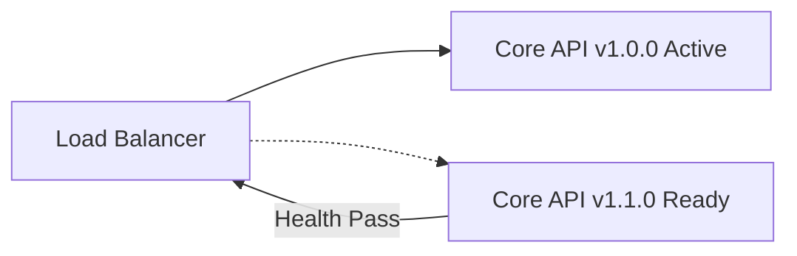

# Manual de Despliegue de la Core API

> **Navegación Bilingüe:** [English Version](./core-api-deployment.md)

Este manual de despliegue establece los estándares operativos, estrategias de lanzamiento y planes de rollback para el despliegue de la aplicación stateless en NestJS **Evolith Core API** y su MCP Gateway asociado.

---

## 1. Configuración y Validación Previa al Despliegue

Antes de desplegar la Core API, se debe validar la configuración para garantizar que todas las variables de entorno estén correctamente completadas y que las reglas estructurales estén activas.

### Esquema de Configuración (Validado por Zod)
La aplicación valida la configuración del entorno al inicio utilizando un esquema de Zod definido en `src/apps/core-api/src/infrastructure/config/env.validation.ts`. Las variables críticas son:

* `PORT`: El puerto de ejecución de la aplicación (por defecto `3000`).
* `CORE_PATH`: La ruta absoluta a los rulesets locales canónicos y archivos de topologías.
* `API_KEY`: La clave API utilizada para la autenticación básica de clientes.
* `JWT_SECRET`: Clave secreta para verificar tokens JWT.

### Comando de Verificación Previa (Pre-Flight Check)
Para ejecutar la validación de configuración localmente o en un paso de CI:
```bash
npm run build --workspace apps/core-api
```

---

## 2. Estrategia de Lanzamiento Sin Tiempo de Inactividad (Zero-Downtime)

La Core API es stateless (sin estado). Admite despliegues continuos para lograr lanzamientos sin tiempo de inactividad.



### Pasos:
1. **Preparar Nuevos Nodos:** Desplegar la nueva instancia de contenedor que contiene el nuevo build.
2. **Probes de Liveness y Readiness:** El balanceador de carga/orquestador realiza consultas a los endpoints de salud:
   - **Liveness:** `GET /api/v1/health`
   - **Readiness:** `GET /api/v1/health` (confirmando `status: "UP"`)
3. **Desviación de Tráfico:** Desviar el tráfico de forma incremental hacia las nuevas instancias solo después de que las pruebas de salud pasen.
4. **Retirar Nodos Antiguos:** Terminar las instancias de contenedor anteriores de forma ordenada (graceful).

---

## 3. Migraciones de Esquemas de Base de Datos (Si Aplica)

Aunque la Core API de referencia opera principalmente sobre rulesets en el sistema de archivos, cualquier adaptador de persistencia futuro debe seguir:
- **Patrón Expand/Contract:** Ejecutar migraciones en dos fases:
  1. Agregar columnas/tablas sin romper las versiones anteriores.
  2. Depreciar y eliminar columnas/tablas solo después de que todos los consumidores migren.
- **Validación Dry-run:** Probar siempre los scripts de migración contra una réplica de base de datos antes de realizar ejecuciones en producción.

---

## 4. Plan de Rollback (Reversión)

Si el despliegue activa alertas, errores o falla los health checks:

1. **Reversión Inmediata del Tráfico:** Apuntar el Balanceador de Carga / Ingress de regreso a la versión estable anterior.
2. **Limpieza de Estado y Caché:** Limpiar la memoria o los volúmenes temporales si se aplicaron cambios de versión de esquema.
3. **Investigar Logs:** Obtener trazas de correlación de stdout o dashboards de APM (OpenTelemetry) utilizando los IDs de transacción correspondientes.

---

[Volver al Índice de Productos](../../../../product/products/README.es.md)
