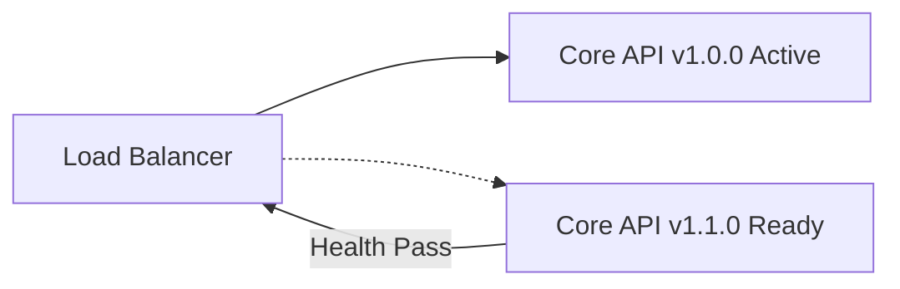

# Core API Deployment Playbook

> **Bilingual Navigation:** [Versión en Español](./core-api-deployment.es.md)

This playbook establishes the operational standards, roll-out strategies, and rollback runbooks for deploying the stateless NestJS **Evolith Core API** and its associated MCP Gateway.

---

## 1. Pre-Deployment Configuration & Validation

Before deploying the Core API, configuration must be validated to ensure all environment variables are correctly populated and structure rules are active.

### Configuration Schema (Zod-validated)
The application validates environment configuration at startup using a Zod schema defined in `apps/core-api/src/infrastructure/config/env.validation.ts`. The critical variables are:

* `PORT`: The target application execution port (default `3000`).
* `CORE_PATH`: The absolute path to the local canonical rulesets and topologies files.
* `API_KEY`: The API key used for basic client authentication.
* `JWT_SECRET`: Secret key for verifying JWT tokens.

### Pre-Flight Check Command
To run configuration validation locally or in a CI staging step:
```bash
npm run build --workspace apps/core-api
```

---

## 2. Zero-Downtime Rollout Strategy

The Core API is stateless. It supports rolling deployments to achieve zero-downtime releases.



### Steps:
1. **Prepare New Nodes:** Deploy the new container instance containing the new build.
2. **Liveness & Readiness Probes:** The load balancer/orchestrator queries the health endpoints:
   - **Liveness:** `GET /api/v1/health`
   - **Readiness:** `GET /api/v1/health` (asserting `status: "UP"`)
3. **Traffic Shift:** Shift traffic incrementally to the new instances only after health probes pass.
4. **Decommission Old Nodes:** Terminate the older container instances gracefully.

---

## 3. Database Schema Migrations (If Applicable)

Although the reference Core API operates primarily on filesystem rulesets, any future persistence adapters must follow:
- **Expand/Contract Pattern:** Run migrations in two phases:
  1. Add columns/tables without breaking old versions.
  2. Deprecate and drop columns/tables only after all consumers migrate.
- **Dry-run validation:** Always test migration scripts against a replica database before performing live executions.

---

## 4. Rollback Runbook

If the deployment triggers alerts, errors, or fails health checks:

1. **Immediate Traffic Reversion:** Point the Load Balancer / Ingress route back to the previous stable release.
2. **State & Cache Cleansing:** Clear memory or temporary volumes if schema version changes were applied.
3. **Investigate Logs:** Retrieve correlation traces from stdout or APM (OpenTelemetry) dashboards using the matching transaction IDs.

---

[Back to Products Index](../../../../product/products/README.md)
