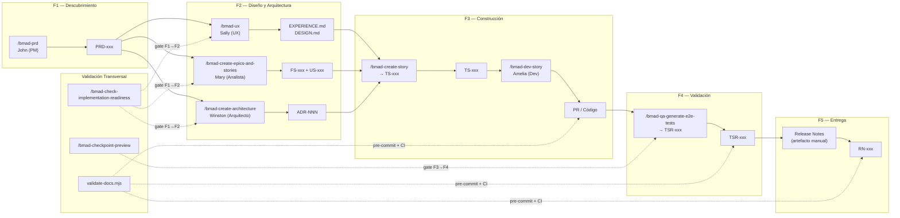

# Flujo Asistido por Agentes de IA

  
  
  

> **Audiencia:** Equipos de producto, arquitectos, desarrolladores, QA, PMs
> **Modo alternativo al manual:** Esta guía describe cómo ejecutar la cadena de trazabilidad SDLC completa mediante agentes de IA, como alternativa a la producción manual de artefactos.

---

## Propósito

Este documento describe cómo gestionar todo el flujo de artefactos del SDLC —desde el PRD hasta las Notas de Lanzamiento— utilizando agentes de IA que aplican el [método BMAD](https://docs.bmad-method.org/) v6.8.0 con herramientas como VS Code, Claude, OpenCode y Antigravity.

El modelo de trazabilidad puede ejecutarse en dos modos:

| Modo | Descripción |
| :--- | :---------- |
| **Manual** | Los artefactos se producen siguiendo las plantillas del [catálogo de plantillas](./04-artifact-templates/README.es.md). |
| **Asistido por agentes** | Los artefactos se generan, validan y encadenan mediante agentes de IA que aplican skills BMAD. **Este documento describe este modo.** |

---

## 1. Sobre el Método BMAD

[BMAD Method](https://docs.bmad-method.org/) v6.8.0 es la capa de planificación y orquestación con IA. Define 59 skills de agente que cubren todo el ciclo de vida del producto.

**Para empezar a usar BMAD:**

1. Abre el repositorio en VS Code con OpenCode.
2. Ejecuta `/bmad-help` — el agente analizará tu fase actual y recomendará el siguiente skill.
3. Sigue la secuencia de la [sección 3](#3-secuencia-paso-a-paso) invocando cada skill en orden.

**Mapeo de skills BMAD a la cadena de trazabilidad SDLC:**

| Cadena SDLC | Skill BMAD | Agente | ¿Qué produce? |
| :---------- | :--------- | :----- | :------------ |
| PRD → | `bmad-prd` | John (PM) | Documento de Requisitos de Producto |
| FS → | `bmad-create-epics-and-stories` | Mary (Analista) | Historias Funcionales |
| US → | `bmad-create-epics-and-stories` + `bmad-create-story` | Mary / Amelia | Historias de Usuario |
| ADR → | `bmad-create-architecture` | Winston (Arquitecto) | Architecture Decision Records |
| TS → | `bmad-create-story` | Amelia (Dev) | Historias Técnicas |
| PR → | `bmad-dev-story` | Amelia (Dev) | Código + Pull Request |
| TSR → | `bmad-qa-generate-e2e-tests` | Agente QA | Reporte Resumen de Pruebas |
| RN → | *(manual)* | Paige (Tech Writer) | Notas de Lanzamiento |

---

## 2. Visión General del Flujo

---

## 3. Secuencia Paso a Paso

| # | Artefacto | Agente / Skill | ¿Cómo se ejecuta? | ¿Por qué se realiza? | ¿Dónde? | Herramientas |
| :-: | :-------- | :------------- | :----------------- | :------------------- | :------- | :----------- |
| 1 | **PRD** | John (PM) — `/bmad-prd` | Se invoca el skill `bmad-prd` con la intención de producto. El agente John guía una conversación de descubrimiento y produce el archivo `PRD-<producto>-<NNN>.md` con la estructura canónica. | Congelar alcance antes de diseñar. Toda la cadena deriva de este artefacto. | VS Code — OpenCode — `docs/planning-artifacts/prd/` | OpenCode, Claude, skill `bmad-prd` |
| 2 | **EXPERIENCE + DESIGN** | Sally (UX) — `/bmad-ux` | Se invoca `bmad-ux` con el PRD como entrada. Sally produce los archivos de experiencia y diseño de UX, con flujos, prototipos y especificaciones. | Formalizar la experiencia de usuario antes de la arquitectura técnica. | VS Code — OpenCode — `docs/planning-artifacts/ux/` | OpenCode, Claude, skill `bmad-ux` |
| 3 | **ADR** | Winston (Arquitecto) — `/bmad-create-architecture` | Se invoca `bmad-create-architecture` con el PRD y los artefactos de UX como contexto. Winston guía la creación de decisiones arquitectónicas y produce los ADRs correspondientes. | Documentar decisiones técnicas que regirán la implementación. Los ADRs alimentan las TS. | VS Code — OpenCode — `reference/architecture/adrs/` | OpenCode, Claude, skill `bmad-create-architecture` |
| 4 | **FS + US** | Mary (Analista) — `/bmad-create-epics-and-stories` | Se invoca `bmad-create-epics-and-stories` con el PRD y los ADRs. Mary descompone el alcance en épicas, historias funcionales (FS) e historias de usuario (US), cada una con sus criterios de aceptación. | Descomponer el alcance en unidades atómicas verificables. Las FS y US son la entrada de las TS. | VS Code — OpenCode — `docs/planning-artifacts/stories/` | OpenCode, Claude, skill `bmad-create-epics-and-stories` |
| 5 | **TS** | Amelia (Dev) — `/bmad-create-story` | Por cada historia a implementar, se invoca `bmad-create-story` con la US y los ADRs aplicables. Amelia genera la historia técnica (TS) que detalla tareas, dependencias, riesgos y cobertura de pruebas. | Traducir el diseño funcional en trabajo técnico concreto. Cada TS declara su ADR padre. | VS Code — OpenCode — `docs/planning-artifacts/stories/` | OpenCode, Claude, skill `bmad-create-story` |
| 6 | **PR / Código** | Amelia (Dev) — `/bmad-dev-story` | Se invoca `bmad-dev-story` con el archivo de la TS. Amelia implementa el código, escribe pruebas, ejecuta linting y produce el Pull Request que referencia la TS. | Implementar la solución validada por la TS. El PR es la evidencia de que el código fue producido. | VS Code — OpenCode — repositorio de producto | OpenCode, Claude, skill `bmad-dev-story`, GitHub CLI |
| 7 | **TSR** | Agente QA — `/bmad-qa-generate-e2e-tests` | Se invoca `bmad-qa-generate-e2e-tests` con las TS implementadas. El agente genera pruebas E2E automatizadas y produce el Reporte Resumen de Pruebas (TSR) que lista explícitamente los identificadores TS cubiertos. | Evidenciar la calidad antes de sellar el release. El TSR sin TS listadas bloquea el gate RC Sellado. | VS Code — OpenCode — `docs/planning-artifacts/qa/` | OpenCode, Claude, skill `bmad-qa-generate-e2e-tests`, Playwright/Cypress |
| 8 | **RN** | Manual / Paige (Tech Writer) | Con el RC sellado, se producen las Notas de Lanzamiento (RN) siguiendo la plantilla correspondiente. La RN referencia el TSR que validó el release. | Comunicar cambios, limitaciones y dependencias de la versión a stakeholders. | VS Code — OpenCode — `docs/releases/` | OpenCode, skill `bmad-agent-tech-writer` |

---

## 4. Glosario de Herramientas

| Herramienta | Rol en el flujo |
| :---------- | :-------------- |
| **VS Code** | Editor principal donde se crean y modifican los artefactos. |
| **OpenCode** | Runner de agentes que ejecuta las skills BMAD. Ejecuta `/bmad-help` para comenzar. |
| **BMAD Method** | Framework de planificación y orquestación con IA. |
| **Claude** | Motor de IA que potencia los agentes BMAD. |
| **Antigravity** | Extensión VS Code que integra agentes de IA en el editor. |
| **GitHub Actions** | Ejecuta `validate-docs.mjs` en cada PR para bloquear cadenas incompletas. |

---

  <strong>© Beyondnet Tech</strong> · www.beyondnet.info 
  Última revisión: 2026-06-11

