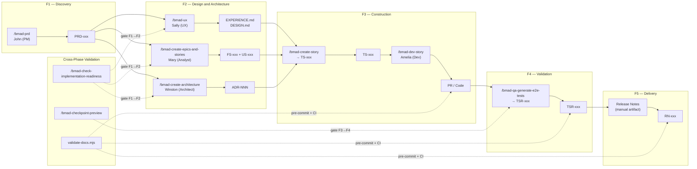

# AI-Assisted Flow

  
  
  

> **Audience:** Product teams, architects, developers, QA, PMs
> **Alternative to Manual Mode:** This guide describes how to execute the entire SDLC traceability chain using AI agents, as an alternative to manual artifact production.

---

## Purpose

This document describes how to manage the entire flow of SDLC artifacts — from the PRD to Release Notes — using AI agents that apply the [BMAD Method](https://docs.bmad-method.org/) v6.8.0 with tools like VS Code, Claude, OpenCode, and Antigravity.

The traceability model can be executed in two modes:

| Mode | Description |
| :--- | :---------- |
| **Manual** | Artifacts are produced following the templates in the [Artifact Templates Catalog](./04-artifact-templates/README.md). |
| **Agent-Assisted** | Artifacts are generated, validated, and chained by AI agents applying BMAD skills. **This document describes this mode.** |

---

## 1. About the BMAD Method

[BMAD Method](https://docs.bmad-method.org/) v6.8.0 is the AI planning and orchestration layer. It defines 59 agent skills that cover the entire product lifecycle. 

**To start using BMAD:**

1. Open the repository in VS Code with OpenCode.
2. Run `/bmad-help` — the agent will analyze your current phase and recommend the next skill.
3. Follow the sequence in [Section 3](#3-step-by-step-sequence) by invoking each skill in order.

**Mapping BMAD skills to the SDLC traceability chain:**

| SDLC Chain | BMAD Skill | Agent | What does it produce? |
| :--------- | :--------- | :---- | :-------------------- |
| PRD → | `bmad-prd` | John (PM) | Product Requirements Document |
| FS → | `bmad-create-epics-and-stories` | Mary (Analyst) | Functional Stories |
| US → | `bmad-create-epics-and-stories` + `bmad-create-story` | Mary / Amelia | User Stories |
| ADR → | `bmad-create-architecture` | Winston (Architect) | Architecture Decision Records |
| TS → | `bmad-create-story` | Amelia (Dev) | Technical Stories |
| PR → | `bmad-dev-story` | Amelia (Dev) | Code + Pull Request |
| TSR → | `bmad-qa-generate-e2e-tests` | QA Agent | Test Summary Report |
| RN → | *(manual)* | Paige (Tech Writer) | Release Notes |

---

## 2. Flow Overview

---

## 3. Step-by-Step Sequence

| # | Artifact | Agent / Skill | How is it executed? | Why is it done? | Where? | Tools |
| :-: | :------- | :------------ | :------------------ | :-------------- | :----- | :---- |
| 1 | **PRD** | John (PM) — `/bmad-prd` | Invoke the `bmad-prd` skill with the product intent. Agent John guides a discovery conversation and produces the `PRD-<product>-<NNN>.md` file with canonical structure. | Freeze scope before designing. The whole chain derives from this artifact. | VS Code — OpenCode — `docs/planning-artifacts/prd/` | OpenCode, Claude, skill `bmad-prd` |
| 2 | **EXPERIENCE + DESIGN** | Sally (UX) — `/bmad-ux` | Invoke `bmad-ux` with the PRD as input. Sally produces UX experience and design files, with flows, prototypes, and specifications. | Formalize the user experience before technical architecture. | VS Code — OpenCode — `docs/planning-artifacts/ux/` | OpenCode, Claude, skill `bmad-ux` |
| 3 | **ADR** | Winston (Architect) — `/bmad-create-architecture` | Invoke `bmad-create-architecture` with the PRD and UX artifacts as context. Winston guides the creation of architectural decisions and produces the corresponding ADRs. | Document technical decisions that will govern the implementation. ADRs feed TS. | VS Code — OpenCode — `reference/architecture/adrs/` | OpenCode, Claude, skill `bmad-create-architecture` |
| 4 | **FS + US** | Mary (Analyst) — `/bmad-create-epics-and-stories` | Invoke `bmad-create-epics-and-stories` with the PRD and ADRs. Mary decomposes the scope into epics, functional stories (FS), and user stories (US), each with acceptance criteria. | Break down scope into verifiable atomic units. FS and US are the input for TS. | VS Code — OpenCode — `docs/planning-artifacts/stories/` | OpenCode, Claude, skill `bmad-create-epics-and-stories` |
| 5 | **TS** | Amelia (Dev) — `/bmad-create-story` | For each story to implement, invoke `bmad-create-story` with the US and applicable ADRs. Amelia generates the technical story (TS) detailing tasks, dependencies, risks, and test coverage. | Translate functional design into concrete technical work. Each TS declares its parent ADR. | VS Code — OpenCode — `docs/planning-artifacts/stories/` | OpenCode, Claude, skill `bmad-create-story` |
| 6 | **PR / Code** | Amelia (Dev) — `/bmad-dev-story` | Invoke `bmad-dev-story` with the TS file. Amelia implements the code, writes tests, runs linting, and produces the Pull Request referencing the TS. | Implement the solution validated by the TS. The PR is evidence the code was produced. | VS Code — OpenCode — product repo | OpenCode, Claude, skill `bmad-dev-story`, GitHub CLI |
| 7 | **TSR** | QA Agent — `/bmad-qa-generate-e2e-tests` | Invoke `bmad-qa-generate-e2e-tests` with implemented TS. The agent generates automated E2E tests and produces the Test Summary Report (TSR) listing covered TS IDs. | Evidence quality before sealing the release. A TSR without TS lists blocks the RC Sealed gate. | VS Code — OpenCode — `docs/planning-artifacts/qa/` | OpenCode, Claude, skill `bmad-qa-generate-e2e-tests`, Playwright/Cypress |
| 8 | **RN** | Manual / Paige (Tech Writer) | With the sealed RC, produce Release Notes (RN) following the template. The RN references the TSR validating the release. | Communicate version changes, limitations, and dependencies. | VS Code — OpenCode — `docs/releases/` | OpenCode, skill `bmad-agent-tech-writer` |

---

## 4. Tool Glossary

| Tool | Role in Flow |
| :--- | :----------- |
| **VS Code** | Primary editor where artifacts are created and modified. |
| **OpenCode** | Agent runner executing BMAD skills in repo context. Run `/bmad-help` to start. |
| **BMAD Method** | AI planning and orchestration framework. |
| **Claude** | AI engine powering BMAD agents. |
| **Antigravity** | VS Code extension integrating AI agents into the editor for contextual edits. |
| **GitHub Actions** | Runs `validate-docs.mjs` on every PR to block incomplete chains. |

---

  <strong>© Beyondnet Tech</strong> · www.beyondnet.info 
  Last revision: 2026-06-11

