# Modelo de Trazabilidad SDLC y Evidence Graph

> **Navegación bilingüe:** [English version](./traceability-model.md)  
> **Owner:** Evolith Architecture Board  
> **Estado:** Diseño Propuesto — Pendiente de Revisión del Architecture Board  
> **Padre:** [Centro de Gobernanza SDLC Corporativa](./README.es.md)  
> **Diseño Objetivo:** [Diseño Objetivo de Composición Gobernada](../standards/vision/evolith-governed-composition-target-design.es.md)

---

## 1. Propósito

Este documento define cómo Evolith traza intención de negocio, decisiones de producto, actividad de proveedores, ejecución humana y agéntica, evaluaciones técnicas, decisiones de gates y evidencia productiva.

La trazabilidad no es solo una cadena lineal de documentos. Es un **Evidence Graph** gobernado cuyos nodos preservan identidad de origen, contexto del tenant, integridad, versión de políticas e historial canónico de decisiones.

---

## 2. Preguntas de Trazabilidad

Todo cambio productivo debe responder:

1. ¿Por qué se financió?
2. ¿Qué cliente, problema, objetivo y supuesto lo justificaron?
3. ¿La capacidad se construyó, adoptó, embebió, integró, extendió o rechazó?
4. ¿Qué decisiones de producto y arquitectura lo gobernaron?
5. ¿Qué humanos, agentes, herramientas y proveedores participaron?
6. ¿Qué reglas, prompts, skills, modelos y versiones se utilizaron?
7. ¿Qué evidencia demuestra construcción, pruebas, seguridad y liberación?
8. ¿Qué evaluaciones técnicas se produjeron?
9. ¿Quién aprobó excepciones o riesgo residual?
10. ¿Qué Gate Decision del Tracker autorizó producción?

Si falta una respuesta obligatoria, el cambio no es completamente trazable.

---

## 3. Evidence Graph

```mermaid
flowchart LR
    PROBLEM["Problema y Evidencia del Cliente"]
    ASSUMPTIONS["Registro de Supuestos"]
    DISPOSITION["Disposición de Capacidad\nAdoptar · Embeber · Integrar · Extender · Construir · Rechazar"]
    PRD["PRD e Intención de Negocio"]
    FS["Historia Funcional"]
    ADR["ADR / Decisión de Producto"]
    TS["Historia Técnica"]
    WORK["Work Item Externo o Nativo"]
    CODE["Commit / Pull Request"]
    AGENT["Agent Run\nModelo · Prompt · Skill · Tool Calls"]
    CI["Evidencia de Pipeline / Pruebas / Seguridad"]
    OBS["Trace / Costo / Latencia / Runtime"]
    RELEASE["Evidencia de Release y Despliegue"]
    EVAL["Technical Evaluation Results"]
    APPROVAL["Aprobaciones y Excepciones"]
    DECISION["Gate Decision Canónica del Tracker"]
    TRANSITION["Phase Transition Autorizada"]

    PROBLEM --> ASSUMPTIONS --> DISPOSITION --> PRD
    PRD --> FS
    FS --> ADR
    FS --> TS
    ADR --> TS
    TS --> WORK
    WORK --> CODE
    AGENT --> WORK
    AGENT --> CODE
    CODE --> CI
    CI --> OBS
    OBS --> RELEASE

    PRD --> EVAL
    ADR --> EVAL
    CODE --> EVAL
    AGENT --> EVAL
    CI --> EVAL
    OBS --> EVAL
    RELEASE --> EVAL

    EVAL --> DECISION
    APPROVAL --> DECISION
    DECISION --> TRANSITION
```



El grafo puede ramificarse, agregarse y referenciar sistemas externos. Evolith no duplica cada payload del proveedor; conserva referencias canónicas, metadata de integridad, hechos normalizados y relaciones de decisión.

---

## 4. Tipos de Nodos Canónicos

| Nodo | Propósito | Fuente Autoritativa |
|---|---|---|
| **Intención de Negocio** | Problema, cliente, objetivo, KPI y valor esperado | Artefacto Evolith aprobado |
| **Supuesto** | Creencia falsable, confianza y plan de validación | Evolith Tracker |
| **Disposición de Capacidad** | Decisión build-versus-compose y alternativas | Registro de decisión del Tracker |
| **Artifact Reference** | PRD, historia, ADR, contrato, informe o release | Repositorio o proveedor documental |
| **Work Reference** | Tarea externa o nativa y estado operativo | Proveedor de gestión de trabajo |
| **Execution Reference** | Agent run, pipeline, prueba, scan o deployment | Proveedor de ejecución |
| **Evidence Item** | Prueba canónica con linaje e integridad | Evolith Evidence Graph |
| **Technical Evaluation** | Evaluación determinista contra reglas | CLI, MCP, CI o evaluador especializado |
| **Approval** | Autorización humana responsable | Evolith Tracker |
| **Exception** | Riesgo residual, expiración y mitigación | Evolith Tracker |
| **Gate Decision** | Resultado canónico de gobernanza | Evolith Tracker |
| **Phase Transition** | Cambio de estado autorizado | Evolith Tracker |

---

## 5. Metadata Mínima de Evidencia

Toda evidencia aceptada incluye:

- identificador estable;
- tenant, producto, proceso, fase, gate y criterio;
- tipo de evidencia y versión de schema;
- conexión de proveedor e identificador externo;
- URL de origen cuando exista;
- productor humano, agente, CI o sistema;
- versiones de modelo, prompt y skill cuando aplique;
- referencias a artefacto, commit, PR, pipeline, prueba, trace, deployment o documento;
- timestamp de captura y hash de contenido;
- clasificación de datos y política de retención;
- duración, costo, latencia o tokens cuando aplique;
- evaluaciones técnicas relacionadas;
- aprobaciones, excepciones y Gate Decision final.

---

## 6. Regla de Abstracción de Proveedores

La trazabilidad se basa en capacidades, no en vendors.

```text
Tipo Canónico de Evidencia
        -> Provider Port
            -> Plugin / Adapter / Connector
                -> Proveedor Actual
```

Reemplazar Jira, Langfuse, Superset, GitHub, Claude, un framework de pruebas o cualquier otro proveedor no debe romper la trazabilidad. La evidencia histórica permanece legible mediante identificadores Evolith estables y snapshots del proveedor.

---

## 7. Evaluación, Decisión y Transición

| Objeto | Estados | Autoridad |
|---|---|---|
| **Technical Evaluation Result** | `compliant`, `non_compliant`, `indeterminate`, `error` | Evaluador stateless |
| **Gate Decision** | `approved`, `rejected`, `blocked`, `approved_with_exception` | Evolith Tracker |
| **Phase Transition** | `requested`, `authorized`, `executed`, `failed`, `cancelled` | Evolith Tracker |

Una evaluación técnica nunca cambia el estado de fase. Un evento de proveedor nunca cambia el estado de fase. Solo una Gate Decision autorizada puede habilitar una Phase Transition.

---

## 8. Cadena Mínima Comprobable

```text
Problema
  -> Registro de Supuestos
  -> Disposición de Capacidad
  -> PRD
  -> Historia Funcional
  -> ADR / Decisión de Producto
  -> Historia Técnica o Work Item Mapeado
  -> Código / Agente / Ejecución de Proveedor
  -> Evidencia de Pruebas y Seguridad
  -> Evidencia de Release
  -> Evaluaciones Técnicas
  -> Aprobación o Excepción
  -> Gate Decision
  -> Phase Transition
```

Un ADR es obligatorio cuando el trabajo introduce o cambia límites arquitectónicos, semántica de contratos de proveedores, seguridad, multi-tenancy, persistencia, contratos API, topología de despliegue u observabilidad, estructura canónica de evidencia o una excepción a un estándar Evolith.

---

## 9. Bloque de Trazabilidad en Pull Request

```markdown
## Trazabilidad Evolith

- Producto / Proceso: [IDs]
- Historia Funcional: [ID y enlace]
- Historia Técnica o Work Item: [ID y proveedor]
- ADRs / Decisiones Gobernantes: [IDs]
- Disposición de Capacidad: [Construir / Integrar / ...]
- Provider Connections: [Tipo e IDs estables]
- Evidence Items: [IDs estables]
- Evidencia de Pruebas / Seguridad: [IDs]
- Delta Documental: [Link o N/A con razón]
```

Los identificadores nativos del proveedor pueden incluirse, pero las referencias estables Evolith son obligatorias.

---

## 10. Checklist de Gate Review

| Gate | Confirmación Requerida |
|---|---|
| **Business Sign-Off** | Problema, cliente, supuestos, ROI/KPIs, alternativas y disposición aprobados |
| **Design Baseline** | Intención funcional, ADRs, contratos, abstracciones, plan de evidencia y seguridad completos |
| **Successful Build** | Código o capacidad integrada mapea a trabajo aprobado, CI, documentación, drift y linaje |
| **RC Stamped** | Evidencia de pruebas, seguridad, contratos, agentes y excepciones satisface umbrales |
| **Production Live** | Release, observabilidad, rollback, deployment y riesgo residual completos |

---

## 11. Anti-Patrones

| Anti-Patrón | Riesgo |
|---|---|
| IDs de vendors como identidad canónica | El reemplazo rompe trazabilidad |
| Output de agente aceptado sin validación | El contenido generado se vuelve autoridad no auditada |
| Evaluador técnico aprueba directamente un gate | Se evade la autoridad canónica |
| Payload crudo persistido como dominio | El schema del proveedor contamina Evolith |
| Construcción sin análisis de alternativas | Evolith recrea capacidades commodity |
| Remover plugin destruye evidencia histórica | Auditoría y compliance quedan inválidos |
| Release sin Gate Decision enlazada | Producción no puede demostrarse autorizada |

---

## 12. Documentos Relacionados

- [Diseño Objetivo de Composición Gobernada](../standards/vision/evolith-governed-composition-target-design.es.md)
- [Modelo de Abstracción de Proveedores y Plugins](../standards/vision/evolith-provider-abstraction-plugin-model.es.md)
- [Diseño Técnico del Tracker](../standards/vision/sdlc-tracker-technical-interfaces.es.md)
- [Hub de Plantillas de Artefactos](./04-artifact-templates/README.es.md)
- [Matriz de Responsabilidades](./responsibility-matrix.es.md)
- [Quality Gates](./quality-gates.es.md)

---

*Este modelo es una baseline de diseño. Rulesets, schemas y código no deben cambiar hasta que el Architecture Board apruebe el nuevo paquete de diseño.*