# SDLC Traceability and Evidence Graph Model

> **Bilingual navigation:** [Versión en Español](./traceability-model.es.md)  
> **Owner:** Evolith Architecture Board  
> **Status:** Proposed Design — Pending Architecture Board Review  
> **Parent:** [Corporate SDLC Governance Center](./README.md)  
> **Target Design:** [Governed Composition Target Design](../foundations/common-rules/evolith-governed-composition-target-design.md)

---

## 1. Purpose

This document defines how Evolith traces business intent, product decisions, provider activity, human and agent execution, technical evaluations, gate decisions, and production evidence.

Traceability is not a linear document chain only. It is a governed **Evidence Graph** whose nodes preserve source identity, tenant context, integrity, policy version, and canonical decision history.

---

## 2. Traceability Questions

Every production change must answer:

1. Why was the change funded?
2. Which customer, problem, objective, and assumption justified it?
3. Was the capability built, adopted, embedded, integrated, extended, or rejected?
4. Which architecture and product decisions governed it?
5. Which humans, agents, tools, and providers participated?
6. Which rules, prompts, skills, models, and versions were used?
7. What evidence proves it was built, tested, secured, and released safely?
8. Which technical evaluations were produced?
9. Who approved exceptions or residual risk?
10. Which Tracker Gate Decision authorized production?

If any mandatory answer is unavailable, the change is not fully traceable.

---

## 3. Evidence Graph

```mermaid
flowchart LR
    PROBLEM["Problem and Customer Evidence"]
    ASSUMPTIONS["Assumption Register"]
    DISPOSITION["Capability Disposition\nAdopt · Embed · Integrate · Extend · Build · Reject"]
    PRD["PRD and Business Intent"]
    FS["Functional Story"]
    ADR["ADR / Product Decision"]
    TS["Technical Story"]
    WORK["External or Native Work Item"]
    CODE["Commit / Pull Request"]
    AGENT["Agent Run\nModel · Prompt · Skill · Tool Calls"]
    CI["Pipeline / Test / Security Evidence"]
    OBS["Trace / Cost / Latency / Runtime Evidence"]
    RELEASE["Release and Deployment Evidence"]
    EVAL["Technical Evaluation Results"]
    APPROVAL["Approvals and Exceptions"]
    DECISION["Canonical Tracker Gate Decision"]
    TRANSITION["Authorized Phase Transition"]

    PROBLEM --> ASSUMPTIONS --> DISPOSITION --> PRD
    PRD --> FS
    FS --> ADR
    FS --> TS
    ADR --> TS
    TS --> WORK
    WORK --> CODE
    AGENT --> WORK
    AGENT --> CODE
    CODE --> CI
    CI --> OBS
    OBS --> RELEASE

    PRD --> EVAL
    ADR --> EVAL
    CODE --> EVAL
    AGENT --> EVAL
    CI --> EVAL
    OBS --> EVAL
    RELEASE --> EVAL

    EVAL --> DECISION
    APPROVAL --> DECISION
    DECISION --> TRANSITION
```



The graph may branch, aggregate, and reference external systems. Evolith does not duplicate every provider payload; it stores canonical references, integrity metadata, normalized facts, and decision relationships.

---

## 4. Canonical Node Types

| Node | Purpose | Authoritative Source |
|---|---|---|
| **Business Intent** | Problem, customer, objective, KPI and expected value | Approved Evolith artifact |
| **Assumption** | Falsifiable belief, confidence and validation plan | Evolith Tracker |
| **Capability Disposition** | Build-versus-compose decision and alternatives | Evolith Tracker decision record |
| **Artifact Reference** | PRD, story, ADR, contract, report or release document | Source repository or document provider |
| **Work Reference** | External or native task and operational status | Connected work-management provider |
| **Execution Reference** | Agent run, pipeline, test, scan or deployment | Connected execution provider |
| **Evidence Item** | Canonical proof with source lineage and integrity | Evolith Evidence Graph |
| **Technical Evaluation** | Deterministic assessment against rules | CLI, MCP, CI or specialized evaluator |
| **Approval** | Accountable human authorization | Evolith Tracker |
| **Exception** | Accepted residual risk, expiry and mitigation | Evolith Tracker |
| **Gate Decision** | Canonical governance outcome | Evolith Tracker |
| **Phase Transition** | Authorized state change | Evolith Tracker |

---

## 5. Minimum Evidence Metadata

Every accepted evidence item includes:

- stable evidence identifier;
- tenant, product, process, phase, gate and criterion references;
- evidence type and schema version;
- provider connection and external identifier;
- source URL when available;
- producer identity: human, agent, CI or system;
- model, prompt and skill versions when applicable;
- artifact, commit, pull request, pipeline, test, trace, deployment or document references;
- capture timestamp and content hash;
- data classification and retention policy;
- duration, cost, latency or token usage when applicable;
- related technical evaluations;
- approval, exception and final Gate Decision references.

---

## 6. Provider Abstraction Rule

Traceability is capability-based, not vendor-based.

```text
Canonical Evidence Type
        -> Provider Port
            -> Plugin / Adapter / Connector
                -> Current Provider
```

Replacing Jira, Langfuse, Superset, GitHub, Claude, a test framework, or any other provider must not break canonical traceability. Historical evidence remains readable through stable Evolith identifiers and provider snapshots.

---

## 7. Evaluation, Decision, and Transition

| Object | Status Vocabulary | Authority |
|---|---|---|
| **Technical Evaluation Result** | `compliant`, `non_compliant`, `indeterminate`, `error` | Stateless evaluator |
| **Gate Decision** | `approved`, `rejected`, `blocked`, `approved_with_exception` | Evolith Tracker |
| **Phase Transition** | `requested`, `authorized`, `executed`, `failed`, `cancelled` | Evolith Tracker |

A technical evaluation never changes phase state. A provider event never changes phase state. Only an authorized Gate Decision may authorize a Phase Transition.

---

## 8. Minimum Provable Chain

For the first vertical product slice, the minimum navigable chain is:

```text
Problem
  -> Assumption Register
  -> Capability Disposition
  -> PRD
  -> Functional Story
  -> ADR / Product Decision
  -> Technical Story or Mapped Work Item
  -> Code / Agent / Provider Execution
  -> Test and Security Evidence
  -> Release Evidence
  -> Technical Evaluations
  -> Approval or Exception
  -> Gate Decision
  -> Phase Transition
```

An ADR is mandatory whenever the work introduces or changes architecture boundaries, provider-contract semantics, security, multi-tenancy, persistence, API contracts, deployment topology, observability topology, canonical evidence structure, or an exception to an Evolith standard.

---

## 9. Pull Request Traceability Block

```markdown
## Evolith Traceability

- Product / Process: [IDs]
- Functional Story: [ID and link]
- Technical Story or Work Item: [ID and provider]
- Governing ADRs / Decisions: [IDs]
- Capability Disposition: [Build / Integrate / ...]
- Provider Connections: [Provider type and stable connection IDs]
- Evidence Items: [Stable evidence IDs]
- Test / Security Evidence: [IDs]
- Documentation Delta: [Link or N/A with reason]
```

Provider-native identifiers may be included, but stable Evolith references are mandatory.

---

## 10. Gate Review Checklist

| Gate | Reviewer Must Confirm |
|---|---|
| **Business Sign-Off** | Problem, customer, assumptions, ROI/KPIs, capability alternatives and disposition are approved |
| **Design Baseline** | Functional intent, ADRs, contracts, provider abstractions, evidence plan and security constraints are complete |
| **Successful Build** | Code or integrated capability maps to approved work, CI evidence, documentation, drift and provider lineage |
| **RC Stamped** | Test, security, contract, agent and exception evidence satisfy approved thresholds |
| **Production Live** | Release, observability, rollback, deployment and residual-risk approval are complete |

---

## 11. Anti-Patterns

| Anti-Pattern | Risk |
|---|---|
| Vendor IDs used as canonical identities | Provider replacement breaks traceability |
| Agent output accepted without evidence validation | Generated content becomes unaudited authority |
| Technical evaluator directly approves a gate | Canonical decision authority is bypassed |
| Raw provider payload persisted as domain state | Vendor schema contaminates Evolith bounded contexts |
| Build decision without alternative analysis | Evolith recreates mature commodity products |
| Plugin removal destroys historical evidence | Audit and compliance history becomes invalid |
| Release evidence without linked Gate Decision | Production cannot be proven as authorized |

---

## 12. Related Documents

- [Governed Composition Target Design](../foundations/common-rules/evolith-governed-composition-target-design.md)
- [Provider Abstraction and Plugin Model](../foundations/principles/evolith-provider-abstraction-plugin-model.md)
- [Tracker Technical Interface Design](./sdlc-tracker-technical-interfaces.md)
- [Artifact Templates Hub](./04-artifact-templates/README.md)
- [Responsibility Matrix](./responsibility-matrix.md)
- [Quality Gates](./quality-gates.md)

---

*This model is a design baseline. Rulesets, schemas, and code must not be changed until the Architecture Board approves the new design package.*