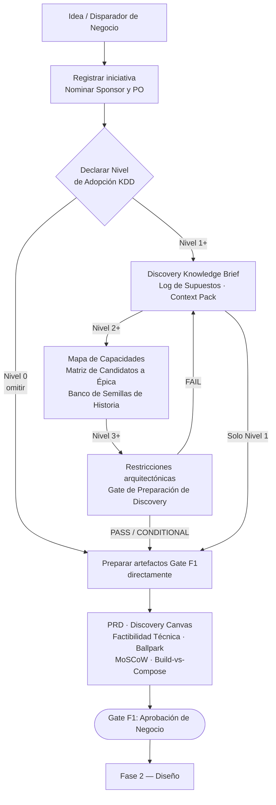

# Centro de Gobernanza SDLC Corporativa

> **Navegación bilingüe:** [English Version](./README.md)

Este centro es el hub de gobernanza autorizado del Ciclo de Vida de Desarrollo de Software dentro de Evolith. Define requisitos procedimentales, gates de fase, formatos de artefactos, gates de calidad, asignaciones de responsabilidad, expectativas de trazabilidad y la cadena mínima de artefactos para MVPs pequeños y programas empresariales escalados.

## Meta y Objetivos

> **Meta:** gobernar el ciclo de vida de desarrollo completo mediante cinco fases con gates explícitos y evidencia verificable, desde la concepción hasta producción.

**Objetivos:**

- Hacer que cada transición de fase dependa de evidencia versionada, un responsable accountable y un criterio objetivo.
- Estandarizar cada artefacto mediante plantillas canónicas y estándares de escritura.
- Mantener requerimientos, historias, pruebas y releases trazables de extremo a extremo.

---

## Vista Ejecutiva para Directores de Tecnología

Para Directores de Tecnología, el SDLC de Evolith no es un proceso documental, sino un sistema de control de delivery.

Su propósito es asegurar que el trabajo financiado sea trazable, que el riesgo arquitectónico se resuelva antes de construir, que los gates de calidad sean objetivos y que la preparación operativa esté probada antes de ir a producción.

| Documento | Descripción | Objetivo / Meta | Tipo | Obligatorio |
|---|---|---|---|---|
| [Vista Ejecutiva SDLC](./executive-view.es.md) | Modelo operativo a nivel directivo para inversión, riesgo, gates y readiness | Entender los puntos de control directivos | Referencia | Sí |
| [Gates de Calidad SDLC](./quality-gates.es.md) | Umbrales canónicos de calidad y política de waivers | Validar criterios objetivos de bloqueo de release | Estándar | Sí |
| [Matriz de Responsabilidades SDLC](./responsibility-matrix.es.md) | Expectativas de accountability y evidencia por gate | Confirmar quién decide cada gate | Estándar | Sí |
| [Modelo de Trazabilidad SDLC](./traceability-model.es.md) | Cadena de evidencia de extremo a extremo desde el PRD hasta producción | Trazar la intención de negocio hasta la evidencia operativa | Estándar | Sí |
| [Mapeo SDLC–Artefactos Evolith](./sdlc-evolith-artifact-mapping.es.md) | Artefactos requeridos y opcionales por fase | Revisar el alcance de artefactos por fase | Referencia | No |
| [Hub de Plantillas de Artefactos](./04-artifact-templates/README.es.md) | Índice de todas las plantillas oficiales de artefactos | Empezar a crear artefactos SDLC oficiales | Hub de área | Sí |

### Regla Operativa Directiva

Ninguna fase del ciclo de vida debe avanzar solo por acuerdo verbal. Cada gate requiere evidencia versionada, responsable accountable y criterio objetivo de aprobación.

---

## Centro de Descargas — Materiales Ejecutivos SDLC

> [!IMPORTANT]
> **Empieza aquí para briefings ejecutivos y workshops con clientes.** Estas presentaciones son el paquete oficial vigente para alinear valor ejecutivo, demostrar la aplicación real del caso UMS y guía operativa para líderes técnicos.
>
> Usa los enlaces siguientes para descargar los archivos directamente.

### Kit de Comunicación Ejecutiva (Presentaciones)

| Documento | Descripción | Objetivo / Meta | Tipo | Obligatorio |
|---|---|---|---|---|
| [Evolith: Propuesta de Valor Ejecutiva](https://github.com/beyondnetcode/evolith_arch32/raw/main/reference/core/sdlc/assets/evolith_value_proposition_executive.pptx) | Presentación ejecutiva del valor estratégico, impacto de gobernanza y ROI | Alinear al liderazgo tecnológico | Presentación (PPTX) | No |
| [Evolith: Caso Práctico UMS](https://github.com/beyondnetcode/evolith_arch32/raw/main/reference/core/sdlc/assets/evolith_ums_practical_case.pptx) | Caso de éxito de una transformación real de monolito modular a microservicios | Demostrar el caso aplicado | Presentación (PPTX) | No |
| [Evolith: Deep-Dive Técnico SDLC](https://github.com/beyondnetcode/evolith_arch32/raw/main/reference/core/sdlc/assets/evolith_sdlc_technical_deep_dive.pptx) | Guía operativa de ingeniería sobre fases, Quality Gates y artefactos | Guiar la operación técnica | Presentación (PPTX) | No |

### Workbook de Implementación

| Documento | Descripción | Objetivo / Meta | Tipo | Obligatorio |
|---|---|---|---|---|
| [Workbook de Implementación SDLC Evolith F0](https://github.com/beyondnetcode/evolith_arch32/raw/main/reference/core/sdlc/assets/evolith_sdlc_implementation_workbook_F0.xlsx) | Workbook integrado para todas las fases SDLC: plantillas, registros de roles, matrices de trazabilidad y dashboards de orquestación | Facilitar mesas de trabajo con equipos cliente | Workbook (XLSX) | No |

> El workbook está diseñado para mesas de trabajo facilitadas con equipos cliente. Las presentaciones están diseñadas para alineamiento ejecutivo, caso aplicado UMS y guía operativa para líderes técnicos.

---

## Modelo Operativo SDLC

```mermaid
flowchart LR
    classDef phase fill:#1e3a5f,stroke:#3b82f6,color:#fff,font-weight:bold
    classDef gate fill:#4a3800,stroke:#f59e0b,color:#fff,font-size:12px

    P1["Fase 1<br/>Concepción"]:::phase
    P2["Fase 2<br/>Diseño"]:::phase
    P3["Fase 3<br/>Construcción"]:::phase
    P4["Fase 4<br/>Validación"]:::phase
    P5["Fase 5<br/>Entrega"]:::phase
    G1(["Aprobación<br/>de Negocio"]):::gate
    G2(["Baseline<br/>de Diseño"]):::gate
    G3(["Build<br/>Exitoso"]):::gate
    G4(["RC<br/>Sellado"]):::gate
    G5(["Producción<br/>Activa"]):::gate

    P1 --> G1 --> P2 --> G2 --> P3 --> G3 --> P4 --> G4 --> P5 --> G5
```



---

## Gobernanza Mínima Viable

Para MVPs pequeños, la cadena mínima obligatoria de artefactos es:

```text
PRD -> Historia Funcional -> Historia Técnica -> Test Summary Report -> Release Notes
```

Un ADR es obligatorio cuando el trabajo introduce o cambia límites arquitectónicos, selección tecnológica, modelo de seguridad, modelo de multi-tenancy, estrategia de persistencia, estrategia de contrato de API, topología de despliegue, instrumentación de observabilidad o lógica de integración transversal.

La matriz completa de cumplimiento aplica cuando el producto alcanza escala, ambientes regulados, multi-tenancy, APIs públicas, flujos críticos o dependencias entre equipos.

---

## Fase 01 — Concepción y Descubrimiento

> **Objetivo:** Establecer un entendimiento compartido de lo que debe lograr el producto y por qué antes de que comience cualquier diseño. Las salidas de esta fase autorizan la entrada al trabajo de arquitectura y diseño.
> **Gate de salida:** Aprobación de Negocio
> **Audiencia principal:** Product Owner, Sponsor Ejecutivo, Arquitecto de Software

Definición de alcance, perfiles de usuario, mapeo de OKRs y alineación de restricciones arquitectónicas.

| Documento | Descripción | Objetivo / Meta | Tipo | Obligatorio |
|---|---|---|---|---|
| [PRD — Documento de Requisitos de Producto](./04-artifact-templates/prd-template.es.md) | Captura el alcance completo del producto: personas, OKRs de negocio, límites funcionales, restricciones y requisitos no funcionales | Autorizar la entrada a diseño | Plantilla | Sí |
| [Playbook Fase 1 — Aprobación de Negocio](./01-playbooks/phase-1-business-signoff.es.md) | Runbook operativo del gate Business Sign-Off: checklist de evidencia, procedimiento de revisión, criterios de bloqueo | Operacionalizar el gate | Playbook | Sí |
| [Mapeo SDLC–Artefactos — Fase 1](./sdlc-evolith-artifact-mapping.es.md#2-fase-1-concepción-y-descubrimiento) | Lista qué artefactos Evolith son Requeridos u Opcionales en la Fase 1 | Validar la completitud del gate | Referencia | No |

### Subfase 01.1 — Knowledge-First Discovery / KDD Readiness

> **Opcional, progresiva, nativa de Evolith.** Captura el conocimiento mínimo suficiente antes de crear épicas, historias o backlog. Inspirada en principios de Knowledge Driven Development (KDD) pero sin dependencia de herramientas externas.
> **Cuándo aplicar:** Productos nuevos (Nivel 2-3), sistemas regulados (Nivel 3-4), modernización de legacy (Nivel 3), o cualquier iniciativa donde las brechas de conocimiento causan retrabajo.
> **Cuándo omitir:** Correcciones pequeñas, cambios triviales, o iniciativas con dominio bien entendido (Nivel 0).

**Niveles de Adopción:**

| Nivel | Nombre | Artefactos Requeridos | Gate |
|-------|--------|----------------------|------|
| **0** | No Aplicado | Ninguno — Discovery tradicional | Ninguno |
| **1** | Ligero | Discovery Knowledge Brief, Log de Supuestos y Preguntas, Discovery Context Pack | Revisión informal |
| **2** | Estándar | + Mapa de Capacidades, Matriz de Candidatos a Épica, Banco de Semillas de Historia | Checklist de preparación |
| **3** | Gobernado | + Gate de Preparación de Discovery, trazabilidad completa, ownership de riesgos, restricciones arquitectónicas | Gate formal |
| **4** | Enterprise / Regulado | + Validación OPA/rulesets, evidencia CLI/MCP, auditoría, detección de drift | Gate automatizado |

**Flujo:**



**Artefactos Clave:**

| Artefacto | Propósito | Nivel |
|-----------|-----------|-------|
| [Discovery Knowledge Brief](./04-artifact-templates/discovery-knowledge-brief-template.es.md) | Problema, valor, actores, contexto — la base del conocimiento | 1+ |
| [Log de Supuestos y Preguntas](./04-artifact-templates/assumptions-questions-log-template.es.md) | Rastrear preguntas abiertas y supuestos no validados | 1+ |
| [Discovery Context Pack](./04-artifact-templates/discovery-context-pack-template.es.md) | Contexto exportable para agentes IA y repos satélite | 1+ |
| [Mapa de Capacidades](./04-artifact-templates/capability-map-template.es.md) | Capacidades del dominio antes de la descomposición en épicas | 2+ |
| [Matriz de Candidatos a Épica](./04-artifact-templates/epic-candidate-matrix-template.es.md) | Rastrear capacidades a candidatos de épica con prioridad | 2+ |
| [Banco de Semillas de Historia](./04-artifact-templates/story-seed-bank-template.es.md) | Semillas mínimas de historia antes del refinamiento del backlog | 2+ |
| [Gate de Preparación de Discovery](./04-artifact-templates/discovery-readiness-gate-template.es.md) | Gate formal que valida la suficiencia del conocimiento | 3+ |

**Modelo de Trazabilidad:**

```
businessTriggerId → knowledgeBriefId → capabilityId → epicCandidateId → storySeedId → backlogItemId
                    assumptionId ─────────────────────────────────────┘
                    riskId ───────────────────────────────────────────┘
                    decisionCandidateId ──────────────────────────────┘
```

**Playbook:** [Fase 1.1 — Gate de Knowledge-First Discovery](./01-playbooks/phase-1.1-knowledge-first-discovery.es.md)

---

## Fase 02 — Diseño y Arquitectura

> **Objetivo:** Producir decisiones de diseño verificables y trazables que acoten el espacio solución antes de construir. Las decisiones de arquitectura tomadas aquí restringen todas las fases posteriores.
> **Gate de salida:** Baseline de Diseño Aprobado
> **Audiencia principal:** Arquitecto, Principal Engineer, PO, QA

Selección de patrones, ADRs, bounded contexts, contratos de API e historias funcionales.

**Contexto de topología:** La Fase 2 corresponde a la topología progresiva `distributed-modules` (F2). Declara `metadata.phase: F2` en `evolith.yaml` para activar las reglas de topología F2. Ejecuta `evolith validate --topology distributed-modules` para verificar las 8 reglas DM obligatorias antes de la revisión del gate. Ver [manifiesto de topología distributed-modules](../../architecture/topologies/progressive-axis/distributed-modules/topology.manifest.json) y [ADR-0045](../../architecture/adrs/core/0045-microservice-extraction-readiness-criteria.md) para el requisito de Extraction Readiness Score (≥70%).

Si se aplicó Fase 1.1 (KDD Nivel 2+), los Story Seeds y la Matriz de Candidatos a Épica se alimentan directamente en la escritura de Historias Funcionales de Fase 2. Refinar las semillas en Historias Funcionales aquí — no omitir este paso de refinamiento.

| Documento | Descripción | Objetivo / Meta | Tipo | Obligatorio |
|---|---|---|---|---|
| [Framework SDLC Orientado a Construcción](./02-engineering/construction-focused-sdlc-framework.es.md) | Estándar normativo que gobierna el progreso de fases, umbrales de calidad, inner build loop y Definition of Done | Normar la ejecución técnica | Estándar | Sí |
| [ADR — Registro de Decisión Arquitectónica](./04-artifact-templates/adr-template.es.md) | Captura una decisión arquitectónica: contexto, opciones, elección, trade-offs y consecuencias | Documentar decisiones que cruzan límites | Plantilla | No |
| [Historia Funcional — Especificación de Comportamiento](./04-artifact-templates/functional-story-template.es.md) | Describe una capacidad orientada al usuario en lenguaje de negocio: actores, flujos, reglas, criterios de aceptación | Especificar comportamiento verificable | Plantilla | Sí |
| [Estándar de Escritura de Historias Funcionales](./03-documentation/functional-story-writing-standard.es.md) | Reglas normativas para estructura, lenguaje y completitud de Historias Funcionales | Asegurar la calidad de las especificaciones | Estándar | Sí |
| [Playbook Fase 2 — Línea Base de Diseño Aprobada](./01-playbooks/phase-2-design-baseline.es.md) | Runbook operativo del gate Design Baseline Approved: auditoría de ADRs, readiness de historias, alineación con blueprint | Operacionalizar el gate | Playbook | Sí |
| [Mapeo SDLC–Artefactos — Fase 2](./sdlc-evolith-artifact-mapping.es.md#3-fase-2-diseño-y-arquitectura) | Artefactos Requeridos y Opcionales para esta fase | Validar la completitud del gate | Referencia | No |

---

## Fase 03 — Construcción

> **Objetivo:** Traducir las decisiones de diseño en software funcional, probado y documentado que cumpla la Definition of Done. Todo código fusionado a main debe pasar los quality gates antes de cerrar esta fase.
> **Gate de salida:** Build Exitoso (todos los quality gates en verde)
> **Audiencia principal:** Desarrolladores, Tech Lead, QA, DevOps

Código fuente, pruebas automatizadas, CI/CD y Definition of Done.

| Documento | Descripción | Objetivo / Meta | Tipo | Obligatorio |
|---|---|---|---|---|
| [Historia Técnica — Item de Trabajo de Ingeniería](./04-artifact-templates/technical-story-template.es.md) | Desglosa una Historia Funcional en una tarea técnica concreta con requisitos de implementación, testing y documentación | Estructurar el trabajo técnico | Plantilla | Sí |
| [Buenas Prácticas de Documentación SDLC](./03-documentation/sdlc-documentation-best-practices.es.md) | Reglas de documentación como código: versionado, actualización de ADRs, docs inline, checkpoints de revisión | Mantener la documentación honesta | Estándar | Sí |
| [Gates de Calidad SDLC](./quality-gates.es.md) | Umbrales para cobertura, complejidad, CVEs, deuda, delta documental y observabilidad | Hacer cumplir la calidad del build | Estándar | Sí |
| [Mapeo SDLC–Artefactos — Fase 3](./sdlc-evolith-artifact-mapping.es.md#4-fase-3-construcción) | Artefactos Requeridos y Opcionales; checklist de completitud del DoD | Validar la completitud del gate | Referencia | No |

---

## Fase 04 — Validación y QA

> **Objetivo:** Verificar formalmente que el software cumple todos los criterios de aceptación y umbrales de calidad antes de sellar el Release Candidate. Ningún despliegue a producción procede sin un RC sellado.
> **Gate de salida:** RC Sellado
> **Audiencia principal:** QA / SDET, Tech Lead, PO, Security Engineer

Verificación de regresión, escaneo de seguridad, UAT y sellado de RC.

| Documento | Descripción | Objetivo / Meta | Tipo | Obligatorio |
|---|---|---|---|---|
| [Test Summary Report — Registro de Validación QA](./04-artifact-templates/test-summary-report-template.es.md) | Agrega resultados de pruebas unit, integration y E2E; confirma gates cumplidos o waived antes del sello | Consolidar la evidencia de QA | Plantilla | Sí |
| [Plantilla de Reporte de Escaneo de Seguridad](./04-artifact-templates/security-scan-report-template.es.md) | Hallazgos SAST/DAST/SCA/IaC contra la política productiva de CVEs | Demostrar la postura de seguridad antes del sello | Plantilla | Sí |
| [Plantilla de Evidencia de Integración](./04-artifact-templates/integration-evidence-template.es.md) | Ejercitar cada contrato declarado entre componentes antes del sello | Demostrar cobertura de integración | Plantilla | Sí |
| [Gates de Calidad SDLC](./quality-gates.es.md) | Umbrales usados para confirmar si un RC puede sellarse o debe bloquearse | Decidir el sellado del RC objetivamente | Estándar | Sí |
| [Playbook Fase 4 — RC Estampado](./01-playbooks/phase-4-rc-stamp.es.md) | Runbook operativo del gate RC Stamped: calidad, seguridad, aceptación y pirámide de pruebas | Operacionalizar el gate | Playbook | Sí |
| [Mapeo SDLC–Artefactos — Fase 4](./sdlc-evolith-artifact-mapping.es.md#5-fase-4-validación-y-qa) | Artefactos de QA requeridos para esta fase | Validar la completitud del gate | Referencia | No |

---

## Fase 05 — Entrega y Operaciones

> **Objetivo:** Desplegar el RC sellado a producción y confirmar que el sistema está activo, observable y nominal. Producción Activa no puede declararse hasta que pasen todas las verificaciones de observabilidad.
> **Gate de salida:** Producción Activa
> **Audiencia principal:** DevOps / SRE, Tech Lead, PO

Despliegue a producción, validación de observabilidad y nominalidad de monitoreo.

| Documento | Descripción | Objetivo / Meta | Tipo | Obligatorio |
|---|---|---|---|---|
| [Release Notes — Registro de Despliegue](./04-artifact-templates/release-notes-template.es.md) | Registro formal de despliegue: features, cambios breaking, fixes, rollback y baselines de observabilidad | Comunicar el release | Plantilla | Sí |
| [Plantilla de Validación de Observabilidad](./04-artifact-templates/observability-validation-template.es.md) | Registra que métricas, logs, trazas y alertas son nominales en el cutover | Demostrar la observabilidad productiva | Plantilla | Sí |
| [Playbook de Release Zero-Downtime](./01-playbooks/zero-downtime-release.es.md) | Runbook operativo para despliegues blue-green y canary | Desplegar sin downtime | Playbook | No |
| [Mapeo SDLC–Artefactos — Fase 5](./sdlc-evolith-artifact-mapping.es.md#6-fase-5-entrega-y-operaciones) | Artefactos de delivery requeridos para esta fase | Validar la completitud del gate | Referencia | No |

---

## Referencias Transversales

Los siguientes documentos aplican a todo el ciclo de vida y deben consultarse sin importar dónde esté operando el equipo.

| Documento | Descripción | Objetivo / Meta | Tipo | Obligatorio |
|---|---|---|---|---|
| [Vista Ejecutiva SDLC](./executive-view.es.md) | Modelo operativo directivo para inversión, riesgo, gates y readiness | Operar el SDLC a nivel directivo | Referencia | Sí |
| [Gates de Calidad SDLC](./quality-gates.es.md) | Umbrales canónicos de calidad y política de waivers | Hacer cumplir la calidad por fase | Estándar | Sí |
| [Matriz de Responsabilidades SDLC](./responsibility-matrix.es.md) | Expectativas accountable, responsible, consulted y evidencia por gate | Asignar la propiedad de los gates | Estándar | Sí |
| [Modelo de Trazabilidad SDLC](./traceability-model.es.md) | Cadena de evidencia de extremo a extremo desde PRD hasta observabilidad | Garantizar la trazabilidad | Estándar | Sí |
| [Mapeo SDLC–Artefactos Evolith](./sdlc-evolith-artifact-mapping.es.md) | Matriz de cumplimiento: 40+ artefactos mapeados a las cinco fases con señal Requerido/Opcional | Definir el alcance de artefactos por fase | Referencia | Sí |
| [Flujo Asistido IA](./ai-assisted-flow.es.md) | Ejecutar toda la cadena de trazabilidad SDLC usando agentes IA BMAD | Acelerar SDLC con IA | Guía | No |
| [Content Management Abstraction](../standards/engineering/content-management-abstraction.es.md) | Práctica opcional para acelerar time-to-market mediante contenido administrable | Acelerar la entrega de contenido | Estándar | No |
| [Hub de Plantillas de Artefactos](./04-artifact-templates/README.es.md) | Índice de todas las plantillas con estructuras en blanco y ejemplos UMS | Empezar a crear cualquier artefacto | Hub de área | Sí |

---

[Volver al Hub de Gobernanza](../README.es.md)
