# Corporate SDLC Governance Center

> **Bilingual Navigation:** [Versión en Español](./README.es.md)

This center is the authoritative governance hub for the Software Development Lifecycle within Evolith. It defines the procedural requirements, phase exit gates, artifact formats, quality gates, responsibility assignments, traceability expectations, and the minimum viable artifact chain for both small MVPs and scaled enterprise programs.

## Goal and Objectives

> **Goal:** govern the full development lifecycle through five phases with explicit gates and verifiable evidence, from conception to production.

**Objectives:**

- Make every phase transition depend on version-controlled evidence, an accountable owner, and an objective criterion.
- Standardize every artifact through canonical templates and writing standards.
- Keep requirements, stories, tests, and releases traceable end to end.

---

## Executive View for Technology Directors

For Technology Directors, the Evolith SDLC is not a documentation process. It is a delivery control system.

Its purpose is to ensure that funded work is traceable, architectural risk is resolved before construction, quality gates are objective, and production readiness is proven before release.

| Document | Description | Goal / Objective | Type | Mandatory |
|---|---|---|---|---|
| [SDLC Executive View](./executive-view.md) | Director-level operating model for funding, risk, gates, and readiness | Understand director-level control points | Reference | Yes |
| [SDLC Quality Gates](./quality-gates.md) | Canonical quality thresholds and waiver policy | Validate objective release-blocking criteria | Standard | Yes |
| [SDLC Responsibility Matrix](./responsibility-matrix.md) | Accountability and evidence expectations per gate | Confirm who owns each gate decision | Standard | Yes |
| [SDLC Traceability Model](./traceability-model.md) | End-to-end evidence chain from PRD to production | Trace business intent to production evidence | Standard | Yes |
| [SDLC–Evolith Artifact Mapping](./sdlc-evolith-artifact-mapping.md) | Required and optional artifacts by phase | Review artifact scope per phase | Reference | No |
| [Artifact Templates Hub](./04-artifact-templates/README.md) | Index of all official artifact templates | Start authoring official SDLC artifacts | Area hub | Yes |

### Director-Level Operating Rule

No lifecycle phase should advance based on verbal agreement alone. Each gate requires version-controlled evidence, an accountable owner, and an objective approval criterion.

---

## Download Center — Executive SDLC Materials

> [!IMPORTANT]
> **Start here for executive briefings and client workshops.** These presentations are the current official package for aligning executive value, demonstrating the applied UMS reference case, and providing technical operating guidance for technology leaders.
>
> Use the links below to download the files directly.

### Executive Communication Kit (Presentations)

| Document | Description | Goal / Objective | Type | Mandatory |
|---|---|---|---|---|
| [Evolith: Executive Value Proposition](https://github.com/beyondnetcode/evolith_arch32/raw/main/reference/governance/sdlc/assets/evolith_value_proposition_executive.pptx) | Executive briefing on strategic value, governance impact, and ROI | Align technology leadership | Presentation (PPTX) | No |
| [Evolith: UMS Case Study](https://github.com/beyondnetcode/evolith_arch32/raw/main/reference/governance/sdlc/assets/evolith_ums_practical_case.pptx) | Success story of a real modular monolith-to-microservices transformation | Demonstrate the applied case | Presentation (PPTX) | No |
| [Evolith: SDLC Technical Deep-Dive](https://github.com/beyondnetcode/evolith_arch32/raw/main/reference/governance/sdlc/assets/evolith_sdlc_technical_deep_dive.pptx) | Engineering operational guide on phases, Quality Gates, and artifacts | Guide technical operation | Presentation (PPTX) | No |

### Implementation Workbook

| Document | Description | Goal / Objective | Type | Mandatory |
|---|---|---|---|---|
| [Evolith SDLC Implementation Workbook F0](https://github.com/beyondnetcode/evolith_arch32/raw/main/reference/governance/sdlc/assets/evolith_sdlc_implementation_workbook_F0.xlsx) | Integrated workbook for all SDLC phases: templates, role registries, traceability matrices, and orchestration dashboards | Facilitate working sessions with customer teams | Workbook (XLSX) | No |

> The workbook is intended for facilitated working sessions with customer teams. The presentations are intended for executive alignment, the applied UMS case, and technical operating guidance for technology leaders.

---

## SDLC Operating Model

```mermaid
flowchart LR
    classDef phase fill:#1e3a5f,stroke:#3b82f6,color:#fff,font-weight:bold
    classDef gate fill:#4a3800,stroke:#f59e0b,color:#fff,font-size:12px

    P1["Phase 1<br/>Conception"]:::phase
    P2["Phase 2<br/>Design"]:::phase
    P3["Phase 3<br/>Construction"]:::phase
    P4["Phase 4<br/>Validation"]:::phase
    P5["Phase 5<br/>Delivery"]:::phase
    G1(["Business<br/>Sign-Off"]):::gate
    G2(["Design<br/>Baseline"]):::gate
    G3(["Successful<br/>Build"]):::gate
    G4(["RC<br/>Stamped"]):::gate
    G5(["Production<br/>Live"]):::gate

    P1 --> G1 --> P2 --> G2 --> P3 --> G3 --> P4 --> G4 --> P5 --> G5
```



---

## Minimum Viable Governance

For small MVPs, the minimum mandatory artifact chain is:

```text
PRD -> Functional Story -> Technical Story -> Test Summary Report -> Release Notes
```

An ADR is mandatory whenever the work introduces or changes architecture boundaries, technology selection, security model, multi-tenancy model, persistence strategy, API contract strategy, deployment topology, observability instrumentation, or cross-boundary integration logic.

The full compliance matrix applies when the product reaches scale, regulated environments, multi-tenancy, public APIs, production-critical workflows, or cross-team dependencies.

---

## Phase 01 — Conception and Discovery

> **Objective:** Establish shared understanding of what the product must achieve and why before any design begins. Outputs from this phase authorize entry to architecture and design work.
> **Phase exit gate:** Business Sign-Off
> **Primary audience:** Product Owner, Executive Sponsor, Software Architect

Scope definition, persona profiling, OKR mapping, and architectural constraint alignment.

| Document | Description | Goal / Objective | Type | Mandatory |
|---|---|---|---|---|
| [PRD — Product Requirements Document](./04-artifact-templates/prd-template.md) | Captures the complete product scope: personas, business OKRs, functional boundaries, constraints, and non-functional requirements | Authorize entry to design | Template | Yes |
| [Artifact Mapping — Phase 1](./sdlc-evolith-artifact-mapping.md#2-phase-1-conception-and-discovery) | Lists which Evolith artifacts are Required or Optional during Phase 1 | Validate gate completeness | Reference | No |

---

## Phase 02 — Design and Architecture

> **Objective:** Produce verifiable, traceable design decisions that bound the solution space before construction starts. Architecture decisions made here constrain all subsequent phases.
> **Phase exit gate:** Design Baseline Approved
> **Primary audience:** Software Architect, Principal / Staff Engineer, Product Owner, QA / SDET

Pattern selection, ADR production, bounded context definition, API contracts, and functional story writing.

| Document | Description | Goal / Objective | Type | Mandatory |
|---|---|---|---|---|
| [Construction-Focused SDLC Framework](./02-engineering/construction-focused-sdlc-framework.md) | Normative standard governing phase progression, quality thresholds, inner build loop, and the Definition of Done | Regulate technical execution | Standard | Yes |
| [ADR — Architecture Decision Record](./04-artifact-templates/adr-template.md) | Captures one architectural decision: context, options, choice, trade-offs, consequences | Document boundary-crossing decisions | Template | No |
| [Functional Story — Business Behavior Specification](./04-artifact-templates/functional-story-template.md) | Describes a user-facing capability in business language: actors, flows, rules, acceptance criteria | Specify behavior verifiably | Template | Yes |
| [Functional Story Writing Standard](./03-documentation/functional-story-writing-standard.md) | Normative rules for the structure, language, and completeness of Functional Stories | Ensure specification quality | Standard | Yes |
| [Artifact Mapping — Phase 2](./sdlc-evolith-artifact-mapping.md#3-phase-2-design-and-architecture) | Required and Optional artifacts for this phase | Validate gate completeness | Reference | No |

---

## Phase 03 — Construction

> **Objective:** Translate design decisions into working, tested, and documented software that meets the Definition of Done. All code merged to main must pass quality gates before this phase closes.
> **Phase exit gate:** Successful Build (all quality gates green)
> **Primary audience:** Backend Developer, Frontend Developer, Tech Lead, DevOps / SRE, QA / SDET

Source code composition, automated testing, CI/CD enforcement, and Definition of Done.

| Document | Description | Goal / Objective | Type | Mandatory |
|---|---|---|---|---|
| [Technical Story — Engineering Work Item](./04-artifact-templates/technical-story-template.md) | Breaks a Functional Story into a concrete engineering task with implementation, testing, and documentation requirements | Structure technical work | Template | Yes |
| [SDLC Documentation Best Practices](./03-documentation/sdlc-documentation-best-practices.md) | Documentation-as-code rules: versioning, ADR updates, inline docs, review checkpoints | Keep documentation honest | Standard | Yes |
| [SDLC Quality Gates](./quality-gates.md) | Threshold baseline for coverage, complexity, CVEs, debt, documentation delta, observability | Enforce build quality | Standard | Yes |
| [Artifact Mapping — Phase 3](./sdlc-evolith-artifact-mapping.md#4-phase-3-construction) | Required and Optional artifacts for this phase; DoD completeness checklist | Validate gate completeness | Reference | No |

---

## Phase 04 — Validation and QA

> **Objective:** Formally verify that the software meets all acceptance criteria and quality thresholds before the Release Candidate is stamped. No production deployment proceeds without a sealed RC.
> **Phase exit gate:** RC Stamped
> **Primary audience:** QA / SDET, Tech Lead, Product Owner, Security Engineer

Regression verification, security scanning, UAT, and Release Candidate stamping.

| Document | Description | Goal / Objective | Type | Mandatory |
|---|---|---|---|---|
| [Test Summary Report — QA Validation Record](./04-artifact-templates/test-summary-report-template.md) | Aggregates test results across unit, integration, and E2E; confirms gates met or waived before RC stamp | Consolidate QA evidence | Template | Yes |
| [SDLC Quality Gates](./quality-gates.md) | Threshold baseline used to confirm whether an RC may be stamped or must be blocked | Decide RC stamping objectively | Standard | Yes |
| [Artifact Mapping — Phase 4](./sdlc-evolith-artifact-mapping.md#5-phase-4-validation-and-qa) | Required QA artifacts for this phase | Validate gate completeness | Reference | No |

---

## Phase 05 — Delivery and Operations

> **Objective:** Deploy the sealed Release Candidate to production and confirm the system is live, observable, and nominal. Production Live cannot be declared until all observability checks pass.
> **Phase exit gate:** Production Live
> **Primary audience:** DevOps / SRE, Tech Lead, Product Owner

Production deployment, observability validation, and monitoring nominality.

| Document | Description | Goal / Objective | Type | Mandatory |
|---|---|---|---|---|
| [Release Notes — Production Deployment Record](./04-artifact-templates/release-notes-template.md) | Formal deployment record: features, breaking changes, fixes, rollback procedures, observability baselines | Communicate the release | Template | Yes |
| [Zero-Downtime Release Playbook](./01-playbooks/zero-downtime-release.md) | Operational runbook for blue-green and canary deployments | Deploy without downtime | Playbook | No |
| [Artifact Mapping — Phase 5](./sdlc-evolith-artifact-mapping.md#6-phase-5-delivery-and-operations) | Delivery artifacts required for this phase | Validate gate completeness | Reference | No |

---

## Cross-Phase References

The following documents apply across the lifecycle and must be consulted regardless of where a team is operating.

| Document | Description | Goal / Objective | Type | Mandatory |
|---|---|---|---|---|
| [SDLC Executive View](./executive-view.md) | Director-level operating model for funding, risk, gates, and production readiness | Operate the SDLC at director level | Reference | Yes |
| [SDLC Quality Gates](./quality-gates.md) | Canonical quality thresholds and waiver policy | Enforce phase quality | Standard | Yes |
| [SDLC Responsibility Matrix](./responsibility-matrix.md) | Accountable, responsible, consulted, and evidence expectations per gate | Assign gate ownership | Standard | Yes |
| [SDLC Traceability Model](./traceability-model.md) | End-to-end evidence chain from PRD to production observability | Guarantee traceability | Standard | Yes |
| [SDLC–Evolith Artifact Mapping](./sdlc-evolith-artifact-mapping.md) | Master compliance matrix: 40+ artifacts mapped to the five phases with Required/Optional signal | Define artifact scope per phase | Reference | Yes |
| [AI-Assisted Flow](./ai-assisted-flow.md) | Execute the entire SDLC traceability chain using BMAD AI agents | Accelerate SDLC with AI | Guide | No |
| [Content Management Abstraction](../standards/engineering/content-management-abstraction.md) | Optional practice for accelerating time-to-market through manageable content | Accelerate content delivery | Standard | No |
| [Artifact Templates Hub](./04-artifact-templates/README.md) | Index of all format templates with blank structures and UMS worked examples | Start authoring any artifact | Area hub | Yes |

---

[Back to Governance Hub](../README.md)
