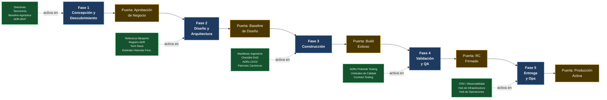

# Mapeo SDLC–Artefactos Evolith

> **Navegación bilingüe:** [English](./sdlc-evolith-artifact-mapping.md)
> **Propietario:** Evolith Architecture Board
> **Estado:** Referencia activa
> **Padre:** [Centro de Gobernanza SDLC](./README.md)

---

## Propósito

El [Framework SDLC Orientado a Construcción](./02-engineering/construction-focused-sdlc-framework.md) define cinco fases formales del ciclo de vida y sus puertas de salida. Este documento responde una pregunta diferente: **en cada una de esas fases, ¿qué artefactos Evolith son obligatorios como entradas, cuáles son recomendados, y qué papel juega la plataforma en esa fase?**

Usa este mapeo para:

- Incorporar un nuevo equipo de producto y comunicarles exactamente qué deben consultar en cada etapa
- Realizar revisiones de puertas del Architecture Board con una lista de verificación trazable de artefactos
- Identificar brechas de cobertura cuando una fase carece de los artefactos que requiere

---

## Cómo Leer Este Documento

| Símbolo | Significado |
|---|---|
| **Requerido** | Debe ser consultado o producido antes de que se active la puerta de salida de la fase. Su ausencia bloquea la puerta. |
| **Opcional** | Mejor práctica recomendada; situacional según la complejidad del producto, la madurez del equipo o la fase del roadmap evolutivo. |

Los cinco artefactos de la Línea Base de Cumplimiento Evolith — listados en la Sección 5 — son **siempre requeridos** sin importar la fase. No se repiten en las tablas por fase.

---

## 1. Visión General: Dónde Entra Evolith en el Ciclo de Vida

---

## 2. Fase 1 — Concepción y Descubrimiento

**Rol de Evolith en esta fase:** Establecer las restricciones no negociables *antes* de que el alcance quede congelado. Toda instanciación de un producto debe alinearse con la baseline agnóstica y el framework de selección de topología antes de que se active la puerta de Aprobación de Negocio. En esta fase el equipo aprende qué puede y qué no puede decidir.

**Puerta de salida:** Aprobación de Negocio — Alcance Congelado

### Artefactos Requeridos

| Artefacto | Ubicación | Por Qué es Requerido |
|---|---|---|
| **Directivas Arquitectónicas** | [reference/governance/standards/vision/architectural-directives.md](../standards/vision/architectural-directives.md) | Establece las restricciones no negociables (Hexagonal, sin extracción prematura, Zero-Trust desde la Fase 1) que enmarcan el alcance completo del producto. Debe leerse antes de tomar cualquier decisión de alcance. |
| **Taxonomía del Repositorio** | [reference/governance/standards/repository-taxonomy.md](../standards/repository-taxonomy.md) | Define la estructura del monorepo, los prefijos de nomenclatura y la clasificación de artefactos antes de que se cree cualquier archivo o módulo. |
| **Baseline Agnóstica** | [reference/architecture/blueprints/authoritative-tech-stack-agnostic.md](../../architecture/blueprints/authoritative-tech-stack-agnostic.md) | Define la baseline tecnológica neutral a la que todo producto debe conformarse. Ninguna tecnología fuera de este límite puede introducirse sin un nuevo ADR. |
| **ADR-0047 — Selección Monolito Modular** | [reference/architecture/adrs/core/0047-architectural-patterns-monolith-soa-microservices.md](../../architecture/adrs/core/0047-architectural-patterns-monolith-soa-microservices.md) | Confirma la topología de inicio obligatoria (Monolito Modular). El alcance no puede congelarse sobre una arquitectura de microservicios a menos que los criterios de extracción del ADR-0045 ya estén satisfechos. |
| **Manifiesto de Ingeniería** | [reference/governance/standards/engineering/engineering-manifesto.md](../standards/engineering/engineering-manifesto.md) | Establece las expectativas de ingeniería del equipo — SOLID, DRY, anti-patrones, estándares de PR — antes de redactar cualquier contrato de desarrollo. |

### Artefactos Opcionales

| Artefacto | Ubicación | Cuándo Usarlo |
|---|---|---|
| Roadmap de Estrategia Evolutiva | [reference/governance/standards/vision/evolutionary-strategy-roadmap.md](../standards/vision/evolutionary-strategy-roadmap.md) | Cuando el roadmap del producto abarca múltiples fases Evolith (Fase 1 MVP hasta Fase 3 North Star). Útil para planificación ejecutiva y alineación de plazos. |
| Matriz de Madurez | [reference/governance/standards/vision/maturity-matrix.md](../standards/vision/maturity-matrix.md) | Cuando se realiza un posicionamiento formal TOGAF ACMM del estado de partida. Útil para productos brownfield que migran a la baseline Evolith. |
| Estándar de Escritura de Historias Funcionales | [reference/governance/sdlc/03-documentation/functional-story-writing-standard.md](./03-documentation/functional-story-writing-standard.md) | Cuando el equipo de producto producirá PRDs o historias funcionales durante la Concepción. Recomendado para equipos nuevos en el modelo de documentación Evolith. |
| Estrategia de Comunicación Arquitectónica | [reference/governance/standards/communication/architecture-communication-strategy.md](../standards/communication/architecture-communication-strategy.md) | Cuando se preparan presentaciones para stakeholders o briefings ejecutivos sobre la visión arquitectónica. |
| Modelo de Referencia UMS | [reference/knowledge/demo/ums-reference-model.es.md](../../knowledge/demo/ums-reference-model.es.md) | Cuando el producto opera en el dominio de identidad, gestión de acceso o autorización multi-tenant y los patrones UMS son directamente aplicables. |

---

## 3. Fase 2 — Diseño y Arquitectura

**Rol de Evolith en esta fase:** Proporcionar el blueprint canónico, el framework de decisiones ADR y los límites tecnológicos aprobados. Cada decisión arquitectónica relevante en esta fase debe referenciar un ADR Evolith existente o producir un nuevo ADR a nivel de producto que lo extienda. El Reference Blueprint es el punto de partida, no una página en blanco.

**Puerta de salida:** Baseline de Diseño Aprobada

### Artefactos Requeridos

| Artefacto | Ubicación | Por Qué es Requerido |
|---|---|---|
| **Reference Blueprint** | [reference/architecture/blueprints/reference-blueprint.md](../../architecture/blueprints/reference-blueprint.md) | El modelo arquitectónico C4 canónico. Todos los diagramas de arquitectura del producto deben ser trazables a este blueprint. |
| **Stack Tecnológico Autorizado** | [reference/architecture/blueprints/authoritative-tech-stack.md](../../architecture/blueprints/authoritative-tech-stack.md) | Solo las tecnologías en esta lista pueden introducirse. Las adiciones requieren un nuevo ADR con aprobación del Architecture Board antes de que se apruebe la Baseline de Diseño. |
| **Matriz de Decisiones ADR** | [reference/architecture/adrs/adr-matrix.md](../../architecture/adrs/adr-matrix.md) | Debe consultarse antes de crear cualquier nuevo ADR para confirmar que la decisión no está ya resuelta. Previene decisiones duplicadas o contradictorias. |
| **ADR-0002 — Arquitectura Hexagonal** | [reference/architecture/adrs/nodejs/0002-clean-architecture-nestjs.md](../../architecture/adrs/nodejs/0002-clean-architecture-nestjs.md) | Límite arquitectónico obligatorio. La estructura de Puertos y Adaptadores debe reflejarse en el diseño desde el primer día. |
| **ADR-0018 — Pirámide de Testing** | [reference/architecture/adrs/core/0018-testing-pyramid-quality-gates.md](../../architecture/adrs/core/0018-testing-pyramid-quality-gates.md) | La arquitectura de pruebas debe diseñarse en esta fase. Los umbrales de cobertura y la distribución de tipos de test son contractuales, no retrospectivos. |
| **ADR-0031 — Schema-per-Context** | [reference/architecture/adrs/core/0031-schema-per-context-domain-event-catalog.md](../../architecture/adrs/core/0031-schema-per-context-domain-event-catalog.md) | Los joins SQL entre schemas están arquitectónicamente prohibidos. Las fronteras de schema de cada bounded context deben decidirse en la fase de diseño. |
| **ADR-0032 — Matriz de Selección de Protocolo** | [reference/architecture/adrs/core/0032-api-protocol-decision-matrix-rest-grpc-graphql.md](../../architecture/adrs/core/0032-api-protocol-decision-matrix-rest-grpc-graphql.md) | El uso de REST, gRPC y GraphQL debe resolverse antes de producir los contratos de API. |
| **ADR-0056 — Convenciones de Nomenclatura y Diseño** | [reference/architecture/adrs/core/0056-enterprise-naming-design-conventions.md](../../architecture/adrs/core/0056-enterprise-naming-design-conventions.md) | El lenguaje ubicuo y las reglas de nomenclatura deben establecerse antes de finalizar el nombre de entidades y endpoints. |
| **Estándar de Escritura de Historias Funcionales** | [reference/governance/sdlc/03-documentation/functional-story-writing-standard.md](./03-documentation/functional-story-writing-standard.md) | Todas las historias funcionales producidas en esta fase deben conformarse a este estándar antes de que pueda aprobarse la puerta de Baseline de Diseño. |
| **Buenas Prácticas de Documentación SDLC** | [reference/governance/sdlc/03-documentation/sdlc-documentation-best-practices.md](./03-documentation/sdlc-documentation-best-practices.md) | Rige cómo todos los artefactos de diseño — blueprints, ADRs, schemas — se producen, versionan y revisan. |
| **Checklist de Simplicidad Fase 1** | [reference/architecture/blueprints/simplicity-checklist-phase-01.md](../../architecture/blueprints/simplicity-checklist-phase-01.md) | Bloquea contra la sobre-ingeniería. Debe aprobarse antes de que se autorice la Baseline de Diseño para prevenir complejidad prematura. |

### Artefactos Opcionales

| Artefacto | Ubicación | Cuándo Usarlo |
|---|---|---|
| Especificación C4 | [reference/architecture/blueprints/c4-topology-spec.md](../../architecture/blueprints/c4-topology-spec.md) | Cuando se producen diagramas C4 formales (Contexto, Contenedor, Componente, Código) como parte del entregable de diseño. |
| Análisis CAP Estratégico | [reference/architecture/blueprints/cap-strategic-analysis.md](../../architecture/blueprints/cap-strategic-analysis.md) | Cuando se realizan decisiones explícitas de consistencia vs. disponibilidad a nivel de base de datos o bus de eventos. |
| Flujo de Arquitectura de Observabilidad | [reference/architecture/blueprints/observability-architecture-flow.md](../../architecture/blueprints/observability-architecture-flow.md) | Cuando se diseña la topología de trazado distribuido y agregación de logs. |
| Escenarios Multi-Cloud | [reference/architecture/blueprints/multi-cloud-deployment-scenarios.md](../../architecture/blueprints/multi-cloud-deployment-scenarios.md) | Cuando el producto debe soportar más de un proveedor cloud desde la Fase 1. |
| ADR-0010 — Multi-Tenancy Doble Capa | [reference/architecture/adrs/core/0010-multi-tenancy-architecture-strategy.md](../../architecture/adrs/core/0010-multi-tenancy-architecture-strategy.md) | Requerido cuando el producto sirve a múltiples tenants. Se convierte en obligatorio para productos multi-tenant. |
| ADR-0045 — Criterios de Extracción a Microservicio | [reference/architecture/adrs/core/0045-microservice-extraction-readiness-criteria.md](../../architecture/adrs/core/0045-microservice-extraction-readiness-criteria.md) | Cuando el roadmap incluye extracción planificada a microservicios. Define los triggers cuantitativos para que las fronteras de extracción puedan diseñarse con anticipación. |
| Patrones Canónicos | [reference/architecture/canonical-patterns/README.md](../../architecture/canonical-patterns/README.md) | Cuando se adoptan implementaciones de referencia específicas del runtime. Úsalos para acelerar las decisiones de diseño con patrones probados. |
| Visión Técnica de UMS | [reference/knowledge/demo/ums-technical-overview.es.md](../../knowledge/demo/ums-technical-overview.es.md) | Cuando el producto está en el dominio de identidad o autorización y los patrones de bounded context de UMS son directamente aplicables. |
| Backlog Visual de Arquitectura | [reference/governance/standards/communication/visuals/README.es.md](../standards/communication/visuals/README.es.md) | Cuando se producen artefactos visuales (one-pager ejecutivo, journey map, diagramas de onboarding) para comunicación arquitectónica. |

---

## 4. Fase 3 — Construcción

**Rol de Evolith en esta fase:** Aplicar calidad de código, fronteras arquitectónicas y la Definición de Terminado en cada pull request. El Manifiesto de Ingeniería, el checklist DoD y la configuración del pipeline CI/CD son los instrumentos de aplicación primarios. El bucle interno de construcción (Prep Entorno → Código Dominio → Tests Unitarios → Integración → Escaneo CI → Revisión por Pares) está gobernado por el Framework SDLC Orientado a Construcción.

**Puerta de salida:** Build Exitoso — Merge de PR Autorizado

### Artefactos Requeridos

| Artefacto | Ubicación | Por Qué es Requerido |
|---|---|---|
| **Manifiesto de Ingeniería** | [reference/governance/standards/engineering/engineering-manifesto.md](../standards/engineering/engineering-manifesto.md) | SOLID, DRY, KISS, YAGNI y la lista explícita de anti-patrones rigen cada línea de código. Las revisiones de código citan este documento al bloquear un PR. |
| **Framework SDLC — §3 y §4** | [reference/governance/sdlc/02-engineering/construction-focused-sdlc-framework.md](./02-engineering/construction-focused-sdlc-framework.md) | El bucle interno de construcción (§3.1), las métricas de umbral de calidad (§3.2) y el checklist de Definición de Terminado (§4) son condiciones de puerta no negociables. |
| **ADR-0005 — Pipeline CI/CD (CodeQL)** | [reference/architecture/adrs/core/0005-ci-cd-quality-codeql.md](../../architecture/adrs/core/0005-ci-cd-quality-codeql.md) | Pipeline automatizado obligatorio. Ningún merge se autoriza sin una ejecución CI aprobada que incluya linting, testing y escaneo de seguridad. |
| **ADR-0018 — Puertas de Calidad de la Pirámide de Testing** | [reference/architecture/adrs/core/0018-testing-pyramid-quality-gates.md](../../architecture/adrs/core/0018-testing-pyramid-quality-gates.md) | El umbral mínimo de cobertura de código del 70% se aplica en CI. Los builds por debajo de este umbral son bloqueados. |
| **ADR-0049 — Semántica de Nomenclatura y Clean Code** | [reference/architecture/adrs/core/0049-naming-semantics-clean-code-policy.md](../../architecture/adrs/core/0049-naming-semantics-clean-code-policy.md) | La disciplina de nomenclatura se valida desde el primer commit mediante linting automatizado. |
| **ADR-0050 — Estrategia de Branching GitFlow** | [reference/architecture/adrs/core/0050-gitflow-branching-strategy.md](../../architecture/adrs/core/0050-gitflow-branching-strategy.md) | Los nombres de ramas, las políticas de merge y el tagging de releases son contractuales. |
| **Buenas Prácticas de Documentación SDLC** | [reference/governance/sdlc/03-documentation/sdlc-documentation-best-practices.md](./03-documentation/sdlc-documentation-best-practices.md) | Ningún código de funcionalidad hace merge a ramas estables sin su correspondiente delta de documentación. La documentación es parte del DoD. |
| **Patrones Canónicos** | [reference/architecture/canonical-patterns/README.md](../../architecture/canonical-patterns/README.md) | Implementaciones de referencia específicas del runtime que deben seguirse al implementar los patrones gobernados por los ADRs relevantes. |

### Artefactos Opcionales

| Artefacto | Ubicación | Cuándo Usarlo |
|---|---|---|
| Guía de Contract Testing | [reference/governance/standards/engineering/contract-testing-guideline.md](../standards/engineering/contract-testing-guideline.md) | Cuando el producto expone o consume contratos inter-servicio (REST OpenAPI, gRPC Protobuf, AsyncAPI). |
| Vendor Risk Assessment | [reference/governance/standards/engineering/vendor-risk-assessment.md](../standards/engineering/vendor-risk-assessment.md) | Cuando se introduce una nueva librería o servicio de terceros no incluido en el Stack Tecnológico Autorizado. |
| ADR-0019 — Primitivas DDD Tácticas | [reference/architecture/adrs/core/0019-tactical-design-patterns-future-proofing.md](../../architecture/adrs/core/0019-tactical-design-patterns-future-proofing.md) | Cuando se aplican patrones DDD tácticos (Aggregates, Value Objects, Domain Events). Solo usar donde la complejidad del dominio lo justifique según el Manifiesto §2. |
| ADR-0033 — Transactional Outbox | [reference/architecture/adrs/core/0033-transactional-outbox-pattern.md](../../architecture/adrs/core/0033-transactional-outbox-pattern.md) | Cuando se implementa despacho de eventos asíncronos confiables. |
| ADR-0034 — Aplicabilidad CQRS | [reference/architecture/adrs/core/0034-cqrs-pattern-applicability-matrix.md](../../architecture/adrs/core/0034-cqrs-pattern-applicability-matrix.md) | Cuando se aplica separación comando/consulta a nivel de persistencia. Consultar la matriz de aplicabilidad antes de usar. |
| ADR-0035 — Sagas Distribuidas | [reference/architecture/adrs/core/0035-distributed-saga-pattern-strategy.md](../../architecture/adrs/core/0035-distributed-saga-pattern-strategy.md) | Cuando se implementan flujos de trabajo multi-paso con transacciones compensatorias entre bounded contexts. |
| Asistente AI de Arquitectura | [reference/governance/standards/ai-augmented/08-architecture-ai-assistant/README.md](../standards/ai-augmented/08-architecture-ai-assistant/README.md) | Cuando el equipo opera bajo un flujo de trabajo de ingeniería AI-augmented. Rige la ingeniería de prompts, la taxonomía de conocimiento y la política HITL. |
| Modelo de Referencia UMS | [reference/knowledge/demo/ums-reference-model.es.md](../../knowledge/demo/ums-reference-model.es.md) | Como referencia concreta de patrones para Arquitectura Hexagonal, estructura de bounded context e implementación de RLS en .NET. |

---

## 5. Fase 4 — Validación y QA

**Rol de Evolith en esta fase:** Definir los umbrales de calidad obligatorios que el release candidate debe satisfacer. Los ADRs de la pirámide de testing establecen la distribución contractual de tipos de test y la cobertura mínima. El Framework SDLC §3.2 provee las cuatro métricas cuantitativas (cobertura, complejidad ciclomática, índice de vulnerabilidades, ratio de deuda técnica) que bloquean el sello RC.

**Puerta de salida:** Release Candidate (RC) Sellado

### Artefactos Requeridos

| Artefacto | Ubicación | Por Qué es Requerido |
|---|---|---|
| **Framework SDLC — §3.2 Métricas de Umbral** | [reference/governance/sdlc/02-engineering/construction-focused-sdlc-framework.md](./02-engineering/construction-focused-sdlc-framework.md) | Las cuatro métricas de umbral de calidad son la puerta matemática: cobertura >= 80%, complejidad ciclomática <= 15, cero CVEs críticos/altos, ratio de deuda técnica < 5%. Todas deben pasar antes de sellar el RC. |
| **ADR-0018 — Puertas de Calidad de la Pirámide de Testing** | [reference/architecture/adrs/core/0018-testing-pyramid-quality-gates.md](../../architecture/adrs/core/0018-testing-pyramid-quality-gates.md) | Define la distribución de test obligatoria (70% unit / 20% integración / 10% E2E) y el piso de cobertura. Los reportes de resumen de testing deben referenciar estos umbrales. |
| **ADR-0052 — Estrategia de Aislamiento de Unit Tests** | [reference/architecture/adrs/core/0052-unit-testing-isolation-strategy.md](../../architecture/adrs/core/0052-unit-testing-isolation-strategy.md) | Rige la disciplina de mocks y stubs. Los test doubles no deben introducir preocupaciones reales de infraestructura en las aserciones de unit tests. |
| **ADR-0053 — Estrategia de Integración y E2E** | [reference/architecture/adrs/core/0053-integration-e2e-testing-strategy.md](../../architecture/adrs/core/0053-integration-e2e-testing-strategy.md) | Testing de integración basado en Testcontainers y alcance E2E. Requerido cuando la fase de validación incluye tests de subsistemas cableados. |
| **Guía de Contract Testing** | [reference/governance/standards/engineering/contract-testing-guideline.md](../standards/engineering/contract-testing-guideline.md) | Requerida cuando el producto expone contratos inter-servicio. Los resultados de contract tests deben incluirse en la Aprobación QA. |

### Artefactos Opcionales

| Artefacto | Ubicación | Cuándo Usarlo |
|---|---|---|
| ADR-0037 — Verificación de Rendimiento y Caos | [reference/architecture/adrs/core/0037-performance-concurrency-chaos-strategy.md](../../architecture/adrs/core/0037-performance-concurrency-chaos-strategy.md) | Cuando la fase de validación incluye pruebas de carga, stress testing o escenarios de chaos engineering. Recomendado para productos en Fase 2+. |
| Vendor Risk Assessment | [reference/governance/standards/engineering/vendor-risk-assessment.md](../standards/engineering/vendor-risk-assessment.md) | Cuando la fase de validación de seguridad incluye una auditoría de dependencias de terceros. |
| Flujo de Arquitectura de Observabilidad | [reference/architecture/blueprints/observability-architecture-flow.md](../../architecture/blueprints/observability-architecture-flow.md) | Cuando se valida que la instrumentación de observabilidad (spans OTel, logs estructurados) cumple la especificación de cobertura en producción. |
| Portal de Arquitectura UMS | https://github.com/beyondnetcode/ums/blob/main/docs/architecture/index.md | Como referencia de cómo UMS implementa la pirámide de testing en un producto .NET real — útil para equipos QA calibrando el alcance de integración y E2E. |

---

## 6. Fase 5 — Entrega y Operaciones

**Rol de Evolith en esta fase:** Especificar el stack de observabilidad obligatorio, la topología de infraestructura y las políticas de DR. El trazado distribuido OTel, el logging estructurado Loki, los dashboards Grafana y el runbook de DR están todos definidos en Evolith y son consumidos por la configuración de despliegue del producto. La nominalidad del monitoreo en Producción Activa se valida contra estas especificaciones.

**Puerta de salida:** Producción Activa — Monitoreo Nominal

### Artefactos Requeridos

| Artefacto | Ubicación | Por Qué es Requerido |
|---|---|---|
| **ADR-0007 — OTel y Loki Observabilidad** | [reference/architecture/adrs/nodejs/0007-observability-telemetry-loki-opentelemetry.md](../../architecture/adrs/nodejs/0007-observability-telemetry-loki-opentelemetry.md) | El trazado distribuido (W3C TraceContext) y el logging estructurado son obligatorios en todo despliegue productivo. No puede declararse Monitoreo Nominal sin spans OTel activos fluyendo. |
| **ADR-0013 — Topología Cloud y DR** | [reference/architecture/adrs/core/0013-cloud-infrastructure-topology-dr.md](../../architecture/adrs/core/0013-cloud-infrastructure-topology-dr.md) | Define la topología de despliegue objetivo y el runbook de recuperación ante desastres. Requerido antes de que se active la puerta de Producción Activa. |
| **ADR-0005 — Pipeline CI/CD** | [reference/architecture/adrs/core/0005-ci-cd-quality-codeql.md](../../architecture/adrs/core/0005-ci-cd-quality-codeql.md) | El pipeline de despliegue debe aplicar las mismas puertas de calidad en la ruta de entrega que en la ruta de construcción. |
| **Hub de Operaciones** | [reference/operations/README.md](../../operations/README.md) | Configuración del OTel collector, plantillas de dashboards Grafana y runbooks de trazado Tempo. Requerido como especificación de despliegue de observabilidad. |
| **Hub de Infraestructura** | [reference/infrastructure/README.md](../../infrastructure/README.md) | Especificaciones de aprovisionamiento de infraestructura a las que el despliegue debe conformarse. |
| **Buenas Prácticas de Documentación SDLC** | [reference/governance/sdlc/03-documentation/sdlc-documentation-best-practices.md](./03-documentation/sdlc-documentation-best-practices.md) | Las notas de release y los runbooks de despliegue deben conformarse a este estándar antes de que pueda declararse Producción Activa. |

### Artefactos Opcionales

| Artefacto | Ubicación | Cuándo Usarlo |
|---|---|---|
| ADR-0011 — Patrones de Resiliencia | [reference/architecture/adrs/core/0011-fault-tolerance-resiliency-patterns.md](../../architecture/adrs/core/0011-fault-tolerance-resiliency-patterns.md) | Cuando el despliegue productivo incluye circuit breakers, bulkheads o políticas de retry (Polly, Resilience4j). |
| ADR-0017 — Estrategia de Feature Flagging | [reference/architecture/adrs/core/0017-feature-flagging-strategy.md](../../architecture/adrs/core/0017-feature-flagging-strategy.md) | Cuando se usan feature flags para rollout gradual o dark launches en producción. |
| ADR-0028 — Infraestructura OSS Self-Hosted | [reference/architecture/adrs/core/0028-self-hosted-hybrid-infrastructure-on-premise.md](../../architecture/adrs/core/0028-self-hosted-hybrid-infrastructure-on-premise.md) | Cuando se despliega en on-premise o en topología cloud híbrida. |
| ADR-0046 — Dapr Observabilidad Unificada | [reference/architecture/adrs/core/0046-dapr-unified-observability.md](../../architecture/adrs/core/0046-dapr-unified-observability.md) | Cuando el producto ha alcanzado la Fase 2 y Dapr está activo. El trazado distribuido unificado a través de sidecars Dapr requiere la configuración de este ADR. |
| Escenarios Multi-Cloud | [reference/architecture/blueprints/multi-cloud-deployment-scenarios.md](../../architecture/blueprints/multi-cloud-deployment-scenarios.md) | Cuando el objetivo de producción abarca múltiples proveedores cloud. |
| Flujo de Arquitectura de Observabilidad | [reference/architecture/blueprints/observability-architecture-flow.md](../../architecture/blueprints/observability-architecture-flow.md) | Cuando se construye o valida el pipeline completo de Grafana + Loki + Tempo + OTel Collector. |

---

## 7. Artefactos Transversales — Siempre Requeridos

Estos cinco artefactos constituyen la **Línea Base de Cumplimiento Evolith**. No son específicos de ninguna fase — rigen todo el ciclo de vida y deben estar en vigor desde el primer artefacto producido hasta el último despliegue ejecutado.

| # | Artefacto | Ubicación | Restricción |
|---|---|---|---|
| 1 | **Baseline Agnóstica** | [reference/architecture/blueprints/authoritative-tech-stack-agnostic.md](../../architecture/blueprints/authoritative-tech-stack-agnostic.md) | Define los límites tecnológicos neutrales. Ninguna decisión tecnológica puede violar esta baseline. |
| 2 | **Arquitectura de Referencia (Blueprint)** | [reference/architecture/blueprints/reference-blueprint.md](../../architecture/blueprints/reference-blueprint.md) | El modelo C4 canónico. Todas las arquitecturas de producto se miden contra este blueprint. |
| 3 | **Manifiesto de Ingeniería** | [reference/governance/standards/engineering/engineering-manifesto.md](../standards/engineering/engineering-manifesto.md) | Establece los principios de ingeniería que rigen todo el código y a todas las personas. Activo desde la Fase 1, día 1. |
| 4 | **Definición de Terminado** | [reference/governance/sdlc/02-engineering/construction-focused-sdlc-framework.md](./02-engineering/construction-focused-sdlc-framework.md) | El checklist DoD aplica a cada iteración, sprint y transición de fase. |
| 5 | **Taxonomía del Repositorio** | [reference/governance/standards/repository-taxonomy.md](../standards/repository-taxonomy.md) | Las reglas de nomenclatura, estructura y taxonomía aplican desde el momento en que se crea el repositorio. |

---

## 8. Matriz de Cumplimiento Consolidada

La siguiente matriz proporciona una vista de una página sobre la densidad de artefactos por fase. Un artefacto marcado **R** es Requerido; **O** es Opcional.

| Artefacto | F1 | F2 | F3 | F4 | F5 |
|---|:---:|:---:|:---:|:---:|:---:|
| Directivas Arquitectónicas | **R** | — | — | — | — |
| Baseline Agnóstica | **R** | **R** | **R** | **R** | **R** |
| Taxonomía del Repositorio | **R** | **R** | **R** | **R** | **R** |
| ADR-0047 — Monolito Modular | **R** | O | — | — | — |
| Manifiesto de Ingeniería | **R** | **R** | **R** | **R** | **R** |
| Roadmap de Estrategia Evolutiva | O | O | — | — | — |
| Matriz de Madurez | O | — | — | — | — |
| Reference Blueprint | — | **R** | **R** | — | — |
| Stack Tecnológico Autorizado | — | **R** | **R** | — | — |
| Matriz de Decisiones ADR | — | **R** | **R** | — | — |
| ADR-0002 — Arquitectura Hexagonal | — | **R** | **R** | — | — |
| ADR-0010 — Multi-Tenancy | — | O* | **R*** | **R*** | — |
| ADR-0018 — Pirámide de Testing | — | **R** | **R** | **R** | — |
| ADR-0031 — Schema-per-Context | — | **R** | **R** | — | — |
| ADR-0032 — Selección de Protocolo | — | **R** | **R** | — | — |
| ADR-0056 — Convenciones de Nomenclatura | — | **R** | **R** | — | — |
| Estándar de Historias Funcionales | O | **R** | — | — | — |
| Buenas Prácticas de Documentación SDLC | — | **R** | **R** | — | **R** |
| Checklist de Simplicidad Fase 1 | — | **R** | — | — | — |
| Patrones Canónicos | — | O | **R** | — | — |
| ADR-0005 — Pipeline CI/CD | — | — | **R** | **R** | **R** |
| ADR-0049 — Semántica de Nomenclatura | — | — | **R** | — | — |
| ADR-0050 — Branching GitFlow | — | — | **R** | — | — |
| ADR-0019 — DDD Táctico | — | — | O | — | — |
| ADR-0033 — Transactional Outbox | — | O | O | — | — |
| ADR-0034 — CQRS | — | O | O | — | — |
| ADR-0035 — Sagas Distribuidas | — | O | O | — | — |
| Guía de Contract Testing | — | — | O | **R** | — |
| ADR-0052 — Aislamiento Unit Tests | — | — | **R** | **R** | — |
| ADR-0053 — Integración y E2E | — | — | **R** | **R** | — |
| Framework SDLC §3.2 Métricas Calidad | — | — | — | **R** | — |
| ADR-0037 — Rendimiento y Caos | — | — | — | O | — |
| Vendor Risk Assessment | — | — | O | O | — |
| ADR-0007 — OTel y Loki | — | O | **R** | O | **R** |
| ADR-0013 — Topología Cloud y DR | — | O | — | — | **R** |
| ADR-0046 — Dapr Observabilidad | — | — | — | — | O |
| ADR-0011 — Patrones de Resiliencia | — | — | — | — | O |
| ADR-0017 — Feature Flagging | — | — | O | — | O |
| ADR-0028 — Infraestructura OSS Self-Hosted | — | O | — | — | O |
| Hub de Operaciones | — | — | — | — | **R** |
| Hub de Infraestructura | — | — | — | — | **R** |
| Asistente AI de Arquitectura | — | — | O | — | — |
| Visión Técnica de UMS | O | O | O | O | — |

> (*) ADR-0010 es Opcional en la Fase 2 pero se vuelve Requerido en las Fases 3–4 cuando el producto es multi-tenant. Los productos single-tenant pueden diferir.

---

## 9. Documentos Relacionados

| Documento | Propósito |
|---|---|
| [Framework SDLC Orientado a Construcción](./02-engineering/construction-focused-sdlc-framework.md) | Las definiciones normativas de fase y condiciones de puerta de salida que este mapeo complementa. |
| [Buenas Prácticas de Documentación SDLC](./03-documentation/sdlc-documentation-best-practices.md) | Rige cómo los artefactos producidos en cada fase deben escribirse y versionarse. |
| [Hub de Arquitectura](../../architecture/README.es.md) | Punto de entrada al Registro ADR completo, blueprints y patrones canónicos. |
| [Línea Base de Cumplimiento Evolith](../../../MASTER_INDEX.es.md#8-línea-base-de-cumplimiento-evolith) | Los cinco artefactos obligatorios en vigor en todas las fases. |
| [Primeros Pasos por Rol](../../getting-started/README.es.md) | Rutas de lectura por rol alineadas con la fase donde cada rol es más activo. |

---

  Evolith — Enterprise Architecture Platform | Mapeo SDLC–Artefactos

