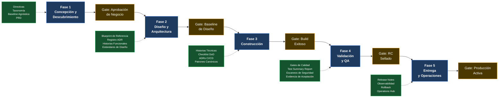

# Mapeo SDLC–Artefactos Evolith

> **Navegación bilingüe:** [English](./sdlc-evolith-artifact-mapping.md)
> **Propietario:** Evolith Architecture Board
> **Estado:** Referencia activa
> **Padre:** [Centro de Gobernanza SDLC](./README.es.md)

---

## Propósito

El [Framework SDLC Orientado a Construcción](./02-engineering/construction-focused-sdlc-framework.es.md) define cinco fases formales del ciclo de vida y sus puertas de salida. Este documento responde una pregunta diferente: **en cada fase, qué artefactos Evolith son obligatorios como entradas, cuáles son recomendados y qué papel juega la plataforma en esa fase?**

Usa este mapeo para:

- Incorporar un nuevo equipo de producto y comunicar exactamente qué debe consultar en cada etapa.
- Realizar revisiones de gates del Architecture Board con una lista trazable de artefactos.
- Identificar brechas cuando una fase carece de artefactos requeridos.
- Alinear equipos técnicos, QA, Producto, Operaciones y Directores de Tecnología alrededor del mismo modelo de evidencia.

---

## Cómo Leer Este Documento

| Símbolo | Significado |
|---|---|
| **Requerido** | Debe consultarse o producirse antes de activar el gate de salida de fase. Su ausencia bloquea el gate. |
| **Opcional** | Buena práctica recomendada; situacional según complejidad del producto, madurez del equipo o fase de roadmap evolutivo. |
| **Condicional** | Requerido solo cuando aplica la condición detonante, como multi-tenancy, APIs públicas, datos regulados o flujos críticos de producción. |

Los cinco artefactos de la Baseline de Cumplimiento Evolith listados en la Sección 7 son **siempre requeridos** independientemente de la fase. No se repiten en cada tabla por fase.

---

## 1. Vista General: Dónde Entra Evolith en el Ciclo de Vida

---

## 2. Fase 1 — Concepción y Descubrimiento

**Rol de Evolith en esta fase:** Establecer restricciones no negociables antes de congelar alcance. Cualquier instanciación de producto debe alinearse con la baseline agnóstica, la taxonomía de repositorio y el framework de selección topológica antes de activar el gate de Aprobación de Negocio.

**Gate de salida:** Aprobación de Negocio — Alcance Congelado

### Artefactos Requeridos

| Artefacto | Ubicación | Por qué es requerido |
|---|---|---|
| **Discovery Canvas** | [discovery-canvas-template.es.md](./04-artifact-templates/discovery-canvas-template.es.md) | Registro de iniciativa, dolor del cliente y valor esperado. |
| **Technical Feasibility Canvas** | [technical-feasibility-template.es.md](./04-artifact-templates/technical-feasibility-template.es.md) | Factibilidad técnica, cuotas de cloud y NFRs. |
| **Ballpark Estimation** | [ballpark-estimation-template.es.md](./04-artifact-templates/ballpark-estimation-template.es.md) | Estimación T-Shirt Sizing de esfuerzo y equipo. |
| **Historia de Usuario Evolith** | [evolith-user-story-template.es.md](./04-artifact-templates/evolith-user-story-template.es.md) | Definición atómica con criterios BDD y separación técnica. |
| **Agile Backlog** | [agile-backlog-template.es.md](./04-artifact-templates/agile-backlog-template.es.md) | Agrupación versionada de historias listas para priorización. |
| **Análisis de Impacto CLI** | [cli-impact-analysis.es.md](./04-artifact-templates/cli-impact-analysis.es.md) | Capacidades requeridas por el CLI para scaffolding y handoff. |
| **PRD — Documento de Requisitos de Producto** | [prd-template.es.md](./04-artifact-templates/prd-template.es.md) | Captura alcance, personas, objetivos, restricciones, no-objetivos y evidencia de aprobación. |
| **Directivas Arquitectónicas** | [architectural-directives.md](../standards/vision/architectural-directives.md) | Establece restricciones no negociables que acotan todo el alcance del producto. |
| **Taxonomía de Repositorio** | [repository-taxonomy.md](../standards/repository-taxonomy.md) | Define estructura de repositorio, prefijos de nombres y clasificación de artefactos antes de crear archivos o módulos. |
| **Baseline Agnóstica** | [authoritative-tech-stack-agnostic.md](../../architecture/blueprints/authoritative-tech-stack-agnostic.md) | Define la baseline neutral a tecnología que todo producto debe cumplir. |
| **ADR-0047 — Selección de Monolito Modular** | [ADR-0047](../../architecture/adrs/core/0047-architectural-patterns-monolith-soa-microservices.es.md) | Confirma la topología inicial obligatoria salvo que criterios de extracción aprobados ya estén satisfechos. |
| **Manifiesto de Ingeniería** | [engineering-manifesto.md](../standards/engineering/engineering-manifesto.md) | Define expectativas de ingeniería del equipo antes de redactar contratos de desarrollo. |

### Artefactos Opcionales

| Artefacto | Ubicación | Cuándo usarlo |
|---|---|---|
| Roadmap de Estrategia Evolutiva | [evolutionary-strategy-roadmap.md](../standards/vision/evolutionary-strategy-roadmap.md) | Cuando el roadmap del producto abarca múltiples fases Evolith. |
| Evaluación de Madurez | [maturity-assessment.es.md](../standards/vision/maturity-assessment.es.md) | Cuando se evalúa un producto brownfield o una posición formal de madurez. |
| Estrategia de Comunicación Arquitectónica | [architecture-communication-strategy.md](../standards/communication/architecture-communication-strategy.md) | Al preparar briefings de arquitectura para stakeholders o ejecutivos. |
| Modelo de Referencia UMS | [ums-reference-model.md](../../knowledge/demo/ums-reference-model.md) | Cuando el producto opera en identidad, access management o autorización multi-tenant. |

### Subfase 01.1 — Knowledge-First Discovery (Opcional)

| Artefacto | Ubicación | Nivel | Cuándo usarlo |
|---|---|---|---|
| Discovery Knowledge Brief | [discovery-knowledge-brief-template.es.md](./04-artifact-templates/discovery-knowledge-brief-template.es.md) | 1+ | Cualquier iniciativa donde brechas de conocimiento puedan causar retrabajo |
| Log de Supuestos y Preguntas | [assumptions-questions-log-template.es.md](./04-artifact-templates/assumptions-questions-log-template.es.md) | 1+ | Cuando los supuestos necesitan seguimiento y validación |
| Discovery Context Pack | [discovery-context-pack-template.es.md](./04-artifact-templates/discovery-context-pack-template.es.md) | 1+ | Cuando agentes IA o repos satélite necesitan contexto exportable |
| Mapa de Capacidades | [capability-map-template.es.md](./04-artifact-templates/capability-map-template.es.md) | 2+ | Cuando se necesita descomposición del dominio antes de planificación de épicas |
| Matriz de Candidatos a Épica | [epic-candidate-matrix-template.es.md](./04-artifact-templates/epic-candidate-matrix-template.es.md) | 2+ | Cuando las capacidades deben rastrearse a candidatos de épica |
| Banco de Semillas de Historia | [story-seed-bank-template.es.md](./04-artifact-templates/story-seed-bank-template.es.md) | 2+ | Cuando se necesitan semillas mínimas de historia antes del refinamiento del backlog |
| Gate de Preparación de Discovery | [discovery-readiness-gate-template.es.md](./04-artifact-templates/discovery-readiness-gate-template.es.md) | 3+ | Cuando se requiere validación formal de suficiencia del conocimiento |

---

## 3. Fase 2 — Diseño y Arquitectura

**Rol de Evolith en esta fase:** Proveer el blueprint canónico, el framework de decisión ADR y los límites tecnológicos aprobados. Toda decisión arquitectónica mayor debe referenciar un ADR Evolith existente o producir un ADR a nivel producto que lo extienda.

**Gate de salida:** Baseline de Diseño Aprobado

### Artefactos Requeridos

| Artefacto | Ubicación | Por qué es requerido |
|---|---|---|
| **Blueprint de Referencia** | [reference-blueprint.md](../../architecture/blueprints/reference-blueprint.md) | Modelo C4 canónico. Los diagramas de arquitectura del producto deben ser trazables a él. |
| **Tech Stack Autoritativo** | [authoritative-tech-stack.md](../../architecture/blueprints/authoritative-tech-stack.md) | Solo pueden introducirse tecnologías aprobadas salvo que se apruebe un nuevo ADR. |
| **Matriz de Decisión ADR** | [adr-matrix.md](../../architecture/adrs/adr-matrix.md) | Previene decisiones arquitectónicas duplicadas o contradictorias. |
| **ADR-0002 — Arquitectura Hexagonal** | [ADR-0002](../../architecture/adrs/nodejs/0002-clean-architecture-nestjs.es.md) | Límite obligatorio de Ports and Adapters. |
| **ADR-0018 — Pirámide de Testing** | [ADR-0018](../../architecture/adrs/core/0018-testing-pyramid-quality-gates.es.md) | La arquitectura de pruebas y la distribución por tipo de prueba deben diseñarse antes de validación. |
| **ADR-0031 — Schema-per-Context** | [ADR-0031](../../architecture/adrs/core/0031-schema-per-context-domain-event-catalog.es.md) | Los límites de esquema por bounded context deben decidirse antes de construcción. |
| **ADR-0032 — Matriz de Selección de Protocolo** | [ADR-0032](../../architecture/adrs/core/0032-api-protocol-decision-matrix-rest-grpc-graphql.es.md) | El uso de REST, gRPC y GraphQL debe resolverse antes de producir contratos API. |
| **ADR-0056 — Convenciones de Naming y Diseño** | [ADR-0056](../../architecture/adrs/core/0056-enterprise-naming-design-conventions.es.md) | El lenguaje ubicuo y las reglas de naming deben establecerse antes de nombrar entidades y endpoints. |
| **Plantilla de Historia Funcional** | [functional-story-template.es.md](./04-artifact-templates/functional-story-template.es.md) | Estructura requerida para especificaciones de comportamiento de negocio. |
| **Estándar de Escritura de Historias Funcionales** | [functional-story-writing-standard.es.md](./03-documentation/functional-story-writing-standard.es.md) | Asegura historias legibles por negocio y separación de detalles de implementación. |
| **Buenas Prácticas de Documentación SDLC** | [sdlc-documentation-best-practices.es.md](./03-documentation/sdlc-documentation-best-practices.es.md) | Gobierna cómo se producen, versionan y revisan los artefactos de diseño. |
| **Checklist de Simplicidad Fase 1** | [simplicity-checklist-phase-01.md](../../architecture/blueprints/simplicity-checklist-phase-01.md) | Bloquea sobre-ingeniería antes de aprobar la Baseline de Diseño. |

### Artefactos Opcionales o Condicionales

| Artefacto | Ubicación | Cuándo usarlo |
|---|---|---|
| ADR-0010 — Multi-Tenancy | [ADR-0010](../../architecture/adrs/core/0010-multi-tenancy-architecture-strategy.es.md) | Condicional: requerido cuando el producto sirve múltiples tenants. |
| ADR-0045 — Criterios de Readiness para Extracción | [ADR-0045](../../architecture/adrs/core/0045-microservice-extraction-readiness-criteria.es.md) | Cuando el roadmap incluye posible extracción a microservicios. |
| C4 Topology Spec | [c4-topology-spec.md](../../architecture/blueprints/c4-topology-spec.md) | Cuando se producen diagramas C4 formales. |
| Análisis Estratégico CAP | [cap-strategic-analysis.md](../../architecture/blueprints/cap-strategic-analysis.md) | Cuando se hacen tradeoffs explícitos entre consistencia y disponibilidad. |
| Flujo de Arquitectura de Observabilidad | [observability-architecture-flow.md](../../architecture/blueprints/observability-architecture-flow.md) | Al diseñar tracing distribuido y agregación de logs. |
| Patrones Canónicos | [canonical-patterns](../../architecture/canonical-patterns/README.es.md) | Cuando se adoptan implementaciones de referencia runtime-specific. |
| UMS Technical Overview | [ums-technical-overview.md](../../knowledge/demo/ums-technical-overview.md) | Cuando patrones de identidad o autorización de UMS son directamente aplicables. |

---

## 4. Fase 3 — Construcción

**Rol de Evolith en esta fase:** Aplicar calidad de código, límites arquitectónicos y Definición de Terminado en cada Pull Request. El ciclo interno de construcción es gobernado por el Framework SDLC Orientado a Construcción.

**Gate de salida:** Build Exitoso — Merge de PR Autorizado

### Artefactos Requeridos

| Artefacto | Ubicación | Por qué es requerido |
|---|---|---|
| **Plantilla de Historia Técnica** | [technical-story-template.es.md](./04-artifact-templates/technical-story-template.es.md) | Descompone Historias Funcionales en unidades de implementación con criterios técnicos y evidencia DoD. |
| **Manifiesto de Ingeniería** | [engineering-manifesto.md](../standards/engineering/engineering-manifesto.md) | Gobierna SOLID, DRY, KISS, YAGNI, anti-patrones y disciplina de PR. |
| **Framework SDLC Orientado a Construcción — §3 y §4** | [construction-focused-sdlc-framework.es.md](./02-engineering/construction-focused-sdlc-framework.es.md) | Define ciclo de construcción, métricas de umbral y checklist DoD. |
| **Gates de Calidad SDLC** | [quality-gates.es.md](./quality-gates.es.md) | Define la baseline canónica bloqueante: cobertura >= 80%, complejidad <= 15, cero CVEs high/critical, deuda técnica < 5%. |
| **ADR-0005 — Pipeline CI/CD** | [ADR-0005](../../architecture/adrs/core/0005-automated-sast-quality-gates.es.md) | Ningún merge se autoriza sin CI, linting, testing y escaneo de seguridad aprobados. |
| **ADR-0018 — Pirámide de Testing** | [ADR-0018](../../architecture/adrs/core/0018-testing-pyramid-quality-gates.es.md) | Define la distribución objetivo de pruebas: 70% unitarias / 20% integración / 10% E2E. El umbral bloqueante de cobertura lo gobiernan los Gates de Calidad SDLC. |
| **ADR-0049 — Naming Semantics y Clean Code** | [ADR-0049](../../architecture/adrs/core/0049-naming-semantics-clean-code-policy.es.md) | La disciplina de naming se valida desde el primer commit. |
| **ADR-0050 — Estrategia GitFlow Branching** | [ADR-0050](../../architecture/adrs/core/0050-gitflow-branching-strategy.es.md) | Naming de ramas, políticas de merge y tagging de release son contractuales. Alternativas requieren excepción ADR explícita. |
| **Buenas Prácticas de Documentación SDLC** | [sdlc-documentation-best-practices.es.md](./03-documentation/sdlc-documentation-best-practices.es.md) | El delta documental es parte del DoD. |
| **Patrones Canónicos** | [canonical-patterns](../../architecture/canonical-patterns/README.es.md) | Las implementaciones runtime-specific deben seguir patrones gobernados por ADR. |

### Artefactos Opcionales o Condicionales

| Artefacto | Ubicación | Cuándo usarlo |
|---|---|---|
| Guía de Contract Testing | [contract-testing-guideline.md](../standards/engineering/contract-testing-guideline.md) | Condicional: cuando el producto expone o consume contratos entre servicios. |
| Vendor Risk Assessment | [vendor-risk-assessment.md](../standards/engineering/vendor-risk-assessment.md) | Al introducir una librería o servicio de tercero. |
| ADR-0019 — Primitivas DDD Tácticas | [ADR-0019](../../architecture/adrs/core/0019-tactical-design-patterns-future-proofing.es.md) | Al aplicar Aggregates, Value Objects, Domain Events o patrones DDD tácticos similares. |
| ADR-0033 — Transactional Outbox | [ADR-0033](../../architecture/adrs/core/0033-transactional-outbox-pattern.es.md) | Al implementar publicación asíncrona confiable de eventos. |
| ADR-0034 — Aplicabilidad CQRS | [ADR-0034](../../architecture/adrs/core/0034-cqrs-pattern-applicability-matrix.es.md) | Al aplicar separación comando/consulta. |
| ADR-0035 — Sagas Distribuidas | [ADR-0035](../../architecture/adrs/core/0035-distributed-saga-pattern-strategy.es.md) | Al implementar workflows de múltiples pasos con compensaciones. |
| AI Architecture Assistant | [AI Architecture Assistant](../standards/ai-augmented/08-architecture-ai-assistant/README.es.md) | Cuando el equipo opera bajo un flujo de ingeniería aumentado por IA. |
| Modelo de Referencia UMS | [ums-reference-model.md](../../knowledge/demo/ums-reference-model.md) | Referencia concreta para .NET, límites hexagonales, bounded contexts y RLS. |

---

## 5. Fase 4 — Validación y QA

**Rol de Evolith en esta fase:** Definir los umbrales obligatorios de calidad que debe satisfacer el release candidate. El documento Gates de Calidad SDLC es la fuente canónica de umbrales. ADR-0018 gobierna la distribución objetivo de pruebas.

**Gate de salida:** RC Sellado

### Artefactos Requeridos

| Artefacto | Ubicación | Por qué es requerido |
|---|---|---|
| **Plantilla de Test Summary Report** | [test-summary-report-template.es.md](./04-artifact-templates/test-summary-report-template.es.md) | Captura alcance de release, métricas de umbral, resultados de pruebas, escaneos de seguridad, validación de aceptación y aprobación RC. |
| **Gates de Calidad SDLC** | [quality-gates.es.md](./quality-gates.es.md) | Gate matemático: cobertura >= 80%, complejidad ciclomática <= 15, cero CVEs high/critical, deuda técnica < 5%. |
| **ADR-0018 — Pirámide de Testing** | [ADR-0018](../../architecture/adrs/core/0018-testing-pyramid-quality-gates.es.md) | Define la distribución objetivo de pruebas: 70% unitarias / 20% integración / 10% E2E. |
| **ADR-0052 — Estrategia de Aislamiento Unit Testing** | [ADR-0052](../../architecture/adrs/core/0052-unit-testing-isolation-strategy.es.md) | Gobierna disciplina de mocks y stubs. |
| **ADR-0053 — Estrategia Integration y E2E Testing** | [ADR-0053](../../architecture/adrs/core/0053-integration-e2e-testing-strategy.es.md) | Define integration testing basado en Testcontainers y alcance E2E. |
| **Guía de Contract Testing** | [contract-testing-guideline.md](../standards/engineering/contract-testing-guideline.md) | Condicional: requerido cuando el producto expone contratos entre servicios. |

### Artefactos Opcionales

| Artefacto | Ubicación | Cuándo usarlo |
|---|---|---|
| ADR-0037 — Verificación Performance y Chaos | [ADR-0037](../../architecture/adrs/core/0037-performance-concurrency-chaos-strategy.es.md) | Cuando validación incluye carga, stress, performance o chaos scenarios. |
| Vendor Risk Assessment | [vendor-risk-assessment.md](../standards/engineering/vendor-risk-assessment.md) | Cuando validación incluye auditoría de dependencias de terceros. |
| Flujo de Arquitectura de Observabilidad | [observability-architecture-flow.md](../../architecture/blueprints/observability-architecture-flow.md) | Al validar telemetría, logs estructurados y especificación de cobertura productiva. |
| UMS Architecture Portal | https://github.com/beyondnetcode/ums/blob/main/docs/architecture/index.md | Referencia para un producto .NET real aplicando guías de testing Evolith. |

---

## 6. Fase 5 — Entrega y Operaciones

**Rol de Evolith en esta fase:** Especificar stack obligatorio de observabilidad, topología de infraestructura, evidencia de despliegue y readiness de rollback. Producción Activa se valida contra nominalidad de monitoreo y evidencia de release.

**Gate de salida:** Producción Activa — Monitoreo Nominal

### Artefactos Requeridos

| Artefacto | Ubicación | Por qué es requerido |
|---|---|---|
| **Plantilla de Release Notes** | [release-notes-template.es.md](./04-artifact-templates/release-notes-template.es.md) | Captura alcance de release, pasos de despliegue, rollback, checklist de observabilidad y enlaces a evidencia RC. |
| **ADR-0007 — OTel y Loki Observability** | [ADR-0007](../../architecture/adrs/nodejs/0007-observability-telemetry-loki-opentelemetry.es.md) | Tracing distribuido y logging estructurado son obligatorios en todo despliegue productivo. |
| **ADR-0013 — Cloud Topology y DR** | [ADR-0013](../../architecture/adrs/core/0013-cloud-infrastructure-topology-dr.es.md) | Define topología objetivo de despliegue y runbook de disaster recovery. |
| **ADR-0005 — Pipeline CI/CD** | [ADR-0005](../../architecture/adrs/core/0005-automated-sast-quality-gates.es.md) | El pipeline de despliegue debe aplicar los mismos gates de calidad que la ruta de construcción. |
| **Operations Hub** | [Operations Hub](../../operations/README.es.md) | Especificación de despliegue de observabilidad y runbooks. |
| **Infrastructure Hub** | [Infrastructure Hub](../../infrastructure/README.es.md) | Especificaciones de aprovisionamiento de infraestructura. |
| **Buenas Prácticas de Documentación SDLC** | [sdlc-documentation-best-practices.es.md](./03-documentation/sdlc-documentation-best-practices.es.md) | Release Notes y runbooks de despliegue deben versionarse con el release. |

### Artefactos Opcionales

| Artefacto | Ubicación | Cuándo usarlo |
|---|---|---|
| ADR-0011 — Patrones de Resiliencia | [ADR-0011](../../architecture/adrs/core/0011-fault-tolerance-resiliency-patterns.es.md) | Cuando producción incluye circuit breakers, bulkheads, retry policies o fallback strategies. |
| ADR-0017 — Estrategia Feature Flagging | [ADR-0017](../../architecture/adrs/core/0017-feature-flagging-strategy.es.md) | Cuando se usa rollout gradual, dark launches o exposición controlada en runtime. |
| ADR-0028 — Infraestructura OSS Self-Hosted | [ADR-0028](../../architecture/adrs/core/0028-self-hosted-hybrid-infrastructure-on-premise.es.md) | Cuando se despliega on-premise o en cloud híbrida. |
| ADR-0046 — Dapr Unified Observability | [ADR-0046](../../architecture/adrs/core/0046-unified-observability-tracecontext.es.md) | Cuando Dapr está activo y la observabilidad de sidecars debe unificarse. |
| Multi-Cloud Deployment Scenarios | [multi-cloud-deployment-scenarios.md](../../architecture/blueprints/multi-cloud-deployment-scenarios.md) | Cuando el target productivo abarca múltiples cloud providers. |
| Flujo de Arquitectura de Observabilidad | [observability-architecture-flow.md](../../architecture/blueprints/observability-architecture-flow.md) | Al construir o validar pipelines Grafana, Loki, Tempo y OTel Collector. |

---

## 7. Artefactos Transversales — Siempre Requeridos

Estos cinco artefactos constituyen la **Baseline de Cumplimiento Evolith**. No son específicos de fase: gobiernan todo el ciclo de vida y deben estar activos desde el primer artefacto producido hasta el último despliegue ejecutado.

| # | Artefacto | Ubicación | Restricción |
|---|---|---|---|
| 1 | **Baseline Agnóstica** | [authoritative-tech-stack-agnostic.md](../../architecture/blueprints/authoritative-tech-stack-agnostic.md) | Ninguna decisión tecnológica puede violar esta baseline. |
| 2 | **Arquitectura de Referencia (Blueprint)** | [reference-blueprint.md](../../architecture/blueprints/reference-blueprint.md) | Toda arquitectura de producto se mide contra este blueprint. |
| 3 | **Manifiesto de Ingeniería** | [engineering-manifesto.md](../standards/engineering/engineering-manifesto.md) | Define principios de ingeniería que gobiernan código y comportamiento del equipo. |
| 4 | **Definición de Terminado** | [construction-focused-sdlc-framework.es.md](./02-engineering/construction-focused-sdlc-framework.es.md) | Aplica a cada iteración, sprint y transición de fase. |
| 5 | **Taxonomía de Repositorio** | [repository-taxonomy.md](../standards/repository-taxonomy.md) | Reglas de naming, estructura y taxonomía aplican desde la creación del repositorio. |

---

## 8. Matriz Consolidada de Cumplimiento

La siguiente matriz ofrece una vista de una página de la densidad de artefactos por fase. Un artefacto marcado **R** es Requerido; **O** es Opcional; **C** es Condicional.

| Artefacto | F1 | F2 | F3 | F4 | F5 |
|---|:---:|:---:|:---:|:---:|:---:|
| PRD | **R** | — | — | — | — |
| Directivas Arquitectónicas | **R** | — | — | — | — |
| Baseline Agnóstica | **R** | **R** | **R** | **R** | **R** |
| Taxonomía de Repositorio | **R** | **R** | **R** | **R** | **R** |
| ADR-0047 — Monolito Modular | **R** | O | — | — | — |
| Manifiesto de Ingeniería | **R** | **R** | **R** | **R** | **R** |
| Plantilla / Estándar de Historia Funcional | O | **R** | — | — | — |
| Blueprint de Referencia | — | **R** | **R** | — | — |
| Tech Stack Autoritativo | — | **R** | **R** | — | — |
| Matriz de Decisión ADR | — | **R** | **R** | — | — |
| ADR-0002 — Arquitectura Hexagonal | — | **R** | **R** | — | — |
| ADR-0010 — Multi-Tenancy | — | C | C | C | — |
| ADR-0018 — Pirámide de Testing | — | **R** | **R** | **R** | — |
| Gates de Calidad SDLC | — | — | **R** | **R** | **R** |
| Plantilla de Historia Técnica | — | — | **R** | — | — |
| ADR-0005 — Pipeline CI/CD | — | — | **R** | **R** | **R** |
| ADR-0050 — GitFlow Branching | — | — | **R** | — | — |
| Test Summary Report | — | — | — | **R** | — |
| Release Notes | — | — | — | — | **R** |
| Operations Hub | — | — | — | — | **R** |
| Infrastructure Hub | — | — | — | — | **R** |
| UMS Technical Overview / Reference | O | O | O | O | — |

> ADR-0010 es condicional: requerido cuando el producto es multi-tenant. Productos single-tenant pueden diferirlo.

---

## 9. Documentos Relacionados

| Documento | Propósito |
|---|---|
| [Centro de Gobernanza SDLC Corporativa](./README.es.md) | Hub principal de fases SDLC y navegación. |
| [Vista Ejecutiva para Directores de Tecnología](./executive-view.es.md) | Modelo operativo SDLC a nivel directivo. |
| [Gates de Calidad SDLC](./quality-gates.es.md) | Umbrales canónicos de calidad y política de waivers. |
| [Matriz de Responsabilidades SDLC](./responsibility-matrix.es.md) | Accountability de gates y expectativas por rol. |
| [Modelo de Trazabilidad SDLC](./traceability-model.es.md) | Cadena de evidencia end-to-end desde PRD hasta producción. |
| [Framework SDLC Orientado a Construcción](./02-engineering/construction-focused-sdlc-framework.es.md) | Definiciones de fase, ciclo de construcción y condiciones DoD. |
| [Buenas Prácticas de Documentación SDLC](./03-documentation/sdlc-documentation-best-practices.es.md) | Cómo deben escribirse y versionarse los artefactos producidos en cada fase. |
| [Hub de Plantillas de Artefactos](./04-artifact-templates/README.es.md) | Plantillas oficiales en blanco y ejemplos trabajados con UMS. |
| [Architecture Hub](../../architecture/README.es.md) | Punto de entrada al registro completo de ADRs, blueprints y patrones canónicos. |
| [Getting Started by Role](../../getting-started/README.es.md) | Rutas de lectura por rol alineadas con las fases del ciclo de vida. |

---

  Evolith — Enterprise Architecture Platform | Mapeo SDLC–Artefactos

