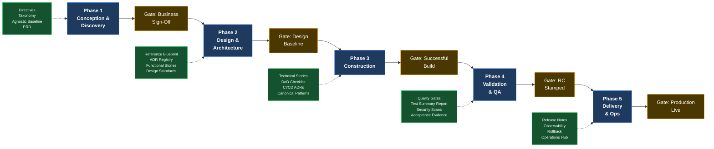

# SDLC–Evolith Artifact Mapping

> **Bilingual navigation:** [Versión en Español](./sdlc-evolith-artifact-mapping.es.md)
> **Owner:** Evolith Architecture Board
> **Status:** Active reference
> **Parent:** [Corporate SDLC Governance Center](./README.md)

---

## Purpose

The [Construction-Focused SDLC Framework](./02-engineering/construction-focused-sdlc-framework.md) defines five formal lifecycle phases and their exit gates. This document answers a different question: **at each phase, which Evolith artifacts are mandatory inputs, which are recommended, and what role does the platform play in that phase?**

Use this mapping to:

- Onboard a new product team and communicate exactly what must be consulted at each stage.
- Conduct Architecture Board gate reviews with a traceable artifact checklist.
- Identify gaps when a phase lacks required artifacts.
- Align technical teams, QA, Product, Operations, and Technology Directors around the same evidence model.

---

## How to Read This Document

| Symbol | Meaning |
|---|---|
| **Required** | Must be consulted or produced before the phase exit gate fires. Absence blocks the gate. |
| **Optional** | Recommended best practice; situational based on product complexity, team maturity, or evolutionary roadmap phase. |
| **Conditional** | Required only when the triggering condition applies, such as multi-tenancy, public APIs, regulated data, or production-critical flows. |

The five Evolith Compliance Baseline artifacts listed in Section 7 are **always required** regardless of phase. They are not repeated in every per-phase table.

---

## 1. Overview: Where Evolith Enters the Lifecycle

---

## 2. Phase 1 — Conception and Discovery

**Evolith role in this phase:** Establish the non-negotiable constraints before scope is frozen. Any product instantiation must align with the agnostic baseline, repository taxonomy, and topology selection framework before the Business Sign-Off gate fires.

**Exit gate:** Business Sign-Off — Scope Frozen

### Required Artifacts

| Artifact | Location | Why it is required |
|---|---|---|
| **Discovery Canvas** | [discovery-canvas-template.md](./04-artifact-templates/discovery-canvas-template.md) | Initiative registration, customer pain point, and expected value. At KDD Level 1+, inform this artifact from the Discovery Knowledge Brief. |
| **Technical Feasibility Canvas** | [technical-feasibility-template.md](./04-artifact-templates/technical-feasibility-template.md) | Technical feasibility, cloud quotas, and NFRs. |
| **Ballpark Estimation** | [ballpark-estimation-template.md](./04-artifact-templates/ballpark-estimation-template.md) | T-Shirt Sizing estimation of effort and team size. At KDD Level 2+, incorporate Story Seed Bank sizing. |
| **PRD — Product Requirements Document** | [prd-template.md](./04-artifact-templates/prd-template.md) | Captures scope, personas, goals, constraints, non-goals, and approval evidence. |
| **MoSCoW Prioritization Matrix** | [moSCoW template](./04-artifact-templates/ballpark-estimation-template.md) | MoSCoW analysis with at least one MUST item. At KDD Level 2+, derived from Epic Candidate Matrix. |
| **Build-versus-Compose Analysis** | [build-vs-compose.schema.json](../../../rulesets/schema/build-vs-compose.schema.json) | Adopt/Embed/Integrate/Extend/Build/Reject disposition per Product Vision §5.3. |

> **Evolith Compliance Baseline (§7):** Architectural Directives, Repository Taxonomy, Agnostic Baseline, ADR-0047, and Engineering Manifesto are cross-cutting standards governed by the Compliance Baseline. Consult them during Phase 1 but do not produce them here — they are already governed.

### Optional Artifacts

| Artifact | Location | When to Use |
|---|---|---|
| Evolutionary Strategy Roadmap | [evolutionary-strategy-roadmap.md](../standards/vision/evolutionary-strategy-roadmap.md) | When the product roadmap spans multiple Evolith phases. |
| Maturity Assessment | [maturity-assessment.md](../standards/vision/maturity-assessment.md) | When assessing a brownfield product or formal maturity position. |
| Architecture Communication Strategy | [architecture-communication-strategy.md](../standards/communication/architecture-communication-strategy.md) | When preparing stakeholder or executive architecture briefings. |
| UMS Reference Model | [ums-reference-model.md](../../knowledge/demo/ums-reference-model.md) | When the product operates in identity, access management, or multi-tenant authorization. |

### Subphase 01.1 — Knowledge-First Discovery (Optional)

| Artifact | Location | Level | When to Use |
|---|---|---|---|
| Discovery Knowledge Brief | [discovery-knowledge-brief-template.md](./04-artifact-templates/discovery-knowledge-brief-template.md) | 1+ | Any initiative where knowledge gaps could cause rework |
| Assumptions & Questions Log | [assumptions-questions-log-template.md](./04-artifact-templates/assumptions-questions-log-template.md) | 1+ | When assumptions need tracking and validation |
| Discovery Context Pack | [discovery-context-pack-template.md](./04-artifact-templates/discovery-context-pack-template.md) | 1+ | When AI agents or satellite repos need exportable context |
| Capability Map | [capability-map-template.md](./04-artifact-templates/capability-map-template.md) | 2+ | When domain decomposition is needed before epic planning |
| Epic Candidate Matrix | [epic-candidate-matrix-template.md](./04-artifact-templates/epic-candidate-matrix-template.md) | 2+ | When capabilities must be traced to epic candidates |
| Story Seed Bank | [story-seed-bank-template.md](./04-artifact-templates/story-seed-bank-template.md) | 2+ | When minimal story seeds are needed before backlog refinement |
| Discovery Readiness Gate | [discovery-readiness-gate-template.md](./04-artifact-templates/discovery-readiness-gate-template.md) | 3+ | When formal gate validation of knowledge sufficiency is required |

---

## 3. Phase 2 — Design and Architecture

**Evolith role in this phase:** Provide the canonical blueprint, ADR decision framework, and approved technology boundaries. Every major architectural decision must reference an existing Evolith ADR or produce a product-level ADR that extends it.

**Exit gate:** Design Baseline Approved

### Required Artifacts

| Artifact | Location | Why Required |
|---|---|---|
| **Reference Blueprint** | [reference-blueprint.md](../../architecture/blueprints/reference-blueprint.md) | Consult — not an artifact you produce. Gate F2 verifies that your architecture diagrams are traceable to it; deviations require ADRs. |
| **ADR-0002 — Hexagonal Architecture** | [ADR-0002](../../architecture/adrs/nodejs/0002-clean-architecture-nestjs.md) | Mandatory Ports and Adapters boundary. |
| **ADR-0018 — Testing Pyramid** | [ADR-0018](../../architecture/adrs/core/0018-testing-pyramid-quality-gates.md) | Test architecture and test-type distribution must be designed before validation. |
| **ADR-0031 — Schema-per-Context** | [ADR-0031](../../architecture/adrs/core/0031-schema-per-context-domain-event-catalog.md) | Bounded context schema boundaries must be decided before construction. |
| **ADR-0032 — Protocol Selection Matrix** | [ADR-0032](../../architecture/adrs/core/0032-api-protocol-decision-matrix-rest-grpc-graphql.md) | REST, gRPC, and GraphQL use must be resolved before API contracts are produced. |
| **ADR-0056 — Naming and Design Conventions** | [ADR-0056](../../architecture/adrs/core/0056-enterprise-naming-design-conventions.md) | Ubiquitous language and naming rules must be established before entity and endpoint naming. |
| **ADR-0045 — Extraction Readiness Criteria** | [ADR-0045](../../architecture/adrs/core/0045-microservice-extraction-readiness-criteria.md) | Required — satellites declaring F2 must document their Extraction Readiness Score (≥70%). Enforced by satellite contract rule SVC-04. |
| **Functional Stories** | [functional-story-template.md](./04-artifact-templates/functional-story-template.md) | BDD-ready stories in Ready state, traceable to PRD. Use Functional Story Template as authoring format and Functional Story Writing Standard as quality guide. If Story Seeds exist from Phase 1.1 KDD Level 2+, refine them into Functional Stories here. |
| **Simplicity Checklist Phase 1** | [simplicity-checklist-phase-01.md](../../architecture/blueprints/simplicity-checklist-phase-01.md) | Despite the 'Phase 1' name, this checklist runs during Phase 2. Its purpose: verify no premature over-engineering enters the design baseline. The artifact identifier is registered in the machine validator — do not rename it. |
| **Evolith User Story** | [evolith-user-story-template.md](./04-artifact-templates/evolith-user-story-template.md) | Atomic story definition with BDD criteria. Produced after Functional Stories are defined. |
| **Agile Backlog** | [agile-backlog-template.md](./04-artifact-templates/agile-backlog-template.md) | Refined backlog produced from Functional Stories. |
| **CLI Impact Analysis** | [cli-impact-analysis.md](./04-artifact-templates/cli-impact-analysis.md) | Required CLI capabilities once design is baselined. |

### Topology Declaration and Validation

Phase 2 implies a specific progressive topology. The following actions are required before the Design Baseline gate can be evaluated:

| Action | Mechanism | Where Declared |
|--------|-----------|----------------|
| Declare topology phase | Set `metadata.phase: F2` in `evolith.yaml` | Satellite repository root |
| Validate topology rules | `evolith validate --topology distributed-modules` | CLI |
| Document topology choice | ADR referencing ADR-0047 and ADR-0045 | ADR Registry |

**F2 Topology — Distributed Modules (8 mandatory rules):**

| Rule ID | Category | Requirement |
|---------|----------|-------------|
| DM-R01 | module-autonomy | Each module owns its CI/CD lifecycle independently |
| DM-R02 | contract-stability | Inter-module contracts are explicit and versioned |
| DM-R03 | data-ownership | Each module owns its data — no shared schema |
| DM-R04 | async-communication | Async events carry schema-validated payloads |
| DM-R05 | observability | Distributed tracing follows W3C TraceContext across modules |
| DM-R06 | deployment | Modules are independently deployable |
| DM-R07 | resiliency | Circuit breaker governs all inter-module calls |
| DM-R08 | extraction-readiness | Extraction Readiness Score maintained (≥80% to advance to F3) |

**Composable dimensions (optional, declare in evolith.yaml):** `event-driven` · `data-mesh` · `serverless` · `edge-computing` · `agentic-ai`

### Supporting Artifacts (consult or follow — not gate evidence)

| Artifact | Location | Why Consulted |
|---|---|---|
| **Functional Story Writing Standard** | [functional-story-writing-standard.md](./03-documentation/functional-story-writing-standard.md) | Quality guide for Functional Stories — not produced as gate evidence. |
| **SDLC Documentation Best Practices** | [sdlc-documentation-best-practices.md](./03-documentation/sdlc-documentation-best-practices.md) | Governs how design artifacts are produced, versioned, and reviewed. |
| **Authoritative Tech Stack** | [authoritative-tech-stack.md](../../architecture/blueprints/authoritative-tech-stack.md) | Only approved technologies may be introduced unless a new ADR is approved. |
| **ADR Decision Matrix** | [adr-matrix.md](../../architecture/adrs/adr-matrix.md) | Prevents duplicate or contradictory architecture decisions. |

### Optional or Conditional Artifacts

| Artifact | Location | When to Use |
|---|---|---|
| ADR-0010 — Multi-Tenancy | [ADR-0010](../../architecture/adrs/core/0010-multi-tenancy-architecture-strategy.md) | Conditional: required when the product serves multiple tenants. |
| ADR-0076 — DOMA | [ADR-0076](../../architecture/adrs/core/0076-domain-oriented-microservice-architecture.md) | Conditional: required when F3 topology is in scope. Each service must map to exactly one bounded context. |
| C4 Topology Spec | [c4-topology-spec.md](../../architecture/blueprints/c4-topology-spec.md) | When producing formal C4 diagrams. |
| CAP Strategic Analysis | [cap-strategic-analysis.md](../../architecture/blueprints/cap-strategic-analysis.md) | When making explicit consistency vs. availability tradeoffs. |
| Observability Architecture Flow | [observability-architecture-flow.md](../../architecture/blueprints/observability-architecture-flow.md) | When designing distributed tracing and log aggregation. |
| Canonical Patterns | [canonical-patterns](../../architecture/canonical-patterns/README.md) | When adopting runtime-specific reference implementations. |
| UMS Technical Overview | [ums-technical-overview.md](../../knowledge/demo/ums-technical-overview.md) | When identity or authorization patterns from UMS are directly applicable. |

### Recommended ADR Consultation Order

| Step | ADR | Why first |
|------|-----|-----------|
| 1 | ADR-0056 — Naming and Design Conventions | Establishes ubiquitous language for all artifacts |
| 2 | ADR-0047 — Modular Monolith Selection | Confirms F1→F2 progression is justified |
| 2 | ADR-0045 — Extraction Readiness Criteria | Quantifies readiness score (≥70% for F2) |
| 3 | ADR-0002 — Hexagonal Architecture | Foundational port/adapter boundary |
| 4 | ADR-0031 — Schema-per-Context | Governs module data isolation (DM-R03) |
| 4 | ADR-0032 — Protocol Selection Matrix | Governs inter-module contracts (DM-R02) |
| 5 | ADR-0018 — Testing Pyramid | Defines test strategy before stories are marked Ready |
| C | ADR-0010 — Multi-Tenancy | Required if multi-tenant |
| C | ADR-0076 — DOMA | Required if F3 topology in roadmap |

### Recommended Execution Order within Phase 2

| Step | Activity | Output |
|------|----------|--------|
| 0 | Verify Phase 1 gate APPROVED; confirm evolith.yaml `metadata.phase: F2` | Pre-conditions met |
| 1 | Consult ADR-0056; establish ubiquitous language; initialize ADR Registry | ADR Registry started |
| 2 | Assess Extraction Readiness (ADR-0045 ≥70%); confirm ADR-0047 progression justified | Score documented |
| 3 | Confirm ADR-0002; run Simplicity Checklist Phase 1 | Architecture baseline |
| 4 | Produce Bounded Context Map (DDD Model Template); apply ADR-0031 + ADR-0032 | Bounded Context Map |
| 5 | Refine Story Seeds → Functional Stories (KDD L2+) or write from scratch; decompose → User Stories; organize Agile Backlog | Functional Stories, Backlog |
| 6 | Document boundary decisions as ADRs; complete CLI Impact Analysis; consult ADR-0018; verify Blueprint Alignment | ADR Registry (complete) |
| 7 | Run `evolith validate --topology distributed-modules` — all 8 DM rules must pass | Topology validation |
| 8 | (Conditional) Validate DOMA if F3 topology in roadmap (ADR-0076) | DOMA compliance |
| 9 | Gate F2 Review: ADR completeness, story readiness, blueprint alignment, simplicity, topology rules | APPROVED / BLOCKED / WAIVED |

---

## 4. Phase 3 — Construction

**Evolith role in this phase:** Enforce code quality, architectural boundaries, and the Definition of Done on every pull request. The construction inner loop is governed by the Construction-Focused SDLC Framework.

**Exit gate:** Successful Build — PR Merge Authorized

### Required Artifacts

| Artifact | Location | Why Required |
|---|---|---|
| **Technical Stories** | [technical-story-template.md](./04-artifact-templates/technical-story-template.md) | Breaks Functional Stories into implementation units with technical acceptance criteria and DoD evidence. Each must carry a `functionalStoryRef` linking to a Phase 2 Functional Story. |
| **Engineering Manifesto** | [engineering-manifesto.md](../standards/engineering/engineering-manifesto.md) | Governs SOLID, DRY, KISS, YAGNI, anti-patterns, and PR discipline. |
| **Construction-Focused SDLC Framework — §3 and §4** | [construction-focused-sdlc-framework.md](./02-engineering/construction-focused-sdlc-framework.md) | Defines construction loop, threshold metrics, and DoD checklist. |
| **SDLC Quality Gates** | [quality-gates.md](./quality-gates.md) | Defines the canonical release-blocking threshold baseline: coverage >= 80%, complexity <= 15, zero high/critical CVEs, tech debt < 5%. |
| **ADR-0005 — CI/CD Pipeline** | [ADR-0005](../../architecture/adrs/core/0005-automated-sast-quality-gates.md) | No merge is authorized without passing CI, linting, testing, and security scanning. |
| **ADR-0018 — Testing Pyramid Quality Gates** | [ADR-0018](../../architecture/adrs/core/0018-testing-pyramid-quality-gates.md) | Defines target test distribution: 70% unit / 20% integration / 10% E2E. Coverage blocking threshold is governed by SDLC Quality Gates. |
| **ADR-0049 — Naming Semantics and Clean Code** | [ADR-0049](../../architecture/adrs/core/0049-naming-semantics-clean-code-policy.md) | Naming discipline is validated from the first commit. |
| **ADR-0050 — GitFlow Branching Strategy** | [ADR-0050](../../architecture/adrs/core/0050-gitflow-branching-strategy.md) | Branch naming, merge policies, and release tagging are contractual. Alternatives require explicit ADR exception. |
| **SDLC Documentation Best Practices** | [sdlc-documentation-best-practices.md](./03-documentation/sdlc-documentation-best-practices.md) | Documentation delta is part of the DoD. |
| **Canonical Patterns** | [canonical-patterns](../../architecture/canonical-patterns/README.md) | Runtime-specific implementations must follow governed ADR patterns. |

### Optional or Conditional Artifacts

| Artifact | Location | When to Use |
|---|---|---|
| Contract Testing Guideline | [contract-testing-guideline.md](../standards/engineering/contract-testing-guideline.md) | Conditional: when the product exposes or consumes inter-service contracts. |
| Vendor Risk Assessment | [vendor-risk-assessment.md](../standards/engineering/vendor-risk-assessment.md) | When introducing a new third-party library or service. |
| ADR-0019 — Tactical DDD Primitives | [ADR-0019](../../architecture/adrs/core/0019-tactical-design-patterns-future-proofing.md) | When applying Aggregates, Value Objects, Domain Events, or similar tactical DDD patterns. |
| ADR-0033 — Transactional Outbox | [ADR-0033](../../architecture/adrs/core/0033-transactional-outbox-pattern.md) | When implementing reliable asynchronous event dispatch. |
| ADR-0034 — CQRS Applicability | [ADR-0034](../../architecture/adrs/core/0034-cqrs-pattern-applicability-matrix.md) | When applying command/query separation. |
| ADR-0035 — Distributed Sagas | [ADR-0035](../../architecture/adrs/core/0035-distributed-saga-pattern-strategy.md) | When implementing multi-step workflows with compensating transactions. |
| AI Architecture Assistant | [AI Architecture Assistant](../standards/ai-augmented/08-architecture-ai-assistant/README.md) | When the team operates under an AI-augmented engineering workflow. |
| UMS Reference Model | [ums-reference-model.md](../../knowledge/demo/ums-reference-model.md) | Concrete implementation reference for .NET, hexagonal boundaries, bounded contexts, and RLS. |

---

## 5. Phase 4 — Validation and QA

**Evolith role in this phase:** Define the mandatory quality thresholds that the release candidate must satisfy. The SDLC Quality Gates document is the canonical threshold source. ADR-0018 governs target test distribution.

**Exit gate:** RC Stamped

### Gate Evidence (block the RC Stamp gate)

| Artifact | File / System | Validation |
|---|---|---|
| Test Summary Report | [test-summary-report-template.md](./04-artifact-templates/test-summary-report-template.md) | All quality gates green or waived; RC stamped by QA Lead and Tech Lead |
| Acceptance Validation | `.evolith/acceptance-validation.json` | Product Owner signs off on acceptance criteria verification |
| Security Scan Report | [security-scan-report-template.md](./04-artifact-templates/security-scan-report-template.md) | Zero High/Critical CVEs; structure conforms to security-scan-report.schema.json |
| Integration Evidence | [integration-evidence-template.md](./04-artifact-templates/integration-evidence-template.md) | Every declared contract exercised; no FAIL entries without waiver; integration-evidence.schema.json |
| Pyramid Distribution | `coverage/coverage-summary.json` | 70% unit / 20% integration / 10% E2E target met or deviation explained |

> **Blocking criteria notes:**
> - "Any mandatory quality metric fails" → proxy: coverage-summary.json ≥ 80%
> - "Technical debt ratio exceeds 5%" → requires tech-debt-report.json (format pending definition)
> - "Acceptance criteria remain unverified" → verifies .evolith/acceptance-validation.json exists

### Quality Thresholds

Phase 4 applies all 8 rules from `quality-thresholds.rules.json`. The OPA rulesets `sdlc/pyramid-distribution.rego` (±10pp tolerance on 70/20/10 target) and `sdlc/coverage.rego` (≥80%) execute automatically via `evolith gate evaluate --phase qa`.

### Framework Documents (consult and follow)

| Artifact | Location | Why Consulted |
|---|---|---|
| **SDLC Quality Gates** | [quality-gates.md](./quality-gates.md) | Mathematical gate: coverage >= 80%, cyclomatic complexity <= 15, zero high/critical CVEs, tech debt ratio < 5%. |
| **ADR-0018 — Testing Pyramid Quality Gates** | [ADR-0018](../../architecture/adrs/core/0018-testing-pyramid-quality-gates.md) | Defines the target test distribution: 70% unit / 20% integration / 10% E2E. |
| **ADR-0052 — Unit Testing Isolation Strategy** | [ADR-0052](../../architecture/adrs/core/0052-unit-testing-isolation-strategy.md) | Governs mock and stub discipline. |
| **ADR-0053 — Integration and E2E Testing Strategy** | [ADR-0053](../../architecture/adrs/core/0053-integration-e2e-testing-strategy.md) | Defines Testcontainers-based integration testing and E2E scope. |
| **Contract Testing Guideline** | [contract-testing-guideline.md](../standards/engineering/contract-testing-guideline.md) | Conditional: required when the product exposes inter-service contracts. |

### Optional Artifacts

| Artifact | Location | When to Use |
|---|---|---|
| ADR-0037 — Performance and Chaos Verification | [ADR-0037](../../architecture/adrs/core/0037-performance-concurrency-chaos-strategy.md) | When validation includes load, stress, performance, or chaos scenarios. |
| Vendor Risk Assessment | [vendor-risk-assessment.md](../standards/engineering/vendor-risk-assessment.md) | When validation includes a third-party dependency audit. |
| Observability Architecture Flow | [observability-architecture-flow.md](../../architecture/blueprints/observability-architecture-flow.md) | When validating telemetry, structured logs, and production coverage specification. |
| UMS Architecture Portal | https://github.com/beyondnetcode/ums/blob/main/docs/architecture/index.md | Reference for a real .NET product applying Evolith testing guidance. |

---

## 6. Phase 5 — Delivery and Operations

**Evolith role in this phase:** Specify mandatory observability stack, infrastructure topology, deployment evidence, and rollback readiness. Production Live is validated against monitoring nominality and release evidence.

**Exit gate:** Production Live — Monitoring Nominal

### Required Artifacts

| Artifact | Location | Why Required |
|---|---|---|
| **Release Notes Template** | [release-notes-template.md](./04-artifact-templates/release-notes-template.md) | Captures release scope, deployment steps, rollback procedure, observability checklist, and links to RC evidence. |
| **ADR-0007 — OTel and Loki Observability** | [ADR-0007](../../architecture/adrs/nodejs/0007-observability-telemetry-loki-opentelemetry.md) | Distributed tracing and structured logging are mandatory in every production deployment. |
| **ADR-0013 — Cloud Topology and DR** | [ADR-0013](../../architecture/adrs/core/0013-cloud-infrastructure-topology-dr.md) | Defines target deployment topology and disaster recovery runbook. |
| **ADR-0005 — CI/CD Pipeline** | [ADR-0005](../../architecture/adrs/core/0005-automated-sast-quality-gates.md) | Deployment pipeline must enforce the same quality gates in the delivery path. |
| **Operations Hub** | [Operations Hub](../../operations/README.md) | Observability deployment specification and runbooks. |
| **Infrastructure Hub** | [Infrastructure Hub](../../infrastructure/README.md) | Infrastructure provisioning specifications. |
| **SDLC Documentation Best Practices** | [sdlc-documentation-best-practices.md](./03-documentation/sdlc-documentation-best-practices.md) | Release notes and deployment runbooks must be versioned with the release. |

### Optional Artifacts

| Artifact | Location | When to Use |
|---|---|---|
| ADR-0011 — Resiliency Patterns | [ADR-0011](../../architecture/adrs/core/0011-fault-tolerance-resiliency-patterns.md) | When production includes circuit breakers, bulkheads, retry policies, or fallback strategies. |
| ADR-0017 — Feature Flagging Strategy | [ADR-0017](../../architecture/adrs/core/0017-feature-flagging-strategy.md) | When using gradual rollout, dark launches, or runtime-controlled exposure. |
| ADR-0028 — Self-Hosted OSS Infrastructure | [ADR-0028](../../architecture/adrs/core/0028-self-hosted-hybrid-infrastructure-on-premise.md) | When deploying on-premise or hybrid cloud. |
| ADR-0046 — Dapr Unified Observability | [ADR-0046](../../architecture/adrs/core/0046-unified-observability-tracecontext.md) | When Dapr is active and sidecar observability must be unified. |
| Multi-Cloud Deployment Scenarios | [multi-cloud-deployment-scenarios.md](../../architecture/blueprints/multi-cloud-deployment-scenarios.md) | When the production target spans multiple cloud providers. |
| Observability Architecture Flow | [observability-architecture-flow.md](../../architecture/blueprints/observability-architecture-flow.md) | When building or validating Grafana, Loki, Tempo, and OTel Collector pipelines. |

---

## 7. Cross-Cutting Artifacts — Always Required

These five artifacts constitute the **Evolith Compliance Baseline**. They are not phase-specific — they govern the entire lifecycle and must be in effect from the first artifact produced to the last deployment executed.

| # | Artifact | Location | Constraint |
|---|---|---|---|
| 1 | **Agnostic Baseline** | [authoritative-tech-stack-agnostic.md](../../architecture/blueprints/authoritative-tech-stack-agnostic.md) | No technology decision may violate this baseline. |
| 2 | **Reference Architecture (Blueprint)** | [reference-blueprint.md](../../architecture/blueprints/reference-blueprint.md) | All product architectures are measured against this blueprint. |
| 3 | **Engineering Manifesto** | [engineering-manifesto.md](../standards/engineering/engineering-manifesto.md) | Sets engineering principles that govern code and team behavior. |
| 4 | **Definition of Done** | [construction-focused-sdlc-framework.md](./02-engineering/construction-focused-sdlc-framework.md) | Applies to every iteration, sprint, and phase transition. |
| 5 | **Repository Taxonomy** | [repository-taxonomy.md](../standards/repository-taxonomy.md) | Naming, structure, and taxonomy rules apply from repository creation. |

---

## 8. Consolidated Compliance Matrix

The following matrix provides a one-page view of artifact density per phase. An artifact marked **R** is Required; **O** is Optional; **C** is Conditional.

| Artifact | Ph 1 | Ph 2 | Ph 3 | Ph 4 | Ph 5 |
|---|:---:|:---:|:---:|:---:|:---:|
| PRD | **R** | — | — | — | — |
| Discovery Canvas | **R** | — | — | — | — |
| Technical Feasibility Canvas | **R** | — | — | — | — |
| Ballpark Estimation | **R** | — | — | — | — |
| MoSCoW Prioritization Matrix | **R** | — | — | — | — |
| Build-versus-Compose Analysis | **R** | — | — | — | — |
| Evolith User Story | — | **R** | — | — | — |
| Agile Backlog | — | **R** | — | — | — |
| CLI Impact Analysis | — | **R** | — | — | — |
| Architectural Directives | — | — | — | — | — |
| Agnostic Baseline | — | — | — | — | — |
| Repository Taxonomy | — | — | — | — | — |
| ADR-0047 — Modular Monolith | — | O | — | — | — |
| Engineering Manifesto | — | — | — | — | — |
| Functional Stories | O | **R** | — | — | — |
| Reference Blueprint | — | **R** | **R** | — | — |
| Authoritative Tech Stack | — | **R** | **R** | — | — |
| ADR Decision Matrix | — | **R** | **R** | — | — |
| ADR-0002 — Hexagonal Architecture | — | **R** | **R** | — | — |
| ADR-0010 — Multi-Tenancy | — | C | C | C | — |
| ADR-0045 — Extraction Readiness | — | **R** | — | — | — |
| ADR-0076 — DOMA | — | C | — | — | — |
| ADR-0018 — Testing Pyramid | — | **R** | **R** | **R** | — |
| F2 Topology Declaration (evolith.yaml) | — | **R** | — | — | — |
| SDLC Quality Gates | — | — | **R** | **R** | **R** |
| Technical Story Template | — | — | **R** | — | — |
| ADR-0005 — CI/CD Pipeline | — | — | **R** | **R** | **R** |
| ADR-0050 — GitFlow Branching | — | — | **R** | — | — |
| Test Summary Report | — | — | — | **R** | — |
| Acceptance Validation | — | — | — | **R** | — |
| Security Scan Report | — | — | — | **R** | — |
| Integration Evidence | — | — | — | **R** | — |
| Pyramid Distribution | — | — | — | **R** | — |
| Release Notes | — | — | — | — | **R** |
| Operations Hub | — | — | — | — | **R** |
| Infrastructure Hub | — | — | — | — | **R** |
| UMS Technical Overview / Reference | O | O | O | O | — |

> ADR-0010 is conditional: required whenever the product is multi-tenant. Single-tenant products may defer.

---

## 9. Related Documents

| Document | Purpose |
|---|---|
| [Corporate SDLC Governance Center](./README.md) | Main SDLC phase hub and navigation page. |
| [Executive View for Technology Directors](./executive-view.md) | Director-level SDLC operating model. |
| [SDLC Quality Gates](./quality-gates.md) | Canonical quality thresholds and waiver policy. |
| [SDLC Responsibility Matrix](./responsibility-matrix.md) | Gate accountability and role expectations. |
| [SDLC Traceability Model](./traceability-model.md) | End-to-end evidence chain from PRD to production. |
| [Construction-Focused SDLC Framework](./02-engineering/construction-focused-sdlc-framework.md) | Phase definitions, construction loop, and DoD conditions. |
| [SDLC Documentation Best Practices](./03-documentation/sdlc-documentation-best-practices.md) | How artifacts produced at each phase must be written and versioned. |
| [Artifact Templates Hub](./04-artifact-templates/README.md) | Official blank templates and UMS worked examples. |
| [Architecture Hub](../../architecture/README.md) | Entry point to the full ADR Registry, blueprints, and canonical patterns. |
| [Getting Started by Role](../../getting-started/README.md) | Role-specific reading paths that align with lifecycle phases. |

---

  Evolith — Enterprise Architecture Platform | SDLC Artifact Mapping

