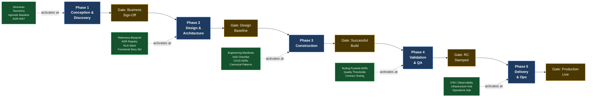

# SDLC–Evolith Artifact Mapping

> **Bilingual navigation:** [Versión en Español](./sdlc-evolith-artifact-mapping.es.md)
> **Owner:** Evolith Architecture Board
> **Status:** Active reference
> **Parent:** [Corporate SDLC Governance Center](./README.md)

---

## Purpose

The [Construction-Focused SDLC Framework](./02-engineering/construction-focused-sdlc-framework.md) defines five formal lifecycle phases and their exit gates. This document answers a different question: **at each of those phases, which Evolith artifacts are mandatory inputs, which are recommended, and what role does the platform play in that phase?**

Use this mapping to:

- Onboard a new product team and communicate exactly what they must consult at each stage
- Conduct Architecture Board gate reviews with a traceable artifact checklist
- Identify gaps in coverage when a phase lacks the artifacts it requires

---

## How to Read This Document

| Symbol | Meaning |
|---|---|
| **Required** | Must be consulted or produced before the phase exit gate fires. Absence blocks the gate. |
| **Optional** | Recommended best practice; situational based on product complexity, team maturity, or phase of the evolutionary roadmap. |

The five Evolith Compliance Baseline artifacts — listed in Section 5 — are **always required** regardless of phase. They are not repeated in the per-phase tables.

---

## 1. Overview: Where Evolith Enters the Lifecycle

---

## 2. Phase 1 — Conception and Discovery

**Evolith role in this phase:** Establish the non-negotiable constraints *before* scope is frozen. Any product instantiation must align with the agnostic baseline and the topology selection framework before the Business Sign-Off gate fires. This phase is where the team learns what they are and are not allowed to decide.

**Exit gate:** Business Sign-Off — Scope Frozen

### Required Artifacts

| Artifact | Location | Why Required |
|---|---|---|
| **Architectural Directives** | [reference/governance/standards/vision/architectural-directives.md](../standards/vision/architectural-directives.md) | Establishes non-negotiable constraints (Hexagonal, no premature extraction, Zero-Trust from Phase 1) that bound the entire product scope. Must be read before any scope decision is made. |
| **Repository Taxonomy** | [reference/governance/standards/repository-taxonomy.md](../standards/repository-taxonomy.md) | Defines monorepo structure, naming prefixes, and artifact classification before any file or module is created. |
| **Agnostic Baseline** | [reference/architecture/blueprints/authoritative-tech-stack-agnostic.md](../../architecture/blueprints/authoritative-tech-stack-agnostic.md) | Defines the technology-neutral baseline that every product must conform to. No technology outside this boundary can be introduced without a new ADR. |
| **ADR-0047 — Modular Monolith Selection** | [reference/architecture/adrs/core/0047-architectural-patterns-monolith-soa-microservices.md](../../architecture/adrs/core/0047-architectural-patterns-monolith-soa-microservices.md) | Confirms the mandated starting topology (Modular Monolith). Scope cannot be frozen on a microservices architecture unless the extraction criteria in ADR-0045 are already satisfied. |
| **Engineering Manifesto** | [reference/governance/standards/engineering/engineering-manifesto.md](../standards/engineering/engineering-manifesto.md) | Sets team engineering expectations — SOLID, DRY, anti-patterns, PR standards — before any development contract is written. |

### Optional Artifacts

| Artifact | Location | When to Use |
|---|---|---|
| Evolutionary Strategy Roadmap | [reference/governance/standards/vision/evolutionary-strategy-roadmap.md](../standards/vision/evolutionary-strategy-roadmap.md) | When the product roadmap spans multiple Evolith phases (Phase 1 MVP through Phase 3 North Star). Use for executive planning and timeline alignment. |
| Maturity Matrix | [reference/governance/standards/vision/maturity-matrix.md](../standards/vision/maturity-matrix.md) | When performing a formal TOGAF ACMM positioning of the starting state. Useful for brownfield products migrating onto the Evolith baseline. |
| Functional Story Writing Standard | [reference/governance/sdlc/03-documentation/functional-story-writing-standard.md](./03-documentation/functional-story-writing-standard.md) | When the product team will produce PRDs or functional stories during Conception. Recommended for teams new to the Evolith documentation model. |
| Architecture Communication Strategy | [reference/governance/standards/communication/architecture-communication-strategy.md](../standards/communication/architecture-communication-strategy.md) | When preparing stakeholder presentations or executive briefings on the architecture vision. |
| UMS Reference Model | [reference/knowledge/demo/ums-reference-model.md](../../knowledge/demo/ums-reference-model.md) | When the product operates in the identity, access management, or multi-tenant authorization domain and UMS patterns are directly applicable. |

---

## 3. Phase 2 — Design and Architecture

**Evolith role in this phase:** Provide the canonical blueprint, the ADR decision framework, and the approved technology boundaries. Every major architectural decision in this phase must either reference an existing Evolith ADR or produce a new product-level ADR that extends it. The Reference Blueprint is the starting point, not a blank page.

**Exit gate:** Design Baseline Approved

### Required Artifacts

| Artifact | Location | Why Required |
|---|---|---|
| **Reference Blueprint** | [reference/architecture/blueprints/reference-blueprint.md](../../architecture/blueprints/reference-blueprint.md) | The canonical C4 architectural model. All product architecture diagrams must be traceable to this blueprint. |
| **Authoritative Tech Stack** | [reference/architecture/blueprints/authoritative-tech-stack.md](../../architecture/blueprints/authoritative-tech-stack.md) | Only technologies on this list may be introduced. Additions require a new ADR with Architecture Board sign-off before Design Baseline can be approved. |
| **ADR Decision Matrix** | [reference/architecture/adrs/adr-matrix.md](../../architecture/adrs/adr-matrix.md) | Must be consulted before creating any new ADR to confirm the decision is not already resolved. Prevents duplicate or contradictory decisions. |
| **ADR-0002 — Hexagonal Architecture** | [reference/architecture/adrs/nodejs/0002-clean-architecture-nestjs.md](../../architecture/adrs/nodejs/0002-clean-architecture-nestjs.md) | Mandatory architectural boundary. Ports and Adapters structure must be reflected in the design from day one. |
| **ADR-0018 — Testing Pyramid** | [reference/architecture/adrs/core/0018-testing-pyramid-quality-gates.md](../../architecture/adrs/core/0018-testing-pyramid-quality-gates.md) | The test architecture must be designed in this phase. Coverage thresholds and test-type distribution are contractual, not retrospective. |
| **ADR-0031 — Schema-per-Context** | [reference/architecture/adrs/core/0031-schema-per-context-domain-event-catalog.md](../../architecture/adrs/core/0031-schema-per-context-domain-event-catalog.md) | Cross-schema SQL joins are architecturally prohibited. Bounded context schema boundaries must be decided in the design phase. |
| **ADR-0032 — Protocol Selection Matrix** | [reference/architecture/adrs/core/0032-api-protocol-decision-matrix-rest-grpc-graphql.md](../../architecture/adrs/core/0032-api-protocol-decision-matrix-rest-grpc-graphql.md) | REST, gRPC, and GraphQL usage must be resolved before API contracts are produced. |
| **ADR-0056 — Naming and Design Conventions** | [reference/architecture/adrs/core/0056-enterprise-naming-design-conventions.md](../../architecture/adrs/core/0056-enterprise-naming-design-conventions.md) | Ubiquitous language and naming rules must be established before entity and endpoint naming is finalized. |
| **Functional Story Writing Standard** | [reference/governance/sdlc/03-documentation/functional-story-writing-standard.md](./03-documentation/functional-story-writing-standard.md) | All functional stories produced in this phase must conform to this standard before the Design Baseline gate can be approved. |
| **SDLC Documentation Best Practices** | [reference/governance/sdlc/03-documentation/sdlc-documentation-best-practices.md](./03-documentation/sdlc-documentation-best-practices.md) | Governs how all design artifacts — blueprints, ADRs, schemas — are produced, versioned, and reviewed. |
| **Simplicity Checklist Phase 1** | [reference/architecture/blueprints/simplicity-checklist-phase-01.md](../../architecture/blueprints/simplicity-checklist-phase-01.md) | Gates against over-engineering. Must be signed off before the Design Baseline is approved to prevent premature complexity. |

### Optional Artifacts

| Artifact | Location | When to Use |
|---|---|---|
| C4 Topology Spec | [reference/architecture/blueprints/c4-topology-spec.md](../../architecture/blueprints/c4-topology-spec.md) | When producing formal C4 diagrams (Context, Container, Component, Code) as part of the design deliverable. |
| CAP Strategic Analysis | [reference/architecture/blueprints/cap-strategic-analysis.md](../../architecture/blueprints/cap-strategic-analysis.md) | When making explicit consistency vs. availability tradeoffs at the database or event bus layer. |
| Observability Architecture Flow | [reference/architecture/blueprints/observability-architecture-flow.md](../../architecture/blueprints/observability-architecture-flow.md) | When designing the distributed tracing and log aggregation topology. |
| Multi-Cloud Deployment Scenarios | [reference/architecture/blueprints/multi-cloud-deployment-scenarios.md](../../architecture/blueprints/multi-cloud-deployment-scenarios.md) | When the product must support more than one cloud provider from Phase 1. |
| ADR-0010 — Multi-Tenancy Dual-Layer Strategy | [reference/architecture/adrs/core/0010-multi-tenancy-architecture-strategy.md](../../architecture/adrs/core/0010-multi-tenancy-architecture-strategy.md) | Required when the product serves multiple tenants. Becomes mandatory for multi-tenant products. |
| ADR-0045 — Extraction Readiness Criteria | [reference/architecture/adrs/core/0045-microservice-extraction-readiness-criteria.md](../../architecture/adrs/core/0045-microservice-extraction-readiness-criteria.md) | When the roadmap includes planned microservice extraction. Defines quantitative triggers so extraction boundaries can be designed in advance. |
| Canonical Patterns | [reference/architecture/canonical-patterns/README.md](../../architecture/canonical-patterns/README.md) | When adopting runtime-specific reference implementations. Use to accelerate design decisions with proven patterns. |
| UMS Technical Overview | [reference/knowledge/demo/ums-technical-overview.md](../../knowledge/demo/ums-technical-overview.md) | When the product is in the identity or authorization domain and UMS bounded context patterns are directly applicable. |
| Visual Architecture Backlog | [reference/governance/standards/communication/visuals/README.md](../standards/communication/visuals/README.md) | When producing visual artifacts (executive one-pager, progressive journey map, onboarding diagrams) for architecture communication. |

---

## 4. Phase 3 — Construction

**Evolith role in this phase:** Enforce code quality, architectural boundaries, and the Definition of Done on every pull request. The Engineering Manifesto, the DoD checklist, and the CI/CD pipeline configuration are the primary enforcement instruments. The construction inner loop (Env Prep → Domain Code → Unit Tests → Integration → CI Scan → Peer Review) is governed by the Construction-Focused SDLC Framework.

**Exit gate:** Successful Build — PR Merge Authorized

### Required Artifacts

| Artifact | Location | Why Required |
|---|---|---|
| **Engineering Manifesto** | [reference/governance/standards/engineering/engineering-manifesto.md](../standards/engineering/engineering-manifesto.md) | SOLID, DRY, KISS, YAGNI, and the explicit anti-patterns list govern every line of code. Code reviews cite this document when blocking a PR. |
| **Construction-Focused SDLC Framework — §3 and §4** | [reference/governance/sdlc/02-engineering/construction-focused-sdlc-framework.md](./02-engineering/construction-focused-sdlc-framework.md) | The inner construction loop (§3.1), quality threshold metrics (§3.2), and the Definition of Done checklist (§4) are non-negotiable gate conditions. |
| **ADR-0005 — CI/CD Pipeline (CodeQL)** | [reference/architecture/adrs/core/0005-ci-cd-quality-codeql.md](../../architecture/adrs/core/0005-ci-cd-quality-codeql.md) | Mandatory automated pipeline. No merge is authorized without a passing CI run that includes linting, testing, and security scanning. |
| **ADR-0018 — Testing Pyramid Quality Gates** | [reference/architecture/adrs/core/0018-testing-pyramid-quality-gates.md](../../architecture/adrs/core/0018-testing-pyramid-quality-gates.md) | The 70% minimum code coverage threshold is enforced in CI. Builds below this threshold are blocked. |
| **ADR-0049 — Naming Semantics and Clean Code** | [reference/architecture/adrs/core/0049-naming-semantics-clean-code-policy.md](../../architecture/adrs/core/0049-naming-semantics-clean-code-policy.md) | Naming discipline is validated from the first commit via automated linting. |
| **ADR-0050 — GitFlow Branching Strategy** | [reference/architecture/adrs/core/0050-gitflow-branching-strategy.md](../../architecture/adrs/core/0050-gitflow-branching-strategy.md) | Branch naming, merge policies, and release tagging are contractual. |
| **SDLC Documentation Best Practices** | [reference/governance/sdlc/03-documentation/sdlc-documentation-best-practices.md](./03-documentation/sdlc-documentation-best-practices.md) | No feature code merges to stable branches without its corresponding documentation delta. Documentation is part of the DoD. |
| **Canonical Patterns** | [reference/architecture/canonical-patterns/README.md](../../architecture/canonical-patterns/README.md) | Runtime-specific reference implementations that must be followed when implementing the patterns governed by the relevant ADRs. |

### Optional Artifacts

| Artifact | Location | When to Use |
|---|---|---|
| Contract Testing Guideline | [reference/governance/standards/engineering/contract-testing-guideline.md](../standards/engineering/contract-testing-guideline.md) | When the product exposes or consumes inter-service contracts (REST OpenAPI, gRPC Protobuf, AsyncAPI). |
| Vendor Risk Assessment | [reference/governance/standards/engineering/vendor-risk-assessment.md](../standards/engineering/vendor-risk-assessment.md) | When introducing a new third-party library or service not already in the Authoritative Tech Stack. |
| ADR-0019 — Tactical DDD Primitives | [reference/architecture/adrs/core/0019-tactical-design-patterns-future-proofing.md](../../architecture/adrs/core/0019-tactical-design-patterns-future-proofing.md) | When applying tactical DDD patterns (Aggregates, Value Objects, Domain Events). Only use where domain complexity justifies it per the Engineering Manifesto §2. |
| ADR-0033 — Transactional Outbox | [reference/architecture/adrs/core/0033-transactional-outbox-pattern.md](../../architecture/adrs/core/0033-transactional-outbox-pattern.md) | When implementing reliable asynchronous event dispatch. |
| ADR-0034 — CQRS Applicability | [reference/architecture/adrs/core/0034-cqrs-pattern-applicability-matrix.md](../../architecture/adrs/core/0034-cqrs-pattern-applicability-matrix.md) | When applying command/query separation at the persistence layer. Consult the applicability matrix before applying. |
| ADR-0035 — Distributed Sagas | [reference/architecture/adrs/core/0035-distributed-saga-pattern-strategy.md](../../architecture/adrs/core/0035-distributed-saga-pattern-strategy.md) | When implementing multi-step workflows with compensating transactions across bounded contexts. |
| AI Architecture Assistant | [reference/governance/standards/ai-augmented/08-architecture-ai-assistant/README.md](../standards/ai-augmented/08-architecture-ai-assistant/README.md) | When the team is operating under an AI-augmented engineering workflow. Governs prompt engineering, knowledge taxonomy, and HITL policy. |
| UMS Reference Model | [reference/knowledge/demo/ums-reference-model.md](../../knowledge/demo/ums-reference-model.md) | As a concrete pattern reference for Hexagonal Architecture, bounded context structure, and RLS implementation in .NET. |

---

## 5. Phase 4 — Validation and QA

**Evolith role in this phase:** Define the mandatory quality thresholds that the release candidate must satisfy. The testing pyramid ADRs set the contractual distribution of test types and minimum coverage. The Construction-Focused SDLC Framework §3.2 provides the four quantitative metrics (coverage, complexity, vulnerability index, technical debt ratio) that gate the RC stamp.

**Exit gate:** Release Candidate (RC) Stamped

### Required Artifacts

| Artifact | Location | Why Required |
|---|---|---|
| **Construction-Focused SDLC Framework — §3.2** | [reference/governance/sdlc/02-engineering/construction-focused-sdlc-framework.md](./02-engineering/construction-focused-sdlc-framework.md) | The four quality threshold metrics are the mathematical gate: coverage >= 80%, cyclomatic complexity <= 15, zero high/critical CVEs, tech debt ratio < 5%. All must pass before RC is stamped. |
| **ADR-0018 — Testing Pyramid Quality Gates** | [reference/architecture/adrs/core/0018-testing-pyramid-quality-gates.md](../../architecture/adrs/core/0018-testing-pyramid-quality-gates.md) | Defines the mandatory test distribution (70% unit / 20% integration / 10% E2E) and coverage floor. Test summary reports must reference these thresholds. |
| **ADR-0052 — Unit Testing Isolation Strategy** | [reference/architecture/adrs/core/0052-unit-testing-isolation-strategy.md](../../architecture/adrs/core/0052-unit-testing-isolation-strategy.md) | Governs mock and stub discipline. Test doubles must not bleed real infrastructure concerns into unit test assertions. |
| **ADR-0053 — Integration and E2E Testing Strategy** | [reference/architecture/adrs/core/0053-integration-e2e-testing-strategy.md](../../architecture/adrs/core/0053-integration-e2e-testing-strategy.md) | Testcontainers-based integration testing and E2E scope are defined here. Required when the validation phase includes wired subsystem tests. |
| **Contract Testing Guideline** | [reference/governance/standards/engineering/contract-testing-guideline.md](../standards/engineering/contract-testing-guideline.md) | Required when the product exposes inter-service contracts. Contract test results must be included in the QA Acceptance Sign-Off. |

### Optional Artifacts

| Artifact | Location | When to Use |
|---|---|---|
| ADR-0037 — Performance and Chaos Verification | [reference/architecture/adrs/core/0037-performance-concurrency-chaos-strategy.md](../../architecture/adrs/core/0037-performance-concurrency-chaos-strategy.md) | When the validation phase includes load testing, stress testing, or chaos engineering scenarios. Recommended for Phase 2+ products. |
| Vendor Risk Assessment | [reference/governance/standards/engineering/vendor-risk-assessment.md](../standards/engineering/vendor-risk-assessment.md) | When the security validation phase includes a third-party dependency audit. |
| Observability Architecture Flow | [reference/architecture/blueprints/observability-architecture-flow.md](../../architecture/blueprints/observability-architecture-flow.md) | When validating that the observability instrumentation (OTel spans, structured logs) meets the production coverage specification. |
| UMS Architecture Portal | https://github.com/beyondnetcode/ums/blob/main/docs/architecture/index.md | As a reference for how UMS implements the testing pyramid in a real .NET product — useful for QA teams calibrating integration and E2E scope. |

---

## 6. Phase 5 — Delivery and Operations

**Evolith role in this phase:** Specify the mandatory observability stack, infrastructure topology, and DR policies. OTel distributed tracing, Loki structured logging, Grafana dashboards, and the DR runbook are all defined in Evolith and consumed by the product's deployment configuration. Monitoring nominality at Production Live is validated against these specifications.

**Exit gate:** Production Live — Monitoring Nominal

### Required Artifacts

| Artifact | Location | Why Required |
|---|---|---|
| **ADR-0007 — OTel and Loki Observability** | [reference/architecture/adrs/nodejs/0007-observability-telemetry-loki-opentelemetry.md](../../architecture/adrs/nodejs/0007-observability-telemetry-loki-opentelemetry.md) | Distributed tracing (W3C TraceContext) and structured logging are mandatory in every production deployment. Monitoring Nominal cannot be declared without active OTel spans flowing. |
| **ADR-0013 — Cloud Topology and DR** | [reference/architecture/adrs/core/0013-cloud-infrastructure-topology-dr.md](../../architecture/adrs/core/0013-cloud-infrastructure-topology-dr.md) | Defines the target deployment topology and disaster recovery runbook. Required before Production Live gate fires. |
| **ADR-0005 — CI/CD Pipeline** | [reference/architecture/adrs/core/0005-ci-cd-quality-codeql.md](../../architecture/adrs/core/0005-ci-cd-quality-codeql.md) | Deployment pipeline must enforce the same quality gates in the delivery path as in the construction path. |
| **Operations Hub** | [reference/operations/README.md](../../operations/README.md) | OTel collector configuration, Grafana dashboard templates, and Tempo tracing runbooks. Required as the observability deployment specification. |
| **Infrastructure Hub** | [reference/infrastructure/README.md](../../infrastructure/README.md) | Infrastructure provisioning specifications that the deployment must conform to. |
| **SDLC Documentation Best Practices** | [reference/governance/sdlc/03-documentation/sdlc-documentation-best-practices.md](./03-documentation/sdlc-documentation-best-practices.md) | Release notes and deployment runbooks must conform to this standard before Production Live can be declared. |

### Optional Artifacts

| Artifact | Location | When to Use |
|---|---|---|
| ADR-0011 — Resiliency Patterns | [reference/architecture/adrs/core/0011-fault-tolerance-resiliency-patterns.md](../../architecture/adrs/core/0011-fault-tolerance-resiliency-patterns.md) | When the production deployment includes circuit breakers, bulkheads, or retry policies (Polly, Resilience4j). |
| ADR-0017 — Feature Flagging Strategy | [reference/architecture/adrs/core/0017-feature-flagging-strategy.md](../../architecture/adrs/core/0017-feature-flagging-strategy.md) | When using feature flags for gradual rollout or dark launches in production. |
| ADR-0028 — Self-Hosted OSS Infrastructure | [reference/architecture/adrs/core/0028-self-hosted-hybrid-infrastructure-on-premise.md](../../architecture/adrs/core/0028-self-hosted-hybrid-infrastructure-on-premise.md) | When deploying on-premise or in a hybrid cloud topology. |
| ADR-0046 — Dapr Unified Observability | [reference/architecture/adrs/core/0046-dapr-unified-observability.md](../../architecture/adrs/core/0046-dapr-unified-observability.md) | When the product has reached Phase 2 and Dapr is active. Unified distributed tracing across Dapr sidecars requires this ADR's configuration. |
| Multi-Cloud Deployment Scenarios | [reference/architecture/blueprints/multi-cloud-deployment-scenarios.md](../../architecture/blueprints/multi-cloud-deployment-scenarios.md) | When the production target spans multiple cloud providers. |
| Observability Architecture Flow | [reference/architecture/blueprints/observability-architecture-flow.md](../../architecture/blueprints/observability-architecture-flow.md) | When building or validating the full Grafana + Loki + Tempo + OTel Collector pipeline. |

---

## 7. Cross-Cutting Artifacts — Always Required

These five artifacts constitute the **Evolith Compliance Baseline**. They are not phase-specific — they govern the entire lifecycle and must be in effect from the first artifact produced to the last deployment executed.

| # | Artifact | Location | Constraint |
|---|---|---|---|
| 1 | **Agnostic Baseline** | [reference/architecture/blueprints/authoritative-tech-stack-agnostic.md](../../architecture/blueprints/authoritative-tech-stack-agnostic.md) | Defines the technology-neutral boundaries. No technology decision may violate this baseline. |
| 2 | **Reference Architecture (Blueprint)** | [reference/architecture/blueprints/reference-blueprint.md](../../architecture/blueprints/reference-blueprint.md) | The canonical C4 model. All product architectures are measured against this blueprint. |
| 3 | **Engineering Manifesto** | [reference/governance/standards/engineering/engineering-manifesto.md](../standards/engineering/engineering-manifesto.md) | Sets the engineering principles that govern all code and all people. Active from Phase 1, day 1. |
| 4 | **Definition of Done** | [reference/governance/sdlc/02-engineering/construction-focused-sdlc-framework.md](./02-engineering/construction-focused-sdlc-framework.md) | The DoD checklist applies to every iteration, sprint, and phase transition. |
| 5 | **Repository Taxonomy** | [reference/governance/standards/repository-taxonomy.md](../standards/repository-taxonomy.md) | Naming, structure, and taxonomy rules apply from the moment the repository is created. |

---

## 8. Consolidated Compliance Matrix

The following matrix provides a one-page view of artifact density per phase. An artifact marked **R** is Required; **O** is Optional.

| Artifact | Ph 1 | Ph 2 | Ph 3 | Ph 4 | Ph 5 |
|---|:---:|:---:|:---:|:---:|:---:|
| Architectural Directives | **R** | — | — | — | — |
| Agnostic Baseline | **R** | **R** | **R** | **R** | **R** |
| Repository Taxonomy | **R** | **R** | **R** | **R** | **R** |
| ADR-0047 — Modular Monolith | **R** | O | — | — | — |
| Engineering Manifesto | **R** | **R** | **R** | **R** | **R** |
| Evolutionary Strategy Roadmap | O | O | — | — | — |
| Maturity Matrix | O | — | — | — | — |
| Reference Blueprint | — | **R** | **R** | — | — |
| Authoritative Tech Stack | — | **R** | **R** | — | — |
| ADR Decision Matrix | — | **R** | **R** | — | — |
| ADR-0002 — Hexagonal Architecture | — | **R** | **R** | — | — |
| ADR-0010 — Multi-Tenancy | — | O* | **R*** | **R*** | — |
| ADR-0018 — Testing Pyramid | — | **R** | **R** | **R** | — |
| ADR-0031 — Schema-per-Context | — | **R** | **R** | — | — |
| ADR-0032 — Protocol Selection | — | **R** | **R** | — | — |
| ADR-0056 — Naming Conventions | — | **R** | **R** | — | — |
| Functional Story Writing Standard | O | **R** | — | — | — |
| SDLC Documentation Best Practices | — | **R** | **R** | — | **R** |
| Simplicity Checklist Phase 1 | — | **R** | — | — | — |
| Canonical Patterns | — | O | **R** | — | — |
| ADR-0005 — CI/CD Pipeline | — | — | **R** | **R** | **R** |
| ADR-0049 — Naming Semantics | — | — | **R** | — | — |
| ADR-0050 — GitFlow Branching | — | — | **R** | — | — |
| ADR-0019 — Tactical DDD | — | — | O | — | — |
| ADR-0033 — Transactional Outbox | — | O | O | — | — |
| ADR-0034 — CQRS | — | O | O | — | — |
| ADR-0035 — Distributed Sagas | — | O | O | — | — |
| Contract Testing Guideline | — | — | O | **R** | — |
| ADR-0052 — Unit Testing Isolation | — | — | **R** | **R** | — |
| ADR-0053 — Integration and E2E | — | — | **R** | **R** | — |
| SDLC Framework §3.2 Quality Metrics | — | — | — | **R** | — |
| ADR-0037 — Performance and Chaos | — | — | — | O | — |
| Vendor Risk Assessment | — | — | O | O | — |
| ADR-0007 — OTel and Loki | — | O | **R** | O | **R** |
| ADR-0013 — Cloud Topology and DR | — | O | — | — | **R** |
| ADR-0046 — Dapr Observability | — | — | — | — | O |
| ADR-0011 — Resiliency Patterns | — | — | — | — | O |
| ADR-0017 — Feature Flagging | — | — | O | — | O |
| ADR-0028 — Self-Hosted OSS Infra | — | O | — | — | O |
| Operations Hub | — | — | — | — | **R** |
| Infrastructure Hub | — | — | — | — | **R** |
| AI Architecture Assistant | — | — | O | — | — |
| UMS Technical Overview | O | O | O | O | — |

> (*) ADR-0010 is Optional in Phase 2 but becomes Required in Phases 3–4 whenever the product is multi-tenant. Single-tenant products may defer.

---

## 9. Related Documents

| Document | Purpose |
|---|---|
| [Construction-Focused SDLC Framework](./02-engineering/construction-focused-sdlc-framework.md) | The normative phase definitions and exit gate conditions that this mapping supplements. |
| [SDLC Documentation Best Practices](./03-documentation/sdlc-documentation-best-practices.md) | Governs how artifacts produced at each phase must be written and versioned. |
| [Architecture Hub](../../architecture/README.md) | Entry point to the full ADR Registry, blueprints, and canonical patterns. |
| [Evolith Compliance Baseline](../../../MASTER_INDEX.md#8-evolith-compliance-baseline) | The five mandatory artifacts in force across all phases. |
| [Getting Started by Role](../../getting-started/README.md) | Role-specific reading paths that align with the phase where each role is most active. |

---

  Evolith — Enterprise Architecture Platform | SDLC Artifact Mapping

