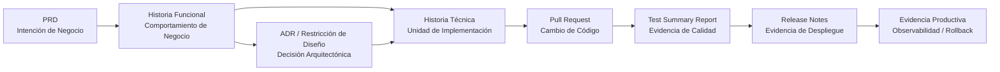

# Modelo de Trazabilidad SDLC

> **Navegación bilingüe:** [English version](./traceability-model.md)
> **Owner:** Evolith Architecture Board
> **Estado:** Referencia activa
> **Padre:** [Centro de Gobernanza SDLC Corporativa](./README.es.md)

---

## Propósito

Este documento define cómo Evolith traza el trabajo desde la intención de negocio hasta la evidencia productiva.

La trazabilidad es obligatoria porque toda decisión de producto, cambio de código, gate de calidad y release productivo debe poder explicarse posteriormente.

---

## Principio de Trazabilidad

Todo cambio productivo debe responder tres preguntas:

1. Por qué se financió este cambio?
2. Qué decisión de arquitectura o diseño lo permitió?
3. Qué evidencia demuestra que fue construido, probado y liberado de forma segura?

Si alguna respuesta falta, el cambio no es completamente trazable.

---

## Cadena Canónica de Evidencia



---

## Enlaces Requeridos por Artefacto

| Artefacto | Debe enlazar a | Por qué |
|---|---|---|
| PRD | Objetivos de negocio, métricas de éxito, restricciones, índice de Historias Funcionales | Demuestra que el producto o release vale la pena construirlo |
| Historia Funcional | PRD padre, ADRs gobernantes, bounded context, Historias Técnicas | Demuestra que el comportamiento de negocio está acotado y es implementable |
| ADR | Estándares relacionados, bounded contexts afectados, consecuencias | Demuestra que las decisiones de diseño fueron explícitas y revisadas |
| Historia Técnica | Historia Funcional padre, ADRs gobernantes, bounded context, Historias Técnicas relacionadas | Demuestra que el trabajo de implementación está ligado a necesidad y diseño aprobados |
| Pull Request | Historia Técnica, pruebas, delta documental | Demuestra que el cambio de código tiene intención acotada y evidencia revisable |
| Test Summary Report | Historias Funcionales, Historias Técnicas, ejecuciones CI, métricas de calidad | Demuestra calidad del release candidate y criterios de aceptación |
| Release Notes | Tag de release, Test Summary Report, pasos de despliegue, rollback, dashboard de observabilidad | Demuestra que el despliegue productivo es controlado y reversible |

---

## Regla Mínima de Trazabilidad

Para delivery MVP, la cadena mínima navegable es:

```text
PRD -> Historia Funcional -> Historia Técnica -> Pull Request -> Test Summary Report -> Release Notes
```

Un ADR es obligatorio cuando el trabajo introduce o cambia:

- Límites arquitectónicos.
- Selección tecnológica.
- Modelo de seguridad.
- Modelo de multi-tenancy.
- Estrategia de persistencia.
- Protocolo API o estrategia de contratos.
- Topología de despliegue u observabilidad.
- Cualquier excepción a un estándar Evolith existente.

---

## Estándar de Trazabilidad en Pull Request

Todo Pull Request debe incluir un bloque compacto de trazabilidad:

```markdown
## Trazabilidad

- Historia Funcional: FS-XX — [Título]
- Historia Técnica: TS-XXX — [Título]
- ADRs gobernantes: ADR-XXXX, ADR-YYYY
- Bounded Context: [Nombre del contexto]
- Delta documental: [Link o N/A con razón]
- Evidencia de pruebas: [Ejecución CI / link a reporte]
```

Si un campo no aplica, escribir `N/A — [razón]` en lugar de eliminarlo.

---

## Checklist de Trazabilidad para Gate Review

| Gate | El revisor debe confirmar |
|---|---|
| Aprobación de Negocio | El PRD tiene objetivos, restricciones, personas, alcance, no-objetivos y aprobación |
| Baseline de Diseño | Historias Funcionales y ADRs están enlazados y no contradicen estándares Evolith |
| Build Exitoso | Pull Requests enlazan a Historias Técnicas y pasan evidencia de DoD |
| RC Sellado | Test Summary Report valida todas las Historias Funcionales en alcance y métricas obligatorias |
| Producción Activa | Release Notes enlaza evidencia RC, tag de release, rollback y prueba de observabilidad |

---

## Anti-Patrones

| Anti-patrón | Riesgo |
|---|---|
| Decisiones arquitectónicas code-first | La arquitectura queda implícita y no gobernable |
| Historias Funcionales con lenguaje API-first | Producto no puede validar comportamiento de negocio independientemente |
| Historias Técnicas sin Historia Funcional padre | El trabajo técnico queda desconectado del valor de negocio |
| Release Notes sin Test Summary Report | El release productivo carece de evidencia objetiva de calidad |
| Observabilidad agregada después del despliegue | La preparación productiva no puede demostrarse en el gate |

---

## Ejemplo de Referencia UMS

Una capacidad de identidad estilo UMS debe ser trazable así:

| Paso de cadena | Ejemplo |
|---|---|
| Intención de negocio | PRD define gobierno de identidad y acceso tenant-aware |
| Comportamiento funcional | Historia Funcional define asignación de rol con alcance tenant |
| Decisión arquitectónica | ADR define restricciones de multi-tenancy y límites de autorización |
| Implementación técnica | Historia Técnica implementa el caso de uso de asignación de rol |
| Evidencia de código | Pull Request implementa dominio, aplicación, infraestructura, API y pruebas |
| Evidencia de calidad | Test Summary Report valida matriz de autorización y escaneos de seguridad |
| Evidencia de release | Release Notes documenta despliegue, rollback y controles de observabilidad |

---

## Documentos Relacionados

| Documento | Propósito |
|---|---|
| [Hub de Plantillas de Artefactos](./04-artifact-templates/README.es.md) | Plantillas canónicas con secciones de trazabilidad. |
| [Estándar de Escritura de Historias Funcionales](./03-documentation/functional-story-writing-standard.es.md) | Reglas para requisitos funcionales legibles por negocio. |
| [Plantilla de Historia Técnica](./04-artifact-templates/technical-story-template.es.md) | Elemento de trabajo de ingeniería con campos de trazabilidad. |
| [Plantilla de Test Summary Report](./04-artifact-templates/test-summary-report-template.es.md) | Evidencia de calidad antes del RC sellado. |
| [Plantilla de Release Notes](./04-artifact-templates/release-notes-template.es.md) | Evidencia de despliegue productivo. |

---

<div align="center">
  <sub>Evolith — Enterprise Architecture Platform | Modelo de Trazabilidad SDLC</sub>
</div>
