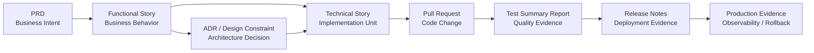

# SDLC Traceability Model

> **Bilingual navigation:** [Versión en Español](./traceability-model.es.md)
> **Owner:** Evolith Architecture Board
> **Status:** Active reference
> **Parent:** [Corporate SDLC Governance Center](./README.md)

---

## Purpose

This document defines how Evolith traces work from business intent to production evidence.

Traceability is mandatory because every product decision, code change, quality gate, and production release must be explainable after the fact.

---

## Traceability Principle

Every production change must answer three questions:

1. Why was this change funded?
2. What architecture or design decision allowed it?
3. What evidence proves it was built, tested, and released safely?

If any answer is missing, the change is not fully traceable.

---

## Canonical Evidence Chain



---

## Required Links by Artifact

| Artifact | Must Link To | Why |
|---|---|---|
| PRD | Business objectives, success metrics, constraints, Functional Story index | Proves the product or release is worth building |
| Functional Story | Parent PRD, governing ADRs, bounded context, Technical Stories | Proves business behavior is bounded and implementable |
| ADR | Related standards, affected bounded contexts, consequences | Proves design decisions were explicit and reviewed |
| Technical Story | Parent Functional Story, governing ADRs, bounded context, related Technical Stories | Proves implementation work is tied to approved need and design |
| Pull Request | Technical Story, tests, documentation delta | Proves code change has scoped intent and reviewable evidence |
| Test Summary Report | Functional Stories, Technical Stories, CI runs, quality metrics | Proves release candidate quality and acceptance criteria |
| Release Notes | Release tag, Test Summary Report, deployment steps, rollback plan, observability dashboard | Proves production deployment is controlled and reversible |

---

## Minimum Traceability Rule

For MVP delivery, the minimum navigable chain is:

```text
PRD -> Functional Story -> Technical Story -> Pull Request -> Test Summary Report -> Release Notes
```

An ADR is mandatory whenever the work introduces or changes:

- Architecture boundaries.
- Technology selection.
- Security model.
- Multi-tenancy model.
- Persistence strategy.
- API protocol or contract strategy.
- Deployment or observability topology.
- Any exception to an existing Evolith standard.

---

## Pull Request Traceability Standard

Every Pull Request should include a compact traceability block:

```markdown
## Traceability

- Functional Story: FS-XX — [Title]
- Technical Story: TS-XXX — [Title]
- Governing ADRs: ADR-XXXX, ADR-YYYY
- Bounded Context: [Context name]
- Documentation Delta: [Link or N/A with reason]
- Test Evidence: [CI run / test report link]
```

If a field is not applicable, write `N/A — [reason]` instead of deleting it.

---

## Gate Review Traceability Checklist

| Gate | Reviewer Must Confirm |
|---|---|
| Business Sign-Off | PRD has objectives, constraints, personas, scope, non-goals, and sign-off |
| Design Baseline | Functional Stories and ADRs are linked and do not contradict Evolith standards |
| Successful Build | Pull Requests link back to Technical Stories and pass DoD evidence |
| RC Stamped | Test Summary Report validates all in-scope Functional Stories and mandatory quality metrics |
| Production Live | Release Notes link to RC evidence, release tag, rollback plan, and observability proof |

---

## Anti-Patterns

| Anti-Pattern | Risk |
|---|---|
| Code-first architecture decisions | Architecture becomes implicit and impossible to govern |
| Functional Stories with API-first language | Product cannot validate business behavior independently |
| Technical Stories without parent Functional Story | Engineering work becomes disconnected from business value |
| Release Notes without Test Summary Report | Production release lacks objective quality evidence |
| Observability added after deployment | Production readiness cannot be proven at the gate |

---

## UMS Reference Example

A UMS-style identity capability should be traceable as follows:

| Chain Step | Example |
|---|---|
| Business intent | PRD defines tenant-aware identity and access governance |
| Functional behavior | Functional Story defines assigning a tenant-scoped role |
| Architecture decision | ADR defines multi-tenancy and authorization boundary constraints |
| Technical implementation | Technical Story implements the role assignment use case |
| Code evidence | Pull Request implements domain, application, infrastructure, API, and tests |
| Quality evidence | Test Summary Report validates authorization matrix and security scans |
| Release evidence | Release Notes document deployment, rollback, and observability checks |

---

## Related Documents

| Document | Purpose |
|---|---|
| [Artifact Templates Hub](./04-artifact-templates/README.md) | Canonical templates containing traceability sections. |
| [Functional Story Writing Standard](./03-documentation/functional-story-writing-standard.md) | Rules for business-readable functional requirements. |
| [Technical Story Template](./04-artifact-templates/technical-story-template.md) | Engineering work item with traceability fields. |
| [Test Summary Report Template](./04-artifact-templates/test-summary-report-template.md) | Quality evidence before RC stamp. |
| [Release Notes Template](./04-artifact-templates/release-notes-template.md) | Production deployment evidence. |

---

<div align="center">
  <sub>Evolith — Enterprise Architecture Platform | SDLC Traceability Model</sub>
</div>
