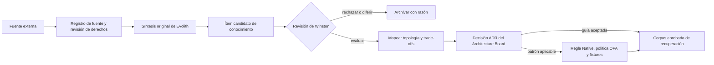
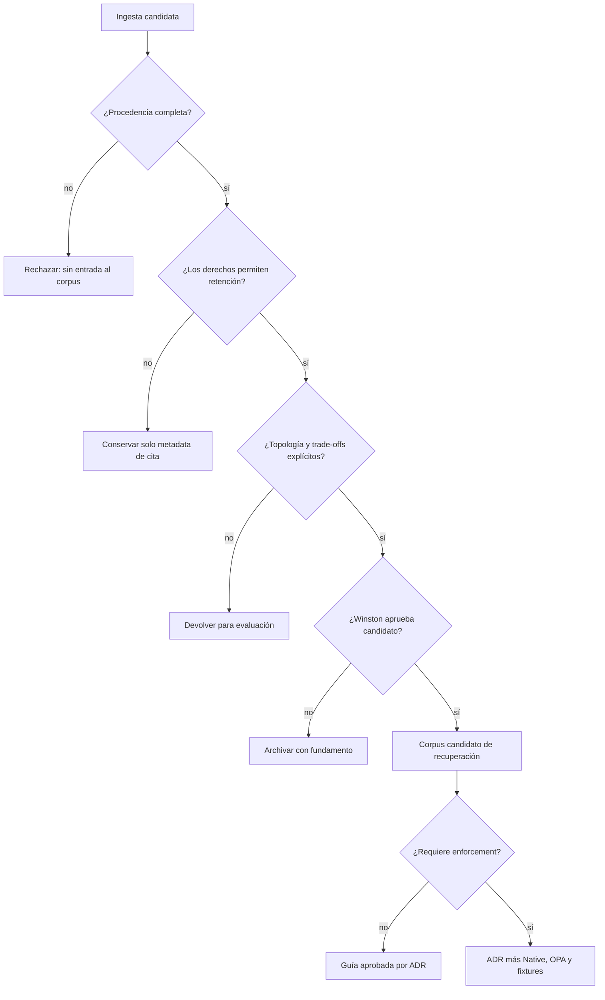

# V-12 — Gobernanza de Ingesta de Conocimiento Externo

> **Navegación bilingüe:** [English](./v12-external-knowledge-intake.md)  
> **Propietario:** Winston, Arquitecto Principal (ID de agente del repositorio `@wilson`)  
> **Estado:** Diseño propuesto — no normativo ni ejecutable hasta que se acepte un ADR

## Propósito

Definir una ruta controlada para que conocimiento arquitectónico de fuentes externas ingrese a Evolith Core. La ruta preserva procedencia, licenciamiento, aplicabilidad por topología y responsabilidad humana; no copia obras de terceros al corpus ni promueve una recomendación externa directamente a estándar Evolith.

## Contrato de Admisión de Fuente

Todo registro de ingesta DEBE identificar clase de fuente, localizador, estado de derechos, fecha de recuperación, síntesis original y responsable de revisión. Se excluye el texto completo de libros protegidos o material de pago; solo se retienen citas cortas permitidas, datos bibliográficos y resúmenes redactados por Evolith.

```yaml
knowledge_id: "KI-EVANS-AGGREGATE-001"
source:
  class: "book" # book | public-article | official-docs
  author: "Eric Evans"
  work: "Domain-Driven Design"
  locator: "capítulo de Aggregate"
  retrieved_at: "YYYY-MM-DD"
  rights_status: "citation-and-synthesis-only"
assessment:
  trust_level: "primary"
  portability: "high"
  topologies: ["modular-monolith", "distributed-modules", "microservices"]
  concerns: ["domain-modeling", "consistency"]
promotion:
  status: "candidate"
  owner: "winston"
  adr: null
  native_rule: null
  opa_policy: null
  fixtures: []
```

## Flujo de Promoción Controlada



## Registro Inicial de Fuentes

| ID de fuente | Fuente | Uso permitido | Primer candidato |
|---|---|---|---|
| `SRC-FOWLER-PUBLIC` | Artículos públicos de Martin Fowler | URL, metadata de recuperación, cita corta permitida, síntesis original | Evaluación de Transactional Outbox o Strangler Fig |
| `SRC-EVANS-DDD` | Eric Evans, *Domain-Driven Design* | Localizador bibliográfico, cita corta permitida, síntesis original | Evaluación de límites de Aggregate |
| `SRC-CONTEXT7-OFFICIAL` | Recuperación Context7 de documentación oficial | Localizador de fuente versionado y síntesis original; sin transferencia de autoridad | Evidencia de implementación específica de runtime |

El primer piloto es un único candidato: `KI-EVANS-AGGREGATE-001`. Puede respaldar la guía existente de aggregates pequeños, pero no puede modificar una regla ni la autoridad del corpus hasta completar el flujo de promoción.

## Gates de Control de Winston



## Reglas de Promoción

- Una fuente es evidencia, no autoridad Evolith. Los ADRs y estándares aceptados siguen siendo el único corpus normativo.
- Winston (`@wilson`) posee la admisión de candidatos, revisión de procedencia, mapeo topológico y revisión periódica de frescura; el Architecture Board acepta o rechaza la promoción.
- Un candidato se excluye de la recuperación por defecto hasta ser aceptado. Contenido rechazado, reemplazado o restringido por derechos no se muestra como consejo arquitectónico.
- Una promoción aplicable sigue paridad dual-engine: artefactos Native y OPA, fixtures compartidos y pruebas reproducibles son requeridos en el mismo cambio de implementación.
- Todo registro define fecha de revisión, versión o edición de fuente y disposición explícita de reemplazo o retiro.

## Relación con la Gobernanza Existente

Este diseño extiende [ADR-0090 Gobernanza de Conocimiento RAG](../../../../../architecture/adrs/core/0090-rag-knowledge-governance.es.md): ADR-0090 gobierna la indexación del corpus autoritativo de Evolith; V-12 gobierna el material externo antes de ser elegible para ese corpus. No selecciona un proveedor vectorial ni implementa un adaptador Context7.
