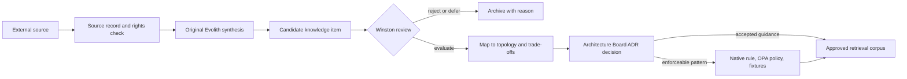
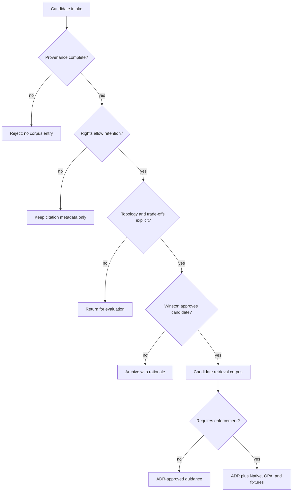

# V-12 — External Knowledge Intake Governance

> **Bilingual navigation:** [Español](./v12-external-knowledge-intake.es.md)  
> **Owner:** Winston, Principal Architect (repository agent ID `@winston`)  
> **Status:** Proposed design — not normative or executable until an ADR is accepted

## Purpose

Define a controlled path for architectural knowledge from external sources into Evolith Core. The path preserves provenance, licensing, topology applicability, and human accountability; it does not copy third-party works into the corpus or promote an external recommendation directly to an Evolith standard.

## Source Admission Contract

Every intake record MUST identify its source class, locator, rights status, retrieval date, original synthesis, and review owner. Full text from copyrighted books or paid material is excluded; only permitted short citations, bibliographic data, and Evolith-authored summaries are retained.

```yaml
knowledge_id: "KI-EVANS-AGGREGATE-001"
source:
  class: "book" # book | public-article | official-docs
  author: "Eric Evans"
  work: "Domain-Driven Design"
  locator: "Aggregate chapter"
  retrieved_at: "YYYY-MM-DD"
  rights_status: "citation-and-synthesis-only"
assessment:
  trust_level: "primary"
  portability: "high"
  topologies: ["modular-monolith", "distributed-modules", "microservices"]
  concerns: ["domain-modeling", "consistency"]
promotion:
  status: "candidate"
  owner: "wilson"
  adr: null
  native_rule: null
  opa_policy: null
  fixtures: []
```

## Controlled Promotion Flow



## Initial Source Registry

| Source ID | Source | Allowed use | First candidate |
|---|---|---|---|
| `SRC-FOWLER-PUBLIC` | Martin Fowler public articles | URL, retrieval metadata, short permitted citation, original synthesis | Transactional Outbox or Strangler Fig evaluation |
| `SRC-EVANS-DDD` | Eric Evans, *Domain-Driven Design* | Bibliographic locator, short permitted citation, original synthesis | Aggregate boundary evaluation |
| `SRC-CONTEXT7-OFFICIAL` | Context7 retrieval of official documentation | Versioned source locator and original synthesis; no authority transfer | Runtime-specific implementation evidence |

The first pilot is one candidate only: `KI-EVANS-AGGREGATE-001`. It may support existing small-aggregate guidance, but cannot modify a rule or corpus authority until the promotion flow completes.

## Winston Control Gates



## Promotion Rules

- A source is evidence, not an Evolith authority. Accepted ADRs and standards remain the only normative corpus.
- Winston (`@winston`) owns candidate admission, provenance review, topology mapping, and periodic freshness review; the Architecture Board accepts or rejects promotion.
- A candidate is excluded from default retrieval until accepted. Rejected, superseded, or rights-restricted content is not surfaced as architectural advice.
- An enforceable promotion follows dual-engine parity: Native and OPA artifacts, shared fixtures, and reproducible tests are required in the same implementation change.
- Every record defines a review date, source version or edition, and explicit replacement or retirement disposition.

## Relationship to Existing Governance

This design extends [ADR-0090 RAG Knowledge Governance](../../../../../architecture/adrs/core/0090-rag-knowledge-governance.md): ADR-0090 governs authoritative Evolith corpus indexing; V-12 governs external material before it becomes eligible for that corpus. It does not select a vector provider or implement a Context7 adapter.
