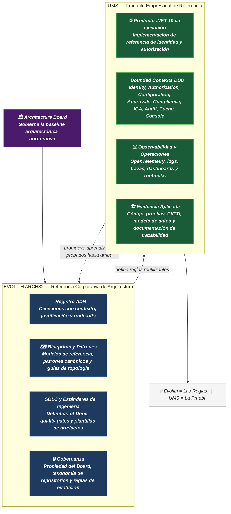
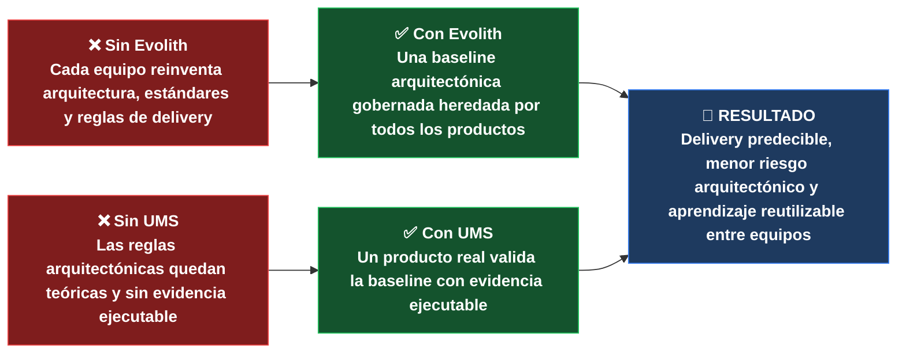
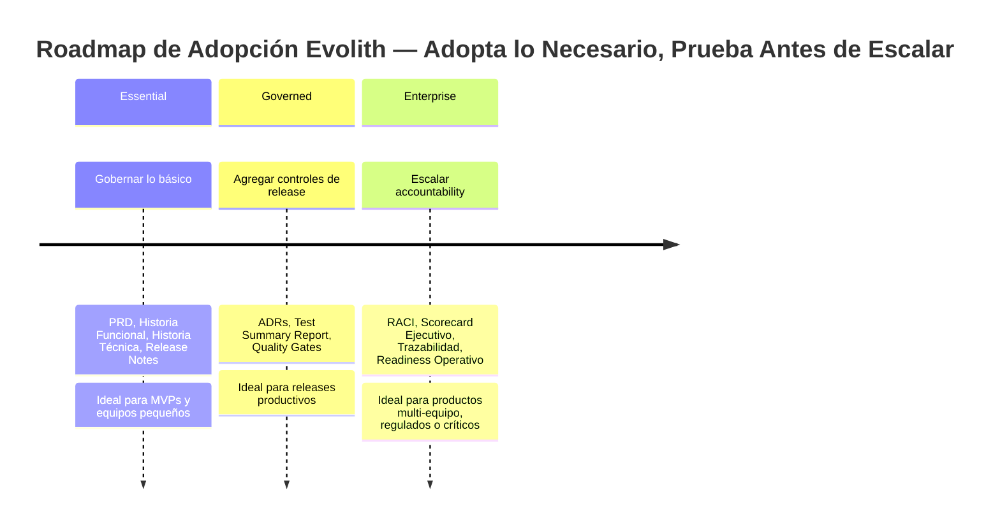
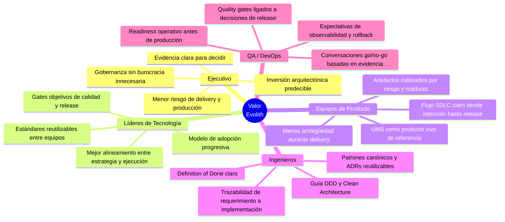

# V-01 — Resumen Ejecutivo: Visión General del Ecosistema Evolith

> **Audiencia:** Ejecutivo / Sponsor  
> **Propósito:** Punto de entrada de una sola página — sin jerga, solo valor  
> **Bilingüe:** [English](./v01-executive-one-pager.md)  
> **Regla de vigencia:** Este visual debe revisarse cada vez que Evolith introduzca una evolución fuerte en SDLC, ADRs, runtimes, gobernanza o producto de referencia.

---

## La Pregunta que Este Visual Responde

> "¿Qué es Evolith, qué es UMS y por qué necesitamos ambos?"

---

## Visual 1-A — El Ecosistema de Dos Capas

---

## Visual 1-B — Por Qué Necesitamos Ambos

---

## Visual 1-C — Adopción Progresiva Sin Complejidad Big-Bang

---

## Visual 1-D — Valor por Stakeholder

---

## Mensaje Ejecutivo Final

> Evolith no es un repositorio de documentos. Es un modelo operativo de arquitectura gobernada.  
> UMS demuestra que el modelo puede implementarse en software real.

---

*Parte de la [Estrategia de Comunicación Arquitectónica](../architecture-communication-strategy.es.md).*