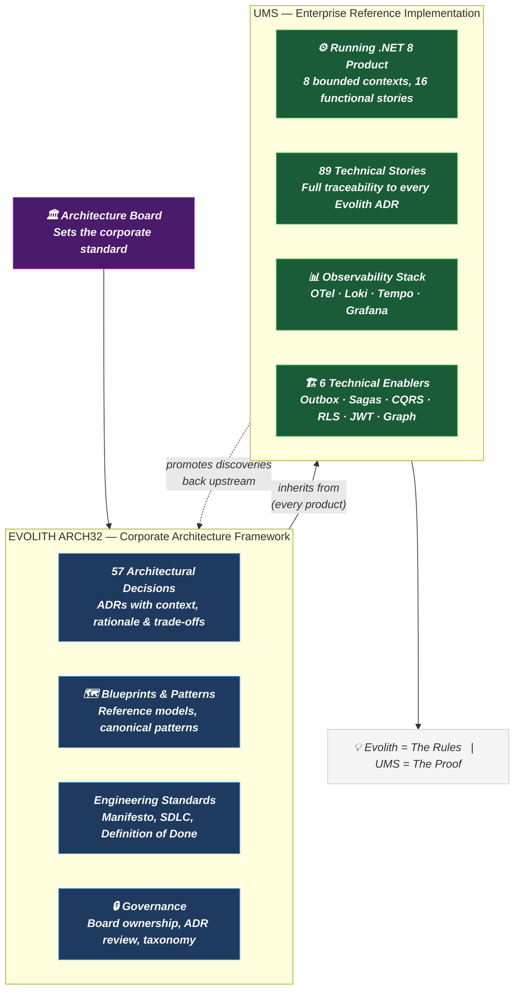
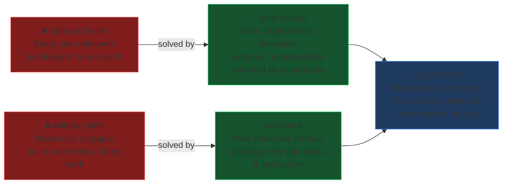
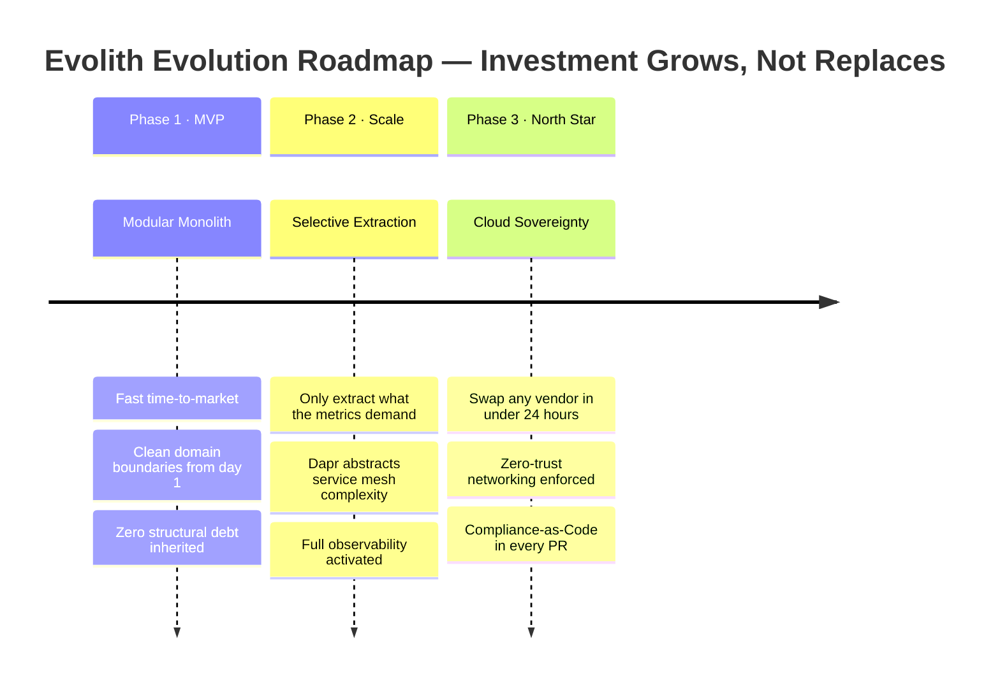
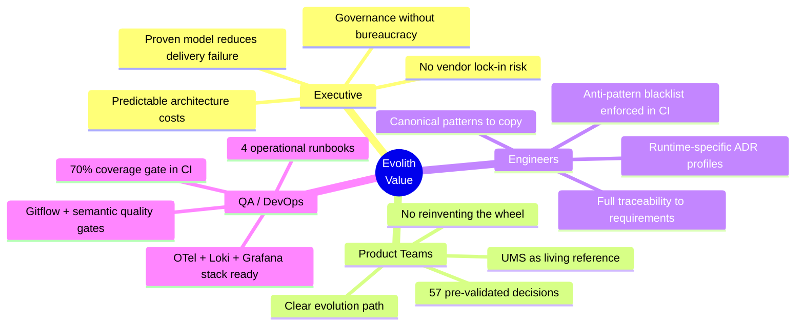

# V-01 — Executive One-Pager: Evolith Ecosystem Overview

> **Audience:** Executive / Sponsor  
> **Purpose:** Single-page entry point — no jargon, pure value  
> **Bilingual:** [Español](./v01-executive-one-pager.es.md)

---

## The Question This Visual Answers

> "What is Evolith, what is UMS, and why do we need both?"

---

## Visual 1-A — The Two-Layer Ecosystem

---

## Visual 1-B — Why Both Are Needed

---

## Visual 1-C — The 3-Phase Investment Protection Model

---

## Visual 1-D — Value by Stakeholder

---

*Part of the [Architecture Communication Strategy](../architecture-communication-strategy.md)*
