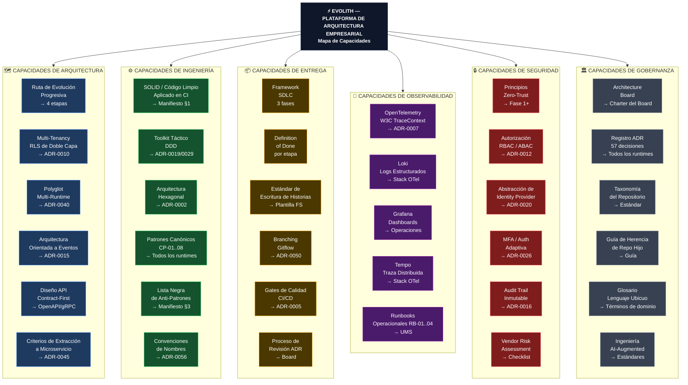
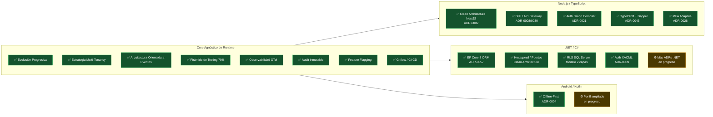

# V-03 — Mapa de Capacidades Evolith

> **Audiencia:** Arquitectos, Product Managers, Tech Leads  
> **Propósito:** Qué provee la plataforma Evolith — organizado por dominio  
> **Bilingüe:** [English](./v03-capability-map.md)

---

## Visual 3-A — Landscape de Capacidades Completo



---

## Visual 3-B — Cobertura de Capacidades por Runtime



---

## Visual 3-C — Madurez de Capacidades por Fase

```mermaid
quadrantChart
    title Madurez de Capacidad vs Complejidad de Implementación
    x-axis Baja Complejidad --> Alta Complejidad
    y-axis Menor Madurez --> Mayor Madurez
    quadrant-1 Avanzado (Fase 3)
    quadrant-2 Fundación Madura (Fase 1-2)
    quadrant-3 Victorias Rápidas (Empezar Aquí)
    quadrant-4 Diferido (Inversión Justificada)

    Manifiesto de Ingeniería: [0.12, 0.90]
    Arquitectura Hexagonal: [0.20, 0.85]
    Registro ADR: [0.18, 0.88]
    Gitflow + Gates CI: [0.22, 0.82]
    Convenciones de Nombres: [0.10, 0.78]
    Pirámide de Testing: [0.30, 0.80]
    Multi-Tenancy RLS: [0.55, 0.85]
    Transactional Outbox: [0.50, 0.78]
    Tracing Distribuido: [0.52, 0.75]
    Proyecciones CQRS: [0.60, 0.72]
    Sagas Distribuidas: [0.72, 0.70]
    Dapr Service Mesh: [0.75, 0.68]
    Microfrontends: [0.78, 0.65]
    Topología Multi-Cloud: [0.85, 0.72]
    Red Zero-Trust: [0.88, 0.80]
    Compliance as Code: [0.90, 0.78]
```

---

*Parte de la [Estrategia de Comunicación Arquitectónica](../architecture-communication-strategy.es.md)*
