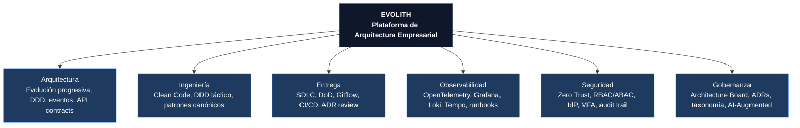
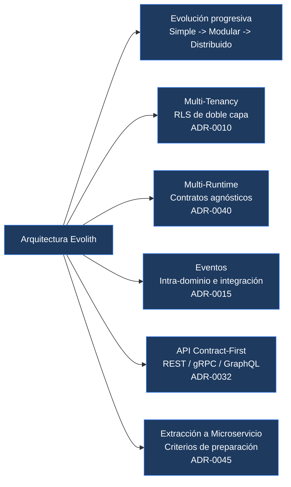
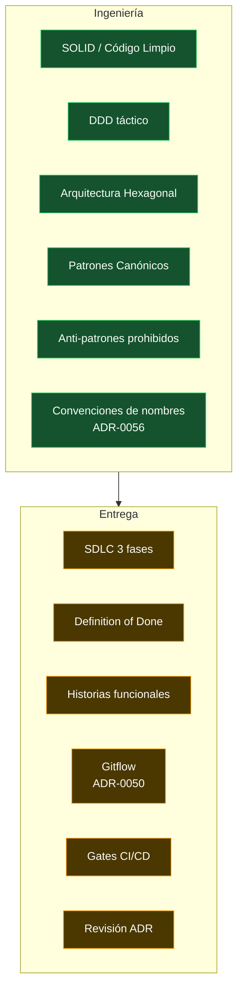
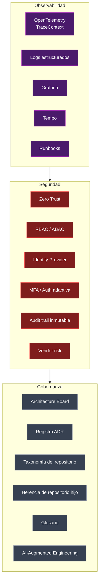
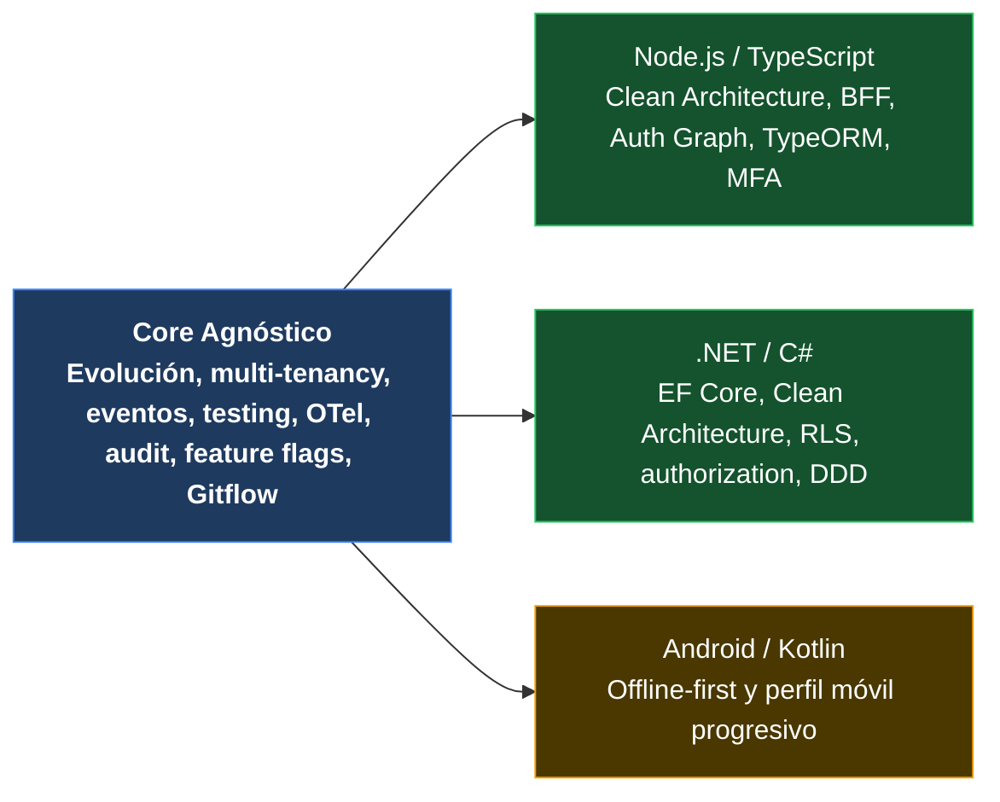
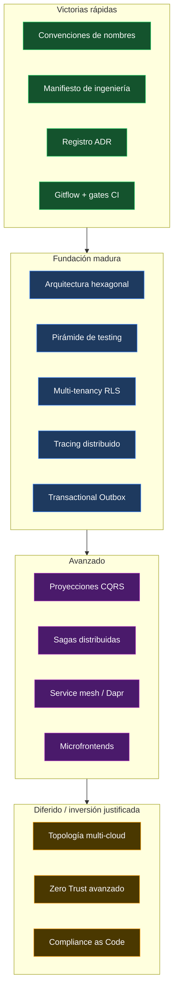

# V-03 — Mapa de Capacidades Evolith

> **Audiencia:** Arquitectos, Product Managers, Tech Leads  
> **Propósito:** Qué provee la plataforma Evolith — organizado por dominio  
> **Bilingüe:** [English](./v03-capability-map.md)

---

## Nota de legibilidad

Esta versión divide el mapa de capacidades en diagramas más pequeños para evitar renderizados rotos o ilegibles en GitHub Mermaid.

---

## Visual 3-A — Landscape de Capacidades Evolith

---

## Visual 3-A1 — Capacidades de Arquitectura

---

## Visual 3-A2 — Capacidades de Ingeniería y Entrega

---

## Visual 3-A3 — Capacidades Operacionales, Seguridad y Gobernanza

---

## Visual 3-B — Cobertura de Capacidades por Runtime

---

## Visual 3-C — Madurez de Capacidades por Fase

---

*Parte de la [Estrategia de Comunicación Arquitectónica](../architecture-communication-strategy.es.md)*
