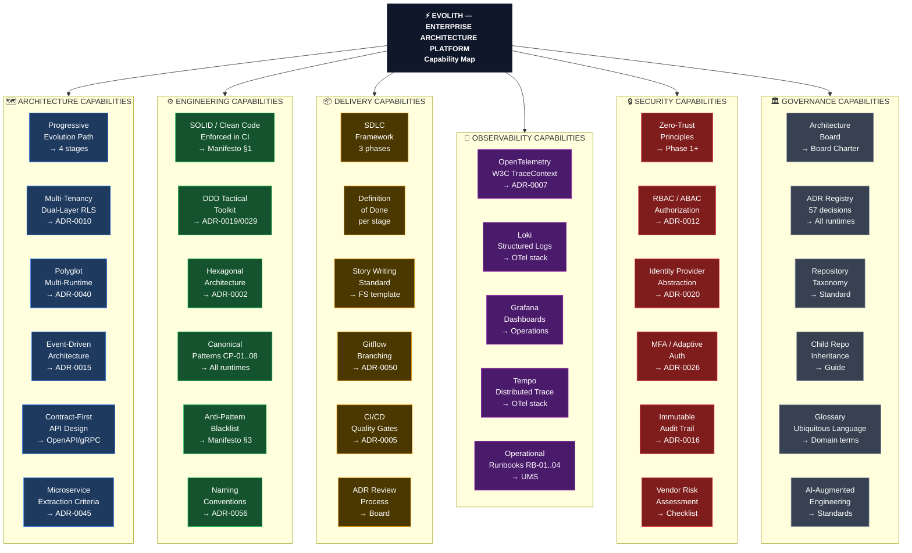
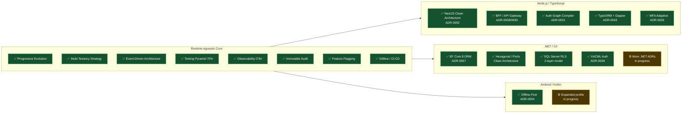
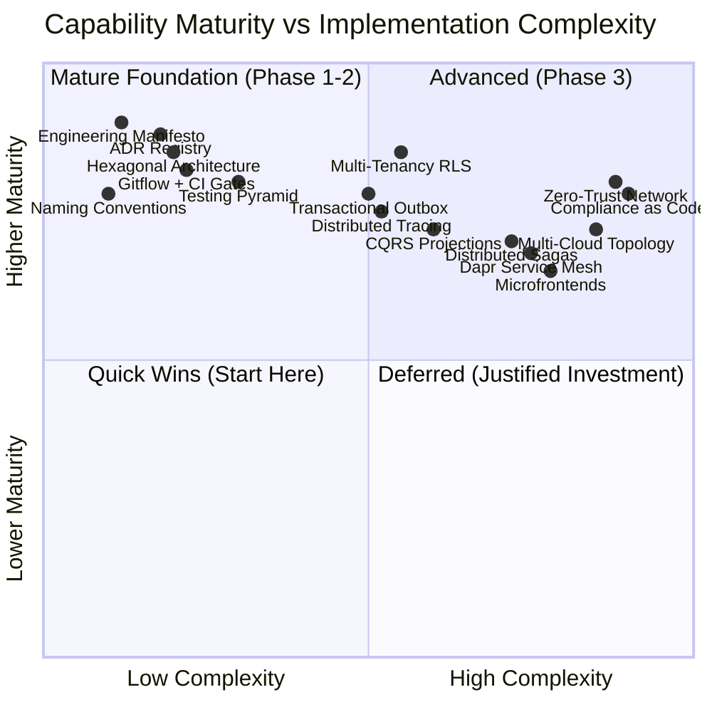

# V-03 — Evolith Capability Map

> **Audience:** Architects, Product Managers, Tech Leads  
> **Purpose:** What the Evolith platform provides — organized by domain  
> **Bilingual:** [Español](./v03-capability-map.es.md)

---

## Visual 3-A — Full Capability Landscape

---

## Visual 3-B — Capability Coverage by Runtime

---

## Visual 3-C — Capability Maturity by Phase

---

*Part of the [Architecture Communication Strategy](../architecture-communication-strategy.md)*
