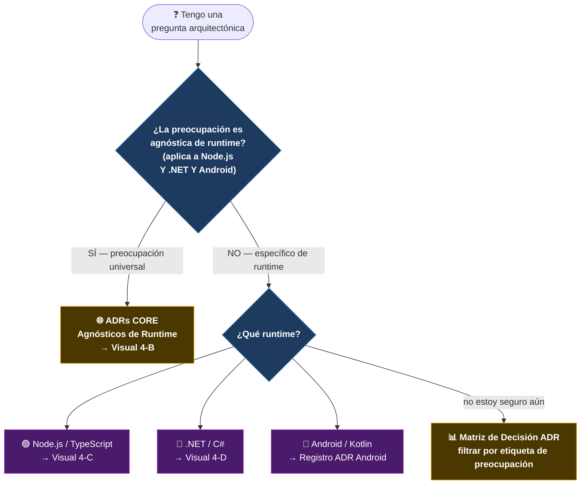
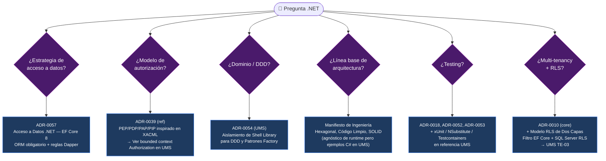

# V-04 — Árbol de Decisión ADR

> **Audiencia:** Arquitectos, Tech Leads, Desarrolladores Senior  
> **Propósito:** Navegar al ADR correcto en menos de 60 segundos  
> **Bilingüe:** [English](./v04-adr-decision-tree.md)

---

## Visual 4-A — Embudo de Decisión de Nivel Superior

---

## Visual 4-B — Árbol de Decisión ADR Core (Agnóstico de Runtime)

```mermaid
flowchart TD
    classDef q fill:#1e3a5f,stroke:#4a90d9,color:#fff
    classDef adr fill:#14532d,stroke:#22c55e,color:#fff,font-size:13px
    classDef group fill:#0f172a,stroke:#334155,color:#aaa,font-style:italic

    CORE(["🌐 Preocupación Core"])

    CORE --> QA{"¿Etapa o estructura\nde arquitectura?"}:::q
    QA --> A1["ADR-0047\nFramework de Selección\nMonolito vs SOA vs Microservicios"]:::adr
    QA --> A2["ADR-0045\nCriterios de Preparación\npara Extracción (2 de 4)"]:::adr
    QA --> A3["ADR-0001\nOrquestación Monorepo Nx"]:::adr

    CORE --> QB{"¿Multi-tenancy\no aislamiento de datos?"}:::q
    QB --> B1["ADR-0010\nEstrategia RLS Doble Capa\nFiltro App + Failsafe DB"]:::adr
    QB --> B2["ADR-0031\nSchema-per-Context\nCatálogo de Eventos de Dominio"]:::adr
    QB --> B3["ADR-0044\nSeguridad Configurable\nEstrategia de Persistencia"]:::adr

    CORE --> QC{"¿Eventos, async\no flujos saga?"}:::q
    QC --> C1["ADR-0015\nEvent Bus Inyectable\nIn-Memory → RabbitMQ → Kafka"]:::adr
    QC --> C2["ADR-0033\nPatrón Transactional Outbox"]:::adr
    QC --> C3["ADR-0035\nEstrategia de Sagas Distribuidas"]:::adr
    QC --> C4["ADR-0036\nMessage Bus FIFO / DLQ"]:::adr

    CORE --> QD{"¿CQRS o\nproyecciones de lectura?"}:::q
    QD --> D1["ADR-0034\nMatriz de Aplicabilidad CQRS"]:::adr

    CORE --> QE{"¿Identidad,\nAuth o MFA?"}:::q
    QE --> E1["ADR-0020\nAbstracción de Identity Provider"]:::adr
    QE --> E2["ADR-0016\nAudit Trail Inmutable"]:::adr

    CORE --> QF{"¿Testing\no calidad?"}:::q
    QF --> F1["ADR-0018\nPirámide de Testing y Gates de Calidad"]:::adr
    QF --> F2["ADR-0052\nAislamiento de Unit Testing"]:::adr
    QF --> F3["ADR-0053\nEstrategia de Integración y E2E"]:::adr
    QF --> F4["ADR-0005\nGates de Calidad CI/CD (CodeQL)"]:::adr

    CORE --> QG{"¿Infraestructura\no despliegue?"}:::q
    QG --> G1["ADR-0028\nInfraestructura OSS Self-Hosted"]:::adr
    QG --> G2["ADR-0013\nTopología Cloud y DR"]:::adr
    QG --> G3["ADR-0006\nMicroservicios Futuros via Dapr"]:::adr
    QG --> G4["ADR-0046\nObservabilidad Unificada Dapr"]:::adr

    CORE --> QH{"¿Caching\no performance?"}:::q
    QH --> H1["ADR-0014\nCaching Distribuido — Redis\nEstrategia 4 Niveles"]:::adr

    CORE --> QI{"¿Contratos de API\no protocolos?"}:::q
    QI --> I1["ADR-0032\nMatriz de Selección de Protocolo\nREST vs gRPC vs GraphQL"]:::adr
    QI --> I2["ADR-0040\nContratos Multi-Runtime\n(Gobernanza Raíz)"]:::adr
    QI --> I3["ADR-0030\nAPI Gateway — Kong vs NestJS"]:::adr

    CORE --> QJ{"¿Diseño de base\nde datos o nombres?"}:::q
    QJ --> J1["ADR-0051\nMotor de Base de Datos Empresarial"]:::adr
    QJ --> J2["ADR-0054\nDiseño y Normalización de BD"]:::adr
    QJ --> J3["ADR-0056\nConvenciones de Nombres Empresariales"]:::adr
    QJ --> J4["ADR-0049\nSemántica de Nombres y Código Limpio"]:::adr

    CORE --> QK{"¿Resiliencia\no tolerancia a fallos?"}:::q
    QK --> K1["ADR-0011\nPatrones de Tolerancia a Fallos y Resiliencia\nCircuit Breaker, Retry, Bulkhead"]:::adr

    CORE --> QL{"¿Feature flags\no configuración?"}:::q
    QL --> L1["ADR-0017\nEstrategia de Feature Flagging"]:::adr
    QL --> L2["ADR-0024\nPlataforma de Config y Features"]:::adr
    QL --> L3["ADR-0025\nAbstracción de Feature Flag Provider"]:::adr
```

---

## Visual 4-C — Árbol ADR Node.js / TypeScript

```mermaid
flowchart TD
    classDef q fill:#14532d,stroke:#22c55e,color:#fff
    classDef adr fill:#1e3a5f,stroke:#3b82f6,color:#fff,font-size:13px

    NODE(["🟢 Pregunta Node.js"])

    NODE --> NA{"¿Patrón de\narquitectura?"}:::q
    NA --> NA1["ADR-0002\nClean Architecture con NestJS"]:::adr
    NA --> NA2["ADR-0003\nEstándares TypeScript Estrictos"]:::adr
    NA --> NA3["ADR-0008\nBFF Multi-Módulo Progresivo\nEvolución + Gateway"]:::adr

    NODE --> NB{"¿Autorización\no grafo?"}:::q
    NB --> NB1["ADR-0012\nGuards Avanzados RBAC/ABAC de Auth"]:::adr
    NB --> NB2["ADR-0021\nCompilación de Grafo de Auth\nde Alto Rendimiento"]:::adr
    NB --> NB3["ADR-0022\nProyecciones Contextuales"]:::adr
    NB --> NB4["ADR-0023\nFrontera del Kernel UMS Centralizado"]:::adr

    NODE --> NC{"¿Identidad\no MFA?"}:::q
    NC --> NC1["ADR-0026\nMFA / Auth Adaptiva Passwordless"]:::adr

    NODE --> ND{"¿Protocolo de API\no gateway?"}:::q
    ND --> ND1["ADR-0027\nProtocolo Dual REST + gRPC"]:::adr

    NODE --> NE{"¿Acceso a datos?"}:::q
    NE --> NE1["ADR-0043\nEstrategia de Acceso a Datos y ORM\n(TypeORM / Dapper)"]:::adr

    NODE --> NF{"¿Primitivos DDD?"}:::q
    NF --> NF1["ADR-0029\nLibrería de Primitivos DDD Tácticos"]:::adr

    NODE --> NG{"¿Manejo de errores?"}:::q
    NG --> NG1["ADR-0038\nImplementación Result Pattern TS"]:::adr

    NODE --> NH{"¿Observabilidad?"}:::q
    NH --> NH1["ADR-0007\nOTel + Loki + Logging Estructurado"]:::adr

    NODE --> NI{"¿Frontend\no mobile?"}:::q
    NI --> NI1["ADR-0004\nResiliencia Offline Frontend"]:::adr
    NI --> NI2["ADR-0055\nEstrategia de Arquitectura Microfrontends\n(Module Federation)"]:::adr
```

---

## Visual 4-D — Árbol ADR .NET / C#

---

*Parte de la [Estrategia de Comunicación Arquitectónica](../architecture-communication-strategy.es.md)*
