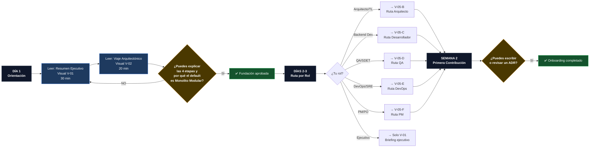
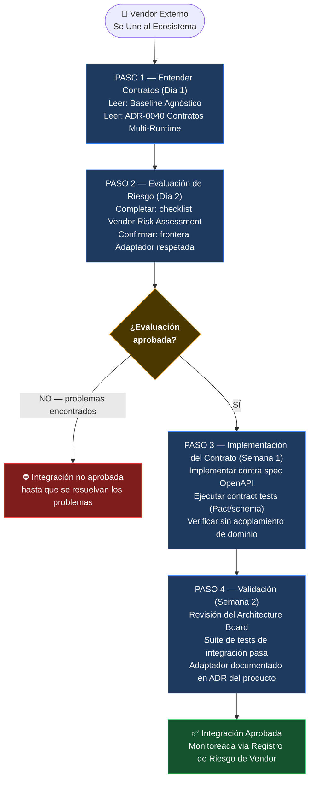

# V-05 — Mapa del Viaje de Onboarding por Rol

> **Audiencia:** RRHH, Tech Leads, Engineering Managers  
> **Propósito:** Ruta de incorporación estructurada — qué lee cada rol, cuándo y por qué  
> **Bilingüe:** [English](./v05-onboarding-journey-map.md)

---

## Visual 5-A — Flujo Universal de Onboarding (Todos los Roles)



---

## Visual 5-B — Viaje Arquitecto / Tech Lead

```mermaid
journey
    title Arquitecto / Tech Lead — Primeras 2 Semanas
    section Día 1: Fundación
      Leer Resumen Ejecutivo (V-01): 5: Arquitecto
      Leer Viaje Arquitectónico (V-02): 5: Arquitecto
      Entender Relación del Ecosistema: 4: Arquitecto
    section Días 2-3: Estándares
      Estudiar Directivas Arquitectónicas: 5: Arquitecto
      Leer Roadmap Evolutivo: 5: Arquitecto
      Revisar Manifiesto de Ingeniería: 4: Arquitecto
    section Días 4-5: Decisiones
      Navegar Registro ADR (V-04): 5: Arquitecto
      Estudiar Matriz de Decisión ADR: 4: Arquitecto
      Leer Blueprint de Referencia (arc42/C4): 4: Arquitecto
    section Semana 2: Referencia Aplicada
      Explorar Portal de Arquitectura UMS: 5: Arquitecto
      Revisar Matriz de Trazabilidad UMS: 4: Arquitecto
      Leer Guía de Herencia de Repo Hijo: 5: Arquitecto
    section Fin Semana 2: Primer ADR
      Escribir primer borrador de ADR: 4: Arquitecto
      Enviar al Architecture Board: 3: Arquitecto
```

---

## Visual 5-C — Viaje Desarrollador Backend / Frontend

```mermaid
journey
    title Desarrollador Backend / Frontend — Primeras 2 Semanas
    section Día 1: Reglas
      Leer Manifiesto de Ingeniería: 5: Desarrollador
      Aprender lista negra de anti-patrones: 5: Desarrollador
      Entender SOLID + Hexagonal: 4: Desarrollador
    section Día 2: Tu Runtime
      Seleccionar perfil Node.js o .NET: 5: Desarrollador
      Leer ADRs específicos de runtime (V-04-C o V-04-D): 4: Desarrollador
      Estudiar Patrones Canónicos CP-01..04: 5: Desarrollador
    section Días 3-5: Código de Referencia
      Explorar código fuente UMS: 5: Desarrollador
      Trazar FS a ADR a TE en la matriz: 4: Desarrollador
      Correr UMS localmente y observar: 4: Desarrollador
    section Semana 2: Primera Entrega
      Escribir primer caso de uso con Hexagonal: 4: Desarrollador
      Agregar unit tests hasta 70% de cobertura: 4: Desarrollador
      Enviar PR con checklist de PR: 3: Desarrollador
```

---

## Visual 5-D — Viaje QA / SDET

```mermaid
journey
    title QA / SDET — Primeras 2 Semanas
    section Día 1: Modelo de Calidad
      Leer Pirámide de Testing ADR-0018: 5: QA
      Entender distribución 70/20/10: 5: QA
      Leer Guía de Contract Testing: 4: QA
    section Días 2-3: Estándares de Testing
      Estudiar ADR-0052 Aislamiento Unit: 4: QA
      Estudiar ADR-0053 Integración + E2E: 5: QA
      Revisar configuración del gate de calidad CI: 4: QA
    section Días 4-5: Evidencia Aplicada
      Revisar implementación de tests UMS: 5: QA
      Ejecutar suite de tests UMS localmente: 4: QA
      Trazar FS a criterios de aceptación: 4: QA
    section Semana 2: Primeros Tests
      Escribir contract test para un FS: 4: QA
      Escribir test de integración con Testcontainers: 3: QA
      Verificar que el gate CI pase: 5: QA
```

---

## Visual 5-E — Viaje DevOps / SRE

```mermaid
journey
    title DevOps / SRE — Primeras 2 Semanas
    section Día 1: Modelo de Infraestructura
      Leer ADR-0028 OSS Self-Hosted: 5: DevOps
      Entender principio OSS-first: 5: DevOps
      Leer Gitflow ADR-0050: 4: DevOps
    section Días 2-3: Stack de Observabilidad
      Estudiar OTel + Loki + Tempo (ADR-0007): 5: DevOps
      Revisar configuración de dashboards Grafana: 4: DevOps
      Explorar Hub de Infraestructura: 4: DevOps
    section Días 4-5: Operaciones
      Leer los 4 Runbooks (RB-01..04): 5: DevOps
      Revisar gates de calidad CI/CD (ADR-0005): 4: DevOps
      Estudiar Escenarios Multi-Cloud: 3: DevOps
    section Semana 2: Primera Contribución
      Configurar OTel localmente para producto: 4: DevOps
      Validar pipeline CI contra ADR-0005: 4: DevOps
      Contribuir o revisar un Runbook: 3: DevOps
```

---

## Visual 5-F — Viaje Product Manager / PO

```mermaid
journey
    title Product Manager / PO — Primera Semana
    section Día 1: Visión
      Leer Resumen Ejecutivo: 5: PM
      Entender frontera Evolith vs UMS: 5: PM
      Leer fases del Roadmap Evolutivo: 4: PM
    section Día 2: Límites de Alcance
      Leer Modelo de Referencia UMS: 5: PM
      Entender frontera Demo vs Referencia: 4: PM
      Revisar Índice de Documentación UMS: 4: PM
    section Días 3-5: Modelo de Entrega
      Leer Estándar de Escritura de Historias Funcionales: 5: PM
      Entender Definition of Done: 4: PM
      Revisar etapas del Framework SDLC: 3: PM
```

---

## Visual 5-G — Viaje Proveedor / Vendor Externo



---

*Parte de la [Estrategia de Comunicación Arquitectónica](../architecture-communication-strategy.es.md)*
