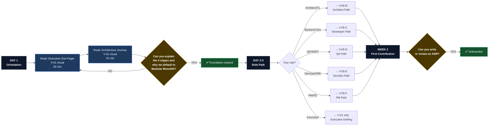
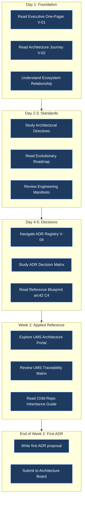
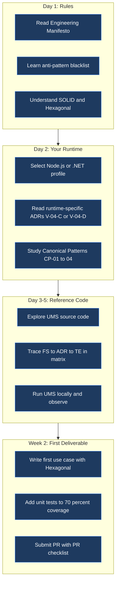
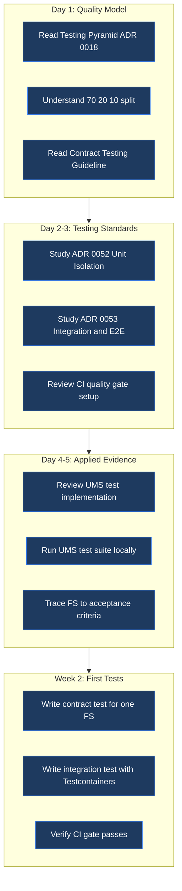
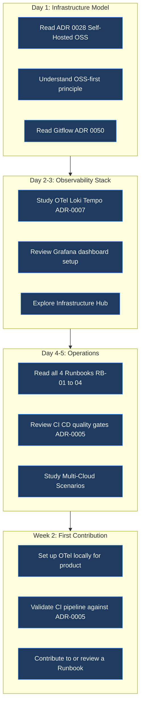
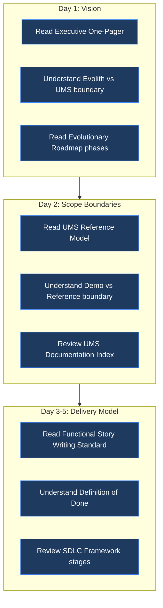
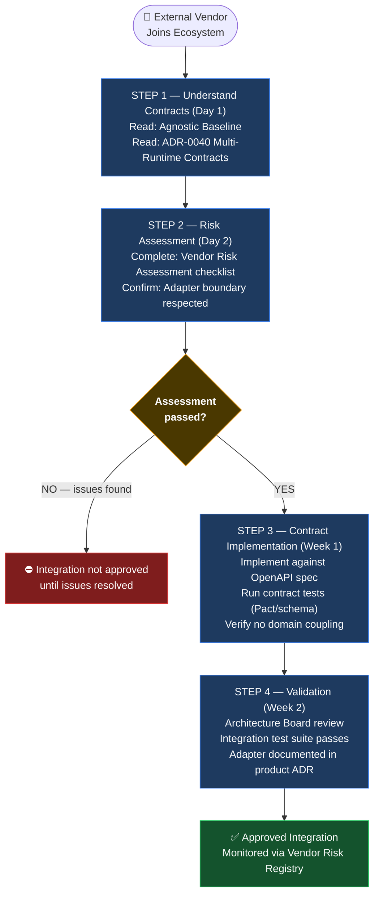

# V-05 — Onboarding Journey Map by Role

> **Audience:** HR, Tech Leads, Engineering Managers  
> **Purpose:** Structured ramp-up path — what each role reads, when, and why  
> **Bilingual:** [Español](./v05-onboarding-journey-map.es.md)

---

## Visual 5-A — Universal Onboarding Flow (All Roles)

---

## Visual 5-B — Architect / Tech Lead Journey

---

## Visual 5-C — Backend / Frontend Developer Journey

---

## Visual 5-D — QA / SDET Journey

---

## Visual 5-E — DevOps / SRE Journey

---

## Visual 5-F — Product Manager / PO Journey

---

## Visual 5-G — External Provider / Vendor Journey

---

*Part of the [Architecture Communication Strategy](../architecture-communication-strategy.md)*
