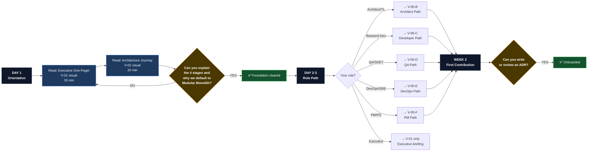

# V-05 — Onboarding Journey Map by Role

> **Audience:** HR, Tech Leads, Engineering Managers  
> **Purpose:** Structured ramp-up path — what each role reads, when, and why  
> **Bilingual:** [Español](./v05-onboarding-journey-map.es.md)

---

## Visual 5-A — Universal Onboarding Flow (All Roles)



---

## Visual 5-B — Architect / Tech Lead Journey

```mermaid
journey
    title Architect / Tech Lead — First 2 Weeks
    section Day 1: Foundation
      Read Executive One-Pager (V-01): 5: Architect
      Read Architecture Journey (V-02): 5: Architect
      Understand Ecosystem Relationship: 4: Architect
    section Day 2-3: Standards
      Study Architectural Directives: 5: Architect
      Read Evolutionary Roadmap: 5: Architect
      Review Engineering Manifesto: 4: Architect
    section Day 4-5: Decisions
      Navigate ADR Registry (V-04): 5: Architect
      Study ADR Decision Matrix: 4: Architect
      Read Reference Blueprint (arc42/C4): 4: Architect
    section Week 2: Applied Reference
      Explore UMS Architecture Portal: 5: Architect
      Review UMS Traceability Matrix: 4: Architect
      Read Child Repo Inheritance Guide: 5: Architect
    section End of Week 2: First ADR
      Write first ADR proposal: 4: Architect
      Submit to Architecture Board: 3: Architect
```

---

## Visual 5-C — Backend / Frontend Developer Journey

```mermaid
journey
    title Backend / Frontend Developer — First 2 Weeks
    section Day 1: Rules
      Read Engineering Manifesto: 5: Developer
      Learn anti-pattern blacklist: 5: Developer
      Understand SOLID + Hexagonal: 4: Developer
    section Day 2: Your Runtime
      Select Node.js or .NET profile: 5: Developer
      Read runtime-specific ADRs (V-04-C or V-04-D): 4: Developer
      Study Canonical Patterns CP-01..04: 5: Developer
    section Day 3-5: Reference Code
      Explore UMS source code: 5: Developer
      Trace FS to ADR to TE in matrix: 4: Developer
      Run UMS locally and observe: 4: Developer
    section Week 2: First Deliverable
      Write first use case with Hexagonal: 4: Developer
      Add unit tests to 70% coverage: 4: Developer
      Submit PR with PR checklist: 3: Developer
```

---

## Visual 5-D — QA / SDET Journey

```mermaid
journey
    title QA / SDET — First 2 Weeks
    section Day 1: Quality Model
      Read Testing Pyramid ADR-0018: 5: QA
      Understand 70/20/10 split: 5: QA
      Read Contract Testing Guideline: 4: QA
    section Day 2-3: Testing Standards
      Study ADR-0052 Unit Isolation: 4: QA
      Study ADR-0053 Integration + E2E: 5: QA
      Review CI quality gate setup: 4: QA
    section Day 4-5: Applied Evidence
      Review UMS test implementation: 5: QA
      Run UMS test suite locally: 4: QA
      Trace FS to acceptance criteria: 4: QA
    section Week 2: First Tests
      Write contract test for one FS: 4: QA
      Write integration test with Testcontainers: 3: QA
      Verify CI gate passes: 5: QA
```

---

## Visual 5-E — DevOps / SRE Journey

```mermaid
journey
    title DevOps / SRE — First 2 Weeks
    section Day 1: Infrastructure Model
      Read ADR-0028 Self-Hosted OSS: 5: DevOps
      Understand OSS-first principle: 5: DevOps
      Read Gitflow ADR-0050: 4: DevOps
    section Day 2-3: Observability Stack
      Study OTel + Loki + Tempo (ADR-0007): 5: DevOps
      Review Grafana dashboard setup: 4: DevOps
      Explore Infrastructure Hub: 4: DevOps
    section Day 4-5: Operations
      Read all 4 Runbooks (RB-01..04): 5: DevOps
      Review CI/CD quality gates (ADR-0005): 4: DevOps
      Study Multi-Cloud Scenarios: 3: DevOps
    section Week 2: First Contribution
      Set up OTel locally for product: 4: DevOps
      Validate CI pipeline against ADR-0005: 4: DevOps
      Contribute to or review a Runbook: 3: DevOps
```

---

## Visual 5-F — Product Manager / PO Journey

```mermaid
journey
    title Product Manager / PO — First Week
    section Day 1: Vision
      Read Executive One-Pager: 5: PM
      Understand Evolith vs UMS boundary: 5: PM
      Read Evolutionary Roadmap phases: 4: PM
    section Day 2: Scope Boundaries
      Read UMS Reference Model: 5: PM
      Understand Demo vs Reference boundary: 4: PM
      Review UMS Documentation Index: 4: PM
    section Day 3-5: Delivery Model
      Read Functional Story Writing Standard: 5: PM
      Understand Definition of Done: 4: PM
      Review SDLC Framework stages: 3: PM
```

---

## Visual 5-G — External Provider / Vendor Journey


---

*Part of the [Architecture Communication Strategy](../architecture-communication-strategy.md)*
