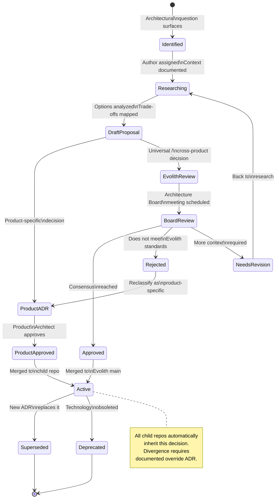
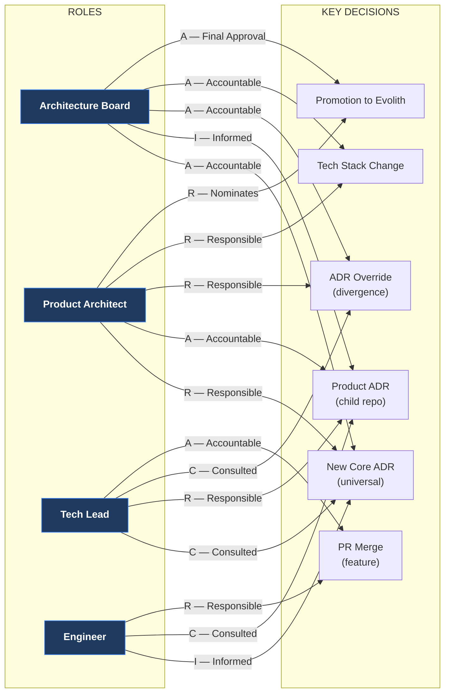
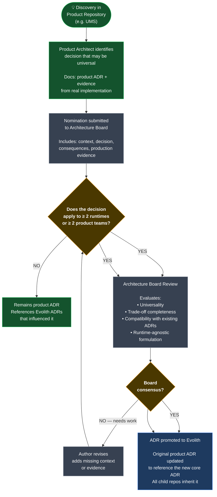
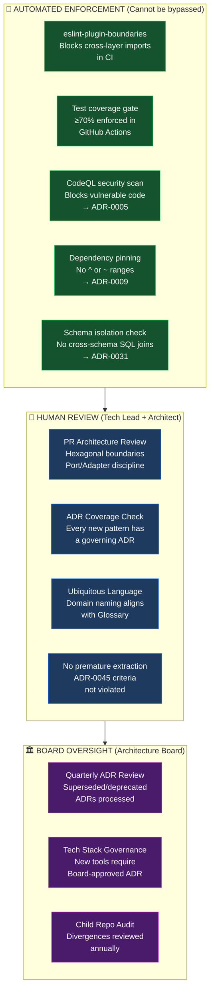

# V-06 — Governance Flow Diagram

> **Audience:** Architects, Tech Leads, Architecture Board  
> **Purpose:** Visualize the full ADR lifecycle and governance decision paths  
> **Bilingual:** [Español](./v06-governance-flow.es.md)

---

## Visual 6-A — ADR Lifecycle (Full State Machine)

---

## Visual 6-B — Who Decides What (RACI Matrix)

---

## Visual 6-C — Promotion Path: Product → Evolith

---

## Visual 6-D — Governance Enforcement Layers

---

*Part of the [Architecture Communication Strategy](../architecture-communication-strategy.md)*
