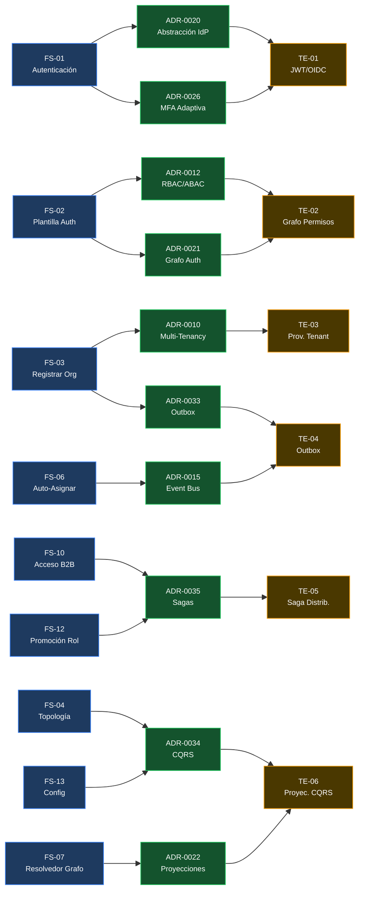
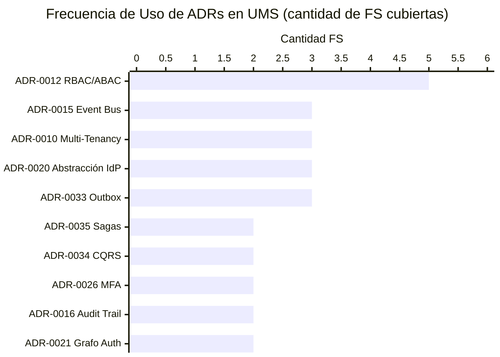
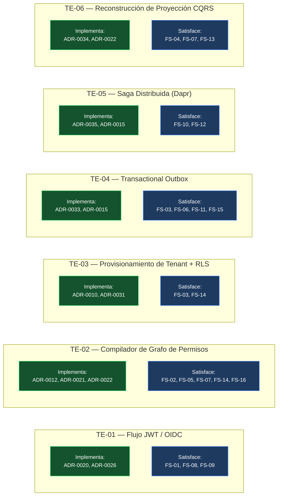

# V-07 — Visual de Trazabilidad UMS → Evolith

> **Audiencia:** Tech Leads, QA, Arquitectos  
> **Propósito:** Mostrar que cada requerimiento UMS traza a un ADR Evolith — y viceversa  
> **Bilingüe:** [English](./v07-traceability-visual.md)

---

## Visual 7-A — Heatmap de Cobertura ADR por Clúster de Dominio

```mermaid
flowchart TB
    classDef cluster fill:#0f172a,stroke:#334155,color:#aaa,font-weight:bold
    classDef fs fill:#1e3a5f,stroke:#3b82f6,color:#fff,font-size:12px
    classDef adr fill:#14532d,stroke:#22c55e,color:#fff,font-size:11px
    classDef te fill:#4a3800,stroke:#f59e0b,color:#fff,font-size:11px
    classDef hot fill:#7f1d1d,stroke:#ef4444,color:#fff,font-size:11px

    subgraph IDENTITY["🔐 CLÚSTER IDENTIDAD"]
        FS01["FS-01\nAutenticación de Usuario"]:::fs
        FS08["FS-08\nRedireccionamiento Login Hosted"]:::fs
        FS09["FS-09\nMFA / Passwordless Adaptiva"]:::fs
        ADR_ID["ADR-0020 Abstracción IdP\nADR-0026 MFA Adaptiva"]:::adr
        TE_ID["TE-01 Flujo JWT / OIDC"]:::te
        FS01 & FS08 & FS09 --> ADR_ID --> TE_ID
    end

    subgraph AUTHZ["🛡️ CLÚSTER AUTORIZACIÓN"]
        FS02["FS-02\nCrear Plantilla de Auth"]:::fs
        FS05["FS-05\nCrear Perfil / Plantilla Manual"]:::fs
        FS07["FS-07\nResolvedor Visual de Grafo"]:::fs
        FS14["FS-14\nAdministración Delegada"]:::fs
        FS16["FS-16\nPolítica de Aplicación de Acceso"]:::fs
        ADR_AZ["ADR-0012 RBAC/ABAC\nADR-0021 Grafo de Auth\nADR-0022 Proyecciones Contextuales\nADR-0023 Frontera Kernel"]:::hot
        TE_AZ["TE-02 Compilador de Grafo de Permisos"]:::te
        FS02 & FS05 & FS07 & FS14 & FS16 --> ADR_AZ --> TE_AZ
    end

    subgraph TENANT["🏢 CLÚSTER TENANCY"]
        FS03["FS-03\nRegistrar Organización"]:::fs
        FS04["FS-04\nRegistrar Topología del Sistema"]:::fs
        ADR_TN["ADR-0010 RLS Multi-Tenancy\nADR-0031 Schema por Contexto\nADR-0034 CQRS"]:::adr
        TE_TN["TE-03 Provisionamiento de Tenant\nTE-06 Reconstrucción Proyección CQRS"]:::te
        FS03 & FS04 --> ADR_TN --> TE_TN
    end

    subgraph EVENTS["⚡ CLÚSTER EVENTOS"]
        FS06["FS-06\nAsignación Auto de Plantilla"]:::fs
        FS10["FS-10\nAcceso B2B Externo / Aprobación"]:::fs
        FS11["FS-11\nCarga de Documento"]:::fs
        FS12["FS-12\nProceso de Promoción de Rol"]:::fs
        FS15["FS-15\nReglas de Notificación"]:::fs
        ADR_EV["ADR-0015 Event Bus Inyectable\nADR-0033 Transactional Outbox\nADR-0035 Sagas Distribuidas\nADR-0036 FIFO / DLQ"]:::hot
        TE_EV["TE-04 Transactional Outbox\nTE-05 Saga Distribuida (Dapr)"]:::te
        FS06 & FS10 & FS11 & FS12 & FS15 --> ADR_EV --> TE_EV
    end

    subgraph CONFIG["⚙️ CLÚSTER CONFIGURACIÓN"]
        FS13["FS-13\nConfiguración Jerárquica"]:::fs
        ADR_CF["ADR-0024 Plataforma de Config\nADR-0034 CQRS"]:::adr
        TE_CF["TE-06 Reconstrucción Proyección CQRS"]:::te
        FS13 --> ADR_CF --> TE_CF
    end
```

---

## Visual 7-B — Traza Completa FS → ADR → TE (Forward)

---

## Visual 7-C — Puntuación de Impacto ADR (ADRs Más Usados en UMS)

---

## Visual 7-D — Mapa de Cobertura de Habilitadores Técnicos

---

*Parte de la [Estrategia de Comunicación Arquitectónica](../architecture-communication-strategy.es.md)*
