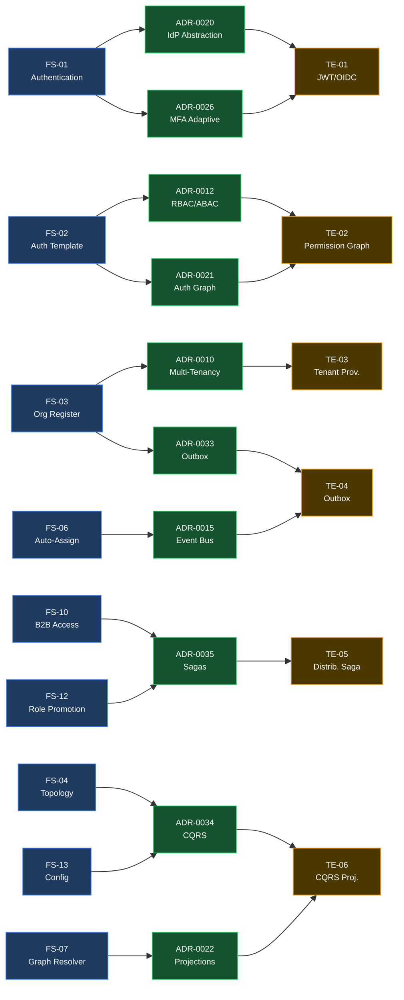
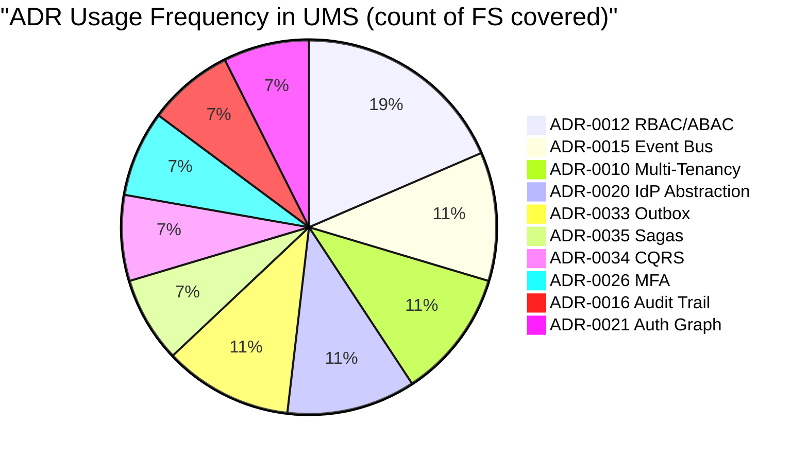
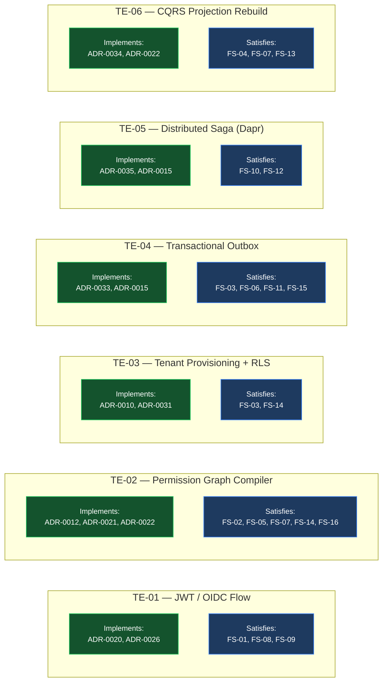

# V-07 — UMS → Evolith Traceability Visual

> **Audience:** Tech Leads, QA, Architects  
> **Purpose:** Show that every UMS requirement traces to an Evolith ADR — and back  
> **Bilingual:** [Español](./v07-traceability-visual.es.md)

---

## Visual 7-A — ADR Coverage Heatmap by Domain Cluster

```mermaid
flowchart TB
    classDef cluster fill:#0f172a,stroke:#334155,color:#aaa,font-weight:bold
    classDef fs fill:#1e3a5f,stroke:#3b82f6,color:#fff,font-size:12px
    classDef adr fill:#14532d,stroke:#22c55e,color:#fff,font-size:11px
    classDef te fill:#4a3800,stroke:#f59e0b,color:#fff,font-size:11px
    classDef hot fill:#7f1d1d,stroke:#ef4444,color:#fff,font-size:11px

    subgraph IDENTITY["🔐 IDENTITY CLUSTER"]
        FS01["FS-01\nUser Authentication"]:::fs
        FS08["FS-08\nHosted Login Redirect"]:::fs
        FS09["FS-09\nMFA / Passwordless Adaptive"]:::fs
        ADR_ID["ADR-0020 IdP Abstraction\nADR-0026 MFA Adaptive"]:::adr
        TE_ID["TE-01 JWT / OIDC Flow"]:::te
        FS01 & FS08 & FS09 --> ADR_ID --> TE_ID
    end

    subgraph AUTHZ["🛡️ AUTHORIZATION CLUSTER"]
        FS02["FS-02\nCreate Auth Template"]:::fs
        FS05["FS-05\nCreate Profile / Manual Template"]:::fs
        FS07["FS-07\nVisual Graph Resolver"]:::fs
        FS14["FS-14\nDelegated Management"]:::fs
        FS16["FS-16\nAccess Enforcement Policy"]:::fs
        ADR_AZ["ADR-0012 RBAC/ABAC\nADR-0021 Auth Graph\nADR-0022 Contextual Projections\nADR-0023 Kernel Boundary"]:::hot
        TE_AZ["TE-02 Permission Graph Compiler"]:::te
        FS02 & FS05 & FS07 & FS14 & FS16 --> ADR_AZ --> TE_AZ
    end

    subgraph TENANT["🏢 TENANCY CLUSTER"]
        FS03["FS-03\nRegister Organization"]:::fs
        FS04["FS-04\nRegister System Topology"]:::fs
        ADR_TN["ADR-0010 Multi-Tenancy RLS\nADR-0031 Schema per Context\nADR-0034 CQRS"]:::adr
        TE_TN["TE-03 Tenant Provisioning\nTE-06 CQRS Projection Rebuild"]:::te
        FS03 & FS04 --> ADR_TN --> TE_TN
    end

    subgraph EVENTS["⚡ EVENTS CLUSTER"]
        FS06["FS-06\nAuto-Assign Template"]:::fs
        FS10["FS-10\nExternal B2B Access / Approval"]:::fs
        FS11["FS-11\nDocument Upload"]:::fs
        FS12["FS-12\nRole Promotion Process"]:::fs
        FS15["FS-15\nNotification Rules"]:::fs
        ADR_EV["ADR-0015 Injectable Event Bus\nADR-0033 Transactional Outbox\nADR-0035 Distributed Sagas\nADR-0036 FIFO / DLQ"]:::hot
        TE_EV["TE-04 Transactional Outbox\nTE-05 Distributed Saga (Dapr)"]:::te
        FS06 & FS10 & FS11 & FS12 & FS15 --> ADR_EV --> TE_EV
    end

    subgraph CONFIG["⚙️ CONFIGURATION CLUSTER"]
        FS13["FS-13\nHierarchical Configuration"]:::fs
        ADR_CF["ADR-0024 Config Platform\nADR-0034 CQRS"]:::adr
        TE_CF["TE-06 CQRS Projection Rebuild"]:::te
        FS13 --> ADR_CF --> TE_CF
    end
```

---

## Visual 7-B — Full FS → ADR → TE Forward Trace

---

## Visual 7-C — ADR Impact Score (Most-Used ADRs in UMS)

---

## Visual 7-D — Technical Enabler Coverage Map

---

*Part of the [Architecture Communication Strategy](../architecture-communication-strategy.md)*
