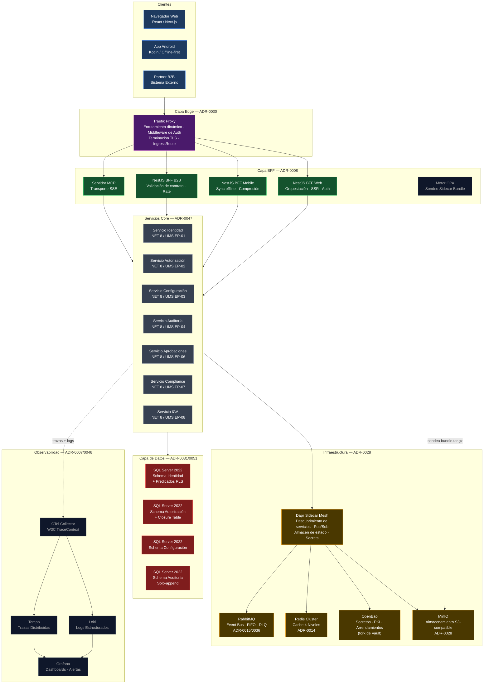
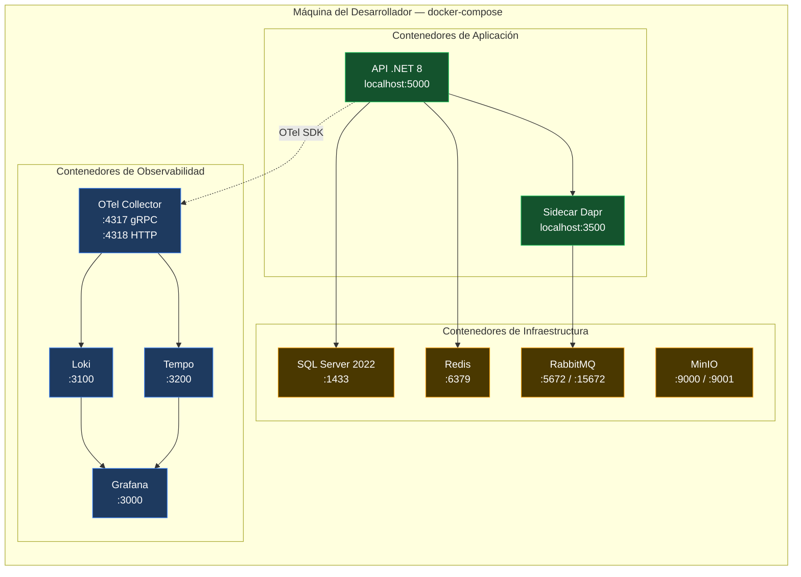
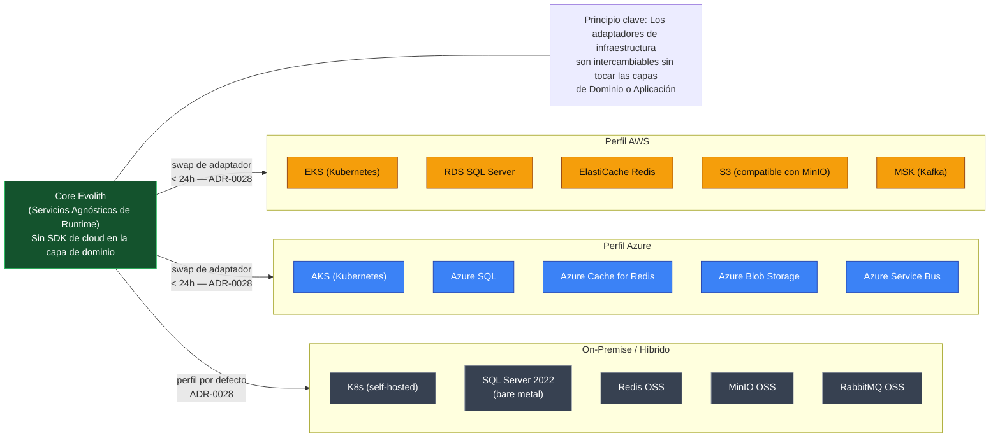
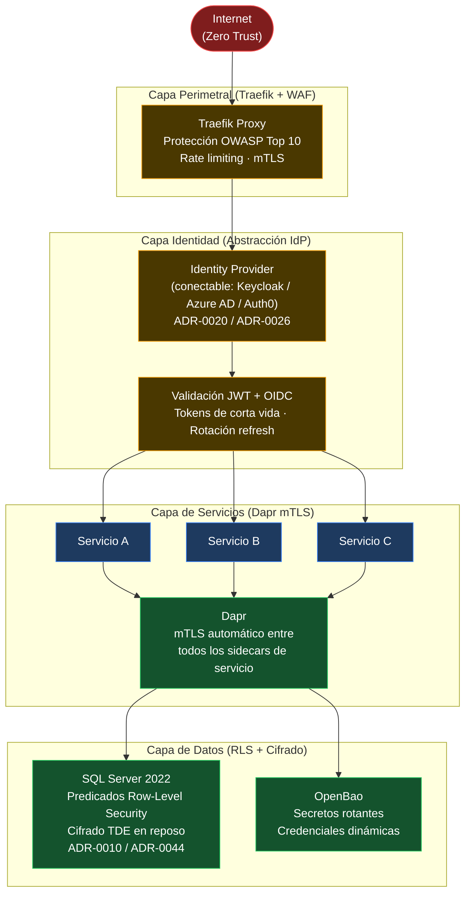
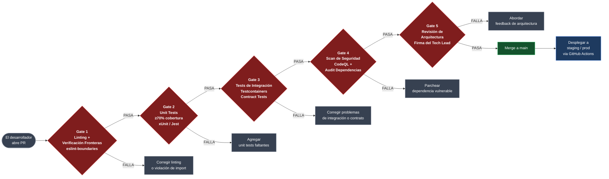

# V-08 — Mapa de Topología de Infraestructura

> **Audiencia:** DevOps, SRE, Platform Engineers  
> **Propósito:** Topología de despliegue completa — desde dev local hasta producción  
> **Bilingüe:** [English](./v08-infrastructure-topology.md)

---

## Visual 8-A — Topología de Producción Completa (Fase 2)

---

## Visual 8-B — Stack de Desarrollo Local (docker-compose)

---

## Visual 8-C — Opciones de Despliegue Multi-Cloud (Fase 3)

---

## Visual 8-D — Modelo de Perímetro de Seguridad (Zero-Trust)

---

## Visual 8-E — Gates de Calidad del Pipeline CI/CD (ADR-0005)

---

*Parte de la [Estrategia de Comunicación Arquitectónica](../architecture-communication-strategy.es.md)*
